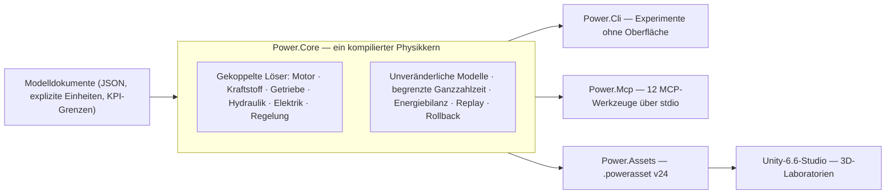

# Power!


[English](README.md) · [简体中文](README.zh-CN.md) · [Français](README.fr.md) · [Русский](README.ru.md) · [日本語](README.ja.md) · [한국어](README.ko.md) · **Deutsch** · [Español](README.es.md) · [Italiano](README.it.md) · [Português](README.pt-BR.md)

Power! ist ein Projekt zur Modellierung und Erforschung von Antriebssträngen: ein plattformübergreifender C#-Physikkern, ein Unity-3D-Studio und MCP-Schnittstellen für Agenten. Modelle, Löser, Experimente und Darstellung sind getrennte Zuständigkeiten, sodass Agenten Modelle bauen, Experimente ausführen und verzweigen sowie physikalische Nachweise über explizite Verträge prüfen können.

Das öffentliche Repository ist [Water-Run/Power](https://github.com/Water-Run/Power).

## Aufbau im Überblick



Dasselbe kompilierte Modell treibt jeden Einstiegspunkt an: CLI, MCP und das Unity-Studio importieren dieselben Dokumente und replayen dieselben Nachweise.

## Technologie

| Schicht | Version und Zuständigkeit |
|---|---|
| Unity 3D | **Unity 6.6 / 6000.6.0f1**, Desktop-Studio |
| Rendering, Eingabe, UI | **URP 17.6.0**, **Input System 1.20.0**, UI Toolkit |
| C#-Werkzeuge | **.NET 10 SDK 10.0.400 / C# 14**, Kern, CLI, Agent-Dienste, Build-Werkzeuge |
| Unity-Seitige Assemblies | **.NET Standard 2.1**, aus denselben Kern- und Asset-Quellen kompiliert |
| Agent-Transport | Offizielles **MCP C# SDK 2.2.0**, stdio, committete Sperrdateien der Abhängigkeiten |
| Native Prototypen | **Zig 0.15.2**, separate Forschungsbibliothek mit erhaltenem binären ABI |

Quellen: [Unity-Release-Notes](https://unity.com/releases/editor/whats-new/6000.6.0f1), [.NET-10-Downloads](https://dotnet.microsoft.com/en-us/download/dotnet/10.0), [MCP SDK](https://www.nuget.org/packages/ModelContextProtocol/2.2.0).

Unities eigener Compiler unterstützt C# 9 mit .NET Standard 2.1 als API-Profil. Das externe .NET SDK kompiliert modernes C# in Unity-kompatible Assemblies, und Skripte in `Unity/Assets` verwenden C#-9-Syntax. Ein Unity-Player braucht keine separate .NET-10-Installation. Siehe [Unitys Compiler-Unterstützung](https://docs.unity3d.com/6000.6/Documentation/Manual/csharp-compiler.html) und [API-Kompatibilitätsdokumentation](https://docs.unity3d.com/6000.6/Documentation/Manual/dotnet-profile-support.html).

## Bauen und Prüfen

Das gepinnte .NET SDK installieren, dann Zig installieren und vom Repository-Stamm unter Windows, macOS oder Linux ausführen:

```sh
dotnet run --file tools/Build.cs -p:UseSharedCompilation=false -- install-zig
dotnet run --file tools/Build.cs -p:UseSharedCompilation=false -- verify
```

`verify` erstellt die Lösung seriell, exportiert Unity-Modell-Assets, führt die Kern- und Agent-Prüfungen aus, treibt einen echten MCP-Serverprozess an und verifiziert die Zig-Laufzeit, Shared-Library-Hosts, das C#-P/Invoke-ABI und die ursprüngliche numerische Baseline. Berichte landen unter `artifacts/reports`.

> [!TIP]
> Ein gepinntes SDK unter `.cache/dotnet/dotnet` funktioniert ebenfalls; Caches werden nicht von Git verfolgt.

> [!IMPORTANT]
> Die Quellenprüfung lehnt C/C++-Implementierungsdateien und Header sowie Lua-Quelltext, Bytecode und Pakete ab. Halte das Repository frei davon.

Die serielle Prüfung besteht unter Windows; frühere Läufe liefern auch Linux- und macOS-Nachweise. Den Umfang jedes Laufs beschreibt [docs/VALIDATION.md](docs/VALIDATION.md). Unity-Editor-, Play-Mode-, Rendering- und IL2CPP-Validierung stehen noch aus — siehe [Unity-Validierung](#unity-validierung).

Ein Experiment direkt ausführen:

```sh
dotnet run --project src/Power.Cli -c Release -- assets/labs/electrothermal.power.json --output artifacts/reports/electrothermal.json
```

CLI-Exit-Codes sind `0` für ein bestandenes Experiment, `2` für fehlgeschlagene KPIs oder Replay-Prüfungen und `1` für ungültige Eingaben oder Ausführungsfehler.

Modelldokumente geben Einheiten, feste Nanosekunden-Ticks, Eingabeereignisse und KPI-Grenzen an. Berichte enthalten Quellen-Hashes, Modell-Fingerabdrücke, Laufzeitinformationen, Genauigkeit, Kanäle, Replay-Nachweise und Energiereziduen.

## Unity-Studio

1. `dotnet run --file tools/Build.cs -p:UseSharedCompilation=false -- build` ausführen. Das erzeugt die Core- und Assets-Assemblies in `Unity/Assets/Plugins` und Beispiel-`.powerasset`-Dateien in `Unity/Assets/Generated/Resources`.
2. Das `Unity`-Verzeichnis des Repositorys in Unity Hub hinzufügen und **6000.6.0f1** wählen.
3. Paketauflösung und Skriptimport abwarten — die erste Vorbereitung erzeugt URP- und Material-Assets.
4. `Assets/Scenes/PowerLab.unity` öffnen oder **Power > Open laboratory** wählen und in den Play Mode wechseln.

Die Szene baut Rotoren, thermische Knoten, Verbindungen und Eingabesteuerungen aus dem importierten Modell. Sie unterstützt Pause, Zurücksetzen und gespeicherte Experimente, deren Ereignisse bei exakten Simulationsticks angewendet werden. Das Standard-Elektrothermie-Experiment durchläuft eine zehnsekündige Brems- und Erholungssequenz; `ThermalNetwork.powerasset` ist ein Wärmetausch-Experiment ohne externe Eingänge. Über **Open in Studio** im Inspector eines Modell-Assets lässt es sich auswählen.

`SealedCylinder.powerasset` ergänzt ein Kompressions-/Expansions-Experiment mit schematisch bewegtem Kolben; seine Gaszustands-, Kurbelmoment- und Energiekanäle folgen derselben Modellsemantik wie CLI und MCP. Siehe die [Zylinder-Dokumentation](docs/SEALED_CYLINDER.md).

Ein weiteres Modell nach dem Build exportieren:

```sh
dotnet src/Power.Cli/bin/Release/net10.0/Power.Cli.dll export assets/labs/electrothermal.power.json --name "My laboratory" --output Unity/Assets/Models/MyLaboratory.powerasset
```

Der Importer prüft Integrität, kompiliert das Modell neu und verifiziert seinen Fingerabdruck — siehe das [Asset-Format](docs/ASSET_FORMAT.md). Ziehen zum Orbitieren, Scrollen zum Zoomen. Jedes `FixedUpdate` schreitet um höchstens 2.000 vollständige Ticks voran: 20 ms für das Standardmodell, 14 ms für das 7-ms-Thermodell. Die Physik liest nicht das `deltaTime` des Renderings, daher halten sehr fein getaktete Modelle die Echtzeit nicht garantiert ein.

## Unity-Validierung

Unity-Editor- und Play-Mode-Prüfungen sind ein separater Einstiegspunkt. `POWER_UNITY_EDITOR` auf die Editor-Programmdatei setzen und ausführen:

```sh
dotnet run --file tools/Build.cs -p:UseSharedCompilation=false -- unity-test
```

> [!WARNING]
> Nur dieser Weg zählt als echter Editor-/Play-Mode-Nachweis. Unity wurde in der aktuellen Entwicklungsumgebung noch nicht ausgeführt, ein validierter Player-Build liegt nicht vor.

## Agent-Schnittstelle

Nach dem Build den Server als stdio-MCP-Prozess eines Clients starten:

```sh
dotnet /absolute/path/to/Power/src/Power.Mcp/bin/Release/net10.0/Power.Mcp.dll
```

Der Dienst stellt zwölf Werkzeuge mit Eingabe- und Ausgabeschemas bereit:

| Werkzeug | Aufgabe |
|---|---|
| `get_capabilities` | Modelle, Grenzen, Zeit- und Revisionskonventionen entdecken. Hier beginnen. |
| `get_model_schema` | JSON Schema 2020-12 für `power.model.v1` |
| `get_example_model` | Ein editierbares synthetisches Modell samt Experiment holen (33 Beispiele) |
| `validate_model` | Modell ohne Ausführung prüfen; strukturierte Reparaturdiagnosen |
| `run_experiment` | Begrenzter Lauf ohne Oberfläche mit Batch-Replay, KPIs und Herkunft |
| `export_model_asset` | Ein portables `.powerasset` exportieren |
| `create_session` | Unabhängige Simulation anlegen; liefert Sitzungs-ID und Revision |
| `read_snapshot` | Zeit, Revision, Zustands-Hash und gewählte Ausgaben lesen |
| `set_inputs` | Eingaben zur aktuellen Simulationszeit atomar ändern |
| `step_session` | Um eine exakte Ganzzahl von Ticks vorschreiten |
| `fork_session` | Von einem exakten Zustand für kontrafaktische Experimente abzweigen |
| `close_session` | Eine Sitzung und ihren Zustand freigeben |

Die Protokollausgabe geht an stdout, Protokolle an stderr. Agenten bedienen den kopflosen Kern, ohne die Unity-UI zu steuern oder im Physikschleifenlauf einen Modellanbieter aufzurufen.

Die [Agent-API](docs/AGENT_API.md) beschreibt Client-Konfiguration und Operationsfolgen. Der Kern bietet `TryCompile`, entdeckbare Kanäle, `Fork`, Abbruch und atomares Rollback; der MCP-Arbeitsbereich ergänzt Revisionsprüfungen und kompakte Berichte.

## Modelle und Laboratorien

Die ausführbaren C#-Modelle decken heute Rotationsträgheit, elastische Wellen mit positiven oder negativen Übersetzungen, RL-Gleichstrommotoren, Momentenquellen, Wärmekapazitäten, Wärmeleitungsnetze, abgeschlossene adiabatische Zylinder sowie offene Gaskammern mit Druck-Arbeits-Kopplung über Schieber-Kurbel-Antrieb, kurbelwinkelfreigegebenen 360/720-Grad-Ventilprofilen und vorgeschriebener Vormischverbrennung mit Kraftstoff/Luft/Produkt-Transport ab. Die validierte [Gaswechselphysik](docs/GAS_EXCHANGE.md) — ideales Gas, endliches Volumen mit getrennt verfolgter Masse und innerer Energie, eine kompressible Drossel mit kritischer und unterkritischer Strömung — speist Gasnetze mit festem und variablem Volumen. Kupplungen mit Haft-/Gleitkapazität, ideelle Zahn- und Planetenradbindungen, tabellierte Drehmomentwandler und ein Hydrauliknetz mit expliziten Ventilen, Nachgiebigkeit und kurbelgetriebener Pumpenversorgung treten in dieselbe gekoppelte Lösung ein. Explizite Druckleckagen und viskose Schleppverluste modellieren Pumpenverluste; ein Gleichstrommotor kann die Pumpe über dasselbe elektrische und thermische System versorgen. Ein abgetasteter Druckregler stellt Motorspannung oder Batterie-Pulsbreite anhand des gemessenen Hydraulikdrucks ein. Endliche Ladung, Batteriewiderstand und -polarisation sowie schaltende Zusatzverbraucher speisen dieselbe Energiebilanz.

Endliche nachgiebige Flüssigkeitsleitungen versorgen nun zyklusdosierten Kraftstoff in Filme. Eine endliche Wand zahlt die Verdampfungswärme, und nur Dampf steht der vorgeschriebenen Verbrennung zur Verfügung. Ein positionsabhängiges Solenoid und ein abgetasteter Dosentreiber können eine echte Nadel bewegen, einschließlich Schließverzögerung und Sitzabprall. Ein begrenztes Pflanzen-Replay kann eine frühere Spannungsabschaltung zur Dosisverfolgung planen. Siehe [Nadelansteuerung](docs/NEEDLE_ACTUATION.md), [Flüssigeinspritzung](docs/LIQUID_FUEL_INJECTION.md) und den [Filmvertrag](docs/FUEL_FILM.md).

Ein Siebengang-Doppelkupplungs-Forschungsgraph ergänzt ungerade/gerade Eingangswellen, Rückwärtsgang, drei Abgangszweige und explizite Synchronisations-/Schaltwärme. Er nutzt dieselben Zahnrad-/Kupplungsprimitive; ein abgetasteter Zustandsautomat kann Wählhebel und gestaffelte Kraftübergabe besitzen, echte Verriegelung bestätigen und Fehler aufdecken. Siehe [das Getriebe](docs/DUAL_CLUTCH_TRANSMISSION.md) und die [Regelung](docs/DCT_CONTROL.md).

Ein Ravigneaux-Forschungsgraph mit vier Bereichen ergänzt zusammengesetzte Planetenpfade und ein Wandler-/Überbrückungsexperiment. Eine aufgelöste Variante enthält innere Planetendrehung und Bahnträgheit. Hydraulische Kolbenansteuerung versorgt die fünf Bereichselemente und die Wandlerüberbrückung. Siehe den [physikalischen Vertrag](docs/RAVIGNEAUX_TRANSMISSION.md).

> [!NOTE]
> Alle Beispielparameter sind `unverified` — Forschungswerte, keine kalibrierten Messungen.

Die folgenden Laboratorien teilen Definitionen über JSON-, CLI-, MCP- und Studio-Importe. Exporte verwenden `power.asset.v24`, Leser für ältere Assets bleiben erhalten.

<details>
<summary>Verfügbare Laboratorien (34)</summary>

| Beispielname (`get_example_model`) | Laboratorium | Was es prüft |
|---|---|---|
| `electrothermal` | `assets/labs/electrothermal.power.json` | Standardsequenz Bremsen/Erholen |
| nur CLI | `assets/labs/thermal-network.power.json` | Wärmetausch ohne externe Eingänge |
| `sealed-cylinder` | `assets/labs/sealed-cylinder.power.json` | abgeschlossene adiabatische Kompression und Expansion |
| `gas-network` | `assets/labs/gas-network.power.json` | Kammern mit festem Volumen, Drosseln, Wandwärmeverbindungen |
| `moving-cylinder` | `assets/labs/moving-cylinder.power.json` | Schleppbetrieb mit kurbelabhängigem Volumen |
| `crank-timed-cylinder` | `assets/labs/crank-timed-cylinder.power.json` | 720°-Ein-/Auslassprofile bei wechselnder Drehzahl |
| `fired-cylinder` | `assets/labs/fired-cylinder.power.json` | Vormischverbrennung mit Kraftstoff/Luft/Produkt-Transport |
| `fired-clutch` | `assets/labs/fired-clutch.power.json` | Trockenkupplung: Eingriff, Lösen, Wiedereingriff |
| `fired-planetary` | `assets/labs/fired-planetary.power.json` | Planetensatz und Schalten über Hohlradbremse |
| `fired-converter` | `assets/labs/fired-converter.power.json` | Wandlerkennlinien und geplante Überbrückung |
| `fired-hydraulic` | `assets/labs/fired-hydraulic.power.json` | ventilgespeister Druck für Schalt-/Überbrückungskupplungen |
| `fired-pump` | `assets/labs/fired-pump.power.json` | kurbelgetriebene Pumpe, nachgiebige Leitung, Druckbegrenzung |
| `fired-pump-losses` | `assets/labs/fired-pump-losses.power.json` | Pumpenleckage, Wellenschlepp und Wärme |
| `electric-pump` | `assets/labs/electric-pump.power.json` | Gleichstrommotor-Versorgung und ventilgesteuerte Druckkupplung |
| `pressure-regulated-pump` | `assets/labs/pressure-regulated-pump.power.json` | abgetastete Druckrückführung, begrenzte Motorspannung und Störungserholung |
| `battery-regulated-pump` | `assets/labs/battery-regulated-pump.power.json` | Batteriespannungseinbruch, Zusatzverbraucher und pulsweitengeregelten Druck |
| `piston-actuated-clutch` | `assets/labs/piston-actuated-clutch.power.json` | Kolbenfreiweg, Belagkontakt, Kupplungsaufnahme/-lösung und erhaltende Fluidarbeit |
| `spool-regulated-pump` | `assets/labs/spool-regulated-pump.power.json` | mechanische Druckrückführung, dosierter Bypass und Druckkupplungsaufnahme |
| `gas-accumulator-pump` | `assets/labs/gas-accumulator-pump.power.json` | endliche Gasspeicherung, Hydrauliktrennerbewegung und transiente Energierückgewinnung |
| `metered-fired-cylinder` | `assets/labs/metered-fired-cylinder.power.json` | endliche Kraftstoffleitung, Zyklusdosierung und separate Vormischverbrennung |
| `film-fired-cylinder` | `assets/labs/film-fired-cylinder.power.json` | endlicher Flüssigkeitsvorrat, wandbezahlte Verdampfung und reine Dampfverbrennung |
| `liquid-injected-cylinder` | `assets/labs/liquid-injected-cylinder.power.json` | endliche Flüssigkeitsleitung, Zykluseinspritzung, Filmnachschub und separate Verdampfung |
| `needle-actuated-cylinder` | `assets/labs/needle-actuated-cylinder.power.json` | Solenoid-/Nadeldynamik, abgetastete Dosisrückführung und beobachtbare Mehrförderung |
| `closure-compensated-cylinder` | `assets/labs/closure-compensated-cylinder.power.json` | begrenztes Schließ-Replay und Abschaltplanung auf dem physischen Tickraster |
| `dual-clutch-transmission` | `assets/labs/dual-clutch-transmission.power.json` | Anfahren, Vorauswahl, sieben Vorwärtspfade und Hoch-/Rückschaltübergaben |
| `fired-dual-clutch` | `assets/labs/fired-dual-clutch.power.json` | gezündeter Motor mit vollständigem DCT-Forschungspfad |
| `controlled-dual-clutch` | `assets/labs/controlled-dual-clutch.power.json` | abgetastete Synchronisation, gestaffelte Übergabe und echte Gangbestätigung |
| `hydraulic-ravigneaux-transmission` | `assets/labs/hydraulic-ravigneaux-transmission.power.json` | pumpengespeiste dynamische Kolbenansteuerung von fünf Bereichselementen |
| `fired-hydraulic-ravigneaux` | `assets/labs/fired-hydraulic-ravigneaux.power.json` | gezündeter Wandlerstrang mit sechs hydraulischen Stellgliedern |
| `resolved-ravigneaux-transmission` | `assets/labs/resolved-ravigneaux-transmission.power.json` | Planetendreh-/Bahnträgheit mit vier echten Verzahnungsbindungen |
| `fired-resolved-ravigneaux-converter` | `assets/labs/fired-resolved-ravigneaux-converter.power.json` | gezündeter Wandlerstrang mit aufgelöster Planetenbewegung |
| `ravigneaux-transmission` | `assets/labs/ravigneaux-transmission.power.json` | zusammengesetzte Planetenschaltungen mit vier Bereichen |
| `fired-ravigneaux-converter` | `assets/labs/fired-ravigneaux-converter.power.json` | gezündeter Motor, Wandler/Überbrückung und zusammengesetztes Getriebe |
| `controlled-fired-dual-clutch` | `assets/labs/controlled-fired-dual-clutch.power.json` | gezündeter Motor mit abgetasteter DCT-Regelung und vollem Nachweis |

</details>

`get_example_model` mit einem `name` anfordern oder direkt ausführen:

```sh
dotnet src/Power.Cli/bin/Release/net10.0/Power.Cli.dll assets/labs/<name>.power.json --output artifacts/reports/<name>.json
```

Der Build exportiert zu jedem Laboratorium ein passendes `.powerasset`. Replay-Nachweise — übereinstimmende Berichtsgrenzen, Arbeits- und Wärmesummen, Energiereziduen — sind in [docs/VALIDATION.md](docs/VALIDATION.md) und den Funktionsverträgen im [Dokumentationsindex](#dokumentation) festgehalten.

## Umfang und Grenzen

Vollständige Antriebsstränge sind das Ziel, nicht der aktuelle Stand. Noch offen:

- Vollständiges Motorverhalten: Saug-/Auslassmodellierung, Flüssigkeitspumpe/-nachfüllung, verfeinertes magnetisches/elektronisches/Einspritzverhalten, druckabhängiges Phasenverhalten, reichere Thermochemie und Zündungsregelung.
- Vollständige DCT-Stellansteuerung, AT-Topologie und Getrieberegelung (ECU/TCU).
- Gemessene Pumpenverlust- und Regelungskennlinien, gemessene Batteriechemie und BMS, gemessene Ventil-/Akkumulatordynamik.
- Kalibrierte Antriebsstränge.

Frühere native Prototypen und Tests sind als Zig in [legacy/native](legacy/native/README.md) portiert — eine separate Forschungsbibliothek; deren Funktionalität wurde nicht vollständig nach C# überführt. Die ursprünglichen C-Quellen wurden durch Zig-Portierungen ersetzt, ursprüngliche Hashes und Git-Herkunft liegen in [legacy/native/migration-manifest.json](legacy/native/migration-manifest.json). Die [native Zig-Grenze](docs/NATIVE_ZIG.md) hält das versionierte binäre ABI, ohne der C#/Unity-Anwendung eine native Abhängigkeit hinzuzufügen.

Die OEM-Recherche zu EA211 DJS + DQ200 und PSA EC5 + AT8 bleibt in [assets/samples](assets/samples), mit intakten Nachweisen und Kalibrierungsgrenzen. Fehlende OEM-Messungen bleiben fehlend.

## Dokumentation

| Bereich | Dokumente |
|---|---|
| Projekt | [Architektur](docs/ARCHITECTURE.md) · [Fahrplan](docs/ROADMAP.md) · [Entwicklungsstand](docs/DEVELOPMENT_STATUS.md) · [Validierungsakte](docs/VALIDATION.md) · [Notizen zur Motorfortsetzung](docs/NEXT_ENGINE_STEP.md) |
| Schnittstellen | [Agent-API](docs/AGENT_API.md) · [Asset-Format](docs/ASSET_FORMAT.md) · [Native Zig-Grenze](docs/NATIVE_ZIG.md) |
| Motor und Gas | [Abgeschlossener Zylinder](docs/SEALED_CYLINDER.md) · [Gasnetz](docs/GAS_NETWORK.md) · [Gaswechsel](docs/GAS_EXCHANGE.md) · [Bewegter Zylinder](docs/MOVING_CYLINDER.md) · [Ventilsteuerzeiten](docs/VALVE_TIMING.md) · [Vormischverbrennung](docs/PREMIXED_COMBUSTION.md) |
| Kraftstoff und Einspritzung | [Kraftstoffdosierung](docs/FUEL_METERING.md) · [Kraftstofffilm](docs/FUEL_FILM.md) · [Flüssigeinspritzung](docs/LIQUID_FUEL_INJECTION.md) · [Nadelansteuerung](docs/NEEDLE_ACTUATION.md) · [Schließvorhersage](docs/CLOSURE_PREDICTION.md) |
| Getriebe | [Kupplungsnetz](docs/CLUTCH_NETWORK.md) · [Kupplungsphysik](docs/CLUTCH_PHYSICS.md) · [Zahnradnetz](docs/GEAR_NETWORK.md) · [Ideale Zahnräder](docs/IDEAL_GEARS.md) · [Wandler](docs/CONVERTER_NETWORK.md) · [Doppelkupplungsgetriebe](docs/DUAL_CLUTCH_TRANSMISSION.md) · [DCT-Regelung](docs/DCT_CONTROL.md) · [Ravigneaux-Getriebe](docs/RAVIGNEAUX_TRANSMISSION.md) · [Aufgelöste Planeten](docs/RESOLVED_PLANETS.md) |
| Hydraulik | [Hydrauliknetz](docs/HYDRAULIC_NETWORK.md) · [Pumpe](docs/HYDRAULIC_PUMP.md) · [Kolben](docs/HYDRAULIC_PISTON.md) · [Schieber](docs/HYDRAULIC_SPOOL.md) · [Gasakkumulator](docs/GAS_PISTON.md) · [AT-Ansteuerung](docs/AT_HYDRAULIC_ACTUATION.md) |

Übersetzungen dieser Seite liegen daneben als `README.<locale>.md`. Die übrige Dokumentation gibt es nur auf Englisch.

## Lizenz

Ursprüngliches Power!-Material steht unter **GPL-3.0-or-later mit der Unity-Linking-Ausnahme**. Lies [COPYING.NOTICE](COPYING.NOTICE), den unveränderten [GPLv3-Text](LICENSE) und die [Ausnahme](UNITY-LINKING-EXCEPTION.md) zusammen; rechtsverbindlich ist die englische Fassung.

Die Ausnahme erlaubt die bezeichnete Unity-Kombination, während Power! und seine Änderungen unter den GPL-Anforderungen bleiben. Unity und andere Drittanbietersoftware behalten ihre eigenen Lizenzen; die Ausnahme gewährt keine Rechte ihrer Autoren — siehe [Drittanbieterhinweise](THIRD_PARTY_NOTICES.md). Erhalte die einschlägigen Lizenz-, Urheberrechts- und Hinweisdateien bei der Weitergabe von Quellen oder Binärdateien.
