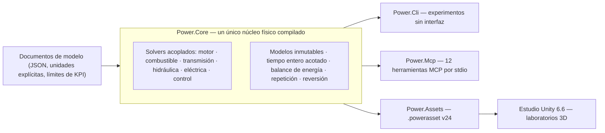

# Power!


[English](README.md) · [简体中文](README.zh-CN.md) · [Français](README.fr.md) · [Русский](README.ru.md) · [日本語](README.ja.md) · [한국어](README.ko.md) · [Deutsch](README.de.md) · **Español** · [Italiano](README.it.md) · [Português](README.pt-BR.md)

Power! es un proyecto de modelado y experimentación de grupos motopropulsores: un núcleo físico en C# multiplataforma, un estudio de Unity 3D e interfaces MCP orientadas a agentes. Los modelos, los solvers, los experimentos y la presentación son preocupaciones separadas, de modo que los agentes pueden construir modelos, ejecutar y bifurcar experimentos e inspeccionar la evidencia física mediante contratos explícitos.

El repositorio público es [Water-Run/Power](https://github.com/Water-Run/Power).

## Cómo encaja todo



El mismo modelo compilado alimenta cada punto de entrada: la CLI, el MCP y el estudio de Unity importan los mismos documentos y repiten la misma evidencia.

## Tecnología

| Capa | Versión y responsabilidad |
|---|---|
| Unity 3D | **Unity 6.6 / 6000.6.0f1**, estudio de escritorio |
| Renderizado, entrada, UI | **URP 17.6.0**, **Input System 1.20.0**, UI Toolkit |
| Herramientas C# | **.NET 10 SDK 10.0.400 / C# 14**, núcleo, CLI, servicios de agente, herramientas de build |
| Ensamblados para Unity | **.NET Standard 2.1**, compilados desde las mismas fuentes del núcleo y los assets |
| Transporte de agente | **MCP C# SDK 2.2.0** oficial, stdio, archivos de bloqueo de dependencias confirmados |
| Prototipos nativos | **Zig 0.15.2**, biblioteca de investigación separada con el ABI binario preservado |

Fuentes: [notas de la versión de Unity](https://unity.com/releases/editor/whats-new/6000.6.0f1), [descargas de .NET 10](https://dotnet.microsoft.com/en-us/download/dotnet/10.0), [MCP SDK](https://www.nuget.org/packages/ModelContextProtocol/2.2.0).

El compilador propio de Unity admite C# 9 con .NET Standard 2.1 como perfil de API. El SDK de .NET externo compila C# moderno en ensamblados compatibles con Unity, y los scripts dentro de `Unity/Assets` usan sintaxis C# 9. Un Player de Unity no necesita una instalación aparte de .NET 10. Consulta el [soporte de compiladores de Unity](https://docs.unity3d.com/6000.6/Documentation/Manual/csharp-compiler.html) y la [documentación de compatibilidad de API](https://docs.unity3d.com/6000.6/Documentation/Manual/dotnet-profile-support.html).

## Compilar y verificar

Instala el SDK de .NET fijado, luego instala Zig y ejecuta desde la raíz del repositorio en Windows, macOS o Linux:

```sh
dotnet run --file tools/Build.cs -p:UseSharedCompilation=false -- install-zig
dotnet run --file tools/Build.cs -p:UseSharedCompilation=false -- verify
```

`verify` compila la solución en serie, exporta los assets de modelos de Unity, ejecuta las comprobaciones del núcleo y del agente, ejercita un proceso real de servidor MCP y verifica el runtime de Zig, los hosts de bibliotecas compartidas, el ABI de P/Invoke de C# y la base numérica original. Los informes quedan en `artifacts/reports`.

> [!TIP]
> Un SDK fijado instalado en `.cache/dotnet/dotnet` también sirve; Git no rastrea las cachés.

> [!IMPORTANT]
> La auditoría de fuentes rechaza archivos de implementación y cabeceras C/C++, además de código fuente, bytecode y paquetes Lua. Mantén el repositorio libre de ellos.

La verificación en serie pasa en Windows; ejecuciones anteriores también dejaron evidencia en Linux y macOS. El alcance de cada ejecución está en [docs/VALIDATION.md](docs/VALIDATION.md). La validación de Unity Editor, Play Mode, renderizado e IL2CPP sigue pendiente — ver [Verificación de Unity](#verificación-de-unity).

Ejecutar un experimento directamente:

```sh
dotnet run --project src/Power.Cli -c Release -- assets/labs/electrothermal.power.json --output artifacts/reports/electrothermal.json
```

Los códigos de salida de la CLI son `0` para un experimento aprobado, `2` para KPIs o comprobaciones de repetición fallidas, y `1` para entrada inválida o errores de ejecución.

Los documentos de modelo especifican unidades, ticks fijos de nanosegundos, eventos de entrada y límites de KPI. Los informes incluyen hashes de fuentes, huellas de modelo, información del runtime, fidelidad, canales, evidencia de repetición y residuos de energía.

## Estudio de Unity

1. Ejecuta `dotnet run --file tools/Build.cs -p:UseSharedCompilation=false -- build`. Esto crea los ensamblados Core y Assets en `Unity/Assets/Plugins` y archivos `.powerasset` de ejemplo en `Unity/Assets/Generated/Resources`.
2. Añade el directorio `Unity` del repositorio a Unity Hub y selecciona **6000.6.0f1**.
3. Deja que la resolución de paquetes y la importación de scripts terminen — la primera preparación genera los assets URP y los materiales.
4. Abre `Assets/Scenes/PowerLab.unity`, o elige **Power > Open laboratory**, y entra en Play Mode.

La escena construye rotores, nodos térmicos, conexiones y controles de entrada a partir del modelo importado. Admite pausa, reinicio y experimentos guardados cuyos eventos se aplican en ticks de simulación exactos. El experimento electrotérmico por defecto ejecuta una secuencia de diez segundos de frenado y recuperación; `ThermalNetwork.powerasset` es un experimento de intercambio térmico sin entradas externas. Usa **Open in Studio** en el Inspector de un asset de modelo para seleccionarlo.

`SealedCylinder.powerasset` añade un experimento de compresión/expansión con un pistón móvil esquemático; sus canales de estado de gas, par de cigüeñal y energía usan la misma semántica de modelo que la CLI y el MCP. Consulta la [documentación del cilindro](docs/SEALED_CYLINDER.md).

Exportar otro modelo tras compilar:

```sh
dotnet src/Power.Cli/bin/Release/net10.0/Power.Cli.dll export assets/labs/electrothermal.power.json --name "My laboratory" --output Unity/Assets/Models/MyLaboratory.powerasset
```

El importador comprueba la integridad, recompila el modelo y verifica su huella — consulta el [formato de asset](docs/ASSET_FORMAT.md). Arrastra para orbitar y desplázate para hacer zoom. Cada `FixedUpdate` avanza como máximo 2 000 ticks completos: 20 ms para el modelo por defecto, 14 ms para el modelo térmico de 7 ms. La física no lee el `deltaTime` del render, así que los modelos con ticks muy finos no garantizan mantener el tiempo real.

## Verificación de Unity

Las comprobaciones de Unity Editor y Play Mode son un punto de entrada separado. Configura `POWER_UNITY_EDITOR` con el ejecutable del editor y ejecuta:

```sh
dotnet run --file tools/Build.cs -p:UseSharedCompilation=false -- unity-test
```

> [!WARNING]
> Esta es la única vía que cuenta como evidencia real de Editor/Play Mode. Unity no se ha ejercitado en el entorno de desarrollo actual, y aún no hay una build de Player validada.

## Interfaz de agente

Tras compilar, lanza el servidor como proceso MCP stdio de un cliente:

```sh
dotnet /absolute/path/to/Power/src/Power.Mcp/bin/Release/net10.0/Power.Mcp.dll
```

El servicio expone doce herramientas con esquemas de entrada y salida:

| Herramienta | Qué hace |
|---|---|
| `get_capabilities` | Descubrir modelos, límites y convenciones de tiempo y revisión. Empieza aquí. |
| `get_model_schema` | JSON Schema 2020-12 para `power.model.v1` |
| `get_example_model` | Obtener un modelo sintético editable y su experimento (33 ejemplos) |
| `validate_model` | Validar un modelo sin ejecutarlo; diagnóstico de reparación estructurado |
| `run_experiment` | Ejecución sin interfaz y acotada, con repetición por lotes, KPIs y procedencia |
| `export_model_asset` | Exportar un `.powerasset` portátil |
| `create_session` | Crear una simulación independiente; devuelve id de sesión y revisión |
| `read_snapshot` | Leer tiempo, revisión, hash de estado y salidas elegidas |
| `set_inputs` | Cambiar entradas de forma atómica en el instante de simulación actual |
| `step_session` | Avanzar un número entero exacto de ticks |
| `fork_session` | Bifurcar desde un estado exacto para experimentos contrafactuales |
| `close_session` | Liberar una sesión y su estado |

La salida del protocolo usa stdout; los registros usan stderr. Los agentes operan el núcleo sin interfaz, sin conducir la UI de Unity ni llamar a un proveedor de modelos dentro del bucle físico.

La [API de agente](docs/AGENT_API.md) documenta la configuración del cliente y las secuencias de operación. El núcleo ofrece `TryCompile`, canales descubribles, `Fork`, cancelación y reversión atómica; el espacio de trabajo MCP añade comprobaciones de revisión e informes compactos.

## Modelos y laboratorios

Los modelos C# ejecutables cubren hoy inercia rotacional, ejes elásticos con relaciones positivas o negativas, motores CC RL, fuentes de par, capacidades térmicas, redes de conducción de calor, cilindros adiabáticos cerrados y cámaras de gas abiertas con acoplamiento presión-trabajo por biela-manivela, perfiles de válvula a 360/720 grados temporizados por cigüeñal y combustión premmezclada prescrita con transporte de combustible/aire/productos. La [física de intercambio de gas](docs/GAS_EXCHANGE.md) validada — gas ideal, volumen finito rastreado por masa y energía interna independientes, y una tobera compresible con flujo bloqueado y subcrítico — alimenta redes de gas de volumen fijo y variable. Embragues con capacidades estática/deslizante, restricciones ideales de engranajes y planetarios, convertidores de par mapeados y una red hidráulica con válvulas explícitas, flexibilidad y bomba accionada por cigüeñal se unen a la misma resolución acoplada. Fugas de presión explícitas y arrastre viscoso modelan las pérdidas de bomba; un motor CC puede alimentar la bomba a través del mismo sistema eléctrico y térmico. Un regulador de presión muestreado ajusta el voltaje del motor o el ciclo de trabajo desde la presión hidráulica medida. Carga finita, resistencia y polarización de batería y cargas de accesorios conmutadas alimentan el mismo balance de energía.

Raíles de combustible líquido finitos y flexibles suministran ahora combustible dosificado por ciclo a películas. Una pared finita paga el calor de evaporación, y solo el vapor queda disponible para la combustión prescrita. Un solenoide dependiente de la posición y un controlador de dosis muestreado pueden mover una aguja real, incluidos el retardo de cierre y el rebote en el asiento. Una repetición acotada de la planta puede planificar la retirada de voltaje anticipada para seguir la dosis. Consulta el [accionamiento de aguja](docs/NEEDLE_ACTUATION.md), la [inyección líquida](docs/LIQUID_FUEL_INJECTION.md) y el [contrato de película](docs/FUEL_FILM.md).

Un grafo de investigación de doble embrague de siete marchas añade ejes de entrada impares/pares, marcha atrás, tres ramas de salida y calor explícito de sincronización y cambio. Usa los mismos primitivos de engranaje/embrague; una máquina de estados muestreada puede poseer selectores y la entrega escalonada de tracción, confirmando el bloqueo real y exponiendo fallos. Consulta la [transmisión](docs/DUAL_CLUTCH_TRANSMISSION.md) y los contratos de [control](docs/DCT_CONTROL.md).

Un grafo de investigación Ravigneaux de cuatro rangos añade caminos planetarios compuestos y un experimento de convertidor/bloqueo. Una opción resuelta incluye giro interno de los satélites e inercia orbital. La actuación por pistón hidráulico alimenta los cinco elementos de rango y el bloqueo del convertidor. Consulta el [contrato físico](docs/RAVIGNEAUX_TRANSMISSION.md).

> [!NOTE]
> Todos los parámetros de ejemplo son `unverified`: valores de investigación, no mediciones calibradas.

Los laboratorios siguientes comparten definiciones entre las importaciones JSON, CLI, MCP y Studio. Las exportaciones usan `power.asset.v24`, con lectores para assets anteriores conservados.

<details>
<summary>Laboratorios disponibles (34)</summary>

| Nombre de ejemplo (`get_example_model`) | Laboratorio | Qué ejercita |
|---|---|---|
| `electrothermal` | `assets/labs/electrothermal.power.json` | secuencia por defecto de frenado/recuperación |
| solo CLI | `assets/labs/thermal-network.power.json` | intercambio térmico sin entradas externas |
| `sealed-cylinder` | `assets/labs/sealed-cylinder.power.json` | compresión y expansión adiabáticas cerradas |
| `gas-network` | `assets/labs/gas-network.power.json` | cámaras de volumen fijo, toberas, enlaces térmicos de pared |
| `moving-cylinder` | `assets/labs/moving-cylinder.power.json` | arranque remolcado con volumen dependiente del cigüeñal |
| `crank-timed-cylinder` | `assets/labs/crank-timed-cylinder.power.json` | perfiles de admisión/escape de 720° a velocidad cambiante |
| `fired-cylinder` | `assets/labs/fired-cylinder.power.json` | quemado premmezclado con transporte de combustible/aire/productos |
| `fired-clutch` | `assets/labs/fired-clutch.power.json` | embrague en seco: acoplamiento, liberación, reacoplamiento |
| `fired-planetary` | `assets/labs/fired-planetary.power.json` | tren planetario y cambios con freno de corona |
| `fired-converter` | `assets/labs/fired-converter.power.json` | mapas de convertidor y bloqueo programado |
| `fired-hydraulic` | `assets/labs/fired-hydraulic.power.json` | presión por válvula para embragues de cambio/bloqueo |
| `fired-pump` | `assets/labs/fired-pump.power.json` | bomba por cigüeñal, línea flexible, válvula de alivio |
| `fired-pump-losses` | `assets/labs/fired-pump-losses.power.json` | fugas de bomba, arrastre de eje y calor |
| `electric-pump` | `assets/labs/electric-pump.power.json` | alimentación por motor CC y embrague de presión accionado por válvula |
| `pressure-regulated-pump` | `assets/labs/pressure-regulated-pump.power.json` | realimentación de presión muestreada, voltaje de motor acotado y recuperación de perturbaciones |
| `battery-regulated-pump` | `assets/labs/battery-regulated-pump.power.json` | caída de voltaje de batería, cargas de accesorios y presión regulada por ciclo de trabajo |
| `piston-actuated-clutch` | `assets/labs/piston-actuated-clutch.power.json` | carrera libre del pistón, contacto de pastilla, captura/liberación del embrague y trabajo de fluido conservativo |
| `spool-regulated-pump` | `assets/labs/spool-regulated-pump.power.json` | realimentación mecánica de presión, derivación dosificada y captura de embrague de presión |
| `gas-accumulator-pump` | `assets/labs/gas-accumulator-pump.power.json` | almacenamiento de gas finito, movimiento del separador hidráulico y recuperación de energía transitoria |
| `metered-fired-cylinder` | `assets/labs/metered-fired-cylinder.power.json` | raíl de combustible finito, dosis por ciclo y quemado premmezclado separado |
| `film-fired-cylinder` | `assets/labs/film-fired-cylinder.power.json` | inventario líquido finito, evaporación pagada por la pared y quemado solo de vapor |
| `liquid-injected-cylinder` | `assets/labs/liquid-injected-cylinder.power.json` | raíl líquido finito, inyección por ciclo, reposición de película y evaporación separada |
| `needle-actuated-cylinder` | `assets/labs/needle-actuated-cylinder.power.json` | dinámica solenoide/aguja, realimentación de dosis muestreada y exceso de caudal observable |
| `closure-compensated-cylinder` | `assets/labs/closure-compensated-cylinder.power.json` | repetición de cierre acotada y planificación de corte en ticks físicos |
| `dual-clutch-transmission` | `assets/labs/dual-clutch-transmission.power.json` | arranque, preselección, siete caminos adelante y entregas subiendo/bajando |
| `fired-dual-clutch` | `assets/labs/fired-dual-clutch.power.json` | motor encendido con el camino de potencia DCT de investigación completo |
| `controlled-dual-clutch` | `assets/labs/controlled-dual-clutch.power.json` | sincronización muestreada, entrega escalonada y confirmación real de marcha |
| `hydraulic-ravigneaux-transmission` | `assets/labs/hydraulic-ravigneaux-transmission.power.json` | actuación dinámica por pistón alimentada por bomba de cinco elementos de rango |
| `fired-hydraulic-ravigneaux` | `assets/labs/fired-hydraulic-ravigneaux.power.json` | tren convertidor encendido con seis actuadores hidráulicos |
| `resolved-ravigneaux-transmission` | `assets/labs/resolved-ravigneaux-transmission.power.json` | inercia de giro/órbita de satélites con cuatro restricciones de engrane reales |
| `fired-resolved-ravigneaux-converter` | `assets/labs/fired-resolved-ravigneaux-converter.power.json` | tren convertidor encendido con movimiento planetario resuelto |
| `ravigneaux-transmission` | `assets/labs/ravigneaux-transmission.power.json` | entregas planetarias compuestas de cuatro rangos subiendo/bajando |
| `fired-ravigneaux-converter` | `assets/labs/fired-ravigneaux-converter.power.json` | motor encendido, convertidor/bloqueo y transmisión compuesta |
| `controlled-fired-dual-clutch` | `assets/labs/controlled-fired-dual-clutch.power.json` | motor encendido con control DCT muestreado y evidencia completa |

</details>

Pide `get_example_model` con un `name`, o ejecuta uno directamente:

```sh
dotnet src/Power.Cli/bin/Release/net10.0/Power.Cli.dll assets/labs/<name>.power.json --output artifacts/reports/<name>.json
```

La compilación exporta un `.powerasset` correspondiente para cada laboratorio. La evidencia de repetición — límites de informe emparejados, totales de trabajo y calor, residuos de energía — está registrada en [docs/VALIDATION.md](docs/VALIDATION.md) y en los documentos de contrato por función del [índice de documentación](#documentación).

## Alcance y límites

Los grupos motopropulsores completos son el objetivo, no el estado actual. Pendiente:

- Comportamiento completo del motor: modelado de admisión/escape, bombeo/repostaje líquido, comportamiento magnético/electrónico/de pulverización refinado, comportamiento de fases dependiente de la presión, termoquímica más rica y control de encendido.
- Actuación DCT completa, topología AT y controles de transmisión (ECU/TCU).
- Mapas medidos de pérdidas y control de bomba, química de batería y BMS medidos, y dinámica medida de válvulas/acumuladores.
- Grupos motopropulsores calibrados.

Los prototipos nativos y pruebas anteriores están portados a Zig en [legacy/native](legacy/native/README.md) como biblioteca de investigación separada; su funcionalidad no se ha migrado toda a C#. Las fuentes C originales fueron sustituidas por puertos Zig, con hashes originales y procedencia Git en [legacy/native/migration-manifest.json](legacy/native/migration-manifest.json). La [frontera Zig nativa](docs/NATIVE_ZIG.md) conserva el ABI binario versionado sin añadir una dependencia nativa a la aplicación C#/Unity.

La investigación OEM para EA211 DJS + DQ200 y PSA EC5 + AT8 permanece en [assets/samples](assets/samples), con su evidencia y límites de calibración intactos. Las mediciones OEM que faltan siguen faltando.

## Documentación

| Área | Documentos |
|---|---|
| Proyecto | [Arquitectura](docs/ARCHITECTURE.md) · [Hoja de ruta](docs/ROADMAP.md) · [Estado de desarrollo](docs/DEVELOPMENT_STATUS.md) · [Registro de validación](docs/VALIDATION.md) · [Notas de reanudación del motor](docs/NEXT_ENGINE_STEP.md) |
| Interfaces | [API de agente](docs/AGENT_API.md) · [Formato de asset](docs/ASSET_FORMAT.md) · [Frontera Zig nativa](docs/NATIVE_ZIG.md) |
| Motor y gas | [Cilindro cerrado](docs/SEALED_CYLINDER.md) · [Red de gas](docs/GAS_NETWORK.md) · [Intercambio de gas](docs/GAS_EXCHANGE.md) · [Cilindro móvil](docs/MOVING_CYLINDER.md) · [Distribución](docs/VALVE_TIMING.md) · [Combustión premmezclada](docs/PREMIXED_COMBUSTION.md) |
| Combustible e inyección | [Dosificación de combustible](docs/FUEL_METERING.md) · [Película de combustible](docs/FUEL_FILM.md) · [Inyección líquida](docs/LIQUID_FUEL_INJECTION.md) · [Accionamiento de aguja](docs/NEEDLE_ACTUATION.md) · [Predicción de cierre](docs/CLOSURE_PREDICTION.md) |
| Transmisión | [Red de embragues](docs/CLUTCH_NETWORK.md) · [Física de embrague](docs/CLUTCH_PHYSICS.md) · [Red de engranajes](docs/GEAR_NETWORK.md) · [Engranajes ideales](docs/IDEAL_GEARS.md) · [Convertidor](docs/CONVERTER_NETWORK.md) · [Transmisión de doble embrague](docs/DUAL_CLUTCH_TRANSMISSION.md) · [Control DCT](docs/DCT_CONTROL.md) · [Transmisión Ravigneaux](docs/RAVIGNEAUX_TRANSMISSION.md) · [Planetarios resueltos](docs/RESOLVED_PLANETS.md) |
| Hidráulica | [Red hidráulica](docs/HYDRAULIC_NETWORK.md) · [Bomba](docs/HYDRAULIC_PUMP.md) · [Pistón](docs/HYDRAULIC_PISTON.md) · [Corredera](docs/HYDRAULIC_SPOOL.md) · [Acumulador de gas](docs/GAS_PISTON.md) · [Actuación AT](docs/AT_HYDRAULIC_ACTUATION.md) |

Las traducciones de esta página están al lado como `README.<locale>.md`. El resto de la documentación solo existe en inglés.

## Licencia

El material original de Power! está bajo **GPL-3.0-or-later con la excepción de enlazado de Unity**. Lee juntos [COPYING.NOTICE](COPYING.NOTICE), el [texto GPLv3](LICENSE) sin modificar y la [excepción](UNITY-LINKING-EXCEPTION.md); la versión inglesa es la autoritativa.

La excepción permite la combinación con Unity indicada manteniendo Power! y sus modificaciones bajo los requisitos GPL. Unity y otro software de terceros conservan sus propias licencias; la excepción no otorga derechos de sus autores — consulta los [avisos de terceros](THIRD_PARTY_NOTICES.md). Conserva los archivos de licencia, copyright y aviso aplicables al distribuir fuentes o binarios.
