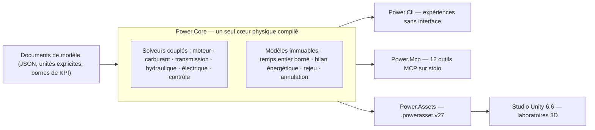

# Power!


[English](README.md) · [简体中文](README.zh-CN.md) · **Français** · [Русский](README.ru.md) · [日本語](README.ja.md) · [한국어](README.ko.md) · [Deutsch](README.de.md) · [Español](README.es.md) · [Italiano](README.it.md) · [Português](README.pt-BR.md)

Power! est un projet de modélisation et d'expérimentation de groupes motopropulseurs : un cœur physique C# multiplateforme, un studio Unity 3D et des interfaces MCP destinées aux agents. Modèles, solveurs, expériences et présentation sont des préoccupations séparées, afin que les agents puissent construire des modèles, exécuter et dériver des expériences, et inspecter les preuves physiques via des contrats explicites.

Le dépôt public est [Water-Run/Power](https://github.com/Water-Run/Power).

## Vue d'ensemble



Le même modèle compilé alimente chaque point d'entrée : la CLI, le MCP et le studio Unity importent les mêmes documents et rejouent les mêmes preuves.

## Technologies

| Couche | Version et responsabilité |
|---|---|
| Unity 3D | **Unity 6.6 / 6000.6.0f1**, studio de bureau |
| Rendu, entrées, UI | **URP 17.6.0**, **Input System 1.20.0**, UI Toolkit |
| Outils C# | **.NET 10 SDK 10.0.400 / C# 14**, cœur, CLI, services agent, outils de build |
| Assemblys pour Unity | **.NET Standard 2.1**, compilés depuis les mêmes sources du cœur et des assets |
| Transport agent | **MCP C# SDK 2.2.0** officiel, stdio, fichiers de verrouillage de dépendances versionnés |
| Prototypes natifs | **Zig 0.15.2**, bibliothèque de recherche séparée avec l'ABI binaire préservée |

Sources : [notes de version Unity](https://unity.com/releases/editor/whats-new/6000.6.0f1), [téléchargements .NET 10](https://dotnet.microsoft.com/en-us/download/dotnet/10.0), [SDK MCP](https://www.nuget.org/packages/ModelContextProtocol/2.2.0).

Le compilateur intégré de Unity prend en charge C# 9 avec .NET Standard 2.1 comme profil d'API. Le SDK .NET externe compile du C# moderne en assemblys compatibles Unity, et les scripts dans `Unity/Assets` utilisent la syntaxe C# 9. Un Player Unity n'a pas besoin d'une installation .NET 10 séparée. Voir [la prise en charge du compilateur Unity](https://docs.unity3d.com/6000.6/Documentation/Manual/csharp-compiler.html) et [la documentation de compatibilité API](https://docs.unity3d.com/6000.6/Documentation/Manual/dotnet-profile-support.html).

## Construire et vérifier

Installez le SDK .NET épinglé, puis installez Zig et exécutez depuis la racine du dépôt sous Windows, macOS ou Linux :

```sh
dotnet run --file tools/Build.cs -p:UseSharedCompilation=false -- install-zig
dotnet run --file tools/Build.cs -p:UseSharedCompilation=false -- verify
```

`verify` construit la solution en série, exporte les assets de modèles Unity, exécute les vérifications du cœur et de l'agent, pilote un véritable processus serveur MCP et vérifie le runtime Zig, les hôtes de bibliothèques partagées, l'ABI P/Invoke C# et la base numérique d'origine. Les rapports arrivent sous `artifacts/reports`.

> [!TIP]
> Un SDK épinglé installé à `.cache/dotnet/dotnet` fonctionne aussi ; les caches ne sont pas suivis par Git.

> [!IMPORTANT]
> L'audit des sources rejette les fichiers d'implémentation et d'en-têtes C/C++, ainsi que le code source, le bytecode et les paquets Lua. Gardez le dépôt libre de ces contenus.

La vérification en série passe sous Windows ; des exécutions antérieures couvrent aussi Linux et macOS. Voir [docs/VALIDATION.fr.md](docs/VALIDATION.fr.md) pour le périmètre de chaque exécution. La validation Unity Editor, Play Mode, rendu et IL2CPP reste en attente — voir [Vérification Unity](#vérification-unity).

Exécuter directement une expérience :

```sh
dotnet run --project src/Power.Cli -c Release -- assets/labs/electrothermal.power.json --output artifacts/reports/electrothermal.json
```

Les codes de sortie de la CLI sont `0` pour une expérience réussie, `2` pour des KPI ou des rejeus échoués, et `1` pour une entrée invalide ou des erreurs d'exécution.

Les documents de modèle précisent les unités, les ticks fixes en nanosecondes, les événements d'entrée et les bornes de KPI. Les rapports contiennent les empreintes des sources, les empreintes de modèle, les informations d'exécution, la fidélité, les canaux, les preuves de rejeu et les résidus d'énergie.

## Studio Unity

1. Exécutez `dotnet run --file tools/Build.cs -p:UseSharedCompilation=false -- build`. Cela crée les assemblys Core et Assets dans `Unity/Assets/Plugins` et des exemples `.powerasset` dans `Unity/Assets/Generated/Resources`.
2. Ajoutez le répertoire `Unity` du dépôt à Unity Hub et sélectionnez **6000.6.0f1**.
3. Laissez la résolution des paquets et l'import des scripts se terminer — la première préparation génère les assets URP et matériaux.
4. Ouvrez `Assets/Scenes/PowerLab.unity`, ou choisissez **Power > Open laboratory**, puis entrez en Play Mode.

La scène construit des rotors, des nœuds thermiques, des connexions et des contrôles d'entrée depuis le modèle importé. Elle prend en charge la pause, la réinitialisation et des expériences enregistrées dont les événements s'appliquent à des ticks de simulation exacts. L'expérience électrothermique par défaut déroule une séquence de freinage et de récupération de dix secondes ; `ThermalNetwork.powerasset` est une expérience d'échange thermique sans entrées externes. Utilisez **Open in Studio** dans l'Inspector d'un asset de modèle pour la sélectionner.

`SealedCylinder.powerasset` ajoute une expérience de compression/détente avec un piston mobile schématique ; ses canaux d'état gazeux, de couple au vilebrequin et d'énergie suivent la même sémantique que la CLI et le MCP. Voir [la documentation du cylindre](docs/SEALED_CYLINDER.fr.md).

Exporter un autre modèle après la construction :

```sh
dotnet src/Power.Cli/bin/Release/net10.0/Power.Cli.dll export assets/labs/electrothermal.power.json --name "My laboratory" --output Unity/Assets/Models/MyLaboratory.powerasset
```

L'importateur vérifie l'intégrité, recompile le modèle et contrôle son empreinte — voir [le format d'asset](docs/ASSET_FORMAT.fr.md). Glissez pour orbiter, faites défiler pour zoomer. Chaque `FixedUpdate` avance d'au plus 2 000 ticks complets : 20 ms pour le modèle par défaut, 14 ms pour le modèle thermique à 7 ms. La physique ne lit pas le `deltaTime` du rendu, donc les modèles à ticks très fins ne garantissent pas le temps réel.

## Vérification Unity

Les vérifications Unity Editor et Play Mode sont un point d'entrée séparé. Définissez `POWER_UNITY_EDITOR` vers l'exécutable de l'éditeur et exécutez :

```sh
dotnet run --file tools/Build.cs -p:UseSharedCompilation=false -- unity-test
```

> [!WARNING]
> C'est la seule voie qui compte comme preuve réelle d'Editor/Play Mode. Unity n'a pas encore été exercé dans l'environnement de développement actuel, et aucun build de Player validé n'est disponible.

## Interface agent

Après la construction, lancez le serveur comme processus MCP stdio d'un client :

```sh
dotnet /absolute/path/to/Power/src/Power.Mcp/bin/Release/net10.0/Power.Mcp.dll
```

Le service expose douze outils avec schémas d'entrée et de sortie :

| Outil | Rôle |
|---|---|
| `get_capabilities` | Découvrir les modèles, les limites, les conventions de temps et de révision. Commencez ici. |
| `get_model_schema` | JSON Schema 2020-12 pour `power.model.v1` |
| `get_example_model` | Obtenir un modèle synthétique modifiable et son expérience (33 exemples) |
| `validate_model` | Valider un modèle sans l'exécuter ; diagnostics de réparation structurés |
| `run_experiment` | Exécution sans interface bornée, avec rejeu par lots, KPI et provenance |
| `export_model_asset` | Exporter un `.powerasset` portable |
| `create_session` | Créer une simulation indépendante ; renvoie l'id de session et la révision |
| `read_snapshot` | Lire l'heure, la révision, l'empreinte d'état et les sorties choisies |
| `set_inputs` | Modifier les entrées atomiquement à l'instant de simulation courant |
| `step_session` | Avancer d'un nombre entier exact de ticks |
| `fork_session` | Dériver depuis un état exact pour des expériences contrefactuelles |
| `close_session` | Libérer une session et son état |

La sortie du protocole passe par stdout ; les journaux par stderr. Les agents pilotent le cœur sans interface, sans conduire l'UI Unity ni appeler un fournisseur de modèle dans la boucle physique.

[L'API agent](docs/AGENT_API.fr.md) documente la configuration client et les séquences d'opérations. Le cœur fournit `TryCompile`, des canaux découvrables, `Fork`, l'annulation et le rollback atomique ; l'espace de travail MCP ajoute des contrôles de révision et des rapports compacts.

## Modèles et laboratoires

Les modèles C# exécutables couvrent aujourd'hui l'inertie en rotation, les arbres élastiques à rapports positifs ou négatifs, les moteurs CC RL, les sources de couple, les capacités thermiques, les réseaux de conduction thermique, les cylindres adiabatiques fermés, et les chambres à gaz ouvertes avec couplage pression-travail par système bielle-manivelle, profils de soupapes calés sur le vilebrequin à 360/720 degrés et combustion prémélangée prescrite avec transport carburant/air/produits. La [physique d'échange gazeux](docs/GAS_EXCHANGE.fr.md) validée — gaz parfait, volume fini suivi par masse et énergie interne indépendantes, orifice compressible en flux sonique ou sous-critique — alimente les réseaux gazeux à volume fixe et variable. Des embrayages à capacités statique/glissante, des contraintes d'engrenages et planétaires idéaux, des convertisseurs de couple cartographiés et un réseau hydraulique à vannes explicites, compliance et pompe entraînée par vilebrequin rejoignent la même résolution couplée. Fuites de pression explicites et traînée visqueuse modélisent les pertes de pompe ; un moteur CC peut alimenter la pompe via le même système électrique et thermique. Un régulateur de pression échantillonné ajuste la tension moteur ou le rapport cyclique depuis la pression hydraulique mesurée. Charge finie, résistance et polarisation de batterie et charges accessoires commutées alimentent le même bilan énergétique.

Des rampes carburant liquides finies et souples fournissent maintenant un carburant dosé par cycle vers des films. Une paroi finie paie la chaleur d'évaporation, et seule la vapeur participe à la combustion prescrite. Un solénoïde dépendant de la position et un pilote de dose échantillonné peuvent déplacer une vraie aiguille, retard de fermeture et rebond de siège compris. Un rejeu plant borné peut planifier une coupure de tension anticipée pour suivre la dose. Voir [l'actionnement d'aiguille](docs/NEEDLE_ACTUATION.fr.md), [l'injection liquide](docs/LIQUID_FUEL_INJECTION.fr.md) et [le contrat de film](docs/FUEL_FILM.fr.md).

Un graphe de recherche double embrayage à sept rapports ajoute des arbres d'entrée impairs/pairs, la marche arrière, trois branches de sortie et une chaleur de synchronisation/passage explicite. Il utilise les mêmes primitives engrenages/embrayages ; une machine à états échantillonnée peut posséder les sélecteurs et la passation de couple étagée, confirmant le verrouillage réel et exposant les défauts. Voir [la transmission](docs/DUAL_CLUTCH_TRANSMISSION.fr.md) et les contrats de [contrôle](docs/DCT_CONTROL.fr.md).

Un graphe de recherche Ravigneaux à quatre plages ajoute des chemins planétaires composés et une expérience convertisseur/verrouillage. Une option résolue inclut la rotation interne des planétaires et l'inertie orbitale. L'actionnement par piston hydraulique fournit les cinq éléments de plage et le verrouillage de convertisseur. Voir [le contrat physique](docs/RAVIGNEAUX_TRANSMISSION.fr.md).

> [!NOTE]
> Tous les paramètres d'exemple sont `unverified` — des valeurs de recherche, pas des mesures calibrées.

Les laboratoires ci-dessous partagent leurs définitions entre imports JSON, CLI, MCP et Studio. Les exports utilisent `power.asset.v27`, avec conservation des lecteurs pour les assets antérieurs.

<details>
<summary>Laboratoires disponibles (34)</summary>

| Nom d'exemple (`get_example_model`) | Laboratoire | Ce qu'il exerce |
|---|---|---|
| `electrothermal` | `assets/labs/electrothermal.power.json` | séquence freinage/récupération par défaut |
| CLI seulement | `assets/labs/thermal-network.power.json` | échange thermique sans entrées externes |
| `sealed-cylinder` | `assets/labs/sealed-cylinder.power.json` | compression et détente adiabatiques fermées |
| `gas-network` | `assets/labs/gas-network.power.json` | chambres à volume fixe, orifices, liaisons thermiques de paroi |
| `moving-cylinder` | `assets/labs/moving-cylinder.power.json` | moteur au ralenti à volume dépendant du vilebrequin |
| `crank-timed-cylinder` | `assets/labs/crank-timed-cylinder.power.json` | profils admission/échappement 720° à vitesse variable |
| `fired-cylinder` | `assets/labs/fired-cylinder.power.json` | combustion prémélangée avec transport carburant/air/produits |
| `fired-clutch` | `assets/labs/fired-clutch.power.json` | embrayage sec : engagement, relâchement, réengagement |
| `fired-planetary` | `assets/labs/fired-planetary.power.json` | train planétaire et passages au frein de couronne |
| `fired-converter` | `assets/labs/fired-converter.power.json` | cartes de convertisseur et verrouillage planifié |
| `fired-hydraulic` | `assets/labs/fired-hydraulic.power.json` | pression par vanne pour embrayages de passage/verrouillage |
| `fired-pump` | `assets/labs/fired-pump.power.json` | pompe entraînée au vilebrequin, ligne souple, sécurité |
| `fired-pump-losses` | `assets/labs/fired-pump-losses.power.json` | fuites de pompe, traînée d'arbre et chaleur |
| `electric-pump` | `assets/labs/electric-pump.power.json` | alimentation par moteur CC et embrayage à pression piloté par vanne |
| `pressure-regulated-pump` | `assets/labs/pressure-regulated-pump.power.json` | retour de pression échantillonné, tension moteur bornée et récupération de perturbation |
| `battery-regulated-pump` | `assets/labs/battery-regulated-pump.power.json` | chute de tension batterie, charges accessoires et pression régulée en rapport cyclique |
| `piston-actuated-clutch` | `assets/labs/piston-actuated-clutch.power.json` | course libre du piston, contact des garnitures, capture/libération d'embrayage et travail de fluide conservatif |
| `spool-regulated-pump` | `assets/labs/spool-regulated-pump.power.json` | retour mécanique de pression, dérivation dosée et capture d'embrayage à pression |
| `gas-accumulator-pump` | `assets/labs/gas-accumulator-pump.power.json` | stockage gaz fini, mouvement de séparateur hydraulique et récupération d'énergie transitoire |
| `metered-fired-cylinder` | `assets/labs/metered-fired-cylinder.power.json` | rampe carburant finie, dose par cycle et combustion prémélangée séparée |
| `film-fired-cylinder` | `assets/labs/film-fired-cylinder.power.json` | inventaire liquide fini, évaporation payée par la paroi et combustion vapeur seule |
| `liquid-injected-cylinder` | `assets/labs/liquid-injected-cylinder.power.json` | rampe liquide finie, injection par cycle, réalimentation du film et évaporation séparée |
| `needle-actuated-cylinder` | `assets/labs/needle-actuated-cylinder.power.json` | dynamique solénoïde/aiguille, retour de dose échantillonné et excès de débit observable |
| `closure-compensated-cylinder` | `assets/labs/closure-compensated-cylinder.power.json` | rejeu de fermeture borné et planification de coupure sur tick physique |
| `dual-clutch-transmission` | `assets/labs/dual-clutch-transmission.power.json` | départ, présélection, sept chemins avant et passations montée/descente |
| `fired-dual-clutch` | `assets/labs/fired-dual-clutch.power.json` | moteur allumé avec le chemin de puissance DCT de recherche complet |
| `controlled-dual-clutch` | `assets/labs/controlled-dual-clutch.power.json` | synchronisation échantillonnée, passation étagée et confirmation réelle du rapport |
| `hydraulic-ravigneaux-transmission` | `assets/labs/hydraulic-ravigneaux-transmission.power.json` | actionnement dynamique par piston pompé de cinq éléments de plage |
| `fired-hydraulic-ravigneaux` | `assets/labs/fired-hydraulic-ravigneaux.power.json` | train convertisseur allumé avec six actionneurs hydrauliques |
| `resolved-ravigneaux-transmission` | `assets/labs/resolved-ravigneaux-transmission.power.json` | inertie de rotation/orbite des planétaires avec quatre contraintes d'engrènement réelles |
| `fired-resolved-ravigneaux-converter` | `assets/labs/fired-resolved-ravigneaux-converter.power.json` | train convertisseur allumé avec mouvement planétaire résolu |
| `ravigneaux-transmission` | `assets/labs/ravigneaux-transmission.power.json` | passations montée/descente planétaires composées à quatre plages |
| `fired-ravigneaux-converter` | `assets/labs/fired-ravigneaux-converter.power.json` | moteur allumé, convertisseur/verrouillage et transmission composée |
| `controlled-fired-dual-clutch` | `assets/labs/controlled-fired-dual-clutch.power.json` | moteur allumé avec contrôle DCT échantillonné et preuves complètes |

</details>

Demandez `get_example_model` avec un `name`, ou exécutez directement :

```sh
dotnet src/Power.Cli/bin/Release/net10.0/Power.Cli.dll assets/labs/<name>.power.json --output artifacts/reports/<name>.json
```

La construction exporte un `.powerasset` correspondant pour chaque laboratoire. Les preuves de rejeu — bornes de rapport appariées, totaux de travail et de chaleur, résidus d'énergie — sont consignées dans [docs/VALIDATION.fr.md](docs/VALIDATION.fr.md) et les documents de contrat par fonction listés dans [l'index de documentation](#documentation).

## Périmètre et limites

Des groupes motopropulseurs complets sont l'objectif, pas l'état actuel. Encore ouvert :

- Comportement moteur complet : modélisation admission/échappement, pompage/ravitaillement liquide, comportement magnétique/électronique/pulvérisation affiné, phases dépendant de la pression, thermochimie plus riche et contrôle d'allumage.
- Actionnement DCT complet, topologie AT et contrôles de transmission (ECU/TCU).
- Cartes mesurées de pertes et de contrôle de pompe, chimie de batterie et BMS mesurés, dynamiques mesurées de vannes/accumulateurs.
- Groupes motopropulseurs calibrés.

Les prototypes natifs antérieurs et leurs tests sont portés en Zig dans [legacy/native](legacy/native/README.md) comme bibliothèque de recherche séparée ; leurs fonctionnalités ne sont pas toutes migrées en C#. Les sources C d'origine ont été remplacées par des ports Zig, avec les hachages d'origine et la provenance Git dans [legacy/native/migration-manifest.json](legacy/native/migration-manifest.json). [La frontière Zig native](docs/NATIVE_ZIG.fr.md) conserve l'ABI binaire versionnée sans ajouter de dépendance native à l'application C#/Unity.

La recherche OEM pour EA211 DJS + DQ200 et PSA EC5 + AT8 reste dans [assets/samples](assets/samples), avec ses preuves et ses frontières de calibration intactes. Les mesures OEM manquantes restent manquantes.

## Documentation

| Domaine | Documents |
|---|---|
| Projet | [Architecture](docs/ARCHITECTURE.fr.md) · [Feuille de route](docs/ROADMAP.fr.md) · [État du développement](docs/DEVELOPMENT_STATUS.fr.md) · [Registre de validation](docs/VALIDATION.fr.md) · [Notes de reprise moteur](docs/NEXT_ENGINE_STEP.fr.md) |
| Interfaces | [API agent](docs/AGENT_API.fr.md) · [Format d'asset](docs/ASSET_FORMAT.fr.md) · [Frontière Zig native](docs/NATIVE_ZIG.fr.md) |
| Moteur et gaz | [Cylindre fermé](docs/SEALED_CYLINDER.fr.md) · [Réseau gazeux](docs/GAS_NETWORK.fr.md) · [Échange gazeux](docs/GAS_EXCHANGE.fr.md) · [Cylindre mobile](docs/MOVING_CYLINDER.fr.md) · [Calage des soupapes](docs/VALVE_TIMING.fr.md) · [Combustion prémélangée](docs/PREMIXED_COMBUSTION.fr.md) |
| Carburant et injection | [Dosage carburant](docs/FUEL_METERING.fr.md) · [Film carburant](docs/FUEL_FILM.fr.md) · [Injection liquide](docs/LIQUID_FUEL_INJECTION.fr.md) · [Actionnement d'aiguille](docs/NEEDLE_ACTUATION.fr.md) · [Prédiction de fermeture](docs/CLOSURE_PREDICTION.fr.md) |
| Transmission | [Réseau d'embrayages](docs/CLUTCH_NETWORK.fr.md) · [Physique d'embrayage](docs/CLUTCH_PHYSICS.fr.md) · [Réseau d'engrenages](docs/GEAR_NETWORK.fr.md) · [Engrenages idéaux](docs/IDEAL_GEARS.fr.md) · [Convertisseur](docs/CONVERTER_NETWORK.fr.md) · [Transmission double embrayage](docs/DUAL_CLUTCH_TRANSMISSION.fr.md) · [Contrôle DCT](docs/DCT_CONTROL.fr.md) · [Transmission Ravigneaux](docs/RAVIGNEAUX_TRANSMISSION.fr.md) · [Planétaires résolus](docs/RESOLVED_PLANETS.fr.md) |
| Hydraulique | [Réseau hydraulique](docs/HYDRAULIC_NETWORK.fr.md) · [Pompe](docs/HYDRAULIC_PUMP.fr.md) · [Piston](docs/HYDRAULIC_PISTON.fr.md) · [Coulisseau](docs/HYDRAULIC_SPOOL.fr.md) · [Accumulateur à gaz](docs/GAS_PISTON.fr.md) · [Actionnement AT](docs/AT_HYDRAULIC_ACTUATION.fr.md) |

Les traductions de cette page se trouvent à côté sous `README.<locale>.md`. Chaque document de [l'index](docs/README.fr.md) a les mêmes neuf traductions.

## Licence

Les éléments Power! d'origine sont sous **GPL-3.0-or-later avec l'exception de liaison Unity**. Lisez ensemble [COPYING.NOTICE](COPYING.NOTICE), le [texte GPLv3](LICENSE) non modifié et [l'exception](UNITY-LINKING-EXCEPTION.md) ; la version anglaise fait foi.

L'exception autorise la combinaison Unity spécifiée tout en maintenant Power! et ses modifications sous les exigences GPL. Unity et les autres logiciels tiers conservent leurs licences ; l'exception n'accorde aucun droit détenu par leurs auteurs — voir [les avis tiers](THIRD_PARTY_NOTICES.md). Conservez les fichiers de licence, de droit d'auteur et d'avis applicables lors de la distribution de sources ou de binaires.
