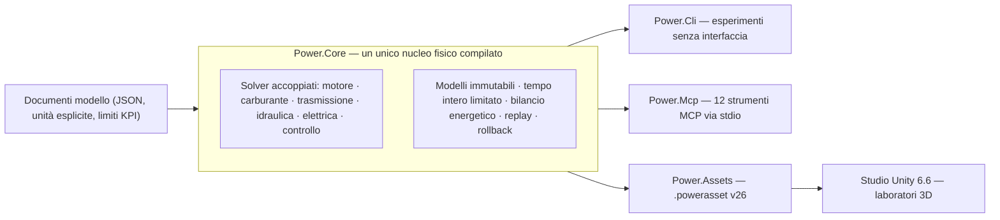

# Power!


[English](README.md) · [简体中文](README.zh-CN.md) · [Français](README.fr.md) · [Русский](README.ru.md) · [日本語](README.ja.md) · [한국어](README.ko.md) · [Deutsch](README.de.md) · [Español](README.es.md) · **Italiano** · [Português](README.pt-BR.md)

Power! è un progetto di modellazione e sperimentazione di gruppi motopropulsori: un nucleo fisico in C# multipiattaforma, uno studio Unity 3D e interfacce MCP pensate per gli agenti. Modelli, solver, esperimenti e presentazione sono responsabilità separate, così gli agenti possono costruire modelli, eseguire e ramificare esperimenti ed esaminare le evidenze fisiche attraverso contratti espliciti.

Il repository pubblico è [Water-Run/Power](https://github.com/Water-Run/Power).

## Come si incastra tutto



Lo stesso modello compilato alimenta ogni punto di ingresso: CLI, MCP e lo studio Unity importano gli stessi documenti e replicano le stesse evidenze.

## Tecnologia

| Livello | Versione e responsabilità |
|---|---|
| Unity 3D | **Unity 6.6 / 6000.6.0f1**, studio desktop |
| Rendering, input, UI | **URP 17.6.0**, **Input System 1.20.0**, UI Toolkit |
| Strumenti C# | **.NET 10 SDK 10.0.400 / C# 14**, nucleo, CLI, servizi agente, strumenti di build |
| Assembly per Unity | **.NET Standard 2.1**, compilati dalle stesse sorgenti di nucleo e asset |
| Trasporto agente | **MCP C# SDK 2.2.0** ufficiale, stdio, file di lock delle dipendenze versionati |
| Prototipi nativi | **Zig 0.15.2**, libreria di ricerca separata con l'ABI binaria preservata |

Fonti: [note di rilascio Unity](https://unity.com/releases/editor/whats-new/6000.6.0f1), [download .NET 10](https://dotnet.microsoft.com/en-us/download/dotnet/10.0), [MCP SDK](https://www.nuget.org/packages/ModelContextProtocol/2.2.0).

Il compilatore di Unity supporta C# 9 con .NET Standard 2.1 come profilo API. L'SDK .NET esterno compila il C# moderno in assembly compatibili con Unity, e gli script in `Unity/Assets` usano la sintassi C# 9. Un Unity Player non richiede un'installazione separata di .NET 10. Vedi il [supporto dei compilatori Unity](https://docs.unity3d.com/6000.6/Documentation/Manual/csharp-compiler.html) e la [documentazione di compatibilità API](https://docs.unity3d.com/6000.6/Documentation/Manual/dotnet-profile-support.html).

## Compilare e verificare

Installa l'SDK .NET fissato, poi installa Zig ed esegui dalla radice del repository su Windows, macOS o Linux:

```sh
dotnet run --file tools/Build.cs -p:UseSharedCompilation=false -- install-zig
dotnet run --file tools/Build.cs -p:UseSharedCompilation=false -- verify
```

`verify` compila la soluzione in serie, esporta gli asset modello di Unity, esegue i controlli del nucleo e dell'agente, solleva un vero processo server MCP e verifica il runtime Zig, gli host delle librerie condivise, l'ABI P/Invoke di C# e la baseline numerica originale. I report finiscono in `artifacts/reports`.

> [!TIP]
> Un SDK fissato installato in `.cache/dotnet/dotnet` funziona anch'esso; Git non traccia le cache.

> [!IMPORTANT]
> L'audit dei sorgenti rifiuta file di implementazione e header C/C++, oltre a codice sorgente, bytecode e pacchetti Lua. Mantieni il repository libero da questi contenuti.

La verifica in serie passa su Windows; esecuzioni precedenti hanno lasciato evidenze anche su Linux e macOS. L'ambito di ogni esecuzione è in [docs/VALIDATION.it.md](docs/VALIDATION.it.md). La validazione di Unity Editor, Play Mode, rendering e IL2CPP resta in sospeso — vedi [Verifica Unity](#verifica-unity).

Eseguire direttamente un esperimento:

```sh
dotnet run --project src/Power.Cli -c Release -- assets/labs/electrothermal.power.json --output artifacts/reports/electrothermal.json
```

I codici di uscita della CLI sono `0` per un esperimento superato, `2` per KPI o controlli di replay falliti e `1` per input non valido o errori di esecuzione.

I documenti modello specificano unità, tick fissi in nanosecondi, eventi di input e limiti KPI. I report includono hash dei sorgenti, impronte del modello, informazioni di runtime, fedeltà, canali, evidenze di replay e residui energetici.

## Studio Unity

1. Esegui `dotnet run --file tools/Build.cs -p:UseSharedCompilation=false -- build`. Questo crea gli assembly Core e Assets in `Unity/Assets/Plugins` e file `.powerasset` di esempio in `Unity/Assets/Generated/Resources`.
2. Aggiungi la directory `Unity` del repository a Unity Hub e seleziona **6000.6.0f1**.
3. Lascia finire la risoluzione dei pacchetti e l'importazione degli script — la prima preparazione genera gli asset URP e i materiali.
4. Apri `Assets/Scenes/PowerLab.unity`, oppure scegli **Power > Open laboratory**, poi entra in Play Mode.

La scena costruisce rotori, nodi termici, connessioni e controlli di input dal modello importato. Supporta pausa, reset ed esperimenti salvati con eventi applicati a tick di simulazione esatti. L'esperimento elettrotermico predefinito esegue una sequenza di dieci secondi di frenata e recupero; `ThermalNetwork.powerasset` è un esperimento di scambio termico senza input esterni. Usa **Open in Studio** nell'Inspector di un asset modello per selezionarlo.

`SealedCylinder.powerasset` aggiunge un esperimento di compressione/espansione con un pistone mobile schematico; i suoi canali di stato del gas, coppia all'albero a gomiti ed energia usano la stessa semantica del modello di CLI e MCP. Vedi la [documentazione del cilindro](docs/SEALED_CYLINDER.it.md).

Esportare un altro modello dopo la compilazione:

```sh
dotnet src/Power.Cli/bin/Release/net10.0/Power.Cli.dll export assets/labs/electrothermal.power.json --name "My laboratory" --output Unity/Assets/Models/MyLaboratory.powerasset
```

L'importatore verifica l'integrità, ricompila il modello e controlla l'impronta — vedi il [formato degli asset](docs/ASSET_FORMAT.it.md). Trascina per orbitare, scorri per zoomare. Ogni `FixedUpdate` avanza al massimo 2.000 tick completi: 20 ms per il modello predefinito, 14 ms per il modello termico da 7 ms. La fisica non legge il `deltaTime` del rendering, quindi i modelli con tick molto fini non garantiscono il tempo reale.

## Verifica Unity

I controlli di Unity Editor e Play Mode sono un punto di ingresso separato. Imposta `POWER_UNITY_EDITOR` sull'eseguibile dell'editor ed esegui:

```sh
dotnet run --file tools/Build.cs -p:UseSharedCompilation=false -- unity-test
```

> [!WARNING]
> Questo è l'unico percorso che conta come evidenza reale di Editor/Play Mode. Unity non è stato esercitato nell'ambiente di sviluppo attuale e non esiste ancora un build Player validato.

## Interfaccia agente

Dopo la compilazione, avvia il server come processo MCP stdio di un client:

```sh
dotnet /absolute/path/to/Power/src/Power.Mcp/bin/Release/net10.0/Power.Mcp.dll
```

Il servizio espone dodici strumenti con schemi di input e output:

| Strumento | Cosa fa |
|---|---|
| `get_capabilities` | Scopre modelli, limiti e convenzioni di tempo e revisione. Inizia qui. |
| `get_model_schema` | JSON Schema 2020-12 per `power.model.v1` |
| `get_example_model` | Ottiene un modello sintetico modificabile e il suo esperimento (33 esempi) |
| `validate_model` | Valida un modello senza eseguirlo; diagnostica di riparazione strutturata |
| `run_experiment` | Esecuzione senza interfaccia e limitata, con replay batch, KPI e provenienza |
| `export_model_asset` | Esporta un `.powerasset` portabile |
| `create_session` | Crea una simulazione indipendente; restituisce id di sessione e revisione |
| `read_snapshot` | Legge tempo, revisione, hash di stato e output selezionati |
| `set_inputs` | Cambia gli input in modo atomico all'istante di simulazione corrente |
| `step_session` | Avanza di un numero esatto di tick interi |
| `fork_session` | Ramifica da uno stato esatto per esperimenti controfattuali |
| `close_session` | Rilascia una sessione e il suo stato |

L'output del protocollo usa stdout; i log usano stderr. Gli agenti operano il nucleo senza interfaccia, senza guidare la UI di Unity né chiamare un provider di modelli dentro il ciclo fisico.

L'[API agente](docs/AGENT_API.it.md) documenta la configurazione del client e le sequenze di operazioni. Il nucleo fornisce `TryCompile`, canali individuabili, `Fork`, annullamento e rollback atomico; lo spazio di lavoro MCP aggiunge controlli di revisione e report compatti.

## Modelli e laboratori

I modelli C# eseguibili coprono oggi inerzia rotazionale, alberi elastici con rapporti positivi o negativi, motori CC RL, sorgenti di coppia, capacità termiche, reti di conduzione del calore, cilindri adiabatici chiusi e camere a gas aperte con accoppiamento pressione-lavoro a biella-manovella, profili delle valvole a 360/720 gradi comandati dall'albero a gomiti e combustione premiscelata prescritta con trasporto carburante/aria/prodotti. La [fisica dello scambio gas](docs/GAS_EXCHANGE.it.md) validata — gas ideale, volume finito tracciato da massa ed energia interna indipendenti e un orifizio comprimibile con flusso bloccato e subcritico — alimenta reti a gas a volume fisso e variabile. Frizioni con capacità statica/strisciante, vincoli ideali di ingranaggi e planetari, convertitori di coppia mappati e una rete idraulica con valvole esplicite, cedevolezza e pompa comandata dall'albero a gomiti entrano nella stessa soluzione accoppiata. Perdite di pressione esplicite e trascinamento viscoso modellano le perdite di pompa; un motore CC può alimentare la pompa attraverso lo stesso sistema elettrico e termico. Un regolatore di pressione campionato aggiusta la tensione del motore o il duty cycle dalla pressione idraulica misurata. Carica finita, resistenza e polarizzazione della batteria e carichi accessori commutati alimentano lo stesso bilancio energetico.

Binari del carburante liquido finiti e cedevoli ora forniscono carburante dosato per ciclo ai film. Una parete finita paga il calore di evaporazione e solo il vapore diventa disponibile alla combustione prescritta. Un solenoide dipendente dalla posizione e un driver di dose campionato possono muovere un vero ago, compresi ritardo di chiusura e rimbalzo sulla sede. Un replay limitato dell'impianto può pianificare l'interruzione anticipata della tensione per inseguire la dose. Vedi l'[azionamento dell'ago](docs/NEEDLE_ACTUATION.it.md), l'[iniezione liquida](docs/LIQUID_FUEL_INJECTION.it.md) e il [contratto del film](docs/FUEL_FILM.it.md).

Un grafo di ricerca a doppia frizione a sette marce aggiunge alberi di ingresso dispari/pari, retromarcia, tre rami di uscita e calore esplicito di sincronizzazione/cambio. Usa gli stessi primitivi ingranaggio/frizione; una macchina a stati campionata può possedere i selettori e il passaggio di trazione graduale, confermando il blocco reale ed esponendo i guasti. Vedi la [trasmissione](docs/DUAL_CLUTCH_TRANSMISSION.it.md) e i contratti di [controllo](docs/DCT_CONTROL.it.md).

Un grafo di ricerca Ravigneaux a quattro gamme aggiunge percorsi planetari composti e un esperimento convertitore/blocco. Un'opzione risolta include rotazione interna dei satelliti e inerzia orbitale. L'azionamento a stantuffo idraulico alimenta i cinque elementi di gamma e il blocco del convertitore. Vedi il [contratto fisico](docs/RAVIGNEAUX_TRANSMISSION.it.md).

> [!NOTE]
> Tutti i parametri di esempio sono `unverified`: valori di ricerca, non misure calibrate.

I laboratori seguenti condividono le definizioni tra import JSON, CLI, MCP e Studio. Le esportazioni usano `power.asset.v26`, mantenendo i lettori per gli asset precedenti.

<details>
<summary>Laboratori disponibili (34)</summary>

| Nome esempio (`get_example_model`) | Laboratorio | Cosa esercita |
|---|---|---|
| `electrothermal` | `assets/labs/electrothermal.power.json` | sequenza predefinita di frenata/recupero |
| solo CLI | `assets/labs/thermal-network.power.json` | scambio termico senza input esterni |
| `sealed-cylinder` | `assets/labs/sealed-cylinder.power.json` | compressione ed espansione adiabatiche in volume chiuso |
| `gas-network` | `assets/labs/gas-network.power.json` | camere a volume fisso, orifizi, legami termici di parete |
| `moving-cylinder` | `assets/labs/moving-cylinder.power.json` | motoring con volume dipendente dall'albero a gomiti |
| `crank-timed-cylinder` | `assets/labs/crank-timed-cylinder.power.json` | profili ammissione/scarico a 720° a velocità variabile |
| `fired-cylinder` | `assets/labs/fired-cylinder.power.json` | combustione premiscelata con trasporto carburante/aria/prodotti |
| `fired-clutch` | `assets/labs/fired-clutch.power.json` | frizione a secco: innesto, rilascio, reinnesto |
| `fired-planetary` | `assets/labs/fired-planetary.power.json` | treno planetario e cambi con freno della corona |
| `fired-converter` | `assets/labs/fired-converter.power.json` | mappe del convertitore e blocco programmato |
| `fired-hydraulic` | `assets/labs/fired-hydraulic.power.json` | pressione da valvole per frizioni di cambio/blocco |
| `fired-pump` | `assets/labs/fired-pump.power.json` | pompa da albero a gomiti, linea cedevole, valvola di scarico |
| `fired-pump-losses` | `assets/labs/fired-pump-losses.power.json` | perdite di pompa, trascinamento dell'albero e calore |
| `electric-pump` | `assets/labs/electric-pump.power.json` | alimentazione a motore CC e frizione a pressione comandata da valvola |
| `pressure-regulated-pump` | `assets/labs/pressure-regulated-pump.power.json` | retroazione di pressione campionata, tensione motrice limitata e recupero da disturbi |
| `battery-regulated-pump` | `assets/labs/battery-regulated-pump.power.json` | caduta di tensione della batteria, carichi accessori e pressione regolata a duty cycle |
| `piston-actuated-clutch` | `assets/labs/piston-actuated-clutch.power.json` | corsa libera dello stantuffo, contatto delle pastiglie, cattura/rilascio della frizione e lavoro di fluido conservativo |
| `spool-regulated-pump` | `assets/labs/spool-regulated-pump.power.json` | retroazione meccanica di pressione, bypass dosato e cattura della frizione a pressione |
| `gas-accumulator-pump` | `assets/labs/gas-accumulator-pump.power.json` | accumulo di gas finito, moto del separatore idraulico e recupero di energia transitoria |
| `metered-fired-cylinder` | `assets/labs/metered-fired-cylinder.power.json` | binario carburante finito, dosatura per ciclo e combustione premiscelata separata |
| `film-fired-cylinder` | `assets/labs/film-fired-cylinder.power.json` | inventario liquido finito, evaporazione pagata dalla parete e combustione solo del vapore |
| `liquid-injected-cylinder` | `assets/labs/liquid-injected-cylinder.power.json` | binario liquido finito, iniezione per ciclo, reintegro del film ed evaporazione separata |
| `needle-actuated-cylinder` | `assets/labs/needle-actuated-cylinder.power.json` | dinamica solenoide/ago, retroazione di dose campionata ed erogazione in eccesso osservabile |
| `closure-compensated-cylinder` | `assets/labs/closure-compensated-cylinder.power.json` | replay di chiusura limitato e pianificazione del taglio sui tick fisici |
| `dual-clutch-transmission` | `assets/labs/dual-clutch-transmission.power.json` | partenza, preselezione, sette percorsi avanti e passaggi su/giù |
| `fired-dual-clutch` | `assets/labs/fired-dual-clutch.power.json` | motore acceso con il percorso di potenza DCT di ricerca completo |
| `controlled-dual-clutch` | `assets/labs/controlled-dual-clutch.power.json` | sincronizzazione campionata, passaggio graduale e conferma reale della marcia |
| `hydraulic-ravigneaux-transmission` | `assets/labs/hydraulic-ravigneaux-transmission.power.json` | azionamento dinamico a stantuffo alimentato da pompa di cinque elementi di gamma |
| `fired-hydraulic-ravigneaux` | `assets/labs/fired-hydraulic-ravigneaux.power.json` | treno convertitore acceso con sei attuatori idraulici |
| `resolved-ravigneaux-transmission` | `assets/labs/resolved-ravigneaux-transmission.power.json` | inerzia di rotazione/orbita dei satelliti con quattro vincoli di ingranamento reali |
| `fired-resolved-ravigneaux-converter` | `assets/labs/fired-resolved-ravigneaux-converter.power.json` | treno convertitore acceso con moto planetario risolto |
| `ravigneaux-transmission` | `assets/labs/ravigneaux-transmission.power.json` | passaggi su/giù planetari composti a quattro gamme |
| `fired-ravigneaux-converter` | `assets/labs/fired-ravigneaux-converter.power.json` | motore acceso, convertitore/blocco e trasmissione composta |
| `controlled-fired-dual-clutch` | `assets/labs/controlled-fired-dual-clutch.power.json` | motore acceso con controllo DCT campionato ed evidenza completa |

</details>

Richiedi `get_example_model` con un `name`, oppure eseguine uno direttamente:

```sh
dotnet src/Power.Cli/bin/Release/net10.0/Power.Cli.dll assets/labs/<name>.power.json --output artifacts/reports/<name>.json
```

La compilazione esporta un `.powerasset` corrispondente per ogni laboratorio. Le evidenze di replay — limiti di report abbinati, totali di lavoro e calore, residui energetici — sono registrate in [docs/VALIDATION.it.md](docs/VALIDATION.it.md) e nei documenti di contratto per funzione dell'[indice della documentazione](#documentazione).

## Ambito e limiti

I gruppi motopropulsori completi sono l'obiettivo, non lo stato attuale. Ancora aperto:

- Comportamento completo del motore: modellazione aspirazione/scarico, pompa/rabbocco liquido, comportamento magnetico/elettronico/a spruzzo raffinato, fasi dipendenti dalla pressione, termochimica più ricca e controllo dell'accensione.
- Azionamento DCT completo, topologia AT e controlli della trasmissione (ECU/TCU).
- Mappe misurate di perdite e controllo della pompa, chimica della batteria e BMS misurati, dinamica misurata di valvole/accumulatori.
- Gruppi motopropulsori calibrati.

I prototipi nativi precedenti e i loro test sono portati in Zig in [legacy/native](legacy/native/README.md) come libreria di ricerca separata; le loro funzionalità non sono tutte migrate in C#. I sorgenti C originali sono stati sostituiti da port Zig, con hash originali e provenienza Git in [legacy/native/migration-manifest.json](legacy/native/migration-manifest.json). Il [confine Zig nativo](docs/NATIVE_ZIG.it.md) mantiene l'ABI binaria versionata senza aggiungere una dipendenza nativa all'applicazione C#/Unity.

La ricerca OEM per EA211 DJS + DQ200 e PSA EC5 + AT8 resta in [assets/samples](assets/samples), con le sue evidenze e i limiti di calibrazione intatti. Le misure OEM mancanti restano mancanti.

## Documentazione

| Area | Documenti |
|---|---|
| Progetto | [Architettura](docs/ARCHITECTURE.it.md) · [Tabella di marcia](docs/ROADMAP.it.md) · [Stato di sviluppo](docs/DEVELOPMENT_STATUS.it.md) · [Registro di validazione](docs/VALIDATION.it.md) · [Note sulla ripresa del motore](docs/NEXT_ENGINE_STEP.it.md) |
| Interfacce | [API agente](docs/AGENT_API.it.md) · [Formato degli asset](docs/ASSET_FORMAT.it.md) · [Confine Zig nativo](docs/NATIVE_ZIG.it.md) |
| Motore e gas | [Cilindro chiuso](docs/SEALED_CYLINDER.it.md) · [Rete gas](docs/GAS_NETWORK.it.md) · [Scambio gas](docs/GAS_EXCHANGE.it.md) · [Cilindro mobile](docs/MOVING_CYLINDER.it.md) · [Fasatura valvole](docs/VALVE_TIMING.it.md) · [Combustione premiscelata](docs/PREMIXED_COMBUSTION.it.md) |
| Carburante e iniezione | [Dosatura carburante](docs/FUEL_METERING.it.md) · [Film carburante](docs/FUEL_FILM.it.md) · [Iniezione liquida](docs/LIQUID_FUEL_INJECTION.it.md) · [Azionamento ago](docs/NEEDLE_ACTUATION.it.md) · [Predizione di chiusura](docs/CLOSURE_PREDICTION.it.md) |
| Trasmissione | [Rete frizioni](docs/CLUTCH_NETWORK.it.md) · [Fisica della frizione](docs/CLUTCH_PHYSICS.it.md) · [Rete ingranaggi](docs/GEAR_NETWORK.it.md) · [Ingranaggi ideali](docs/IDEAL_GEARS.it.md) · [Convertitore](docs/CONVERTER_NETWORK.it.md) · [Trasmissione a doppia frizione](docs/DUAL_CLUTCH_TRANSMISSION.it.md) · [Controllo DCT](docs/DCT_CONTROL.it.md) · [Trasmissione Ravigneaux](docs/RAVIGNEAUX_TRANSMISSION.it.md) · [Planetari risolti](docs/RESOLVED_PLANETS.it.md) |
| Idraulica | [Rete idraulica](docs/HYDRAULIC_NETWORK.it.md) · [Pompa](docs/HYDRAULIC_PUMP.it.md) · [Stantuffo](docs/HYDRAULIC_PISTON.it.md) · [Cursore](docs/HYDRAULIC_SPOOL.it.md) · [Accumulatore a gas](docs/GAS_PISTON.it.md) · [Azionamento AT](docs/AT_HYDRAULIC_ACTUATION.it.md) |

Le traduzioni di questa pagina stanno accanto come `README.<locale>.md`. Ogni documento nell'[indice](docs/README.it.md) ha le stesse nove traduzioni.

## Licenza

Il materiale originale di Power! è concesso sotto **GPL-3.0-or-later con l'eccezione di collegamento Unity**. Leggi insieme [COPYING.NOTICE](COPYING.NOTICE), il [testo GPLv3](LICENSE) non modificato e l'[eccezione](UNITY-LINKING-EXCEPTION.md); la versione inglese fa fede.

L'eccezione consente la combinazione Unity indicata mantenendo Power! e le sue modifiche sotto i requisiti GPL. Unity e gli altri software di terze parti conservano le proprie licenze; l'eccezione non concede diritti dei loro autori — vedi gli [avvisi di terze parti](THIRD_PARTY_NOTICES.md). Conserva i file di licenza, copyright e avviso applicabili quando distribuisci sorgenti o binari.
