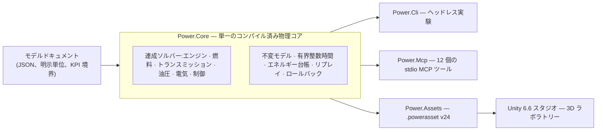

# Power!


[English](README.md) · [简体中文](README.zh-CN.md) · [Français](README.fr.md) · [Русский](README.ru.md) · **日本語** · [한국어](README.ko.md) · [Deutsch](README.de.md) · [Español](README.es.md) · [Italiano](README.it.md) · [Português](README.pt-BR.md)

Power! はパワートレインのモデリングと実験プロジェクトです。クロスプラットフォームの C# 物理コア、Unity 3D スタジオ、そしてエージェント向けの MCP インターフェースで構成されます。モデル・ソルバー・実験・表示を関心ごとに分離しているため、エージェントは明示的な契約を通じてモデルを構築し、実験を実行・分岐し、物理的エビデンスを検査できます。

公開リポジトリは [Water-Run/Power](https://github.com/Water-Run/Power) です。

## 全体構成



同じコンパイル済みモデルがすべての入口を支えます。CLI・MCP・Unity スタジオは同じドキュメントをインポートし、同じエビデンスをリプレイします。

## 技術スタック

| レイヤー | バージョンと役割 |
|---|---|
| Unity 3D | **Unity 6.6 / 6000.6.0f1**、デスクトップスタジオ |
| レンダリング・入力・UI | **URP 17.6.0**、**Input System 1.20.0**、UI Toolkit |
| C# ツールチェーン | **.NET 10 SDK 10.0.400 / C# 14**、コア、CLI、エージェントサービス、ビルドツール |
| Unity 向けアセンブリ | **.NET Standard 2.1**、同じコアとアセットのソースからコンパイル |
| エージェントトランスポート | 公式 **MCP C# SDK 2.2.0**、stdio、依存関係ロックファイルをコミット |
| ネイティブプロトタイプ | **Zig 0.15.2**、バイナリ ABI を保持した独立した研究ライブラリ |

出典:[Unity リリースノート](https://unity.com/releases/editor/whats-new/6000.6.0f1)、[.NET 10 ダウンロード](https://dotnet.microsoft.com/en-us/download/dotnet/10.0)、[MCP SDK](https://www.nuget.org/packages/ModelContextProtocol/2.2.0)。

Unity 自身のコンパイラは C# 9 までをサポートし、API プロファイルは .NET Standard 2.1 です。外部の .NET SDK が最新の C# を Unity 互換アセンブリにコンパイルし、`Unity/Assets` 内のスクリプトは C# 9 構文を使います。Unity Player に .NET 10 の別途インストールは不要です。[Unity のコンパイラ対応](https://docs.unity3d.com/6000.6/Documentation/Manual/csharp-compiler.html)と [API 互換性ドキュメント](https://docs.unity3d.com/6000.6/Documentation/Manual/dotnet-profile-support.html)を参照してください。

## ビルドと検証

指定バージョンの .NET SDK をインストールし、Zig を導入して、リポジトリルートから Windows・macOS・Linux で実行します:

```sh
dotnet run --file tools/Build.cs -p:UseSharedCompilation=false -- install-zig
dotnet run --file tools/Build.cs -p:UseSharedCompilation=false -- verify
```

`verify` はソリューションを逐次ビルドし、Unity モデルアセットをエクスポートし、コアとエージェントの検査を実行し、実際の MCP サーバープロセスを動かし、Zig ランタイム・共有ライブラリホスト・C# P/Invoke ABI・元の数値ベースラインを検証します。レポートは `artifacts/reports` に出力されます。

> [!TIP]
> `.cache/dotnet/dotnet` にインストールした指定 SDK でも動作します。キャッシュは Git で追跡されません。

> [!IMPORTANT]
> ソース監査は C/C++ の実装ファイルとヘッダー、Lua のソース・バイトコード・パッケージを拒否します。リポジトリにこれらを含めないでください。

逐次検証は Windows で合格しています。以前の実行には Linux と macOS のエビデンスもあります。各実行の範囲は [docs/VALIDATION.ja.md](docs/VALIDATION.ja.md) を参照してください。Unity エディター・Play Mode・レンダリング・IL2CPP の検証は未着手です — [Unity 検証](#unity-検証)を参照してください。

実験を直接実行するには:

```sh
dotnet run --project src/Power.Cli -c Release -- assets/labs/electrothermal.power.json --output artifacts/reports/electrothermal.json
```

CLI の終了コードは、実験合格が `0`、KPI またはリプレイ検査の失敗が `2`、無効な入力や実行エラーが `1` です。

モデルドキュメントは単位・固定ナノ秒ティック・入力イベント・KPI 境界を規定します。レポートにはソースハッシュ、モデルフィンガープリント、ランタイム情報、精度、チャンネル、リプレイエビデンス、エネルギー残差が含まれます。

## Unity スタジオ

1. `dotnet run --file tools/Build.cs -p:UseSharedCompilation=false -- build` を実行します。`Unity/Assets/Plugins` に Core と Assets のアセンブリが、`Unity/Assets/Generated/Resources` にサンプル `.powerasset` が生成されます。
2. リポジトリの `Unity` ディレクトリを Unity Hub に追加し、**6000.6.0f1** を選択します。
3. パッケージ解決とスクリプトインポートの完了を待ちます — 初回の準備で URP とマテリアルアセットが生成されます。
4. `Assets/Scenes/PowerLab.unity` を開くか、**Power > Open laboratory** を選択して Play Mode に入ります。

シーンはインポートしたモデルからローター・熱ノード・接続・入力コントロールを構築します。一時停止、リセット、保存済み実験に対応し、イベントは正確なシミュレーションティックで適用されます。デフォルトの電気—熱実験は 10 秒の制動と回復シーケンスを実行します。`ThermalNetwork.powerasset` は外部入力のない熱交換実験です。モデルアセットの Inspector で **Open in Studio** を使って選択できます。

`SealedCylinder.powerasset` は模式的に動くピストン付きの圧縮/膨張実験を追加します。ガス状態・クランクトルク・エネルギーの各チャンネルは CLI と MCP と同じモデル意味論を使います。[気筒ドキュメント](docs/SEALED_CYLINDER.ja.md)を参照してください。

ビルド後に別のモデルをエクスポートするには:

```sh
dotnet src/Power.Cli/bin/Release/net10.0/Power.Cli.dll export assets/labs/electrothermal.power.json --name "My laboratory" --output Unity/Assets/Models/MyLaboratory.powerasset
```

インポーターは整合性を検査し、モデルを再コンパイルし、フィンガープリントを検証します — [アセット形式](docs/ASSET_FORMAT.ja.md)を参照してください。ドラッグで周回、スクロールでズームします。各 `FixedUpdate` は最大 2,000 完全ティック進めます:デフォルトモデルで 20 ms、7 ms 熱モデルで 14 ms です。物理はレンダリングの `deltaTime` を読まないため、極めて細かいティックのモデルが実時間を保つ保証はありません。

## Unity 検証

Unity エディターと Play Mode の検査は独立した入口です。`POWER_UNITY_EDITOR` にエディター実行ファイルを設定して実行します:

```sh
dotnet run --file tools/Build.cs -p:UseSharedCompilation=false -- unity-test
```

> [!WARNING]
> 実際のエディター/Play Mode エビデンスとして数えられるのはこの経路だけです。現在の開発環境では Unity を実行しておらず、検証済みの Player ビルドもまだありません。

## エージェントインターフェース

ビルド後、サーバーをクライアントの stdio MCP プロセスとして起動します:

```sh
dotnet /absolute/path/to/Power/src/Power.Mcp/bin/Release/net10.0/Power.Mcp.dll
```

サービスは入出力スキーマ付きの 12 個のツールを公開します:

| ツール | 役割 |
|---|---|
| `get_capabilities` | モデル・制限・時間とリビジョンの規約を検索。ここから始めてください。 |
| `get_model_schema` | `power.model.v1` の JSON Schema 2020-12 |
| `get_example_model` | 編集可能な合成モデルと実験を取得(33 例) |
| `validate_model` | 実行せずにモデルを検証。構造化された修復診断 |
| `run_experiment` | 境界付きヘッドレス実行。バッチリプレイ・KPI・来歴付き |
| `export_model_asset` | 移植可能な `.powerasset` をエクスポート |
| `create_session` | 独立したシミュレーションを作成。セッション id とリビジョンを返す |
| `read_snapshot` | 時刻・リビジョン・状態ハッシュ・選択した出力を読む |
| `set_inputs` | 現在のシミュレーション時刻で入力をアトミックに変更 |
| `step_session` | 正確な整数ティック数だけ進める |
| `fork_session` | 正確な状態から分岐し、反実験を行う |
| `close_session` | セッションとその状態を解放 |

プロトコル出力は stdout、ログは stderr を使います。エージェントは Unity UI を操作せず、物理ループ内でモデルプロバイダーを呼ばずに、ヘッドレスコアを操作します。

[エージェント API](docs/AGENT_API.ja.md) にクライアント設定と操作シーケンスが記載されています。コアは `TryCompile`・検出可能チャンネル・`Fork`・キャンセル・アトミックロールバックを提供し、MCP ワークスペースがリビジョン検査とコンパクトなレポートを追加します。

## モデルとラボラトリー

現在の実行可能な C# モデルは、回転慣性、正負の変速比を持つ弾性シャフト、RL 直流モーター、トルク源、熱容量、熱伝導ネットワーク、断熱密閉気筒、そしてスライダークランクによる圧力仕事結合・クランク角度 360/720 度のバルブプロファイル・燃料/空気/生成物の輸送を伴う規定予混合燃焼を持つ開放ガス室をカバーします。検証済みの[ガス交換物理](docs/GAS_EXCHANGE.ja.md) — 理想気体、独立した質量と内部エネルギーで追跡される有限体積、チョーク流と亜臨界流を持つ圧縮性オリフィス — が固定容積および可変容積のガスネットワークに供給します。静止/滑り容量を持つクラッチ、理想歯車と遊星の拘束、マップ化されたトルクコンバーター、明示的なバルブ・コンプライアンス・クランク駆動ポンプを持つ油圧ネットワークが同じ連成求解に加わります。明示的な圧力漏れと粘性抵抗がポンプ損失をモデル化し、直流モーターが同じ電気・熱システムを通じてポンプに供給できます。サンプリング圧力レギュレーターは測定された油圧からモーター電圧または電池駆動モーターのデューティーを調整します。有限充電量、電池の抵抗と分極、切替式アクセサリー負荷が同じエネルギー台帳に入ります。

有限で柔軟な液体レールが、サイクル計量された燃料をフィルムに供給するようになりました。有限な壁が蒸発熱を支払い、規定燃焼に使えるのは蒸気だけです。位置依存のソレノイドとサンプリングドーズドライバーは、閉じ遅れとシート反発を含めて実際のニードルを動かせます。有界なプラントリプレイは、ドーズ追従のために電圧除去を早める計画を立てられます。[ニードル駆動](docs/NEEDLE_ACTUATION.ja.md)、[液体噴射](docs/LIQUID_FUEL_INJECTION.ja.md)、[フィルム契約](docs/FUEL_FILM.ja.md)を参照してください。

7 速デュアルクラッチ研究グラフは、奇数/偶数入力軸、リバース、3 つの出力分岐、明示的な同期/変速熱を追加します。同じ歯車/クラッチ原始素を使い、サンプリング状態機械がセレクターと段階的駆動引き継ぎを所有して、実際のロックを確認し故障を曝せます。[トランスミッション](docs/DUAL_CLUTCH_TRANSMISSION.ja.md)と[制御](docs/DCT_CONTROL.ja.md)の契約を参照してください。

4 レンジの Ravigneaux 研究グラフは複合遊星経路とコンバーター/ロックアップ実験を追加します。分解版オプションは遊星の自転と軌道慣性を含みます。油圧ピストン駆動が 5 つのレンジ要素とコンバーターロックアップに供給します。[物理契約](docs/RAVIGNEAUX_TRANSMISSION.ja.md)を参照してください。

> [!NOTE]
> すべてのサンプルパラメーターは `unverified` です。研究値であり、キャリブレーション測定ではありません。

以下のラボラトリーは JSON・CLI・MCP・Studio インポート間で定義を共有します。エクスポートは `power.asset.v24` を使い、旧アセットのリーダーは保持されます。

<details>
<summary>利用可能なラボラトリー(34)</summary>

| 例名(`get_example_model`) | ラボラトリー | 検証内容 |
|---|---|---|
| `electrothermal` | `assets/labs/electrothermal.power.json` | デフォルトの制動/回復シーケンス |
| CLI のみ | `assets/labs/thermal-network.power.json` | 外部入力のない熱交換 |
| `sealed-cylinder` | `assets/labs/sealed-cylinder.power.json` | 密閉断熱圧縮と膨張 |
| `gas-network` | `assets/labs/gas-network.power.json` | 定容チャンバー、オリフィス、壁面熱リンク |
| `moving-cylinder` | `assets/labs/moving-cylinder.power.json` | クランク依存容積でのモータリング |
| `crank-timed-cylinder` | `assets/labs/crank-timed-cylinder.power.json` | 変速時の 720° 吸排気プロファイル |
| `fired-cylinder` | `assets/labs/fired-cylinder.power.json` | 燃料/空気/生成物輸送を伴う予混合燃焼 |
| `fired-clutch` | `assets/labs/fired-clutch.power.json` | ドライクラッチの係合・解放・再係合 |
| `fired-planetary` | `assets/labs/fired-planetary.power.json` | 遊星セットとリングブレーキ変速 |
| `fired-converter` | `assets/labs/fired-converter.power.json` | コンバーターマップと計画ロックアップ |
| `fired-hydraulic` | `assets/labs/fired-hydraulic.power.json` | 変速/ロックアップクラッチへのバルブ供給圧 |
| `fired-pump` | `assets/labs/fired-pump.power.json` | クランク駆動ポンプ、コンプライアント管、リリーフ |
| `fired-pump-losses` | `assets/labs/fired-pump-losses.power.json` | ポンプ漏れ、シャフト抵抗と熱 |
| `electric-pump` | `assets/labs/electric-pump.power.json` | 直流モーター供給とバルブ操作の圧力クラッチ |
| `pressure-regulated-pump` | `assets/labs/pressure-regulated-pump.power.json` | サンプリング圧力フィードバック、有界モーター電圧と外乱回復 |
| `battery-regulated-pump` | `assets/labs/battery-regulated-pump.power.json` | 電池電圧低下、アクセサリー負荷とデューティー調圧 |
| `piston-actuated-clutch` | `assets/labs/piston-actuated-clutch.power.json` | ピストン空行程、パッド接触、クラッチ捕捉/解放と保存的流体仕事 |
| `spool-regulated-pump` | `assets/labs/spool-regulated-pump.power.json` | 機械式圧力フィードバック、計量バイパスと圧力クラッチ捕捉 |
| `gas-accumulator-pump` | `assets/labs/gas-accumulator-pump.power.json` | 有限ガス貯蔵、油圧分離器運動と過渡エネルギー回収 |
| `metered-fired-cylinder` | `assets/labs/metered-fired-cylinder.power.json` | 有限燃料レール、サイクルドーズ制御と独立した予混合燃焼 |
| `film-fired-cylinder` | `assets/labs/film-fired-cylinder.power.json` | 有限液体在庫、壁面支払い蒸発と蒸気のみの燃焼 |
| `liquid-injected-cylinder` | `assets/labs/liquid-injected-cylinder.power.json` | 有限液体レール、サイクル噴射、フィルム補給と独立蒸発 |
| `needle-actuated-cylinder` | `assets/labs/needle-actuated-cylinder.power.json` | ソレノイド/ニードル動力学、サンプリングドーズフィードバックと観測可能な過剰供給 |
| `closure-compensated-cylinder` | `assets/labs/closure-compensated-cylinder.power.json` | 有界クロージャリプレイと物理ティック切断計画 |
| `dual-clutch-transmission` | `assets/labs/dual-clutch-transmission.power.json` | 発進、プリセレクト、7 前進経路と昇降段引き継ぎ |
| `fired-dual-clutch` | `assets/labs/fired-dual-clutch.power.json` | 燃焼エンジンと完全な研究 DCT 動力経路 |
| `controlled-dual-clutch` | `assets/labs/controlled-dual-clutch.power.json` | サンプリング同期、段階的引き継ぎと実際の段確認 |
| `hydraulic-ravigneaux-transmission` | `assets/labs/hydraulic-ravigneaux-transmission.power.json` | ポンプ駆動による 5 レンジ要素の動的ピストン駆動 |
| `fired-hydraulic-ravigneaux` | `assets/labs/fired-hydraulic-ravigneaux.power.json` | 6 つの油圧アクチュエーターを持つ燃焼コンバータートレイン |
| `resolved-ravigneaux-transmission` | `assets/labs/resolved-ravigneaux-transmission.power.json` | 4 つの実際の噛み合い拘束を持つ遊星自転/軌道慣性 |
| `fired-resolved-ravigneaux-converter` | `assets/labs/fired-resolved-ravigneaux-converter.power.json` | 分解遊星運動を持つ燃焼コンバータートレイン |
| `ravigneaux-transmission` | `assets/labs/ravigneaux-transmission.power.json` | 4 レンジ複合遊星の昇降段引き継ぎ |
| `fired-ravigneaux-converter` | `assets/labs/fired-ravigneaux-converter.power.json` | 燃焼エンジン、コンバーター/ロックアップと複合トランスミッション |
| `controlled-fired-dual-clutch` | `assets/labs/controlled-fired-dual-clutch.power.json` | 燃焼エンジン、サンプリング DCT 制御と完全なエビデンス |

</details>

`name` を付けて `get_example_model` を要求するか、直接実行します:

```sh
dotnet src/Power.Cli/bin/Release/net10.0/Power.Cli.dll assets/labs/<name>.power.json --output artifacts/reports/<name>.json
```

ビルドは各ラボラトリーに対応する `.powerasset` をエクスポートします。リプレイエビデンス — 一致するレポート境界、仕事と熱の総量、エネルギー残差 — は [docs/VALIDATION.ja.md](docs/VALIDATION.ja.md) と[ドキュメント索引](#ドキュメント)の各機能の契約ドキュメントに記録されています。

## 範囲と限界

完全なパワートレインは目標であって現状ではありません。未解決:

- 完全なエンジン挙動:吸排気モデリング、液体ポンプ/補給、精密化した磁気/電子/噴霧挙動、圧力依存の相挙動、より豊富な熱化学、点火制御。
- 完全な DCT アクチュエーション、AT トポロジーとトランスミッション制御(ECU/TCU)。
- 実測のポンプ損失/制御マップ、実測の電池化学と BMS、実測のバルブ/アキュムレーター動特性。
- キャリブレーション済みパワートレイン。

以前のネイティブプロトタイプとテストは [legacy/native](legacy/native/README.md) の Zig に移植され、独立した研究ライブラリです。その機能はすべて C# へ移行されたわけではありません。元の C ソースは Zig ポートに置き換えられ、元のハッシュと Git 来歴は [legacy/native/migration-manifest.json](legacy/native/migration-manifest.json) にあります。[ネイティブ Zig 境界](docs/NATIVE_ZIG.ja.md)はバージョン付きバイナリ ABI を保持しつつ、C#/Unity アプリケーションにネイティブ依存を追加しません。

EA211 DJS + DQ200 と PSA EC5 + AT8 の OEM リサーチは [assets/samples](assets/samples) にあり、エビデンスとキャリブレーション境界はそのままです。欠けている OEM 計測は欠けたままです。

## ドキュメント

| 分野 | ドキュメント |
|---|---|
| プロジェクト | [アーキテクチャ](docs/ARCHITECTURE.ja.md) · [ロードマップ](docs/ROADMAP.ja.md) · [開発ステータス](docs/DEVELOPMENT_STATUS.ja.md) · [検証記録](docs/VALIDATION.ja.md) · [エンジン再開ノート](docs/NEXT_ENGINE_STEP.ja.md) |
| インターフェース | [エージェント API](docs/AGENT_API.ja.md) · [アセット形式](docs/ASSET_FORMAT.ja.md) · [ネイティブ Zig 境界](docs/NATIVE_ZIG.ja.md) |
| エンジンとガス | [密閉気筒](docs/SEALED_CYLINDER.ja.md) · [ガスネットワーク](docs/GAS_NETWORK.ja.md) · [ガス交換](docs/GAS_EXCHANGE.ja.md) · [可動気筒](docs/MOVING_CYLINDER.ja.md) · [バルブタイミング](docs/VALVE_TIMING.ja.md) · [予混合燃焼](docs/PREMIXED_COMBUSTION.ja.md) |
| 燃料と噴射 | [燃料計量](docs/FUEL_METERING.ja.md) · [燃料フィルム](docs/FUEL_FILM.ja.md) · [液体噴射](docs/LIQUID_FUEL_INJECTION.ja.md) · [ニードル駆動](docs/NEEDLE_ACTUATION.ja.md) · [クロージャ予測](docs/CLOSURE_PREDICTION.ja.md) |
| トランスミッション | [クラッチネットワーク](docs/CLUTCH_NETWORK.ja.md) · [クラッチ物理](docs/CLUTCH_PHYSICS.ja.md) · [歯車ネットワーク](docs/GEAR_NETWORK.ja.md) · [理想歯車](docs/IDEAL_GEARS.ja.md) · [コンバーター](docs/CONVERTER_NETWORK.ja.md) · [デュアルクラッチトランスミッション](docs/DUAL_CLUTCH_TRANSMISSION.ja.md) · [DCT 制御](docs/DCT_CONTROL.ja.md) · [Ravigneaux トランスミッション](docs/RAVIGNEAUX_TRANSMISSION.ja.md) · [分解遊星](docs/RESOLVED_PLANETS.ja.md) |
| 油圧 | [油圧ネットワーク](docs/HYDRAULIC_NETWORK.ja.md) · [ポンプ](docs/HYDRAULIC_PUMP.ja.md) · [ピストン](docs/HYDRAULIC_PISTON.ja.md) · [スプール](docs/HYDRAULIC_SPOOL.ja.md) · [ガスアキュムレーター](docs/GAS_PISTON.ja.md) · [AT 駆動](docs/AT_HYDRAULIC_ACTUATION.ja.md) |

このページの翻訳は同階層の `README.<locale>.md` にあります。[索引](docs/README.ja.md)の各文書にも、同じ九つの翻訳があります。

## ライセンス

オリジナルの Power! マテリアルは **GPL-3.0-or-later および Unity Linking Exception** の下でライセンスされます。[COPYING.NOTICE](COPYING.NOTICE)、未変更の [GPLv3 テキスト](LICENSE)、[例外条項](UNITY-LINKING-EXCEPTION.md)を併せて読んでください。ライセンス文言は英語版が正文です。

この例外は指定された Unity との組み合わせを許可しつつ、Power! とその改変を GPL 要件の下に維持します。Unity とその他のサードパーティソフトウェアは各自のライセンスを保持し、例外はそれらの作者が持つ権利を付与しません — [サードパーティ通知](THIRD_PARTY_NOTICES.md)を参照してください。ソースまたはバイナリを配布する際は、適用されるライセンス・著作権・通知ファイルを保持してください。
