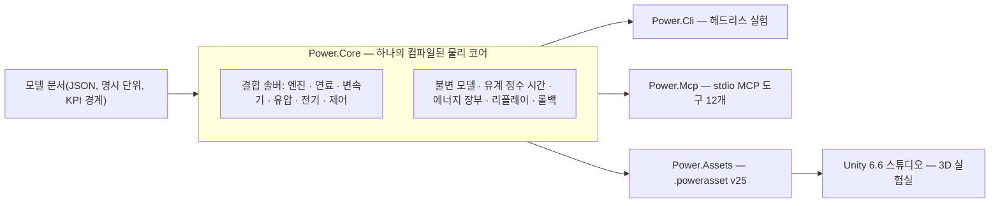

# Power!


[English](README.md) · [简体中文](README.zh-CN.md) · [Français](README.fr.md) · [Русский](README.ru.md) · [日本語](README.ja.md) · **한국어** · [Deutsch](README.de.md) · [Español](README.es.md) · [Italiano](README.it.md) · [Português](README.pt-BR.md)

Power!는 파워트레인 모델링과 실험 프로젝트입니다. 크로스 플랫폼 C# 물리 코어, Unity 3D 스튜디오, 그리고 에이전트용 MCP 인터페이스로 구성됩니다. 모델·솔버·실험·표현이 관심사별로 분리되어 있어, 에이전트는 명시적 계약을 통해 모델을 만들고 실험을 실행·분기하며 물리적 증거를 검사할 수 있습니다.

공개 저장소는 [Water-Run/Power](https://github.com/Water-Run/Power)입니다.

## 전체 구조



동일한 컴파일 모델이 모든 진입점을 구동합니다. CLI, MCP, Unity 스튜디오는 같은 문서를 가져오고 같은 증거를 리플레이합니다.

## 기술 스택

| 계층 | 버전과 역할 |
|---|---|
| Unity 3D | **Unity 6.6 / 6000.6.0f1**, 데스크톱 스튜디오 |
| 렌더링, 입력, UI | **URP 17.6.0**, **Input System 1.20.0**, UI Toolkit |
| C# 도구 | **.NET 10 SDK 10.0.400 / C# 14**, 코어, CLI, 에이전트 서비스, 빌드 도구 |
| Unity용 어셈블리 | **.NET Standard 2.1**, 동일한 코어와 자산 소스에서 컴파일 |
| 에이전트 전송 | 공식 **MCP C# SDK 2.2.0**, stdio, 커밋된 의존성 잠금 파일 |
| 네이티브 프로토타입 | **Zig 0.15.2**, 바이너리 ABI를 보존한 별도 연구 라이브러리 |

출처: [Unity 릴리스 노트](https://unity.com/releases/editor/whats-new/6000.6.0f1), [.NET 10 다운로드](https://dotnet.microsoft.com/en-us/download/dotnet/10.0), [MCP SDK](https://www.nuget.org/packages/ModelContextProtocol/2.2.0).

Unity 자체 컴파일러는 C# 9를 지원하고 API 프로파일은 .NET Standard 2.1입니다. 외부 .NET SDK가 최신 C#를 Unity 호환 어셈블리로 컴파일하며, `Unity/Assets` 내부 스크립트는 C# 9 구문을 사용합니다. Unity Player에는 별도의 .NET 10 설치가 필요하지 않습니다. [Unity 컴파일러 지원](https://docs.unity3d.com/6000.6/Documentation/Manual/csharp-compiler.html)과 [API 호환성 문서](https://docs.unity3d.com/6000.6/Documentation/Manual/dotnet-profile-support.html)를 참고하세요.

## 빌드와 검증

고정된 .NET SDK를 설치한 뒤 Zig를 설치하고, 저장소 루트에서 Windows·macOS·Linux로 실행합니다:

```sh
dotnet run --file tools/Build.cs -p:UseSharedCompilation=false -- install-zig
dotnet run --file tools/Build.cs -p:UseSharedCompilation=false -- verify
```

`verify`는 솔루션을 직렬로 빌드하고, Unity 모델 자산을 내보내고, 코어와 에이전트 검사를 실행하고, 실제 MCP 서버 프로세스를 구동하며, Zig 런타임·공유 라이브러리 호스트·C# P/Invoke ABI·원래 수치 기준선을 검증합니다. 보고서는 `artifacts/reports`에 생성됩니다.

> [!TIP]
> `.cache/dotnet/dotnet`에 설치된 고정 SDK도 사용할 수 있습니다. 캐시는 Git이 추적하지 않습니다.

> [!IMPORTANT]
> 소스 감사는 C/C++ 구현 파일과 헤더, 그리고 Lua 소스·바이트코드·패키지를 거부합니다. 저장소에 이들을 포함하지 마세요.

직렬 검증은 Windows에서 통과했습니다. 이전 실행에는 Linux와 macOS 증거도 있습니다. 각 실행 범위는 [docs/VALIDATION.ko.md](docs/VALIDATION.ko.md)를 참고하세요. Unity 편집기, Play Mode, 렌더링, IL2CPP 검증은 아직 남아 있습니다 — [Unity 검증](#unity-검증)을 참고하세요.

실험을 직접 실행하려면:

```sh
dotnet run --project src/Power.Cli -c Release -- assets/labs/electrothermal.power.json --output artifacts/reports/electrothermal.json
```

CLI 종료 코드는 실험 통과가 `0`, KPI 또는 리플레이 검사 실패가 `2`, 잘못된 입력이나 실행 오류가 `1`입니다.

모델 문서는 단위, 고정 나노초 틱, 입력 이벤트, KPI 경계를 지정합니다. 보고서에는 소스 해시, 모델 지문, 런타임 정보, 정확도, 채널, 리플레이 증거, 에너지 잔차가 포함됩니다.

## Unity 스튜디오

1. `dotnet run --file tools/Build.cs -p:UseSharedCompilation=false -- build`를 실행합니다. `Unity/Assets/Plugins`에 Core와 Assets 어셈블리가, `Unity/Assets/Generated/Resources`에 샘플 `.powerasset` 파일이 생성됩니다.
2. 저장소의 `Unity` 디렉터리를 Unity Hub에 추가하고 **6000.6.0f1**을 선택합니다.
3. 패키지 해석과 스크립트 가져오기가 끝나기를 기다립니다 — 최초 준비에서 URP와 머티리얼 자산이 생성됩니다.
4. `Assets/Scenes/PowerLab.unity`를 열거나 **Power > Open laboratory**를 선택한 뒤 Play Mode에 들어갑니다.

씬은 가져온 모델에서 로터, 열 노드, 연결, 입력 컨트롤을 구성합니다. 일시정지, 재설정, 저장된 실험을 지원하며 이벤트는 정확한 시뮬레이션 틱에 적용됩니다. 기본 전기—열 실험은 10초 제동과 회복 시퀀스를 실행합니다. `ThermalNetwork.powerasset`은 외부 입력 없는 열교환 실험입니다. 모델 자산 Inspector의 **Open in Studio**로 선택할 수 있습니다.

`SealedCylinder.powerasset`은 개략적으로 움직이는 피스톤이 있는 압축/팽창 실험을 추가합니다. 가스 상태, 크랭크 토크, 에너지 채널은 CLI 및 MCP와 동일한 모델 의미론을 사용합니다. [실린더 문서](docs/SEALED_CYLINDER.ko.md)를 참고하세요.

빌드 후 다른 모델을 내보내려면:

```sh
dotnet src/Power.Cli/bin/Release/net10.0/Power.Cli.dll export assets/labs/electrothermal.power.json --name "My laboratory" --output Unity/Assets/Models/MyLaboratory.powerasset
```

가져오기 도구는 무결성을 검사하고 모델을 재컴파일하며 지문을 검증합니다 — [자산 형식](docs/ASSET_FORMAT.ko.md)을 참고하세요. 드래그로 회전, 스크롤로 확대합니다. 각 `FixedUpdate`는 최대 2,000개의 완전한 틱을 진행합니다: 기본 모델은 20 ms, 7 ms 열 모델은 14 ms입니다. 물리는 렌더링 `deltaTime`을 읽지 않으므로, 매우 작은 틱의 모델이 실시간을 유지한다는 보장은 없습니다.

## Unity 검증

Unity 편집기와 Play Mode 검사는 별도 진입점입니다. `POWER_UNITY_EDITOR`를 편집기 실행 파일로 설정하고 실행합니다:

```sh
dotnet run --file tools/Build.cs -p:UseSharedCompilation=false -- unity-test
```

> [!WARNING]
> 실제 편집기/Play Mode 증거로 인정되는 경로는 이것뿐입니다. 현재 개발 환경에서는 Unity를 실행하지 않았고, 검증된 Player 빌드도 아직 없습니다.

## 에이전트 인터페이스

빌드 후 서버를 클라이언트의 stdio MCP 프로세스로 시작합니다:

```sh
dotnet /absolute/path/to/Power/src/Power.Mcp/bin/Release/net10.0/Power.Mcp.dll
```

서비스는 입출력 스키마를 갖춘 열두 개의 도구를 노출합니다:

| 도구 | 역할 |
|---|---|
| `get_capabilities` | 모델, 제한, 시간과 개정 규약을 탐색. 여기서 시작하세요. |
| `get_model_schema` | `power.model.v1`의 JSON Schema 2020-12 |
| `get_example_model` | 편집 가능한 합성 모델과 실험 가져오기 (예제 33개) |
| `validate_model` | 실행 없이 모델 검증. 구조화된 수리 진단 |
| `run_experiment` | 경계가 있는 헤드리스 실행, 배치 리플레이·KPI·출처 포함 |
| `export_model_asset` | 이식 가능한 `.powerasset` 내보내기 |
| `create_session` | 독립 시뮬레이션 생성. 세션 id와 개정 반환 |
| `read_snapshot` | 시각, 개정, 상태 해시, 선택한 출력 읽기 |
| `set_inputs` | 현재 시뮬레이션 시각에 입력을 원자적으로 변경 |
| `step_session` | 정확한 정수 틱 수만큼 진행 |
| `fork_session` | 정확한 상태에서 분기하여 반사실 실험 수행 |
| `close_session` | 세션과 상태 해제 |

프로토콜 출력은 stdout, 로그는 stderr를 사용합니다. 에이전트는 Unity UI를 조작하지 않고, 물리 루프 안에서 모델 공급자를 호출하지 않으면서 헤드리스 코어를 다룹니다.

[에이전트 API](docs/AGENT_API.ko.md) 문서가 클라이언트 설정과 작업 순서를 설명합니다. 코어는 `TryCompile`, 탐색 가능 채널, `Fork`, 취소, 원자적 롤백을 제공하고, MCP 작업 공간은 개정 검사와 간결한 보고서를 더합니다.

## 모델과 실험실

현재 실행 가능한 C# 모델은 회전 관성, 양수/음수 변속비를 가진 탄성 축, RL 직류 모터, 토크원, 열용량, 열전도 네트워크, 단열 밀폐 실린더, 그리고 슬라이더-크랭크 압력 일 결합, 크랭크 기준 360/720도 밸브 프로파일, 연료/공기/생성물 수송이 있는 규정 예혼합 연소를 갖춘 개방 가스 챔버를 다룹니다. 검증된 [가스 교환 물리](docs/GAS_EXCHANGE.ko.md) — 이상 기체, 독립적인 질량과 내부 에너지로 추적되는 유한 체적, 초킹 및 아임계 흐름을 다루는 압축성 오리피스 — 가 고정 및 가변 체적 가스 네트워크에 공급합니다. 정지/슬립 용량의 클러치, 이상 기어와 유성 제약, 맵 기반 토크 컨버터, 명시적 밸브와 컴플라이언스, 크랭크 구동 펌프를 갖춘 유압 네트워크가 같은 결합 해석에 참여합니다. 명시적 압력 누출과 점성 항력이 펌프 손실을 모델링하고, 직류 모터가 같은 전기·열 시스템을 통해 펌프에 공급할 수 있습니다. 샘플링 압력 조절기는 측정된 유압으로 모터 전압 또는 배터리 구동 모터 듀티를 조정합니다. 유한 충전량, 배터리 저항과 분극, 스위칭 부하가 같은 에너지 장부에 들어갑니다.

이제 유한하고 유순한 액체 레일이 사이클 계량 연료를 필름에 공급합니다. 유한한 벽이 증발열을 부담하고, 규정 연소에 쓸 수 있는 것은 증기뿐입니다. 위치 의존 솔레노이드와 샘플링 도즈 드라이버는 닫힘 지연과 시트 반발을 포함해 실제 니들을 움직일 수 있습니다. 유계 플랜트 리플레이는 도즈 추적을 위해 더 이른 전압 제거를 계획할 수 있습니다. [니들 구동](docs/NEEDLE_ACTUATION.ko.md), [액체 분사](docs/LIQUID_FUEL_INJECTION.ko.md), [필름 계약](docs/FUEL_FILM.ko.md)을 참고하세요.

7단 듀얼 클러치 연구 그래프는 홀수/짝수 입력 축, 후진, 세 개의 출력 분기, 명시적 동기/변속 열을 추가합니다. 같은 기어/클러치 원시 요소를 사용하며, 샘플링 상태 기계가 셀렉터와 단계적 구동 인계를 소유하여 실제 잠금을 확인하고 결함을 노출할 수 있습니다. [변속기](docs/DUAL_CLUTCH_TRANSMISSION.ko.md)와 [제어](docs/DCT_CONTROL.ko.md) 계약을 참고하세요.

4레인지 Ravigneaux 연구 그래프는 복합 유성 경로와 컨버터/록업 실험을 추가합니다. 분해 옵션은 유성 자전과 궤도 관성을 포함합니다. 유압 피스톤 구동이 다섯 레인지 요소와 컨버터 록업에 공급합니다. [물리 계약](docs/RAVIGNEAUX_TRANSMISSION.ko.md)을 참고하세요.

> [!NOTE]
> 모든 샘플 매개변수는 `unverified`입니다. 연구 값이지 교정 측정값이 아닙니다.

아래 실험실은 JSON, CLI, MCP, Studio 가져오기 간에 정의를 공유합니다. 내보내기는 `power.asset.v25`를 사용하며 이전 자산의 판독기는 유지됩니다.

<details>
<summary>사용 가능한 실험실 (34)</summary>

| 예제 이름(`get_example_model`) | 실험실 | 다루는 내용 |
|---|---|---|
| `electrothermal` | `assets/labs/electrothermal.power.json` | 기본 제동/회복 시퀀스 |
| CLI 전용 | `assets/labs/thermal-network.power.json` | 외부 입력 없는 열교환 |
| `sealed-cylinder` | `assets/labs/sealed-cylinder.power.json` | 밀폐 단열 압축과 팽창 |
| `gas-network` | `assets/labs/gas-network.power.json` | 고정 체적 챔버, 오리피스, 벽 열 링크 |
| `moving-cylinder` | `assets/labs/moving-cylinder.power.json` | 크랭크 의존 체적의 모터링 |
| `crank-timed-cylinder` | `assets/labs/crank-timed-cylinder.power.json` | 변속 시 720° 흡기/배기 프로파일 |
| `fired-cylinder` | `assets/labs/fired-cylinder.power.json` | 연료/공기/생성물 수송을 동반한 예혼합 연소 |
| `fired-clutch` | `assets/labs/fired-clutch.power.json` | 드라이 클러치 체결, 해제, 재체결 |
| `fired-planetary` | `assets/labs/fired-planetary.power.json` | 유성 세트와 링 브레이크 변속 |
| `fired-converter` | `assets/labs/fired-converter.power.json` | 컨버터 맵과 예정된 록업 |
| `fired-hydraulic` | `assets/labs/fired-hydraulic.power.json` | 변속/록업 클러치를 위한 밸브 공급 압력 |
| `fired-pump` | `assets/labs/fired-pump.power.json` | 크랭크 구동 펌프, 컴플라이언트 라인, 릴리프 |
| `fired-pump-losses` | `assets/labs/fired-pump-losses.power.json` | 펌프 누출, 축 항력과 열 |
| `electric-pump` | `assets/labs/electric-pump.power.json` | 직류 모터 공급과 밸브 조작 압력 클러치 |
| `pressure-regulated-pump` | `assets/labs/pressure-regulated-pump.power.json` | 샘플링 압력 피드백, 유계 모터 전압과 외란 회복 |
| `battery-regulated-pump` | `assets/labs/battery-regulated-pump.power.json` | 배터리 전압 강하, 부하와 듀티 조절 압력 |
| `piston-actuated-clutch` | `assets/labs/piston-actuated-clutch.power.json` | 피스톤 자유 행정, 패드 접촉, 클러치 포획/해제와 보존적 유체 일 |
| `spool-regulated-pump` | `assets/labs/spool-regulated-pump.power.json` | 기계식 압력 피드백, 계량 바이패스와 압력 클러치 포획 |
| `gas-accumulator-pump` | `assets/labs/gas-accumulator-pump.power.json` | 유한 가스 저장, 유압 분리기 운동과 과도 에너지 회수 |
| `metered-fired-cylinder` | `assets/labs/metered-fired-cylinder.power.json` | 유한 연료 레일, 사이클 도즈 제어와 별도의 예혼합 연소 |
| `film-fired-cylinder` | `assets/labs/film-fired-cylinder.power.json` | 유한 액체 재고, 벽 부담 증발과 증기 전용 연소 |
| `liquid-injected-cylinder` | `assets/labs/liquid-injected-cylinder.power.json` | 유한 액체 레일, 사이클 분사, 필름 보충과 별도 증발 |
| `needle-actuated-cylinder` | `assets/labs/needle-actuated-cylinder.power.json` | 솔레노이드/니들 동역학, 샘플링 도즈 피드백과 관측 가능한 과잉 공급 |
| `closure-compensated-cylinder` | `assets/labs/closure-compensated-cylinder.power.json` | 유계 폐쇄 리플레이와 물리 틱 차단 계획 |
| `dual-clutch-transmission` | `assets/labs/dual-clutch-transmission.power.json` | 출발, 사전 선택, 일곱 전진 경로와 상/하단 인계 |
| `fired-dual-clutch` | `assets/labs/fired-dual-clutch.power.json` | 점화 엔진과 완전한 연구 DCT 동력 경로 |
| `controlled-dual-clutch` | `assets/labs/controlled-dual-clutch.power.json` | 샘플링 동기화, 단계적 인계와 실제 기어 확인 |
| `hydraulic-ravigneaux-transmission` | `assets/labs/hydraulic-ravigneaux-transmission.power.json` | 펌프 구동 다섯 레인지 요소의 동적 피스톤 구동 |
| `fired-hydraulic-ravigneaux` | `assets/labs/fired-hydraulic-ravigneaux.power.json` | 여섯 유압 액추에이터를 갖춘 점화 컨버터 트레인 |
| `resolved-ravigneaux-transmission` | `assets/labs/resolved-ravigneaux-transmission.power.json` | 네 개의 실제 물림 제약을 갖춘 유성 자전/궤도 관성 |
| `fired-resolved-ravigneaux-converter` | `assets/labs/fired-resolved-ravigneaux-converter.power.json` | 분해 유성 운동을 갖춘 점화 컨버터 트레인 |
| `ravigneaux-transmission` | `assets/labs/ravigneaux-transmission.power.json` | 4레인지 복합 유성 상/하단 인계 |
| `fired-ravigneaux-converter` | `assets/labs/fired-ravigneaux-converter.power.json` | 점화 엔진, 컨버터/록업과 복합 변속기 |
| `controlled-fired-dual-clutch` | `assets/labs/controlled-fired-dual-clutch.power.json` | 점화 엔진, 샘플링 DCT 제어와 완전한 증거 |

</details>

`name`과 함께 `get_example_model`을 요청하거나 직접 실행하세요:

```sh
dotnet src/Power.Cli/bin/Release/net10.0/Power.Cli.dll assets/labs/<name>.power.json --output artifacts/reports/<name>.json
```

빌드는 각 실험실에 대응하는 `.powerasset`을 내보냅니다. 리플레이 증거 — 일치하는 보고서 경계, 일과 열 총량, 에너지 잔차 — 는 [docs/VALIDATION.ko.md](docs/VALIDATION.ko.md)과 [문서 색인](#문서)의 기능별 계약 문서에 기록되어 있습니다.

## 범위와 한계

완전한 파워트레인은 목표이지 현재 상태가 아닙니다. 아직 열려 있는 항목:

- 완전한 엔진 동작: 흡기/배기 모델링, 액체 펌프/보충, 정밀화된 자기/전자/분무 동작, 압력 의존 상 거동, 더 풍부한 열화학, 점화 제어.
- 완전한 DCT 액추에이션, AT 토폴로지와 변속 제어(ECU/TCU).
- 실측 펌프 손실/제어 맵, 실측 배터리 화학과 BMS, 실측 밸브/어큐뮬레이터 동역학.
- 교정된 파워트레인.

이전 네이티브 프로토타입과 테스트는 [legacy/native](legacy/native/README.md)의 Zig로 이식되어 별도 연구 라이브러리입니다. 그 기능이 모두 C#으로 옮겨진 것은 아닙니다. 원래 C 소스는 Zig 포트로 대체되었고, 원래 해시와 Git 출처는 [legacy/native/migration-manifest.json](legacy/native/migration-manifest.json)에 있습니다. [네이티브 Zig 경계](docs/NATIVE_ZIG.ko.md)는 버전이 있는 바이너리 ABI를 유지하면서 C#/Unity 응용 프로그램에 네이티브 의존성을 추가하지 않습니다.

EA211 DJS + DQ200과 PSA EC5 + AT8에 대한 OEM 연구는 [assets/samples](assets/samples)에 있으며, 증거와 교정 경계는 그대로입니다. 누락된 OEM 측정은 계속 누락 상태로 둡니다.

## 문서

| 분야 | 문서 |
|---|---|
| 프로젝트 | [아키텍처](docs/ARCHITECTURE.ko.md) · [로드맵](docs/ROADMAP.ko.md) · [개발 상태](docs/DEVELOPMENT_STATUS.ko.md) · [검증 기록](docs/VALIDATION.ko.md) · [엔진 재개 노트](docs/NEXT_ENGINE_STEP.ko.md) |
| 인터페이스 | [에이전트 API](docs/AGENT_API.ko.md) · [자산 형식](docs/ASSET_FORMAT.ko.md) · [네이티브 Zig 경계](docs/NATIVE_ZIG.ko.md) |
| 엔진과 가스 | [밀폐 실린더](docs/SEALED_CYLINDER.ko.md) · [가스 네트워크](docs/GAS_NETWORK.ko.md) · [가스 교환](docs/GAS_EXCHANGE.ko.md) · [가동 실린더](docs/MOVING_CYLINDER.ko.md) · [밸브 타이밍](docs/VALVE_TIMING.ko.md) · [예혼합 연소](docs/PREMIXED_COMBUSTION.ko.md) |
| 연료와 분사 | [연료 계량](docs/FUEL_METERING.ko.md) · [연료 필름](docs/FUEL_FILM.ko.md) · [액체 분사](docs/LIQUID_FUEL_INJECTION.ko.md) · [니들 구동](docs/NEEDLE_ACTUATION.ko.md) · [폐쇄 예측](docs/CLOSURE_PREDICTION.ko.md) |
| 변속기 | [클러치 네트워크](docs/CLUTCH_NETWORK.ko.md) · [클러치 물리](docs/CLUTCH_PHYSICS.ko.md) · [기어 네트워크](docs/GEAR_NETWORK.ko.md) · [이상 기어](docs/IDEAL_GEARS.ko.md) · [컨버터](docs/CONVERTER_NETWORK.ko.md) · [듀얼 클러치 변속기](docs/DUAL_CLUTCH_TRANSMISSION.ko.md) · [DCT 제어](docs/DCT_CONTROL.ko.md) · [Ravigneaux 변속기](docs/RAVIGNEAUX_TRANSMISSION.ko.md) · [분해 유성](docs/RESOLVED_PLANETS.ko.md) |
| 유압 | [유압 네트워크](docs/HYDRAULIC_NETWORK.ko.md) · [펌프](docs/HYDRAULIC_PUMP.ko.md) · [피스톤](docs/HYDRAULIC_PISTON.ko.md) · [스풀](docs/HYDRAULIC_SPOOL.ko.md) · [가스 어큐뮬레이터](docs/GAS_PISTON.ko.md) · [AT 구동](docs/AT_HYDRAULIC_ACTUATION.ko.md) |

이 페이지의 번역은 같은 위치의 `README.<locale>.md`에 있습니다. [색인](docs/README.ko.md)의 각 문서도 같은 아홉 개 번역을 갖습니다.

## 라이선스

원본 Power! 자료는 **GPL-3.0-or-later 및 Unity 링킹 예외** 하에 라이선스됩니다. [COPYING.NOTICE](COPYING.NOTICE), 수정하지 않은 [GPLv3 원문](LICENSE), [예외 조항](UNITY-LINKING-EXCEPTION.md)을 함께 읽어주세요. 라이선스 문구는 영어판이 원본입니다.

이 예외는 지정된 Unity 조합을 허용하면서 Power!와 그 수정본을 GPL 요건 아래에 유지합니다. Unity와 기타 제3자 소프트웨어는 각자의 라이선스를 유지하며, 예외는 그 저작자들이 보유한 권리를 부여하지 않습니다 — [제3자 고지](THIRD_PARTY_NOTICES.md)를 참고하세요. 소스나 바이너리를 배포할 때는 해당 라이선스, 저작권, 고지 파일을 보존하세요.
