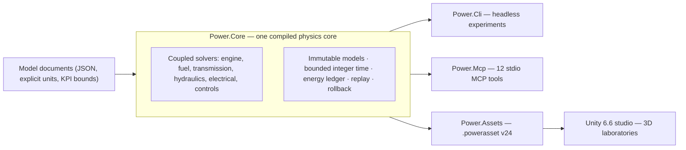

# Power!


**English** · [简体中文](README.zh-CN.md) · [Français](README.fr.md) · [Русский](README.ru.md) · [日本語](README.ja.md) · [한국어](README.ko.md) · [Deutsch](README.de.md) · [Español](README.es.md) · [Italiano](README.it.md) · [Português](README.pt-BR.md)

Power! is a powertrain modeling and experimentation project: a cross-platform C# physics core, a Unity 3D studio, and agent-facing MCP interfaces. Models, solvers, experiments, and presentation are separate concerns, so agents can build models, run and branch experiments, and inspect physical evidence through explicit contracts.

The public repository is [Water-Run/Power](https://github.com/Water-Run/Power).

## How it fits together



The same compiled model drives every entry point: CLI, MCP, and the Unity studio import the same documents and replay the same evidence.

## Technology

| Layer | Version and responsibility |
|---|---|
| Unity 3D | **Unity 6.6 / 6000.6.0f1**, desktop studio |
| Rendering, input, UI | **URP 17.6.0**, **Input System 1.20.0**, UI Toolkit |
| C# tooling | **.NET 10 SDK 10.0.400 / C# 14**, core, CLI, agent services, build tools |
| Unity-facing assemblies | **.NET Standard 2.1**, compiled from the same core and asset source |
| Agent transport | Official **MCP C# SDK 2.2.0**, stdio, committed dependency lock files |
| Native prototypes | **Zig 0.15.2**, separate research library with the preserved binary ABI |

Sources: [Unity release notes](https://unity.com/releases/editor/whats-new/6000.6.0f1), [.NET 10 downloads](https://dotnet.microsoft.com/en-us/download/dotnet/10.0), [MCP SDK](https://www.nuget.org/packages/ModelContextProtocol/2.2.0).

Unity's own compiler supports C# 9 with .NET Standard 2.1 as its API profile. The external .NET SDK compiles modern C# into Unity-compatible assemblies, and scripts inside `Unity/Assets` use C# 9 syntax. A Unity Player doesn't need a separate .NET 10 installation. See [Unity's compiler support](https://docs.unity3d.com/6000.6/Documentation/Manual/csharp-compiler.html) and [API compatibility documentation](https://docs.unity3d.com/6000.6/Documentation/Manual/dotnet-profile-support.html).

## Build and verify

Install the pinned .NET SDK, then install Zig and run from the repository root on Windows, macOS, or Linux:

```sh
dotnet run --file tools/Build.cs -p:UseSharedCompilation=false -- install-zig
dotnet run --file tools/Build.cs -p:UseSharedCompilation=false -- verify
```

`verify` builds the solution serially, exports Unity model assets, runs the core and agent checks, exercises an actual MCP server process, and verifies the Zig runtime, shared-library hosts, the C# P/Invoke ABI, and the original numerical baseline. Reports land under `artifacts/reports`.

> [!TIP]
> A pinned SDK installed at `.cache/dotnet/dotnet` works too; caches aren't tracked by Git.

> [!IMPORTANT]
> The source audit rejects C/C++ implementation files and headers, plus Lua source, bytecode, and packages. Keep the repository free of them.

Serial verification passes on Windows; earlier runs also have Linux and macOS evidence. See [docs/VALIDATION.md](docs/VALIDATION.md) for the scope of each run. Unity Editor, Play Mode, rendering, and IL2CPP validation remain pending — see [Unity verification](#unity-verification).

Run an experiment directly:

```sh
dotnet run --project src/Power.Cli -c Release -- assets/labs/electrothermal.power.json --output artifacts/reports/electrothermal.json
```

CLI exit codes are `0` for a passing experiment, `2` for failed KPIs or replay checks, and `1` for invalid input or execution errors.

Model documents specify units, fixed nanosecond ticks, input events, and KPI bounds. Reports include source hashes, model fingerprints, runtime information, fidelity, channels, replay evidence, and energy residuals.

## Unity studio

1. Run `dotnet run --file tools/Build.cs -p:UseSharedCompilation=false -- build`. This creates the Core and Assets assemblies in `Unity/Assets/Plugins` and sample `.powerasset` files in `Unity/Assets/Generated/Resources`.
2. Add the repository's `Unity` directory to Unity Hub and select **6000.6.0f1**.
3. Let package resolution and script import finish — first-time preparation generates URP and material assets.
4. Open `Assets/Scenes/PowerLab.unity`, or choose **Power > Open laboratory**, then enter Play Mode.

The scene builds rotors, thermal nodes, connections, and input controls from the imported model. It supports pause, reset, and saved experiments with events applied at exact simulation ticks. The default electrothermal experiment runs a ten-second braking and recovery sequence; `ThermalNetwork.powerasset` is a thermal-exchange experiment with no external inputs. Use **Open in Studio** in a model asset's Inspector to select it.

`SealedCylinder.powerasset` adds a compression/expansion experiment with a schematic moving piston; its gas-state, crank-torque, and energy channels use the same model semantics as CLI and MCP. See the [cylinder documentation](docs/SEALED_CYLINDER.md).

Export another model after building:

```sh
dotnet src/Power.Cli/bin/Release/net10.0/Power.Cli.dll export assets/labs/electrothermal.power.json --name "My laboratory" --output Unity/Assets/Models/MyLaboratory.powerasset
```

The importer checks integrity, recompiles the model, and verifies its fingerprint — see the [asset format](docs/ASSET_FORMAT.md). Drag to orbit and scroll to zoom. Each `FixedUpdate` advances at most 2,000 complete ticks: 20 ms for the default model, 14 ms for the 7 ms thermal model. Physics doesn't read rendering `deltaTime`, so very fine tick models aren't guaranteed to keep wall-clock real time.

## Unity verification

Unity Editor and Play Mode checks are a separate entry point. Set `POWER_UNITY_EDITOR` to the Editor executable and run:

```sh
dotnet run --file tools/Build.cs -p:UseSharedCompilation=false -- unity-test
```

> [!WARNING]
> This is the only path that counts as actual Editor/Play Mode evidence. Unity hasn't been exercised in the current development environment, and no validated Player build is available yet.

## Agent interface

After building, launch the server as a client's stdio MCP process:

```sh
dotnet /absolute/path/to/Power/src/Power.Mcp/bin/Release/net10.0/Power.Mcp.dll
```

The service exposes twelve tools with input and output schemas:

| Tool | What it does |
|---|---|
| `get_capabilities` | Discover models, limits, time and revision conventions. Start here. |
| `get_model_schema` | JSON Schema 2020-12 for `power.model.v1` |
| `get_example_model` | Get an editable synthetic model and experiment (33 examples) |
| `validate_model` | Validate a model without running it; structured repair diagnostics |
| `run_experiment` | Bounded headless run with batch replay, KPIs, and provenance |
| `export_model_asset` | Export a portable `.powerasset` |
| `create_session` | Create an independent simulation; returns session id and revision |
| `read_snapshot` | Read time, revision, state hash, and selected outputs |
| `set_inputs` | Atomically change inputs at the current simulation time |
| `step_session` | Advance an exact integer number of ticks |
| `fork_session` | Branch from an exact state for counterfactual experiments |
| `close_session` | Release a session and its state |

Protocol output uses stdout; logs use stderr. Agents operate the headless core without driving the Unity UI or calling a model provider inside the physics loop.

The [agent API](docs/AGENT_API.md) documents client configuration and operation sequences. The core provides `TryCompile`, discoverable channels, `Fork`, cancellation, and atomic rollback; the MCP workspace adds revision checks and compact reports.

## Models and laboratories

The executable C# models today cover rotational inertia, elastic shafts with positive or negative ratios, RL DC motors, torque sources, thermal capacities, heat-conduction networks, sealed adiabatic cylinders, and open gas chambers with slider-crank pressure-work coupling, crank-timed 360/720-degree valve profiles, and prescribed premixed combustion with fuel/air/product transport. Validated [gas-exchange physics](docs/GAS_EXCHANGE.md) — ideal gas, finite volume tracked by independent mass and internal energy, and a compressible orifice with choked and subcritical flow — feeds fixed and moving-volume gas networks. Clutches with static/sliding capacities, ideal gear and planetary constraints, mapped torque converters, and a hydraulic network with explicit valves, compliance, and a crank-driven pump supply join the same coupled solve. Explicit pressure leakage and viscous drag model pump losses; a DC motor can supply the pump through the same electrical and thermal system. A sampled pressure regulator adjusts motor voltage or battery-fed motor duty from measured hydraulic pressure. Finite charge, battery resistance and polarization, and switched accessory loads feed the same energy ledger. These models share coupled integration and an energy ledger.

Finite compliant liquid rails now supply cycle-metered fuel into films. A finite wall pays evaporation heat, and only vapor becomes available to the prescribed burn. A position-dependent solenoid and sampled dose driver can move an actual needle, including closing delay and seat rebound. Bounded plant replay can plan earlier voltage removal for dose tracking. See [needle actuation](docs/NEEDLE_ACTUATION.md), [liquid injection](docs/LIQUID_FUEL_INJECTION.md), and [the film contract](docs/FUEL_FILM.md).

A seven-speed dual-clutch research graph adds odd/even input shafts, reverse, three output branches, and explicit synchronization/shift heat. It uses the same gear/clutch primitives; a sampled state machine can own selectors and staged drive handoff, confirming actual lock and exposing faults. See [the transmission](docs/DUAL_CLUTCH_TRANSMISSION.md) and [control](docs/DCT_CONTROL.md) contracts.

A four-range Ravigneaux research graph adds compound planetary paths and a converter/lockup experiment. A resolved option includes internal planet spin and orbital inertia. Hydraulic piston actuation supplies the five range elements and converter lockup. See [the physical contract](docs/RAVIGNEAUX_TRANSMISSION.md).

> [!NOTE]
> All sample parameters are `unverified` — research values, not calibrated measurements.

The laboratories below share definitions across JSON, CLI, MCP, and Studio imports. Exports use `power.asset.v24`, with readers for earlier assets retained.

<details>
<summary>Available laboratories (34)</summary>

| Example name (`get_example_model`) | Laboratory | What it exercises |
|---|---|---|
| `electrothermal` | `assets/labs/electrothermal.power.json` | default braking/recovery sequence |
| CLI only | `assets/labs/thermal-network.power.json` | thermal exchange without external inputs |
| `sealed-cylinder` | `assets/labs/sealed-cylinder.power.json` | sealed adiabatic compression and expansion |
| `gas-network` | `assets/labs/gas-network.power.json` | fixed-volume chambers, orifices, wall heat links |
| `moving-cylinder` | `assets/labs/moving-cylinder.power.json` | motoring with crank-dependent volume |
| `crank-timed-cylinder` | `assets/labs/crank-timed-cylinder.power.json` | 720° intake/exhaust profiles at changing speed |
| `fired-cylinder` | `assets/labs/fired-cylinder.power.json` | premixed burn with fuel/air/product transport |
| `fired-clutch` | `assets/labs/fired-clutch.power.json` | dry clutch engagement, release, re-engagement |
| `fired-planetary` | `assets/labs/fired-planetary.power.json` | planetary set and ring brake shifting |
| `fired-converter` | `assets/labs/fired-converter.power.json` | converter maps and scheduled lockup |
| `fired-hydraulic` | `assets/labs/fired-hydraulic.power.json` | valve-fed pressure for shift/lockup clutches |
| `fired-pump` | `assets/labs/fired-pump.power.json` | crank-driven pump, compliant line, relief |
| `fired-pump-losses` | `assets/labs/fired-pump-losses.power.json` | pump leakage, shaft drag and heat |
| `electric-pump` | `assets/labs/electric-pump.power.json` | DC motor supply and valve-operated pressure clutch |
| `pressure-regulated-pump` | `assets/labs/pressure-regulated-pump.power.json` | sampled pressure feedback, bounded motor voltage and disturbance recovery |
| `battery-regulated-pump` | `assets/labs/battery-regulated-pump.power.json` | battery voltage sag, accessory loads and duty-regulated pressure |
| `piston-actuated-clutch` | `assets/labs/piston-actuated-clutch.power.json` | piston free travel, pad contact, clutch capture/release and conserving fluid work |
| `spool-regulated-pump` | `assets/labs/spool-regulated-pump.power.json` | mechanical pressure feedback, metered bypass and pressure-clutch capture |
| `gas-accumulator-pump` | `assets/labs/gas-accumulator-pump.power.json` | finite gas storage, hydraulic separator motion and transient energy recovery |
| `metered-fired-cylinder` | `assets/labs/metered-fired-cylinder.power.json` | finite fuel rail, cycle dose control and a separate premixed burn |
| `film-fired-cylinder` | `assets/labs/film-fired-cylinder.power.json` | finite liquid inventory, wall-paid evaporation and vapor-only burn |
| `liquid-injected-cylinder` | `assets/labs/liquid-injected-cylinder.power.json` | finite liquid rail, cycle injection, film replenishment and separate evaporation |
| `needle-actuated-cylinder` | `assets/labs/needle-actuated-cylinder.power.json` | solenoid/needle dynamics, sampled dose feedback and observable excess delivery |
| `closure-compensated-cylinder` | `assets/labs/closure-compensated-cylinder.power.json` | bounded closure replay and physical-tick cutoff planning |
| `dual-clutch-transmission` | `assets/labs/dual-clutch-transmission.power.json` | launch, preselection, seven forward paths and up/down handoffs |
| `fired-dual-clutch` | `assets/labs/fired-dual-clutch.power.json` | fired engine with the complete research DCT power path |
| `controlled-dual-clutch` | `assets/labs/controlled-dual-clutch.power.json` | sampled synchronization, staged handoff and actual gear confirmation |
| `hydraulic-ravigneaux-transmission` | `assets/labs/hydraulic-ravigneaux-transmission.power.json` | pump-fed dynamic piston actuation of five range elements |
| `fired-hydraulic-ravigneaux` | `assets/labs/fired-hydraulic-ravigneaux.power.json` | fired converter train with six hydraulic actuators |
| `resolved-ravigneaux-transmission` | `assets/labs/resolved-ravigneaux-transmission.power.json` | planet spin/orbit inertia with four actual mesh constraints |
| `fired-resolved-ravigneaux-converter` | `assets/labs/fired-resolved-ravigneaux-converter.power.json` | fired converter train with resolved planet motion |
| `ravigneaux-transmission` | `assets/labs/ravigneaux-transmission.power.json` | four-range compound planetary up/down handoffs |
| `fired-ravigneaux-converter` | `assets/labs/fired-ravigneaux-converter.power.json` | fired engine, converter/lockup and compound transmission |
| `controlled-fired-dual-clutch` | `assets/labs/controlled-fired-dual-clutch.power.json` | fired engine with sampled DCT control and full evidence |

</details>

Request `get_example_model` with a `name`, or run one directly:

```sh
dotnet src/Power.Cli/bin/Release/net10.0/Power.Cli.dll assets/labs/<name>.power.json --output artifacts/reports/<name>.json
```

The build exports a matching `.powerasset` for each laboratory. Replay evidence — matched report boundaries, work and heat totals, energy residuals — is recorded in [docs/VALIDATION.md](docs/VALIDATION.md) and the per-feature contract documents in the [documentation index](#documentation).

## Scope and limits

Complete powertrains are the goal, not the current state. Still open:

- Complete engine behavior: intake/exhaust modeling, liquid pump/refill, refined magnetic/electronic/spray behavior, pressure-dependent phase behavior, richer thermochemistry, and ignition control.
- Complete DCT actuation, AT topology, and transmission controls (ECU/TCU).
- Measured pump loss and control maps, measured battery chemistry and BMS, and measured valve/accumulator dynamics.
- Calibrated powertrains.

Earlier native prototypes and tests are ported to Zig in [legacy/native](legacy/native/README.md) as a separate research library; their functionality hasn't all been migrated to C#. The original C sources were replaced by Zig ports, with original hashes and Git provenance in [legacy/native/migration-manifest.json](legacy/native/migration-manifest.json). The [native Zig boundary](docs/NATIVE_ZIG.md) keeps the versioned binary ABI without adding a native dependency to the C#/Unity application.

OEM research for EA211 DJS + DQ200 and PSA EC5 + AT8 stays in [assets/samples](assets/samples), with its evidence and calibration boundaries intact. Missing OEM measurements stay missing.

## Documentation

| Area | Documents |
|---|---|
| Project | [Architecture](docs/ARCHITECTURE.md) · [Roadmap](docs/ROADMAP.md) · [Development status](docs/DEVELOPMENT_STATUS.md) · [Validation record](docs/VALIDATION.md) · [Engine resume notes](docs/NEXT_ENGINE_STEP.md) |
| Interfaces | [Agent API](docs/AGENT_API.md) · [Asset format](docs/ASSET_FORMAT.md) · [Native Zig boundary](docs/NATIVE_ZIG.md) |
| Engine and gas | [Sealed cylinder](docs/SEALED_CYLINDER.md) · [Gas network](docs/GAS_NETWORK.md) · [Gas exchange](docs/GAS_EXCHANGE.md) · [Moving cylinder](docs/MOVING_CYLINDER.md) · [Valve timing](docs/VALVE_TIMING.md) · [Premixed combustion](docs/PREMIXED_COMBUSTION.md) |
| Fuel and injection | [Fuel metering](docs/FUEL_METERING.md) · [Fuel film](docs/FUEL_FILM.md) · [Liquid injection](docs/LIQUID_FUEL_INJECTION.md) · [Needle actuation](docs/NEEDLE_ACTUATION.md) · [Closure prediction](docs/CLOSURE_PREDICTION.md) |
| Transmission | [Clutch network](docs/CLUTCH_NETWORK.md) · [Clutch physics](docs/CLUTCH_PHYSICS.md) · [Gear network](docs/GEAR_NETWORK.md) · [Ideal gears](docs/IDEAL_GEARS.md) · [Converter](docs/CONVERTER_NETWORK.md) · [Dual-clutch transmission](docs/DUAL_CLUTCH_TRANSMISSION.md) · [DCT control](docs/DCT_CONTROL.md) · [Ravigneaux transmission](docs/RAVIGNEAUX_TRANSMISSION.md) · [Resolved planets](docs/RESOLVED_PLANETS.md) |
| Hydraulics | [Hydraulic network](docs/HYDRAULIC_NETWORK.md) · [Pump](docs/HYDRAULIC_PUMP.md) · [Piston](docs/HYDRAULIC_PISTON.md) · [Spool](docs/HYDRAULIC_SPOOL.md) · [Gas accumulator](docs/GAS_PISTON.md) · [AT actuation](docs/AT_HYDRAULIC_ACTUATION.md) |

Translations of this page live beside it as `README.<locale>.md`. Each document in the [documentation index](docs/README.md) has the same nine translations.

## License

Original Power! material is licensed under **GPL-3.0-or-later with the Unity Linking Exception**. Read [COPYING.NOTICE](COPYING.NOTICE), the unmodified [GPLv3 text](LICENSE), and the [exception](UNITY-LINKING-EXCEPTION.md) together.

The exception permits the specified Unity combination while keeping Power! and its modifications under GPL requirements. Unity and other third-party software retain their own licenses; the exception grants no rights held by their authors — see [third-party notices](THIRD_PARTY_NOTICES.md). Preserve the applicable license, copyright, and notice files when distributing source or binaries.
