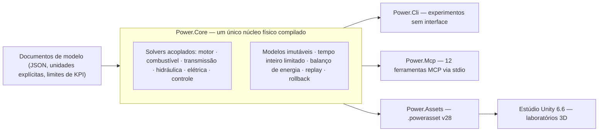

# Power!


[English](README.md) · [简体中文](README.zh-CN.md) · [Français](README.fr.md) · [Русский](README.ru.md) · [日本語](README.ja.md) · [한국어](README.ko.md) · [Deutsch](README.de.md) · [Español](README.es.md) · [Italiano](README.it.md) · **Português**

O Power! é um projeto de modelagem e experimentação de powertrains: um núcleo físico em C# multiplataforma, um estúdio Unity 3D e interfaces MCP voltadas a agentes. Modelos, solvers, experimentos e apresentação são responsabilidades separadas, para que agentes possam construir modelos, executar e ramificar experimentos e inspecionar evidências físicas por meio de contratos explícitos.

O repositório público é [Water-Run/Power](https://github.com/Water-Run/Power).

## Como tudo se encaixa



O mesmo modelo compilado alimenta cada ponto de entrada: CLI, MCP e o estúdio Unity importam os mesmos documentos e reproduzem as mesmas evidências.

## Tecnologia

| Camada | Versão e responsabilidade |
|---|---|
| Unity 3D | **Unity 6.6 / 6000.6.0f1**, estúdio de desktop |
| Renderização, entrada, UI | **URP 17.6.0**, **Input System 1.20.0**, UI Toolkit |
| Ferramentas C# | **.NET 10 SDK 10.0.400 / C# 14**, núcleo, CLI, serviços de agente, ferramentas de build |
| Assemblies para Unity | **.NET Standard 2.1**, compilados das mesmas fontes do núcleo e dos assets |
| Transporte do agente | **MCP C# SDK 2.2.0** oficial, stdio, arquivos de lock de dependências versionados |
| Protótipos nativos | **Zig 0.15.2**, biblioteca de pesquisa separada com o ABI binário preservado |

Fontes: [notas de versão do Unity](https://unity.com/releases/editor/whats-new/6000.6.0f1), [downloads do .NET 10](https://dotnet.microsoft.com/en-us/download/dotnet/10.0), [MCP SDK](https://www.nuget.org/packages/ModelContextProtocol/2.2.0).

O compilador do próprio Unity suporta C# 9 com .NET Standard 2.1 como perfil de API. O SDK .NET externo compila C# moderno em assemblies compatíveis com Unity, e os scripts dentro de `Unity/Assets` usam sintaxe C# 9. Um Unity Player não precisa de uma instalação separada do .NET 10. Veja o [suporte a compiladores do Unity](https://docs.unity3d.com/6000.6/Documentation/Manual/csharp-compiler.html) e a [documentação de compatibilidade de API](https://docs.unity3d.com/6000.6/Documentation/Manual/dotnet-profile-support.html).

## Compilar e verificar

Instale o SDK .NET fixado, depois instale o Zig e execute a partir da raiz do repositório no Windows, macOS ou Linux:

```sh
dotnet run --file tools/Build.cs -p:UseSharedCompilation=false -- install-zig
dotnet run --file tools/Build.cs -p:UseSharedCompilation=false -- verify
```

O `verify` compila a solução em série, exporta os assets de modelos do Unity, executa as verificações do núcleo e do agente, exercita um processo real de servidor MCP e verifica o runtime Zig, os hosts de bibliotecas compartilhadas, o ABI de P/Invoke do C# e a baseline numérica original. Os relatórios ficam em `artifacts/reports`.

> [!TIP]
> Um SDK fixado instalado em `.cache/dotnet/dotnet` também funciona; o Git não rastreia caches.

> [!IMPORTANT]
> A auditoria de fontes rejeita arquivos de implementação e cabeçalhos C/C++, além de código-fonte, bytecode e pacotes Lua. Mantenha o repositório livre deles.

A verificação em série passa no Windows; execuções anteriores também deixaram evidências no Linux e no macOS. O escopo de cada execução está em [docs/VALIDATION.pt-BR.md](docs/VALIDATION.pt-BR.md). A validação do Unity Editor, Play Mode, renderização e IL2CPP continua pendente — veja [Verificação do Unity](#verificação-do-unity).

Executar um experimento diretamente:

```sh
dotnet run --project src/Power.Cli -c Release -- assets/labs/electrothermal.power.json --output artifacts/reports/electrothermal.json
```

Os códigos de saída da CLI são `0` para um experimento aprovado, `2` para KPIs ou verificações de replay reprovados e `1` para entrada inválida ou erros de execução.

Os documentos de modelo especificam unidades, ticks fixos de nanossegundos, eventos de entrada e limites de KPI. Os relatórios incluem hashes das fontes, impressões digitais do modelo, informações de runtime, fidelidade, canais, evidências de replay e resíduos de energia.

## Estúdio Unity

1. Execute `dotnet run --file tools/Build.cs -p:UseSharedCompilation=false -- build`. Isso cria os assemblies Core e Assets em `Unity/Assets/Plugins` e arquivos `.powerasset` de exemplo em `Unity/Assets/Generated/Resources`.
2. Adicione o diretório `Unity` do repositório ao Unity Hub e selecione **6000.6.0f1**.
3. Deixe a resolução de pacotes e a importação de scripts terminarem — a primeira preparação gera os assets URP e os materiais.
4. Abra `Assets/Scenes/PowerLab.unity`, ou escolha **Power > Open laboratory**, e entre em Play Mode.

A cena constrói rotores, nós térmicos, conexões e controles de entrada a partir do modelo importado. Ela suporta pausa, reinício e experimentos salvos com eventos aplicados em ticks exatos de simulação. O experimento eletrotérmico padrão executa uma sequência de dez segundos de frenagem e recuperação; `ThermalNetwork.powerasset` é um experimento de troca térmica sem entradas externas. Use **Open in Studio** no Inspector de um asset de modelo para selecioná-lo.

O `SealedCylinder.powerasset` adiciona um experimento de compressão/expansão com um pistão móvel esquemático; seus canais de estado do gás, torque no virabrequim e energia usam a mesma semântica de modelo da CLI e do MCP. Veja a [documentação do cilindro](docs/SEALED_CYLINDER.pt-BR.md).

Exportar outro modelo após a compilação:

```sh
dotnet src/Power.Cli/bin/Release/net10.0/Power.Cli.dll export assets/labs/electrothermal.power.json --name "My laboratory" --output Unity/Assets/Models/MyLaboratory.powerasset
```

O importador verifica a integridade, recompila o modelo e confere a impressão digital — veja o [formato de asset](docs/ASSET_FORMAT.pt-BR.md). Arraste para orbitar e role para dar zoom. Cada `FixedUpdate` avança no máximo 2.000 ticks completos: 20 ms para o modelo padrão, 14 ms para o modelo térmico de 7 ms. A física não lê o `deltaTime` do render, então modelos com ticks muito finos não têm garantia de manter o tempo real.

## Verificação do Unity

As verificações do Unity Editor e do Play Mode são um ponto de entrada separado. Defina `POWER_UNITY_EDITOR` com o executável do editor e execute:

```sh
dotnet run --file tools/Build.cs -p:UseSharedCompilation=false -- unity-test
```

> [!WARNING]
> Este é o único caminho que conta como evidência real de Editor/Play Mode. O Unity ainda não foi exercitado no ambiente de desenvolvimento atual, e não há um build de Player validado.

## Interface de agente

Após a compilação, inicie o servidor como processo MCP stdio de um cliente:

```sh
dotnet /absolute/path/to/Power/src/Power.Mcp/bin/Release/net10.0/Power.Mcp.dll
```

O serviço expõe doze ferramentas com esquemas de entrada e saída:

| Ferramenta | O que faz |
|---|---|
| `get_capabilities` | Descobrir modelos, limites e convenções de tempo e revisão. Comece aqui. |
| `get_model_schema` | JSON Schema 2020-12 para `power.model.v1` |
| `get_example_model` | Obter um modelo sintético editável e seu experimento (33 exemplos) |
| `validate_model` | Validar um modelo sem executá-lo; diagnósticos estruturados de reparo |
| `run_experiment` | Execução sem interface e limitada, com replay em lote, KPIs e procedência |
| `export_model_asset` | Exportar um `.powerasset` portátil |
| `create_session` | Criar uma simulação independente; retorna id de sessão e revisão |
| `read_snapshot` | Ler tempo, revisão, hash de estado e saídas escolhidas |
| `set_inputs` | Mudar entradas atomicamente no instante atual da simulação |
| `step_session` | Avançar um número inteiro exato de ticks |
| `fork_session` | Ramificar a partir de um estado exato para experimentos contrafactuais |
| `close_session` | Liberar uma sessão e seu estado |

A saída do protocolo usa stdout; os logs usam stderr. Os agentes operam o núcleo sem interface, sem dirigir a UI do Unity nem chamar um provedor de modelos dentro do loop de física.

A [API de agente](docs/AGENT_API.pt-BR.md) documenta a configuração do cliente e as sequências de operação. O núcleo fornece `TryCompile`, canais descobríveis, `Fork`, cancelamento e rollback atômico; o workspace MCP adiciona verificações de revisão e relatórios compactos.

## Modelos e laboratórios

Os modelos C# executáveis hoje cobrem inércia rotacional, eixos elásticos com relações positivas ou negativas, motores CC RL, fontes de torque, capacidades térmicas, redes de condução de calor, cilindros adiabáticos fechados e câmaras de gás abertas com acoplamento pressão-trabalho por biela-manivela, perfis de válvulas a 360/720 graus cronometrados pelo virabrequim e combustão premisturada prescrita com transporte de combustível/ar/produtos. A [física de troca de gás](docs/GAS_EXCHANGE.pt-BR.md) validada — gás ideal, volume finito rastreado por massa e energia interna independentes e um orifício compressível com escoamento bloqueado e subcrítico — alimenta redes de gás de volume fixo e variável. Embreagens com capacidades estática/deslizante, restrições ideais de engrenagens e planetárias, conversores de torque mapeados e uma rede hidráulica com válvulas explícitas, flexibilidade e bomba acionada pelo virabrequim entram na mesma solução acoplada. Vazamentos de pressão explícitos e arrasto viscoso modelam as perdas da bomba; um motor CC pode alimentar a bomba pelo mesmo sistema elétrico e térmico. Um regulador de pressão amostrado ajusta a tensão do motor ou o duty cycle a partir da pressão hidráulica medida. Carga finita, resistência e polarização da bateria e cargas de acessórios comutadas alimentam o mesmo balanço de energia.

Trilhos de combustível líquido finitos e flexíveis agora fornecem combustível dosado por ciclo aos filmes. Uma parede finita paga o calor de evaporação, e apenas o vapor fica disponível para a queima prescrita. Um solenoide dependente da posição e um driver de dose amostrado podem mover uma agulha real, incluindo atraso de fechamento e ricochete no assento. Um replay limitado da planta pode planejar a remoção antecipada da tensão para rastrear a dose. Veja o [acionamento da agulha](docs/NEEDLE_ACTUATION.pt-BR.md), a [injeção líquida](docs/LIQUID_FUEL_INJECTION.pt-BR.md) e o [contrato do filme](docs/FUEL_FILM.pt-BR.md).

Um grafo de pesquisa de embreagem dupla de sete marchas adiciona eixos de entrada ímpares/pares, ré, três ramos de saída e calor explícito de sincronização/troca. Ele usa os mesmos primitivos de engrenagem/embreagem; uma máquina de estados amostrada pode ser dona dos seletores e da entrega escalonada de tração, confirmando a trava real e expondo falhas. Veja a [transmissão](docs/DUAL_CLUTCH_TRANSMISSION.pt-BR.md) e os contratos de [controle](docs/DCT_CONTROL.pt-BR.md).

Um grafo de pesquisa Ravigneaux de quatro faixas adiciona caminhos planetários compostos e um experimento de conversor/trava. Uma opção resolvida inclui giro interno dos planetas e inércia orbital. O acionamento por pistão hidráulico alimenta os cinco elementos de faixa e a trava do conversor. Veja o [contrato físico](docs/RAVIGNEAUX_TRANSMISSION.pt-BR.md).

> [!NOTE]
> Todos os parâmetros de exemplo são `unverified` — valores de pesquisa, não medidas calibradas.

Os laboratórios abaixo compartilham definições entre importações JSON, CLI, MCP e Studio. As exportações usam `power.asset.v28`, mantendo leitores para assets anteriores.

<details>
<summary>Laboratórios disponíveis (34)</summary>

| Nome do exemplo (`get_example_model`) | Laboratório | O que exercita |
|---|---|---|
| `electrothermal` | `assets/labs/electrothermal.power.json` | sequência padrão de frenagem/recuperação |
| só CLI | `assets/labs/thermal-network.power.json` | troca térmica sem entradas externas |
| `sealed-cylinder` | `assets/labs/sealed-cylinder.power.json` | compressão e expansão adiabáticas em volume fechado |
| `gas-network` | `assets/labs/gas-network.power.json` | câmaras de volume fixo, orifícios, elos térmicos de parede |
| `moving-cylinder` | `assets/labs/moving-cylinder.power.json` | motoreagem com volume dependente do virabrequim |
| `crank-timed-cylinder` | `assets/labs/crank-timed-cylinder.power.json` | perfis de admissão/escape a 720° em velocidade variável |
| `fired-cylinder` | `assets/labs/fired-cylinder.power.json` | queima premisturada com transporte de combustível/ar/produtos |
| `fired-clutch` | `assets/labs/fired-clutch.power.json` | embreagem a seco: engate, desengate, reengate |
| `fired-planetary` | `assets/labs/fired-planetary.power.json` | conjunto planetário e trocas com freio da coroa |
| `fired-converter` | `assets/labs/fired-converter.power.json` | mapas do conversor e trava programada |
| `fired-hydraulic` | `assets/labs/fired-hydraulic.power.json` | pressão por válvula para embreagens de troca/trava |
| `fired-pump` | `assets/labs/fired-pump.power.json` | bomba acionada pelo virabrequim, linha flexível, alívio |
| `fired-pump-losses` | `assets/labs/fired-pump-losses.power.json` | vazamentos da bomba, arrasto do eixo e calor |
| `electric-pump` | `assets/labs/electric-pump.power.json` | alimentação por motor CC e embreagem de pressão comandada por válvula |
| `pressure-regulated-pump` | `assets/labs/pressure-regulated-pump.power.json` | realimentação de pressão amostrada, tensão de motor limitada e recuperação de perturbações |
| `battery-regulated-pump` | `assets/labs/battery-regulated-pump.power.json` | queda de tensão da bateria, cargas de acessórios e pressão regulada por duty cycle |
| `piston-actuated-clutch` | `assets/labs/piston-actuated-clutch.power.json` | curso livre do pistão, contato das pastilhas, captura/liberação da embreagem e trabalho de fluido conservativo |
| `spool-regulated-pump` | `assets/labs/spool-regulated-pump.power.json` | realimentação mecânica de pressão, desvio dosado e captura da embreagem de pressão |
| `gas-accumulator-pump` | `assets/labs/gas-accumulator-pump.power.json` | armazenamento de gás finito, movimento do separador hidráulico e recuperação de energia transitória |
| `metered-fired-cylinder` | `assets/labs/metered-fired-cylinder.power.json` | trilho de combustível finito, dose por ciclo e queima premisturada separada |
| `film-fired-cylinder` | `assets/labs/film-fired-cylinder.power.json` | inventário líquido finito, evaporação paga pela parede e queima apenas do vapor |
| `liquid-injected-cylinder` | `assets/labs/liquid-injected-cylinder.power.json` | trilho líquido finito, injeção por ciclo, reposição do filme e evaporação separada |
| `needle-actuated-cylinder` | `assets/labs/needle-actuated-cylinder.power.json` | dinâmica solenoide/agulha, realimentação de dose amostrada e entrega excessiva observável |
| `closure-compensated-cylinder` | `assets/labs/closure-compensated-cylinder.power.json` | replay de fechamento limitado e planejamento de corte em ticks físicos |
| `dual-clutch-transmission` | `assets/labs/dual-clutch-transmission.power.json` | largada, pré-seleção, sete caminhos à frente e entregas subindo/descendo |
| `fired-dual-clutch` | `assets/labs/fired-dual-clutch.power.json` | motor em combustão com o caminho de potência DCT de pesquisa completo |
| `controlled-dual-clutch` | `assets/labs/controlled-dual-clutch.power.json` | sincronização amostrada, entrega escalonada e confirmação real da marcha |
| `hydraulic-ravigneaux-transmission` | `assets/labs/hydraulic-ravigneaux-transmission.power.json` | acionamento dinâmico por pistão alimentado por bomba de cinco elementos de faixa |
| `fired-hydraulic-ravigneaux` | `assets/labs/fired-hydraulic-ravigneaux.power.json` | trem conversor em combustão com seis atuadores hidráulicos |
| `resolved-ravigneaux-transmission` | `assets/labs/resolved-ravigneaux-transmission.power.json` | inércia de giro/órbita dos planetas com quatro restrições reais de engrenamento |
| `fired-resolved-ravigneaux-converter` | `assets/labs/fired-resolved-ravigneaux-converter.power.json` | trem conversor em combustão com movimento planetário resolvido |
| `ravigneaux-transmission` | `assets/labs/ravigneaux-transmission.power.json` | entregas planetárias compostas de quatro faixas subindo/descendo |
| `fired-ravigneaux-converter` | `assets/labs/fired-ravigneaux-converter.power.json` | motor em combustão, conversor/trava e transmissão composta |
| `controlled-fired-dual-clutch` | `assets/labs/controlled-fired-dual-clutch.power.json` | motor em combustão com controle DCT amostrado e evidência completa |

</details>

Solicite `get_example_model` com um `name`, ou execute um diretamente:

```sh
dotnet src/Power.Cli/bin/Release/net10.0/Power.Cli.dll assets/labs/<name>.power.json --output artifacts/reports/<name>.json
```

A compilação exporta um `.powerasset` correspondente para cada laboratório. As evidências de replay — limites de relatório pareados, totais de trabalho e calor, resíduos de energia — estão registradas em [docs/VALIDATION.pt-BR.md](docs/VALIDATION.pt-BR.md) e nos documentos de contrato por função do [índice de documentação](#documentação).

## Escopo e limites

Powertrains completos são o objetivo, não o estado atual. Ainda aberto:

- Comportamento completo do motor: modelagem de admissão/escape, bomba/reabastecimento líquido, comportamento magnético/eletrônico/pulverização refinado, fases dependentes da pressão, termoquímica mais rica e controle de ignição.
- Acionamento DCT completo, topologia AT e controles de transmissão (ECU/TCU).
- Mapas medidos de perdas e controle da bomba, química de bateria e BMS medidos, dinâmica medida de válvulas/acumuladores.
- Powertrains calibrados.

Protótipos nativos e testes anteriores foram portados para Zig em [legacy/native](legacy/native/README.md) como biblioteca de pesquisa separada; a funcionalidade deles não foi toda migrada para C#. As fontes C originais foram substituídas por portas Zig, com hashes originais e procedência Git em [legacy/native/migration-manifest.json](legacy/native/migration-manifest.json). A [fronteira Zig nativa](docs/NATIVE_ZIG.pt-BR.md) mantém o ABI binário versionado sem adicionar uma dependência nativa ao aplicativo C#/Unity.

A pesquisa OEM para EA211 DJS + DQ200 e PSA EC5 + AT8 permanece em [assets/samples](assets/samples), com suas evidências e limites de calibração intactos. Medições OEM ausentes continuam ausentes.

## Documentação

| Área | Documentos |
|---|---|
| Projeto | [Arquitetura](docs/ARCHITECTURE.pt-BR.md) · [Roteiro](docs/ROADMAP.pt-BR.md) · [Estado de desenvolvimento](docs/DEVELOPMENT_STATUS.pt-BR.md) · [Registro de validação](docs/VALIDATION.pt-BR.md) · [Notas de retomada do motor](docs/NEXT_ENGINE_STEP.pt-BR.md) |
| Interfaces | [API de agente](docs/AGENT_API.pt-BR.md) · [Formato de asset](docs/ASSET_FORMAT.pt-BR.md) · [Fronteira Zig nativa](docs/NATIVE_ZIG.pt-BR.md) |
| Motor e gás | [Cilindro fechado](docs/SEALED_CYLINDER.pt-BR.md) · [Rede de gás](docs/GAS_NETWORK.pt-BR.md) · [Troca de gás](docs/GAS_EXCHANGE.pt-BR.md) · [Cilindro móvel](docs/MOVING_CYLINDER.pt-BR.md) · [Comando de válvulas](docs/VALVE_TIMING.pt-BR.md) · [Combustão premisturada](docs/PREMIXED_COMBUSTION.pt-BR.md) |
| Combustível e injeção | [Medição de combustível](docs/FUEL_METERING.pt-BR.md) · [Filme de combustível](docs/FUEL_FILM.pt-BR.md) · [Injeção líquida](docs/LIQUID_FUEL_INJECTION.pt-BR.md) · [Acionamento da agulha](docs/NEEDLE_ACTUATION.pt-BR.md) · [Predição de fechamento](docs/CLOSURE_PREDICTION.pt-BR.md) |
| Transmissão | [Rede de embreagens](docs/CLUTCH_NETWORK.pt-BR.md) · [Física da embreagem](docs/CLUTCH_PHYSICS.pt-BR.md) · [Rede de engrenagens](docs/GEAR_NETWORK.pt-BR.md) · [Engrenagens ideais](docs/IDEAL_GEARS.pt-BR.md) · [Conversor](docs/CONVERTER_NETWORK.pt-BR.md) · [Transmissão de embreagem dupla](docs/DUAL_CLUTCH_TRANSMISSION.pt-BR.md) · [Controle DCT](docs/DCT_CONTROL.pt-BR.md) · [Transmissão Ravigneaux](docs/RAVIGNEAUX_TRANSMISSION.pt-BR.md) · [Planetárias resolvidas](docs/RESOLVED_PLANETS.pt-BR.md) |
| Hidráulica | [Rede hidráulica](docs/HYDRAULIC_NETWORK.pt-BR.md) · [Bomba](docs/HYDRAULIC_PUMP.pt-BR.md) · [Pistão](docs/HYDRAULIC_PISTON.pt-BR.md) · [Carretel](docs/HYDRAULIC_SPOOL.pt-BR.md) · [Acumulador de gás](docs/GAS_PISTON.pt-BR.md) · [Acionamento AT](docs/AT_HYDRAULIC_ACTUATION.pt-BR.md) |

As traduções desta página ficam ao lado como `README.<locale>.md`. Cada documento no [índice](docs/README.pt-BR.md) tem as mesmas nove traduções.

## Licença

O material original do Power! é licenciado sob **GPL-3.0-or-later com a exceção de vinculação Unity**. Leia juntos o [COPYING.NOTICE](COPYING.NOTICE), o [texto GPLv3](LICENSE) não modificado e a [exceção](UNITY-LINKING-EXCEPTION.md); a versão em inglês prevalece.

A exceção permite a combinação Unity especificada mantendo o Power! e suas modificações sob os requisitos da GPL. O Unity e outros softwares de terceiros mantêm suas próprias licenças; a exceção não concede direitos de seus autores — veja os [avisos de terceiros](THIRD_PARTY_NOTICES.md). Preserve os arquivos de licença, direitos autorais e avisos aplicáveis ao distribuir fontes ou binários.
