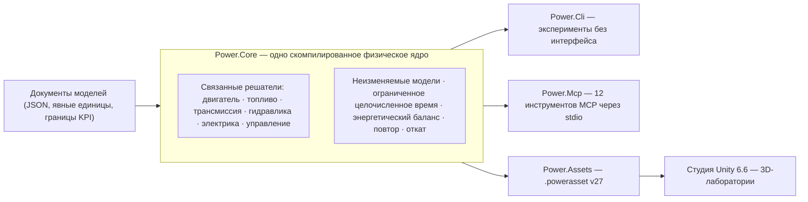

# Power!


[English](README.md) · [简体中文](README.zh-CN.md) · [Français](README.fr.md) · **Русский** · [日本語](README.ja.md) · [한국어](README.ko.md) · [Deutsch](README.de.md) · [Español](README.es.md) · [Italiano](README.it.md) · [Português](README.pt-BR.md)

Power! — проект моделирования и исследования силовых агрегатов (powertrain): кроссплатформенное физическое ядро на C#, студия Unity 3D и интерфейсы MCP для агентов. Модели, решатели, эксперименты и представление разделены, поэтому агенты могут собирать модели, запускать и ветвить эксперименты и изучать физические свидетельства через явные контракты.

Публичный репозиторий — [Water-Run/Power](https://github.com/Water-Run/Power).

## Как это устроено



Одна и та же скомпилированная модель обслуживает все точки входа: CLI, MCP и студия Unity импортируют одни и те же документы и повторяют одни и те же свидетельства.

## Технологии

| Слой | Версия и ответственность |
|---|---|
| Unity 3D | **Unity 6.6 / 6000.6.0f1**, настольная студия |
| Рендеринг, ввод, UI | **URP 17.6.0**, **Input System 1.20.0**, UI Toolkit |
| Инструменты C# | **.NET 10 SDK 10.0.400 / C# 14**, ядро, CLI, службы агентов, сборка |
| Сборки для Unity | **.NET Standard 2.1**, компилируются из тех же исходников ядра и активов |
| Транспорт агентов | Официальный **MCP C# SDK 2.2.0**, stdio, зафиксированные файлы блокировок зависимостей |
| Нативные прототипы | **Zig 0.15.2**, отдельная исследовательская библиотека с сохранённым бинарным ABI |

Источники: [примечания к выпуску Unity](https://unity.com/releases/editor/whats-new/6000.6.0f1), [загрузки .NET 10](https://dotnet.microsoft.com/en-us/download/dotnet/10.0), [MCP SDK](https://www.nuget.org/packages/ModelContextProtocol/2.2.0).

Собственный компилятор Unity поддерживает C# 9 с профилем API .NET Standard 2.1. Внешний SDK .NET компилирует современный C# в совместимые с Unity сборки, а скрипты внутри `Unity/Assets` используют синтаксис C# 9. Unity Player не требует отдельной установки .NET 10. См. [поддержку компиляторов Unity](https://docs.unity3d.com/6000.6/Documentation/Manual/csharp-compiler.html) и [документацию совместимости API](https://docs.unity3d.com/6000.6/Documentation/Manual/dotnet-profile-support.html).

## Сборка и проверка

Установите закреплённый SDK .NET, затем установите Zig и выполните из корня репозитория в Windows, macOS или Linux:

```sh
dotnet run --file tools/Build.cs -p:UseSharedCompilation=false -- install-zig
dotnet run --file tools/Build.cs -p:UseSharedCompilation=false -- verify
```

`verify` последовательно собирает решение, экспортирует модельные активы Unity, запускает проверки ядра и агента, поднимает реальный процесс MCP-сервера и проверяет среду выполнения Zig, хосты динамических библиотек, C# P/Invoke ABI и исходную числовую базу. Отчёты попадают в `artifacts/reports`.

> [!TIP]
> Подойдёт и закреплённый SDK, установленный в `.cache/dotnet/dotnet`; кеши Git не отслеживает.

> [!IMPORTANT]
> Аудит исходников отклоняет файлы реализации и заголовки C/C++, а также исходный код, байткод и пакеты Lua. Держите репозиторий свободным от них.

Последовательная проверка проходит в Windows; более ранние запуски оставили свидетельства и для Linux и macOS. Объём каждого запуска — в [docs/VALIDATION.ru.md](docs/VALIDATION.ru.md). Проверка Unity Editor, Play Mode, рендеринга и IL2CPP ещё не проведена — см. [Проверка Unity](#проверка-unity).

Запустить эксперимент напрямую:

```sh
dotnet run --project src/Power.Cli -c Release -- assets/labs/electrothermal.power.json --output artifacts/reports/electrothermal.json
```

Коды выхода CLI: `0` — эксперимент пройден, `2` — провалены KPI или проверки повтора, `1` — неверный ввод или ошибки выполнения.

Документы моделей задают единицы, фиксированные наносекундные тики, входные события и границы KPI. Отчёты включают хеши исходников, отпечатки моделей, сведения о среде, точность, каналы, свидетельства повтора и остатки энергии.

## Студия Unity

1. Выполните `dotnet run --file tools/Build.cs -p:UseSharedCompilation=false -- build`. Это создаст сборки Core и Assets в `Unity/Assets/Plugins` и примеры `.powerasset` в `Unity/Assets/Generated/Resources`.
2. Добавьте каталог `Unity` репозитория в Unity Hub и выберите **6000.6.0f1**.
3. Дождитесь завершения разрешения пакетов и импорта скриптов — первая подготовка создаёт активы URP и материалы.
4. Откройте `Assets/Scenes/PowerLab.unity` или выберите **Power > Open laboratory**, затем войдите в Play Mode.

Сцена строит роторы, тепловые узлы, соединения и элементы управления из импортированной модели. Поддерживаются пауза, сброс и сохранённые эксперименты с событиями, применяемыми в точных тиках симуляции. Стандартный электротепловой эксперимент выполняет десятисекундную последовательность торможения и восстановления; `ThermalNetwork.powerasset` — эксперимент теплообмена без внешних входов. Выберите его через **Open in Studio** в инспекторе актива модели.

`SealedCylinder.powerasset` добавляет эксперимент сжатия/расширения со схематичным движущимся поршнем; его каналы состояния газа, крутящего момента коленвала и энергии используют ту же семантику модели, что CLI и MCP. См. [документацию цилиндра](docs/SEALED_CYLINDER.ru.md).

Экспорт другой модели после сборки:

```sh
dotnet src/Power.Cli/bin/Release/net10.0/Power.Cli.dll export assets/labs/electrothermal.power.json --name "My laboratory" --output Unity/Assets/Models/MyLaboratory.powerasset
```

Импортёр проверяет целостность, перекомпилирует модель и сверяет отпечаток — см. [формат активов](docs/ASSET_FORMAT.ru.md). Перетаскивание — вращение, колесо — масштаб. Каждый `FixedUpdate` продвигает не более 2 000 полных тиков: 20 мс для стандартной модели, 14 мс для 7-мс тепловой модели. Физика не читает `deltaTime` рендеринга, поэтому модели с очень мелким тиком не гарантированно выдерживают астрономическое время.

## Проверка Unity

Проверки Unity Editor и Play Mode — отдельная точка входа. Установите `POWER_UNITY_EDITOR` на исполняемый файл редактора и выполните:

```sh
dotnet run --file tools/Build.cs -p:UseSharedCompilation=false -- unity-test
```

> [!WARNING]
> Только этот путь считается реальным свидетельством Editor/Play Mode. Unity в текущей среде разработки ещё не запускался, проверенной сборки Player нет.

## Интерфейс агента

После сборки запустите сервер как stdio-процесс MCP для клиента:

```sh
dotnet /absolute/path/to/Power/src/Power.Mcp/bin/Release/net10.0/Power.Mcp.dll
```

Служба открывает двенадцать инструментов со схемами входа и выхода:

| Инструмент | Назначение |
|---|---|
| `get_capabilities` | Узнать модели, ограничения, соглашения о времени и ревизиях. Начните отсюда. |
| `get_model_schema` | JSON Schema 2020-12 для `power.model.v1` |
| `get_example_model` | Получить редактируемую синтетическую модель и эксперимент (33 примера) |
| `validate_model` | Проверить модель без запуска; структурированная диагностика исправлений |
| `run_experiment` | Ограниченный запуск без интерфейса с пакетным повтором, KPI и происхождением |
| `export_model_asset` | Экспортировать переносимый `.powerasset` |
| `create_session` | Создать независимую симуляцию; возвращает id сессии и ревизию |
| `read_snapshot` | Прочитать время, ревизию, хеш состояния и выбранные выходы |
| `set_inputs` | Атомарно изменить входы в текущий момент симуляции |
| `step_session` | Продвинуть на точное целое число тиков |
| `fork_session` | Ветвление от точного состояния для контрфактических экспериментов |
| `close_session` | Освободить сессию и её состояние |

Вывод протокола идёт в stdout; журналы — в stderr. Агенты управляют ядром без интерфейса, не водя UI Unity и не вызывая провайдера моделей внутри физического цикла.

[API агента](docs/AGENT_API.ru.md) описывает настройку клиента и последовательности операций. Ядро предоставляет `TryCompile`, обнаруживаемые каналы, `Fork`, отмену и атомарный откат; рабочая область MCP добавляет проверки ревизий и компактные отчёты.

## Модели и лаборатории

Исполняемые модели на C# сегодня охватывают вращательную инерцию, упругие валы с положительными и отрицательными передаточными отношениями, двигатели постоянного тока RL, источники момента, теплоёмкости, сети теплопроводности, адиабатические закрытые цилиндры и открытые газовые камеры со связью давления и работы через кривошипно-шатунный механизм, клапанными профилями 360/720 градусов по углу коленвала и предписанным предварительно смешанным сгоранием с переносом топлива/воздуха/продуктов. Проверенная [физика газообмена](docs/GAS_EXCHANGE.ru.md) — идеальный газ, конечный объём с независимым отслеживанием массы и внутренней энергии, сжимаемое отверстие с критическим и докритическим течением — питает газовые сети постоянного и переменного объёма. Сцепления со статической/скользящей ёмкостью, идеальные зубчатые и планетарные связи, табличные гидротрансформаторы и гидравлическая сеть с явными клапанами, податливостью и насосом от коленвала входят в ту же связанную систему. Явные утечки давления и вязкое сопротивление моделируют потери насоса; двигатель постоянного тока может питать насос через ту же электрическую и тепловую систему. Дискретный регулятор давления корректирует напряжение двигателя или скважность по измеренному гидравлическому давлению. Конечный заряд, сопротивление и поляризация батареи, коммутируемые вспомогательные нагрузки — всё в том же энергетическом балансе.

Конечные податливые жидкостные рейлы теперь подают дозированное по циклу топливо в плёнки. Конечная стенка платит теплотой испарения, и в предписанном сгорании участвует только пар. Соленоид, зависящий от положения, и дискретный регулятор дозы могут двигать реальную иглу, включая задержку закрытия и отскок от седла. Ограниченный повтор объекта может планировать более раннее снятие напряжения для отслеживания дозы. См. [привод иглы](docs/NEEDLE_ACTUATION.ru.md), [жидкостный впрыск](docs/LIQUID_FUEL_INJECTION.ru.md) и [контракт плёнки](docs/FUEL_FILM.ru.md).

Семискоростной исследовательский граф с двумя сцеплениями добавляет нечётный/чётный входные валы, задний ход, три выходные ветви и явную теплоту синхронизации/переключения. Он использует те же примитивы шестерён и сцеплений; дискретный автомат может владеть селекторами и поэтапной передачей тяги, подтверждая реальную блокировку и обнаруживая неисправности. См. [трансмиссию](docs/DUAL_CLUTCH_TRANSMISSION.ru.md) и контракты [управления](docs/DCT_CONTROL.ru.md).

Исследовательский граф Ravigneaux с четырьмя диапазонами добавляет составные планетарные пути и эксперимент с гидротрансформатором/блокировкой. Разрешённый вариант учитывает собственное вращение сателлитов и орбитальную инерцию. Гидравлический поршневой привод обслуживает пять диапазонных элементов и блокировку гидротрансформатора. См. [физический контракт](docs/RAVIGNEAUX_TRANSMISSION.ru.md).

> [!NOTE]
> Все параметры образцов — `unverified`: исследовательские значения, а не калиброванные измерения.

Лаборатории ниже разделяют определения между импортом JSON, CLI, MCP и Studio. Экспорт использует `power.asset.v27`, читатели прежних активов сохранены.

<details>
<summary>Доступные лаборатории (34)</summary>

| Имя образца (`get_example_model`) | Лаборатория | Что проверяет |
|---|---|---|
| `electrothermal` | `assets/labs/electrothermal.power.json` | стандартная последовательность торможения/восстановления |
| только CLI | `assets/labs/thermal-network.power.json` | теплообмен без внешних входов |
| `sealed-cylinder` | `assets/labs/sealed-cylinder.power.json` | закрытое адиабатическое сжатие и расширение |
| `gas-network` | `assets/labs/gas-network.power.json` | камеры постоянного объёма, отверстия, тепловые связи со стенкой |
| `moving-cylinder` | `assets/labs/moving-cylinder.power.json` | прокрутка с объёмом от коленвала |
| `crank-timed-cylinder` | `assets/labs/crank-timed-cylinder.power.json` | профили впуска/выпуска 720° при меняющейся скорости |
| `fired-cylinder` | `assets/labs/fired-cylinder.power.json` | предварительно смешанное сгорание с переносом топлива/воздуха/продуктов |
| `fired-clutch` | `assets/labs/fired-clutch.power.json` | сухое сцепление: замыкание, размыкание, повторное замыкание |
| `fired-planetary` | `assets/labs/fired-planetary.power.json` | планетарный ряд и переключение торможением короны |
| `fired-converter` | `assets/labs/fired-converter.power.json` | карты гидротрансформатора и плановая блокировка |
| `fired-hydraulic` | `assets/labs/fired-hydraulic.power.json` | давление от клапанов для сцеплений переключения/блокировки |
| `fired-pump` | `assets/labs/fired-pump.power.json` | насос от коленвала, податливая линия, предохранительный клапан |
| `fired-pump-losses` | `assets/labs/fired-pump-losses.power.json` | утечки насоса, сопротивление вала и теплота |
| `electric-pump` | `assets/labs/electric-pump.power.json` | питание от двигателя постоянного тока и сцепление давления с клапанным управлением |
| `pressure-regulated-pump` | `assets/labs/pressure-regulated-pump.power.json` | дискретная обратная связь по давлению, ограниченное напряжение двигателя и восстановление после возмущений |
| `battery-regulated-pump` | `assets/labs/battery-regulated-pump.power.json` | просадка напряжения батареи, вспомогательные нагрузки и регулирование давления скважностью |
| `piston-actuated-clutch` | `assets/labs/piston-actuated-clutch.power.json` | свободный ход поршня, контакт накладок, захват/освобождение сцепления и сохраняющая работа жидкости |
| `spool-regulated-pump` | `assets/labs/spool-regulated-pump.power.json` | механическая обратная связь по давлению, дозированный байпас и захват сцепления давления |
| `gas-accumulator-pump` | `assets/labs/gas-accumulator-pump.power.json` | конечный газовый накопитель, движение гидравлического разделителя и рекуперация переходной энергии |
| `metered-fired-cylinder` | `assets/labs/metered-fired-cylinder.power.json` | конечная топливная рейка, дозирование по циклу и отдельное premixed-сгорание |
| `film-fired-cylinder` | `assets/labs/film-fired-cylinder.power.json` | конечный запас жидкости, оплаченное стенкой испарение и сгорание только пара |
| `liquid-injected-cylinder` | `assets/labs/liquid-injected-cylinder.power.json` | конечная жидкостная рейка, впрыск по циклу, пополнение плёнки и отдельное испарение |
| `needle-actuated-cylinder` | `assets/labs/needle-actuated-cylinder.power.json` | динамика соленоида/иглы, дискретная обратная связь по дозе и наблюдаемый избыточный впрыск |
| `closure-compensated-cylinder` | `assets/labs/closure-compensated-cylinder.power.json` | ограниченный повтор закрытия и планирование отключения по физическим тикам |
| `dual-clutch-transmission` | `assets/labs/dual-clutch-transmission.power.json` | трогание, предвыбор, семь передних путей и передачи вверх/вниз |
| `fired-dual-clutch` | `assets/labs/fired-dual-clutch.power.json` | двигатель со сгоранием и полный исследовательский путь DCT |
| `controlled-dual-clutch` | `assets/labs/controlled-dual-clutch.power.json` | дискретная синхронизация, поэтапная передача и фактическое подтверждение передачи |
| `hydraulic-ravigneaux-transmission` | `assets/labs/hydraulic-ravigneaux-transmission.power.json` | динамический поршневой привод пяти диапазонных элементов от насоса |
| `fired-hydraulic-ravigneaux` | `assets/labs/fired-hydraulic-ravigneaux.power.json` | силовая цепь с гидротрансформатором и шестью гидравлическими исполнительными механизмами |
| `resolved-ravigneaux-transmission` | `assets/labs/resolved-ravigneaux-transmission.power.json` | инерция вращения/орбиты сателлитов и четыре фактические связи зацепления |
| `fired-resolved-ravigneaux-converter` | `assets/labs/fired-resolved-ravigneaux-converter.power.json` | силовая цепь с гидротрансформатором и разрешённым движением сателлитов |
| `ravigneaux-transmission` | `assets/labs/ravigneaux-transmission.power.json` | составные планетарные передачи вверх/вниз в четырёх диапазонах |
| `fired-ravigneaux-converter` | `assets/labs/fired-ravigneaux-converter.power.json` | двигатель со сгоранием, гидротрансформатор/блокировка и составная трансмиссия |
| `controlled-fired-dual-clutch` | `assets/labs/controlled-fired-dual-clutch.power.json` | двигатель со сгоранием, дискретное управление DCT и полные свидетельства |

</details>

Запросите `get_example_model` с параметром `name` или запустите напрямую:

```sh
dotnet src/Power.Cli/bin/Release/net10.0/Power.Cli.dll assets/labs/<name>.power.json --output artifacts/reports/<name>.json
```

Сборка экспортирует соответствующий `.powerasset` для каждой лаборатории. Свидетельства повтора — совпадающие границы отчётов, полные работы и теплота, остатки энергии — зафиксированы в [docs/VALIDATION.ru.md](docs/VALIDATION.ru.md) и контрактных документах по каждой функции из [индекса документации](#документация).

## Объём и ограничения

Полные силовые агрегаты — цель, а не текущее состояние. Ещё открыто:

- Полное поведение двигателя: моделирование впуска/выпуска, жидкостная подкачка/заправка, уточнённое магнитное/электронное/распыляющее поведение, фазовые переходы от давления, более богатая термохимия и управление зажиганием.
- Полный привод DCT, топология AT и управление трансмиссией (ECU/TCU).
- Измеренные карты потерь и управления насоса, измеренная химия батареи и BMS, измеренная динамика клапанов/аккумуляторов.
- Калиброванные силовые агрегаты.

Более ранние нативные прототипы и тесты перенесены на Zig в [legacy/native](legacy/native/README.md) как отдельная исследовательская библиотека; их функциональность перенесена в C# не полностью. Исходные тексты на C заменены портами на Zig, исходные хеши и Git-происхождение — в [legacy/native/migration-manifest.json](legacy/native/migration-manifest.json). [Граница нативного Zig](docs/NATIVE_ZIG.ru.md) сохраняет версионируемый бинарный ABI, не добавляя нативной зависимости приложению C#/Unity.

OEM-исследования EA211 DJS + DQ200 и PSA EC5 + AT8 остаются в [assets/samples](assets/samples) с нетронутыми свидетельствами и границами калибровки. Отсутствующие OEM-измерения остаются отсутствующими.

## Документация

| Область | Документы |
|---|---|
| Проект | [Архитектура](docs/ARCHITECTURE.ru.md) · [Дорожная карта](docs/ROADMAP.ru.md) · [Статус разработки](docs/DEVELOPMENT_STATUS.ru.md) · [Журнал валидации](docs/VALIDATION.ru.md) · [Заметки о возобновлении работ по двигателю](docs/NEXT_ENGINE_STEP.ru.md) |
| Интерфейсы | [API агента](docs/AGENT_API.ru.md) · [Формат активов](docs/ASSET_FORMAT.ru.md) · [Граница нативного Zig](docs/NATIVE_ZIG.ru.md) |
| Двигатель и газ | [Закрытый цилиндр](docs/SEALED_CYLINDER.ru.md) · [Газовая сеть](docs/GAS_NETWORK.ru.md) · [Газообмен](docs/GAS_EXCHANGE.ru.md) · [Подвижный цилиндр](docs/MOVING_CYLINDER.ru.md) · [Фазы клапанов](docs/VALVE_TIMING.ru.md) · [Premixed-сгорание](docs/PREMIXED_COMBUSTION.ru.md) |
| Топливо и впрыск | [Дозирование топлива](docs/FUEL_METERING.ru.md) · [Топливная плёнка](docs/FUEL_FILM.ru.md) · [Жидкостный впрыск](docs/LIQUID_FUEL_INJECTION.ru.md) · [Привод иглы](docs/NEEDLE_ACTUATION.ru.md) · [Предсказание закрытия](docs/CLOSURE_PREDICTION.ru.md) |
| Трансмиссия | [Сеть сцеплений](docs/CLUTCH_NETWORK.ru.md) · [Физика сцепления](docs/CLUTCH_PHYSICS.ru.md) · [Зубчатая сеть](docs/GEAR_NETWORK.ru.md) · [Идеальные шестерни](docs/IDEAL_GEARS.ru.md) · [Гидротрансформатор](docs/CONVERTER_NETWORK.ru.md) · [Трансмиссия с двумя сцеплениями](docs/DUAL_CLUTCH_TRANSMISSION.ru.md) · [Управление DCT](docs/DCT_CONTROL.ru.md) · [Трансмиссия Ravigneaux](docs/RAVIGNEAUX_TRANSMISSION.ru.md) · [Разрешённые планетарные ряды](docs/RESOLVED_PLANETS.ru.md) |
| Гидравлика | [Гидравлическая сеть](docs/HYDRAULIC_NETWORK.ru.md) · [Насос](docs/HYDRAULIC_PUMP.ru.md) · [Поршень](docs/HYDRAULIC_PISTON.ru.md) · [Золотник](docs/HYDRAULIC_SPOOL.ru.md) · [Газовый аккумулятор](docs/GAS_PISTON.ru.md) · [Привод AT](docs/AT_HYDRAULIC_ACTUATION.ru.md) |

Переводы этой страницы лежат рядом как `README.<locale>.md`. У каждого документа в [указателе](docs/README.ru.md) те же девять переводов.

## Лицензия

Оригинальные материалы Power! лицензированы под **GPL-3.0-or-later с исключением для связывания с Unity**. Читайте вместе [COPYING.NOTICE](COPYING.NOTICE), немодифицированный [текст GPLv3](LICENSE) и [исключение](UNITY-LINKING-EXCEPTION.md); юридически действующей является английская версия.

Исключение разрешает указанную комбинацию с Unity, сохраняя Power! и его модификации под требованиями GPL. Unity и другое стороннее ПО сохраняют собственные лицензии; исключение не предоставляет прав, принадлежащих их авторам — см. [уведомления третьих сторон](THIRD_PARTY_NOTICES.md). Сохраняйте применимые файлы лицензий, авторских прав и уведомлений при распространении исходников или бинарников.
