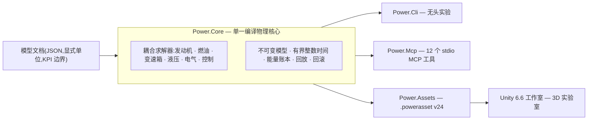

# Power!


[English](README.md) · **简体中文** · [Français](README.fr.md) · [Русский](README.ru.md) · [日本語](README.ja.md) · [한국어](README.ko.md) · [Deutsch](README.de.md) · [Español](README.es.md) · [Italiano](README.it.md) · [Português](README.pt-BR.md)

Power! 是一个动力总成建模与实验项目:包含跨平台 C# 物理核心、Unity 3D 工作室,以及面向智能体的 MCP 接口。模型、求解器、实验与展示彼此分离,智能体可以通过显式契约构建模型、运行与分支实验,并检查物理证据。

公开仓库是 [Water-Run/Power](https://github.com/Water-Run/Power)。

## 整体结构



同一个编译模型驱动所有入口:CLI、MCP 与 Unity 工作室导入相同的文档,并回放相同的证据。

## 技术栈

| 层 | 版本与职责 |
|---|---|
| Unity 3D | **Unity 6.6 / 6000.6.0f1**,桌面工作室 |
| 渲染、输入、UI | **URP 17.6.0**、**Input System 1.20.0**、UI Toolkit |
| C# 工具链 | **.NET 10 SDK 10.0.400 / C# 14**,核心、CLI、智能体服务、构建工具 |
| Unity 侧程序集 | **.NET Standard 2.1**,由同一套核心与资产源码编译 |
| 智能体传输 | 官方 **MCP C# SDK 2.2.0**,stdio,提交依赖锁定文件 |
| 原型存档 | **Zig 0.15.2**,独立研究库,保留二进制 ABI |

来源:[Unity 发行说明](https://unity.com/releases/editor/whats-new/6000.6.0f1)、[.NET 10 下载](https://dotnet.microsoft.com/en-us/download/dotnet/10.0)、[MCP SDK](https://www.nuget.org/packages/ModelContextProtocol/2.2.0)。

Unity 自带编译器支持 C# 9,API 档位为 .NET Standard 2.1。外部 .NET SDK 把现代 C# 编译成 Unity 兼容程序集,`Unity/Assets` 内的脚本使用 C# 9 语法。Unity Player 不需要单独安装 .NET 10。参见 [Unity 编译器支持](https://docs.unity3d.com/6000.6/Documentation/Manual/csharp-compiler.html)与 [API 兼容性文档](https://docs.unity3d.com/6000.6/Documentation/Manual/dotnet-profile-support.html)。

## 构建与验证

安装锁定的 .NET SDK,然后安装 Zig,在仓库根目录于 Windows、macOS 或 Linux 上运行:

```sh
dotnet run --file tools/Build.cs -p:UseSharedCompilation=false -- install-zig
dotnet run --file tools/Build.cs -p:UseSharedCompilation=false -- verify
```

`verify` 串行构建解决方案,导出 Unity 模型资产,运行核心与智能体检查,拉起真实的 MCP 服务器进程,并验证 Zig 运行时、共享库宿主、C# P/Invoke ABI 以及原始数值基线。报告输出到 `artifacts/reports`。

> [!TIP]
> 安装在 `.cache/dotnet/dotnet` 的锁定 SDK 也可以;缓存不进入 Git。

> [!IMPORTANT]
> 源码审计拒绝 C/C++ 实现文件与头文件,以及 Lua 源码、字节码和包。请保持仓库不含这些内容。

串行验证在 Windows 上通过;更早的运行也有 Linux 与 macOS 证据。每次运行的范围见 [docs/VALIDATION.zh-CN.md](docs/VALIDATION.zh-CN.md)。Unity 编辑器、Play Mode、渲染与 IL2CPP 验证仍未完成——参见 [Unity 验证](#unity-验证)。

直接运行一个实验:

```sh
dotnet run --project src/Power.Cli -c Release -- assets/labs/electrothermal.power.json --output artifacts/reports/electrothermal.json
```

CLI 退出码:`0` 表示实验通过,`2` 表示 KPI 或回放检查失败,`1` 表示输入无效或执行错误。

模型文档声明单位、固定纳秒步长、输入事件与 KPI 边界。报告包含源哈希、模型指纹、运行时信息、保真度、通道、回放证据与能量残差。

## Unity 工作室

1. 运行 `dotnet run --file tools/Build.cs -p:UseSharedCompilation=false -- build`。它会在 `Unity/Assets/Plugins` 生成 Core 与 Assets 程序集,并在 `Unity/Assets/Generated/Resources` 生成示例 `.powerasset` 文件。
2. 在 Unity Hub 中添加本仓库的 `Unity` 目录并选择 **6000.6.0f1**。
3. 等待包解析与脚本导入完成——首次准备会生成 URP 与材质资产。
4. 打开 `Assets/Scenes/PowerLab.unity`,或选择 **Power > Open laboratory**,然后进入 Play Mode。

场景根据导入的模型构建转子、热节点、连接与输入控件。它支持暂停、重置和保存的实验,事件在精确的仿真节拍上生效。默认的电—热实验运行十秒制动与恢复序列;`ThermalNetwork.powerasset` 是无外部输入的热交换实验。在模型资产 Inspector 中使用 **Open in Studio** 选择它。

`SealedCylinder.powerasset` 增加了带示意运动活塞的压缩/膨胀实验;其气体状态、曲轴扭矩与能量通道使用与 CLI 和 MCP 相同的模型语义。参见[气缸文档](docs/SEALED_CYLINDER.zh-CN.md)。

构建完成后导出其他模型:

```sh
dotnet src/Power.Cli/bin/Release/net10.0/Power.Cli.dll export assets/labs/electrothermal.power.json --name "My laboratory" --output Unity/Assets/Models/MyLaboratory.powerasset
```

导入器检查完整性、重新编译模型并校验指纹——参见[资产格式](docs/ASSET_FORMAT.zh-CN.md)。拖动旋转,滚轮缩放。每个 `FixedUpdate` 最多推进 2,000 个完整节拍:默认模型 20 ms,7 ms 热模型 14 ms。物理不读取渲染 `deltaTime`,因此极小步长的模型不保证保持挂钟实时。

## Unity 验证

Unity 编辑器与 Play Mode 检查是独立入口。设置 `POWER_UNITY_EDITOR` 指向编辑器可执行文件,然后运行:

```sh
dotnet run --file tools/Build.cs -p:UseSharedCompilation=false -- unity-test
```

> [!WARNING]
> 只有这条路径才算真实的编辑器/Play Mode 证据。当前开发环境尚未运行 Unity,也没有经过验证的 Player 构建。

## 智能体接口

构建完成后,把服务器作为客户端的 stdio MCP 进程启动:

```sh
dotnet /absolute/path/to/Power/src/Power.Mcp/bin/Release/net10.0/Power.Mcp.dll
```

服务通过带输入输出 schema 的十二个工具暴露能力:

| 工具 | 作用 |
|---|---|
| `get_capabilities` | 发现模型、限制、时间与修订约定。从这里开始。 |
| `get_model_schema` | `power.model.v1` 的 JSON Schema 2020-12 |
| `get_example_model` | 获取可编辑的合成模型与实验(33 个示例) |
| `validate_model` | 不运行即校验模型;结构化修复诊断 |
| `run_experiment` | 有界无头运行,含批量回放、KPI 与溯源 |
| `export_model_asset` | 导出可移植的 `.powerasset` |
| `create_session` | 创建独立仿真;返回会话 id 与修订号 |
| `read_snapshot` | 读取时间、修订号、状态哈希与所选输出 |
| `set_inputs` | 在当前仿真时刻原子地修改输入 |
| `step_session` | 推进精确整数个节拍 |
| `fork_session` | 从精确状态分支,用于反事实实验 |
| `close_session` | 释放会话及其状态 |

协议输出走 stdout;日志走 stderr。智能体操作无头核心,不驱动 Unity UI,也不在物理回路内调用模型提供商。

[智能体 API](docs/AGENT_API.zh-CN.md) 文档说明客户端配置与操作序列。核心提供 `TryCompile`、可发现通道、`Fork`、取消与原子回滚;MCP 工作区补充修订检查与紧凑报告。

## 模型与实验室

当前可执行的 C# 模型覆盖:转动惯量、带正负速比的弹性轴、RL 直流电机、扭矩源、热容、热传导网络、绝热封闭气缸,以及带滑块—曲柄压力功耦合、曲轴定时 360/720 度气门曲线和预设预混燃烧(燃油/空气/产物输运)的开放气室。经过验证的[换气物理](docs/GAS_EXCHANGE.zh-CN.md)——理想气体、以独立质量和内能追踪的有限体积、含临界与亚临界流动的可压缩孔口——为定容与变容气体网络供能。带静态/滑摩容量的离合器、理想齿轮与行星约束、映射式液力变矩器,以及含显式阀门、柔性与曲轴驱动泵源的液压网络,加入同一个耦合求解。显式压力泄漏与黏性阻力建模泵损耗;直流电机可以通过同一套电气与热系统为泵供能。采样压力调节器根据实测液压调整电机电压或电池供电电机的占空比。有限电量、电池内阻与极化、开关式附件负载汇入同一能量账本。这些模型共享耦合积分与能量账本。

有限柔性液轨现在把按循环计量的燃油供给油膜。有限的壁面支付蒸发热量,只有蒸气可参与预设燃烧。位置相关的电磁铁与采样剂量驱动器可以驱动真实的针阀,包括关闭延迟与阀座回弹。有界的对象回放可以为剂量跟踪规划更早的断电时刻。参见[针阀驱动](docs/NEEDLE_ACTUATION.zh-CN.md)、[低压喷射](docs/LIQUID_FUEL_INJECTION.zh-CN.md)与[油膜契约](docs/FUEL_FILM.zh-CN.md)。

七速双离合研究图增加奇/偶输入轴、倒挡、三个输出分支与显式的同步/换挡热量。它使用相同的齿轮/离合器原语;采样状态机可以接管选挡与分阶段动力交接,确认真实锁止并暴露故障。参见[变速器](docs/DUAL_CLUTCH_TRANSMISSION.zh-CN.md)与[控制](docs/DCT_CONTROL.zh-CN.md)契约。

四挡域 Ravigneaux 研究图增加复合行星路径与变矩器/锁止实验。分解版选项包含行星自转与轨道惯量。液压活塞驱动为五个挡域元件与锁止离合器供能。参见[物理契约](docs/RAVIGNEAUX_TRANSMISSION.zh-CN.md)。

> [!NOTE]
> 所有示例参数均为 `unverified`——研究取值,不是标定测量值。

下表实验室在 JSON、CLI、MCP 与 Studio 导入之间共享定义。导出使用 `power.asset.v24`,并保留对更早资产的读取。

<details>
<summary>可用实验室(34 个)</summary>

| 示例名(`get_example_model`) | 实验室 | 验证内容 |
|---|---|---|
| `electrothermal` | `assets/labs/electrothermal.power.json` | 默认制动/恢复序列 |
| 仅 CLI | `assets/labs/thermal-network.power.json` | 无外部输入的热交换 |
| `sealed-cylinder` | `assets/labs/sealed-cylinder.power.json` | 绝热封闭压缩与膨胀 |
| `gas-network` | `assets/labs/gas-network.power.json` | 定容腔室、孔口、壁面热链 |
| `moving-cylinder` | `assets/labs/moving-cylinder.power.json` | 随曲轴变化体积的拖动运行 |
| `crank-timed-cylinder` | `assets/labs/crank-timed-cylinder.power.json` | 变转速下的 720° 进/排气曲线 |
| `fired-cylinder` | `assets/labs/fired-cylinder.power.json` | 含燃油/空气/产物输运的预混燃烧 |
| `fired-clutch` | `assets/labs/fired-clutch.power.json` | 干式离合器接合、分离、再接合 |
| `fired-planetary` | `assets/labs/fired-planetary.power.json` | 行星排与齿圈制动换挡 |
| `fired-converter` | `assets/labs/fired-converter.power.json` | 变矩器图谱与定时锁止 |
| `fired-hydraulic` | `assets/labs/fired-hydraulic.power.json` | 阀门供压的换挡/锁止离合器 |
| `fired-pump` | `assets/labs/fired-pump.power.json` | 曲轴驱动泵、柔性管路、泄压 |
| `fired-pump-losses` | `assets/labs/fired-pump-losses.power.json` | 泄漏、轴阻力与热量 |
| `electric-pump` | `assets/labs/electric-pump.power.json` | 直流电机供能与阀门调压离合器 |
| `pressure-regulated-pump` | `assets/labs/pressure-regulated-pump.power.json` | 采样压力反馈、有界电机电压与扰动恢复 |
| `battery-regulated-pump` | `assets/labs/battery-regulated-pump.power.json` | 电池电压跌落、附件负载与占空比调压 |
| `piston-actuated-clutch` | `assets/labs/piston-actuated-clutch.power.json` | 活塞空行程、衬片接触、离合器捕获/释放与守恒流体功 |
| `spool-regulated-pump` | `assets/labs/spool-regulated-pump.power.json` | 机械压力反馈、计量旁通与调压离合器捕获 |
| `gas-accumulator-pump` | `assets/labs/gas-accumulator-pump.power.json` | 有限气体储能、液压隔膜运动与瞬态能量回收 |
| `metered-fired-cylinder` | `assets/labs/metered-fired-cylinder.power.json` | 有限燃油轨、循环剂量控制与独立预混燃烧 |
| `film-fired-cylinder` | `assets/labs/film-fired-cylinder.power.json` | 有限液体存量、壁面支付蒸发与仅蒸气燃烧 |
| `liquid-injected-cylinder` | `assets/labs/liquid-injected-cylinder.power.json` | 有限液轨、循环喷射、油膜补充与独立蒸发 |
| `needle-actuated-cylinder` | `assets/labs/needle-actuated-cylinder.power.json` | 电磁铁/针阀动力学、采样剂量反馈与可观测过量供给 |
| `closure-compensated-cylinder` | `assets/labs/closure-compensated-cylinder.power.json` | 有界闭合回放与物理节拍截止规划 |
| `dual-clutch-transmission` | `assets/labs/dual-clutch-transmission.power.json` | 起步、预选挡、七条前进路径与升降挡交接 |
| `fired-dual-clutch` | `assets/labs/fired-dual-clutch.power.json` | 点火发动机与完整研究 DCT 动力路径 |
| `controlled-dual-clutch` | `assets/labs/controlled-dual-clutch.power.json` | 采样同步、分阶段交接与真实挡位确认 |
| `hydraulic-ravigneaux-transmission` | `assets/labs/hydraulic-ravigneaux-transmission.power.json` | 泵驱动的五挡域元件动态活塞驱动 |
| `fired-hydraulic-ravigneaux` | `assets/labs/fired-hydraulic-ravigneaux.power.json` | 带六个液压执行器的点火变矩器列车 |
| `resolved-ravigneaux-transmission` | `assets/labs/resolved-ravigneaux-transmission.power.json` | 行星自转/轨道惯量与四个真实啮合约束 |
| `fired-resolved-ravigneaux-converter` | `assets/labs/fired-resolved-ravigneaux-converter.power.json` | 带分解行星运动的点火变矩器列车 |
| `ravigneaux-transmission` | `assets/labs/ravigneaux-transmission.power.json` | 四挡域复合行星升降挡交接 |
| `fired-ravigneaux-converter` | `assets/labs/fired-ravigneaux-converter.power.json` | 点火发动机、变矩器/锁止与复合变速器 |
| `controlled-fired-dual-clutch` | `assets/labs/controlled-fired-dual-clutch.power.json` | 点火发动机、采样 DCT 控制与完整证据 |

</details>

向 `get_example_model` 传入 `name`,或直接运行:

```sh
dotnet src/Power.Cli/bin/Release/net10.0/Power.Cli.dll assets/labs/<name>.power.json --output artifacts/reports/<name>.json
```

构建为每个实验室导出对应的 `.powerasset`。回放证据——匹配的报告边界、功与热总量、能量残差——记录在 [docs/VALIDATION.zh-CN.md](docs/VALIDATION.zh-CN.md) 与[文档索引](#文档)中列出的各特性契约文档里。

## 范围与边界

完整动力总成是目标,不是当前状态。仍未完成:

- 完整发动机行为:进/排气建模、液体泵送/加注、更精细的电磁/电子/喷雾行为、压力相关相变、更丰富的热化学与点火控制。
- 完整的 DCT 执行、AT 拓扑与变速器控制(ECU/TCU)。
- 实测的泵损耗与控制图谱、实测电池化学与 BMS、实测阀门/蓄能器动力学。
- 标定动力总成。

更早的原型与测试已移植到 [legacy/native](legacy/native/README.md) 的 Zig 独立研究库;其功能并未全部迁移到 C#。原始 C 源码由 Zig 移植替代,原始哈希与 Git 溯源保存在 [legacy/native/migration-manifest.json](legacy/native/migration-manifest.json)。[原生 Zig 边界](docs/NATIVE_ZIG.zh-CN.md)保留带版本的二进制 ABI,不给 C#/Unity 应用添加原生依赖。

EA211 DJS + DQ200 与 PSA EC5 + AT8 的 OEM 研究保留在 [assets/samples](assets/samples),证据与标定边界完整。缺失的 OEM 测量仍然缺失。

## 文档

| 领域 | 文档 |
|---|---|
| 项目 | [架构](docs/ARCHITECTURE.zh-CN.md) · [路线图](docs/ROADMAP.zh-CN.md) · [开发状态](docs/DEVELOPMENT_STATUS.zh-CN.md) · [验证记录](docs/VALIDATION.zh-CN.md) · [发动机恢复笔记](docs/NEXT_ENGINE_STEP.zh-CN.md) |
| 接口 | [智能体 API](docs/AGENT_API.zh-CN.md) · [资产格式](docs/ASSET_FORMAT.zh-CN.md) · [原生 Zig 边界](docs/NATIVE_ZIG.zh-CN.md) |
| 发动机与气体 | [封闭气缸](docs/SEALED_CYLINDER.zh-CN.md) · [气体网络](docs/GAS_NETWORK.zh-CN.md) · [换气](docs/GAS_EXCHANGE.zh-CN.md) · [运动气缸](docs/MOVING_CYLINDER.zh-CN.md) · [气门定时](docs/VALVE_TIMING.zh-CN.md) · [预混燃烧](docs/PREMIXED_COMBUSTION.zh-CN.md) |
| 燃油与喷射 | [燃油计量](docs/FUEL_METERING.zh-CN.md) · [油膜](docs/FUEL_FILM.zh-CN.md) · [低压喷射](docs/LIQUID_FUEL_INJECTION.zh-CN.md) · [针阀驱动](docs/NEEDLE_ACTUATION.zh-CN.md) · [闭合预测](docs/CLOSURE_PREDICTION.zh-CN.md) |
| 变速器 | [离合器网络](docs/CLUTCH_NETWORK.zh-CN.md) · [离合器物理](docs/CLUTCH_PHYSICS.zh-CN.md) · [齿轮网络](docs/GEAR_NETWORK.zh-CN.md) · [理想齿轮](docs/IDEAL_GEARS.zh-CN.md) · [变矩器](docs/CONVERTER_NETWORK.zh-CN.md) · [双离合变速器](docs/DUAL_CLUTCH_TRANSMISSION.zh-CN.md) · [DCT 控制](docs/DCT_CONTROL.zh-CN.md) · [Ravigneaux 变速器](docs/RAVIGNEAUX_TRANSMISSION.zh-CN.md) · [分解行星](docs/RESOLVED_PLANETS.zh-CN.md) |
| 液压 | [液压网络](docs/HYDRAULIC_NETWORK.zh-CN.md) · [泵](docs/HYDRAULIC_PUMP.zh-CN.md) · [活塞](docs/HYDRAULIC_PISTON.zh-CN.md) · [滑阀](docs/HYDRAULIC_SPOOL.zh-CN.md) · [气体蓄能器](docs/GAS_PISTON.zh-CN.md) · [AT 驱动](docs/AT_HYDRAULIC_ACTUATION.zh-CN.md) |

本页的翻译版本位于同目录的 `README.<locale>.md`。[文档索引](docs/README.zh-CN.md)里的每篇文档都有同样的九种翻译。

## 许可

原始 Power! 材料以 **GPL-3.0-or-later 及 Unity 链接例外** 授权。请同时阅读 [COPYING.NOTICE](COPYING.NOTICE)、未修改的 [GPLv3 文本](LICENSE)与[例外条款](UNITY-LINKING-EXCEPTION.md);许可声明以英文原版为准。

该例外允许特定的 Unity 组合方式,同时 Power! 及其修改仍受 GPL 约束。Unity 与其他第三方软件保留各自许可;例外不授予其作者之外的任何权利——参见[第三方声明](THIRD_PARTY_NOTICES.md)。分发源码或二进制时请保留适用的许可、版权与声明文件。
