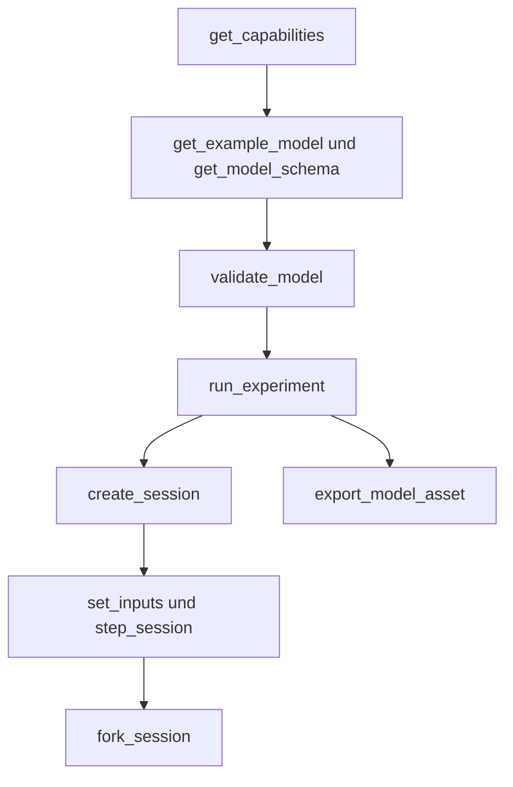

# Agent-Schnittstelle

[English](AGENT_API.md) · [简体中文](AGENT_API.zh-CN.md) · [Français](AGENT_API.fr.md) · [Русский](AGENT_API.ru.md) · [日本語](AGENT_API.ja.md) · [한국어](AGENT_API.ko.md) · **Deutsch** · [Español](AGENT_API.es.md) · [Italiano](AGENT_API.it.md) · [Português](AGENT_API.pt-BR.md)

`Power.Core`, `Power.Agent` und MCP sind verschiedene Eingänge zu einem Physikkern. Die API ist nicht an eine GPT-Version oder einen Modellanbieter gebunden. Lies Version, Fähigkeiten und Schema und erzeuge dann ein Modell. Ein vertrauter Name bedeutet nicht, dass diese Komponente umgesetzt ist.

Das [endliche Gasnetz](GAS_NETWORK.de.md) ist über JSON, CLI und MCP verfügbar; Gaszusammensetzung, gesteuerte Drosseln, feste Reservoire, Wandwärmeverbindungen und Erhaltungskanäle bleiben in portablen Assets erhalten. Die bestehende Semantik linearer Modelle und abgeschlossener Zylinder bleibt unverändert.

Die [gekoppelte Kupplungskomponente](CLUTCH_NETWORK.de.md) ist über die gemeinsamen
Verträge von JSON, Experiment und Sitzung verfügbar. Sie umfasst begrenzte Eingriffseingaben, Haft- und Gleitkapazitäten, vorzeichenbehaftete Übersetzungen, Ausgaben für Phase und Wärme sowie transaktionale interne
Ereignisse. Das eigenständige [exakte Paar](CLUTCH_PHYSICS.de.md) bleibt eine Prüfreferenz.

Die [idealen Zahnrad- und Planetenkomponenten](GEAR_NETWORK.de.md) nehmen an den gemeinsamen Verträgen von Löser
und Dokument teil. `ideal_gear` hat Ports A/B und eine vorzeichenbehaftete Übersetzung ungleich null;
`planetary_gear` hat Ports A/B/C für Sonne, Hohlrad und Träger und ein Zahnverhältnis Hohlrad/Sonne größer als
eins. Verträgliche Anfangsdrehzahlen und unabhängige dauerhafte Bedingungen sind erforderlich.
Die Fähigkeiten beschreiben die Rangpolitik, Lösertoleranzen und Ausgaben der mittleren Reaktion.

Der [Vertrag des Hydraulikkolbens](HYDRAULIC_PISTON.de.md) ergänzt Knoten `translational`,
`linear_spring`, `hydraulic_piston`, `piston_clutch` und `force_source`. Agenten können
Weg, Geschwindigkeit, Druckkraft, Belagenergie und Belagkraft, Kupplungskapazitäten
und kumulative Dämpfungswärme beobachten. Eine Kolbenkupplung hat keine Eingriffseingabe: befehlige ihre
Füll- und Ablassventile und prüfe den Belagkontakt. `get_capabilities.hydraulic_piston`
beschreibt SI-Einheiten, die Konvention von Volumen und Arbeit, den Löserumfang und die Erholung bei negativem
Druck. Die Modellprüfung liefert handlungsfähige Fehler zu Einheit, Bereich und Verbindung;
die Verträge für Sitzungsrevision, Abbruch und unabhängige Abzweigung gelten unverändert.

`hydraulic_spool_valve` verweist auf eine Kolbenkomponente und explizite Positionen für geschlossen und voll geöffnet.
Seine Öffnung folgt der tatsächlichen Bewegung; es nimmt keinen Öffnungsbefehl und keine
Überschreibung der Anfangseingabe an. Strom, Verlust und Öffnung sind über den gemeinsamen
Vertrag von Modell und Sitzung beobachtbar. `get_capabilities.hydraulic_spool_valve` erklärt
Einheiten von Position und Strom, die gleichzeitige Lösung und die weggelassene Strahlkraftphysik. Fordere
`spool-regulated-pump` an, um die mechanische Druckregelung zu prüfen; siehe
[den Dosiervertrag](HYDRAULIC_SPOOL.de.md).

`gas_piston` verbindet einen translatorischen Knoten mit einer bewegten Gaskammer mit expliziter Fläche,
Referenzvolumen und Referenzposition, absolutem Referenzdruck und vorzeichenbehafteter Kompressionsrichtung. Beobachte Gasmasse, Energie, Druck, Temperatur, Volumen, Kraft und
Referenzarbeit. Kombiniere ihn mit einem Hydraulikkolben auf derselben Masse zu einem
Akkumulator; verwende explizite Gasports und Wärmeverbindungen für den Transport. Die Prüfung verlangt einen
Volumenbesitzer und ein positives nominelles Gasvolumen. Die Fähigkeiten erklären die Intervallgrenze von einem Viertel des Volumens;
der Vertrag nennt die Genauigkeitsgrenze der Wandkopplung. Fordere `gas-accumulator-pump` an;
siehe [den Gas-Fluid-Vertrag](GAS_PISTON.de.md).

`gas_fuel_injector` verbindet verträgliche endliche verfolgte Gasvolumina von Quelle und Empfänger
und eine explizite Steuerkurbel. Seine Eingabe ist angeforderte kg je Zyklus; beobachte die
verriegelte Anforderung, den gelieferten Kraftstoff je Zyklus und insgesamt sowie den mittleren gelieferten Strom. Eingabeänderungen
mitten im Fenster gelten für den nächsten beobachteten Zyklus. Gegendruck und Verhungern können
Unterlieferung ohne Ausführungsfehler verursachen; verwende Ausgabenachweise und KPIs. Die Fähigkeiten
nennen Grenzen von Steuerung, Dosis und Umfang. Fordere `metered-fired-cylinder` an; siehe
[den Dosiervertrag](FUEL_METERING.de.md). Das ist gasförmige Zufuhr; flüssiges
Spray, Verdampfung und kalibrierte Kraftstoff- und ECU-Hardware bleiben offen.

## Start und Client-Konfiguration

```sh
dotnet run --file tools/Build.cs -- build
dotnet /absolute/path/to/Power!/src/Power.Mcp/bin/Release/net10.0/Power.Mcp.dll
```

Ein allgemeiner MCP-Client-Eintrag. Lege ihn in die Serverkonfiguration des Clients und ersetze den Pfad:

```json
{
  "mcpServers": {
    "power": {
      "command": "dotnet",
      "args": ["/absolute/path/to/Power!/src/Power.Mcp/bin/Release/net10.0/Power.Mcp.dll"]
    }
  }
}
```

Windows verwendet denselben Befehl `dotnet` und einen absoluten Pfad zur DLL. Eine Produktionsverbindung sollte die gebaute DLL direkt ausführen, damit sich die Build-Ausgabe nicht in das stdio-Protokoll mischt. Der Server braucht kein Unity, keine Anmeldedaten und keine Netzwerkverbindung. Die erste NuGet-Wiederherstellung braucht ein Netzwerk. Transport und Versionskompatibilität kommen vom gepinnten offiziellen [MCP-C#-SDK](https://csharp.sdk.modelcontextprotocol.io/v2/concepts/getting-started.html).

## Werkzeuge und Ergebnisse

In Agent-API-Version 0.29.0 nimmt `get_example_model` einen optionalen `name` an: `electrothermal` (Vorgabe), `sealed-cylinder`, `gas-network`, `moving-cylinder`, `crank-timed-cylinder`, `fired-cylinder`, `fired-clutch`, `fired-planetary`, `fired-converter`, `fired-hydraulic`, `fired-pump`, `fired-pump-losses`, `electric-pump`, `pressure-regulated-pump`, `battery-regulated-pump`, `piston-actuated-clutch`, `spool-regulated-pump`, `gas-accumulator-pump`, `metered-fired-cylinder`, `film-fired-cylinder`, `liquid-injected-cylinder`, `needle-actuated-cylinder`, `closure-compensated-cylinder`, `dual-clutch-transmission`, `fired-dual-clutch`, `controlled-dual-clutch`, `controlled-fired-dual-clutch`, `ravigneaux-transmission`, `fired-ravigneaux-converter`, `resolved-ravigneaux-transmission`, `fired-resolved-ravigneaux-converter`, `hydraulic-ravigneaux-transmission` oder `fired-hydraulic-ravigneaux`. `get_capabilities` nennt unterstützte Modelltreue-Stufen, lesbare Asset-Versionen, Lösergrenzen und Eingabegrenzen. Exporte verwenden `power.asset.v24`; Assets v1–v23 bleiben lesbar. Ausgabekanäle und ihre Einheiten liefern die Modellprüfung und die Sitzungserzeugung. Bestandene Labor-KPIs begründen keinen vollständigen oder kalibrierten Antriebsstrang.

| Werkzeug | Aufgabe |
|---|---|
| `get_capabilities` | Version, Modellfähigkeiten, Größengrenzen, Zeitsemantik und der Arbeitsablauf |
| `get_model_schema` | Das vollständige JSON Schema `power.model.v1` |
| `get_example_model` | Ein editierbares Beispiel mit Ereignissen und KPIs |
| `validate_model` | Prüft Modell und Experiment. Liefert Fingerabdruck, Kanäle und Diagnosen und rückt die Zeit nicht vor |
| `run_experiment` | Volles Experiment, zwei Replays mit unterschiedlichen Batch-Größen, KPIs und Herkunft. Das Ergebnis ist standardmäßig kompakt |
| `export_model_asset` | Prüft und exportiert ein `.powerasset`. Liefert Base64-Inhalt, den Datei-Digest, Herkunft und den Modell-Fingerabdruck |
| `create_session` | Erzeugt eine unabhängige interaktive Simulation. Liefert den Anfangsschnappschuss und Kanalmetadaten |
| `read_snapshot` | Aktuelle Zeit, Revision, Hash und gewählte Ausgabekanäle |
| `set_inputs` | Übergibt atomar einen Eingaberahmen zur aktuellen Zeit und erhöht die Sitzungsrevision |
| `step_session` | Rückt atomar um eine angeforderte Zahl von Nanosekunden vor. Abbruch wird unterstützt. Die Revision steigt |
| `fork_session` | Kopiert den aktuellen physikalischen Zustand in einen neuen Zweig bei Revision 0 |
| `close_session` | Gibt eine Sitzung frei |

Jedes Werkzeug hat ein Eingabeschema und ein Ausgabeschema. Erfolg und Domänenfehler liefern beide `structuredContent` und ein kompatibles Textergebnis. MCP `isError` entspricht `ok=false`. Siehe [strukturierte Werkzeugergebnisse im SDK](https://csharp.sdk.modelcontextprotocol.io/v2/concepts/tools/tools.html).

```json
{"schema":"power.agent.v1","ok":true,"data":{"revision":"2","time_ns":"1000000000","state_hash":"...","values":[]}}
```

```json
{"schema":"power.agent.v1","ok":false,"error":{"code":"revision_conflict","message":"Read the snapshot, then use its current revision.","retryable":true,"current_revision":"2"}}
```

Siehe das [Modellschema](../schemas/power.model.v1.schema.json) und das [Antwortschema](../schemas/power.agent.v1.schema.json). Das Modellschema prüft die Struktur. Der Compiler prüft danach Dimensionen, Topologie, positive Werte, endliche Werte und das numerische System. Die Experimentprüfung prüft Tick-Ausrichtung, Ereignisreihenfolge, Kanäle und KPI-Grenzen.

## Operationsfolge



1. Rufe `get_capabilities` auf und bestätige, dass die benötigten physikalischen Komponenten unterstützt werden.
2. Hol ein Beispiel und das Schema und baue dann ein Objekt `document`. Parameter müssen Einheiten tragen.
3. `validate_model({"document": ...})`. Repariere das Modell anhand von `error.object_id`, `error.field` und `error.code`.
4. `run_experiment({"document": ...})`. Prüfe `data.passed`, `checks`, `replay` und `model.calibration`. `ok=true` bedeutet nur, dass das Experiment beendet wurde. KPIs können trotzdem fehlschlagen.
5. `create_session` mit demselben Dokument. Behalte `session_id`, die anfängliche `revision` und die Kanalzuordnung.
6. Zum Beispiel `set_inputs({"session_id":"...","expected_revision":"0","values":[{"channel":"100","value":24}]})`, dann die Revision lesen, die zurückkommt.
7. `step_session({"session_id":"...","expected_revision":"1","delta_ns":"1000000000"})` liefert den Schnappschuss eine Sekunde später.
8. `fork_session({"session_id":"...","expected_revision":"2"})`. Das Kind bei 4 V bremsen und das Elternteil als Kontrolle behalten.
9. Nach dem Vergleich `close_session` für jede Sitzung mit ihrer eigenen jüngsten Revision.

Um das Modell in Unity zu prüfen, rufe `export_model_asset({"document": ..., "name": "My laboratory"})` auf. Dekodiere `data.content` aus Base64, prüfe `data.asset_sha256` gegen die ganze Datei, speichere sie als `.powerasset` unter Unity `Assets` und öffne sie mit **Open in Studio** im Asset-Inspector. Das Werkzeug liefert nur Inhalt. Es schreibt keine lokale Datei. Ein erfolgreicher Export bedeutet, dass die Daten gültig sind. KPIs und Kalibrierung sind getrennte Prüfungen. Format und Grenzen stehen in [Modell-Assets](ASSET_FORMAT.de.md).

Revisionen beginnen bei 0. Jedes erfolgreiche Festschreiben einer Eingabe und jeder erfolgreiche Schritt addiert 1. Eine veraltete, ungültige oder abgebrochene Operation addiert keine Revision. Eine Abzweigung lässt die Revision des Elternteils unverändert. Lies nach jeder Transportunterbrechung den Schnappschuss und verwende diese Revision. Sende einen Schreibvorgang nicht erneut, der noch die alte Revision trägt.

`time_ns`, `revision` und Kanal-IDs in einem Sitzungsschnappschuss sind Zeichenketten, damit sie jenseits der Ganzzahlgrenze von JavaScript exakt bleiben. Die Experimentzeit in einem Modelldokument beträgt höchstens eine Stunde. Modelleingabekanäle sind heute Ganzzahlen. Wähle IDs nicht größer als `2^53-1`, wenn ein anderer JSON-Client sie exakt behalten muss. IDs im hohen Namensraum bleiben in Ausgaben Zeichenketten, unverändert.

`channels` an `read_snapshot` ist ein Array von Ausgabe-ID-Zeichenketten. Lass es weg, um jede Ausgabe zu liefern. Eingabekanäle und doppelte Felder werden abgelehnt. `include_samples=true` sorgt dafür, dass ein Experiment jede Probengrenze liefert.

## Fehler und Reparatur

| Fehler | Nächster Schritt |
|---|---|
| `model_unit` / `model_connection` / `model_range` | Repariere Einheit, Verweis oder Parameter an diesem Objekt und Feld |
| `invalid_argument` / `invalid_json` | Korrigiere das Feld, die Ereignisreihenfolge, die Zeit oder die Dokumentstruktur |
| `unknown_channel` / `invalid_input` | Wähle eine Eingabe aus der Kanaltabelle und entferne Dubletten und nicht endliche Werte |
| `invalid_time_step` | Verwende eine positive ganzzahlige Tickzahl, höchstens eine Million Ticks je Aufruf |
| `numerical_failure` | Prüfe Parameterskala, Eingaben und den Schritt. Der aktuelle Zustand wurde nicht geändert |
| `revision_conflict` | Lies den jüngsten Schnappschuss und entscheide dann aus diesem Zustand |
| `cancelled` | Der gesamte Batch wurde zurückgerollt. Wiederhole mit einem kleineren Batch |
| `session_capacity` | Schließe Sitzungen, die du nicht mehr brauchst |
| `unknown_session` | Der Prozess wurde neu gestartet oder die Sitzung wurde geschlossen. Erzeuge sie erneut und spiele sie ab |

Eine Sitzung ist ein Objekt im Prozess. Sie wird nicht persistiert und hängt sich nicht an eine laufende Unity-Szene. Die MCP-Schnittstelle führt derzeit Experimente ohne Oberfläche auf demselben Kern aus. Eine spätere Unity-Verbindung muss die Verträge für Revision, Zeit und Atomarität weiterhin halten.

## Eine Komponente ergänzen

Schreibe die Gleichungen und den Umfang, definiere Ports und Parameter mit Einheiten, setze sie im Kern um und hole Nachweise aus einer analytischen Lösung, aus Erhaltung, Schrittkonvergenz und Fehlerprüfungen. Ergänze dann Schema und Fähigkeitsentdeckung, liefere ein abspielbares Experiment und verbinde eine Unity-Ansicht. Gemessene Herkunft und Unsicherheit werden für sich festgehalten. Ein bestandener Test bedeutet nicht, dass das Modell kalibriert ist.

## Ablauf im Gasnetz

Fordere `gas-network` an, prüfe es und führe dann das Experiment aus und exportiere sein Asset mit
den bestehenden Werkzeugen. `power.model.v1` erhält additive Definitionen für Gasknoten und Gaskomponenten;
Clients sollten sie aus Schema und Fähigkeiten entdecken. Keine Werkzeugnamen ändern sich.
Gasvolumina verbrauchen je zwei skalare Zustände, und verbundene Volumina müssen R und Gamma teilen.

Eingaben von `gas_orifice` verwenden Werte `fraction` in [0, 1]. Ein fehlender oder auf null gesetzter Eingabekanal
hält das explizite `initial_input` fest. Prüfung und Export lehnen geplante Werte außerhalb des Bereichs
ab, bevor ein Experiment ausgeführt wird. Interaktive Ablehnung erhält Zustand
und Revision. Kompilierung, erfolgreiche Ausführung, KPI-Erfolg und Kalibrierung
bleiben verschieden: das Beispiel ist synthetisch und `unverified`.

Sitzungsoperationen nur für Gas verwenden dieselben Nanosekundenzeiten, Revisionsprüfungen, denselben Abbruch,
gefilterte Schnappschüsse und unabhängige Abzweigungen. Sitzungen starten von den Anfangseingaben der Komponenten;
`create_session` führt den Ereignisplan des Experiments nicht aus. Verwende `run_experiment`
oder portable Wiedergabe für diesen Plan. Statische Prüfung kann nicht garantieren, dass ein künftiger
Zustand numerisch lösbar bleibt: verringere bei `numerical_failure` `step_ns` und prüfe
Strömungsfläche, Volumen, Leitwert und Anfangsbedingungen, bevor du die Sitzung neu erzeugst.

## Ablauf des bewegten Zylinders

`get_example_model({"name":"moving-cylinder"})` liefert ein unkalibriertes Schleppexperiment mit zwei zeitgesteuerten Drosseln, Kurbeldruckarbeit und Wandübertragung.
Gasknoten ohne `storage` müssen mit genau einem `gas_cylinder` verbunden sein, dessen Parameter
die Geometrie liefern. Der Compiler prüft den Besitz und leitet Anfangsmasse und Anfangsenergie
aus Druck und Temperatur des Gasknotens und der Anfangsgeometrie der Kurbel ab.

Die Fähigkeiten nennen `moving_cylinder_gas_exchange`, die Kurbelgrenze von 0.25 rad und den
Umfang der geteilten Integration. Gaszustände bleiben Kanäle am Gasknoten; Volumen, Verdrängung
und Moment sind Kanäle an der Gaszylinder-Komponente. Die Verträge für Experiment, Export, Sitzung,
Revision und Fehler sind unverändert. Siehe [bewegte Zylinder](MOVING_CYLINDER.de.md).
Zeitgeplante Drosseln begründen keine Ventilsteuerung über den Kurbelwinkel und keine Verbrennung.

## Ablauf der kurbelzeitgesteuerten Ventile

`get_example_model({"name":"crank-timed-cylinder"})` liefert ein Schleppexperiment über 720 Grad
mit variabler Drehzahl, Einlass- und Auslassprofilen und Wandwärme. `valve_timing`
an einem `gas_orifice` verlangt einen rotatorischen `crank_node` und einheitentragende `cycle_angle`,
`open_angle` und `duration_angle`. Das Fähigkeitsobjekt nennt Zyklen, Profil,
Grenzen und Erholung. Siehe [den Steuervertrag](VALVE_TIMING.de.md).

Zeitgesteuerte Eingabekanäle stehen für `peak_opening` in [0, 1]; die beobachtbare
`effective_opening` wird aus dem tatsächlichen Kurbelwinkel abgeleitet. Verwende das KPI-Feld `opening`, um sie zu prüfen.
Eine stillstehende Kurbel kann offen bleiben; Rückwärtsbewegung zeichnet dasselbe Profil nach. Die Phase
ist explizit und unabhängig von der Phase der Zylindergeometrie. Eine geplante Änderung der Spitze skaliert
den Nocken; sie ersetzt die Kurbelsteuerung nicht.

Die Prüfung kontrolliert Topologie und Parameter, garantiert aber keine Laufzeitauflösung.
Verringere bei `numerical_failure` `step_ns`, sodass Winkelweg und Endpunktdrehzahlweg innerhalb
`min(0.25 rad, duration_angle/8)` bleiben, und erzeuge die Sitzung neu. Der gesamte fehlgeschlagene
Batch erhält Eingaben, Zustand und Revision. Asset v11 behält das Profil und die Kompatibilität mit v1–v10.
Die neue Modelltreue ist `crank_timed_gas_exchange`; erfolgreiche Ausführung,
bestandene KPIs und Kalibrierung bleiben verschieden.

## Ablauf der Vormischverbrennung

`get_example_model({"name":"fired-cylinder"})` liefert einen gezündeten Vormischzylinder, der
eine externe Last antreibt. Die Fähigkeit `combustion` erklärt die Wiebe-Vorschrift, Klassen von Kraftstoff, Luft und
Produkt, den Eingabebereich, das Verhalten der Vorwärtshistorie und numerische Grenzen. Gasknoten
nennen `gas.premixed`, und ihre Reservoirdrosseln nennen explizite
`reservoir_fractions`. Der Compiler lehnt fehlende Anteile, unverträgliche verbundene
Gemische und mehrere Brennkomponenten an einer Kammer ab.

`premixed_combustion` verbindet ein rotatorisches `node_a` mit einem Vormischgas-`node_b`, mit
expliziten Winkeln für Zyklus, Start und Dauer, Formexponent und Brennbeiwert. Sein optionaler
Eingabekanal skaliert die Brenngefahr über `burn_multiplier` in [0,1]. Null schaltet
das Brennen ab, stoppt aber nicht Kraftstoff, der an einem offenen Einlass ankommt. Vorwärtswinkel jenseits der
aufgezeichneten Front verbrauchen Kraftstoff; Anhalten, Umkehr und Nachzeichnen können die Wärmefreisetzung nicht wiederholen.

Entdecke Bestandteilmassen, chemische Energie, kumulativ verbrannten Kraftstoff, freigesetzte Wärme
und `burn_frontier_angle` aus der Kanaltabelle. Globale Residuen von Kraftstoff und Frischluft ergänzen Gesamtmasse und Energie.
`reservoir_enthalpy` enthält transportierte chemische Energie für Vormischgase, und
`net_fuel_energy_in` stellt diesen Teil getrennt bereit. Die innere Energie des Gases bleibt thermisch.
Die Berichts-Modelltreuen sind `premixed_gas_transport` oder `premixed_wiebe_combustion`; beide
bleiben `unverified`.

Verringere bei einem Fehler der Brennauflösung `step_ns` und erzeuge die Sitzung neu. Eingeschaltetes Brennen
verlangt, dass Kurbelweg und Endpunktdrehzahlweg nicht größer sind als
`min(0.25 rad, burn duration/32)`; Wärme je Tick ist auf 25% der thermischen Energie vor der Verbrennung
begrenzt. Rollback des ganzen Aufrufs und Revisionsverträge bleiben unverändert. Ein gültiges Modell kann
eine Laufzeitgrenze trotzdem verfehlen; erfolgreiche Ausführung kann KPIs trotzdem verfehlen. Siehe
[PREMIXED_COMBUSTION.de.md](PREMIXED_COMBUSTION.de.md) für Gleichungen und Grenzen.

## Ablauf der Kupplung

`get_example_model({"name":"fired-clutch"})` liefert einen gezündeten Motor, getrennte Last,
Kupplung und Wärmesenke, mit Ereignissen für Eingriff und Lösen auf exakten Ticks. Die Fähigkeiten `clutch`
nennen Eingabegrenzen, Löserbudgets, Moduscodes und die Semantik der Ausgabehistorie. Definiere
`parameters.static_capacity` und `sliding_capacity` in Nm sowie eine vorzeichenbehaftete `ratio` ungleich null.
Der Compiler erzwingt `static >= sliding >= 0`, rotatorische Endpunkte und eine thermische Verlustsenke. Bodenbremsen verwenden weggelassenes oder mit null belegtes `node_b` und Übersetzung eins.

Die Eingabe `engagement` liegt in `[0,1]`; null löst aus. Entdecke aktuellen relativen Schlupf,
zuletzt akzeptierte Phase, mittleres Moment und mittlere Wärmeleistung des letzten Ticks sowie kumulative Reibungswärme aus
der Kanaltabelle. Phasen sind 0 gelöst, 1 verriegelt, 2 positiver Schlupf und 3 negativer Schlupf.
Das Aktualisieren des Eingriffs schreibt die mittleren Ausgaben oder die Phase des vorhergehenden Ticks nicht um.
Die Modelltreue `hybrid_clutch_powertrain` kennzeichnet Modelle, die diese Komponente enthalten;
sie bedeutet kein vollständiges Getriebe und kein kalibriertes Fahrzeug.

Verwende `run_experiment`, um KPI- und Replay-Nachweise zu bewerten, oder Sitzungswerkzeuge, um den
Eingriff zu variieren und dabei Revisionsprüfungen und unabhängige Zweige zu erhalten. Verringere bei numerischem
Fehler `step_ns` und prüfe Skalierung von Trägheit und Übersetzung, redundante Bedingungen und
Kapazitätspläne. Der fehlgeschlagene oder abgebrochene Aufruf schreibt keine Eingaben, Phasen, Wärme oder physikalischen
Zustand fest. Losreißen unter wechselnden Lasten verwendet den Intervallmittelwert des Bedarfs; Verfeinerung des Zeitschritts
ist nahe Übergängen erforderlich. Siehe [CLUTCH_NETWORK.de.md](CLUTCH_NETWORK.de.md).

## Ablauf der idealen Übersetzung

Fordere `fired-planetary` an, um einen synthetischen Motor, eine Hohlradbremse, eine Kupplung von Sonne und Hohlrad,
einen Planetensatz und einen Achsantrieb zu erhalten. Das geplante Hoch- und Rückschalten verwendet dieselbe Semantik exakter Ticks
wie andere Experimente, mit 84 übereinstimmenden Replay-Grenzen. `node_c` ist der
Planetenträger; Zahnräder nehmen nur ihre rotatorischen Ports und `parameters.ratio` an.

`slip_speed` und `constraint_error` stellen aktuelle Residuen von Drehzahl und Phase bereit. `torque`,
`torque_at_b` und das nur beim Planetensatz vorhandene `torque_at_c` sind mittlere Reaktionen an den entsprechenden
Rotoren über den letzten vollständigen Tick. Sie beginnen bei null und werden durch Änderungen der Randeingabe nicht umgeschrieben. Fehler der Anfangsdrehzahl liefern `model_connection` mit Feld `initial_speed`;
abhängige Bedingungszeilen liefern `model_solver` mit Feld `gear.constraints`.
Korrigiere Topologie oder Anfangsbedingungen, statt unveränderte Daten erneut zu versuchen.

Asset v11 behält alle vorherigen Leser, einschließlich einer authentischen Fixture der gezündeten Kupplung von v7.
Dieses Modell begründet einen synthetischen Getriebepfad, nicht ein vollständiges DCT oder AT, keine hydraulische
Betätigung, kein TCU-Verhalten und keine gemessene Kalibrierung. Tatsächliche Unity-Nachweise bleiben getrennt.

## Ablauf des Wandlers

Fordere `fired-converter` für einen synthetischen Motor, einen tabellierten Fluidpfad, eine getrennte Überbrückung,
eine Planetenschaltung und eine thermische Senke an. Die Fähigkeiten nennen alle vier erforderlichen vorzeichenbehafteten Kennfelder,
Grenzen von Punkten und Komponenten, die Konvention des Referenzglieds, Budgets der nichtlinearen Iteration,
die Semantik der Beobachtungsgrößen und die Laufzeiterholung. Die Modelltreue ist
`quasisteady_converter_powertrain`; das Bestehen der 87 Replay-Grenzen begründet
numerische Konsistenz, nicht gemessene Getriebeleistung.

`torque_converter` verlangt `node_a` und `node_b` für Pumpe und Turbine, optional `heat_node`, und
vier explizite Kennfeldarrays unter `parameters`. Jeder Punkt hat dimensionslose Verhältnisse von Drehzahl und
Moment und einen Beiwert in `nm_s2_rad2`. Kein Kennfeld, kein Rückwärtsquadrant, kein Eingabekanal
und kein Statorrotor-Port wird erschlossen. Die Kompilierung prüft Passivität der Interpolation und Stetigkeit der Kennfelder
und meldet `converter.<map>` oder `converter.counter_rotation` mit der Objekt-ID.

Entdecke mittlere Momente von Pumpe, Turbine und Stator, Fluidwärmeleistung, kumulative Fluidwärme,
aktuelles vorzeichenbehaftetes Drehzahlverhältnis und Treibercode aus den Kanälen. Eine parallele `clutch` liefert
den Überbrückungseingriff. Die Verträge für Sitzungsrevision, Abbruch, Zweigunabhängigkeit und vollständiges
Rollback decken auch Wandlerhistorien ab. Verringere bei `numerical_failure`
`step_ns` und prüfe Kennfeldsteigungen, Skalen von Trägheit und Drehzahl sowie Kupplungsbedingungen. Siehe
[die Gleichungen, Grenzen und Nachweise](CONVERTER_NETWORK.de.md). Exporte verwenden Asset v11;
authentische vorherige Fixtures bewahren die Kompatibilität mit v1–v10. Automatische hydraulische Regelung und tatsächliche
Prüfung von Unity-Editor und Player bleiben getrennte unfertige Arbeit.

## Hydraulischer Ablauf

Fordere `fired-hydraulic` für ventilgeregelte Druckkammern an, die Schalt- und
Überbrückungskupplungen betätigen. Die Fähigkeit `hydraulics` stellt die Überdruckkonvention, Modelle für Speicher
und Strömung, Einheiten, Iterationsgrenzen, Drucktoleranz, Stellgliedumfang und Erholung bereit.
Die Modelltreue ist `compliant_hydraulic_powertrain`; die Kalibrierung bleibt `unverified`.

Ein Hydraulikknoten verlangt positive Nachgiebigkeit `storage` in `m3_pa` und nichtnegativen
anfänglichen Überdruck. `hydraulic_resistance` und `hydraulic_orifice` verlangen explizite
Strömungsbeiwerte und Ventilöffnung; eine Blende braucht zusätzlich einen positiven Übergangsdruck. Reservoirendpunkte verlangen einen expliziten `reservoir_pressure`. Ein fehlender oder
auf null gesetzter Eingabekanal hält die angegebene Öffnung fest. Der Compiler erschließt nie Fluideigenschaften,
Leckage, Reservoirdruck oder ein OEM-Kennfeld.

`hydraulic_clutch` hat rotatorische Ports und Geometrie unter `parameters`, einschließlich seines
hydraulischen `pressure_node`. Es hat keine Eingriffseingabe. Entdecke Druck, gespeichertes Referenzvolumen, hydraulische Randarbeit, Bestandsresiduum, Drosselwärme, Klemmkraft und
aktuelle Reibkapazitäten neben den bestehenden Kanälen der Kupplungshistorie. Änderungen der Ventileingabe
erhalten gespeicherten Druck und Mittelwerte des letzten Ticks, bis akzeptiertes Schreiten sie fortschreibt.

Die Verträge für vollständigen Zustand, Revision, Abbruch und Zweige decken Hydraulikdruck
und Bilanzen ab. Verringere bei numerischem Fehler `step_ns` und prüfe Nachgiebigkeit, Beiwerte,
Überdrücke und Stellgeometrie. Negativer Enddruck lehnt den gesamten Batch ab;
er wird nicht still geklemmt. Siehe [HYDRAULIC_NETWORK.de.md](HYDRAULIC_NETWORK.de.md). Asset v11
behält Druckgrenzen, Strömungsgesetze und Stellgeometrie; alle Leser für v1–v10 bleiben.
Gemessene Verlust- und Regelkennfelder, gemessene Ventil- und Akkumulatordynamik, volle ECU-/TCU-Regelung und tatsächliche Unity-Abnahme bleiben offen.

## Ablauf der Pumpenversorgung

Fordere `fired-pump` für eine kurbelgetriebene Pumpe, eine nachgiebige Leitung, Druckbegrenzung und ein druckbetätigtes
Getriebe an. Die Fähigkeiten stellen `hydraulic_pump`, Verdrängungseinheiten, die Einlasskonvention,
Grenzen des gemeinsamen Lösers und die Semantik vorzeichenbehafteter Arbeit bereit. `hydraulic_work` der Pumpe ist interner
Transfer von der Welle ins Fluid; globales `hydraulic_work` bleibt externe Reservoirarbeit.
Dieses Beispiel hat externe hydraulische Arbeit null und explizit anfänglich gespeicherten Druck.

`hydraulic_pump` verlangt Ports für Welle und Auslass, explizites `parameters.inlet_node`, positive
`displacement` in `m3_rad` und einen Reservoirdruck nur für Einlass null. Die Druckbegrenzung
verlangt Leitwert und Öffnungsdruck, ohne Eingabekanal. Fehlende oder domänenfremde
Ports, Dimensionen und sachfremde Parameter erzeugen handlungsfähige Prüffehler.
Asset v11 behält beide Definitionen. Revisionen, Abbruch, Abzweigungen, vollständiges Rollback und
die Unterscheidung von KPI und Kalibrierung bleiben unverändert. Siehe [HYDRAULIC_PUMP.de.md](HYDRAULIC_PUMP.de.md).

## Ablauf der Pumpenbaugruppe

Fordere `fired-pump-losses`, `electric-pump`, `pressure-regulated-pump` oder `battery-regulated-pump` an. Die Fähigkeit `pump_assembly` gibt
die Gleichungen von Nettostrom und Reaktion, Verlusteinheiten, Komponentenzusammensetzung und die Grenze der elektrischen
Versorgung. Modelle enthalten gewöhnliche Datensätze von Pumpe, Widerstand und Welle; das
elektrische Beispiel ergänzt den bestehenden RL-Motor. Keine neue Komponentenart, kein neues Schema und keine neue Asset-Version ist erforderlich. Kern-Clients können `HydraulicPumpAssembly.CreateComponents`
mit eigenen stabilen IDs verwenden, um dieselben Graphdefinitionen zu erzeugen.

Leckage ist ein expliziter Widerstand vom Auslass zum Einlass mit Beiwert in `m3_s_pa`;
Wellenreibung ist eine geerdete Welle der Steifigkeit null mit Dämpfung in `nm_s_rad`.
Beide verlangen angegebene Werte und explizite Wärmeführung. Eine elektrische Pumpe nimmt
Motorspannung über eine Eingabe `v` an, mit Gegen-EMK, Strom und Kupferwärme in der
gemeinsamen Lösung. Sie erschließt keine Batterie, keinen Wirkungsgrad, keine Viskosität, keinen Regler und keine
Kalibrierung. Entdecke Kanäle, statt den idealen Pumpenzweigstrom als
Nettolieferung der Baugruppe zu deuten. Bestehende Revisionen, Abbruch, Abzweigungen und vollständiges Batch-Rollback gelten für die gesamte Zusammensetzung.

## Ablauf der Druckrückführung

Fordere `pressure-regulated-pump` an. Die Fähigkeiten nennen die Komponente `pressure_controller`,
dimensionsbehaftete Verstärkungen, Anforderungen an Sensor und Ziel, ganzzahlige Abtastung, Begrenzung
und Transaktionssemantik. Prüfe, führe aus und exportiere mit den bestehenden Werkzeugen. Asset v12
behält die volle Reglerdefinition, und alle vorherigen Leser bleiben unterstützt.

Die Eingabe `105` des Beispiels ändert den Drucksollwert in SI-Pa. Der Spannungskanal `100` des Motors gehört dem Regler und fehlt in den beschreibbaren Kanälen. Direkte
Schreibvorgänge liefern `controlled_input` mit dem Hinweis, `pressure_setpoint` zu schreiben; die Ablehnung
ändert weder Zustand noch Revision. Negative Druckziele werden abgelehnt. Statische
Prüfung erkennt widersprüchliche Besitzer, falsche Domänen oder Einheiten und falsch ausgerichtete Abtastperioden.

Lies `sampled_pressure`, `pressure_error`, `integral_voltage` und `command_voltage`
über die entdeckbaren Ausgabe-IDs. Das sind Zustand der letzten Probe und gehaltener Befehl.
Zeitstempel des Schnappschusses nennen die Uhrphase. Eingabeänderungen schreiben die Regelhistorie nicht fort; die nächste fällige Probe aktualisiert sie an einem physikalischen Tick. Abzweigungen schließen Integralgedächtnis und Uhrphase ein. Abbruch oder späteres arithmetisches oder Löserveragen schreibt keinen
Teil des Batches fest. Die Erholung nach Überlauf verlangt, Verstärkungen, Ziele und Integralskalen zu prüfen, statt identische Eingaben blind zu wiederholen.

Erfolgreiche Ausführung und exaktes Replay können mit fehlgeschlagenen Nachführ-KPIs einhergehen, wenn das
Stellglied sättigt. Prüfe `passed` und die Fehlergrenzen getrennt von `ok`.
Der ideale Sensor und die ideale Spannungsquelle des Beispiels sind Forschungskomponenten; sie begründen
keine Batterie, keine vollständige ECU oder TCU, keine kalibrierten Regelungen und keine Unity-Abnahme.

## Ablauf der Batterieversorgung

Fordere `battery-regulated-pump` an. Die Fähigkeiten stellen endliche Ladung, Gleichungen von OCV und RC,
Regeln für Last und Tastverhältnis, Regelbesitz und Erholung bereit. `storage` des Batterieknotens verwendet `c`
oder `ah`, `initial` ist der Ladezustand in `fraction`, und `position` ist die Polarisationsspannung in `v`.
Der Batteriedatensatz verlangt alle fünf elektrischen Parameter. Einheiten, Grenzen von Kapazität und Zustand,
Quellenports, Wärmesenken, steigende Leerlaufspannung und Reglerperioden werden geprüft.

`battery_motor` verlangt einen rotatorischen Port A, einen Batterieport B und eine Tastverhältniseingabe in [-1,1].
`resistive_load` hat einen Batterieport A, Widerstand und Öffnung in [0,1]. Der Kanal
`106` des Beispiels ändert die Zusatzlast; `105` ändert den Drucksollwert in SI-Pa.
Das Tastverhältnis `100` gehört `pressure_duty_controller` und kann nicht direkt geschrieben werden.
Seine Verstärkungen verwenden `fraction_pa` und `fraction_pa_s`; Ausgabegrenzen sind dimensionslos.

Lies `state_of_charge`, `charge`, `battery_current`, `terminal_voltage`,
`polarization_voltage`, gespeicherte Energie und Wärme der Batterie neben `integral_duty`
und `command_duty`. Kanäle für Spannung, Strom und Lastleistung sind momentane algebraische
Beobachtungsgrößen, sodass gültige Änderungen von Tastverhältnis oder Last sie ändern können, ohne gespeicherte Zustände zu ändern.
Batteriearbeit ist intern; globales `source_work` enthält nur explizite externe Leistungsgrenzen. Verletzungen von Ladezustand oder Spannung lehnen den gesamten Batch ab. Prüfe Anfangsladung,
Kapazität, Tastverhältnis, Lasten und Batchlänge, bevor du es erneut versuchst. Es gibt keine stille Klammer für den Ladezustand.

Asset v22 behält alle Parameter von Versorgung und Regelung mit authentischen vorherigen Lesern und Fixtures.
Abbruch und späteres Versagen erhalten Ladung, Gedächtnis von RC und Regelung, Eingaben und Revision.
Unabhängige Abzweigungen vergleichen Strategien für Zusatzverbraucher und Tastverhältnis aus derselben physikalischen Geschichte.
Alle Parameter bleiben ungeprüft; ein idealer gemittelter Tastverhältniswandler ist kein Batterie-BMS, keine PWM- oder Stromschleife, kein vollständiges elektrisches Fahrzeugsystem und keine Kalibrierung.

## Ablauf des Flüssigkeitsfilms

Fordere `film-fired-cylinder` an. Die Fähigkeit `fuel_film` erklärt endliche Ports von Gas und Wand,
die Phasenenergiereferenz, Einheiten, Teilungsgenauigkeit und Umfang. Gib expliziten
anfänglichen Flüssigkeitsbestand, Temperatur, spezifische Wärme, Sättigungstemperatur,
latente innere Energie und Leitwert an. Prüfe und entdecke Ausgabe-IDs, bevor
du das Modell ausführst oder exportierst. Filme stellen keinen beschreibbaren Eingabekanal bereit.

Lies verbleibende `mass`, vorzeichenbehaftete `internal_energy`, `chemical_energy`,
`evaporated_fuel_mass`, mittleren `mass_flow` des letzten Ticks, kumulative `film_wall_heat` und
momentanen `heat_flow` neben Empfängerkraftstoff und Reaktionswärme. Trockene Filme
melden die erklärte Sättigungstemperatur und Wärmestrom null. Die tatsächliche Dampfverfügbarkeit bestimmt die Reaktion; eine gültige Filmdefinition bedeutet nicht Verdampfung
oder bestandene KPIs der Wärmefreisetzung.

Asset v18 behält Phasengrößen und frühere Leser. Revisionsprüfungen,
Abbruch, unabhängige Abzweigungen und Rollback bei spätem Versagen schließen alle Historien von Flüssigkeit,
Wärme, Bestandteilen und Kompensation ein. Falsche Einheiten oder Ports, überhitzte
Anfangsflüssigkeit und zu hohe Zustandszählungen liefern strukturierte Fehler. Prüfe das
gemeldete Objekt und Feld und das endliche Wärmebudget, bevor du ein fehlgeschlagenes Modell erneut versuchst.
Der [Filmvertrag](FUEL_FILM.de.md) hält die Gleichungen und die Genauigkeitsgrenze fest.
Anfängliche Benetzung begründet keine Flüssigeinspritzung, keine kalibrierten Kraftstoffeigenschaften,
keine vollständige Motorregelung und keine tatsächliche Unity-Abnahme.

## Ablauf der endlichen Flüssigeinspritzung

Fordere `liquid-injected-cylinder` an. Die Fähigkeit `liquid_fuel_injector` erklärt
die endliche nachgiebige Quelle, die Zykluseingabe in `kg`, Einheiten von Dichte und Nachgiebigkeit, die Energiebilanz und die Empfängergrenze. Gib alle Leitungsgrößen, die Düsengeometrie und einen
bestehenden Verweis auf Film und Kurbel an. Prüfe zuerst und entdecke Ausgabe-IDs und Einheiten.

Die Eingabe `104` des Beispiels fordert kg je Zyklus an. Änderungen verriegeln in einem späteren beobachteten
Vorwärtsfenster; die aktuelle Lieferung kann durch den Quellendruck begrenzt bleiben. Lies `mass`, `pressure`, gespeicherte `internal_energy`, chemische Energie und Volumen der Leitung neben
`requested_fuel_dose`, `delivered_fuel_dose`, `total_fuel_delivered` und mittlerem
`mass_flow` des letzten Ticks. Masse, Temperatur und Verdampfung des Films sowie getrennte Reaktionswärme kennzeichnen
die Verzögerung zwischen dem Annehmen einer Dosis und der tatsächlichen Dampfverbrennung.

`source_work` der Komponente ist freigesetzte gespeicherte Leitungsdruckarbeit, `hydraulic_work` ist
exportierte Empfängerdruckarbeit, und `fluid_heat` ist Düsendissipation, die zur
Filmwand geführt wird. Ihre Identitäten sind von der globalen externen Quellenarbeit verschieden.
Der Empfänger mit vernachlässigbarem Flüssigkeitsvolumen exportiert Verdrängungsarbeit explizit;
er fügt keine verdeckte Kurbelarbeit hinzu und modelliert keine Spraygeometrie.

Asset v19 behält vollständige Quelle, Düse und Steuerung mit Lesern für v1-v18. Revisionen,
Abbruch, Abzweigungen und spätes oder spekulatives Versagen schließen jede Historie von Leitung, Kontingent und Wärme
ein. Falsche Einheiten, unmögliches nachgiebiges Volumen, überhitzte Flüssigkeit und nicht passender
Besitz von Film oder Kurbel erzeugen strukturierte Diagnosen. Prüfe das fehlgeschlagene Objekt und Feld
und die Grenzen von Druck und Dosis, bevor du es erneut versuchst. Erfolgreiche Werkzeugausführung bedeutet nicht
volle Lieferung, bestandene KPIs oder kalibrierte Hardware. Siehe
[LIQUID_FUEL_INJECTION.de.md](LIQUID_FUEL_INJECTION.de.md).

## Ablauf der physischen Nadel

Fordere `needle-actuated-cylinder` an. Die Fähigkeiten erklären Einheiten der magnetischen Steigung,
Flussenergie, tatsächliche Öffnung, abgetastete Regelung und Forschungsgrenzen. Der Befehl `104` in kg des Einspritzers
ist beschreibbar; die vom Treiber besessene Spulenspannung `107` ist es nicht. Abgelehnte
Schreibvorgänge liefern `controlled_input` mit dem richtigen Befehlsnamen und Kanal und erhalten
Zustand und Revision. Aktualisiere die angeforderte Kraftstoffmasse und rücke um exakte physikalische Ticks vor.

Lies tatsächlichen Nadelweg und Nadelgeschwindigkeit sowie Einspritzeröffnung neben Spulenstrom,
magnetischer Energie, Kupferwärme, elektrischer Arbeit, gehaltener Spannung und Ziel und
Lieferung der letzten Probe. Fluid kann weiterfließen, nachdem die Spannung weggenommen wurde, das Fenster schließt oder die Ziellieferung erreicht ist. Verbleibende Flüssigkeit, Gaskraftstoff, unverbrannter und Randkraftstoff sowie die Reaktion
bleiben getrennt beobachtbar. Eine gültige Anforderung oder ein erfolgreiches Werkzeug begründet nicht
exakte Dosislieferung oder kalibrierte Regelung.

Asset v20 behält Tabellen für Magnetik, Hub, Nadel und Treiber sowie Leser für v1-v19. Abtastperioden müssen an Ticks ausgerichtet sein; die Spannung hat einen Besitzer; Verweise auf Nadel, Spule und Kurbel
müssen zusammenpassen. Prüfe bei Löserfehlern positives `L(x)`, R, L und Gradient, Hubweg
und Zeitschritt; verfeinere Intervalle von Physik und Regelung, bevor du dynamische Genauigkeit behauptest.
Abbruch, Abzweigungen und abgelehnte oder spekulative Batches schließen alle Historien von Fluss, Wärme,
Abtastung, Halten und Phase ein. Siehe [NEEDLE_ACTUATION.de.md](NEEDLE_ACTUATION.de.md).

## Ablauf der schließkompensierten Nadel

Fordere `closure-compensated-cylinder` an. Sein Treiber schaltet einen ausgerichteten endlichen
Horizont `closure_prediction_ns` ein. Die Fähigkeiten nennen die Grenze von 4096 Ticks, die Annahme gehaltener Eingaben
und die begrenzte Abschaltsuche. Quellenanforderungen in kg bleiben beschreibbar; die Spannung
bleibt im Besitz des Treibers. Entdecke Kanäle für vorhergesagte Masse und Anzahl, Abschaltverriegelung und ausstehende Ticks
neben tatsächlicher Nadelposition, Lieferung und gehaltener Spannung.

Die Vorhersage ist ein getrenntes Strecken-Replay des vollständigen Zustands. Sie hält andere Befehle und
kennt künftige externe Eingabeereignisse nicht; prüfe daher die tatsächliche Lieferung nach dem Schließen
und die Verfeinerung von Horizont und Zeitschritt, statt die Vorhersage als gemessenen Kraftstoff zu behandeln.
Fehlgeschlagene oder abgebrochene Vorhersage schreibt keinen Teil des echten Batches fest. Uhrüberlauf,
ungültiger Horizont oder nicht monotone Abschaltkandidaten verlangen, Annahmen zu Zeit und Modell
zu revidieren; Teilvorhersagen werden nicht still akzeptiert.

Asset v21 schreibt den Horizont und behält frühere Leser. Revisionen, unabhängige
Abzweigungen und Rollback des gesamten Batches schließen Verriegelung und Countdown der Vorhersage ein. Kern-Clients können nur lesendes `PredictNeedleClosure` aufrufen; MCP-Schnappschüsse stellen die letzte
abgetastete Schätzung des gewählten Kandidaten bereit. Umfang und Nachweise stehen in
[CLOSURE_PREDICTION.de.md](CLOSURE_PREDICTION.de.md).

## Ablauf des Doppelkupplungs-Leistungspfads

Fordere `dual-clutch-transmission` oder `fired-dual-clutch` an. Die Fähigkeiten beschreiben
den gewöhnlichen Graphen mit sieben Vorwärtsgängen und Rückwärtsgang, zwei Eingangspfaden, drei Abgangszweigen
und Forschungsgrenzen. Prüfe und entdecke jede Zahnradreaktion, Schlupf, Modus und
Wärme der Kupplung sowie Rotordrehzahl, bevor du Befehle von Wähler oder Antrieb änderst.

Die Beispiele verwenden Antriebskanäle `500` und `501` sowie Wählerkanäle `600` bis `607`
für Vorwärts 1-7 und Rückwärts. Befehle sind Anteile; Übersetzungen bleiben dauerhafte
Bedingungen. Wähle einen unbelasteten Pfad voraus, indem du seinen vorherigen Wähler löst und
das Ziel eingreifst, und stimme die Übergabe der Antriebskupplung danach getrennt ab. `DualClutchGraph.SelectPath` des Kerns
erzeugt den atomaren Wählerbefehlssatz dieses Pfads.
Es setzt keine TCU-Sensorik, keine Verriegelungen und keine Stelldynamik um.

Schnappschüsse stellen alle freien und gewählten Naben, Ein- und Ausgangsdrehzahlen, Synchronisations- und
Antriebswärme, Phasenfehler der Zahnräder und globale Nachweise von Quelle, Energie und Kraftstoff bereit. Unsichere
Kombinationen können das physische Getriebe binden oder bremsen; ein erfolgreicher Eingabeschreibvorgang begründet keine gültige Schaltung. Revisionsprüfungen, Abbruch, unabhängige
Abzweigungen und spätes Versagen erhalten jeden Zustand und jede Historie. Das bestehende portable Format
und vorherige Leser bleiben erhalten. Siehe
[DUAL_CLUTCH_TRANSMISSION.de.md](DUAL_CLUTCH_TRANSMISSION.de.md).

## Ablauf der abgetasteten DCT-Regelung

Fordere `controlled-dual-clutch` oder `controlled-fired-dual-clutch` an. Schreibe einen
ganzzahligen `requested_gear` auf Kanal `700`: 1-7 vorwärts, -1 rückwärts, 0 neutral.
Der Regler besitzt Antrieb `500` und `501` sowie Wähler `600` bis `607`; direkte Schreibvorgänge
liefern `controlled_input` mit dem richtigen Kanal des angeforderten Gangs. Gebrochene
Gänge sind ungültig und ändern Zustand und Revision nicht.

Lies bestätigten tatsächlichen Gang, befohlene Wahlen, Phase, Schlupf des Zielwählers
und Fehler. Der angeforderte Gang bedeutet keine abgeschlossene Schaltung. Der Zustandsautomat
wählt unbelastete Pfade voraus, bestätigt physische Verriegelung, verwendet gestaffelte Übergabe mit Momentenunterbrechung
und stellt Fehler für Zeitüberschreitung, Richtung und dauerhaften Verriegelungsverlust bereit. Neutral bricht an einer
fälligen Probe ab; ein anderes Ziel kann einen Fehler erholen. Vorübergehender Schlupf kann einen
unbestätigten tatsächlichen Gang melden, während der Regler seine Dauer überwacht.

Die explizite Grenze des gemeldeten Zustands ist 128, bei unveränderten 32 Knoten und 64 Komponenten.
Die tatsächliche Zusammensetzung aus Zündung und Regler sowie Prüfungen nahe und über der Grenze sind verifiziert;
Standard-Prüfungen laufen weiterhin auf .NET 10 und sind keine Unity-Nachweise. Asset v22 behält
unveränderliche Pfade und zeitbehafteten Zustand mit vorherigen Lesern. Abbruch, Abzweigungen, spätes
Versagen und kompensierte Koordinatenhistorie bleiben Transaktionen des gesamten Batches.
Volle Momentenmischung der ECU, Stellglieder und Kalibrierung bleiben getrennte Anforderungen.
Siehe [DCT_CONTROL.de.md](DCT_CONTROL.de.md).

## Zusammengesetzte Planetenpfade

`double_pinion_planetary_gear` verlangt Ports A/B/C für Sonne, Hohlrad und Träger sowie die Übersetzung
`k > 1`. Seine Bedingung ist `sun - k ring + (k-1) carrier = 0`. Das bestehende
`planetary_gear` behält sein Vorzeichen des Einzelritzels. Beide stellen Residuen von Drehzahl und Phase
und alle drei Reaktionsmomente bereit. Unverträgliche Anfangsdrehzahlen, falsche Domänen,
redundante Zeilen und unvollständige Träger liefern handlungsfähige Kompilierfehler.

Fordere `ravigneaux-transmission` oder `fired-ravigneaux-converter` für explizite
Forschungspläne mit fünf Elementen, Integration von Wandler und Überbrückung und vollständiges
physikalisches Replay an. Eingriffseingaben sind Anteile; ein erfolgreicher Befehl beweist nicht
einen verriegelten Bereich. Kein AT-Regler besitzt diese vorgeschriebenen Eingaben. Asset v23
behält die Topologie und liest v1-v22. Siehe [RAVIGNEAUX_TRANSMISSION.de.md](RAVIGNEAUX_TRANSMISSION.de.md).

## Trägerrelative Verzahnungen und innere Planetendynamik

`carrier_gear` verlangt verschiedene rotatorische Ports A/B/C, eine endliche vorzeichenbehaftete Übersetzung ungleich null
und verträgliche Anfangsdrehzahlen. Die Bedingung ist
`A - ratio B + (ratio-1) C = 0`; negative äußere und positive innere Übersetzungen,
einschließlich eins, werden unterstützt. C ist ein tatsächlicher bewegter Träger mit eigenem Reaktionsmoment, kein impliziter Boden. Kanäle stellen alle drei mittleren Momente und
Residuen von Drehzahl und Phase bereit. Übersetzungen null, fehlende Träger, falsche Domänen und abhängige
Bedingungen liefern typisierte Kompilierfehler.

Fordere `resolved-ravigneaux-transmission` oder
`fired-resolved-ravigneaux-converter` an. Beide behalten vier physische Verzahnungen, zwei
Zustände absoluter Planetendrehung und erklärte Bahnträgheit im Träger.
Gewöhnlicher Rotorspeicher enthält ihre tatsächlichen kinetischen Energien; Eingaben bleiben
vorgeschriebene Eingriffsanteile, keine volle AT-Regelung. Der flache Graph hält
aggregierte Trägheiten und Übersetzungen fest, während Quellbeschreibungen die erklärte
Geometrie und die Massen behalten, die sie erzeugt haben. Asset v24 enthält dieses Primitiv und
liest v1-v23. Siehe [RESOLVED_PLANETS.de.md](RESOLVED_PLANETS.de.md).

## Pumpengespeiste AT-Kolbenbetätigung

Fordere `hydraulic-ravigneaux-transmission` oder `fired-hydraulic-ravigneaux` an.
Verwende explizite Füll- und Ablassanteile auf 700/701 bis 708/709; die gezündete Überbrückung
verwendet 710/711. Vorherige IDs für den Bereichseingriff fehlen. Prüfe und entdecke Kanäle,
bevor du schreibst. Kolbendruck, Weg und Kontakt bestimmen die Kapazitäten; ein vom API
angenommener Befehl bestätigt keine physische Verriegelung.

Berichte behalten Leitungs- und Kammerdruck, Weg, Kontaktkapazität, Pumpenarbeit, überstrichenes
Volumen, Wärme von Reibung, Drossel und Dämpfung sowie jeden Modellhash. Volle Revisionen,
Abbruch, spätes Rollback und unabhängige Abzweigungen zum Lösen der Ventile verwenden die gewöhnlichen
Verträge. Der Graph verwendet bestehende Datensätze von Asset v24, kein neues Serialisierungsformat. Siehe [AT_HYDRAULIC_ACTUATION.de.md](AT_HYDRAULIC_ACTUATION.de.md).
