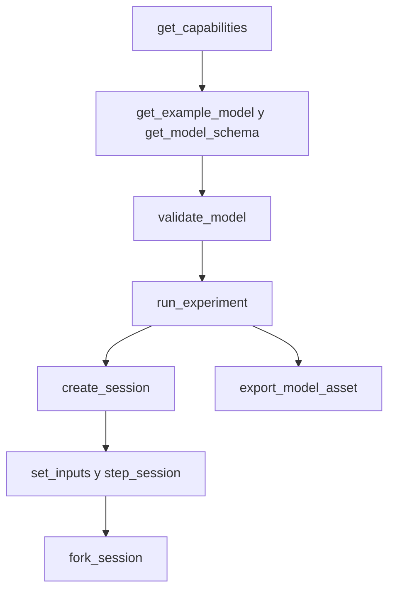

# Interfaz de agente

[English](AGENT_API.md) · [简体中文](AGENT_API.zh-CN.md) · [Français](AGENT_API.fr.md) · [Русский](AGENT_API.ru.md) · [日本語](AGENT_API.ja.md) · [한국어](AGENT_API.ko.md) · [Deutsch](AGENT_API.de.md) · **Español** · [Italiano](AGENT_API.it.md) · [Português](AGENT_API.pt-BR.md)

`Power.Core`, `Power.Agent` y MCP son entradas distintas a un mismo núcleo físico. La API no está ligada a una versión de GPT ni a un proveedor de modelos. Lee la versión, las capacidades y el esquema, y después genera un modelo. Un nombre conocido no significa que ese componente esté implementado.

La [red de gas finita](GAS_NETWORK.es.md) está disponible a través de JSON, la CLI y MCP, y los assets portátiles conservan la composición del gas, las restricciones controladas, los depósitos fijos, los enlaces térmicos de pared y los canales de conservación. La semántica existente de los modelos lineales y de cilindro cerrado no cambia.

El [componente de embrague acoplado](CLUTCH_NETWORK.es.md) está disponible a través de los contratos compartidos
de JSON, de experimento y de sesión. Incluye entradas de acoplamiento acotadas, capacidades
estática y deslizante, relaciones con signo, salidas de fase y de calor, y eventos internos
transaccionales. El [par exacto](CLUTCH_PHYSICS.es.md) independiente sigue siendo una referencia de verificación.

Los [componentes de engranaje y planetario ideales](GEAR_NETWORK.es.md) participan en el solver compartido
y en los contratos de documento. `ideal_gear` tiene puertos A/B y una relación con signo distinta de cero;
`planetary_gear` tiene puertos de sol, corona y portasatélites A/B/C y una relación de dientes corona/sol mayor que
uno. Hacen falta velocidades iniciales compatibles y restricciones permanentes independientes.
Las capacidades describen la política de rango, las tolerancias del solver y las salidas de reacción media.

El [contrato del pistón hidráulico](HYDRAULIC_PISTON.es.md) añade nodos `translational`,
`linear_spring`, `hydraulic_piston`, `piston_clutch` y `force_source`. Los agentes pueden
observar el desplazamiento, la velocidad, la fuerza de presión, la energía y la fuerza de la pastilla, las capacidades del embrague
y el calor de amortiguación acumulado. Un embrague de pistón no tiene entrada de acoplamiento: comanda sus
válvulas de llenado y drenaje e inspecciona el contacto de la pastilla. `get_capabilities.hydraulic_piston`
describe las unidades SI, la convención de volumen y trabajo, el alcance del solver y la recuperación
ante presión negativa. La validación del modelo devuelve errores accionables de unidad, rango y conexión;
los contratos de revisión de sesión, cancelación y bifurcación independiente se aplican sin cambios.

`hydraulic_spool_valve` referencia un componente de pistón y posiciones explícitas de cierre y de apertura
total. Su apertura sigue el movimiento real; no acepta un comando de apertura ni una
anulación de la entrada inicial. El caudal, la pérdida y la apertura son observables a través del contrato compartido
de modelo y sesión. `get_capabilities.hydraulic_spool_valve` declara las
unidades de posición y caudal, la resolución simultánea y la física de fuerza de chorro omitida. Pide
`spool-regulated-pump` para inspeccionar la regulación mecánica de presión; consulta
[el contrato de dosificación](HYDRAULIC_SPOOL.es.md).

`gas_piston` enlaza un nodo de traslación con una cámara de gas móvil, con área explícita,
volumen y posición de referencia, presión de referencia absoluta y dirección de compresión
con signo. Observa la masa de gas, la energía, la presión, la temperatura, el volumen, la fuerza y
el trabajo de referencia. Combínalo con un pistón hidráulico sobre la misma masa para un
acumulador; usa puertos de gas y enlaces térmicos explícitos para el transporte. La validación comprueba un solo
propietario del volumen y un volumen nominal de gas positivo. Las capacidades declaran el límite de intervalo
de un cuarto de volumen; el contrato indica el límite de precisión del acoplamiento con la pared. Pide `gas-accumulator-pump`;
consulta [el contrato de gas y fluido](GAS_PISTON.es.md).

`gas_fuel_injector` conecta volúmenes de gas fuente y receptor finitos, rastreados y compatibles,
y un cigüeñal de temporización explícito. Su entrada son los kg solicitados por ciclo; observa la
solicitud enclavada, el combustible entregado por ciclo y el total, y el caudal medio entregado. Los cambios de entrada
a mitad de ventana se aplican al siguiente ciclo observado. La contrapresión o la inanición pueden causar
entrega incompleta sin un error de ejecución; usa la evidencia de salida y los KPI. Las capacidades
declaran los límites de temporización, de dosis y de alcance. Pide `metered-fired-cylinder`; consulta
[el contrato de dosificación](FUEL_METERING.es.md). Esto es admisión gaseosa; la
pulverización líquida, la evaporación y el hardware calibrado de combustible y de ECU siguen pendientes.

## Arranque y configuración del cliente

```sh
dotnet run --file tools/Build.cs -- build
dotnet /absolute/path/to/Power!/src/Power.Mcp/bin/Release/net10.0/Power.Mcp.dll
```

Una entrada genérica de cliente MCP. Ponla en la configuración de servidores del cliente y sustituye la ruta:

```json
{
  "mcpServers": {
    "power": {
      "command": "dotnet",
      "args": ["/absolute/path/to/Power!/src/Power.Mcp/bin/Release/net10.0/Power.Mcp.dll"]
    }
  }
}
```

Windows usa el mismo comando `dotnet` y una ruta absoluta a la DLL. Una conexión de producción debe ejecutar la DLL compilada directamente, para que la salida de compilación no se mezcle con el protocolo stdio. El servidor no necesita Unity, credenciales ni una conexión de red. La primera restauración de NuGet sí necesita red. La compatibilidad de transporte y de versión viene del [MCP C# SDK](https://csharp.sdk.modelcontextprotocol.io/v2/concepts/getting-started.html) oficial fijado.

## Herramientas y resultados

En la versión 0.32.0 de la API de agente, `get_example_model` acepta un `name` opcional: `electrothermal` (por defecto), `sealed-cylinder`, `gas-network`, `moving-cylinder`, `crank-timed-cylinder`, `fired-cylinder`, `fired-clutch`, `fired-planetary`, `fired-converter`, `fired-hydraulic`, `fired-pump`, `fired-pump-losses`, `electric-pump`, `pressure-regulated-pump`, `battery-regulated-pump`, `piston-actuated-clutch`, `spool-regulated-pump`, `gas-accumulator-pump`, `metered-fired-cylinder`, `film-fired-cylinder`, `liquid-injected-cylinder`, `needle-actuated-cylinder`, `closure-compensated-cylinder`, `dual-clutch-transmission`, `fired-dual-clutch`, `controlled-dual-clutch`, `controlled-fired-dual-clutch`, `ravigneaux-transmission`, `fired-ravigneaux-converter`, `resolved-ravigneaux-transmission`, `fired-resolved-ravigneaux-converter`, `hydraulic-ravigneaux-transmission` o `fired-hydraulic-ravigneaux`. `get_capabilities` anuncia los niveles de fidelidad admitidos, las versiones de asset legibles, los límites del solver y las cotas de entrada. Las exportaciones usan `power.asset.v27`; los assets v1–v23 siguen siendo legibles. La validación del modelo y la creación de sesión devuelven los canales de salida y sus unidades. Aprobar los KPI de un laboratorio no establece un grupo motopropulsor completo ni calibrado.

| Herramienta | Finalidad |
|---|---|
| `get_capabilities` | Versión, capacidades del modelo, límites de tamaño, semántica temporal y el flujo de trabajo |
| `get_model_schema` | El JSON Schema completo de `power.model.v1` |
| `get_example_model` | Un ejemplo editable con eventos y KPIs |
| `validate_model` | Comprueba el modelo y el experimento. Devuelve la huella, los canales y el diagnóstico, y no avanza el tiempo |
| `run_experiment` | Experimento completo, dos repeticiones con tamaños de lote distintos, KPIs y procedencia. El resultado es compacto por defecto |
| `export_model_asset` | Valida y exporta un `.powerasset`. Devuelve el contenido en Base64, el resumen del archivo, la procedencia y la huella del modelo |
| `create_session` | Crea una simulación interactiva independiente. Devuelve la instantánea inicial y los metadatos de canal |
| `read_snapshot` | Tiempo actual, revisión, hash y canales de salida elegidos |
| `set_inputs` | Envía de forma atómica un marco de entrada en el instante actual y avanza la revisión de la sesión |
| `step_session` | Avanza de forma atómica un número solicitado de nanosegundos. Admite cancelación. La revisión avanza |
| `fork_session` | Copia el estado físico actual en una rama nueva en la revisión 0 |
| `close_session` | Libera una sesión |

Cada herramienta tiene un esquema de entrada y un esquema de salida. El éxito y los errores de dominio devuelven ambos `structuredContent` y un resultado de texto compatible. El `isError` de MCP corresponde a `ok=false`. Consulta los [resultados de herramienta estructurados del SDK](https://csharp.sdk.modelcontextprotocol.io/v2/concepts/tools/tools.html).

```json
{"schema":"power.agent.v1","ok":true,"data":{"revision":"2","time_ns":"1000000000","state_hash":"...","values":[]}}
```

```json
{"schema":"power.agent.v1","ok":false,"error":{"code":"revision_conflict","message":"Read the snapshot, then use its current revision.","retryable":true,"current_revision":"2"}}
```

Consulta el [esquema del modelo](../schemas/power.model.v1.schema.json) y el [esquema de respuesta](../schemas/power.agent.v1.schema.json). El esquema del modelo comprueba la estructura. El compilador comprueba después las dimensiones, la topología, los valores positivos, los valores finitos y el sistema numérico. La validación del experimento comprueba la alineación de ticks, el orden de eventos, los canales y los límites de KPI.

## Secuencia de operación



1. Llama a `get_capabilities` y confirma que los componentes físicos que necesitas están admitidos.
2. Obtén un ejemplo y el esquema, y construye un objeto `document`. Los parámetros deben llevar unidades.
3. `validate_model({"document": ...})`. Repara el modelo a partir de `error.object_id`, `error.field` y `error.code`.
4. `run_experiment({"document": ...})`. Comprueba `data.passed`, `checks`, `replay` y `model.calibration`. `ok=true` solo significa que el experimento terminó. Los KPI aún pueden fallar.
5. `create_session` con el mismo documento. Conserva `session_id`, la `revision` inicial y el mapa de canales.
6. Por ejemplo, `set_inputs({"session_id":"...","expected_revision":"0","values":[{"channel":"100","value":24}]})`, y lee la revisión que vuelve.
7. `step_session({"session_id":"...","expected_revision":"1","delta_ns":"1000000000"})` devuelve la instantánea un segundo después.
8. `fork_session({"session_id":"...","expected_revision":"2"})`. Frena el hijo a 4 V y conserva el padre como control.
9. Tras la comparación, `close_session` cada una con su última revisión.

Para inspeccionar el modelo en Unity, llama a `export_model_asset({"document": ..., "name": "My laboratory"})`. Decodifica en Base64 `data.content`, comprueba `data.asset_sha256` frente al archivo completo, guárdalo como `.powerasset` bajo `Assets` de Unity y ábrelo con **Open in Studio** en el Inspector del asset. La herramienta solo devuelve contenido. No escribe un archivo local. Una exportación correcta significa que los datos son válidos. Los KPI y la calibración son comprobaciones separadas. El formato y los límites están en [assets de modelo](ASSET_FORMAT.es.md).

Las revisiones empiezan en 0. Cada confirmación de entrada correcta y cada paso correcto suman 1. Una operación obsoleta, inválida o cancelada no suma una revisión. Una bifurcación deja la revisión del padre sin cambios. Tras cualquier interrupción de transporte, lee la instantánea y usa esa revisión. No reenvíes una escritura que aún lleve la revisión antigua.

`time_ns`, `revision` y los IDs de canal de una instantánea de sesión son cadenas, así que se mantienen exactos más allá del límite entero de JavaScript. El tiempo de experimento en un documento de modelo es como máximo una hora. Los canales de entrada del modelo son enteros hoy. Elige IDs no mayores que `2^53-1` si otro cliente JSON debe mantenerlos exactos. Los IDs de espacio de nombres alto en las salidas siguen siendo cadenas, sin cambios.

`channels` en `read_snapshot` es un array de cadenas de ID de salida. Omítelo para devolver todas las salidas. Los canales de entrada y los campos duplicados se rechazan. `include_samples=true` es lo que hace que un experimento devuelva cada límite de muestra.

## Errores y reparación

| Error | Siguiente paso |
|---|---|
| `model_unit` / `model_connection` / `model_range` | Repara la unidad, la referencia o el parámetro de ese objeto y campo |
| `invalid_argument` / `invalid_json` | Corrige el campo, el orden de eventos, el tiempo o la estructura del documento |
| `unknown_channel` / `invalid_input` | Elige una entrada de la tabla de canales y quita duplicados y valores no finitos |
| `invalid_time_step` | Usa un número entero positivo de ticks, como máximo un millón de ticks por llamada |
| `numerical_failure` | Comprueba la escala de los parámetros, las entradas y el paso. El estado actual no se modificó |
| `revision_conflict` | Lee la última instantánea y decide a partir de ese estado |
| `cancelled` | El lote entero se revirtió. Reintenta con un lote más pequeño |
| `session_capacity` | Cierra las sesiones que ya no necesites |
| `unknown_session` | El proceso se reinició o la sesión se cerró. Créala de nuevo y repite |

Una sesión es un objeto en proceso. No se persiste y no se une a una escena de Unity en ejecución. La interfaz MCP ejecuta hoy experimentos sin interfaz sobre el mismo núcleo. Una conexión posterior con Unity aún tiene que conservar los contratos de revisión, tiempo y atomicidad.

## Añadir un componente

Escribe las ecuaciones y el alcance, define puertos y parámetros con unidades, impleméntalos en el núcleo y toma evidencia de una solución analítica, de la conservación, de la convergencia del paso y de pruebas de fallo. Después añade el esquema y el descubrimiento de capacidades, entrega un experimento repetible y conecta una vista de Unity. La procedencia medida y la incertidumbre se registran por separado. Una prueba que pasa no significa que el modelo esté calibrado.

## Flujo de la red de gas

Pide `gas-network`, valídalo y después ejecuta el experimento y exporta su asset con
las herramientas existentes. `power.model.v1` gana definiciones aditivas de nodo y componente de gas;
los clientes deben descubrirlas desde el esquema y las capacidades. No cambian los nombres de las herramientas.
Los volúmenes de gas consumen dos estados escalares cada uno, y los volúmenes conectados deben compartir R y gamma.

Las entradas de `gas_orifice` usan valores `fraction` en [0, 1]. Un canal de entrada ausente o cero
mantiene fijo el `initial_input` explícito. La validación y la exportación rechazan los valores programados
fuera de rango antes de que se ejecute ningún experimento. El rechazo interactivo conserva tanto
el estado como la revisión. La compilación, la ejecución correcta, el éxito de KPI y la calibración
siguen siendo distintos: el ejemplo es sintético y `unverified`.

Las operaciones de sesión solo de gas usan los mismos tiempos en nanosegundos, las comprobaciones de revisión, la cancelación,
las instantáneas filtradas y las bifurcaciones independientes. Las sesiones parten de las entradas iniciales del componente;
`create_session` no ejecuta el calendario de eventos del experimento. Usa `run_experiment`
o la reproducción portátil para ese calendario. La validación estática no puede garantizar que un estado futuro
siga siendo resoluble numéricamente: ante `numerical_failure`, reduce `step_ns` e inspecciona
el área de flujo, el volumen, la conductancia y las condiciones iniciales antes de recrear la sesión.

## Flujo del cilindro móvil

`get_example_model({"name":"moving-cylinder"})` devuelve un experimento de arrastre no calibrado
con dos restricciones controladas en el tiempo, trabajo de presión del cigüeñal y transferencia de pared.
Los nodos de gas sin `storage` deben conectarse a exactamente un `gas_cylinder`, cuyos parámetros
aportan la geometría. El compilador valida la propiedad y deriva la masa y la energía iniciales
a partir de la presión y la temperatura del nodo de gas y de la geometría inicial del cigüeñal.

Las capacidades anuncian `moving_cylinder_gas_exchange`, la cota de cigüeñal de 0.25 rad y el
alcance de la integración dividida. Los estados de gas siguen siendo canales del nodo de gas; el volumen, el desplazamiento
y el par son canales del componente de cilindro de gas. Los contratos de experimento, exportación, sesión,
revisión y fallo no cambian. Consulta [cilindros móviles](MOVING_CYLINDER.es.md).
Las restricciones programadas en el tiempo no establecen la distribución por ángulo de cigüeñal ni la combustión.

## Flujo de válvulas temporizadas por cigüeñal

`get_example_model({"name":"crank-timed-cylinder"})` devuelve un experimento de arrastre de 720 grados
con velocidad variable, perfiles de admisión y escape, y calor de pared. `valve_timing`
en un `gas_orifice` exige un `crank_node` rotacional y `cycle_angle`,
`open_angle` y `duration_angle` con unidad. El objeto de capacidad anuncia ciclos, perfil,
límites y recuperación. Consulta [el contrato de distribución](VALVE_TIMING.es.md).

Los canales de entrada temporizados representan `peak_opening` en [0, 1]; el `effective_opening`
observable se deriva del ángulo real del cigüeñal. Usa el campo de KPI `opening` para comprobarlo.
Un cigüeñal parado puede permanecer abierto; el movimiento inverso recorre el mismo perfil. La fase
es explícita e independiente de la fase de la geometría del cilindro. Un cambio de pico programado escala
el lóbulo; no sustituye la temporización del cigüeñal.

La validación comprueba la topología y los parámetros, pero no garantiza la resolución en tiempo de ejecución.
Ante `numerical_failure`, reduce `step_ns` para que el recorrido angular y el recorrido de velocidad de extremo queden
dentro de `min(0.25 rad, duration_angle/8)`, y después recrea la sesión. El lote fallido
entero conserva las entradas, el estado y la revisión. El asset v11 conserva el perfil y la compatibilidad v1–v10.
La nueva fidelidad es `crank_timed_gas_exchange`; la ejecución correcta,
los KPI aprobados y la calibración siguen siendo distintos.

## Flujo de combustión premmezclada

`get_example_model({"name":"fired-cylinder"})` devuelve un cilindro encendido premmezclado que acciona
una carga externa. La capacidad `combustion` declara la prescripción de Wiebe, las clases de combustible, aire y
productos, el rango de entrada, el comportamiento del historial hacia adelante y los límites numéricos. Los nodos de gas
especifican `gas.premixed`, y sus restricciones de depósito especifican
`reservoir_fractions` explícitas. El compilador rechaza fracciones ausentes, mezclas conectadas
incompatibles y varios componentes de quemado en una misma cámara.

`premixed_combustion` conecta un `node_a` rotacional con un `node_b` de gas premmezclado, con
ángulos explícitos de ciclo, inicio y duración, exponente de forma y coeficiente de quemado. Su canal de
entrada opcional escala la intensidad de quemado mediante `burn_multiplier` en [0,1]. Cero desactiva
el quemado, pero no impide que el combustible llegue a una admisión abierta. Los ángulos hacia adelante más allá de la
frontera registrada consumen combustible; parar, invertir o recorrer de nuevo no puede repetir la liberación de calor.

Descubre las masas de constituyentes, la energía química, el combustible quemado acumulado, el calor liberado
y `burn_frontier_angle` en la tabla de canales. Los residuos globales de combustible y de aire fresco complementan la masa y la energía totales.
`reservoir_enthalpy` incluye la energía química transportada de los gases premmezclados, y
`net_fuel_energy_in` expone esa parte por separado. La energía interna del gas sigue siendo térmica.
Las fidelidades del informe son `premixed_gas_transport` o `premixed_wiebe_combustion`; ambas
siguen siendo `unverified`.

Ante un fallo de resolución del quemado, reduce `step_ns` y recrea la sesión. El quemado activado
exige que el recorrido del cigüeñal y el recorrido de velocidad de extremo no superen
`min(0.25 rad, burn duration/32)`; el calor por tick se limita al 25% de la energía térmica
previa al quemado. Los contratos de reversión de la llamada entera y de revisión no cambian. Un modelo válido aún
puede fallar una cota de tiempo de ejecución; una ejecución correcta aún puede fallar los KPI. Consulta
[PREMIXED_COMBUSTION.es.md](PREMIXED_COMBUSTION.es.md) para las ecuaciones y las limitaciones.

## Flujo del embrague

`get_example_model({"name":"fired-clutch"})` devuelve un motor encendido, una carga separada,
un embrague y un sumidero de calor, con eventos de acoplamiento y liberación en ticks exactos. Las capacidades `clutch`
declaran cotas de entrada, presupuestos del solver, códigos de modo y la semántica del historial de salida. Define
`parameters.static_capacity` y `sliding_capacity` en Nm, más una `ratio` con signo distinta de cero.
El compilador exige `static >= sliding >= 0`, extremos rotacionales y un sumidero de pérdida
térmica. Los frenos a masa usan `node_b` omitido o cero y relación uno.

La entrada `engagement` está en `[0,1]`; cero desacopla. Descubre el deslizamiento relativo actual,
la última fase aceptada, el par y la potencia térmica medios del último tick, y el calor de fricción acumulado en
la tabla de canales. Las fases son 0 desacoplado, 1 bloqueado, 2 deslizamiento positivo y 3 deslizamiento negativo.
Actualizar `engagement` no reescribe las salidas medias ni la fase del tick precedente.
La fidelidad `hybrid_clutch_powertrain` identifica los modelos que contienen este componente;
no implica una transmisión completa ni un vehículo calibrado.

Usa `run_experiment` para evaluar la evidencia de KPI y de repetición, o las herramientas de sesión para variar
el acoplamiento conservando las comprobaciones de revisión y las ramas independientes. Ante un fallo
numérico, reduce `step_ns` e inspecciona la escala de inercia y relación, las restricciones redundantes y
los calendarios de capacidad. La llamada fallida o cancelada no confirma entradas, fases, calor ni estado
físico. La ruptura de adherencia bajo cargas cambiantes usa la demanda media del intervalo; cerca de las transiciones
hace falta refinar el paso temporal. Consulta [CLUTCH_NETWORK.es.md](CLUTCH_NETWORK.es.md).

## Flujo de transmisión ideal

Pide `fired-planetary` para obtener un motor sintético, un freno de corona, un embrague sol/corona,
un tren planetario y una transmisión final. La subida y la bajada de marcha programadas usan la misma semántica
de tick exacto que los demás experimentos, con 84 límites de repetición coincidentes. `node_c` es el
portasatélites; los engranajes solo aceptan sus puertos rotacionales y `parameters.ratio`.

`slip_speed` y `constraint_error` exponen la velocidad actual y los residuos de fase. `torque`,
`torque_at_b` y el `torque_at_c` solo planetario son reacciones medias sobre los
rotores correspondientes durante el último tick completo. Empiezan en cero y los cambios de entrada en el límite
no los reescriben. Los fallos de velocidad inicial devuelven `model_connection` con el campo `initial_speed`;
las filas de restricción dependientes devuelven `model_solver` con el campo `gear.constraints`.
Corrige la topología o las condiciones iniciales en lugar de reintentar los datos sin cambios.

El asset v11 conserva todos los lectores anteriores, incluido un fixture auténtico de embrague encendido v7.
Este modelo establece un camino de transmisión sintético, no un DCT/AT completo, actuación
hidráulica, comportamiento de TCU ni calibración medida. La evidencia real de Unity sigue siendo separada.

## Flujo del convertidor

Pide `fired-converter` para un motor sintético, un camino de fluido mapeado, un bloqueo separado,
un cambio planetario y un sumidero térmico. Las capacidades anuncian los cuatro mapas con signo exigidos,
los límites de puntos y componentes, la convención del miembro de referencia, los presupuestos de iteración no lineal,
la semántica observable y la recuperación en tiempo de ejecución. La fidelidad es
`quasisteady_converter_powertrain`; aprobar los 87 límites de repetición establece
consistencia numérica, no un rendimiento de transmisión medido.

`torque_converter` exige `node_a` y `node_b` de bomba y turbina, opcionalmente `heat_node`, y
cuatro arrays de mapa explícitos bajo `parameters`. Cada punto tiene relaciones adimensionales de velocidad y
de par, y un coeficiente en `nm_s2_rad2`. No se infiere ningún mapa, cuadrante de marcha atrás, canal de entrada
ni puerto de rotor de estator. La compilación comprueba la pasividad de la interpolación y la continuidad del mapa,
e informa `converter.<map>` o `converter.counter_rotation` con el ID del objeto.

Descubre los pares medios de bomba, turbina y estator, la potencia térmica del fluido, el calor de fluido acumulado,
la relación de velocidad actual con signo y el código de impulsor en los canales. Un `clutch` en paralelo aporta
el acoplamiento de bloqueo. Los contratos de revisión de sesión, cancelación, independencia de ramas y
reversión completa cubren también los historiales del convertidor. Ante `numerical_failure`, reduce
`step_ns` e inspecciona las pendientes de los mapas, las escalas de inercia y velocidad, y las restricciones del embrague. Consulta
[las ecuaciones, las cotas y la evidencia](CONVERTER_NETWORK.es.md). Las exportaciones usan el asset v11;
los fixtures auténticos anteriores conservan la compatibilidad v1–v10. El control hidráulico automático y la validación real
de Unity Editor/Player siguen siendo trabajo separado e inconcluso.

## Flujo hidráulico

Pide `fired-hydraulic` para cámaras de presión controladas por válvula que accionan embragues de
cambio y de bloqueo. La capacidad `hydraulics` expone la convención de presión manométrica, los modelos de almacenamiento
y de caudal, las unidades, los límites de iteración, la tolerancia de presión, el alcance del actuador y la recuperación.
La fidelidad es `compliant_hydraulic_powertrain`; la calibración sigue siendo `unverified`.

Un nodo hidráulico exige un `storage` de flexibilidad positiva en `m3_pa` y una presión
manométrica inicial no negativa. `hydraulic_resistance` y `hydraulic_orifice` exigen coeficientes
de caudal explícitos y apertura de válvula; un orificio necesita además una presión de transición
positiva. Los extremos de depósito exigen una `reservoir_pressure` explícita. Un canal de entrada ausente o
cero fija la apertura suministrada. El compilador nunca infiere propiedades del fluido,
fugas, presión de depósito ni un mapa OEM.

`hydraulic_clutch` tiene puertos rotacionales y geometría bajo `parameters`, incluido su
`pressure_node` hidráulico. No tiene entrada de acoplamiento. Descubre la presión, el volumen de referencia
almacenado, el trabajo de frontera hidráulico, el residuo de inventario, el calor de restricción, la fuerza de apriete y
las capacidades de fricción actuales junto a los canales de historial de embrague existentes. Los cambios de entrada de válvula
conservan la presión almacenada y las medias del último tick hasta que un paso aceptado las avanza.

Los contratos de estado completo, revisión, cancelación y ramas cubren la presión hidráulica
y los libros. Ante un fallo numérico, reduce `step_ns` e inspecciona la flexibilidad, los coeficientes,
las presiones manométricas y la geometría del actuador. Una presión final negativa rechaza el lote entero;
no se recorta en silencio. Consulta [HYDRAULIC_NETWORK.es.md](HYDRAULIC_NETWORK.es.md). El asset v11
conserva las fronteras de presión, las leyes de caudal y la geometría del actuador; todos los lectores v1–v10 permanecen.
Siguen pendientes los mapas medidos de pérdidas y control, la dinámica medida de válvulas y acumuladores, el control completo de ECU/TCU y la aceptación real de Unity.

## Flujo de suministro de bomba

Pide `fired-pump` para una bomba accionada por cigüeñal, una línea flexible, un alivio y una transmisión
accionada por presión. Las capacidades exponen `hydraulic_pump`, las unidades de cilindrada, la convención de admisión,
los límites del solver conjunto y la semántica de trabajo con signo. El `hydraulic_work` de la bomba es una transferencia interna
de eje a fluido; el `hydraulic_work` global sigue siendo trabajo externo de depósito.
Este ejemplo tiene trabajo hidráulico externo nulo y presión almacenada inicial explícita.

`hydraulic_pump` exige puertos de eje y de salida, un `parameters.inlet_node` explícito, una
`displacement` positiva en `m3_rad` y una presión de depósito solo para admisión cero. El alivio
exige conductancia y presión de apertura, sin canal de entrada. Los puertos ausentes o de dominio incorrecto,
las dimensiones y los parámetros irrelevantes producen errores de validación accionables.
El asset v11 conserva ambas definiciones. Las revisiones, la cancelación, las bifurcaciones, la reversión completa y
la distinción entre KPI y calibración no cambian. Consulta [HYDRAULIC_PUMP.es.md](HYDRAULIC_PUMP.es.md).

## Flujo del conjunto de bomba

Pide `fired-pump-losses`, `electric-pump`, `pressure-regulated-pump` o `battery-regulated-pump`. La capacidad `pump_assembly` da
las ecuaciones de caudal neto y de reacción, las unidades de pérdida, la composición de componentes y la frontera de alimentación
eléctrica. Los modelos contienen registros ordinarios de bomba, resistencia y eje; el
ejemplo eléctrico añade el motor RL existente. No hace falta un tipo de componente, un esquema ni una
versión de asset nuevos. Los clientes del núcleo pueden usar `HydraulicPumpAssembly.CreateComponents`
con sus propios IDs estables para producir las mismas definiciones de grafo.

La fuga es una resistencia explícita de salida a admisión con coeficiente en `m3_s_pa`;
la fricción del eje es un eje a masa, de rigidez nula, con amortiguación en `nm_s_rad`.
Ambos exigen valores suministrados y un encaminamiento térmico explícito. Una bomba eléctrica acepta
el voltaje del motor por una entrada `v`, con fuerza contraelectromotriz, corriente y calor del cobre en la
resolución compartida. No infiere una batería, una eficiencia, una viscosidad, un controlador ni una
calibración. Descubre los canales en lugar de interpretar el caudal de la rama de bomba ideal como
la entrega neta del conjunto. Las revisiones, la cancelación, las bifurcaciones y la reversión completa del lote
existentes se aplican a la composición entera.

## Flujo de realimentación de presión

Pide `pressure-regulated-pump`. Las capacidades anuncian el componente `pressure_controller`,
las ganancias dimensionales, los requisitos de sensor y objetivo, el muestreo entero, el recorte
y la semántica transaccional. Valida, ejecuta y exporta con las herramientas existentes. El asset v12
conserva la definición completa del controlador y todos los lectores anteriores siguen admitidos.

La entrada `105` del ejemplo cambia la consigna de presión en Pa del SI. El canal de voltaje `100`
del motor pertenece al controlador y no está entre los canales escribibles. Las escrituras
directas devuelven `controlled_input` con la indicación de escribir `pressure_setpoint`; el rechazo
no cambia ni el estado ni la revisión. Los objetivos de presión negativos se rechazan. La validación
estática detecta propietarios en conflicto, dominios o unidades incorrectos y periodos de muestreo desalineados.

Lee `sampled_pressure`, `pressure_error`, `integral_voltage` y `command_voltage`
a través de los IDs de salida descubribles. Son el estado de la última muestra y el comando retenido.
Las marcas de tiempo de la instantánea identifican la fase del reloj. Los cambios de entrada no avanzan el historial
de control; la siguiente muestra debida lo actualiza en un tick físico. Las bifurcaciones incluyen la memoria
integral y la fase del reloj. La cancelación o un fallo aritmético o del solver posterior no confirma ninguna
parte del lote. La recuperación de desbordamiento exige inspeccionar ganancias, objetivos y escalas
integrales, en lugar de reintentar a ciegas las mismas entradas.

Una ejecución correcta y una repetición exacta pueden acompañar KPI de seguimiento fallidos cuando el
actuador se satura. Comprueba `passed` y las cotas de error por separado de `ok`.
El sensor ideal y la fuente de voltaje del ejemplo son componentes de investigación; no
establecen una batería, una ECU/TCU completa, controles calibrados ni la aceptación de Unity.

## Flujo de alimentación por batería

Pide `battery-regulated-pump`. Las capacidades exponen la carga finita, las ecuaciones de OCV y RC,
las reglas de carga y de ciclo de trabajo, la propiedad del control y la recuperación. El `storage` del nodo de batería usa `c`
o `ah`, `initial` es el SOC en `fraction` y `position` es el voltaje de polarización en `v`.
El registro de batería exige los cinco parámetros eléctricos. Se validan las unidades, las cotas de capacidad y estado,
los puertos de fuente, los sumideros de calor, la OCV creciente y los periodos del controlador.

`battery_motor` exige un puerto A rotacional, un puerto B de batería y una entrada de ciclo de trabajo en [-1,1].
`resistive_load` tiene un puerto A de batería, resistencia y apertura en [0,1]. El canal
`106` del ejemplo cambia la carga de accesorios; `105` cambia la consigna de presión en Pa del SI.
El ciclo de trabajo `100` pertenece a `pressure_duty_controller` y no se puede escribir directamente.
Sus ganancias usan `fraction_pa` y `fraction_pa_s`; las cotas de salida son adimensionales.

Lee `state_of_charge`, `charge`, `battery_current`, `terminal_voltage`,
`polarization_voltage`, la energía almacenada y el calor de la batería junto a `integral_duty`
y `command_duty`. Los canales de voltaje, corriente y potencia de carga son observables algebraicos
instantáneos, así que cambios válidos de ciclo de trabajo o de carga pueden alterarlos sin cambiar los estados almacenados.
El trabajo de la batería es interno; el `source_work` global incluye solo las fronteras de potencia externa
explícitas. Las violaciones de SOC o de voltaje rechazan el lote entero. Inspecciona la carga inicial,
la capacidad, el ciclo de trabajo, las cargas y la longitud del lote antes de reintentar. No hay un recorte silencioso del SOC.

El asset v22 conserva todos los parámetros de alimentación y control, con lectores y fixtures auténticos anteriores.
La cancelación y un fallo posterior conservan la carga, la memoria RC y de control, las entradas y la revisión.
Las bifurcaciones independientes comparan estrategias de accesorios y de ciclo de trabajo a partir del mismo historial físico.
Todos los parámetros siguen sin verificar; un convertidor de ciclo de trabajo promediado ideal no es un BMS de batería,
un lazo PWM o de corriente, un sistema eléctrico de vehículo completo ni una calibración.

## Flujo de película líquida

Pide `film-fired-cylinder`. La capacidad `fuel_film` declara puertos de gas y de pared
finitos, la referencia de energía de fase, las unidades, la precisión de la división y el alcance. Suministra un
inventario líquido inicial, una temperatura, un calor específico, una temperatura de saturación,
una energía interna latente y una conductancia explícitos. Valida y descubre los IDs de salida antes de
ejecutar o exportar el modelo. Las películas no exponen un canal de entrada escribible.

Lee la `mass` restante, la `internal_energy` con signo, `chemical_energy`,
`evaporated_fuel_mass`, el `mass_flow` medio del último tick, `film_wall_heat` acumulado y
el `heat_flow` instantáneo junto al combustible del receptor y el calor de reacción. Las películas secas
informan la temperatura de saturación declarada y un flujo de calor nulo. La disponibilidad real de vapor
gobierna la reacción; una definición de película válida no implica evaporación
ni KPI de liberación de calor aprobados.

El asset v18 conserva las cantidades de fase y los lectores anteriores. Las comprobaciones de revisión,
la cancelación, las bifurcaciones independientes y la reversión por fallo tardío incluyen todos los historiales
líquido, térmico, de constituyentes y compensado. Unidades o puertos incorrectos, líquido inicial
sobrecalentado y recuentos de estado excesivos devuelven errores estructurados. Inspecciona el
objeto y el campo informados, y el presupuesto de calor finito, antes de reintentar un modelo fallido.
El [contrato de película](FUEL_FILM.es.md) registra las ecuaciones y el límite de precisión.
El mojado inicial no establece inyección líquida, propiedades de combustible calibradas,
control de motor completo ni aceptación real de Unity.

## Flujo de inyección líquida finita

Pide `liquid-injected-cylinder`. La capacidad `liquid_fuel_injector` declara
la fuente flexible y finita, la entrada de ciclo en `kg`, las unidades de densidad y flexibilidad, el libro de
energía y la frontera del receptor. Suministra todas las cantidades del raíl, la geometría de la tobera y una
referencia existente de película y cigüeñal. Valida primero y descubre los IDs y las unidades de salida.

La entrada `104` del ejemplo solicita kg por ciclo. Los cambios se enclavan en una ventana hacia adelante
observada más tarde; la entrega actual puede seguir limitada por la presión de la fuente. Lee la
`mass` del raíl, la `pressure`, la `internal_energy` almacenada, la energía química y el volumen junto a
`requested_fuel_dose`, `delivered_fuel_dose`, `total_fuel_delivered` y el `mass_flow` medio del último tick.
La masa, la temperatura y la evaporación de la película, y el calor de reacción separado, identifican
el retardo entre aceptar una dosis y la combustión real del vapor.

El `source_work` del componente es el trabajo de presión de raíl almacenado que se libera, `hydraulic_work` es
el trabajo de presión del receptor exportado y `fluid_heat` es la disipación de la tobera encaminada a
la pared de la película. Sus identidades son distintas del trabajo de fuente externa global.
El receptor de volumen líquido despreciable exporta el trabajo de desplazamiento de forma explícita;
no añade trabajo de cigüeñal oculto ni modela la geometría de la pulverización.

El asset v19 conserva la fuente, la tobera y la temporización completas, con lectores v1-v18. Las revisiones,
la cancelación, las bifurcaciones y el fallo tardío o especulativo incluyen cada historial de raíl, cuota y calor.
Unidades incorrectas, un volumen flexible imposible, líquido sobrecalentado y una propiedad de
película o cigüeñal que no coincide producen diagnósticos estructurados. Inspecciona el objeto y el campo fallidos
y las fronteras de presión y dosis antes de reintentar. Una ejecución correcta de la herramienta no
implica entrega completa, KPI aprobados ni hardware calibrado. Consulta
[LIQUID_FUEL_INJECTION.es.md](LIQUID_FUEL_INJECTION.es.md).

## Flujo de aguja física

Pide `needle-actuated-cylinder`. Las capacidades declaran unidades de pendiente magnética,
energía de flujo, apertura real, control muestreado y límites de investigación. El comando de `104` kg del inyector
es escribible; el voltaje de bobina `107`, propiedad del accionamiento, no lo es. Las escrituras
rechazadas devuelven `controlled_input` con el nombre y el canal de comando correctos, y conservan
el estado y la revisión. Actualiza la masa de combustible solicitada y avanza ticks físicos exactos.

Lee el desplazamiento y la velocidad reales de la aguja, y la apertura del inyector, junto a la corriente de bobina,
la energía magnética, el calor del cobre, el trabajo eléctrico, el voltaje retenido y el objetivo y la entrega
de la última muestra. El fluido puede continuar después de retirar el voltaje, de que se cierre la ventana o de alcanzar la entrega
objetivo. El líquido restante, el combustible gaseoso, el combustible no quemado y el de frontera, y la reacción
siguen siendo observables por separado. Una solicitud válida o una herramienta correcta no establecen
una entrega de dosis exacta ni un control calibrado.

El asset v20 conserva las tablas magnética, de carrera, de aguja y de accionamiento, y los lectores v1-v19. Los periodos de muestreo
deben alinearse a ticks; el voltaje tiene un solo propietario; las referencias de aguja, bobina y cigüeñal
deben coincidir. Ante errores del solver inspecciona `L(x)` positiva, R/L y el gradiente, el recorrido de carrera
y el paso temporal; refina los intervalos físicos y de control antes de afirmar precisión dinámica.
La cancelación, las bifurcaciones y los lotes rechazados o especulativos incluyen todos los historiales de flujo, térmicos,
muestreados o retenidos, y de fase. Consulta [NEEDLE_ACTUATION.es.md](NEEDLE_ACTUATION.es.md).

## Flujo de aguja con compensación de cierre

Pide `closure-compensated-cylinder`. Su accionamiento habilita un horizonte `closure_prediction_ns`
finito y alineado. Las capacidades dan el límite de 4096 ticks, la hipótesis de entrada retenida
y la búsqueda de corte acotada. Las solicitudes de kg de la fuente siguen siendo escribibles; el voltaje
sigue perteneciendo al accionamiento. Descubre los canales de masa y recuento predichos, el enclavamiento de corte y los ticks
pendientes junto a la posición real de la aguja, la entrega y el voltaje retenido.

La predicción es una repetición aparte de la planta con el estado completo. Retiene los demás comandos y
no conoce los eventos de entrada externos futuros, así que inspecciona la entrega real tras el cierre
y el refinamiento de horizonte y de paso temporal, en lugar de tratar el pronóstico como combustible medido.
Una predicción fallida o cancelada no confirma ninguna parte del lote real. El desbordamiento de reloj,
un horizonte inválido o candidatos de corte no monótonos exigen revisar las hipótesis de temporización y de modelo;
los pronósticos parciales no se aceptan en silencio.

El asset v21 escribe el horizonte y conserva los lectores anteriores. Las revisiones, las bifurcaciones
independientes y la reversión del lote entero incluyen el enclavamiento de predicción y la cuenta atrás. Los clientes del
núcleo pueden emitir `PredictNeedleClosure` de solo lectura; las instantáneas MCP exponen la última
estimación del candidato seleccionado y muestreado. El alcance y la evidencia están en
[CLOSURE_PREDICTION.es.md](CLOSURE_PREDICTION.es.md).

## Flujo del camino de potencia de doble embrague

Pide `dual-clutch-transmission` o `fired-dual-clutch`. Las capacidades describen
el grafo ordinario de siete marchas adelante y marcha atrás, dos caminos de entrada, tres ramas de salida
y los límites de investigación. Valida y descubre cada reacción de engranaje, el deslizamiento, el modo y el
calor del embrague, y la velocidad del rotor, antes de cambiar los comandos de selector y de tracción.

Los ejemplos usan los canales de tracción `500`/`501` y los canales de selector `600`-`607`
para adelante 1-7 y marcha atrás. Los comandos son fracciones; las relaciones siguen siendo restricciones
permanentes. Preselecciona un camino descargado liberando su selector anterior y
acoplando el objetivo, y después coordina por separado la entrega del embrague de tracción. `DualClutchGraph.SelectPath` del núcleo
produce el conjunto atómico de comandos de selector de ese camino.
No implementa la detección de la TCU, los enclavamientos ni la dinámica de actuadores.

Las instantáneas exponen todos los cubos libres y seleccionados, las velocidades de entrada y salida, el calor de sincronización y
de tracción, el error de fase del engranaje y la evidencia global de fuente, energía y combustible. Las combinaciones
inseguras pueden trabar o frenar la transmisión física; una escritura de entrada
correcta no establece un cambio válido. Las comprobaciones de revisión, la cancelación, las bifurcaciones
independientes y el fallo tardío conservan cada estado e historial. Se conservan el formato portátil
existente y los lectores anteriores. Consulta
[DUAL_CLUTCH_TRANSMISSION.es.md](DUAL_CLUTCH_TRANSMISSION.es.md).

## Flujo de control DCT muestreado

Pide `controlled-dual-clutch` o `controlled-fired-dual-clutch`. Escribe una
`requested_gear` entera en el canal `700`: 1-7 adelante, -1 marcha atrás, 0 punto muerto.
El controlador posee la tracción `500`/`501` y los selectores `600`-`607`; las escrituras directas
devuelven `controlled_input` con el canal de marcha solicitada correcto. Las marchas
fraccionarias son inválidas y no alteran el estado ni la revisión.

Lee la marcha real confirmada, las selecciones comandadas, la fase, el deslizamiento del selector objetivo
y el fallo. La marcha solicitada no implica un cambio completado. La máquina de estados
preselecciona caminos descargados, confirma el bloqueo físico, usa una entrega escalonada con interrupción
de par y expone fallos de tiempo de espera, de dirección y de bloqueo persistente. El punto muerto aborta en una
muestra debida; otro objetivo puede recuperar un fallo. Un deslizamiento transitorio puede informar
una marcha real no confirmada mientras el controlador vigila su duración.

El límite explícito de estado informado es 128, con 32 nodos y 64 componentes sin cambios.
Se verifican la composición real de encendido y controlador, y las comprobaciones cerca del límite y por encima de él;
las comprobaciones Standard siguen ejecutándose en .NET 10 y no son evidencia de Unity. El asset v22 conserva
rutas inmutables y estado temporizado, con los lectores anteriores. La cancelación, las bifurcaciones, el fallo
tardío y el historial de coordenadas compensadas siguen siendo transacciones del lote entero.
La mezcla completa de par de la ECU, los actuadores y la calibración siguen siendo requisitos separados.
Consulta [DCT_CONTROL.es.md](DCT_CONTROL.es.md).

## Caminos planetarios compuestos

`double_pinion_planetary_gear` exige puertos de sol, corona y portasatélites A/B/C y una relación
`k > 1`. Su restricción es `sun - k ring + (k-1) carrier = 0`. El
`planetary_gear` existente conserva el signo de piñón simple. Ambos exponen residuos de velocidad y de fase
y los tres pares de reacción. Velocidades iniciales incompatibles, dominios incorrectos,
filas redundantes y portasatélites incompletos devuelven errores de compilación accionables.

Pide `ravigneaux-transmission` o `fired-ravigneaux-converter` para calendarios de investigación
explícitos de cinco elementos, integración de convertidor y bloqueo, y repetición
física completa. Las entradas de acoplamiento son fracciones; un comando correcto no
demuestra un rango bloqueado. Ningún controlador AT posee estas entradas prescritas. El asset v23
conserva la topología y lee v1-v22. Consulta [RAVIGNEAUX_TRANSMISSION.es.md](RAVIGNEAUX_TRANSMISSION.es.md).

## Engranes relativos al portasatélites y dinámica interna de satélites

`carrier_gear` exige puertos rotacionales A/B/C distintos, una relación con signo
finita y distinta de cero, y velocidades iniciales compatibles. La restricción es
`A - ratio B + (ratio-1) C = 0`; se admiten relaciones externas negativas e internas positivas,
incluida la unidad. C es un portasatélites móvil real con su propio par de reacción,
no una masa implícita. Los canales exponen los tres pares medios y los
residuos de velocidad y de fase. Relaciones nulas, portasatélites ausentes, dominios incorrectos y restricciones
dependientes devuelven errores de compilación tipados.

Pide `resolved-ravigneaux-transmission` o
`fired-resolved-ravigneaux-converter`. Ambos conservan cuatro engranes físicos, dos
estados de giro absoluto de satélite y la inercia orbital declarada en el portasatélites.
El almacenamiento de rotor simple incluye sus energías cinéticas reales; las entradas siguen siendo
fracciones de acoplamiento prescritas, no un control AT completo. El grafo plano registra
inercias y relaciones agregadas, mientras las descripciones de origen conservan la geometría y las masas
declaradas que las generaron. El asset v24 incluye este primitivo y
lee v1-v23. Consulta [RESOLVED_PLANETS.es.md](RESOLVED_PLANETS.es.md).

## Actuación AT por pistón alimentada por bomba

Pide `hydraulic-ravigneaux-transmission` o `fired-hydraulic-ravigneaux`.
Usa fracciones explícitas de llenado y drenaje en 700/701 hasta 708/709; el bloqueo encendido
usa 710/711. Los IDs anteriores de acoplamiento de rango están ausentes. Valida y descubre los canales
antes de escribir. La presión, la carrera y el contacto del pistón determinan las capacidades; un comando
aceptado por la API no confirma el bloqueo físico.

Los informes conservan la presión de línea y de cámara, la carrera, la capacidad de contacto, el trabajo de bomba, el volumen
barrido, el calor de fricción, de restricción y de amortiguación, y cada hash de modelo. Las revisiones completas,
la cancelación, la reversión tardía y las bifurcaciones independientes de liberación de válvula usan los contratos
ordinarios. El grafo usa registros existentes del asset v24, no un formato de serialización
nuevo. Consulta [AT_HYDRAULIC_ACTUATION.es.md](AT_HYDRAULIC_ACTUATION.es.md).

## Realimentación de AT hidráulica

`at_controller` acepta una marcha solicitada entera en [-1,4]; cero es punto muerto. Controla cinco pares de válvulas de llenado/vaciado y el bloqueo opcional del convertidor. El orden es entrada del portasatélites, solar pequeño, solar grande, freno del portasatélites, freno del solar grande y bloqueo.

`controlled-hydraulic-ravigneaux` y `controlled-fired-hydraulic-ravigneaux` usan canal 900 e ID 1400. Conservan 99 y 122 estados declarados dentro del límite sin cambios de 128. v27 conserva rutas, ganancias y relojes y lee v1-v26.

Son controles de investigación y los parámetros siguen `unverified`. Coordinación de par ECU, sensores/válvulas detallados, fallos completos del vehículo y calibración OEM siguen pendientes. Las pruebas managed y Standard no acreditan Unity Editor/Play/Player/IL2CPP real.

[AT_CONTROL.es.md](AT_CONTROL.es.md)

## Raíl de combustible líquido alimentado por bomba

`liquid_rail_feed` asocia un inyector líquido con una bomba de desplazamiento existente y una frontera explícita de materia/calor. El nodo de salida hidráulica debe coincidir con la compliancia y presión absoluta inicial del raíl. Bomba e inyector poseen ese nodo; otras rutas fluidas no contabilizadas se rechazan.

v27 conserva enlaces y temperatura de fuente y lee v1-v26. Intercambio analítico eje/presión, refinamiento ODE simultáneo independiente, mezcla térmica, balances masa/combustible/energía/volumen, retorno y rollback completo tienen verificaciones separadas.

Capacidad geométrica, ventilación/espacio gaseoso/oleaje, cavitación, llenado/eficiencia/regulación medidos y spray resuelto siguen abiertos. Parámetros `unverified`; Unity Editor/Play/Player/IL2CPP real y calibración OEM siguen sin verificar.

[PUMP_FED_FUEL.es.md](PUMP_FED_FUEL.es.md)

## Tanque finito de combustible líquido

`liquid_fuel_tank` guarda masa líquida finita y energía térmica con densidad, referencia térmica de película y poder calorífico del inyector asociado. La alimentación lo elige con `tank_component` y omite `supply_temperature`. Cada tanque pertenece a una alimentación compatible.

Energías térmica y química del tanque forman el almacenamiento completo. La transferencia interna no agrega masa ni suministro químico externos. La presión de entrada prescrita mantiene su frontera de trabajo de presión. Admisión/escape gaseoso aún pueden llevar energía química.

Capacidad geométrica, ventilación/espacio gaseoso/oleaje, cavitación, llenado/eficiencia/regulación medidos y spray resuelto siguen abiertos. Parámetros `unverified`; Unity Editor/Play/Player/IL2CPP real y calibración OEM siguen sin verificar.

[LIQUID_FUEL_TANK.es.md](LIQUID_FUEL_TANK.es.md)
