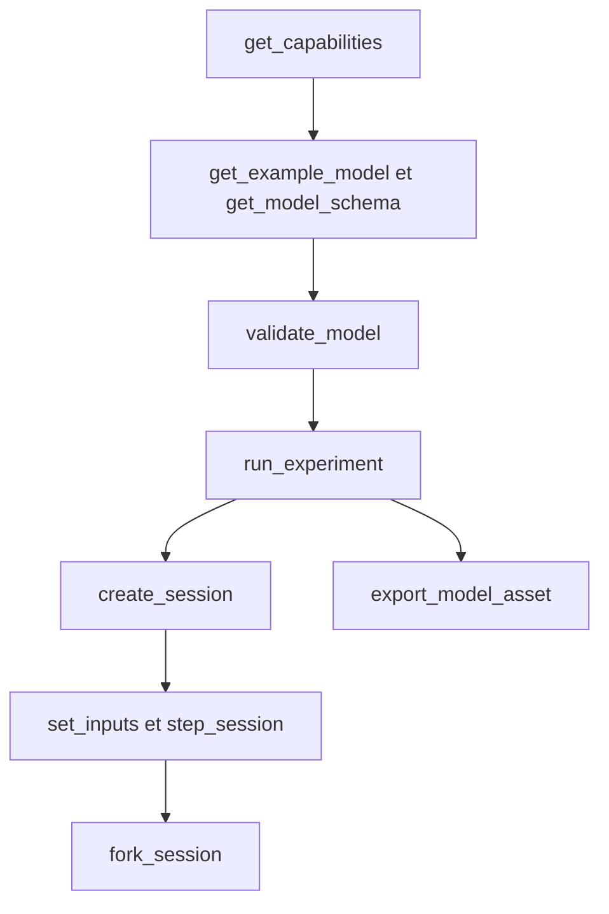

# Interface agent

[English](AGENT_API.md) · [简体中文](AGENT_API.zh-CN.md) · **Français** · [Русский](AGENT_API.ru.md) · [日本語](AGENT_API.ja.md) · [한국어](AGENT_API.ko.md) · [Deutsch](AGENT_API.de.md) · [Español](AGENT_API.es.md) · [Italiano](AGENT_API.it.md) · [Português](AGENT_API.pt-BR.md)

`Power.Core`, `Power.Agent` et MCP sont des entrées différentes vers un seul cœur physique. L'API n'est liée ni à une version de GPT ni à un fournisseur de modèle. Lisez la version, les capacités et le schéma, puis générez un modèle. Un nom familier ne signifie pas que ce composant est implémenté.

Le [réseau gazeux fini](GAS_NETWORK.fr.md) est disponible via JSON, la CLI et le MCP, avec la composition gazeuse, les restrictions commandées, les réservoirs fixes, les liaisons thermiques de paroi et les canaux de conservation conservés dans les assets portables. La sémantique existante des modèles linéaires et à cylindre fermé reste inchangée.

Le [composant d'embrayage couplé](CLUTCH_NETWORK.fr.md) est disponible via les contrats JSON, d'expérience et de session partagés. Il inclut des entrées d'engagement bornées, des capacités statique et glissante, des rapports signés, des sorties de phase/chaleur et des événements internes transactionnels. La [paire exacte](CLUTCH_PHYSICS.fr.md) autonome reste une référence de vérification.

Les [composants d'engrenage/planétaire idéaux](GEAR_NETWORK.fr.md) participent au solveur partagé et aux contrats de document. `ideal_gear` a des ports A/B et un rapport signé non nul ; `planetary_gear` a des ports solaire/couronne/porte-satellites A/B/C et un rapport de dents couronne/solaire supérieur à un. Des vitesses initiales compatibles et des contraintes permanentes indépendantes sont requises. Les capacités décrivent la politique de rang, les tolérances du solveur et les sorties de réaction moyenne.

Le [contrat de piston hydraulique](HYDRAULIC_PISTON.fr.md) ajoute les nœuds `translational`, `linear_spring`, `hydraulic_piston`, `piston_clutch` et `force_source`. Les agents peuvent observer le déplacement, la vitesse, la force de pression, l'énergie/force des garnitures, les capacités d'embrayage et la chaleur d'amortissement cumulée. Un embrayage à piston n'a pas d'entrée d'engagement : commandez ses vannes de remplissage/vidange et inspectez le contact des garnitures. `get_capabilities.hydraulic_piston` décrit les unités SI, la convention volume/travail, le périmètre du solveur et la récupération de pression négative. La validation du modèle renvoie des erreurs d'unité, de plage et de connexion actionnables ; les contrats de révision de session, d'annulation et de dérivation indépendante s'appliquent sans changement.

`hydraulic_spool_valve` référence un composant piston et des positions explicites fermée/pleine ouverture. Son ouverture suit le mouvement réel ; il n'accepte ni commande d'ouverture ni surcharge d'entrée initiale. Le débit, la perte et l'ouverture sont observables via le contrat modèle/session partagé. `get_capabilities.hydraulic_spool_valve` déclare les unités de position/débit, la résolution simultanée et la physique de force de jet omise. Demandez `spool-regulated-pump` pour inspecter la régulation mécanique de pression ; voir [le contrat de dosage](HYDRAULIC_SPOOL.fr.md).

`gas_piston` relie un nœud en translation à une chambre à gaz mobile, avec une aire explicite, un volume et une position de référence, une pression de référence absolue et une direction de compression signée. Observez la masse gazeuse, l'énergie, la pression, la température, le volume, la force et le travail de référence. Combinez-le avec un piston hydraulique sur la même masse pour un accumulateur ; utilisez des ports gazeux et des liaisons thermiques explicites pour le transport. La validation vérifie un seul propriétaire de volume et un volume gazeux nominal positif. Les capacités déclarent la limite d'intervalle d'un quart de volume ; le contrat énonce la frontière de précision du couplage de paroi. Demandez `gas-accumulator-pump` ; voir [le contrat gaz/fluide](GAS_PISTON.fr.md).

`gas_fuel_injector` relie des volumes gazeux source/récepteur finis et suivis, compatibles, et un vilebrequin de calage explicite. Son entrée est la masse demandée en kg par cycle ; observez la demande verrouillée, le carburant délivré par cycle et au total, et le débit moyen délivré. Les changements d'entrée en milieu de fenêtre s'appliquent au cycle observé suivant. Une contre-pression ou une sous-alimentation peut causer une sous-livraison sans erreur d'exécution ; utilisez les preuves de sortie et les KPI. Les capacités déclarent les frontières de calage, de dose et de périmètre. Demandez `metered-fired-cylinder` ; voir [le contrat de dosage](FUEL_METERING.fr.md). Il s'agit d'une admission gazeuse, tandis que la pulvérisation liquide, l'évaporation et le matériel carburant/ECU calibré restent ouverts.

## Démarrage et configuration client

```sh
dotnet run --file tools/Build.cs -- build
dotnet /absolute/path/to/Power!/src/Power.Mcp/bin/Release/net10.0/Power.Mcp.dll
```

Une entrée de client MCP générique. Placez-la dans la configuration serveur du client et remplacez le chemin :

```json
{
  "mcpServers": {
    "power": {
      "command": "dotnet",
      "args": ["/absolute/path/to/Power!/src/Power.Mcp/bin/Release/net10.0/Power.Mcp.dll"]
    }
  }
}
```

Windows utilise la même commande `dotnet` et un chemin absolu vers la DLL. Une connexion de production doit exécuter directement la DLL construite, afin que la sortie de build ne se mélange pas au protocole stdio. Le serveur n'a besoin ni d'Unity, ni d'identifiants, ni d'une connexion réseau. La première restauration NuGet a besoin d'un réseau. Le transport et la compatibilité de version viennent du [SDK MCP C#](https://csharp.sdk.modelcontextprotocol.io/v2/concepts/getting-started.html) officiel épinglé.

## Outils et résultats

Dans la version 0.29.0 de l'API agent, `get_example_model` accepte un `name` facultatif : `electrothermal` (défaut), `sealed-cylinder`, `gas-network`, `moving-cylinder`, `crank-timed-cylinder`, `fired-cylinder`, `fired-clutch`, `fired-planetary`, `fired-converter`, `fired-hydraulic`, `fired-pump`, `fired-pump-losses`, `electric-pump`, `pressure-regulated-pump`, `battery-regulated-pump`, `piston-actuated-clutch`, `spool-regulated-pump`, `gas-accumulator-pump`, `metered-fired-cylinder`, `film-fired-cylinder`, `liquid-injected-cylinder`, `needle-actuated-cylinder`, `closure-compensated-cylinder`, `dual-clutch-transmission`, `fired-dual-clutch`, `controlled-dual-clutch`, `controlled-fired-dual-clutch`, `ravigneaux-transmission`, `fired-ravigneaux-converter`, `resolved-ravigneaux-transmission`, `fired-resolved-ravigneaux-converter`, `hydraulic-ravigneaux-transmission` ou `fired-hydraulic-ravigneaux`. `get_capabilities` annonce les niveaux de fidélité pris en charge, les versions d'asset lisibles, les limites du solveur et les bornes d'entrée. Les exports utilisent `power.asset.v24` ; les assets v1–v23 restent lisibles. Les canaux de sortie et leurs unités sont renvoyés par la validation du modèle et la création de session. Des KPI de laboratoire réussis n'établissent pas un groupe motopropulseur complet ou calibré.

| Outil | Rôle |
|---|---|
| `get_capabilities` | Version, capacités du modèle, limites de taille, sémantique du temps et le flux de travail |
| `get_model_schema` | Le JSON Schema complet de `power.model.v1` |
| `get_example_model` | Un exemple modifiable avec événements et KPI |
| `validate_model` | Vérifie le modèle et l'expérience. Renvoie l'empreinte, les canaux et les diagnostics, et n'avance pas le temps |
| `run_experiment` | Expérience complète, deux rejeus avec des tailles de lot différentes, KPI et provenance. Le résultat est compact par défaut |
| `export_model_asset` | Valide et exporte un `.powerasset`. Renvoie le contenu Base64, le condensé du fichier, la provenance et l'empreinte du modèle |
| `create_session` | Crée une simulation interactive indépendante. Renvoie l'instantané initial et les métadonnées de canaux |
| `read_snapshot` | Heure courante, révision, hachage et canaux de sortie choisis |
| `set_inputs` | Soumet atomiquement une trame d'entrée à l'instant courant et avance la révision de session |
| `step_session` | Avance atomiquement d'un nombre demandé de nanosecondes. L'annulation est prise en charge. La révision avance |
| `fork_session` | Copie l'état physique courant dans une nouvelle branche à la révision 0 |
| `close_session` | Libère une session |

Chaque outil a un schéma d'entrée et un schéma de sortie. Le succès et les erreurs de domaine renvoient tous deux `structuredContent` et un résultat texte compatible. Le `isError` MCP correspond à `ok=false`. Voir [les résultats d'outils structurés dans le SDK](https://csharp.sdk.modelcontextprotocol.io/v2/concepts/tools/tools.html).

```json
{"schema":"power.agent.v1","ok":true,"data":{"revision":"2","time_ns":"1000000000","state_hash":"...","values":[]}}
```

```json
{"schema":"power.agent.v1","ok":false,"error":{"code":"revision_conflict","message":"Read the snapshot, then use its current revision.","retryable":true,"current_revision":"2"}}
```

Voir le [schéma de modèle](../schemas/power.model.v1.schema.json) et le [schéma de réponse](../schemas/power.agent.v1.schema.json). Le schéma de modèle vérifie la structure. Le compilateur vérifie ensuite les dimensions, la topologie, les valeurs positives, les valeurs finies et le système numérique. La validation d'expérience vérifie l'alignement des ticks, l'ordre des événements, les canaux et les bornes de KPI.

## Séquence d'opérations



1. Appelez `get_capabilities` et confirmez que les composants physiques dont vous avez besoin sont pris en charge.
2. Obtenez un exemple et le schéma, puis construisez un objet `document`. Les paramètres doivent porter des unités.
3. `validate_model({"document": ...})`. Réparez le modèle à partir de `error.object_id`, `error.field` et `error.code`.
4. `run_experiment({"document": ...})`. Vérifiez `data.passed`, `checks`, `replay` et `model.calibration`. `ok=true` signifie seulement que l'expérience s'est terminée. Les KPI peuvent encore échouer.
5. `create_session` avec le même document. Conservez `session_id`, la `revision` initiale et la carte des canaux.
6. Par exemple, `set_inputs({"session_id":"...","expected_revision":"0","values":[{"channel":"100","value":24}]})`, puis lisez la révision renvoyée.
7. `step_session({"session_id":"...","expected_revision":"1","delta_ns":"1000000000"})` renvoie l'instantané une seconde plus tard.
8. `fork_session({"session_id":"...","expected_revision":"2"})`. Freinez l'enfant à 4 V et gardez le parent comme témoin.
9. Après la comparaison, `close_session` chacun avec sa dernière révision.

Pour inspecter le modèle dans Unity, appelez `export_model_asset({"document": ..., "name": "My laboratory"})`. Décodez en Base64 `data.content`, comparez `data.asset_sha256` au fichier entier, enregistrez-le comme `.powerasset` sous `Assets` de Unity, et ouvrez-le avec **Open in Studio** dans l'Inspector de l'asset. L'outil ne renvoie que le contenu. Il n'écrit pas de fichier local. Un export réussi signifie que les données sont valides. Les KPI et la calibration sont des contrôles séparés. Le format et les limites sont dans [les assets de modèle](ASSET_FORMAT.fr.md).

Les révisions commencent à 0. Chaque validation d'entrée réussie et chaque pas réussi ajoute 1. Une opération périmée, invalide ou annulée n'ajoute pas de révision. Une dérivation laisse la révision du parent inchangée. Après toute interruption de transport, lisez l'instantané et utilisez cette révision. Ne renvoyez pas une écriture qui porte encore l'ancienne révision.

`time_ns`, `revision` et les ID de canal dans un instantané de session sont des chaînes, afin de rester exacts au-delà de la limite d'entier JavaScript. Le temps d'expérience dans un document de modèle est d'au plus une heure. Les canaux d'entrée de modèle sont des entiers aujourd'hui. Choisissez des ID ne dépassant pas `2^53-1` si un autre client JSON doit les garder exacts. Les ID d'espace de noms élevé dans les sorties restent des chaînes, inchangés.

`channels` sur `read_snapshot` est un tableau de chaînes d'ID de sortie. Omettez-le pour renvoyer chaque sortie. Les canaux d'entrée et les champs en double sont rejetés. `include_samples=true` est ce qui fait qu'une expérience renvoie chaque frontière d'échantillon.

## Erreurs et réparation

| Erreur | Étape suivante |
|---|---|
| `model_unit` / `model_connection` / `model_range` | Réparez l'unité, la référence ou le paramètre sur cet objet et ce champ |
| `invalid_argument` / `invalid_json` | Corrigez le champ, l'ordre des événements, le temps ou la structure du document |
| `unknown_channel` / `invalid_input` | Choisissez une entrée dans la table des canaux et retirez les doublons et les valeurs non finies |
| `invalid_time_step` | Utilisez un nombre entier positif de ticks, au plus un million de ticks par appel |
| `numerical_failure` | Vérifiez l'échelle des paramètres, les entrées et le pas. L'état courant n'a pas été modifié |
| `revision_conflict` | Lisez le dernier instantané, puis décidez depuis cet état |
| `cancelled` | Le lot entier a fait l'objet d'un rollback. Réessayez avec un lot plus petit |
| `session_capacity` | Fermez les sessions dont vous n'avez plus besoin |
| `unknown_session` | Le processus a redémarré ou la session a été fermée. Recréez-la et rejouez |

Une session est un objet dans le processus. Elle n'est pas persistée, et elle ne s'attache pas à une scène Unity en cours d'exécution. L'interface MCP exécute actuellement des expériences sans interface sur le même cœur. Une connexion Unity ultérieure devra encore respecter les contrats de révision, de temps et d'atomicité.

## Ajouter un composant

Écrivez les équations et le périmètre, définissez les ports et les paramètres avec unités, implémentez-les dans le cœur, et tirez les preuves d'une solution analytique, de la conservation, de la convergence en pas et de tests d'échec. Ajoutez ensuite le schéma et la découverte des capacités, livrez une expérience rejouable, et raccordez une vue Unity. La provenance mesurée et l'incertitude sont enregistrées à part. Un test réussi ne signifie pas que le modèle est calibré.

## Flux du réseau gazeux

Demandez `gas-network`, validez-le, puis exécutez l'expérience et exportez son asset avec les outils existants. `power.model.v1` gagne des définitions additives de nœuds et de composants gazeux ; les clients doivent les découvrir depuis le schéma et les capacités. Aucun nom d'outil ne change. Les volumes gazeux consomment deux états scalaires chacun, et les volumes connectés doivent partager R et gamma.

Les entrées de `gas_orifice` utilisent des valeurs `fraction` dans [0, 1]. Un canal d'entrée absent ou nul maintient le `initial_input` explicite fixe. La validation et l'export rejettent les valeurs planifiées hors plage avant toute exécution d'expérience. Le rejet interactif préserve à la fois l'état et la révision. La compilation, l'exécution réussie, le succès des KPI et la calibration restent distincts : l'exemple est synthétique et `unverified`.

Les opérations de session uniquement gazeuses utilisent les mêmes temps en nanosecondes, les contrôles de révision, l'annulation, les instantanés filtrés et les dérivations indépendantes. Les sessions partent des entrées initiales des composants ; `create_session` n'exécute pas le calendrier d'événements de l'expérience. Utilisez `run_experiment` ou le rejeu portable pour ce calendrier. La validation statique ne peut pas garantir qu'un état futur reste numériquement résoluble : sur `numerical_failure`, réduisez `step_ns` et inspectez l'aire d'écoulement, le volume, la conductance et les conditions initiales avant de recréer la session.

## Flux du cylindre mobile

`get_example_model({"name":"moving-cylinder"})` renvoie une expérience non calibrée de moteur entraîné, avec deux restrictions commandées dans le temps, le travail de pression au vilebrequin et le transfert de paroi. Les nœuds gazeux sans `storage` doivent se connecter à exactement un `gas_cylinder`, dont les paramètres fournissent la géométrie. Le compilateur valide la propriété et dérive la masse/énergie initiale de la pression/température du nœud gazeux et de la géométrie initiale du vilebrequin.

Les capacités annoncent `moving_cylinder_gas_exchange`, la borne de vilebrequin de 0.25 rad et le périmètre d'intégration scindée. Les états gazeux restent des canaux sur le nœud gazeux ; le volume, le déplacement et le couple sont des canaux sur le composant cylindre à gaz. Les contrats d'expérience, d'export, de session, de révision et d'échec sont inchangés. Voir [les cylindres mobiles](MOVING_CYLINDER.fr.md). Des restrictions planifiées dans le temps n'établissent ni un calage de soupapes à l'angle vilebrequin ni une combustion.

## Flux des soupapes calées sur le vilebrequin

`get_example_model({"name":"crank-timed-cylinder"})` renvoie une expérience de moteur entraîné à 720 degrés, avec vitesse variable, profils d'admission/échappement et chaleur de paroi. `valve_timing` sur un `gas_orifice` exige un `crank_node` en rotation et des `cycle_angle`, `open_angle` et `duration_angle` porteurs d'unité. L'objet de capacité annonce les cycles, le profil, les limites et la récupération. Voir [le contrat de calage](VALVE_TIMING.fr.md).

Les canaux d'entrée calés représentent `peak_opening` dans [0, 1] ; l'`effective_opening` observable est dérivée de l'angle vilebrequin réel. Utilisez le champ de KPI `opening` pour la vérifier. Un vilebrequin arrêté peut rester ouvert ; un mouvement inverse retrace le même profil. La phase est explicite, indépendante de la phase géométrique du cylindre. Un changement de pic planifié met le lobe à l'échelle ; il ne remplace pas le calage vilebrequin.

La validation vérifie la topologie et les paramètres, mais ne garantit pas la résolution à l'exécution. Sur `numerical_failure`, réduisez `step_ns` afin que le parcours angulaire et le parcours de vitesse aux extrémités restent dans `min(0.25 rad, duration_angle/8)`, puis recréez la session. Le lot échoué entier préserve les entrées, l'état et la révision. L'asset v11 conserve le profil et la compatibilité v1–v10. La nouvelle fidélité est `crank_timed_gas_exchange` ; l'exécution réussie, les KPI réussis et la calibration restent distincts.

## Flux de combustion prémélangée

`get_example_model({"name":"fired-cylinder"})` renvoie un cylindre allumé en prémélange qui entraîne une charge externe. La capacité `combustion` déclare la prescription de Wiebe, les classes carburant/air/produits, la plage d'entrée, le comportement d'historique avant et les limites numériques. Les nœuds gazeux spécifient `gas.premixed`, et leurs restrictions de réservoir spécifient des `reservoir_fractions` explicites. Le compilateur rejette les fractions manquantes, les mélanges connectés incompatibles et plusieurs composants de combustion sur une même chambre.

`premixed_combustion` connecte un `node_a` en rotation à un `node_b` de gaz prémélangé, avec des angles explicites de cycle/début/durée, un exposant de forme et un coefficient de combustion. Son canal d'entrée facultatif met à l'échelle le hasard de combustion via `burn_multiplier` dans [0,1]. Zéro désactive la combustion mais n'arrête pas l'arrivée de carburant à une admission ouverte. Les angles avant au-delà de la frontière enregistrée consomment du carburant ; un arrêt, une inversion ou un retraçage ne peuvent pas répéter le dégagement de chaleur.

Découvrez les masses des constituants, l'énergie chimique, le carburant brûlé cumulé, la chaleur dégagée et `burn_frontier_angle` depuis la table des canaux. Les résidus globaux de carburant et d'air frais complètent la masse et l'énergie totales. `reservoir_enthalpy` inclut l'énergie chimique transportée pour les gaz prémélangés, et `net_fuel_energy_in` expose cette part séparément. L'énergie interne du gaz reste thermique. Les fidélités du rapport sont `premixed_gas_transport` ou `premixed_wiebe_combustion` ; les deux restent `unverified`.

Sur un échec de résolution de combustion, réduisez `step_ns` et recréez la session. Une combustion activée exige un parcours de vilebrequin et un parcours de vitesse aux extrémités ne dépassant pas `min(0.25 rad, burn duration/32)` ; la chaleur par tick est limitée à 25 % de l'énergie thermique avant combustion. Les contrats de rollback d'appel entier et de révision restent inchangés. Un modèle valide peut encore échouer une borne d'exécution ; une exécution réussie peut encore échouer les KPI. Voir [PREMIXED_COMBUSTION.fr.md](PREMIXED_COMBUSTION.fr.md) pour les équations et les limites.

## Flux d'embrayage

`get_example_model({"name":"fired-clutch"})` renvoie un moteur allumé, une charge séparée, un embrayage et un puits de chaleur, avec des événements d'engagement/relâchement à tick exact. Les capacités `clutch` déclarent les bornes d'entrée, les budgets du solveur, les codes de mode et la sémantique d'historique de sortie. Définissez `parameters.static_capacity` et `sliding_capacity` en Nm, plus un `ratio` signé non nul. Le compilateur impose `static >= sliding >= 0`, des extrémités en rotation et un puits de perte thermique. Les freins à la masse utilisent un `node_b` omis ou nul et un rapport de un.

L'entrée `engagement` se situe dans `[0,1]` ; zéro débraye. Découvrez le glissement relatif courant, la dernière phase acceptée, le couple/la puissance thermique moyens du dernier tick et la chaleur de frottement cumulée depuis la table des canaux. Les phases sont 0 débrayé, 1 verrouillé, 2 glissement positif et 3 glissement négatif. Mettre à jour l'engagement ne réécrit ni les sorties moyennes du tick précédent ni la phase. La fidélité `hybrid_clutch_powertrain` identifie les modèles qui contiennent ce composant ; elle n'implique ni une transmission complète ni un véhicule calibré.

Utilisez `run_experiment` pour évaluer les preuves de KPI et de rejeu, ou les outils de session pour faire varier l'engagement tout en préservant les contrôles de révision et les branches indépendantes. Sur un échec numérique, réduisez `step_ns` et inspectez l'échelle d'inertie/rapport, les contraintes redondantes et les calendriers de capacité. L'appel échoué ou annulé ne valide ni entrées, ni phases, ni chaleur, ni état physique. Le décollement sous charges variables utilise la demande moyenne sur l'intervalle ; un raffinement du pas de temps est requis près des transitions. Voir [CLUTCH_NETWORK.fr.md](CLUTCH_NETWORK.fr.md).

## Flux de transmission idéale

Demandez `fired-planetary` pour obtenir un moteur synthétique, un frein de couronne, un embrayage solaire/couronne, un train planétaire et une démultiplication finale. Le passage montant/descendant planifié utilise la même sémantique de tick exact que les autres expériences, avec 84 frontières de rejeu appariées. `node_c` est le porte-satellites ; les engrenages n'acceptent que leurs ports en rotation et `parameters.ratio`.

`slip_speed` et `constraint_error` exposent la vitesse courante et les résidus de phase. `torque`, `torque_at_b` et `torque_at_c` réservé aux planétaires sont les réactions moyennes sur les rotors correspondants pendant le dernier tick complet. Elles commencent à zéro et ne sont pas réécrites par les changements d'entrée à la frontière. Les échecs de vitesse initiale renvoient `model_connection` avec le champ `initial_speed` ; les lignes de contrainte dépendantes renvoient `model_solver` avec le champ `gear.constraints`. Corrigez la topologie ou les conditions initiales plutôt que de réessayer des données inchangées.

L'asset v11 conserve tous les lecteurs antérieurs, y compris une fixture authentique d'embrayage allumé v7. Ce modèle établit un chemin de transmission synthétique, pas une DCT/AT complète, un actionnement hydraulique, un comportement de TCU ou une calibration mesurée. Les preuves Unity réelles restent séparées.

## Flux de convertisseur

Demandez `fired-converter` pour un moteur synthétique, un chemin fluide cartographié, un verrouillage séparé, un passage planétaire et un puits thermique. Les capacités annoncent les quatre cartes signées requises, les limites de points/composants, la convention de membre de référence, les budgets d'itération non linéaire, la sémantique observable et la récupération à l'exécution. La fidélité est `quasisteady_converter_powertrain` ; passer les 87 frontières de rejeu établit la cohérence numérique, pas une performance de transmission mesurée.

`torque_converter` exige des `node_a`/`node_b` pompe/turbine, facultativement `heat_node`, et quatre tableaux de cartes explicites sous `parameters`. Chaque point a des rapports de vitesse et de couple sans dimension et un coefficient en `nm_s2_rad2`. Aucune carte, aucun quadrant inverse, aucun canal d'entrée ni aucun port de rotor de stator n'est inféré. La compilation vérifie la passivité de l'interpolation et la continuité des cartes, en signalant `converter.<map>` ou `converter.counter_rotation` avec l'ID d'objet.

Découvrez les couples moyens pompe/turbine/stator, la puissance thermique du fluide, la chaleur de fluide cumulée, le rapport de vitesse signé courant et le code de membre menant depuis les canaux. Un `clutch` parallèle fournit l'engagement de verrouillage. Les contrats de révision de session, d'annulation, d'indépendance des branches et de rollback complet couvrent aussi les historiques de convertisseur. Sur `numerical_failure`, réduisez `step_ns` et inspectez les pentes de carte, les échelles d'inertie/vitesse et les contraintes d'embrayage. Voir [les équations, les bornes et les preuves](CONVERTER_NETWORK.fr.md). Les exports utilisent l'asset v11 ; les fixtures antérieures authentiques préservent la compatibilité v1–v10. Le contrôle hydraulique automatique et la validation réelle Unity Editor/Player restent un travail inachevé séparé.

## Flux hydraulique

Demandez `fired-hydraulic` pour des chambres de pression commandées par vanne qui actionnent les embrayages de passage et de verrouillage. La capacité `hydraulics` expose la convention de pression manométrique, les modèles de stockage et d'écoulement, les unités, les limites d'itération, la tolérance de pression, le périmètre des actionneurs et la récupération. La fidélité est `compliant_hydraulic_powertrain` ; la calibration reste `unverified`.

Un nœud hydraulique exige une compliance `storage` positive en `m3_pa` et une pression manométrique initiale non négative. `hydraulic_resistance` et `hydraulic_orifice` exigent des coefficients d'écoulement explicites et une ouverture de vanne ; un orifice a en plus besoin d'une pression de transition positive. Les extrémités de réservoir exigent une `reservoir_pressure` explicite. Un canal d'entrée absent ou nul fixe l'ouverture fournie. Le compilateur n'infère jamais les propriétés du fluide, les fuites, la pression de réservoir ou une carte OEM.

`hydraulic_clutch` a des ports en rotation et une géométrie sous `parameters`, y compris son `pressure_node` hydraulique. Il n'a pas d'entrée d'engagement. Découvrez la pression, le volume de référence stocké, le travail hydraulique à la frontière, le résidu d'inventaire, la chaleur de restriction, la force de serrage et les capacités de frottement courantes, à côté des canaux d'historique d'embrayage existants. Les changements d'entrée de vanne préservent la pression stockée et les moyennes du dernier tick jusqu'à ce qu'un pas accepté les fasse avancer.

Les contrats complets d'état, de révision, d'annulation et de branche couvrent la pression hydraulique et les registres. Sur un échec numérique, réduisez `step_ns` et inspectez la compliance, les coefficients, les pressions manométriques et la géométrie des actionneurs. Une pression finale négative rejette le lot entier ; elle n'est pas écrêtée en silence. Voir [HYDRAULIC_NETWORK.fr.md](HYDRAULIC_NETWORK.fr.md). L'asset v11 conserve les frontières de pression, les lois d'écoulement et la géométrie des actionneurs ; tous les lecteurs v1–v10 restent. Les cartes mesurées de pertes/contrôle, les dynamiques mesurées de vanne/accumulateur, le contrôle ECU/TCU complet et l'acceptation Unity réelle restent ouverts.

## Flux d'alimentation par pompe

Demandez `fired-pump` pour une pompe entraînée au vilebrequin, une ligne souple, une décharge et une transmission commandée par pression. Les capacités exposent `hydraulic_pump`, les unités de cylindrée, la convention d'admission, les limites du solveur conjoint et la sémantique de travail signé. Le `hydraulic_work` de la pompe est le transfert interne arbre vers fluide ; le `hydraulic_work` global reste le travail externe de réservoir. Cet exemple a un travail hydraulique externe nul et une pression stockée initiale explicite.

`hydraulic_pump` exige des ports d'arbre/sortie, un `parameters.inlet_node` explicite, une `displacement` positive en `m3_rad`, et une pression de réservoir seulement pour une admission nulle. La décharge exige une conductance et une pression d'ouverture, sans canal d'entrée. Des ports absents ou de mauvais domaine, des dimensions et des paramètres hors sujet produisent des erreurs de validation actionnables. L'asset v11 conserve les deux définitions. Les révisions, l'annulation, les dérivations, le rollback complet et les distinctions KPI/calibration restent inchangés. Voir [HYDRAULIC_PUMP.fr.md](HYDRAULIC_PUMP.fr.md).

## Flux d'assemblage de pompe

Demandez `fired-pump-losses`, `electric-pump`, `pressure-regulated-pump` ou `battery-regulated-pump`. La capacité `pump_assembly` donne les équations de débit net/réaction, les unités de perte, la composition des composants et la frontière d'alimentation électrique. Les modèles contiennent des enregistrements ordinaires de pompe, de résistance et d'arbre ; l'exemple électrique ajoute le moteur RL existant. Aucune nouvelle sorte de composant, aucun schéma ni aucune version d'asset n'est requis. Les clients du cœur peuvent utiliser `HydraulicPumpAssembly.CreateComponents` avec leurs propres ID stables pour produire les mêmes définitions de graphe.

La fuite est une résistance explicite sortie vers admission, avec un coefficient en `m3_s_pa` ; le frottement d'arbre est un arbre à la masse, de raideur nulle, avec un amortissement en `nm_s_rad`. Les deux exigent des valeurs fournies et un routage de chaleur explicite. Une pompe électrique accepte la tension moteur via une entrée `v`, avec force contre-électromotrice, courant et chaleur cuivre dans la résolution partagée. Elle n'infère ni batterie, ni rendement, ni viscosité, ni contrôleur, ni calibration. Découvrez les canaux plutôt que d'interpréter le débit de branche de la pompe idéale comme la livraison nette de l'assemblage. Les révisions, l'annulation, les dérivations et le rollback de lot complet existants s'appliquent à la composition entière.

## Flux de retour de pression

Demandez `pressure-regulated-pump`. Les capacités annoncent le composant `pressure_controller`, les gains dimensionnels, les exigences de capteur/cible, l'échantillonnage entier, l'écrêtage et la sémantique transactionnelle. Validez, exécutez et exportez avec les outils existants. L'asset v12 conserve la définition complète du contrôleur et tous les lecteurs précédents restent pris en charge.

L'entrée `105` de l'exemple change la consigne de pression en Pa SI. Le canal de tension `100` du moteur appartient au contrôleur et est absent des canaux inscriptibles. Les écritures directes renvoient `controlled_input` avec l'indication d'écrire `pressure_setpoint` ; le rejet ne change ni l'état ni la révision. Les cibles de pression négatives sont rejetées. La validation statique détecte les propriétaires en conflit, les mauvais domaines/unités et les périodes d'échantillon désalignées.

Lisez `sampled_pressure`, `pressure_error`, `integral_voltage` et `command_voltage` via les ID de sortie découvrables. Ce sont l'état du dernier échantillon et la commande tenue. Les horodatages d'instantané identifient la phase d'horloge. Les changements d'entrée n'avancent pas l'historique de contrôle ; le prochain échantillon dû le met à jour à un tick physique. Les dérivations incluent la mémoire intégrale et la phase d'horloge. L'annulation ou un échec arithmétique/solveur ultérieur ne valide aucune partie du lot. La récupération de dépassement exige d'inspecter les gains, les cibles et les échelles d'intégrale, plutôt que de réessayer à l'aveugle des entrées identiques.

Une exécution réussie et un rejeu exact peuvent accompagner des KPI de suivi échoués lorsque l'actionneur sature. Vérifiez `passed` et les bornes d'erreur séparément de `ok`. Le capteur idéal et la source de tension de l'exemple sont des composants de recherche ; ils n'établissent ni une batterie, ni un ECU/TCU complet, ni des contrôles calibrés, ni une acceptation Unity.

## Flux d'alimentation par batterie

Demandez `battery-regulated-pump`. Les capacités exposent la charge finie, les équations OCV/RC, les règles de charge et de rapport cyclique, la propriété du contrôle et la récupération. Le `storage` du nœud batterie utilise `c` ou `ah`, `initial` est le SOC en `fraction`, et `position` est la tension de polarisation en `v`. L'enregistrement batterie exige les cinq paramètres électriques. Les unités, les bornes de capacité/état, les ports de source, les puits de chaleur, l'OCV croissante et les périodes du contrôleur sont validés.

`battery_motor` exige un port A en rotation, un port B batterie et une entrée de rapport cyclique dans [-1,1]. `resistive_load` a un port A batterie, une résistance et une ouverture dans [0,1]. Le canal `106` de l'exemple change la charge accessoire ; `105` change la consigne de pression en Pa SI. Le rapport cyclique `100` appartient à `pressure_duty_controller` et ne peut pas être écrit directement. Ses gains utilisent `fraction_pa` et `fraction_pa_s` ; les bornes de sortie sont sans dimension.

Lisez `state_of_charge`, `charge`, `battery_current`, `terminal_voltage`, `polarization_voltage`, l'énergie stockée et la chaleur de la batterie, à côté de `integral_duty` et `command_duty`. Les canaux de tension/courant/puissance de charge sont des observables algébriques instantanés, donc des changements valides de rapport cyclique ou de charge peuvent les modifier sans changer les états stockés. Le travail de batterie est interne ; le `source_work` global n'inclut que les frontières de puissance externe explicites. Les violations de SOC/tension rejettent le lot entier. Inspectez la charge initiale, la capacité, le rapport cyclique, les charges et la longueur du lot avant de réessayer. Il n'y a pas d'écrêtage silencieux du SOC.

L'asset v22 conserve tous les paramètres d'alimentation/contrôle, avec les lecteurs et fixtures antérieurs authentiques. L'annulation et un échec ultérieur préservent la charge, la mémoire RC/contrôle, les entrées et la révision. Des dérivations indépendantes comparent des stratégies d'accessoire/rapport cyclique depuis le même historique physique. Tous les paramètres restent non vérifiés ; un convertisseur de rapport cyclique moyenné idéal n'est ni un BMS de batterie, ni une boucle PWM/courant, ni un système électrique véhicule complet, ni une calibration.

## Flux de film liquide

Demandez `film-fired-cylinder`. La capacité `fuel_film` déclare les ports gaz/paroi finis, la référence d'énergie de phase, les unités, la précision scindée et le périmètre. Fournissez un inventaire liquide initial explicite, la température, la chaleur spécifique, la température de saturation, l'énergie interne latente et la conductance. Validez et découvrez les ID de sortie avant d'exécuter ou d'exporter le modèle. Les films n'exposent pas de canal d'entrée inscriptible.

Lisez la `mass` restante, l'`internal_energy` signée, la `chemical_energy`, l'`evaporated_fuel_mass`, le `mass_flow` moyen du dernier tick, la `film_wall_heat` cumulée et le `heat_flow` instantané, à côté du carburant du récepteur et de la chaleur de réaction. Les films secs rapportent la température de saturation déclarée et un flux de chaleur nul. La disponibilité réelle de vapeur gouverne la réaction ; une définition de film valide n'implique ni l'évaporation ni des KPI de dégagement de chaleur réussis.

L'asset v18 conserve les quantités de phase et les lecteurs antérieurs. Les contrôles de révision, l'annulation, les dérivations indépendantes et le rollback d'échec tardif incluent tous les historiques liquide, thermique, de constituants et compensés. De mauvaises unités/ports, un liquide initial surchauffé et un nombre d'états excessif renvoient des erreurs structurées. Inspectez l'objet/le champ signalé et le budget de chaleur fini avant de réessayer un modèle échoué. Le [contrat de film](FUEL_FILM.fr.md) enregistre les équations et la frontière de précision. Un mouillage initial n'établit ni l'injection liquide, ni des propriétés de carburant calibrées, ni un contrôle moteur complet, ni une acceptation Unity réelle.

## Flux d'injection liquide finie

Demandez `liquid-injected-cylinder`. La capacité `liquid_fuel_injector` déclare la source souple finie, l'entrée de cycle en `kg`, les unités de masse volumique/compliance, le registre d'énergie et la frontière du récepteur. Fournissez toutes les quantités de rampe, la géométrie de buse et une référence de film/vilebrequin existante. Validez d'abord et découvrez les ID/unités de sortie.

L'entrée `104` de l'exemple demande des kg par cycle. Les changements se verrouillent à une fenêtre avant observée plus tard ; la livraison courante peut rester limitée par la pression de source. Lisez la `mass` de rampe, la `pressure`, l'`internal_energy` stockée, l'énergie chimique et le volume, à côté de `requested_fuel_dose`, `delivered_fuel_dose`, `total_fuel_delivered` et du `mass_flow` moyen du dernier tick. La masse/température/évaporation du film et la chaleur de réaction séparée identifient le retard entre l'acceptation d'une dose et la combustion réelle de vapeur.

Le `source_work` du composant est le travail de pression de rampe stockée libéré, `hydraulic_work` est le travail de pression exporté vers le récepteur, et `fluid_heat` est la dissipation de buse routée vers la paroi du film. Leurs identités sont distinctes du travail de source externe global. Le récepteur à volume liquide négligeable exporte explicitement le travail de déplacement ; il n'ajoute pas de travail de vilebrequin caché et ne modélise pas la géométrie de pulvérisation.

L'asset v19 conserve la source, la buse et le calage complets, avec les lecteurs v1-v18. Les révisions, l'annulation, les dérivations et l'échec tardif/spéculatif incluent chaque historique de rampe/quota/chaleur. De mauvaises unités, un volume souple impossible, un liquide surchauffé et une propriété film/vilebrequin incohérente produisent des diagnostics structurés. Inspectez l'objet/le champ en échec et les frontières de pression/dose avant de réessayer. Une exécution d'outil réussie n'implique ni une livraison complète, ni des KPI réussis, ni un matériel calibré. Voir [LIQUID_FUEL_INJECTION.fr.md](LIQUID_FUEL_INJECTION.fr.md).

## Flux d'aiguille physique

Demandez `needle-actuated-cylinder`. Les capacités déclarent les unités de pente magnétique, l'énergie de flux, l'ouverture réelle, le contrôle échantillonné et les limites de recherche. La commande `104` en kg de l'injecteur est inscriptible ; la tension de bobine `107` possédée par le pilote ne l'est pas. Les écritures rejetées renvoient `controlled_input` avec le nom/canal de commande correct et préservent l'état/la révision. Mettez à jour la masse de carburant demandée et avancez des ticks physiques exacts.

Lisez le déplacement/la vitesse réels de l'aiguille et l'ouverture de l'injecteur, à côté du courant de bobine, de l'énergie magnétique, de la chaleur cuivre, du travail électrique, de la tension tenue et de la cible/livraison du dernier échantillon. Le fluide peut continuer après la coupure de tension, la fermeture de la fenêtre ou l'atteinte de la livraison cible. Le liquide restant, le carburant gazeux, le carburant non brûlé/à la frontière et la réaction restent séparément observables. Une demande valide ou un outil réussi n'établit ni une livraison de dose exacte ni un contrôle calibré.

L'asset v20 conserve les tables magnétiques/course/aiguille/pilote et les lecteurs v1-v19. Les périodes d'échantillonnage doivent s'aligner sur les ticks ; la tension a un seul propriétaire ; les références d'aiguille, de bobine et de vilebrequin doivent correspondre. Pour les erreurs de solveur, inspectez `L(x)` positif, R/L/gradient, le parcours de course et le pas de temps ; raffinez les intervalles physique/contrôle avant de revendiquer une précision dynamique. L'annulation, les dérivations et les lots rejetés/spéculatifs incluent tous les historiques de flux, thermiques, échantillonnés/tenus et de phase. Voir [NEEDLE_ACTUATION.fr.md](NEEDLE_ACTUATION.fr.md).

## Flux d'aiguille compensée en fermeture

Demandez `closure-compensated-cylinder`. Son pilote active un horizon `closure_prediction_ns` fini et aligné. Les capacités donnent la limite de 4096 ticks, l'hypothèse d'entrées tenues et la recherche de coupure bornée. Les demandes source en kg restent inscriptibles ; la tension reste possédée par le pilote. Découvrez les canaux de masse/compte prédits, de verrou de coupure et de tick en attente, à côté de la position réelle de l'aiguille, de la livraison et de la tension tenue.

La prédiction est un rejeu plant d'état complet séparé. Elle tient les autres commandes et ne connaît pas les événements d'entrée externes futurs ; inspectez donc la livraison réelle après fermeture et le raffinement d'horizon/pas de temps, plutôt que de traiter la prévision comme du carburant mesuré. Une prédiction échouée ou annulée ne valide aucune partie du lot réel. Un dépassement d'horloge, un horizon invalide ou des candidats de coupure non monotones exigent de réviser les hypothèses de calage/modèle ; les prévisions partielles ne sont pas acceptées en silence.

L'asset v21 écrit l'horizon et conserve les lecteurs antérieurs. Les révisions, les dérivations indépendantes et le rollback de lot entier incluent le verrou de prédiction et le compte à rebours. Les clients du cœur peuvent émettre `PredictNeedleClosure` en lecture seule ; les instantanés MCP exposent la dernière estimation du candidat choisi, échantillonnée. Le périmètre et les preuves sont dans [CLOSURE_PREDICTION.fr.md](CLOSURE_PREDICTION.fr.md).

## Flux de chemin de puissance double embrayage

Demandez `dual-clutch-transmission` ou `fired-dual-clutch`. Les capacités décrivent le graphe ordinaire à sept rapports avant/marche arrière, deux chemins d'entrée, trois branches de sortie et les limites de recherche. Validez et découvrez chaque réaction d'engrenage, le glissement/mode/chaleur d'embrayage et la vitesse des rotors avant de changer les commandes de sélecteur/entraînement.

Les exemples utilisent les canaux d'entraînement `500`/`501` et les canaux de sélecteur `600`-`607` pour les rapports avant 1-7 et la marche arrière. Les commandes sont des fractions ; les rapports restent des contraintes permanentes. Présélectionnez un chemin non chargé en relâchant son sélecteur précédent et en engageant la cible, puis coordonnez séparément la passation des embrayages d'entraînement. `DualClutchGraph.SelectPath` du cœur produit l'ensemble de commandes de sélecteur atomique de ce chemin. Il n'implémente ni la détection TCU, ni les verrouillages mutuels, ni la dynamique des actionneurs.

Les instantanés exposent tous les moyeux libres/sélectionnés, les vitesses d'entrée/sortie, la chaleur de synchronisation et d'entraînement, l'erreur de phase d'engrenage et les preuves globales de source/énergie/carburant. Des combinaisons dangereuses peuvent lier ou freiner la transmission physique ; une écriture d'entrée réussie n'établit pas un passage valide. Les contrôles de révision, l'annulation, les dérivations indépendantes et l'échec tardif préservent chaque état/historique. Le format portable existant et les lecteurs antérieurs sont conservés. Voir [DUAL_CLUTCH_TRANSMISSION.fr.md](DUAL_CLUTCH_TRANSMISSION.fr.md).

## Flux de contrôle DCT échantillonné

Demandez `controlled-dual-clutch` ou `controlled-fired-dual-clutch`. Écrivez un `requested_gear` entier sur le canal `700` : 1-7 en marche avant, -1 en marche arrière, 0 au point mort. Le contrôleur possède les entraînements `500`/`501` et les sélecteurs `600`-`607` ; les écritures directes renvoient `controlled_input` avec le canal de rapport demandé correct. Les rapports fractionnaires sont invalides et ne modifient ni l'état ni la révision.

Lisez le rapport réel confirmé, les sélections commandées, la phase, le glissement du sélecteur cible et le défaut. Un rapport demandé n'implique pas un passage achevé. La machine à états présélectionne les chemins non chargés, confirme le verrouillage physique, utilise une passation étagée à interruption de couple et expose les défauts de délai/direction/verrouillage persistant. Le point mort abandonne sur un échantillon dû ; une autre cible peut récupérer un défaut. Un glissement transitoire peut rapporter un rapport réel non confirmé pendant que le contrôleur surveille sa durée.

La limite explicite d'état rapporté est 128, avec 32 nœuds/64 composants inchangés. La composition réelle allumée/contrôleur et les contrôles près/au-delà de la limite sont vérifiés ; les vérifications Standard s'exécutent toujours sur .NET 10 et ne sont pas une preuve Unity. L'asset v22 conserve les routes immuables et l'état temporisé, avec les lecteurs antérieurs. L'annulation, les dérivations, l'échec tardif et l'historique de coordonnées compensées restent des transactions de lot entier. Le mélange de couple ECU complet, les actionneurs et la calibration restent des exigences séparées. Voir [DCT_CONTROL.fr.md](DCT_CONTROL.fr.md).

## Chemins planétaires composés

`double_pinion_planetary_gear` exige des ports solaire/couronne/porte-satellites A/B/C et un rapport `k > 1`. Sa contrainte est `sun - k ring + (k-1) carrier = 0`. Le `planetary_gear` existant conserve le signe à simple satellite. Les deux exposent les résidus de vitesse/phase et les trois couples de réaction. Des vitesses initiales incompatibles, de mauvais domaines, des lignes redondantes et des porte-satellites incomplets renvoient des erreurs de compilation actionnables.

Demandez `ravigneaux-transmission` ou `fired-ravigneaux-converter` pour des calendriers de recherche explicites à cinq éléments, l'intégration convertisseur/verrouillage et un rejeu physique complet. Les entrées d'engagement sont des fractions ; une commande réussie ne prouve pas une plage verrouillée. Aucun contrôleur AT ne possède ces entrées prescrites. L'asset v23 conserve la topologie et lit v1-v22. Voir [RAVIGNEAUX_TRANSMISSION.fr.md](RAVIGNEAUX_TRANSMISSION.fr.md).

## Engrènements relatifs au porte-satellites et dynamique interne des planétaires

`carrier_gear` exige des ports en rotation A/B/C distincts, un rapport signé fini non nul et des vitesses initiales compatibles. La contrainte est `A - ratio B + (ratio-1) C = 0` ; les rapports externes négatifs et internes positifs, y compris un, sont pris en charge. C est un porte-satellites réellement mobile, avec son propre couple de réaction, pas une masse implicite. Les canaux exposent les trois couples moyens et les résidus de vitesse/phase. Les rapports nuls, les porte-satellites absents, les mauvais domaines et les contraintes dépendantes renvoient des erreurs de compilation typées.

Demandez `resolved-ravigneaux-transmission` ou `fired-resolved-ravigneaux-converter`. Les deux conservent quatre engrènements physiques, deux états de rotation absolue des planétaires et l'inertie orbitale déclarée dans le porte-satellites. Le stockage ordinaire des rotors inclut leurs énergies cinétiques réelles ; les entrées restent des fractions d'engagement prescrites, pas un contrôle AT complet. Le graphe plat enregistre les inerties et rapports agrégés, tandis que les descriptions source conservent la géométrie/les masses déclarées qui les ont générés. L'asset v24 inclut cette primitive et lit v1-v23. Voir [RESOLVED_PLANETS.fr.md](RESOLVED_PLANETS.fr.md).

## Actionnement AT par piston alimenté par pompe

Demandez `hydraulic-ravigneaux-transmission` ou `fired-hydraulic-ravigneaux`. Utilisez des fractions explicites de remplissage/vidange sur 700/701 jusqu'à 708/709 ; le verrouillage allumé utilise 710/711. Les ID d'engagement de plage précédents sont absents. Validez et découvrez les canaux avant d'écrire. La pression/course/contact du piston déterminent les capacités ; une commande acceptée par l'API ne confirme pas le verrouillage physique.

Les rapports conservent la pression de ligne/chambre, la course, la capacité de contact, le travail de pompe, le volume balayé, la chaleur de frottement/restriction/amortissement et chaque hachage de modèle. Les révisions complètes, l'annulation, le rollback tardif et les dérivations indépendantes de relâchement de vanne utilisent les contrats ordinaires. Le graphe utilise les enregistrements d'asset v24 existants, pas un nouveau format de sérialisation. Voir [AT_HYDRAULIC_ACTUATION.fr.md](AT_HYDRAULIC_ACTUATION.fr.md).
