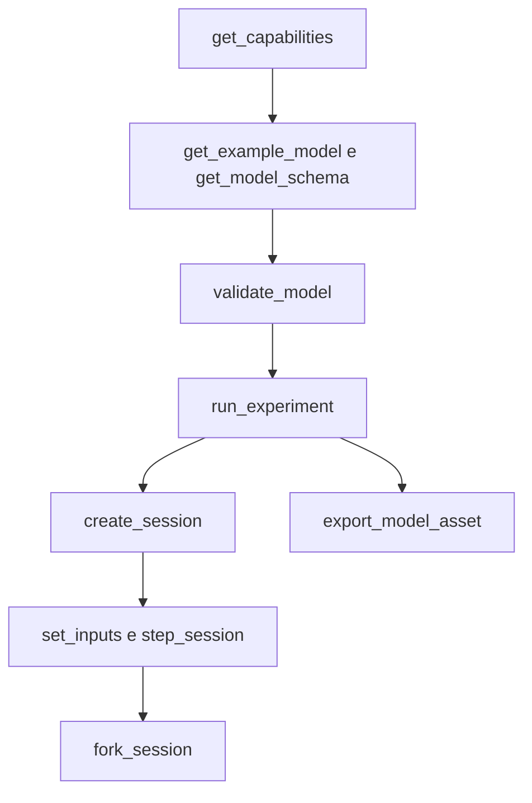

# Interfaccia agente

[English](AGENT_API.md) · [简体中文](AGENT_API.zh-CN.md) · [Français](AGENT_API.fr.md) · [Русский](AGENT_API.ru.md) · [日本語](AGENT_API.ja.md) · [한국어](AGENT_API.ko.md) · [Deutsch](AGENT_API.de.md) · [Español](AGENT_API.es.md) · **Italiano** · [Português](AGENT_API.pt-BR.md)

`Power.Core`, `Power.Agent` e MCP sono ingressi diversi a un unico nucleo fisico. L'API non è legata a una versione di GPT né a un fornitore di modelli. Leggi versione, capacità e schema, poi genera un modello. Un nome familiare non significa che quel componente sia implementato.

La [rete a gas finita](GAS_NETWORK.it.md) è disponibile attraverso JSON, CLI e MCP, con composizione del gas, restrizioni controllate, serbatoi fissi, legami termici di parete e canali di conservazione conservati negli asset portabili. La semantica esistente dei modelli lineari e del cilindro chiuso resta invariata.

Il [componente di frizione accoppiata](CLUTCH_NETWORK.it.md) è disponibile attraverso i contratti condivisi di JSON, esperimento e sessione. Include input di innesto limitati, capacità statiche e striscianti, rapporti con segno, output di fase/calore ed eventi interni transazionali. La [coppia esatta](CLUTCH_PHYSICS.it.md) autonoma resta un riferimento di verifica.

I [componenti di ingranaggio/planetario ideali](GEAR_NETWORK.it.md) partecipano al solver condiviso e ai contratti dei documenti. `ideal_gear` ha porte A/B e un rapporto con segno diverso da zero; `planetary_gear` ha porte solare/corona/portasatelliti A/B/C e un rapporto di denti corona/solare maggiore di uno. Servono velocità iniziali compatibili e vincoli permanenti indipendenti. Le capacità descrivono la politica di rango, le tolleranze del solver e gli output di reazione media.

Il [contratto dello stantuffo idraulico](HYDRAULIC_PISTON.it.md) aggiunge nodi `translational`, `linear_spring`, `hydraulic_piston`, `piston_clutch` e `force_source`. Gli agenti possono osservare spostamento, velocità, forza di pressione, energia/forza delle pastiglie, capacità della frizione e calore di smorzamento cumulativo. Una frizione a stantuffo non ha un input di innesto: comanda le sue valvole di riempimento/scarico e ispeziona il contatto delle pastiglie. `get_capabilities.hydraulic_piston` descrive le unità SI, la convenzione volume/lavoro, l'ambito del solver e il recupero dalla pressione negativa. La validazione del modello restituisce errori azionabili di unità, intervallo e connessione; i contratti di revisione di sessione, annullamento e fork indipendente si applicano invariati.

`hydraulic_spool_valve` riferisce un componente a stantuffo e posizioni esplicite di chiusura/piena apertura. La sua apertura segue il moto reale; non accetta un comando di apertura né una sovrascrittura dell'input iniziale. Flusso, perdita e apertura sono osservabili attraverso il contratto condiviso di modello/sessione. `get_capabilities.hydraulic_spool_valve` dichiara le unità di posizione/flusso, la soluzione simultanea e la fisica della forza del getto omessa. Richiedi `spool-regulated-pump` per ispezionare la regolazione meccanica della pressione; vedi [il contratto di dosatura](HYDRAULIC_SPOOL.it.md).

`gas_piston` collega un nodo traslazionale a una camera a gas mobile con area esplicita, volume/posizione di riferimento, pressione assoluta di riferimento e direzione di compressione con segno. Osserva massa del gas, energia, pressione, temperatura, volume, forza e lavoro di riferimento. Combinalo con uno stantuffo idraulico sulla stessa massa per un accumulatore; usa porte gas/legami termici espliciti per il trasporto. La validazione controlla un solo proprietario del volume e un volume nominale di gas positivo. Le capacità dichiarano il limite di intervallo di un quarto di volume; il contratto indica il limite di accuratezza dell'accoppiamento di parete. Richiedi `gas-accumulator-pump`; vedi [il contratto gas/fluido](GAS_PISTON.it.md).

`gas_fuel_injector` collega volumi di gas sorgente/ricevitore finiti e tracciati compatibili e una manovella di fasatura esplicita. Il suo input è la richiesta in kg per ciclo; osserva la richiesta agganciata, il carburante erogato per ciclo/totale e la portata media erogata. Le modifiche di input a metà finestra si applicano al ciclo osservato successivo. Contropressione o carenza possono causare una sotto-erogazione senza un errore di esecuzione; usa l'evidenza degli output e i KPI. Le capacità dichiarano i confini di fasatura, dose e ambito. Richiedi `metered-fired-cylinder`; vedi [il contratto di dosatura](FUEL_METERING.it.md). Questa è ammissione gassosa, mentre spray liquido, evaporazione e hardware carburante/ECU calibrato restano aperti.

## Avvio e configurazione del client

```sh
dotnet run --file tools/Build.cs -- build
dotnet /absolute/path/to/Power!/src/Power.Mcp/bin/Release/net10.0/Power.Mcp.dll
```

Una voce generica di client MCP. Inseriscila nella configurazione dei server del client e sostituisci il percorso:

```json
{
  "mcpServers": {
    "power": {
      "command": "dotnet",
      "args": ["/absolute/path/to/Power!/src/Power.Mcp/bin/Release/net10.0/Power.Mcp.dll"]
    }
  }
}
```

Windows usa lo stesso comando `dotnet` e un percorso assoluto alla DLL. Una connessione di produzione dovrebbe eseguire direttamente la DLL compilata, così l'output di build non si mescola al protocollo stdio. Il server non ha bisogno di Unity, di credenziali o di una connessione di rete. Il primo ripristino NuGet ha bisogno della rete. La compatibilità di trasporto e di versione viene dall'SDK MCP C# ufficiale fissato: [MCP C# SDK](https://csharp.sdk.modelcontextprotocol.io/v2/concepts/getting-started.html).

## Strumenti e risultati

Nella versione 0.33.0 dell'API agente, `get_example_model` accetta un `name` opzionale: `electrothermal` (predefinito), `sealed-cylinder`, `gas-network`, `moving-cylinder`, `crank-timed-cylinder`, `fired-cylinder`, `fired-clutch`, `fired-planetary`, `fired-converter`, `fired-hydraulic`, `fired-pump`, `fired-pump-losses`, `electric-pump`, `pressure-regulated-pump`, `battery-regulated-pump`, `piston-actuated-clutch`, `spool-regulated-pump`, `gas-accumulator-pump`, `metered-fired-cylinder`, `film-fired-cylinder`, `liquid-injected-cylinder`, `needle-actuated-cylinder`, `closure-compensated-cylinder`, `dual-clutch-transmission`, `fired-dual-clutch`, `controlled-dual-clutch`, `controlled-fired-dual-clutch`, `ravigneaux-transmission`, `fired-ravigneaux-converter`, `resolved-ravigneaux-transmission`, `fired-resolved-ravigneaux-converter`, `hydraulic-ravigneaux-transmission` o `fired-hydraulic-ravigneaux`. `get_capabilities` annuncia i livelli di fedeltà supportati, le versioni di asset leggibili, i limiti del solver e i limiti degli input. Le esportazioni usano `power.asset.v28`; gli asset v1–v23 restano leggibili. I canali di output e le loro unità sono restituiti dalla validazione del modello e dalla creazione della sessione. Superare i KPI di laboratorio non stabilisce un gruppo motopropulsore completo o calibrato.

| Strumento | Scopo |
|---|---|
| `get_capabilities` | Versione, capacità del modello, limiti di dimensione, semantica del tempo e il flusso di lavoro |
| `get_model_schema` | Il JSON Schema completo di `power.model.v1` |
| `get_example_model` | Un esempio modificabile con eventi e KPI |
| `validate_model` | Controlla il modello e l'esperimento. Restituisce l'impronta, i canali e la diagnostica, e non fa avanzare il tempo |
| `run_experiment` | Esperimento completo, due replay con dimensioni di batch diverse, KPI e provenienza. Il risultato è compatto per impostazione predefinita |
| `export_model_asset` | Valida ed esporta un `.powerasset`. Restituisce il contenuto Base64, il digest del file, la provenienza e l'impronta del modello |
| `create_session` | Crea una simulazione interattiva indipendente. Restituisce l'istantanea iniziale e i metadati dei canali |
| `read_snapshot` | Tempo corrente, revisione, hash e canali di output selezionati |
| `set_inputs` | Invia in modo atomico un frame di input al tempo corrente e fa avanzare la revisione della sessione |
| `step_session` | Fa avanzare in modo atomico un numero richiesto di nanosecondi. L'annullamento è supportato. La revisione avanza |
| `fork_session` | Copia lo stato fisico corrente in un nuovo ramo alla revisione 0 |
| `close_session` | Rilascia una sessione |

Ogni strumento ha uno schema di input e uno schema di output. Successo ed errori di dominio restituiscono entrambi `structuredContent` e un risultato testuale compatibile. L'`isError` di MCP corrisponde a `ok=false`. Vedi i [risultati strutturati degli strumenti nell'SDK](https://csharp.sdk.modelcontextprotocol.io/v2/concepts/tools/tools.html).

```json
{"schema":"power.agent.v1","ok":true,"data":{"revision":"2","time_ns":"1000000000","state_hash":"...","values":[]}}
```

```json
{"schema":"power.agent.v1","ok":false,"error":{"code":"revision_conflict","message":"Read the snapshot, then use its current revision.","retryable":true,"current_revision":"2"}}
```

Vedi lo [schema del modello](../schemas/power.model.v1.schema.json) e lo [schema della risposta](../schemas/power.agent.v1.schema.json). Lo schema del modello controlla la struttura. Il compilatore poi controlla dimensioni, topologia, valori positivi, valori finiti e il sistema numerico. La validazione dell'esperimento controlla l'allineamento dei tick, l'ordine degli eventi, i canali e i limiti dei KPI.

## Sequenza delle operazioni



1. Chiama `get_capabilities` e conferma che i componenti fisici che ti servono siano supportati.
2. Ottieni un esempio e lo schema, poi costruisci un oggetto `document`. I parametri devono portare le unità.
3. `validate_model({"document": ...})`. Ripara il modello da `error.object_id`, `error.field` ed `error.code`.
4. `run_experiment({"document": ...})`. Controlla `data.passed`, `checks`, `replay` e `model.calibration`. `ok=true` significa solo che l'esperimento è terminato. I KPI possono ancora fallire.
5. `create_session` con lo stesso documento. Conserva `session_id`, la `revision` iniziale e la mappa dei canali.
6. Per esempio, `set_inputs({"session_id":"...","expected_revision":"0","values":[{"channel":"100","value":24}]})`, poi leggi la revisione che torna.
7. `step_session({"session_id":"...","expected_revision":"1","delta_ns":"1000000000"})` restituisce l'istantanea un secondo dopo.
8. `fork_session({"session_id":"...","expected_revision":"2"})`. Frena il figlio a 4 V e tieni il genitore come controllo.
9. Dopo il confronto, `close_session` su ciascuno con la propria revisione più recente.

Per ispezionare il modello in Unity, chiama `export_model_asset({"document": ..., "name": "My laboratory"})`. Decodifica in Base64 `data.content`, confronta `data.asset_sha256` con l'intero file, salvalo come `.powerasset` sotto `Assets` di Unity e aprilo con **Open in Studio** nell'Inspector dell'asset. Lo strumento restituisce solo il contenuto. Non scrive un file locale. Un'esportazione riuscita significa che i dati sono validi. KPI e calibrazione sono controlli separati. Formato e limiti stanno negli [asset dei modelli](ASSET_FORMAT.it.md).

Le revisioni partono da 0. Ogni commit di input riuscito e ogni passo riuscito aggiunge 1. Un'operazione obsoleta, non valida o annullata non aggiunge una revisione. Un fork lascia invariata la revisione del genitore. Dopo qualsiasi interruzione di trasporto, leggi l'istantanea e usa quella revisione. Non reinviare una scrittura che porta ancora la revisione vecchia.

`time_ns`, `revision` e gli ID dei canali in un'istantanea di sessione sono stringhe, così restano esatti oltre il limite intero di JavaScript. Il tempo di esperimento in un documento di modello è al massimo un'ora. I canali di input del modello oggi sono interi. Scegli ID non più grandi di `2^53-1` se un altro client JSON deve mantenerli esatti. Gli ID di namespace alto negli output restano stringhe, invariati.

`channels` su `read_snapshot` è un array di stringhe di ID di output. Omettilo per restituire ogni output. I canali di input e i campi duplicati sono rifiutati. `include_samples=true` è ciò che fa restituire a un esperimento ogni confine di campionamento.

## Errori e riparazione

| Errore | Passo successivo |
|---|---|
| `model_unit` / `model_connection` / `model_range` | Ripara l'unità, il riferimento o il parametro su quell'oggetto e quel campo |
| `invalid_argument` / `invalid_json` | Correggi il campo, l'ordine degli eventi, il tempo o la struttura del documento |
| `unknown_channel` / `invalid_input` | Scegli un input dalla tabella dei canali e rimuovi duplicati e valori non finiti |
| `invalid_time_step` | Usa un numero intero positivo di tick, al massimo un milione di tick per chiamata |
| `numerical_failure` | Controlla la scala dei parametri, gli input e il passo. Lo stato corrente non è stato modificato |
| `revision_conflict` | Leggi l'istantanea più recente, poi decidi da quello stato |
| `cancelled` | L'intero batch ha fatto rollback. Riprova con un batch più piccolo |
| `session_capacity` | Chiudi le sessioni che non ti servono più |
| `unknown_session` | Il processo è ripartito oppure la sessione è stata chiusa. Creala di nuovo ed esegui il replay |

Una sessione è un oggetto nel processo. Non è persistita e non si aggancia a una scena Unity in esecuzione. L'interfaccia MCP oggi esegue esperimenti senza interfaccia sullo stesso nucleo. Una connessione Unity successiva deve comunque mantenere i contratti di revisione, tempo e atomicità.

## Aggiungere un componente

Scrivi le equazioni e l'ambito, definisci porte e parametri con le unità, implementali nel nucleo e ricava l'evidenza da una soluzione analitica, dalla conservazione, dalla convergenza del passo e dai test di fallimento. Poi aggiungi schema e scoperta delle capacità, fornisci un esperimento riproducibile in replay e collega una vista Unity. Provenienza misurata e incertezza si registrano per conto loro. Un test superato non significa che il modello sia calibrato.

## Flusso della rete gas

Richiedi `gas-network`, validalo, poi esegui l'esperimento ed esporta il suo asset usando gli strumenti esistenti. `power.model.v1` guadagna definizioni additive di nodi/componenti gas; i client dovrebbero scoprirle dallo schema e dalle capacità. Nessun nome di strumento cambia. I volumi di gas consumano due stati scalari ciascuno, e i volumi collegati devono condividere R e gamma.

Gli input di `gas_orifice` usano valori `fraction` in [0, 1]. Un canale di input mancante o zero mantiene fisso l'`initial_input` esplicito. Validazione ed esportazione rifiutano i valori programmati fuori intervallo prima che qualsiasi esperimento venga eseguito. Il rifiuto interattivo conserva sia lo stato sia la revisione. Compilazione, esecuzione riuscita, successo dei KPI e calibrazione restano distinti: l'esempio è sintetico e `unverified`.

Le operazioni di sessione solo gas usano gli stessi tempi in nanosecondi, i controlli di revisione, l'annullamento, le istantanee filtrate e i fork indipendenti. Le sessioni partono dagli input iniziali dei componenti; `create_session` non esegue la programmazione degli eventi dell'esperimento. Usa `run_experiment` o la riproduzione portabile per quella programmazione. La validazione statica non può garantire che uno stato futuro resti risolvibile numericamente: su `numerical_failure`, riduci `step_ns` e ispeziona area di flusso, volume, conduttanza e condizioni iniziali prima di ricreare la sessione.

## Flusso del cilindro mobile

`get_example_model({"name":"moving-cylinder"})` restituisce un esperimento di motoring non calibrato con due restrizioni controllate nel tempo, lavoro di pressione all'albero a gomiti e trasferimento di parete. I nodi gas senza `storage` devono collegarsi a esattamente un `gas_cylinder`, i cui parametri forniscono la geometria. Il compilatore valida la proprietà e ricava massa/energia iniziali dalla pressione/temperatura del nodo gas e dalla geometria iniziale della manovella.

Le capacità annunciano `moving_cylinder_gas_exchange`, il limite di manovella di 0.25 rad e l'ambito di integrazione suddivisa. Gli stati del gas restano canali sul nodo gas; volume, spostamento e coppia sono canali sul componente cilindro a gas. I contratti di esperimento, esportazione, sessione, revisione e fallimento sono invariati. Vedi i [cilindri mobili](MOVING_CYLINDER.it.md). Le restrizioni programmate nel tempo non stabiliscono la fasatura delle valvole sull'angolo di manovella né la combustione.

## Flusso delle valvole fasate sulla manovella

`get_example_model({"name":"crank-timed-cylinder"})` restituisce un esperimento di motoring a 720 gradi con velocità variabile, profili di ammissione/scarico e calore di parete. `valve_timing` su un `gas_orifice` richiede un `crank_node` rotazionale e `cycle_angle`, `open_angle` e `duration_angle` dotati di unità. L'oggetto delle capacità annuncia cicli, profilo, limiti e recupero. Vedi [il contratto di fasatura](VALVE_TIMING.it.md).

I canali di input fasati rappresentano `peak_opening` in [0, 1]; l'`effective_opening` osservabile è ricavato dall'angolo reale di manovella. Usa il campo KPI `opening` per controllarlo. Una manovella ferma può restare aperta; il moto inverso ripercorre lo stesso profilo. La fase è esplicita, indipendente dalla fase geometrica del cilindro. Una modifica programmata del picco scala il lobo; non sostituisce la fasatura di manovella.

La validazione controlla topologia e parametri ma non garantisce la risoluzione a runtime. Su `numerical_failure`, riduci `step_ns` così che la corsa angolare e la corsa di velocità agli estremi restino entro `min(0.25 rad, duration_angle/8)`, poi ricrea la sessione. L'intero batch fallito conserva input, stato e revisione. L'asset v11 conserva il profilo e la compatibilità v1–v10. La nuova fedeltà è `crank_timed_gas_exchange`; esecuzione riuscita, KPI superati e calibrazione restano distinti.

## Flusso della combustione premiscelata

`get_example_model({"name":"fired-cylinder"})` restituisce un cilindro acceso premiscelato che aziona un carico esterno. La capacità `combustion` dichiara la prescrizione di Wiebe, le classi carburante/aria/prodotti, l'intervallo di input, il comportamento della storia in avanti e i limiti numerici. I nodi gas specificano `gas.premixed`, e le loro restrizioni di serbatoio specificano `reservoir_fractions` esplicite. Il compilatore rifiuta frazioni mancanti, miscele collegate incompatibili e più componenti di combustione su una camera.

`premixed_combustion` collega un `node_a` rotazionale a un `node_b` di gas premiscelato, con angoli espliciti di ciclo/inizio/durata, esponente di forma e coefficiente di combustione. Il suo canale di input opzionale scala l'hazard di combustione attraverso `burn_multiplier` in [0,1]. Zero disabilita la combustione ma non ferma il carburante che arriva a un'ammissione aperta. Gli angoli in avanti oltre la frontiera registrata consumano carburante; arresto, inversione e ripercorrenza non possono ripetere il rilascio di calore.

Scopri le masse dei costituenti, l'energia chimica, il carburante cumulativo bruciato, il calore rilasciato e `burn_frontier_angle` dalla tabella dei canali. I residui globali di carburante/aria fresca si aggiungono alla massa e all'energia totali. `reservoir_enthalpy` include l'energia chimica trasportata per i gas premiscelati, e `net_fuel_energy_in` espone quella parte separatamente. L'energia interna del gas resta termica. Le fedeltà del report sono `premixed_gas_transport` o `premixed_wiebe_combustion`; entrambe restano `unverified`.

Su un fallimento di risoluzione della combustione, riduci `step_ns` e ricrea la sessione. La combustione abilitata richiede che la corsa di manovella e la corsa di velocità agli estremi non superino `min(0.25 rad, burn duration/32)`; il calore per tick è limitato al 25% dell'energia termica precedente alla combustione. I contratti di rollback dell'intera chiamata e di revisione restano invariati. Un modello valido può ancora fallire un limite di runtime; un'esecuzione riuscita può ancora fallire i KPI. Vedi [PREMIXED_COMBUSTION.it.md](PREMIXED_COMBUSTION.it.md) per equazioni e limiti.

## Flusso della frizione

`get_example_model({"name":"fired-clutch"})` restituisce un motore acceso, un carico separato, la frizione e un pozzo di calore, con eventi di innesto/rilascio a tick esatti. Le capacità `clutch` dichiarano i limiti di input, i budget del solver, i codici di modo e la semantica della storia degli output. Definisci `parameters.static_capacity` e `sliding_capacity` in Nm, più un `ratio` con segno diverso da zero. Il compilatore impone `static >= sliding >= 0`, estremi rotazionali e un pozzo di perdita termica. I freni a terra usano `node_b` omesso/zero e rapporto uno.

L'input `engagement` sta in `[0,1]`; zero disinnesta. Scopri lo slittamento relativo corrente, l'ultima fase accettata, la coppia/potenza termica media dell'ultimo tick e il calore di attrito cumulativo dalla tabella dei canali. Le fasi sono 0 disinnestata, 1 bloccata, 2 slittamento positivo e 3 slittamento negativo. Aggiornare l'innesto non riscrive gli output medi né la fase del tick precedente. La fedeltà `hybrid_clutch_powertrain` identifica i modelli che contengono questo componente; non implica una trasmissione completa né un veicolo calibrato.

Usa `run_experiment` per valutare l'evidenza di KPI e di replay, oppure gli strumenti di sessione per variare l'innesto conservando i controlli di revisione e i rami indipendenti. Su un fallimento numerico, riduci `step_ns` e ispeziona la scala di inerzia/rapporto, i vincoli ridondanti e le programmazioni di capacità. La chiamata fallita o annullata non committa input, fasi, calore né stato fisico. Il distacco sotto carichi variabili usa la domanda media sull'intervallo; il raffinamento del passo è necessario vicino alle transizioni. Vedi [CLUTCH_NETWORK.it.md](CLUTCH_NETWORK.it.md).

## Flusso della trasmissione ideale

Richiedi `fired-planetary` per ottenere un motore sintetico, un freno della corona, una frizione solare/corona, un gruppo planetario e una riduzione finale. Il passaggio su/giù programmato usa la stessa semantica a tick esatti degli altri esperimenti, con 84 confini di replay corrispondenti. `node_c` è il portasatelliti; gli ingranaggi accettano solo le loro porte rotazionali e `parameters.ratio`.

`slip_speed` e `constraint_error` espongono la velocità corrente e i residui di fase. `torque`, `torque_at_b` e `torque_at_c` solo planetario sono reazioni medie sui rotori corrispondenti nell'ultimo tick completo. Partono da zero e non sono riscritti dalle modifiche di input al confine. I fallimenti di velocità iniziale restituiscono `model_connection` con campo `initial_speed`; le righe di vincolo dipendenti restituiscono `model_solver` con campo `gear.constraints`. Correggi la topologia o le condizioni iniziali invece di riprovare dati invariati.

L'asset v11 conserva tutti i lettori precedenti, compresa una fixture autentica di frizione accesa v7. Questo modello stabilisce un percorso di trasmissione sintetico, non un DCT/AT completo, un azionamento idraulico, un comportamento TCU o una calibrazione misurata. L'evidenza Unity reale resta separata.

## Flusso del convertitore

Richiedi `fired-converter` per un motore sintetico, un percorso fluido mappato, un blocco separato, un cambio planetario e un pozzo termico. Le capacità annunciano tutte e quattro le mappe con segno richieste, i limiti di punti/componenti, la convenzione dell'elemento di riferimento, i budget di iterazione non lineare, la semantica osservabile e il recupero a runtime. La fedeltà è `quasisteady_converter_powertrain`; superare gli 87 confini di replay stabilisce la coerenza numerica, non una prestazione di trasmissione misurata.

`torque_converter` richiede le porte pompa/turbina `node_a`/`node_b`, opzionalmente `heat_node`, e quattro array di mappe espliciti sotto `parameters`. Ogni punto ha rapporti adimensionali di velocità e di coppia e un coefficiente in `nm_s2_rad2`. Nessuna mappa, quadrante inverso, canale di input o porta statore-rotore viene inferita. La compilazione controlla la passività dell'interpolazione e la continuità delle mappe, riportando `converter.<map>` o `converter.counter_rotation` con l'ID dell'oggetto.

Scopri le coppie medie di pompa/turbina/statore, la potenza termica del fluido, il calore cumulativo del fluido, il rapporto di velocità corrente con segno e il codice del driver dai canali. Una `clutch` in parallelo fornisce l'innesto di blocco. I contratti di revisione di sessione, annullamento, indipendenza dei rami e rollback completo coprono anche le storie del convertitore. Su `numerical_failure`, riduci `step_ns` e ispeziona le pendenze delle mappe, le scale di inerzia/velocità e i vincoli della frizione. Vedi [le equazioni, i limiti e l'evidenza](CONVERTER_NETWORK.it.md). Le esportazioni usano l'asset v11; le fixture autentiche precedenti conservano la compatibilità v1–v10. Il controllo idraulico automatico e la validazione reale di Unity Editor/Player restano lavoro incompiuto separato.

## Flusso idraulico

Richiedi `fired-hydraulic` per camere di pressione controllate da valvole che azionano le frizioni di cambio e di blocco. La capacità `hydraulics` espone la convenzione di pressione manometrica, i modelli di accumulo e di flusso, le unità, i limiti di iterazione, la tolleranza di pressione, l'ambito degli attuatori e il recupero. La fedeltà è `compliant_hydraulic_powertrain`; la calibrazione resta `unverified`.

Un nodo idraulico richiede una cedevolezza `storage` positiva in `m3_pa` e una pressione manometrica iniziale non negativa. `hydraulic_resistance` e `hydraulic_orifice` richiedono coefficienti di flusso espliciti e l'apertura della valvola; un orifizio ha inoltre bisogno di una pressione di transizione positiva. Gli estremi di serbatoio richiedono una `reservoir_pressure` esplicita. Un canale di input mancante o zero fissa l'apertura fornita. Il compilatore non inferisce mai proprietà del fluido, trafilamento, pressione del serbatoio o una mappa OEM.

`hydraulic_clutch` ha porte rotazionali e geometria sotto `parameters`, compreso il suo `pressure_node` idraulico. Non ha un input di innesto. Scopri pressione, volume di riferimento immagazzinato, lavoro idraulico al confine, residuo di inventario, calore della restrizione, forza di serraggio e capacità di attrito correnti accanto ai canali di storia della frizione esistenti. Le modifiche dell'input di valvola conservano la pressione immagazzinata e le medie dell'ultimo tick finché un avanzamento accettato non le fa progredire.

I contratti completi di stato, revisione, annullamento e rami coprono la pressione idraulica e i registri. Su un fallimento numerico, riduci `step_ns` e ispeziona cedevolezza, coefficienti, pressioni manometriche e geometria dell'attuatore. Una pressione finale negativa rifiuta l'intero batch; non viene bloccata in silenzio. Vedi [HYDRAULIC_NETWORK.it.md](HYDRAULIC_NETWORK.it.md). L'asset v11 conserva i confini di pressione, le leggi di flusso e la geometria degli attuatori; tutti i lettori v1–v10 restano. Mappe misurate di perdite/controllo, dinamica misurata di valvole/accumulatori, controllo ECU/TCU completo e accettazione Unity reale restano aperti.

## Flusso di alimentazione della pompa

Richiedi `fired-pump` per una pompa comandata dalla manovella, una linea cedevole, lo scarico e una trasmissione azionata dalla pressione. Le capacità espongono `hydraulic_pump`, le unità di cilindrata, la convenzione di ingresso, i limiti del solver congiunto e la semantica del lavoro con segno. Il `hydraulic_work` della pompa è il trasferimento interno da albero a fluido; il `hydraulic_work` globale resta il lavoro esterno del serbatoio. Questo esempio ha lavoro idraulico esterno nullo e pressione immagazzinata iniziale esplicita.

`hydraulic_pump` richiede porte di albero/uscita, `parameters.inlet_node` esplicito, `displacement` positivo in `m3_rad` e una pressione di serbatoio solo per l'ingresso zero. Lo scarico richiede conduttanza e pressione di apertura, senza canale di input. Porte mancanti o di dominio sbagliato, dimensioni e parametri non pertinenti producono errori di validazione azionabili. L'asset v11 conserva entrambe le definizioni. Revisioni, annullamento, fork, rollback completo e le distinzioni KPI/calibrazione restano invariati. Vedi [HYDRAULIC_PUMP.it.md](HYDRAULIC_PUMP.it.md).

## Flusso del gruppo pompa

Richiedi `fired-pump-losses`, `electric-pump`, `pressure-regulated-pump` o `battery-regulated-pump`. La capacità `pump_assembly` dà le equazioni di portata netta/reazione, le unità delle perdite, la composizione dei componenti e il confine di alimentazione elettrica. I modelli contengono record ordinari di pompa, resistenza e albero; l'esempio elettrico aggiunge il motore RL esistente. Non serve un nuovo tipo di componente, schema o versione di asset. I client del nucleo possono usare `HydraulicPumpAssembly.CreateComponents` con i propri ID stabili per produrre le stesse definizioni di grafo.

Il trafilamento è una resistenza esplicita da uscita a ingresso con coefficiente in `m3_s_pa`; l'attrito dell'albero è un albero a massa, a rigidezza nulla, con smorzamento in `nm_s_rad`. Entrambi richiedono valori forniti e un instradamento esplicito del calore. Una pompa elettrica accetta la tensione del motore attraverso un input `v`, con forza controelettromotrice, corrente e calore nel rame nella soluzione condivisa. Non inferisce una batteria, un'efficienza, una viscosità, un regolatore o una calibrazione. Scopri i canali invece di interpretare il flusso del ramo di pompa ideale come erogazione netta del gruppo. Revisioni, annullamento, fork e rollback completo del batch esistenti si applicano all'intera composizione.

## Flusso di retroazione della pressione

Richiedi `pressure-regulated-pump`. Le capacità annunciano il componente `pressure_controller`, i guadagni dimensionali, i requisiti di sensore/bersaglio, il campionamento intero, il clamping e la semantica transazionale. Valida, esegui ed esporta con gli strumenti esistenti. L'asset v12 conserva la definizione completa del regolatore e tutti i lettori precedenti restano supportati.

L'input `105` dell'esempio cambia il setpoint di pressione in Pa SI. Il canale di tensione `100` del motore è posseduto dal regolatore ed è assente dai canali scrivibili. Le scritture dirette restituiscono `controlled_input` con l'indicazione di scrivere `pressure_setpoint`; il rifiuto non cambia né lo stato né la revisione. I bersagli di pressione negativi sono rifiutati. La validazione statica rileva proprietari in conflitto, domini/unità sbagliati e periodi di campionamento disallineati.

Leggi `sampled_pressure`, `pressure_error`, `integral_voltage` e `command_voltage` attraverso gli ID di output individuabili. Sono lo stato dell'ultimo campione e il comando tenuto. I timestamp dell'istantanea identificano la fase dell'orologio. Le modifiche di input non fanno avanzare la storia del controllo; il campione successivo in scadenza la aggiorna a un tick fisico. I fork includono la memoria integrale e la fase dell'orologio. L'annullamento o un fallimento aritmetico/del solver successivo non committa alcuna parte del batch. Il recupero dall'overflow richiede di ispezionare guadagni, bersagli e scale dell'integrale, invece di riprovare alla cieca input identici.

Esecuzione riuscita e replay esatto possono accompagnare KPI di inseguimento falliti quando l'attuatore satura. Controlla `passed` e i limiti di errore separatamente da `ok`. Il sensore ideale e la sorgente di tensione dell'esempio sono componenti di ricerca; non stabiliscono una batteria, una ECU/TCU completa, controlli calibrati o l'accettazione Unity.

## Flusso di alimentazione dalla batteria

Richiedi `battery-regulated-pump`. Le capacità espongono carica finita, equazioni OCV/RC, regole di carico e di duty, proprietà del controllo e recupero. Lo `storage` del nodo batteria usa `c` o `ah`, `initial` è lo SOC in `fraction` e `position` è la tensione di polarizzazione in `v`. Il record della batteria richiede tutti e cinque i parametri elettrici. Si validano unità, limiti di capacità/stato, porte di sorgente, pozzi di calore, OCV crescente e periodi del regolatore.

`battery_motor` richiede una porta rotazionale A, una porta batteria B e un input di duty in [-1,1]. `resistive_load` ha una porta batteria A, una resistenza e un'apertura in [0,1]. Il canale `106` dell'esempio cambia il carico accessorio; `105` cambia il setpoint di pressione in Pa SI. Il duty `100` è posseduto da `pressure_duty_controller` e non può essere scritto direttamente. I suoi guadagni usano `fraction_pa` e `fraction_pa_s`; i limiti di output sono adimensionali.

Leggi `state_of_charge`, `charge`, `battery_current`, `terminal_voltage`, `polarization_voltage`, l'energia immagazzinata e il calore della batteria accanto a `integral_duty` e `command_duty`. I canali di tensione/corrente/potenza di carico sono osservabili algebrici istantanei, quindi modifiche valide di duty/carico possono alterarli senza cambiare gli stati immagazzinati. Il lavoro della batteria è interno; il `source_work` globale include solo i confini di potenza esterna espliciti. Le violazioni di SOC/tensione rifiutano l'intero batch. Ispeziona carica iniziale, capacità, duty, carichi e lunghezza del batch prima di riprovare. Non c'è un bloccaggio silenzioso dello SOC.

L'asset v22 conserva tutti i parametri di alimentazione/controllo con lettori/fixture autentici precedenti. Annullamento e fallimento successivo conservano carica, memoria RC/di controllo, input e revisione. Fork indipendenti confrontano strategie di accessori/duty a partire dalla stessa storia fisica. Tutti i parametri restano `unverified`; un convertitore di duty mediato ideale non è un BMS di batteria, un anello PWM/di corrente, un impianto elettrico completo del veicolo o una calibrazione.

## Flusso del film liquido

Richiedi `film-fired-cylinder`. La capacità `fuel_film` dichiara porte gas/parete finite, il riferimento di energia di fase, le unità, l'accuratezza della suddivisione e l'ambito. Fornisci inventario liquido iniziale esplicito, temperatura, calore specifico, temperatura di saturazione, energia interna latente e conduttanza. Valida e scopri gli ID di output prima di eseguire o esportare il modello. I film non espongono un canale di input scrivibile.

Leggi `mass` restante, `internal_energy` con segno, `chemical_energy`, `evaporated_fuel_mass`, `mass_flow` medio dell'ultimo tick, `film_wall_heat` cumulativo e `heat_flow` istantaneo accanto al carburante del ricevitore e al calore di reazione. I film asciutti riportano la temperatura di saturazione dichiarata e un flusso di calore nullo. La disponibilità reale del vapore governa la reazione; una definizione di film valida non implica evaporazione né KPI di rilascio di calore superati.

L'asset v18 conserva le quantità di fase e i lettori precedenti. Controlli di revisione, annullamento, fork indipendenti e rollback per fallimento tardivo includono tutte le storie liquide, termiche, dei costituenti e compensate. Unità/porte sbagliate, liquido iniziale surriscaldato e conteggi di stato in eccesso restituiscono errori strutturati. Ispeziona l'oggetto/campo riportato e il budget di calore finito prima di riprovare un modello fallito. Il [contratto del film](FUEL_FILM.it.md) registra le equazioni e il limite di accuratezza. La bagnatura iniziale non stabilisce l'iniezione liquida, proprietà del carburante calibrate, un controllo motore completo o l'accettazione Unity reale.

## Flusso di iniezione liquida finita

Richiedi `liquid-injected-cylinder`. La capacità `liquid_fuel_injector` dichiara la sorgente finita e cedevole, l'input di ciclo in `kg`, le unità di densità/cedevolezza, il registro energetico e il confine del ricevitore. Fornisci tutte le quantità del binario, la geometria dell'ugello e un riferimento esistente di film/manovella. Valida prima e scopri ID/unità di output.

L'input `104` dell'esempio richiede kg per ciclo. Le modifiche si agganciano a una finestra in avanti osservata successiva; l'erogazione corrente può restare limitata dalla pressione della sorgente. Leggi `mass`, `pressure`, `internal_energy` immagazzinata, energia chimica e volume del binario accanto a `requested_fuel_dose`, `delivered_fuel_dose`, `total_fuel_delivered` e `mass_flow` medio dell'ultimo tick. Massa/temperatura/evaporazione del film e il calore di reazione separato identificano il ritardo tra l'accettazione di una dose e la combustione reale del vapore.

Il `source_work` del componente è il lavoro di pressione del binario immagazzinato rilasciato, `hydraulic_work` è il lavoro di pressione del ricevitore esportato e `fluid_heat` è la dissipazione dell'ugello instradata alla parete del film. Le loro identità sono distinte dal lavoro di sorgente esterno globale. Il ricevitore a volume liquido trascurabile esporta in modo esplicito il lavoro di spostamento; non aggiunge lavoro nascosto all'albero a gomiti né modella la geometria dello spray.

L'asset v19 conserva sorgente, ugello e fasatura completi con i lettori v1-v18. Revisioni, annullamento, fork e fallimento tardivo/speculativo includono ogni storia di binario/quota/calore. Unità sbagliate, volume cedevole impossibile, liquido surriscaldato e proprietà non corrispondenti di film/manovella producono diagnostica strutturata. Ispeziona l'oggetto/campo fallito e i confini di pressione/dose prima di riprovare. L'esecuzione riuscita dello strumento non implica l'erogazione completa, KPI superati o hardware calibrato. Vedi [LIQUID_FUEL_INJECTION.it.md](LIQUID_FUEL_INJECTION.it.md).

## Flusso dell'ago fisico

Richiedi `needle-actuated-cylinder`. Le capacità dichiarano le unità della pendenza magnetica, l'energia di flusso, l'apertura reale, il controllo campionato e i limiti di ricerca. Il comando in kg `104` dell'iniettore è scrivibile; la tensione di bobina `107` posseduta dal driver non lo è. Le scritture rifiutate restituiscono `controlled_input` con il nome/canale di comando corretto e conservano stato/revisione. Aggiorna la massa di carburante richiesta e avanza tick fisici esatti.

Leggi spostamento/velocità reali dell'ago e apertura dell'iniettore accanto a corrente di bobina, energia magnetica, calore nel rame, lavoro elettrico, tensione tenuta e bersaglio/erogazione dell'ultimo campione. Il fluido può continuare dopo la rimozione della tensione, la chiusura della finestra o il raggiungimento dell'erogazione bersaglio. Liquido restante, carburante gassoso, carburante incombusto/al confine e reazione restano osservabili separatamente. Una richiesta valida o uno strumento riuscito non stabilisce l'erogazione esatta della dose né un controllo calibrato.

L'asset v20 conserva le tabelle magnetiche/di corsa/ago/driver e i lettori v1-v19. I periodi di campionamento devono allinearsi ai tick; la tensione ha un solo proprietario; i riferimenti di ago, bobina e manovella devono corrispondere. Per gli errori del solver ispeziona `L(x)` positivo, R/L/gradiente, corsa e passo; raffina gli intervalli fisici/di controllo prima di affermare l'accuratezza dinamica. Annullamento, fork e batch rifiutati/speculativi includono tutte le storie di flusso, termiche, campionate/tenute e di fase. Vedi [NEEDLE_ACTUATION.it.md](NEEDLE_ACTUATION.it.md).

## Flusso dell'ago con compensazione di chiusura

Richiedi `closure-compensated-cylinder`. Il suo driver abilita un orizzonte finito allineato `closure_prediction_ns`. Le capacità danno il limite di 4096 tick, l'ipotesi di input tenuti e la ricerca di taglio limitata. Le richieste in kg della sorgente restano scrivibili; la tensione resta posseduta dal driver. Scopri i canali di massa/conteggio predetti, di aggancio del taglio e di tick in sospeso accanto a posizione reale dell'ago, erogazione e tensione tenuta.

La predizione è un replay separato dell'impianto a stato completo. Tiene gli altri comandi e non conosce gli eventi di input esterni futuri, quindi ispeziona l'erogazione reale dopo la chiusura e il raffinamento di orizzonte/passo invece di trattare la previsione come carburante misurato. Una predizione fallita o annullata non committa alcuna parte del batch reale. Overflow dell'orologio, orizzonte non valido o candidati di taglio non monotoni richiedono di rivedere le ipotesi di fasatura/modello; le previsioni parziali non sono accettate in silenzio.

L'asset v21 scrive l'orizzonte e conserva i lettori precedenti. Revisioni, fork indipendenti e rollback dell'intero batch includono l'aggancio della predizione e il conto alla rovescia. I client del nucleo possono emettere `PredictNeedleClosure` in sola lettura; le istantanee MCP espongono l'ultima stima del candidato selezionato campionata. Ambito ed evidenza stanno in [CLOSURE_PREDICTION.it.md](CLOSURE_PREDICTION.it.md).

## Flusso del percorso di potenza a doppia frizione

Richiedi `dual-clutch-transmission` o `fired-dual-clutch`. Le capacità descrivono il grafo ordinario a sette avanti/retromarcia, due percorsi di ingresso, tre rami di uscita e i limiti di ricerca. Valida e scopri ogni reazione degli ingranaggi, slittamento/modo/calore delle frizioni e velocità dei rotori prima di cambiare i comandi di selettore/trazione.

Gli esempi usano i canali di trazione `500`/`501` e i canali di selettore `600`-`607` per le marce avanti 1-7 e la retromarcia. I comandi sono frazioni; i rapporti restano vincoli permanenti. Preseleziona un percorso scarico rilasciando il suo selettore precedente e innestando il bersaglio, poi coordina separatamente il passaggio della frizione di trazione. `DualClutchGraph.SelectPath` del nucleo produce l'insieme atomico di comandi dei selettori di quel percorso. Non implementa rilevamento TCU, interblocchi o dinamica degli attuatori.

Le istantanee espongono tutti i mozzi liberi/selezionati, le velocità di ingresso/uscita, il calore di sincronizzazione e di trazione, l'errore di fase degli ingranaggi e l'evidenza globale di sorgente/energia/carburante. Combinazioni non sicure possono vincolare o frenare la trasmissione fisica; una scrittura di input riuscita non stabilisce un cambio valido. Controlli di revisione, annullamento, fork indipendenti e fallimento tardivo conservano ogni stato/storia. Il formato portabile esistente e i lettori precedenti sono conservati. Vedi [DUAL_CLUTCH_TRANSMISSION.it.md](DUAL_CLUTCH_TRANSMISSION.it.md).

## Flusso del controllo DCT campionato

Richiedi `controlled-dual-clutch` o `controlled-fired-dual-clutch`. Scrivi una `requested_gear` intera sul canale `700`: 1-7 avanti, -1 retromarcia, 0 folle. Il regolatore possiede la trazione `500`/`501` e i selettori `600`-`607`; le scritture dirette restituiscono `controlled_input` con il canale corretto della marcia richiesta. Le marce frazionarie non sono valide e non alterano stato/revisione.

Leggi la marcia reale confermata, le selezioni comandate, la fase, lo slittamento del selettore bersaglio e il guasto. La marcia richiesta non implica un cambio completato. La macchina a stati preseleziona i percorsi scarichi, conferma il blocco fisico, usa un passaggio graduale a coppia interrotta ed espone i guasti di timeout/direzione/blocco persistente. Il folle interrompe su un campione in scadenza; un altro bersaglio può recuperare un guasto. Uno slittamento transitorio può riportare una marcia reale non confermata mentre il regolatore ne monitora la durata.

Il limite esplicito di stato riportato è 128, con 32 nodi/64 componenti invariati. La composizione reale accesa/regolatore e i controlli vicino al limite e oltre il limite sono verificati; i controlli Standard girano ancora su .NET 10 e non sono evidenza Unity. L'asset v22 conserva percorsi immutabili e stato temporizzato con i lettori precedenti. Annullamento, fork, fallimento tardivo e storia delle coordinate compensate restano transazioni dell'intero batch. Miscelazione completa della coppia ECU, attuatori e calibrazione restano requisiti separati. Vedi [DCT_CONTROL.it.md](DCT_CONTROL.it.md).

## Percorsi planetari composti

`double_pinion_planetary_gear` richiede porte solare/corona/portasatelliti A/B/C e un rapporto `k > 1`. Il suo vincolo è `sun - k ring + (k-1) carrier = 0`. Il `planetary_gear` esistente conserva il segno a pignone singolo. Entrambi espongono residui di velocità/fase e tutte e tre le coppie di reazione. Velocità iniziali incompatibili, domini sbagliati, righe ridondanti e portasatelliti incompleti restituiscono errori di compilazione azionabili.

Richiedi `ravigneaux-transmission` o `fired-ravigneaux-converter` per programmazioni di ricerca esplicite a cinque elementi, integrazione convertitore/blocco e replay fisico completo. Gli input di innesto sono frazioni; un comando riuscito non dimostra una gamma bloccata. Nessun regolatore AT possiede questi input prescritti. L'asset v23 conserva la topologia e legge v1-v22. Vedi [RAVIGNEAUX_TRANSMISSION.it.md](RAVIGNEAUX_TRANSMISSION.it.md).

## Ingranamenti relativi al portasatelliti e dinamica interna dei satelliti

`carrier_gear` richiede porte rotazionali A/B/C distinte, un rapporto con segno finito e diverso da zero e velocità iniziali compatibili. Il vincolo è `A - ratio B + (ratio-1) C = 0`; sono supportati rapporti esterni negativi e interni positivi, compreso uno. C è un portasatelliti mobile reale con la propria coppia di reazione, non una massa implicita. I canali espongono tutte e tre le coppie medie e i residui di velocità/fase. Rapporti nulli, portasatelliti mancanti, domini sbagliati e vincoli dipendenti restituiscono errori di compilazione tipizzati.

Richiedi `resolved-ravigneaux-transmission` o `fired-resolved-ravigneaux-converter`. Entrambi conservano quattro ingranamenti fisici, due stati assoluti di rotazione dei satelliti e l'inerzia orbitale dichiarata nel portasatelliti. L'accumulo ordinario dei rotori include le loro energie cinetiche reali; gli input restano frazioni di innesto prescritte, non un controllo AT completo. Il grafo piatto registra inerzie e rapporti aggregati, mentre le descrizioni sorgente conservano la geometria/le masse dichiarate che li hanno generati. L'asset v24 include questo primitivo e legge v1-v23. Vedi [RESOLVED_PLANETS.it.md](RESOLVED_PLANETS.it.md).

## Azionamento AT a stantuffo alimentato dalla pompa

Richiedi `hydraulic-ravigneaux-transmission` o `fired-hydraulic-ravigneaux`. Usa frazioni esplicite di riempimento/scarico su 700/701 fino a 708/709; il blocco acceso usa 710/711. Gli ID precedenti di innesto di gamma sono assenti. Valida/scopri i canali prima di scrivere. Pressione/corsa/contatto dello stantuffo determinano le capacità; un comando accettato dall'API non conferma il blocco fisico.

I report conservano pressione di linea/camera, corsa, capacità di contatto, lavoro della pompa, volume spazzato, calore di attrito/restrizione/smorzamento e ogni hash del modello. Revisioni complete, annullamento, rollback tardivo e fork indipendenti di rilascio valvola usano i contratti ordinari. Il grafo usa i record esistenti dell'asset v24, non un nuovo formato di serializzazione. Vedi [AT_HYDRAULIC_ACTUATION.it.md](AT_HYDRAULIC_ACTUATION.it.md).

## Retroazione AT idraulica

`at_controller` accetta una marcia richiesta intera in [-1,4]; zero indica folle. Gestisce cinque coppie di valvole di riempimento/scarico e il blocco facoltativo del convertitore. L'ordine è ingresso del portasatelliti, solare piccolo, solare grande, freno del portasatelliti, freno del solare grande, poi blocco.

`controlled-hydraulic-ravigneaux` e `controlled-fired-hydraulic-ravigneaux` usano il canale 900 e l'ID 1400. Conservano 99 e 122 stati dichiarati entro il limite invariato di 128. v28 conserva percorsi, guadagni e clock e legge v1-v27.

Sono controlli di ricerca e i parametri restano `unverified`. Coordinamento della coppia ECU, sensori/valvole dettagliati, guasti completi del veicolo e calibrazione OEM restano aperti. Le verifiche managed e Standard non provano l'accettazione reale Unity Editor/Play/Player/IL2CPP.

[AT_CONTROL.it.md](AT_CONTROL.it.md)

## Rail di combustibile liquido alimentato da pompa

`liquid_rail_feed` associa un iniettore liquido a una pompa volumetrica esistente e a un confine esplicito di materia/calore. Il nodo di uscita idraulica deve corrispondere alla cedevolezza e alla pressione assoluta iniziale del rail. Pompa e iniettore possiedono questo nodo; altri percorsi fluidi non contabilizzati sono rifiutati.

v28 conserva collegamenti e temperatura sorgente e legge v1-v27. Scambio analitico albero/pressione, raffinamento ODE simultaneo indipendente, miscelazione termica, bilanci massa/combustibile/energia/volume, ritorno e rollback completo hanno verifiche separate.

Capacità geometrica, ventilazione/spazio gas/oscillazione, cavitazione, riempimento/efficienza/regolazione misurati e spray risolto restano aperti. Parametri `unverified`; Unity Editor/Play/Player/IL2CPP reale e calibrazione OEM non sono verificati.

[PUMP_FED_FUEL.it.md](PUMP_FED_FUEL.it.md)

## Serbatoio finito di combustibile liquido

`liquid_fuel_tank` conserva massa liquida finita ed energia termica con densità, riferimento termico del film e potere calorifico dell'iniettore associato. L'alimentazione lo seleziona con `tank_component` e omette `supply_temperature`. Ogni serbatoio appartiene a un'alimentazione compatibile.

Energia termica e chimica del serbatoio entrano nello stoccaggio totale. Il trasferimento interno non aggiunge massa o energia chimica esterna. La pressione prescritta all'ingresso mantiene il confine di lavoro di pressione. Aspirazione/scarico gas possono ancora trasportare energia chimica.

Capacità geometrica, ventilazione/spazio gas/oscillazione, cavitazione, riempimento/efficienza/regolazione misurati e spray risolto restano aperti. Parametri `unverified`; Unity Editor/Play/Player/IL2CPP reale e calibrazione OEM non sono verificati.

[LIQUID_FUEL_TANK.it.md](LIQUID_FUEL_TANK.it.md)

## Ritorno di scarico carburante tracciato

`liquid_rail_return` collega un'alimentazione a un `hydraulic_relief` unidirezionale esclusivo. La valvola collega il rail alla stessa pressione d'ingresso prescritta della pompa. Registrare ogni percorso; porte incompatibili, proprietà duplicate e percorsi non tracciati sono rifiutati.

`fluid_heat_fraction` sceglie esplicitamente la quota [0,1] delle perdite portata dal carburante di ritorno. Il resto segue il percorso termico dichiarato. Miscelazione simultanea rail/serbatoio conserva massa, chimica, lavoro di pressione e calore. Il ritorno a sorgente esterna porta massa/energia oltre confine.

[LIQUID_FUEL_RETURN.it.md](LIQUID_FUEL_RETURN.it.md)
