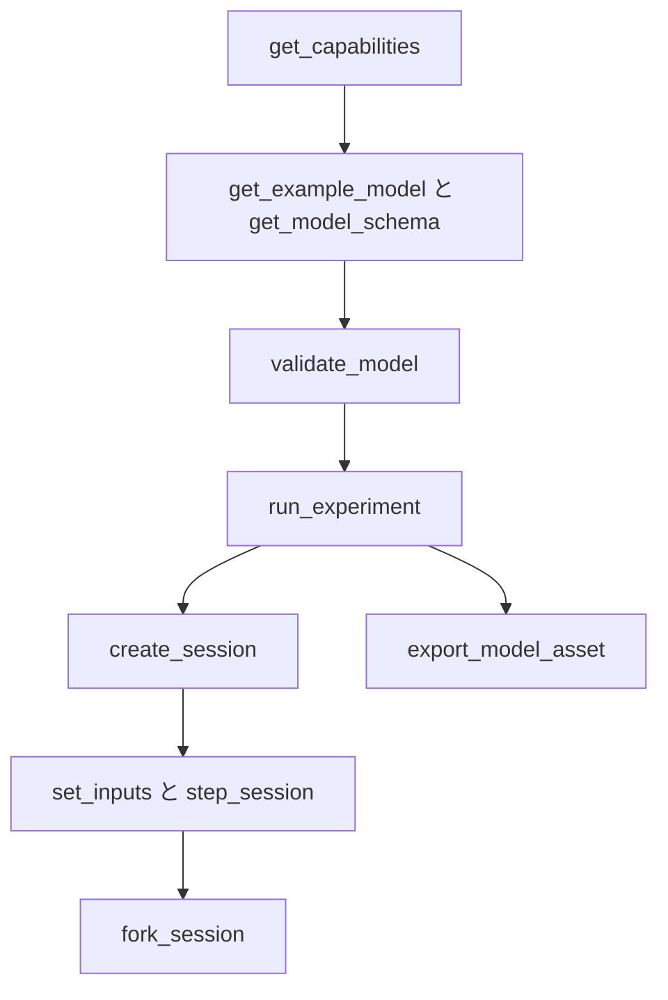

# エージェントインターフェース

[English](AGENT_API.md) · [简体中文](AGENT_API.zh-CN.md) · [Français](AGENT_API.fr.md) · [Русский](AGENT_API.ru.md) · **日本語** · [한국어](AGENT_API.ko.md) · [Deutsch](AGENT_API.de.md) · [Español](AGENT_API.es.md) · [Italiano](AGENT_API.it.md) · [Português](AGENT_API.pt-BR.md)

`Power.Core`、`Power.Agent`、MCP は、1 つの物理コアへの別々の入口です。この API は、特定の GPT バージョンやモデルベンダーに縛られません。バージョン、機能、スキーマを読んでから、モデルを生成してください。知っている名前でも、そのコンポーネントが実装されているとは限りません。

[有限ガスネットワーク](GAS_NETWORK.ja.md) は、JSON、CLI、MCP から使えます。ガス組成、制御された絞り、固定リザーバー、壁面熱リンク、保存チャンネルは、移植可能なアセットに残ります。既存の線形モデルと密閉気筒モデルの意味論は、変わりません。

[連成クラッチコンポーネント](CLUTCH_NETWORK.ja.md) は、共有の JSON、実験、セッションの契約から使えます。有界な係合入力、静止容量と滑り容量、符号付き変速比、位相/熱の出力、トランザクションな内部イベントを含みます。スタンドアロンの [厳密なペア](CLUTCH_PHYSICS.ja.md) は、検証用の参照のままです。

[理想歯車/遊星コンポーネント](GEAR_NETWORK.ja.md) は、共有ソルバーとドキュメント契約に参加します。`ideal_gear` は A/B ポートと、符号付きで非ゼロの変速比を持ちます。`planetary_gear` はサン/リング/キャリアのポート A/B/C と、1 より大きいリング/サンの歯数比を持ちます。両立する初期速度と、独立した恒久拘束が必要です。機能情報は、ランクの方針、ソルバー許容差、平均反力出力を示します。

[油圧ピストン契約](HYDRAULIC_PISTON.ja.md) は、`translational` ノード、`linear_spring`、`hydraulic_piston`、`piston_clutch`、`force_source` を追加します。エージェントは、変位、速度、圧力による力、パッドのエネルギー/力、クラッチ容量、累積減衰熱を観測できます。ピストンクラッチに係合入力はありません。充填/排出バルブを指令し、パッド接触を調べてください。`get_capabilities.hydraulic_piston` は、SI 単位、容積/仕事の規約、ソルバー範囲、負圧からの回復を説明します。モデル検証は、対処可能な単位、範囲、接続のエラーを返します。セッションのリビジョン、キャンセル、独立した分岐の契約は、変わりません。

`hydraulic_spool_valve` は、ピストンコンポーネントと、明示的な閉じ/全開位置を参照します。開度は実際の運動に従い、開度指令も初期入力の上書きも受け付けません。流量、損失、開度は、共有のモデル/セッション契約を通じて観測できます。`get_capabilities.hydraulic_spool_valve` は、位置/流量の単位、同時求解、省かれたジェット力の物理を宣言します。機械式の圧力調整を調べるには `spool-regulated-pump` を要求してください。[計量契約](HYDRAULIC_SPOOL.ja.md) を参照してください。

`gas_piston` は、並進ノードを可動ガス室へ結びます。明示的な面積、参照容積/位置、絶対参照圧力、符号付き圧縮方向を持ちます。ガス質量、エネルギー、圧力、温度、容積、力、参照仕事を観測してください。同じ質量上の油圧ピストンと組み合わせるとアキュムレーターになります。輸送には明示的なガスポート/熱リンクを使ってください。検証は、容積の所有者が 1 つであることと、公称ガス容積が正であることを検査します。機能情報は、1/4 容積の区間制限を宣言します。契約は、壁面結合の精度境界を述べます。`gas-accumulator-pump` を要求してください。[ガス/流体の契約](GAS_PISTON.ja.md) を参照してください。

`gas_fuel_injector` は、互換な有限追跡の源/受けガス容積と、明示的なタイミングクランクを接続します。入力はサイクルあたりの要求 kg です。ラッチされた要求、サイクル/合計の供給燃料、平均供給流量を観測してください。窓の途中の入力変更は、次に観測されるサイクルへ適用されます。背圧や枯渇は、実行エラーなしに供給不足を起こし得ます。出力エビデンスと KPI を使ってください。機能情報は、タイミング、ドーズ、範囲の境界を宣言します。`metered-fired-cylinder` を要求してください。[計量契約](FUEL_METERING.ja.md) を参照してください。これは気体の導入です。液体噴霧、蒸発、キャリブレーション済みの燃料/ECU ハードウェアは、まだ開いています。

## 起動とクライアント設定

```sh
dotnet run --file tools/Build.cs -- build
dotnet /absolute/path/to/Power!/src/Power.Mcp/bin/Release/net10.0/Power.Mcp.dll
```

一般的な MCP クライアントのエントリです。クライアントのサーバー設定に置き、パスを差し替えてください。

```json
{
  "mcpServers": {
    "power": {
      "command": "dotnet",
      "args": ["/absolute/path/to/Power!/src/Power.Mcp/bin/Release/net10.0/Power.Mcp.dll"]
    }
  }
}
```

Windows も同じ `dotnet` コマンドと、DLL への絶対パスを使います。本番の接続では、ビルド済み DLL を直接実行してください。ビルドの出力が stdio プロトコルに混ざらないようにするためです。サーバーに Unity、資格情報、ネットワーク接続は不要です。最初の NuGet 復元にはネットワークが必要です。トランスポートとバージョンの互換は、ピン留めされた公式 [MCP C# SDK](https://csharp.sdk.modelcontextprotocol.io/v2/concepts/getting-started.html) から来ます。

## ツールと結果

エージェント API バージョン 0.31.0 では、`get_example_model` は任意の `name` を受け付けます。`electrothermal`（既定）、`sealed-cylinder`、`gas-network`、`moving-cylinder`、`crank-timed-cylinder`、`fired-cylinder`、`fired-clutch`、`fired-planetary`、`fired-converter`、`fired-hydraulic`、`fired-pump`、`fired-pump-losses`、`electric-pump`、`pressure-regulated-pump`、`battery-regulated-pump`、`piston-actuated-clutch`、`spool-regulated-pump`、`gas-accumulator-pump`、`metered-fired-cylinder`、`film-fired-cylinder`、`liquid-injected-cylinder`、`needle-actuated-cylinder`、`closure-compensated-cylinder`、`dual-clutch-transmission`、`fired-dual-clutch`、`controlled-dual-clutch`、`controlled-fired-dual-clutch`、`ravigneaux-transmission`、`fired-ravigneaux-converter`、`resolved-ravigneaux-transmission`、`fired-resolved-ravigneaux-converter`、`hydraulic-ravigneaux-transmission`、`fired-hydraulic-ravigneaux` です。`get_capabilities` は、サポートされる忠実度、読み取れるアセットバージョン、ソルバー制限、入力境界を知らせます。エクスポートは `power.asset.v26` を使います。v1–v23 のアセットは読み取れるままです。出力チャンネルとその単位は、モデル検証とセッション作成が返します。ラボラトリーの KPI に合格しても、完全な、またはキャリブレーション済みのパワートレインであることにはなりません。

| ツール | 役割 |
|---|---|
| `get_capabilities` | バージョン、モデルの機能、サイズ制限、時間の意味論、ワークフロー |
| `get_model_schema` | 完全な `power.model.v1` の JSON Schema |
| `get_example_model` | イベントと KPI を持つ、編集可能な例 |
| `validate_model` | モデルと実験を検査します。フィンガープリント、チャンネル、診断を返し、時間は進めません |
| `run_experiment` | 完全な実験、バッチサイズの異なる 2 回のリプレイ、KPI、来歴。結果は既定でコンパクトです |
| `export_model_asset` | 検証して `.powerasset` をエクスポートします。Base64 の内容、ファイルダイジェスト、来歴、モデルフィンガープリントを返します |
| `create_session` | 独立した対話シミュレーションを作成します。初期スナップショットとチャンネルメタデータを返します |
| `read_snapshot` | 現在時刻、リビジョン、ハッシュ、選択した出力チャンネル |
| `set_inputs` | 現在時刻で入力フレームをアトミックに提出し、セッションリビジョンを進めます |
| `step_session` | 要求されたナノ秒数だけアトミックに進めます。キャンセルに対応します。リビジョンは進みます |
| `fork_session` | 現在の物理状態を、リビジョン 0 の新しい分岐へコピーします |
| `close_session` | 1 つのセッションを解放します |

すべてのツールに入力スキーマと出力スキーマがあります。成功と領域エラーのどちらも、`structuredContent` と互換のあるテキスト結果を返します。MCP の `isError` は `ok=false` に対応します。[SDK の構造化ツール結果](https://csharp.sdk.modelcontextprotocol.io/v2/concepts/tools/tools.html) を参照してください。

```json
{"schema":"power.agent.v1","ok":true,"data":{"revision":"2","time_ns":"1000000000","state_hash":"...","values":[]}}
```

```json
{"schema":"power.agent.v1","ok":false,"error":{"code":"revision_conflict","message":"Read the snapshot, then use its current revision.","retryable":true,"current_revision":"2"}}
```

[モデルスキーマ](../schemas/power.model.v1.schema.json) と [応答スキーマ](../schemas/power.agent.v1.schema.json) を参照してください。モデルスキーマは構造を検査します。コンパイラは続いて、次元、トポロジー、正の値、有限値、数値体系を検査します。実験の検証は、ティックの整合、イベント順序、チャンネル、KPI 境界を検査します。

## 操作シーケンス



1. `get_capabilities` を呼び、必要な物理コンポーネントがサポートされていることを確認します。
2. 例とスキーマを取得し、`document` オブジェクトを作ります。パラメーターには単位が必要です。
3. `validate_model({"document": ...})`。`error.object_id`、`error.field`、`error.code` からモデルを修復します。
4. `run_experiment({"document": ...})`。`data.passed`、`checks`、`replay`、`model.calibration` を確認します。`ok=true` は、実験が終わったことだけを意味します。KPI はまだ失敗し得ます。
5. 同じドキュメントで `create_session` します。`session_id`、初期 `revision`、チャンネルマップを保持します。
6. たとえば `set_inputs({"session_id":"...","expected_revision":"0","values":[{"channel":"100","value":24}]})` とし、返ってきたリビジョンを読みます。
7. `step_session({"session_id":"...","expected_revision":"1","delta_ns":"1000000000"})` は、1 秒後のスナップショットを返します。
8. `fork_session({"session_id":"...","expected_revision":"2"})`。子を 4 V で制動し、親は対照として残します。
9. 比較のあと、それぞれ最新のリビジョンで `close_session` します。

Unity でモデルを調べるには、`export_model_asset({"document": ..., "name": "My laboratory"})` を呼びます。`data.content` を Base64 デコードし、`data.asset_sha256` をファイル全体と照合し、Unity の `Assets` 配下に `.powerasset` として保存し、アセット Inspector の **Open in Studio** で開きます。ツールが返すのは内容だけです。ローカルファイルは書きません。エクスポートの成功は、データが妥当であることを意味します。KPI とキャリブレーションは別の検査です。形式と制限は [モデルアセット](ASSET_FORMAT.ja.md) にあります。

リビジョンは 0 から始まります。成功した入力の確定と、成功したステップは、それぞれ 1 を加えます。古い、無効な、またはキャンセルされた操作は、リビジョンを加えません。分岐は親のリビジョンを変えません。トランスポートが中断したあとは、スナップショットを読み、そのリビジョンを使ってください。古いリビジョンを付けたまま書き込みを再送しないでください。

セッションスナップショットの `time_ns`、`revision`、チャンネル ID は文字列です。JavaScript の整数限界を超えても正確なままになります。モデルドキュメントの実験時間は最大 1 時間です。モデルの入力チャンネルは、今は整数です。別の JSON クライアントが正確さを保つ必要があるなら、`2^53-1` 以下の ID を選んでください。出力に含まれる高い名前空間の ID は、文字列のまま変わりません。

`read_snapshot` の `channels` は、出力 ID 文字列の配列です。省略すると、すべての出力が返ります。入力チャンネルと重複フィールドは拒否されます。実験がすべてのサンプル境界を返すようにするのは、`include_samples=true` です。

## エラーと修復

| エラー | 次の操作 |
|---|---|
| `model_unit` / `model_connection` / `model_range` | そのオブジェクトとフィールドの単位、参照、またはパラメーターを修復する |
| `invalid_argument` / `invalid_json` | フィールド、イベント順序、時刻、またはドキュメント構造を直す |
| `unknown_channel` / `invalid_input` | チャンネルテーブルから入力を選び、重複と非有限値を除く |
| `invalid_time_step` | 正の整数ティック数を使う。1 回の呼び出しは最大 100 万ティック |
| `numerical_failure` | パラメーターの規模、入力、ステップを調べる。現在の状態は変更されていない |
| `revision_conflict` | 最新のスナップショットを読み、その状態から決める |
| `cancelled` | バッチ全体がロールバックされた。より小さいバッチで再試行する |
| `session_capacity` | もう不要なセッションを閉じる |
| `unknown_session` | プロセスが再起動したか、セッションが閉じられた。作り直し、リプレイする |

セッションはプロセス内のオブジェクトです。永続化されず、実行中の Unity シーンにも結び付きません。MCP インターフェースは現在、同じコアでヘッドレス実験を実行します。将来の Unity 接続でも、リビジョン、時間、原子性の契約は守る必要があります。

## コンポーネントの追加

方程式と範囲を書き、単位付きのポートとパラメーターを定義し、コアに実装し、解析解、保存、ステップ収束、失敗テストからエビデンスを取ります。それからスキーマと機能の発見を追加し、リプレイ可能な実験を届け、Unity ビューを接続します。測定の来歴と不確かさは、別に記録します。テストに合格しても、モデルがキャリブレーション済みであることにはなりません。

## ガスネットワークの手順

`gas-network` を要求し、検証し、既存ツールで実験を実行してアセットをエクスポートします。`power.model.v1` は、加算的なガスノード/コンポーネント定義を得ます。クライアントは、スキーマと機能情報から見つけてください。ツール名は変わりません。ガス容積は、それぞれ 2 つのスカラー状態を使います。接続された容積は、R と gamma を共有する必要があります。

`gas_orifice` の入力は、[0, 1] の `fraction` 値を使います。入力チャンネルがない、またはゼロだと、明示された `initial_input` が固定されたままになります。検証とエクスポートは、実験が実行される前に、範囲外の予定値を拒否します。対話的な拒否は、状態とリビジョンの両方を保ちます。コンパイル、実行の成功、KPI の成功、キャリブレーションは別のものです。例は合成であり、`unverified` です。

ガスだけのセッション操作は、同じナノ秒時刻、リビジョン検査、キャンセル、フィルタされたスナップショット、独立した分岐を使います。セッションは、コンポーネントの初期入力から始まります。`create_session` は、実験のイベントスケジュールを実行しません。そのスケジュールには `run_experiment` か、移植可能な再生を使ってください。静的な検証では、将来の状態が数値的に解けることの保証はできません。`numerical_failure` のときは `step_ns` を小さくし、セッションを作り直す前に、流路面積、容積、コンダクタンス、初期条件を調べてください。

## 可動気筒の手順

`get_example_model({"name":"moving-cylinder"})` は、キャリブレーションされていないモータリング実験を返します。時刻で制御される 2 つの絞り、クランク圧力仕事、壁面伝達があります。`storage` を持たないガスノードは、ちょうど 1 つの `gas_cylinder` に接続する必要があります。そのパラメーターが形状を供給します。コンパイラは所有を検証し、ガスノードの圧力/温度と、クランクの初期形状から、初期質量/エネルギーを導きます。

機能情報は、`moving_cylinder_gas_exchange`、0.25 rad のクランク境界、分割積分の範囲を知らせます。ガス状態はガスノード上のチャンネルのままです。容積、変位、トルクは、ガス気筒コンポーネント上のチャンネルです。実験、エクスポート、セッション、リビジョン、失敗の契約は変わりません。[可動気筒](MOVING_CYLINDER.ja.md) を参照してください。時刻で予定された絞りは、クランク角のバルブタイミングや燃焼を確立しません。

## クランク同期バルブの手順

`get_example_model({"name":"crank-timed-cylinder"})` は、720 度のモータリング実験を返します。可変速度、吸気/排気プロファイル、壁面熱があります。`gas_orifice` 上の `valve_timing` は、回転の `crank_node` と、単位を持つ `cycle_angle`、`open_angle`、`duration_angle` を要求します。機能オブジェクトは、サイクル、プロファイル、制限、回復を知らせます。[タイミング契約](VALVE_TIMING.ja.md) を参照してください。

タイミング付き入力チャンネルは、[0, 1] の `peak_opening` を表します。観測可能な `effective_opening` は、実際のクランク角から導かれます。検査には KPI フィールド `opening` を使ってください。止まったクランクは開いたままになり得ます。逆回転は、同じプロファイルをたどり直します。位相は明示され、気筒形状の位相とは独立です。予定されたピークの変更はローブを拡大縮小します。クランクタイミングを置き換えるものではありません。

検証はトポロジーとパラメーターを検査しますが、実行時に解けることの保証はしません。`numerical_failure` のときは、角度の移動と端点速度による移動が `min(0.25 rad, duration_angle/8)` 以内に収まるよう `step_ns` を小さくし、セッションを作り直してください。失敗したバッチ全体は、入力、状態、リビジョンを保ちます。アセット v11 はプロファイルを保持し、v1–v10 との互換性を保ちます。新しい忠実度は `crank_timed_gas_exchange` です。実行の成功、KPI の合格、キャリブレーションは別のものです。

## 予混合燃焼の手順

`get_example_model({"name":"fired-cylinder"})` は、外部負荷を駆動する予混合の燃焼気筒を返します。`combustion` 機能は、Wiebe の規定、燃料/空気/生成物の区分、入力範囲、前進履歴の挙動、数値上の制限を宣言します。ガスノードは `gas.premixed` を指定し、そのリザーバー絞りは明示的な `reservoir_fractions` を指定します。コンパイラは、割合の欠落、両立しない接続混合物、1 つの室に対する複数の燃焼コンポーネントを拒否します。

`premixed_combustion` は、回転の `node_a` を予混合ガスの `node_b` へ接続します。明示的なサイクル/開始/持続の角度、形状指数、燃焼係数を持ちます。任意の入力チャンネルは、[0,1] の `burn_multiplier` を通じてハザードを拡大縮小します。ゼロは燃焼を止めますが、開いた入口へ燃料が届くことは止めません。記録されたフロンティアを超える前進角は燃料を消費します。停止、逆転、たどり直しでは、熱放出を繰り返せません。

成分質量、化学エネルギー、累積燃焼燃料、放出熱、`burn_frontier_angle` は、チャンネルテーブルから見つけてください。全体の燃料/新鮮空気の残差は、総質量とエネルギーを補います。`reservoir_enthalpy` は、予混合気について輸送された化学エネルギーを含みます。`net_fuel_energy_in` はその部分を別に示します。ガスの内部エネルギーは熱のままです。レポートの忠実度は `premixed_gas_transport` または `premixed_wiebe_combustion` です。どちらも `unverified` のままです。

燃焼分解能の失敗では、`step_ns` を小さくしてセッションを作り直してください。燃焼を有効にするには、クランクの移動と端点速度による移動が `min(0.25 rad, burn duration/32)` を超えない必要があります。1 ティックあたりの熱は、燃焼前の熱エネルギーの 25% までに制限されます。呼び出し全体のロールバックとリビジョンの契約は変わりません。妥当なモデルでも、実行時の境界で失敗することがあります。実行に成功しても、KPI で失敗することがあります。方程式と限界は [PREMIXED_COMBUSTION.md](PREMIXED_COMBUSTION.ja.md) を参照してください。

## クラッチの手順

`get_example_model({"name":"fired-clutch"})` は、燃焼エンジン、別の負荷、クラッチ、熱シンクを返します。正確なティックの係合/解放イベントがあります。`clutch` の機能は、入力境界、ソルバー予算、モードコード、出力履歴の意味論を宣言します。Nm 単位の `parameters.static_capacity` と `sliding_capacity`、それに符号付きで非ゼロの `ratio` を定義します。コンパイラは `static >= sliding >= 0`、回転端点、熱損失シンクを強制します。対地ブレーキは、省略またはゼロの `node_b` と、変速比 1 を使います。

`engagement` 入力は `[0,1]` にあります。ゼロは解放します。現在の相対滑り、最後に受理された位相、直前ティックの平均トルク/熱出力、累積摩擦熱は、チャンネルテーブルから見つけてください。位相は、0 が解放、1 がロック、2 が正の滑り、3 が負の滑りです。係合を更新しても、直前ティックの平均出力や位相は書き換わりません。忠実度 `hybrid_clutch_powertrain` は、このコンポーネントを含むモデルを識別します。完全なトランスミッションや、キャリブレーション済みの車両を意味しません。

KPI とリプレイのエビデンスを評価するには `run_experiment` を、係合を変えながらリビジョン検査と独立分岐を保つにはセッションツールを使ってください。数値失敗では、`step_ns` を小さくし、慣性/変速比の規模、冗長な拘束、容量スケジュールを調べてください。失敗またはキャンセルされた呼び出しは、入力、位相、熱、物理状態を確定しません。変化する負荷の下での離脱は、区間平均の要求を使います。遷移の近くでは、時間刻みの精細化が必要です。[CLUTCH_NETWORK.md](CLUTCH_NETWORK.ja.md) を参照してください。

## 理想変速の手順

`fired-planetary` を要求すると、合成エンジン、リングブレーキ、サン/リングクラッチ、遊星セット、ファイナルドライブが得られます。予定された昇段/降段は、他の実験と同じ正確なティック意味論を使い、一致するリプレイ境界は 84 です。`node_c` は遊星キャリアです。歯車が受け付けるのは、回転ポートと `parameters.ratio` だけです。

`slip_speed` と `constraint_error` は、現在の速度残差と位相残差を示します。`torque`、`torque_at_b`、遊星だけの `torque_at_c` は、直前の完全ティックにわたる、対応ローター上の平均反力です。それらはゼロから始まり、境界での入力変更では書き換わりません。初期速度の失敗は、フィールド `initial_speed` を伴う `model_connection` を返します。従属な拘束行は、フィールド `gear.constraints` を伴う `model_solver` を返します。同じデータを再試行するのではなく、トポロジーか初期条件を直してください。

アセット v11 は以前のリーダーをすべて保持します。正規の v7 燃焼クラッチフィクスチャを含みます。このモデルが確立するのは合成の変速経路であり、完全な DCT/AT、油圧駆動、TCU の挙動、実測キャリブレーションではありません。実際の Unity エビデンスは、別のままです。

## コンバーターの手順

`fired-converter` を要求すると、合成エンジン、マップ化された流体経路、別のロックアップ、遊星変速、熱シンクが得られます。機能情報は、必須の 4 つの符号付きマップすべて、点/コンポーネントの制限、参照部材の規約、非線形反復の予算、観測の意味論、実行時回復を知らせます。忠実度は `quasisteady_converter_powertrain` です。87 のリプレイ境界に合格しても、確立されるのは数値的な整合であり、実測のトランスミッション性能ではありません。

`torque_converter` は、ポンプ/タービンの `node_a`/`node_b`、任意の `heat_node`、`parameters` 配下の 4 つの明示的なマップ配列を要求します。各点は、無次元の速度比とトルク比、および `nm_s2_rad2` の係数を持ちます。マップ、逆象限、入力チャンネル、ステーター・ローターのポートは、推測されません。コンパイルは、補間の受動性とマップの連続性を検査し、オブジェクト ID とともに `converter.<map>` または `converter.counter_rotation` を報告します。

平均のポンプ/タービン/ステータートルク、流体熱出力、累積流体熱、現在の符号付き速度比、ドライバーコードは、チャンネルから見つけてください。並列の `clutch` がロックアップの係合を供給します。セッションのリビジョン、キャンセル、分岐の独立性、完全なロールバックの契約は、コンバーターの履歴も覆います。`numerical_failure` のときは `step_ns` を小さくし、マップの傾き、慣性/速度の規模、クラッチ拘束を調べてください。[方程式、境界、エビデンス](CONVERTER_NETWORK.ja.md) を参照してください。エクスポートはアセット v11 を使います。正規の以前のフィクスチャは、v1–v10 の互換性を保ちます。自動の油圧制御と、実際の Unity Editor/Player 検証は、別の未了作業のままです。

## 油圧の手順

`fired-hydraulic` を要求すると、変速クラッチとロックアップクラッチを操作する、バルブ制御の圧力室が得られます。`hydraulics` 機能は、ゲージ圧の規約、貯蔵と流れのモデル、単位、反復制限、圧力許容差、アクチュエーター範囲、回復を公開します。忠実度は `compliant_hydraulic_powertrain` です。キャリブレーションは `unverified` のままです。

油圧ノードは、`m3_pa` の正のコンプライアンス `storage` と、非負の初期ゲージ圧を要求します。`hydraulic_resistance` と `hydraulic_orifice` は、明示的な流量係数とバルブ開度を要求します。オリフィスはさらに、正の遷移圧力を必要とします。リザーバー端点は、明示的な `reservoir_pressure` を要求します。入力チャンネルがない、またはゼロだと、与えられた開度が固定されます。コンパイラが、流体物性、漏れ、リザーバー圧力、OEM マップを推測することはありません。

`hydraulic_clutch` は、回転ポートと、`parameters` 配下の形状を持ちます。油圧の `pressure_node` を含みます。係合入力はありません。圧力、蓄えられた参照容積、油圧境界仕事、在庫残差、絞り熱、クランプ力、現在の摩擦容量を、既存のクラッチ履歴チャンネルと並べて見つけてください。バルブ入力の変更は、受理されたステップが進めるまで、蓄えられた圧力と直前ティックの平均を保ちます。

完全な状態、リビジョン、キャンセル、分岐の契約は、油圧圧力と台帳を覆います。数値失敗では、`step_ns` を小さくし、コンプライアンス、係数、ゲージ圧、アクチュエーター形状を調べてください。最終圧力が負だと、バッチ全体が拒否されます。黙ってクランプされることはありません。[HYDRAULIC_NETWORK.md](HYDRAULIC_NETWORK.ja.md) を参照してください。アセット v11 は、圧力境界、流れの法則、アクチュエーター形状を保持します。v1–v10 のリーダーはすべて残ります。実測の損失/制御マップ、実測のバルブ/アキュムレーター動特性、完全な ECU/TCU 制御、実際の Unity 受け入れは、まだ開いています。

## ポンプ供給の手順

`fired-pump` を要求すると、クランク駆動ポンプ、柔軟な管路、リリーフ、圧力作動のトランスミッションが得られます。機能情報は、`hydraulic_pump`、押しのけ量の単位、入口の規約、連成ソルバーの制限、符号付き仕事の意味論を公開します。ポンプの `hydraulic_work` は、内部のシャフトから流体への伝達です。全体の `hydraulic_work` は、外部リザーバーの仕事のままです。この例では、外部の油圧仕事はゼロで、初期の蓄積圧力は明示されています。

`hydraulic_pump` は、シャフト/出口ポート、明示的な `parameters.inlet_node`、`m3_rad` の正の `displacement`、そして入口がゼロのときだけのリザーバー圧力を要求します。リリーフはコンダクタンスとクラッキング圧力を要求し、入力チャンネルはありません。欠落または誤った領域のポート、次元、無関係なパラメーターは、対処可能な検証エラーを出します。アセット v11 は両方の定義を保持します。リビジョン、キャンセル、分岐、完全なロールバック、KPI/キャリブレーションの区別は変わりません。[HYDRAULIC_PUMP.md](HYDRAULIC_PUMP.ja.md) を参照してください。

## ポンプアセンブリの手順

`fired-pump-losses`、`electric-pump`、`pressure-regulated-pump`、または `battery-regulated-pump` を要求します。`pump_assembly` 機能は、正味流量/反力の方程式、損失の単位、コンポーネント構成、電気供給の境界を与えます。モデルは通常のポンプ、抵抗、シャフトのレコードを含みます。電気の例は、既存の RL モーターを追加します。新しいコンポーネント種別、スキーマ、アセットバージョンは不要です。コアのクライアントは、独自の安定 ID を付けて `HydraulicPumpAssembly.CreateComponents` を使い、同じグラフ定義を作れます。

漏れは、出口から入口への明示的な抵抗で、係数は `m3_s_pa` です。シャフト摩擦は、接地され、剛性ゼロで、減衰が `nm_s_rad` のシャフトです。どちらも、与えられた値と明示的な熱の経路を要求します。電動ポンプは、`v` 入力を通じてモーター電圧を受けます。逆起電力、電流、銅損は共有求解に入ります。電池、効率、粘度、コントローラー、キャリブレーションは推測しません。理想ポンプ分岐の流量を、アセンブリの正味供給量と解釈せず、チャンネルから見つけてください。既存のリビジョン、キャンセル、分岐、完全なバッチロールバックは、構成全体に適用されます。

## 圧力フィードバックの手順

`pressure-regulated-pump` を要求します。機能情報は、`pressure_controller` コンポーネント、次元を持つゲイン、センサー/対象の要件、整数サンプリング、クランプ、トランザクションの意味論を知らせます。既存ツールで検証、実行、エクスポートします。アセット v12 はコントローラー定義全体を保持し、以前のリーダーはすべてサポートされたままです。

例の `105` 入力は、圧力設定値を SI の Pa で変えます。モーターの電圧チャンネル `100` はコントローラーが所有し、書き込み可能なチャンネルにはありません。直接の書き込みは、`pressure_setpoint` へ書くよう案内する `controlled_input` を返します。拒否は状態もリビジョンも変えません。負の圧力目標は拒否されます。静的検証は、所有者の衝突、誤った領域/単位、揃っていないサンプル周期を検出します。

`sampled_pressure`、`pressure_error`、`integral_voltage`、`command_voltage` を、発見可能な出力 ID から読んでください。これらは、直前サンプルの状態と、保持された指令です。スナップショットの時刻は、クロック位相を示します。入力の変更は制御履歴を進めません。次に到来するサンプルが、物理ティックでそれを更新します。分岐には、積分メモリとクロック位相が含まれます。キャンセル、またはその後の算術/ソルバー失敗では、バッチのどの部分も確定しません。オーバーフローからの回復には、同じ入力を盲目的に再試行するのではなく、ゲイン、目標、積分の規模を調べる必要があります。

アクチュエーターが飽和すると、実行の成功と厳密なリプレイがあっても、追従 KPI は失敗し得ます。`passed` と誤差境界は、`ok` とは別に確認してください。例の理想センサーと電圧源は研究用コンポーネントです。電池、完全な ECU/TCU、キャリブレーション済み制御、Unity 受け入れを確立しません。

## 電池供給の手順

`battery-regulated-pump` を要求します。機能情報は、有限電荷、OCV/RC 方程式、負荷とデューティーの規則、制御の所有、回復を公開します。電池ノードの `storage` は `c` または `ah` を使い、`initial` は `fraction` の SOC、`position` は `v` の分極電圧です。電池レコードは、5 つの電気パラメーターをすべて要求します。単位、容量/状態の境界、源ポート、熱シンク、増加する OCV、コントローラー周期が検証されます。

`battery_motor` は、回転の A ポート、電池の B ポート、[-1,1] のデューティー入力を要求します。`resistive_load` は、電池の A ポート、抵抗、[0,1] の開度を持ちます。例の `106` チャンネルはアクセサリー負荷を変え、`105` は圧力設定値を SI の Pa で変えます。デューティー `100` は `pressure_duty_controller` が所有し、直接は書けません。そのゲインは `fraction_pa` と `fraction_pa_s` を使います。出力境界は無次元です。

`state_of_charge`、`charge`、`battery_current`、`terminal_voltage`、`polarization_voltage`、電池の蓄積エネルギーと熱を、`integral_duty` および `command_duty` と並べて読んでください。電圧/電流/負荷電力のチャンネルは瞬間的な代数観測量なので、妥当なデューティー/負荷の変更は、蓄積状態を変えずにそれらを変え得ます。電池仕事は内部です。全体の `source_work` に含まれるのは、明示的な外部電力境界だけです。SOC/電圧の違反はバッチ全体を拒否します。再試行の前に、初期電荷、容量、デューティー、負荷、バッチ長を調べてください。SOC が黙ってクランプされることはありません。

アセット v22 は、正規の以前のリーダー/フィクスチャとともに、供給/制御パラメーターをすべて保持します。キャンセルとその後の失敗は、電荷、RC/制御メモリ、入力、リビジョンを保ちます。独立した分岐は、同じ物理履歴からアクセサリー/デューティーの戦略を比べます。すべてのパラメーターは未検証のままです。理想的な平均化デューティー変換器は、電池の BMS、PWM/電流ループ、完全な車両電気系統、キャリブレーションではありません。

## 液体フィルムの手順

`film-fired-cylinder` を要求します。`fuel_film` 機能は、有限なガス/壁ポート、相エネルギーの参照、単位、分割精度、範囲を宣言します。初期の液体在庫、温度、比熱、飽和温度、潜熱内部エネルギー、コンダクタンスを明示的に与えてください。モデルを実行またはエクスポートする前に、検証し、出力 ID を見つけてください。フィルムは、書き込み可能な入力チャンネルを持ちません。

残る `mass`、符号付き `internal_energy`、`chemical_energy`、`evaporated_fuel_mass`、直前ティックの平均 `mass_flow`、累積 `film_wall_heat`、瞬間的な `heat_flow` を、受け側の燃料と反応熱と並べて読んでください。乾いたフィルムは、宣言された飽和温度と、ゼロの熱流を報告します。反応を支配するのは、実際の蒸気の可用性です。妥当なフィルム定義でも、蒸発や、熱放出 KPI の合格を意味しません。

アセット v18 は相の量と、それ以前のリーダーを保持します。リビジョン検査、キャンセル、独立した分岐、遅い失敗のロールバックは、液体、熱、成分、補償の履歴をすべて含みます。誤った単位/ポート、過熱した初期液体、過剰な状態数は、構造化されたエラーを返します。失敗したモデルを再試行する前に、報告されたオブジェクト/フィールドと、有限な熱予算を調べてください。[フィルム契約](FUEL_FILM.ja.md) は、方程式と精度境界を記録します。初期の濡れは、液体噴射、キャリブレーション済みの燃料物性、完全なエンジン制御、実際の Unity 受け入れを確立しません。

## 有限液体噴射の手順

`liquid-injected-cylinder` を要求します。`liquid_fuel_injector` 機能は、有限で柔軟な源、`kg` のサイクル入力、密度/コンプライアンスの単位、エネルギー台帳、受け側の境界を宣言します。レールの量、ノズル形状、既存のフィルム/クランク参照をすべて与えてください。先に検証し、出力 ID/単位を見つけてください。

例の `104` 入力は、サイクルあたりの kg を要求します。変更は、あとで観測される前進窓でラッチされます。現在の供給は、源の圧力で制限されたままになり得ます。レールの `mass`、`pressure`、蓄えられた `internal_energy`、化学エネルギー、容積を、`requested_fuel_dose`、`delivered_fuel_dose`、`total_fuel_delivered`、直前ティックの平均 `mass_flow` と並べて読んでください。フィルムの質量/温度/蒸発と、別の反応熱が、ドーズを受理してから実際の蒸気燃焼までの遅れを識別します。

コンポーネントの `source_work` は、解放された蓄積レール圧力仕事です。`hydraulic_work` は、書き出された受け側の圧力仕事です。`fluid_heat` は、フィルム壁へ送られるノズルの散逸です。これらの正体は、全体の外部源仕事とは別です。液体容積を無視できる受け側は、押しのけ仕事を明示的に書き出します。隠れたクランク仕事を足すことも、噴霧形状をモデル化することもありません。

アセット v19 は、源、ノズル、タイミングを完全に保持し、v1-v18 のリーダーを残します。リビジョン、キャンセル、分岐、遅い/投機的な失敗は、すべてのレール/割当/熱の履歴を含みます。誤った単位、あり得ない柔軟容積、過熱液体、一致しないフィルム/クランク所有は、構造化された診断を出します。再試行の前に、失敗したオブジェクト/フィールドと、圧力/ドーズの境界を調べてください。ツールの実行に成功しても、全量供給、KPI の合格、キャリブレーション済みハードウェアを意味しません。[LIQUID_FUEL_INJECTION.md](LIQUID_FUEL_INJECTION.ja.md) を参照してください。

## 物理ニードルの手順

`needle-actuated-cylinder` を要求します。機能情報は、磁気勾配の単位、磁束エネルギー、実際の開度、サンプリング制御、研究上の制限を宣言します。インジェクターの `104` kg 指令は書き込めます。ドライバーが所有するコイル電圧 `107` は書き込めません。拒否された書き込みは、正しい指令名/チャンネルを伴う `controlled_input` を返し、状態とリビジョンを保ちます。要求燃料質量を更新し、正確な物理ティックを進めてください。

実際のニードル変位/速度とインジェクター開度を、コイル電流、磁気エネルギー、銅熱、電気仕事、保持電圧、直前サンプルの目標/供給と並べて読んでください。電圧が除かれた後、窓が閉じた後、または目標供給に達した後も、流体は続き得ます。残る液体、ガス燃料、未燃/境界の燃料、反応は、別々に観測できます。妥当な要求や、成功したツールでも、正確なドーズ供給やキャリブレーション済み制御を確立しません。

アセット v20 は、磁気/行程/ニードル/ドライバーのテーブルと、v1-v19 のリーダーを保持します。サンプリング周期はティックに揃う必要があります。電圧の所有者は 1 つです。ニードル、コイル、クランクの参照は一致する必要があります。ソルバーエラーでは、正の `L(x)`、R/L/勾配、行程、時間刻みを調べてください。動的精度を主張する前に、物理/制御の区間を精細化してください。キャンセル、分岐、拒否/投機的なバッチは、磁束、熱、サンプリング/保持、位相の履歴をすべて含みます。[NEEDLE_ACTUATION.md](NEEDLE_ACTUATION.ja.md) を参照してください。

## クロージャ補償ニードルの手順

`closure-compensated-cylinder` を要求します。そのドライバーは、揃った有限の `closure_prediction_ns` ホライズンを有効にします。機能情報は、4096 ティックの制限、入力を保持する仮定、有界な切断探索を与えます。源の kg 要求は書き込めるままです。電圧はドライバーの所有のままです。予測質量/件数、切断ラッチ、保留ティックのチャンネルを、実際のニードル位置、供給、保持電圧のそばで見つけてください。

予測は、別の全状態プラントリプレイです。他の指令を保持し、将来の外部入力イベントを知りません。予測を実測燃料として扱わず、閉鎖後の実際の供給と、ホライズン/時間刻みの精細化を調べてください。失敗またはキャンセルされた予測は、実際のバッチのどの部分も確定しません。クロックのオーバーフロー、無効なホライズン、単調でない切断候補では、タイミング/モデルの仮定を見直す必要があります。部分的な予測が黙って受理されることはありません。

アセット v21 はホライズンを書き、以前のリーダーを保持します。リビジョン、独立した分岐、バッチ全体のロールバックは、予測ラッチとカウントダウンを含みます。コアのクライアントは、読み取り専用の `PredictNeedleClosure` を発行できます。MCP のスナップショットは、直前にサンプリングされた選択候補の推定を示します。範囲とエビデンスは [CLOSURE_PREDICTION.md](CLOSURE_PREDICTION.ja.md) にあります。

## デュアルクラッチ動力経路の手順

`dual-clutch-transmission` または `fired-dual-clutch` を要求します。機能情報は、通常の 7 前進/リバースのグラフ、2 つの入力経路、3 つの出力分岐、研究上の制限を説明します。セレクター/駆動の指令を変える前に、検証し、すべての歯車反力、クラッチ滑り/モード/熱、ローター速度を見つけてください。

例は、駆動チャンネル `500`/`501` と、セレクターチャンネル `600`-`607` を、前進 1-7 とリバースに使います。指令は割合です。変速比は恒久的な拘束のままです。無負荷の経路をプリセレクトするには、それまでのセレクターを解放して目標を係合し、その後、駆動クラッチの引き継ぎを別に協調させます。コアの `DualClutchGraph.SelectPath` は、その経路のアトミックなセレクター指令集合を作ります。TCU のセンシング、インターロック、アクチュエーター動特性は実装しません。

スナップショットは、すべての自由/選択ハブ、入出力速度、同期熱と駆動熱、歯車の位相誤差、全体の源/エネルギー/燃料のエビデンスを示します。安全でない組み合わせは、物理的なトランスミッションを拘束したり制動したりできます。入力の書き込みに成功しても、妥当な変速であることにはなりません。リビジョン検査、キャンセル、独立した分岐、遅い失敗は、すべての状態/履歴を保ちます。既存の移植可能な形式と以前のリーダーは保持されます。[DUAL_CLUTCH_TRANSMISSION.md](DUAL_CLUTCH_TRANSMISSION.ja.md) を参照してください。

## サンプリング DCT 制御の手順

`controlled-dual-clutch` または `controlled-fired-dual-clutch` を要求します。整数の `requested_gear` をチャンネル `700` に書いてください。1-7 が前進、-1 がリバース、0 がニュートラルです。コントローラーは駆動 `500`/`501` とセレクター `600`-`607` を所有します。直接の書き込みは、正しい要求段チャンネルを伴う `controlled_input` を返します。分数の段は無効で、状態もリビジョンも変えません。

確認された実際の段、指令された選択、位相、目標セレクターの滑り、故障を読んでください。要求した段は、変速の完了を意味しません。状態機械は、無負荷経路をプリセレクトし、物理的なロックを確認し、トルクを切った段階的引き継ぎを使い、タイムアウト/方向/持続ロックの故障を示します。ニュートラルは、到来したサンプルで中断します。別の目標は、故障から回復できます。過渡的な滑りでは、コントローラーがその継続時間を監視しているあいだ、実際の段が未確認と報告されることがあります。

明示された報告状態の上限は 128 で、ノード 32 / コンポーネント 64 は変わりません。実際の燃焼/コントローラー構成と、限界付近/限界超過の検査は検証済みです。.NET Standard の検査は引き続き .NET 10 上で実行され、Unity のエビデンスにはなりません。アセット v22 は、不変の経路と時間付き状態を、以前のリーダーとともに保持します。キャンセル、分岐、遅い失敗、補償座標の履歴は、バッチ全体のトランザクションのままです。完全な ECU のトルクブレンド、アクチュエーター、キャリブレーションは、別の要件のままです。[DCT_CONTROL.md](DCT_CONTROL.ja.md) を参照してください。

## 複合遊星経路

`double_pinion_planetary_gear` は、サン/リング/キャリアのポート A/B/C と、変速比 `k > 1` を要求します。拘束は `sun - k ring + (k-1) carrier = 0` です。既存の `planetary_gear` は、単一ピニオンの符号を保持します。どちらも、速度/位相の残差と、3 つの反力トルクすべてを示します。両立しない初期速度、誤った領域、冗長な行、不完全なキャリアは、対処可能なコンパイルエラーを返します。

明示的な 5 要素の研究スケジュール、コンバーター/ロックアップの統合、完全な物理リプレイには、`ravigneaux-transmission` または `fired-ravigneaux-converter` を要求します。係合入力は割合です。指令の成功は、ロックしたレンジを証明しません。これらの規定入力を所有する AT コントローラーはありません。アセット v23 はトポロジーを保持し、v1-v22 を読みます。[RAVIGNEAUX_TRANSMISSION.md](RAVIGNEAUX_TRANSMISSION.ja.md) を参照してください。

## キャリア相対の噛み合いと内部遊星動力学

`carrier_gear` は、区別される回転ポート A/B/C、有限で非ゼロの符号付き変速比、両立する初期速度を要求します。拘束は `A - ratio B + (ratio-1) C = 0` です。負の外歯比と正の内歯比が、1 を含めてサポートされます。C は、独自の反力トルクを持つ実際の可動キャリアであり、暗黙の接地ではありません。チャンネルは、3 つの平均トルクすべてと、速度/位相の残差を示します。ゼロの変速比、欠けたキャリア、誤った領域、従属な拘束は、型付きのコンパイルエラーを返します。

`resolved-ravigneaux-transmission` または `fired-resolved-ravigneaux-converter` を要求します。どちらも、4 つの物理噛み合い、2 つの絶対遊星自転状態、キャリアに宣言された軌道慣性を保持します。通常のローター貯蔵には、それらの実際の運動エネルギーが含まれます。入力は、規定された係合割合のままで、完全な AT 制御ではありません。平坦なグラフは、集約した慣性と変速比を記録します。ソース記述は、それらを生成した宣言済みの形状/質量を保持します。アセット v24 はこの原始素を含み、v1-v23 を読みます。[RESOLVED_PLANETS.md](RESOLVED_PLANETS.ja.md) を参照してください。

## ポンプ供給の AT ピストン駆動

`hydraulic-ravigneaux-transmission` または `fired-hydraulic-ravigneaux` を要求します。700/701 から 708/709 まで、明示的な充填/排出の割合を使ってください。燃焼側のロックアップは 710/711 を使います。以前のレンジ係合 ID はありません。書く前に、チャンネルを検証し、見つけてください。容量を決めるのは、ピストンの圧力/行程/接触です。API が受理した指令は、物理的なロックを確認しません。

レポートは、ライン/室の圧力、行程、接触容量、ポンプ仕事、押しのけ容積、摩擦/絞り/減衰の熱、すべてのモデルハッシュを保持します。完全なリビジョン、キャンセル、遅いロールバック、独立したバルブ解放の分岐は、通常の契約を使います。グラフは、新しい直列化形式ではなく、既存のアセット v24 レコードを使います。[AT_HYDRAULIC_ACTUATION.md](AT_HYDRAULIC_ACTUATION.ja.md) を参照してください。

## 油圧 AT フィードバック

`at_controller` は [-1,4] の整数目標段を受け取り、ゼロはニュートラルです。五組の充填/排油弁と任意のトルクコンバーターのロックアップを管理します。経路の順序はキャリア入力、小サン入力、大サン入力、キャリアブレーキ、大サンブレーキ、最後にロックアップです。

例 `controlled-hydraulic-ravigneaux` と `controlled-fired-hydraulic-ravigneaux` は要求チャンネル 900 とコントローラー ID 1400 を使います。変更していない 128 状態の上限内で 99 と 122 の報告状態を保ちます。v26 は経路、ゲイン、時計を保存し、v1-v25 を読みます。

研究用の制御であり、パラメーターは `unverified` のままです。ECU トルク協調、詳細なセンサー/弁、包括的な車両故障、OEM 校正は未完成です。managed と Standard の検査は実際の Unity Editor/Play/Player/IL2CPP の受入を証明しません。

[AT_CONTROL.ja.md](AT_CONTROL.ja.md)

## ポンプ供給の液体燃料レール

`liquid_rail_feed` は液体噴射器を既存の容積ポンプと明示的な物質/熱境界に結びます。油圧出口ノードはレールのコンプライアンスと初期絶対圧に一致する必要があります。ポンプと噴射器がこの圧力ノードを所有し、未追跡の他の流体経路は拒否されます。

v26 は補給接続と源温度を保存し v1-v25 を読みます。軸/圧力の解析交換、独立した同時 ODE 細化、熱混合、質量/燃料/エネルギー/体積台帳、逆流と完全 rollback は別々に検査します。

源は明示的な外部境界であり、有限燃料タンクのモデルではありません。タンク枯渇、ポンプ効率/調圧、配管損失、キャビテーション、圧力依存物性、有限体積噴霧は未完成です。パラメーターは `unverified` であり、OEM 校正や実際の Unity Editor/Play/Player/IL2CPP 受入を証明しません。

[PUMP_FED_FUEL.ja.md](PUMP_FED_FUEL.ja.md)
