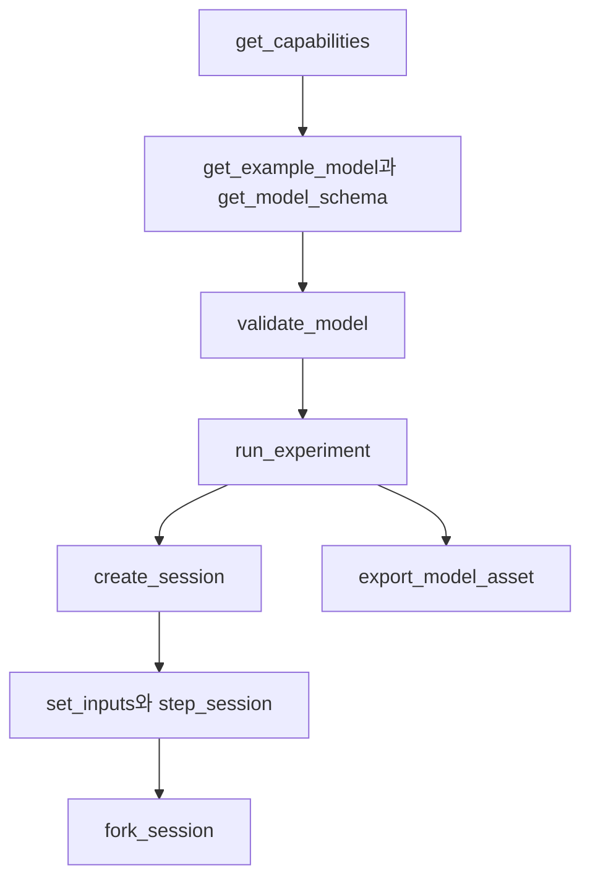

# 에이전트 인터페이스

[English](AGENT_API.md) · [简体中文](AGENT_API.zh-CN.md) · [Français](AGENT_API.fr.md) · [Русский](AGENT_API.ru.md) · [日本語](AGENT_API.ja.md) · **한국어** · [Deutsch](AGENT_API.de.md) · [Español](AGENT_API.es.md) · [Italiano](AGENT_API.it.md) · [Português](AGENT_API.pt-BR.md)

`Power.Core`, `Power.Agent`, MCP는 하나의 물리 코어로 들어가는 서로 다른 입구입니다. API는 GPT 버전이나 모델 공급자에 묶이지 않습니다. 버전, 기능, 스키마를 읽은 뒤 모델을 생성하세요. 익숙한 이름이라고 해서 그 컴포넌트가 구현된 것은 아닙니다.

[유한 가스 네트워크](GAS_NETWORK.ko.md)는 JSON, CLI, MCP를 통해 사용할 수 있습니다. 가스 조성, 제어되는 유동 제한, 고정 저장소, 벽 열 링크, 보존 채널은 이식 가능한 자산에 유지됩니다. 기존 선형 및 밀폐 실린더 모델 의미론은 변하지 않습니다.

[결합 클러치 컴포넌트](CLUTCH_NETWORK.ko.md)는 공유 JSON, 실험, 세션 계약을 통해 사용할 수 있습니다. 유계 체결 입력, 정지 및 슬립 용량, 부호 있는 변속비, 위상/열 출력, 트랜잭션 내부 이벤트를 포함합니다. 독립 [정확한 쌍](CLUTCH_PHYSICS.ko.md)은 검증 기준으로 남습니다.

[이상 기어/유성 컴포넌트](GEAR_NETWORK.ko.md)는 공유 솔버와 문서 계약에 참여합니다. `ideal_gear`는 A/B 포트와 0이 아닌 부호 있는 변속비를 갖습니다. `planetary_gear`는 선/링/캐리어 포트 A/B/C와 1보다 큰 링/선 잇수 비를 갖습니다. 양립하는 초기 속도와 독립적인 영구 제약이 필요합니다. 기능은 랭크 정책, 솔버 허용 오차, 평균 반력 출력을 설명합니다.

[유압 피스톤 계약](HYDRAULIC_PISTON.ko.md)은 `translational` 노드, `linear_spring`, `hydraulic_piston`, `piston_clutch`, `force_source`를 더합니다. 에이전트는 변위, 속도, 압력 힘, 패드 에너지/힘, 클러치 용량, 누적 감쇠 열을 관측할 수 있습니다. 피스톤 클러치에는 체결 입력이 없습니다. 충전/배출 밸브를 명령하고 패드 접촉을 검사하세요. `get_capabilities.hydraulic_piston`은 SI 단위, 체적/일 규약, 솔버 범위, 음압 회복을 설명합니다. 모델 검증은 실행 가능한 단위, 범위, 연결 오류를 반환합니다. 세션 개정, 취소, 독립 분기 계약은 변하지 않고 적용됩니다.

`hydraulic_spool_valve`는 피스톤 컴포넌트와 명시적 닫힘/완전 개방 위치를 참조합니다. 개방은 실제 운동을 따릅니다. 개방 명령이나 초기 입력 재정의를 받지 않습니다. 유량, 손실, 개방은 공유 모델/세션 계약을 통해 관측할 수 있습니다. `get_capabilities.hydraulic_spool_valve`는 위치/유량 단위, 동시 해석, 생략된 제트력 물리를 선언합니다. 기계식 압력 조절을 검사하려면 `spool-regulated-pump`를 요청하세요. [계량 계약](HYDRAULIC_SPOOL.ko.md)을 참고하세요.

`gas_piston`은 병진 노드를, 명시적 면적, 기준 체적/위치, 절대 기준 압력, 부호 있는 압축 방향을 가진 움직이는 가스 챔버에 연결합니다. 가스 질량, 에너지, 압력, 온도, 체적, 힘, 기준 일을 관측하세요. 어큐뮬레이터를 만들려면 같은 질량 위의 유압 피스톤과 결합합니다. 수송에는 명시적 가스 포트/열 링크를 사용합니다. 검증은 체적 소유자 하나와 양의 공칭 가스 체적을 검사합니다. 기능은 1/4 체적 구간 한계를 선언합니다. 계약은 벽 결합 정확도 경계를 밝힙니다. `gas-accumulator-pump`를 요청하세요. [가스/유체 계약](GAS_PISTON.ko.md)을 참고하세요.

`gas_fuel_injector`는 양립하는 유한 추적 공급/수신 가스 체적과 명시적 타이밍 크랭크를 연결합니다. 입력은 사이클당 요청 kg입니다. 래치된 요청, 공급된 사이클/총 연료, 평균 공급 유량을 관측하세요. 창 중간의 입력 변경은 다음으로 관측되는 사이클에 적용됩니다. 배압/고갈은 실행 오류 없이 과소 공급을 일으킬 수 있습니다. 출력 증거와 KPI를 사용하세요. 기능은 타이밍, 도즈, 범위 경계를 선언합니다. `metered-fired-cylinder`를 요청하세요. [계량 계약](FUEL_METERING.ko.md)을 참고하세요. 이것은 기체 유입입니다. 액체 분무, 증발, 교정된 연료/ECU 하드웨어는 열려 있습니다.

## 시작과 클라이언트 구성

```sh
dotnet run --file tools/Build.cs -- build
dotnet /absolute/path/to/Power!/src/Power.Mcp/bin/Release/net10.0/Power.Mcp.dll
```

일반적인 MCP 클라이언트 항목입니다. 클라이언트의 서버 구성에 넣고 경로를 바꾸세요.

```json
{
  "mcpServers": {
    "power": {
      "command": "dotnet",
      "args": ["/absolute/path/to/Power!/src/Power.Mcp/bin/Release/net10.0/Power.Mcp.dll"]
    }
  }
}
```

Windows도 같은 `dotnet` 명령과 DLL의 절대 경로를 사용합니다. 프로덕션 연결은 빌드된 DLL을 직접 실행해야 빌드 출력이 stdio 프로토콜에 섞이지 않습니다. 서버에는 Unity, 자격 증명, 네트워크 연결이 필요하지 않습니다. 첫 NuGet 복원에는 네트워크가 필요합니다. 전송과 버전 호환은 고정된 공식 [MCP C# SDK](https://csharp.sdk.modelcontextprotocol.io/v2/concepts/getting-started.html)에서 옵니다.

## 도구와 결과

에이전트 API 버전 0.34.0의 `get_example_model`은 선택적 `name`을 받고 기본값은 `electrothermal`입니다. `get_capabilities.examples`는 유한 탱크와 순환 연료 모델을 포함한 43개 예제를 모두 나열합니다. CLI `list-labs`는 44개 실험실을 모두 [`power.laboratory_catalog.v1`](../schemas/power.laboratory_catalog.v1.schema.json) JSON으로 반환합니다. `thermal-network`는 설계상 CLI 전용입니다. 기능에는 지원 구성요소, 충실도, 솔버 제한과 입력 범위도 포함됩니다. 내보내기는 `power.asset.v29`을 사용하며 v1-v28 읽기를 유지합니다. 검증과 세션 생성은 출력 채널과 단위를 반환합니다. 실험실 KPI 통과가 완전하거나 보정된 파워트레인을 입증하지 않습니다.

| 도구 | 목적 |
|---|---|
| `get_capabilities` | 버전, 모델 기능, 크기 한계, 시간 의미론, 작업 흐름 |
| `get_model_schema` | 완전한 `power.model.v1` JSON Schema |
| `get_example_model` | 이벤트와 KPI가 있는 편집 가능한 예제 |
| `validate_model` | 모델과 실험을 검사합니다. 지문, 채널, 진단을 반환하며 시간을 진행하지 않습니다 |
| `run_experiment` | 전체 실험, 배치 크기가 다른 두 번의 리플레이, KPI, 출처. 결과는 기본적으로 간결합니다 |
| `export_model_asset` | `.powerasset`을 검증하고 내보냅니다. Base64 내용, 파일 다이제스트, 출처, 모델 지문을 반환합니다 |
| `create_session` | 독립적인 대화형 시뮬레이션을 만듭니다. 초기 스냅샷과 채널 메타데이터를 반환합니다 |
| `read_snapshot` | 현재 시각, 개정, 해시, 선택한 출력 채널 |
| `set_inputs` | 현재 시각에 입력 프레임을 원자적으로 제출하고 세션 개정을 진행합니다 |
| `step_session` | 요청한 나노초 수만큼 원자적으로 진행합니다. 취소를 지원합니다. 개정이 진행됩니다 |
| `fork_session` | 현재 물리 상태를 개정 0의 새 분기로 복사합니다 |
| `close_session` | 세션 하나를 해제합니다 |

모든 도구에는 입력 스키마와 출력 스키마가 있습니다. 성공과 도메인 오류는 모두 `structuredContent`와 호환되는 텍스트 결과를 반환합니다. MCP `isError`는 `ok=false`에 해당합니다. [SDK의 구조화된 도구 결과](https://csharp.sdk.modelcontextprotocol.io/v2/concepts/tools/tools.html)를 참고하세요.

```json
{"schema":"power.agent.v1","ok":true,"data":{"revision":"2","time_ns":"1000000000","state_hash":"...","values":[]}}
```

```json
{"schema":"power.agent.v1","ok":false,"error":{"code":"revision_conflict","message":"Read the snapshot, then use its current revision.","retryable":true,"current_revision":"2"}}
```

[모델 스키마](../schemas/power.model.v1.schema.json)와 [응답 스키마](../schemas/power.agent.v1.schema.json)를 참고하세요. 모델 스키마는 구조를 검사합니다. 그다음 컴파일러가 차원, 토폴로지, 양수 값, 유한 값, 수치 시스템을 검사합니다. 실험 검증은 틱 정렬, 이벤트 순서, 채널, KPI 경계를 검사합니다.

## 작업 순서



1. `get_capabilities`를 호출하고, 필요한 물리 컴포넌트가 지원되는지 확인합니다.
2. 예제와 스키마를 받은 뒤 `document` 객체를 만듭니다. 매개변수에는 단위가 있어야 합니다.
3. `validate_model({"document": ...})`. `error.object_id`, `error.field`, `error.code`로 모델을 수리합니다.
4. `run_experiment({"document": ...})`. `data.passed`, `checks`, `replay`, `model.calibration`을 확인합니다. `ok=true`는 실험이 끝났다는 뜻일 뿐입니다. KPI는 여전히 실패할 수 있습니다.
5. 같은 문서로 `create_session`을 호출합니다. `session_id`, 초기 `revision`, 채널 맵을 유지합니다.
6. 예를 들어 `set_inputs({"session_id":"...","expected_revision":"0","values":[{"channel":"100","value":24}]})`을 호출한 뒤, 돌아오는 개정을 읽습니다.
7. `step_session({"session_id":"...","expected_revision":"1","delta_ns":"1000000000"})`은 1초 뒤의 스냅샷을 반환합니다.
8. `fork_session({"session_id":"...","expected_revision":"2"})`. 자식은 4 V에서 제동하고 부모는 대조로 유지합니다.
9. 비교가 끝나면 각각 자신의 최신 개정으로 `close_session`을 호출합니다.

Unity에서 모델을 검사하려면 `export_model_asset({"document": ..., "name": "My laboratory"})`를 호출합니다. `data.content`를 Base64 디코드하고, `data.asset_sha256`을 파일 전체와 대조하고, Unity `Assets` 아래에 `.powerasset`으로 저장한 뒤 자산 Inspector의 **Open in Studio**로 엽니다. 도구는 내용만 반환합니다. 로컬 파일을 쓰지 않습니다. 성공적인 내보내기는 데이터가 유효하다는 뜻입니다. KPI와 교정은 별도의 검사입니다. 형식과 한계는 [모델 자산](ASSET_FORMAT.ko.md)에 있습니다.

개정은 0에서 시작합니다. 성공적인 입력 커밋과 성공적인 스텝마다 1이 더해집니다. 오래되었거나 잘못되었거나 취소된 작업은 개정을 더하지 않습니다. 분기는 부모 개정을 바꾸지 않습니다. 전송이 끊긴 뒤에는 스냅샷을 읽고 그 개정을 사용하세요. 아직 옛 개정을 가진 쓰기를 다시 보내지 마세요.

세션 스냅샷의 `time_ns`, `revision`, 채널 ID는 문자열이므로, JavaScript 정수 한계를 지나서도 정확합니다. 모델 문서의 실험 시간은 최대 한 시간입니다. 모델 입력 채널은 현재 정수입니다. 다른 JSON 클라이언트가 값을 정확히 유지해야 하면 `2^53-1`보다 크지 않은 ID를 고르세요. 출력의 높은 네임스페이스 ID는 문자열로 남으며 바뀌지 않습니다.

`read_snapshot`의 `channels`는 출력 ID 문자열의 배열입니다. 생략하면 모든 출력을 반환합니다. 입력 채널과 중복 필드는 거부됩니다. `include_samples=true`가 실험으로 하여금 모든 샘플 경계를 반환하게 합니다.

## 오류와 수리

| 오류 | 다음 단계 |
|---|---|
| `model_unit` / `model_connection` / `model_range` | 그 객체와 필드의 단위, 참조, 매개변수를 수리합니다 |
| `invalid_argument` / `invalid_json` | 필드, 이벤트 순서, 시간, 문서 구조를 고칩니다 |
| `unknown_channel` / `invalid_input` | 채널 표에서 입력을 고르고, 중복과 비유한 값을 제거합니다 |
| `invalid_time_step` | 호출당 최대 백만 틱인, 양의 정수 틱 수를 사용합니다 |
| `numerical_failure` | 매개변수 규모, 입력, 스텝을 확인합니다. 현재 상태는 수정되지 않았습니다 |
| `revision_conflict` | 최신 스냅샷을 읽은 뒤 그 상태에서 결정합니다 |
| `cancelled` | 배치 전체가 롤백되었습니다. 더 작은 배치로 다시 시도합니다 |
| `session_capacity` | 더 이상 필요 없는 세션을 닫습니다 |
| `unknown_session` | 프로세스가 다시 시작되었거나 세션이 닫혔습니다. 다시 만들고 리플레이합니다 |

세션은 프로세스 안의 객체입니다. 지속되지 않으며, 실행 중인 Unity 씬에 붙지 않습니다. MCP 인터페이스는 현재 같은 코어에서 헤드리스 실험을 실행합니다. 나중의 Unity 연결도 개정, 시간, 원자성 계약을 지켜야 합니다.

## 컴포넌트 추가

방정식과 범위를 적고, 단위가 있는 포트와 매개변수를 정의하고, 코어에 구현하고, 해석 해, 보존, 스텝 수렴, 실패 테스트에서 증거를 취합니다. 그다음 스키마와 기능 탐색을 더하고, 리플레이 가능한 실험을 제공하고, Unity 뷰를 연결합니다. 실측 출처와 불확실성은 따로 기록됩니다. 테스트를 통과해도 모델이 교정된 것은 아닙니다.

## 가스 네트워크 작업 흐름

`gas-network`를 요청하고, 검증한 뒤, 기존 도구로 실험을 실행하고 자산을 내보냅니다. `power.model.v1`은 가산적인 가스 노드/컴포넌트 정의를 얻습니다. 클라이언트는 스키마와 기능에서 그것들을 탐색해야 합니다. 도구 이름은 바뀌지 않습니다. 가스 체적은 각각 스칼라 상태 두 개를 소비하며, 연결된 체적은 R과 gamma를 공유해야 합니다.

`gas_orifice` 입력은 [0, 1]의 `fraction` 값을 사용합니다. 입력이 없거나 0인 채널은 명시적 `initial_input`을 고정합니다. 검증과 내보내기는 어떤 실험이 실행되기 전에 범위를 벗어난 예약 값을 거부합니다. 대화형 거부는 상태와 개정을 모두 보존합니다. 컴파일, 성공적인 실행, KPI 성공, 교정은 구분된 상태로 남습니다. 예제는 합성이며 `unverified`입니다.

가스 전용 세션 작업은 같은 나노초 시각, 개정 검사, 취소, 걸러진 스냅샷, 독립 분기를 사용합니다. 세션은 컴포넌트 초기 입력에서 시작합니다. `create_session`은 실험의 이벤트 일정을 실행하지 않습니다. 그 일정에는 `run_experiment`나 이식 가능한 재생을 사용하세요. 정적 검증이 미래 상태가 수치적으로 풀 수 있음을 보장하지는 않습니다. `numerical_failure`가 나면 `step_ns`를 줄이고, 세션을 다시 만들기 전에 유동 면적, 체적, 컨덕턴스, 초기 조건을 검사하세요.

## 가동 실린더 작업 흐름

`get_example_model({"name":"moving-cylinder"})`는 시간으로 제어되는 유동 제한 두 개, 크랭크 압력 일, 벽 전달이 있는 교정되지 않은 모터링 실험을 반환합니다. `storage`가 없는 가스 노드는 정확히 하나의 `gas_cylinder`에 연결되어야 하며, 그 매개변수가 기하를 제공합니다. 컴파일러는 소유권을 검증하고, 가스 노드의 압력/온도와 크랭크의 초기 기하에서 초기 질량/에너지를 유도합니다.

기능은 `moving_cylinder_gas_exchange`, 0.25 rad 크랭크 한계, 분할 적분 범위를 알립니다. 가스 상태는 가스 노드의 채널로 남습니다. 체적, 변위, 토크는 가스 실린더 컴포넌트의 채널입니다. 실험, 내보내기, 세션, 개정, 실패 계약은 변하지 않습니다. [가동 실린더](MOVING_CYLINDER.ko.md)를 참고하세요. 시간으로 예약된 유동 제한이 크랭크각 밸브 타이밍이나 연소를 확립하지는 않습니다.

## 크랭크 타이밍 밸브 작업 흐름

`get_example_model({"name":"crank-timed-cylinder"})`는 가변 속도, 흡기/배기 프로파일, 벽 열이 있는 720도 모터링 실험을 반환합니다. `gas_orifice`의 `valve_timing`에는 회전 `crank_node`와 단위를 갖는 `cycle_angle`, `open_angle`, `duration_angle`이 필요합니다. 기능 객체는 사이클, 프로파일, 한계, 회복을 알립니다. [타이밍 계약](VALVE_TIMING.ko.md)을 참고하세요.

타이밍 입력 채널은 [0, 1]의 `peak_opening`을 나타냅니다. 관측 가능한 `effective_opening`은 실제 크랭크각에서 유도됩니다. 검사하려면 KPI 필드 `opening`을 사용하세요. 멈춘 크랭크는 열린 채로 있을 수 있습니다. 역방향 운동은 같은 프로파일을 되짚습니다. 위상은 명시적이며 실린더 기하 위상과 독립입니다. 예약된 피크 변경은 로브를 스케일합니다. 크랭크 타이밍을 대체하지는 않습니다.

검증은 토폴로지와 매개변수를 검사하지만 런타임 분해능을 보장하지는 않습니다. `numerical_failure`가 나면, 각도 이동과 끝점 속도 이동이 `min(0.25 rad, duration_angle/8)` 안에 머물도록 `step_ns`를 줄인 뒤 세션을 다시 만드세요. 실패한 배치 전체는 입력, 상태, 개정을 보존합니다. 자산 v11은 프로파일과 v1–v10 호환을 유지합니다. 새 충실도는 `crank_timed_gas_exchange`입니다. 성공적인 실행, KPI 통과, 교정은 구분된 상태로 남습니다.

## 예혼합 연소 작업 흐름

`get_example_model({"name":"fired-cylinder"})`는 외부 부하를 구동하는 예혼합 점화 실린더를 반환합니다. `combustion` 기능은 Wiebe 규정, 연료/공기/생성물 부류, 입력 범위, 전방 이력 거동, 수치 한계를 선언합니다. 가스 노드는 `gas.premixed`를 지정하고, 그 저장소 유동 제한은 명시적 `reservoir_fractions`를 지정합니다. 컴파일러는 빠진 분율, 양립하지 않는 연결 혼합물, 한 챔버의 여러 연소 컴포넌트를 거부합니다.

`premixed_combustion`은 회전 `node_a`를 예혼합 가스 `node_b`에 연결하며, 명시적 사이클/시작/지속 각도, 형상 지수, 연소 계수를 갖습니다. 선택적 입력 채널은 [0,1]의 `burn_multiplier`로 연소 해저드를 스케일합니다. 0은 연소를 끄지만, 열린 흡입구로 연료가 도착하는 것을 막지는 않습니다. 기록된 프런티어를 넘는 전방 각도는 연료를 소비합니다. 정지/역전/재추적은 열 방출을 반복할 수 없습니다.

채널 표에서 성분 질량, 화학 에너지, 누적 연소 연료, 방출 열, `burn_frontier_angle`을 탐색하세요. 전역 연료/신선 공기 잔차가 총 질량과 에너지를 보완합니다. `reservoir_enthalpy`는 예혼합 가스에 대해 수송된 화학 에너지를 포함하며, `net_fuel_energy_in`은 그 부분을 따로 노출합니다. 가스 내부 에너지는 열적인 상태로 남습니다. 보고서 충실도는 `premixed_gas_transport` 또는 `premixed_wiebe_combustion`입니다. 둘 다 `unverified`로 남습니다.

연소 분해능 실패가 나면 `step_ns`를 줄이고 세션을 다시 만드세요. 연소가 켜져 있으면 크랭크 이동과 끝점 속도 이동이 `min(0.25 rad, burn duration/32)`보다 크지 않아야 합니다. 틱당 열은 연소 전 열에너지의 25%로 제한됩니다. 호출 전체 롤백과 개정 계약은 변하지 않습니다. 유효한 모델도 런타임 한계에 실패할 수 있습니다. 성공적인 실행도 KPI에 실패할 수 있습니다. 방정식과 한계는 [PREMIXED_COMBUSTION.ko.md](PREMIXED_COMBUSTION.ko.md)를 참고하세요.

## 클러치 작업 흐름

`get_example_model({"name":"fired-clutch"})`는 점화 엔진, 별도 부하, 클러치, 열 싱크와 정확한 틱의 체결/해제 이벤트를 반환합니다. `clutch` 기능은 입력 한계, 솔버 예산, 모드 코드, 출력 이력 의미론을 선언합니다. `parameters.static_capacity`와 `sliding_capacity`를 Nm로, 0이 아닌 부호 있는 `ratio`를 정의하세요. 컴파일러는 `static >= sliding >= 0`, 회전 끝점, 열 손실 싱크를 강제합니다. 지면 브레이크는 생략되거나 0인 `node_b`와 변속비 1을 사용합니다.

`engagement` 입력은 `[0,1]`에 있습니다. 0은 해제합니다. 채널 표에서 현재 상대 슬립, 마지막으로 수용된 위상, 마지막 틱의 평균 토크/열 동력, 누적 마찰 열을 탐색하세요. 위상은 0이 해제, 1이 잠금, 2가 양의 슬립, 3이 음의 슬립입니다. 체결을 갱신해도 앞 틱의 평균 출력이나 위상은 다시 쓰이지 않습니다. 충실도 `hybrid_clutch_powertrain`은 이 컴포넌트를 포함하는 모델을 식별합니다. 완전한 변속기나 교정된 차량을 뜻하지는 않습니다.

KPI와 리플레이 증거를 평가하려면 `run_experiment`를, 개정 검사와 독립 분기를 유지한 채 체결을 바꾸려면 세션 도구를 사용하세요. 수치 실패가 나면 `step_ns`를 줄이고 관성/변속비 스케일, 중복 제약, 용량 일정을 검사하세요. 실패하거나 취소된 호출은 입력, 위상, 열, 물리 상태를 커밋하지 않습니다. 변하는 부하 아래의 이탈은 구간 평균 요구를 사용합니다. 전환 근처에서는 시간 스텝 세분화가 필요합니다. [CLUTCH_NETWORK.ko.md](CLUTCH_NETWORK.ko.md)를 참고하세요.

## 이상 변속기 작업 흐름

`fired-planetary`를 요청하면 합성 엔진, 링 브레이크, 선/링 클러치, 유성 세트, 종감속을 얻습니다. 예약된 상단/하단 변속은 다른 실험과 같은 정확한 틱 의미론을 사용하며, 일치하는 리플레이 경계가 84개입니다. `node_c`는 유성 캐리어입니다. 기어는 자신의 회전 포트와 `parameters.ratio`만 받습니다.

`slip_speed`와 `constraint_error`는 현재 속도와 위상 잔차를 노출합니다. `torque`, `torque_at_b`, 유성 전용 `torque_at_c`는 마지막 완전한 틱 동안 해당 로터의 평균 반력입니다. 0에서 시작하며, 경계 입력 변경으로 다시 쓰이지 않습니다. 초기 속도 실패는 필드 `initial_speed`와 함께 `model_connection`을 반환합니다. 종속 제약 행은 필드 `gear.constraints`와 함께 `model_solver`를 반환합니다. 바뀌지 않은 데이터를 다시 시도하지 말고 토폴로지나 초기 조건을 고치세요.

자산 v11은 진본 v7 점화 클러치 픽스처를 포함해 이전 판독기를 모두 유지합니다. 이 모델은 합성 변속기 경로를 확립합니다. 완전한 DCT/AT, 유압 구동, TCU 거동, 실측 교정이 아닙니다. 실제 Unity 증거는 별개로 남습니다.

## 컨버터 작업 흐름

`fired-converter`를 요청하면 합성 엔진, 맵 기반 유체 경로, 별도 록업, 유성 변속, 열 싱크를 얻습니다. 기능은 필요한 부호 맵 네 개 전부, 점/컴포넌트 한계, 기준 부재 규약, 비선형 반복 예산, 관측 가능 의미론, 런타임 회복을 알립니다. 충실도는 `quasisteady_converter_powertrain`입니다. 리플레이 경계 87개를 통과하는 것은 수치 일관성을 확립하지, 실측 변속기 성능을 확립하지는 않습니다.

`torque_converter`에는 펌프/터빈 `node_a`/`node_b`, 선택적 `heat_node`, `parameters` 아래의 명시적 맵 배열 네 개가 필요합니다. 각 점은 무차원 속도비와 토크비, 그리고 `nm_s2_rad2` 단위의 계수를 갖습니다. 맵, 역회전 사분면, 입력 채널, 스테이터 로터 포트는 추론되지 않습니다. 컴파일은 보간 수동성과 맵 연속성을 검사하고, 객체 ID와 함께 `converter.<map>` 또는 `converter.counter_rotation`을 보고합니다.

채널에서 평균 펌프/터빈/스테이터 토크, 유체 열 동력, 누적 유체 열, 현재 부호 있는 속도비, 드라이버 코드를 탐색하세요. 병렬 `clutch`가 록업 체결을 제공합니다. 세션 개정, 취소, 분기 독립, 완전한 롤백 계약은 컨버터 이력도 덮습니다. `numerical_failure`가 나면 `step_ns`를 줄이고 맵 기울기, 관성/속도 규모, 클러치 제약을 검사하세요. [방정식, 한계, 증거](CONVERTER_NETWORK.ko.md)를 참고하세요. 내보내기는 자산 v11을 사용합니다. 진본 이전 픽스처는 v1–v10 호환을 보존합니다. 자동 유압 제어와 실제 Unity 편집기/Player 검증은 별개의 미완 작업으로 남습니다.

## 유압 작업 흐름

`fired-hydraulic`를 요청하면 변속 및 록업 클러치를 작동하는, 밸브로 제어되는 압력 챔버를 얻습니다. `hydraulics` 기능은 게이지 압력 규약, 저장 및 유동 모델, 단위, 반복 한계, 압력 허용 오차, 액추에이터 범위, 회복을 노출합니다. 충실도는 `compliant_hydraulic_powertrain`입니다. 교정은 `unverified`로 남습니다.

유압 노드에는 `m3_pa` 단위의 양의 컴플라이언스 `storage`와 비음수 초기 게이지 압력이 필요합니다. `hydraulic_resistance`와 `hydraulic_orifice`에는 명시적 유량 계수와 밸브 개방이 필요합니다. 오리피스에는 추가로 양의 전이 압력이 필요합니다. 저장소 끝점에는 명시적 `reservoir_pressure`가 필요합니다. 입력이 없거나 0인 채널은 제공된 개방을 고정합니다. 컴파일러는 유체 물성, 누출, 저장소 압력, OEM 맵을 결코 추론하지 않습니다.

`hydraulic_clutch`는 회전 포트와 `parameters` 아래의 기하를 가지며, 유압 `pressure_node`를 포함합니다. 체결 입력은 없습니다. 압력, 저장된 기준 체적, 유압 경계 일, 재고 잔차, 유동 제한 열, 압착력, 현재 마찰 용량을 기존 클러치 이력 채널과 함께 탐색하세요. 밸브 입력 변경은 수용된 스텝이 진행할 때까지 저장된 압력과 마지막 틱 평균을 보존합니다.

완전한 상태, 개정, 취소, 분기 계약은 유압 압력과 장부를 덮습니다. 수치 실패가 나면 `step_ns`를 줄이고 컴플라이언스, 계수, 게이지 압력, 액추에이터 기하를 검사하세요. 최종 압력이 음수이면 배치 전체가 거부됩니다. 조용히 클램핑되지 않습니다. [HYDRAULIC_NETWORK.ko.md](HYDRAULIC_NETWORK.ko.md)를 참고하세요. 자산 v11은 압력 경계, 유동 법칙, 액추에이터 기하를 유지합니다. v1–v10 판독기는 모두 남습니다. 실측 손실/제어 맵, 실측 밸브/어큐뮬레이터 동역학, 완전한 ECU/TCU 제어, 실제 Unity 수용은 열려 있습니다.

## 펌프 공급 작업 흐름

`fired-pump`를 요청하면 크랭크 구동 펌프, 컴플라이언트 라인, 릴리프, 압력 작동 변속기를 얻습니다. 기능은 `hydraulic_pump`, 배제 체적 단위, 입구 규약, 결합 솔버 한계, 부호 있는 일 의미론을 노출합니다. 펌프 `hydraulic_work`는 내부의 축에서 유체로의 전달입니다. 전역 `hydraulic_work`는 외부 저장소 일로 남습니다. 이 예제는 외부 유압 일이 0이고 초기 저장 압력이 명시적입니다.

`hydraulic_pump`에는 축/출구 포트, 명시적 `parameters.inlet_node`, `m3_rad` 단위의 양의 `displacement`, 그리고 입구가 0인 경우에만 저장소 압력이 필요합니다. 릴리프에는 컨덕턴스와 크래킹 압력이 필요하며 입력 채널은 없습니다. 빠지거나 영역이 잘못된 포트, 차원, 무관한 매개변수는 실행 가능한 검증 오류를 만듭니다. 자산 v11은 두 정의를 모두 유지합니다. 개정, 취소, 분기, 완전한 롤백, KPI/교정 구분은 변하지 않습니다. [HYDRAULIC_PUMP.ko.md](HYDRAULIC_PUMP.ko.md)를 참고하세요.

## 펌프 조립 작업 흐름

`fired-pump-losses`, `electric-pump`, `pressure-regulated-pump`, `battery-regulated-pump`를 요청하세요. `pump_assembly` 기능은 순유량/반력 방정식, 손실 단위, 컴포넌트 구성, 전기 공급 경계를 줍니다. 모델은 보통 펌프, 저항, 축 레코드를 담습니다. 전기 예제는 기존 RL 모터를 더합니다. 새 컴포넌트 종류, 스키마, 자산 버전은 필요하지 않습니다. 코어 클라이언트는 자신의 안정 ID로 `HydraulicPumpAssembly.CreateComponents`를 사용해 같은 그래프 정의를 만들 수 있습니다.

누출은 `m3_s_pa` 계수를 가진 명시적 출구에서 입구로의 저항입니다. 축 마찰은 `nm_s_rad` 감쇠를 가진, 접지되고 강성이 0인 축입니다. 둘 다 제공된 값과 명시적 열 경로가 필요합니다. 전기 펌프는 `v` 입력을 통해 모터 전압을 받으며, 역기전력, 전류, 구리 열이 공유 해석에 있습니다. 배터리, 효율, 점도, 제어기, 교정을 추론하지 않습니다. 이상 펌프 분기 유량을 조립체 순 공급으로 해석하지 말고 채널을 탐색하세요. 기존 개정, 취소, 분기, 완전한 배치 롤백이 구성 전체에 적용됩니다.

## 압력 피드백 작업 흐름

`pressure-regulated-pump`를 요청하세요. 기능은 `pressure_controller` 컴포넌트, 차원을 가진 게인, 센서/목표 요구, 정수 샘플링, 클램핑, 트랜잭션 의미론을 알립니다. 기존 도구로 검증, 실행, 내보내기를 하세요. 자산 v12는 완전한 제어기 정의를 유지하며 이전 판독기는 모두 지원됩니다.

예제의 `105` 입력은 SI Pa로 압력 설정값을 바꿉니다. 모터의 전압 채널 `100`은 제어기가 소유하며 쓸 수 있는 채널에 없습니다. 직접 쓰기는 `pressure_setpoint`를 쓰라는 안내와 함께 `controlled_input`을 반환합니다. 거부는 상태도 개정도 바꾸지 않습니다. 음의 압력 목표는 거부됩니다. 정적 검증은 충돌하는 소유자, 잘못된 영역/단위, 정렬되지 않은 샘플 주기를 감지합니다.

탐색 가능한 출력 ID로 `sampled_pressure`, `pressure_error`, `integral_voltage`, `command_voltage`를 읽으세요. 이들은 마지막 샘플 상태와 유지 명령입니다. 스냅샷 타임스탬프가 시계 위상을 식별합니다. 입력 변경은 제어 이력을 진행하지 않습니다. 다음으로 도래한 샘플이 물리 틱에서 그것을 갱신합니다. 분기는 적분 기억과 시계 위상을 포함합니다. 취소나 이후의 산술/솔버 실패는 배치의 어떤 부분도 커밋하지 않습니다. 오버플로 회복에는 같은 입력을 맹목적으로 다시 시도하지 말고 게인, 목표, 적분 규모를 검사해야 합니다.

액추에이터가 포화하면, 성공적인 실행과 정확한 리플레이가 실패한 추적 KPI와 함께할 수 있습니다. `ok`와 별도로 `passed`와 오차 한계를 확인하세요. 예제의 이상 센서와 전압 공급원은 연구 컴포넌트입니다. 배터리, 완전한 ECU/TCU, 교정된 제어, Unity 수용을 확립하지 않습니다.

## 배터리 공급 작업 흐름

`battery-regulated-pump`를 요청하세요. 기능은 유한 충전량, OCV/RC 방정식, 부하와 듀티 규칙, 제어 소유권, 회복을 노출합니다. 배터리 노드 `storage`는 `c` 또는 `ah`를 사용하고, `initial`은 `fraction` 단위의 SOC이며, `position`은 `v` 단위의 분극 전압입니다. 배터리 레코드에는 전기 매개변수 다섯 개가 모두 필요합니다. 단위, 용량/상태 한계, 공급 포트, 열 싱크, 증가하는 OCV, 제어기 주기가 검증됩니다.

`battery_motor`에는 회전 A 포트, 배터리 B 포트, [-1,1]의 듀티 입력이 필요합니다. `resistive_load`는 배터리 A 포트, 저항, [0,1]의 개방을 갖습니다. 예제의 `106` 채널은 보기 부하를 바꾸고, `105`는 SI Pa로 압력 설정값을 바꿉니다. 듀티 `100`은 `pressure_duty_controller`가 소유하며 직접 쓸 수 없습니다. 게인은 `fraction_pa`와 `fraction_pa_s`를 사용합니다. 출력 한계는 무차원입니다.

`state_of_charge`, `charge`, `battery_current`, `terminal_voltage`, `polarization_voltage`, 배터리 저장 에너지와 열을 `integral_duty`, `command_duty`와 함께 읽으세요. 전압/전류/부하 동력 채널은 순간 대수 관측량이므로, 유효한 듀티/부하 변경이 저장 상태를 바꾸지 않고 그것들을 바꿀 수 있습니다. 배터리 일은 내부입니다. 전역 `source_work`는 명시적 외부 동력 경계만 포함합니다. SOC/전압 위반은 배치 전체를 거부합니다. 다시 시도하기 전에 초기 충전량, 용량, 듀티, 부하, 배치 길이를 검사하세요. 조용한 SOC 클램프는 없습니다.

자산 v22는 진본 이전 판독기/픽스처와 함께 모든 공급/제어 매개변수를 유지합니다. 취소와 이후 실패는 충전량, RC/제어 기억, 입력, 개정을 보존합니다. 독립 분기는 같은 물리 이력에서 보기/듀티 전략을 비교합니다. 모든 매개변수는 검증되지 않은 상태로 남습니다. 이상적인 평균 듀티 변환기는 배터리 BMS, PWM/전류 루프, 완전한 차량 전기 시스템, 교정이 아닙니다.

## 액체 필름 작업 흐름

`film-fired-cylinder`를 요청하세요. `fuel_film` 기능은 유한 가스/벽 포트, 상 에너지 기준, 단위, 분할 정확도, 범위를 선언합니다. 명시적 초기 액체 재고, 온도, 비열, 포화 온도, 잠 내부 에너지, 컨덕턴스를 제공하세요. 모델을 실행하거나 내보내기 전에 검증하고 출력 ID를 탐색하세요. 필름은 쓸 수 있는 입력 채널을 노출하지 않습니다.

남은 `mass`, 부호 있는 `internal_energy`, `chemical_energy`, `evaporated_fuel_mass`, 마지막 틱 평균 `mass_flow`, 누적 `film_wall_heat`, 순간 `heat_flow`를 수신기 연료와 반응 열 옆에서 읽으세요. 마른 필름은 선언된 포화 온도와 0인 열 흐름을 보고합니다. 실제 증기 가용성이 반응을 지배합니다. 유효한 필름 정의가 증발이나 열 방출 KPI 통과를 뜻하지는 않습니다.

자산 v18은 상 수량과 이전 판독기를 유지합니다. 개정 검사, 취소, 독립 분기, 늦은 실패 롤백은 모든 액체, 열, 성분, 보정 이력을 포함합니다. 잘못된 단위/포트, 과열된 초기 액체, 초과 상태 개수는 구조화된 오류를 반환합니다. 실패한 모델을 다시 시도하기 전에 보고된 객체/필드와 유한 열 예산을 검사하세요. [필름 계약](FUEL_FILM.ko.md)이 방정식과 정확도 경계를 기록합니다. 초기 습윤이 액체 분사, 교정된 연료 물성, 완전한 엔진 제어, 실제 Unity 수용을 확립하지는 않습니다.

## 유한 액체 분사 작업 흐름

`liquid-injected-cylinder`를 요청하세요. `liquid_fuel_injector` 기능은 유한 컴플라이언트 공급원, `kg` 사이클 입력, 밀도/컴플라이언스 단위, 에너지 장부, 수신기 경계를 선언합니다. 모든 레일 수량, 노즐 기하, 기존 필름/크랭크 참조를 제공하세요. 먼저 검증하고 출력 ID/단위를 탐색하세요.

예제의 `104` 입력은 사이클당 kg을 요청합니다. 변경은 나중에 관측되는 전방 창에서 래치됩니다. 현재 공급은 공급원 압력에 의해 제한된 채로 있을 수 있습니다. 레일 `mass`, `pressure`, 저장된 `internal_energy`, 화학 에너지, 체적을 `requested_fuel_dose`, `delivered_fuel_dose`, `total_fuel_delivered`, 마지막 틱 평균 `mass_flow` 옆에서 읽으세요. 필름 질량/온도/증발과 별도의 반응 열이, 도즈를 받아들인 시점과 실제 증기 연소 사이의 지연을 식별합니다.

컴포넌트 `source_work`는 방출된 저장 레일 압력 일이고, `hydraulic_work`는 내보내진 수신기 압력 일이며, `fluid_heat`는 필름 벽으로 라우팅된 노즐 소산입니다. 그 항등식은 전역 외부 공급 일과 구분됩니다. 무시할 수 있는 액체 체적 수신기는 변위 일을 명시적으로 내보냅니다. 숨은 크랭크 일을 더하거나 분무 기하를 모델링하지는 않습니다.

자산 v19는 v1-v18 판독기와 함께 완전한 공급원, 노즐, 타이밍을 유지합니다. 개정, 취소, 분기, 늦은/시험적 실패는 모든 레일/할당량/열 이력을 포함합니다. 잘못된 단위, 불가능한 컴플라이언트 체적, 과열 액체, 일치하지 않는 필름/크랭크 소유권은 구조화된 진단을 만듭니다. 다시 시도하기 전에 실패한 객체/필드와 압력/도즈 경계를 검사하세요. 성공적인 도구 실행이 완전 공급, KPI 통과, 교정된 하드웨어를 뜻하지는 않습니다. [LIQUID_FUEL_INJECTION.ko.md](LIQUID_FUEL_INJECTION.ko.md)를 참고하세요.

## 물리적 니들 작업 흐름

`needle-actuated-cylinder`를 요청하세요. 기능은 자기 기울기 단위, 자속 에너지, 실제 개방, 샘플링 제어, 연구 한계를 선언합니다. 인젝터의 `104` kg 명령은 쓸 수 있습니다. 드라이버가 소유한 코일 전압 `107`은 쓸 수 없습니다. 거부된 쓰기는 올바른 명령 이름/채널과 함께 `controlled_input`을 반환하고 상태/개정을 보존합니다. 요청 연료 질량을 갱신하고 정확한 물리 틱을 진행하세요.

실제 니들 변위/속도와 인젝터 개방을 코일 전류, 자기 에너지, 구리 열, 전기 일, 유지 전압, 마지막 샘플 목표/공급 옆에서 읽으세요. 유체는 전압이 제거된 뒤, 창이 닫힌 뒤, 또는 목표 공급에 도달한 뒤에도 계속될 수 있습니다. 남은 액체, 가스 연료, 미연/경계 연료, 반응은 따로 관측할 수 있습니다. 유효한 요청이나 성공한 도구가 정확한 도즈 공급이나 교정된 제어를 확립하지는 않습니다.

자산 v20은 자기/행정/니들/드라이버 표와 v1-v19 판독기를 유지합니다. 샘플링 주기는 틱에 정렬되어야 합니다. 전압에는 소유자가 하나입니다. 니들, 코일, 크랭크 참조는 일치해야 합니다. 솔버 오류에는 양의 `L(x)`, R/L/기울기, 행정 이동, 시간 스텝을 검사하세요. 동적 정확도를 주장하기 전에 물리/제어 구간을 세분화하세요. 취소, 분기, 거부되거나 시험적인 배치는 모든 자속, 열, 샘플링/유지, 상 이력을 포함합니다. [NEEDLE_ACTUATION.ko.md](NEEDLE_ACTUATION.ko.md)를 참고하세요.

## 폐쇄 보상 니들 작업 흐름

`closure-compensated-cylinder`를 요청하세요. 그 드라이버는 정렬된 유한 `closure_prediction_ns` 지평을 켭니다. 기능은 4096틱 한계, 유지 입력 가정, 유계 차단 탐색을 줍니다. 공급원 kg 요청은 계속 쓸 수 있습니다. 전압은 드라이버 소유로 남습니다. 예측 질량/개수, 차단 래치, 대기 틱 채널을 실제 니들 위치, 공급, 유지 전압 옆에서 탐색하세요.

예측은 별도의 완전 상태 플랜트 리플레이입니다. 다른 명령을 유지하고 미래의 외부 입력 이벤트를 알지 못하므로, 예측을 실측 연료로 다루지 말고 실제 폐쇄 이후 공급과 지평/시간 스텝 세분화를 검사하세요. 실패하거나 취소된 예측은 실제 배치의 어떤 부분도 커밋하지 않습니다. 시계 오버플로, 잘못된 지평, 단조가 아닌 차단 후보는 타이밍/모델 가정을 고쳐야 합니다. 부분 예측은 조용히 수용되지 않습니다.

자산 v21은 지평을 기록하고 이전 판독기를 유지합니다. 개정, 독립 분기, 배치 전체 롤백은 예측 래치와 카운트다운을 포함합니다. 코어 클라이언트는 읽기 전용 `PredictNeedleClosure`를 호출할 수 있습니다. MCP 스냅샷은 마지막으로 샘플링된 선택 후보 추정을 노출합니다. 범위와 증거는 [CLOSURE_PREDICTION.ko.md](CLOSURE_PREDICTION.ko.md)에 있습니다.

## 듀얼 클러치 동력 경로 작업 흐름

`dual-clutch-transmission` 또는 `fired-dual-clutch`를 요청하세요. 기능은 보통 일곱 전진/후진 그래프, 두 입력 경로, 세 출력 분기, 연구 한계를 설명합니다. 셀렉터/구동 명령을 바꾸기 전에 검증하고, 모든 기어 반력, 클러치 슬립/모드/열, 로터 속도를 탐색하세요.

예제는 전진 1–7과 후진에 구동 채널 `500`/`501`과 셀렉터 채널 `600`–`607`을 사용합니다. 명령은 분율입니다. 변속비는 영구 제약으로 남습니다. 무부하 경로를 사전 선택하려면 이전 셀렉터를 해제하고 대상을 체결한 뒤, 구동 클러치 인계를 따로 조율합니다. Core의 `DualClutchGraph.SelectPath`는 그 경로의 원자적 셀렉터 명령 집합을 만듭니다. TCU 감지, 인터록, 액추에이터 동역학을 구현하지는 않습니다.

스냅샷은 모든 자유/선택된 허브, 입력/출력 속도, 동기화와 구동 열, 기어 위상 오차, 전역 공급/에너지/연료 증거를 노출합니다. 안전하지 않은 조합은 물리적 변속기를 구속하거나 제동할 수 있습니다. 성공적인 입력 쓰기가 유효한 변속을 확립하지는 않습니다. 개정 검사, 취소, 독립 분기, 늦은 실패는 모든 상태/이력을 보존합니다. 기존 이식 가능 형식과 이전 판독기는 유지됩니다. [DUAL_CLUTCH_TRANSMISSION.ko.md](DUAL_CLUTCH_TRANSMISSION.ko.md)를 참고하세요.

## 샘플링 DCT 제어 작업 흐름

`controlled-dual-clutch` 또는 `controlled-fired-dual-clutch`를 요청하세요. 채널 `700`에 정수 `requested_gear`를 씁니다. 전진 1–7, 후진 -1, 중립 0입니다. 제어기는 구동 `500`/`501`과 셀렉터 `600`–`607`을 소유합니다. 직접 쓰기는 올바른 요청 기어 채널과 함께 `controlled_input`을 반환합니다. 분수 기어는 유효하지 않으며 상태/개정을 바꾸지 않습니다.

확인된 실제 기어, 명령된 선택, 위상, 대상 셀렉터 슬립, 결함을 읽으세요. 요청된 기어가 완료된 변속을 뜻하지는 않습니다. 상태 기계는 무부하 경로를 사전 선택하고, 물리적 잠금을 확인하고, 토크가 중단되는 단계적 인계를 사용하며, 시간 초과/방향/지속 잠금 결함을 노출합니다. 중립은 도래한 샘플에서 중단합니다. 다른 대상이 결함을 회복할 수 있습니다. 과도 슬립은 제어기가 그 지속 시간을 감시하는 동안 확인되지 않은 실제 기어를 보고할 수 있습니다.

명시적 보고 상태 한계는 128이며, 노드 32개/컴포넌트 64개는 변하지 않습니다. 실제 점화/제어기 구성과 한계 근처/초과 검사가 검증되었습니다. Standard 검사는 여전히 .NET 10에서 실행되며 Unity 증거가 아닙니다. 자산 v22는 이전 판독기와 함께 불변 경로와 시간이 있는 상태를 유지합니다. 취소, 분기, 늦은 실패, 보정 좌표 이력은 배치 전체 트랜잭션으로 남습니다. 완전한 ECU 토크 블렌딩, 액추에이터, 교정은 별도의 요구로 남습니다. [DCT_CONTROL.ko.md](DCT_CONTROL.ko.md)를 참고하세요.

## 복합 유성 경로

`double_pinion_planetary_gear`에는 선/링/캐리어 포트 A/B/C와 변속비 `k > 1`이 필요합니다. 제약은 `sun - k ring + (k-1) carrier = 0`입니다. 기존 `planetary_gear`는 단일 피니언 부호를 유지합니다. 둘 다 속도/위상 잔차와 세 반력 토크를 모두 노출합니다. 양립하지 않는 초기 속도, 잘못된 영역, 중복 행, 불완전한 캐리어는 실행 가능한 컴파일 오류를 반환합니다.

`ravigneaux-transmission` 또는 `fired-ravigneaux-converter`를 요청하면 명시적 다섯 요소 연구 일정, 컨버터/록업 통합, 완전한 물리 리플레이를 얻습니다. 체결 입력은 분율입니다. 성공한 명령이 잠긴 레인지를 증명하지는 않습니다. 이 규정 입력을 소유하는 AT 제어기는 없습니다. 자산 v23은 토폴로지를 유지하고 v1-v22를 읽습니다. [RAVIGNEAUX_TRANSMISSION.ko.md](RAVIGNEAUX_TRANSMISSION.ko.md)를 참고하세요.

## 캐리어 상대 물림과 내부 유성 동역학

`carrier_gear`에는 서로 다른 회전 A/B/C 포트, 유한하고 0이 아닌 부호 있는 변속비, 양립하는 초기 속도가 필요합니다. 제약은 `A - ratio B + (ratio-1) C = 0`입니다. 1을 포함해 음의 외부 변속비와 양의 내부 변속비가 지원됩니다. C는 자신의 반력 토크를 가진 실제 움직이는 캐리어이며, 암시적 지면이 아닙니다. 채널은 세 평균 토크와 속도/위상 잔차를 모두 노출합니다. 0인 변속비, 빠진 캐리어, 잘못된 영역, 종속 제약은 타입이 있는 컴파일 오류를 반환합니다.

`resolved-ravigneaux-transmission` 또는 `fired-resolved-ravigneaux-converter`를 요청하세요. 둘 다 네 개의 물리적 물림, 두 개의 절대 유성 자전 상태, 캐리어에 선언된 궤도 관성을 유지합니다. 보통 로터 저장은 그 실제 운동 에너지를 포함합니다. 입력은 완전한 AT 제어가 아니라 규정된 체결 분율로 남습니다. 펼쳐진 그래프는 합산 관성과 변속비를 기록하고, 소스 설명은 그것들을 생성한 선언 기하/질량을 유지합니다. 자산 v24는 이 원시 요소를 포함하고 v1-v23을 읽습니다. [RESOLVED_PLANETS.ko.md](RESOLVED_PLANETS.ko.md)를 참고하세요.

## 펌프 공급 AT 피스톤 구동

`hydraulic-ravigneaux-transmission` 또는 `fired-hydraulic-ravigneaux`를 요청하세요. 700/701부터 708/709까지 명시적 충전/배출 분율을 사용합니다. 점화 록업은 710/711을 사용합니다. 이전 레인지 체결 ID는 없습니다. 쓰기 전에 채널을 검증하고 탐색하세요. 피스톤 압력/이동/접촉이 용량을 결정합니다. API가 수용한 명령이 물리적 잠금을 확인하지는 않습니다.

보고서는 라인/챔버 압력, 이동, 접촉 용량, 펌프 일, 쓸린 체적, 마찰/유동 제한/감쇠 열, 모든 모델 해시를 유지합니다. 완전한 개정, 취소, 늦은 롤백, 독립적인 밸브 해제 분기는 보통 계약을 사용합니다. 그래프는 새 직렬화 형식이 아니라 기존 자산 v24 레코드를 사용합니다. [AT_HYDRAULIC_ACTUATION.ko.md](AT_HYDRAULIC_ACTUATION.ko.md)를 참고하세요.

## 유압 AT 피드백

`at_controller`는 [-1,4] 범위의 정수 목표 단을 받으며 0은 중립입니다. 다섯 쌍의 충전/배출 밸브와 선택적인 토크 컨버터 록업을 관리합니다. 경로 순서는 캐리어 입력, 작은 선기어 입력, 큰 선기어 입력, 캐리어 브레이크, 큰 선기어 브레이크, 마지막으로 록업입니다.

예제 `controlled-hydraulic-ravigneaux`와 `controlled-fired-hydraulic-ravigneaux`는 요청 채널 900과 컨트롤러 ID 1400을 사용합니다. 변경되지 않은 128 상태 한도 안에서 99와 122개의 보고 상태를 보존합니다. v29는 경로, 게인과 클록을 저장하고 v1-v28를 읽습니다.

연구용 제어이며 매개변수는 `unverified`입니다. ECU 토크 협조, 상세 센서/밸브, 전체 차량 고장과 OEM 보정은 아직 미완성입니다. managed 및 Standard 검사는 실제 Unity Editor/Play/Player/IL2CPP 검증을 입증하지 않습니다.

[AT_CONTROL.ko.md](AT_CONTROL.ko.md)

## 펌프 공급 액체 연료 레일

`liquid_rail_feed`는 액체 인젝터를 기존 용적 펌프와 명시적인 물질/열 경계에 연결합니다. 유압 출구 노드는 레일 컴플라이언스와 초기 절대압에 일치해야 합니다. 펌프와 인젝터가 이 압력 노드를 소유하고 다른 미추적 유체 경로는 거부됩니다.

v29은 공급 연결과 원천 온도를 저장하고 v1-v28를 읽습니다. 축/압력 해석 교환, 독립 동시 ODE 세분화, 열 혼합, 질량/연료/에너지/체적 원장, 역류와 완전 rollback을 각각 확인합니다.

강체 혼합 탱크, 비압축 액체와 이상기체 모델입니다. 슬로싱/정수압 형상, 상평형, 캐비테이션, 실측 펌프/밸브 맵, OEM 보정과 실제 Unity Editor/Play/Player/IL2CPP는 미완성입니다. 매개변수는 `unverified`입니다.

[PUMP_FED_FUEL.ko.md](PUMP_FED_FUEL.ko.md)

## 유한 액체 연료 탱크

`liquid_fuel_tank`는 연결 인젝터의 밀도, 필름 열 기준과 발열량으로 유한 액체 질량과 열 에너지를 저장합니다. 공급은 `tank_component`로 선택하고 `supply_temperature`를 생략합니다. 각 탱크는 연료 물성이 같은 한 공급에 속합니다.

탱크 열/화학 에너지는 전체 저장 원장에 포함됩니다. 내부 전달은 외부 질량이나 화학 공급을 추가하지 않습니다. 명시적 펌프 입구 지정 압력은 압력 일 경계를 유지합니다. 가스 흡배기는 화학 경계 에너지를 운반할 수 있습니다.

강체 혼합 탱크, 비압축 액체와 이상기체 모델입니다. 슬로싱/정수압 형상, 상평형, 캐비테이션, 실측 펌프/밸브 맵, OEM 보정과 실제 Unity Editor/Play/Player/IL2CPP는 미완성입니다. 매개변수는 `unverified`입니다.

[LIQUID_FUEL_TANK.ko.md](LIQUID_FUEL_TANK.ko.md)

## 추적 가능한 연료 릴리프 반환

`liquid_rail_return`는 공급을 독점 단방향 `hydraulic_relief`에 연결합니다. 밸브는 레일을 펌프와 같은 지정 입구 압력에 연결합니다. 모든 유체 경로를 등록하며 비호환 포트, 중복 소유와 미추적 경로는 거부됩니다.

`fluid_heat_fraction`는 반환 연료가 운반하는 밸브 손실 비율 [0,1]을 명시합니다. 나머지 열은 선언된 밸브 열 경로를 따릅니다. 레일/탱크 동시 열 혼합은 질량, 화학, 압력 일과 열 원장을 보존하며 외부 원천 반환은 경계를 통해 질량/에너지를 내보냅니다.

[LIQUID_FUEL_RETURN.ko.md](LIQUID_FUEL_RETURN.ko.md)

## 탱크 형상과 유한 헤드스페이스

`liquid_fuel_tank.parameters.headspace`는 `m3` 또는 `l`의 `capacity`와 `gas_node`를 지정합니다. 기체 노드는 `storage`를 생략하며 체적은 `capacity - liquid_mass / density`입니다. 소유자는 하나이고 체적은 양수여야 합니다. 유한 기체가 입구 압력을 결정하므로 펌프와 반환의 지정 저장소 압력은 0입니다.

연성 계산은 외부 압력원 없이 축, 레일과 기체 사이의 압력 일을 교환합니다. 기체 오리피스와 열 연결은 명시적 통기/열전달을 제공합니다. `pressure`, `fill_fraction`, 부호 있는 누적 `hydraulic_work`와 기체 질량, 에너지, 체적을 읽습니다. 용량, 액체 공급, 증발과 연소는 구분됩니다.

[탱크 형상과 유한 헤드스페이스](TANK_HEADSPACE.ko.md)
