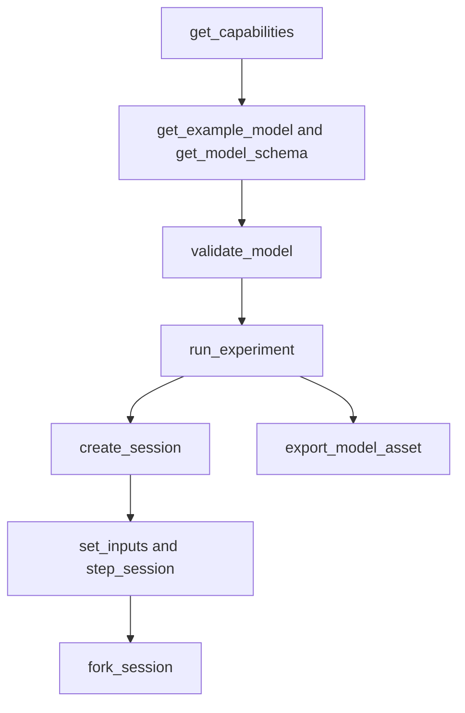

# Agent interface

**English** · [简体中文](AGENT_API.zh-CN.md) · [Français](AGENT_API.fr.md) · [Русский](AGENT_API.ru.md) · [日本語](AGENT_API.ja.md) · [한국어](AGENT_API.ko.md) · [Deutsch](AGENT_API.de.md) · [Español](AGENT_API.es.md) · [Italiano](AGENT_API.it.md) · [Português](AGENT_API.pt-BR.md)

`Power.Core`, `Power.Agent` and MCP are different entrances to one physics core. The API is not bound to a GPT version or a model vendor. Read the version, capabilities and schema, then generate a model. A familiar name does not mean that component is implemented.

The [finite gas network](GAS_NETWORK.md) is available through JSON, CLI and MCP, with gas composition, controlled restrictions, fixed reservoirs, wall heat links and conservation channels retained in portable assets. Existing linear and sealed-cylinder model semantics remain unchanged.

The [coupled clutch component](CLUTCH_NETWORK.md) is available through the shared
JSON, experiment and session contracts. It includes bounded engagement inputs, static
and sliding capacities, signed ratios, phase/heat outputs and transactional internal
events. The standalone [exact pair](CLUTCH_PHYSICS.md) remains a verification reference.

The [ideal gear/planetary components](GEAR_NETWORK.md) participate in the shared solver
and document contracts. `ideal_gear` has A/B ports and a signed nonzero ratio;
`planetary_gear` has sun/ring/carrier ports A/B/C and a ring/sun tooth ratio greater than
one. Compatible initial speeds and independent permanent constraints are required.
Capabilities describe rank policy, solver tolerances and mean reaction outputs.

The [hydraulic piston contract](HYDRAULIC_PISTON.md) adds `translational` nodes,
`linear_spring`, `hydraulic_piston`, `piston_clutch` and `force_source`. Agents can
observe displacement, velocity, pressure force, pad energy/force, clutch capacities
and cumulative damping heat. A piston clutch has no engagement input: command its
fill/drain valves and inspect pad contact. `get_capabilities.hydraulic_piston`
describes SI units, the volume/work convention, solver scope and negative-pressure
recovery. Model validation returns actionable unit, range and connection errors;
session revision, cancellation and independent-fork contracts apply unchanged.

`hydraulic_spool_valve` references a piston component and explicit closed/full-open
positions. Its opening follows actual motion; it accepts no opening command or
initial-input override. Flow, loss and opening are observable through the shared
model/session contract. `get_capabilities.hydraulic_spool_valve` declares the
position/flow units, simultaneous solve and omitted jet-force physics. Request
`spool-regulated-pump` to inspect mechanical pressure regulation; see
[the metering contract](HYDRAULIC_SPOOL.md).

`gas_piston` links a translational node to a moving gas chamber with explicit area,
reference volume/position, absolute reference pressure and signed compression
direction. Observe gas mass, energy, pressure, temperature, volume, force and
reference work. Combine it with a hydraulic piston on the same mass for an
accumulator; use explicit gas ports/heat links for transport. Validation checks one
volume owner and positive nominal gas volume. Capabilities declare the quarter-volume
interval limit; the contract states the wall-coupled accuracy boundary. Request `gas-accumulator-pump`;
see [the gas/fluid contract](GAS_PISTON.md).

`gas_fuel_injector` connects compatible finite tracked source/receiver gas volumes
and an explicit timing crank. Its input is requested kg per cycle; observe the
latched request, delivered cycle/total fuel and mean delivered flow. Mid-window
input changes apply to the next observed cycle. Backpressure/starvation can cause
underdelivery without an execution error; use output evidence and KPIs. Capabilities
declare timing, dose and scope boundaries. Request `metered-fired-cylinder`; see
[the metering contract](FUEL_METERING.md). This is gaseous admission, while liquid
spray, evaporation and calibrated fuel/ECU hardware remain open.

## Startup and client configuration

```sh
dotnet run --file tools/Build.cs -- build
dotnet /absolute/path/to/Power!/src/Power.Mcp/bin/Release/net10.0/Power.Mcp.dll
```

A generic MCP client entry. Put it in the client's server configuration and replace the path:

```json
{
  "mcpServers": {
    "power": {
      "command": "dotnet",
      "args": ["/absolute/path/to/Power!/src/Power.Mcp/bin/Release/net10.0/Power.Mcp.dll"]
    }
  }
}
```

Windows uses the same `dotnet` command and an absolute path to the DLL. A production connection should run the built DLL directly, so build output does not mix into the stdio protocol. The server does not need Unity, credentials or a network connection. The first NuGet restore does need a network. Transport and version compatibility come from the pinned official [MCP C# SDK](https://csharp.sdk.modelcontextprotocol.io/v2/concepts/getting-started.html).

## Tools and results

In agent API version 0.29.0, `get_example_model` accepts an optional `name`: `electrothermal` (default), `sealed-cylinder`, `gas-network`, `moving-cylinder`, `crank-timed-cylinder`, `fired-cylinder`, `fired-clutch`, `fired-planetary`, `fired-converter`, `fired-hydraulic`, `fired-pump`, `fired-pump-losses`, `electric-pump`, `pressure-regulated-pump`, `battery-regulated-pump`, `piston-actuated-clutch`, `spool-regulated-pump`, `gas-accumulator-pump`, `metered-fired-cylinder`, `film-fired-cylinder`, `liquid-injected-cylinder`, `needle-actuated-cylinder`, `closure-compensated-cylinder`, `dual-clutch-transmission`, `fired-dual-clutch`, `controlled-dual-clutch`, `controlled-fired-dual-clutch`, `ravigneaux-transmission`, `fired-ravigneaux-converter`, `resolved-ravigneaux-transmission`, `fired-resolved-ravigneaux-converter`, `hydraulic-ravigneaux-transmission` or `fired-hydraulic-ravigneaux`. `get_capabilities` advertises supported fidelity levels, readable asset versions, solver limits and input bounds. Exports use `power.asset.v24`; v1–v23 assets remain readable. Output channels and their units are returned by model validation and session creation. Passing laboratory KPIs does not establish a complete or calibrated powertrain.

| Tool | Purpose |
|---|---|
| `get_capabilities` | Version, model capabilities, size limits, time semantics and the workflow |
| `get_model_schema` | The complete `power.model.v1` JSON Schema |
| `get_example_model` | An editable example with events and KPIs |
| `validate_model` | Check the model and experiment. Returns the fingerprint, channels and diagnostics, and does not step time |
| `run_experiment` | Full experiment, two replays with different batch sizes, KPIs and provenance. The result is compact by default |
| `export_model_asset` | Validate and export a `.powerasset`. Returns Base64 content, the file digest, provenance and the model fingerprint |
| `create_session` | Create an independent interactive simulation. Returns the initial snapshot and channel metadata |
| `read_snapshot` | Current time, revision, hash and selected output channels |
| `set_inputs` | Atomically submit an input frame at the current time and advance the session revision |
| `step_session` | Atomically advance a requested number of nanoseconds. Cancellation is supported. The revision advances |
| `fork_session` | Copy the current physical state into a new branch at revision 0 |
| `close_session` | Release one session |

Every tool has an input schema and an output schema. Success and domain errors both return `structuredContent` and a compatible text result. MCP `isError` corresponds to `ok=false`. See [structured tool results in the SDK](https://csharp.sdk.modelcontextprotocol.io/v2/concepts/tools/tools.html).

```json
{"schema":"power.agent.v1","ok":true,"data":{"revision":"2","time_ns":"1000000000","state_hash":"...","values":[]}}
```

```json
{"schema":"power.agent.v1","ok":false,"error":{"code":"revision_conflict","message":"Read the snapshot, then use its current revision.","retryable":true,"current_revision":"2"}}
```

See the [model schema](../schemas/power.model.v1.schema.json) and the [response schema](../schemas/power.agent.v1.schema.json). The model schema checks structure. The compiler then checks dimensions, topology, positive values, finite values and the numerical system. Experiment validation checks tick alignment, event order, channels and KPI bounds.

## Operation sequence



1. Call `get_capabilities` and confirm the physical components you need are supported.
2. Get an example and the schema, then build a `document` object. Parameters must carry units.
3. `validate_model({"document": ...})`. Repair the model from `error.object_id`, `error.field` and `error.code`.
4. `run_experiment({"document": ...})`. Check `data.passed`, `checks`, `replay` and `model.calibration`. `ok=true` only means the experiment finished. KPIs can still fail.
5. `create_session` with the same document. Keep `session_id`, the initial `revision` and the channel map.
6. For example, `set_inputs({"session_id":"...","expected_revision":"0","values":[{"channel":"100","value":24}]})`, then read the revision that comes back.
7. `step_session({"session_id":"...","expected_revision":"1","delta_ns":"1000000000"})` returns the snapshot one second later.
8. `fork_session({"session_id":"...","expected_revision":"2"})`. Brake the child at 4 V and keep the parent as the control.
9. After the comparison, `close_session` each one with its own latest revision.

To inspect the model in Unity, call `export_model_asset({"document": ..., "name": "My laboratory"})`. Base64-decode `data.content`, check `data.asset_sha256` against the whole file, save it as a `.powerasset` under Unity `Assets`, and open it with **Open in Studio** in the asset Inspector. The tool returns content only. It does not write a local file. A successful export means the data is valid. KPIs and calibration are separate checks. Format and limits are in [model assets](ASSET_FORMAT.md).

Revisions start at 0. Each successful input commit and each successful step adds 1. A stale, invalid or cancelled operation does not add a revision. A fork leaves the parent revision unchanged. After any transport interruption, read the snapshot and use that revision. Do not resend a write that still carries the old revision.

`time_ns`, `revision` and channel IDs in a session snapshot are strings, so they stay exact past the JavaScript integer limit. Experiment time in a model document is at most one hour. Model input channels are integers today. Choose IDs no larger than `2^53-1` if another JSON client must keep them exact. High namespace IDs in outputs stay strings, unchanged.

`channels` on `read_snapshot` is an array of output-ID strings. Omit it to return every output. Input channels and duplicate fields are rejected. `include_samples=true` is what makes an experiment return every sample boundary.

## Errors and repair

| Error | Next step |
|---|---|
| `model_unit` / `model_connection` / `model_range` | Repair the unit, reference or parameter on that object and field |
| `invalid_argument` / `invalid_json` | Fix the field, event order, time or document structure |
| `unknown_channel` / `invalid_input` | Pick an input from the channel table and remove duplicates and non-finite values |
| `invalid_time_step` | Use a positive integer tick count, at most one million ticks per call |
| `numerical_failure` | Check parameter scale, inputs and the step. The current state was not modified |
| `revision_conflict` | Read the latest snapshot, then decide from that state |
| `cancelled` | The whole batch rolled back. Retry with a smaller batch |
| `session_capacity` | Close sessions you no longer need |
| `unknown_session` | The process restarted or the session was closed. Create it again and replay |

A session is an in-process object. It is not persisted, and it does not attach to a running Unity scene. The MCP interface currently runs headless experiments on the same core. A later Unity connection still has to keep the revision, time and atomicity contracts.

## Adding a component

Write the equations and the scope, define ports and parameters with units, implement them in the core, and take evidence from an analytic solution, conservation, step convergence and failure tests. Then add the schema and capability discovery, ship a replayable experiment, and connect a Unity view. Measured provenance and uncertainty are recorded on their own. A passing test does not mean the model is calibrated.

## Gas-network workflow

Request `gas-network`, validate it, then run the experiment and export its asset using
the existing tools. `power.model.v1` gains additive gas node/component definitions;
clients should discover them from the schema and capabilities. No tool names change.
Gas volumes consume two scalar states each, and connected volumes must share R and gamma.

`gas_orifice` inputs use `fraction` values in [0, 1]. A missing or zero input channel
keeps the explicit `initial_input` fixed. Validation and export reject out-of-range
scheduled values before any experiment executes. Interactive rejection preserves both
state and revision. Compilation, successful execution, KPI success and calibration
remain distinct: the example is synthetic and `unverified`.

Gas-only session operations use the same nanosecond times, revision checks, cancellation,
filtered snapshots and independent forks. Sessions start from component initial inputs;
`create_session` does not execute the experiment's event schedule. Use `run_experiment`
or portable playback for that schedule. Static validation cannot guarantee a future
state remains numerically solvable: on `numerical_failure`, reduce `step_ns` and inspect
flow area, volume, conductance and initial conditions before recreating the session.

## Moving-cylinder workflow

`get_example_model({"name":"moving-cylinder"})` returns an uncalibrated motoring
experiment with two time-controlled restrictions, crank pressure work and wall transfer.
Gas nodes without `storage` must connect to exactly one `gas_cylinder`, whose parameters
supply the geometry. The compiler validates ownership and derives initial mass/energy
from the gas node's pressure/temperature and the crank's initial geometry.

Capabilities advertise `moving_cylinder_gas_exchange`, the 0.25-rad crank bound and the
split integration scope. Gas states remain channels on the gas node; volume, displacement
and torque are channels on the gas-cylinder component. The experiment, export, session,
revision and failure contracts are unchanged. See [moving cylinders](MOVING_CYLINDER.md).
Time-scheduled restrictions do not establish crank-angle valve timing or combustion.

## Crank-timed valve workflow

`get_example_model({"name":"crank-timed-cylinder"})` returns a 720-degree motoring
experiment with variable speed, intake/exhaust profiles and wall heat. `valve_timing`
on a `gas_orifice` requires a rotational `crank_node` and unit-bearing `cycle_angle`,
`open_angle` and `duration_angle`. The capability object advertises cycles, profile,
limits and recovery. See [the timing contract](VALVE_TIMING.md).

Timed input channels represent `peak_opening` in [0, 1]; the observable
`effective_opening` is derived from actual crank angle. Use KPI field `opening` to check
it. A stopped crank can remain open; reverse motion retraces the same profile. Phase
is explicit, independent of cylinder geometry phase. A scheduled peak change scales
the lobe; it does not replace crank timing.

Validation checks topology and parameters but does not guarantee runtime resolution.
On `numerical_failure`, reduce `step_ns` so angle travel and endpoint-speed travel stay
within `min(0.25 rad, duration_angle/8)`, then recreate the session. The entire failed
batch preserves inputs, state and revision. Asset v11 retains the profile and v1–v10
compatibility. The new fidelity is `crank_timed_gas_exchange`; successful execution,
passing KPIs and calibration remain distinct.

## Premixed-combustion workflow

`get_example_model({"name":"fired-cylinder"})` returns a premixed fired cylinder driving
an external load. The `combustion` capability declares the Wiebe prescription, fuel/air/
product classes, input range, forward-history behavior and numerical limits. Gas nodes
specify `gas.premixed`, and their reservoir restrictions specify explicit
`reservoir_fractions`. The compiler rejects missing fractions, incompatible connected
mixtures and multiple burn components on one chamber.

`premixed_combustion` connects a rotational `node_a` to a premixed-gas `node_b`, with
explicit cycle/start/duration angles, shape exponent and burn coefficient. Its optional
input channel scales the burn hazard through `burn_multiplier` in [0,1]. Zero disables
burning but does not stop fuel arriving at an open inlet. Forward angles beyond the
recorded frontier consume fuel; stopping/reversal/retracing cannot repeat heat release.

Discover constituent masses, chemical energy, cumulative fuel burned, heat released
and `burn_frontier_angle` from the channel table. Global fuel/fresh-air residuals supplement total mass and energy.
`reservoir_enthalpy` includes transported chemical energy for premixed gases, and
`net_fuel_energy_in` exposes that part separately. Gas internal energy remains thermal.
The report fidelities are `premixed_gas_transport` or `premixed_wiebe_combustion`; both
remain `unverified`.

On a burn-resolution failure, reduce `step_ns` and recreate the session. Enabled burning
requires crank travel and endpoint-speed travel no greater than
`min(0.25 rad, burn duration/32)`; heat per tick is limited to 25% of pre-burn thermal
energy. Whole-call rollback and revision contracts remain unchanged. A valid model can
still fail a runtime bound; successful execution can still fail KPIs. See
[PREMIXED_COMBUSTION.md](PREMIXED_COMBUSTION.md) for equations and limitations.

## Clutch workflow

`get_example_model({"name":"fired-clutch"})` returns a fired engine, separate load,
clutch and heat sink, with exact-tick engagement/release events. `clutch` capabilities
declare input bounds, solver budgets, mode codes and output-history semantics. Define
`parameters.static_capacity` and `sliding_capacity` in Nm, plus a signed nonzero `ratio`.
The compiler enforces `static >= sliding >= 0`, rotational endpoints and a thermal loss
sink. Ground brakes use omitted/zero `node_b` and ratio one.

The `engagement` input lies in `[0,1]`; zero disengages. Discover current relative slip,
last accepted phase, last-tick mean torque/heat power and cumulative friction heat from
the channel table. Phases are 0 disengaged, 1 locked, 2 positive slip and 3 negative slip.
Updating engagement does not rewrite the preceding tick's mean outputs or phase.
The fidelity `hybrid_clutch_powertrain` identifies models containing this component;
it does not imply a complete transmission or calibrated vehicle.

Use `run_experiment` to evaluate KPI and replay evidence, or session tools to vary
engagement while preserving revision checks and independent branches. On numerical
failure, reduce `step_ns` and inspect inertia/ratio scaling, redundant constraints and
capacity schedules. The failed/cancelled call commits no inputs, phases, heat or physical
state. Breakaway under changing loads uses interval-average demand; timestep refinement
is required near transitions. See [CLUTCH_NETWORK.md](CLUTCH_NETWORK.md).

## Ideal transmission workflow

Request `fired-planetary` to obtain a synthetic engine, ring brake, sun/ring clutch,
planetary set and final drive. The scheduled upshift/downshift uses the same exact-tick
semantics as other experiments, with 84 matching replay boundaries. `node_c` is the
planetary carrier; gears accept only their rotational ports and `parameters.ratio`.

`slip_speed` and `constraint_error` expose current speed and phase residuals. `torque`,
`torque_at_b` and planetary-only `torque_at_c` are mean reactions on the corresponding
rotors over the last complete tick. They start at zero and are not rewritten by boundary
input changes. Initial-speed failures return `model_connection` with field `initial_speed`;
dependent constraint rows return `model_solver` with field `gear.constraints`.
Correct topology or initial conditions rather than retrying unchanged data.

Asset v11 retains all prior readers, including an authentic v7 fired-clutch fixture.
This model establishes a synthetic transmission path, not complete DCT/AT, hydraulic
actuation, TCU behavior or measured calibration. Actual Unity evidence remains separate.

## Converter workflow

Request `fired-converter` for a synthetic engine, mapped fluid path, separate lockup,
planetary shift and thermal sink. Capabilities advertise all four required signed maps,
point/component limits, reference-member convention, nonlinear iteration budgets,
observable semantics and runtime recovery. The fidelity is
`quasisteady_converter_powertrain`; passing the 87 replay boundaries establishes
numerical consistency, not measured transmission performance.

`torque_converter` requires pump/turbine `node_a`/`node_b`, optionally `heat_node`, and
four explicit map arrays under `parameters`. Each point has dimensionless speed and
torque ratios and a coefficient in `nm_s2_rad2`. No map, reverse quadrant, input channel
or stator-rotor port is inferred. Compilation checks interpolation passivity and map
continuity, reporting `converter.<map>` or `converter.counter_rotation` with the object ID.

Discover mean pump/turbine/stator torques, fluid heat power, cumulative fluid heat,
current signed speed ratio and driver code from channels. A parallel `clutch` supplies
lockup engagement. The session revision, cancellation, branch independence and complete
rollback contracts also cover converter histories. On `numerical_failure`, reduce
`step_ns` and inspect map slopes, inertia/speed scales and clutch constraints. See
[the equations, bounds and evidence](CONVERTER_NETWORK.md). Exports use asset v11;
authentic prior fixtures preserve v1–v10 compatibility. Automatic hydraulic control and actual
Unity Editor/Player validation remain separate unfinished work.

## Hydraulic workflow

Request `fired-hydraulic` for valve-controlled pressure chambers operating shift and
lockup clutches. The `hydraulics` capability exposes gauge-pressure convention, storage
and flow models, units, iteration limits, pressure tolerance, actuator scope and recovery.
The fidelity is `compliant_hydraulic_powertrain`; calibration remains `unverified`.

A hydraulic node requires positive compliance `storage` in `m3_pa` and nonnegative
initial gauge pressure. `hydraulic_resistance` and `hydraulic_orifice` require explicit
flow coefficients and valve opening; an orifice additionally needs a positive transition
pressure. Reservoir endpoints require an explicit `reservoir_pressure`. A missing or
zero input channel fixes the supplied opening. The compiler never infers fluid properties,
leakage, reservoir pressure or an OEM map.

`hydraulic_clutch` has rotational ports and geometry under `parameters`, including its
hydraulic `pressure_node`. It has no engagement input. Discover pressure, stored reference
volume, hydraulic boundary work, inventory residual, restriction heat, clamp force and
current friction capacities alongside the existing clutch history channels. Valve input
changes preserve stored pressure and last-tick means until accepted stepping advances them.

The complete state, revision, cancellation and branch contracts cover hydraulic pressure
and ledgers. On numerical failure, reduce `step_ns` and inspect compliance, coefficients,
gauge pressures and actuator geometry. Negative final pressure rejects the entire batch;
it is not silently clamped. See [HYDRAULIC_NETWORK.md](HYDRAULIC_NETWORK.md). Asset v11
retains pressure boundaries, flow laws and actuator geometry; all v1–v10 readers remain.
Measured loss/control maps, measured valve/accumulator dynamics, full ECU/TCU control and actual Unity acceptance remain open.

## Pump supply workflow

Request `fired-pump` for a crank-driven pump, compliant line, relief and pressure-operated
transmission. Capabilities expose `hydraulic_pump`, displacement units, inlet convention,
joint-solver limits and signed work semantics. Pump `hydraulic_work` is internal
shaft-to-fluid transfer; global `hydraulic_work` remains external reservoir work.
This example has zero external hydraulic work and explicit initial stored pressure.

`hydraulic_pump` requires shaft/outlet ports, explicit `parameters.inlet_node`, positive
`displacement` in `m3_rad`, and a reservoir pressure only for inlet zero. The relief
requires conductance and cracking pressure, with no input channel. Missing or wrong-domain
ports, dimensions and irrelevant parameters produce actionable validation errors.
Asset v11 retains both definitions. Revisions, cancellation, forks, complete rollback and
KPI/calibration distinctions remain unchanged. See [HYDRAULIC_PUMP.md](HYDRAULIC_PUMP.md).

## Pump assembly workflow

Request `fired-pump-losses`, `electric-pump`, `pressure-regulated-pump` or `battery-regulated-pump`. The `pump_assembly` capability gives
the net-flow/reaction equations, loss units, component composition and electrical
supply boundary. Models contain ordinary pump, resistance and shaft records; the
electric example adds the existing RL motor. No new component kind, schema or asset
version is required. Core clients can use `HydraulicPumpAssembly.CreateComponents`
with their own stable IDs to produce the same graph definitions.

Leakage is an explicit outlet-to-inlet resistance with coefficient in `m3_s_pa`;
shaft friction is a grounded, zero-stiffness shaft with damping in `nm_s_rad`.
Both require supplied values and explicit heat routing. An electric pump accepts
motor voltage through a `v` input, with back EMF, current and copper heat in the
shared solve. It does not infer a battery, efficiency, viscosity, controller or
calibration. Discover channels rather than interpreting ideal pump branch flow as
net assembly delivery. Existing revisions, cancellation, forks and complete batch
rollback apply to the entire composition.

## Pressure feedback workflow

Request `pressure-regulated-pump`. Capabilities advertise the `pressure_controller`
component, dimensional gains, sensor/target requirements, integer sampling, clamping
and transaction semantics. Validate, run and export with the existing tools. Asset v12
retains the full controller definition and all previous readers remain supported.

The example's `105` input changes pressure setpoint in SI Pa. The motor's voltage
channel `100` is owned by the controller and absent from writable channels. Direct
writes return `controlled_input` with guidance to write `pressure_setpoint`; rejection
changes neither state nor revision. Negative pressure targets are rejected. Static
validation detects conflicting owners, wrong domains/units and misaligned sample periods.

Read `sampled_pressure`, `pressure_error`, `integral_voltage` and `command_voltage`
through the discoverable output IDs. These are last-sample state and held command.
Snapshot timestamps identify the clock phase. Input changes do not advance control
history; the next due sample updates it at a physical tick. Forks include integral
memory and clock phase. Cancellation or later arithmetic/solver failure commits no
part of the batch. Overflow recovery requires inspecting gains, targets and integral
scales, rather than retrying identical inputs blindly.

Successful execution and exact replay can accompany failed tracking KPIs when the
actuator saturates. Check `passed` and the error bounds separately from `ok`.
The example's ideal sensor and voltage source are research components; they do not
establish a battery, complete ECU/TCU, calibrated controls or Unity acceptance.

## Battery supply workflow

Request `battery-regulated-pump`. Capabilities expose finite charge, OCV/RC equations,
load and duty rules, control ownership and recovery. Battery node `storage` uses `c`
or `ah`, `initial` is SOC in `fraction`, and `position` is polarization voltage in `v`.
The battery record requires all five electrical parameters. Units, capacity/state
bounds, source ports, heat sinks, increasing OCV and controller periods are validated.

`battery_motor` requires a rotational A port, battery B port and duty input in [-1,1].
`resistive_load` has a battery A port, resistance and opening in [0,1]. The example's
`106` channel changes accessory load; `105` changes pressure setpoint in SI Pa.
Duty `100` is owned by `pressure_duty_controller` and cannot be written directly.
Its gains use `fraction_pa` and `fraction_pa_s`; output bounds are dimensionless.

Read `state_of_charge`, `charge`, `battery_current`, `terminal_voltage`,
`polarization_voltage`, battery stored energy and heat alongside `integral_duty`
and `command_duty`. Voltage/current/load-power channels are instantaneous algebraic
observables, so valid duty/load changes can alter them without changing stored states.
Battery work is internal; global `source_work` includes only explicit external power
boundaries. SOC/voltage violations reject the whole batch. Inspect initial charge,
capacity, duty, loads and batch length before retrying. There is no silent SOC clamp.

Asset v22 retains all supply/control parameters with authentic prior readers/fixtures.
Cancellation and later failure preserve charge, RC/control memory, inputs and revision.
Independent forks compare accessory/duty strategies from the same physical history.
All parameters remain unverified; an ideal averaged duty converter is not a battery
BMS, PWM/current loop, complete vehicle electrical system or calibration.

## Liquid film workflow

Request `film-fired-cylinder`. The `fuel_film` capability declares finite gas/wall
ports, phase-energy reference, units, split accuracy and scope. Supply explicit
initial liquid inventory, temperature, specific heat, saturation temperature,
latent internal energy and conductance. Validate and discover output IDs before
running or exporting the model. Films don't expose a writable input channel.

Read remaining `mass`, signed `internal_energy`, `chemical_energy`,
`evaporated_fuel_mass`, last-tick mean `mass_flow`, cumulative `film_wall_heat` and
instantaneous `heat_flow` alongside receiver fuel and reaction heat. Dry films
report the declared saturation temperature and zero heat flow. Actual vapor
availability governs reaction; a valid film definition doesn't imply evaporation
or passing heat-release KPIs.

Asset v18 retains phase quantities and earlier readers. Revision checks,
cancellation, independent forks and late-failure rollback include all liquid,
thermal, constituent and compensated histories. Wrong units/ports, superheated
initial liquid and excess state counts return structured errors. Inspect the
reported object/field and the finite heat budget before retrying a failed model.
The [film contract](FUEL_FILM.md) records the equations and accuracy boundary.
Initial wetting doesn't establish liquid injection, calibrated fuel properties,
complete engine control or actual Unity acceptance.

## Finite liquid injection workflow

Request `liquid-injected-cylinder`. The `liquid_fuel_injector` capability declares
the finite compliant source, `kg` cycle input, density/compliance units, energy
ledger and receiver boundary. Supply all rail quantities, nozzle geometry and an
existing film/crank reference. Validate first and discover output IDs/units.

The example's `104` input requests kg per cycle. Changes latch at a later observed
forward window; current delivery may remain limited by source pressure. Read rail
`mass`, `pressure`, stored `internal_energy`, chemical energy and volume beside
`requested_fuel_dose`, `delivered_fuel_dose`, `total_fuel_delivered` and last-tick mean
`mass_flow`. Film mass/temperature/evaporation and separate reaction heat identify
the delay between accepting a dose and actual vapor combustion.

Component `source_work` is released stored rail pressure work, `hydraulic_work` is
exported receiver pressure work, and `fluid_heat` is nozzle dissipation routed to
the film wall. Their identities are distinct from global external source work.
The negligible-liquid-volume receiver exports displacement work explicitly;
it doesn't add hidden crank work or model spray geometry.

Asset v19 retains complete source, nozzle and timing with v1-v18 readers. Revisions,
cancellation, forks and late/speculative failure include every rail/quota/heat
history. Wrong units, impossible compliant volume, superheated liquid and mismatched
film/crank ownership produce structured diagnostics. Inspect the failed object/field
and pressure/dose boundaries before retrying. Successful tool execution doesn't
imply full delivery, passing KPIs or calibrated hardware. See
[LIQUID_FUEL_INJECTION.md](LIQUID_FUEL_INJECTION.md).

## Physical needle workflow

Request `needle-actuated-cylinder`. Capabilities declare magnetic slope units,
flux energy, actual opening, sampled control and research limits. The injector's
`104` kg command is writable; driver-owned coil voltage `107` is not. Rejected
writes return `controlled_input` with the correct command name/channel and preserve
state/revision. Update requested fuel mass and advance exact physical ticks.

Read actual needle displacement/velocity and injector opening beside coil current,
magnetic energy, copper heat, electrical work, held voltage and last-sample target/
delivery. Fluid can continue after voltage is removed, the window closes or target
delivery is reached. Remaining liquid, gas fuel, unburned/boundary fuel and reaction
stay separately observable. A valid request or successful tool doesn't establish
exact dose delivery or calibrated control.

Asset v20 retains magnetic/stroke/needle/driver tables and v1-v19 readers. Sampling
periods must align to ticks; voltage has one owner; needle, coil and crank references
must match. For solver errors inspect positive `L(x)`, R/L/gradient, stroke travel
and timestep; refine physical/control intervals before claiming dynamic accuracy.
Cancellation, forks and rejected/speculative batches include all flux, thermal,
sampled/held and phase histories. See [NEEDLE_ACTUATION.md](NEEDLE_ACTUATION.md).

## Closure-compensated needle workflow

Request `closure-compensated-cylinder`. Its driver enables an aligned finite
`closure_prediction_ns` horizon. Capabilities give the 4096-tick limit, held-input
assumption and bounded cutoff search. Source kg requests remain writable; voltage
stays driver-owned. Discover predicted mass/count, cutoff latch and pending tick
channels beside actual needle position, delivery and held voltage.

Prediction is a separate full-state plant replay. It holds other commands and
doesn't know future external input events, so inspect actual post-closure delivery
and horizon/timestep refinement rather than treating forecast as measured fuel.
Failed/cancelled prediction commits no part of the real batch. Clock overflow,
invalid horizon or nonmonotone cutoff candidates require revising timing/model
assumptions; partial forecasts aren't silently accepted.

Asset v21 writes the horizon and retains earlier readers. Revisions, independent
forks and whole-batch rollback include the prediction latch and countdown. Core
clients can issue read-only `PredictNeedleClosure`; MCP snapshots expose the last
sampled selected-candidate estimate. Scope and evidence are in
[CLOSURE_PREDICTION.md](CLOSURE_PREDICTION.md).

## Dual-clutch power-path workflow

Request `dual-clutch-transmission` or `fired-dual-clutch`. Capabilities describe
the ordinary seven-forward/reverse graph, two input paths, three output branches
and research limits. Validate and discover every gear reaction, clutch slip/mode/
heat and rotor speed before changing selector/drive commands.

The examples use drive channels `500`/`501` and selector channels `600`-`607`
for forward 1-7 and reverse. Commands are fractions; ratios remain permanent
constraints. Preselect an unloaded path by releasing its prior selector and
engaging the target, then coordinate drive-clutch handoff separately. Core's
`DualClutchGraph.SelectPath` produces that path's atomic selector command set.
It doesn't implement TCU sensing, interlocks or actuator dynamics.

Snapshots expose all free/selected hubs, input/output speeds, synchronization and
drive heat, gear phase error and global source/energy/fuel evidence. Unsafe
combinations can bind or brake the physical transmission; a successful input
write doesn't establish a valid shift. Revision checks, cancellation, independent
forks and late failure preserve every state/history. Existing portable format
and prior readers are retained. See
[DUAL_CLUTCH_TRANSMISSION.md](DUAL_CLUTCH_TRANSMISSION.md).

## Sampled DCT control workflow

Request `controlled-dual-clutch` or `controlled-fired-dual-clutch`. Write an
integral `requested_gear` to channel `700`: 1-7 forward, -1 reverse, 0 neutral.
The controller owns drive `500`/`501` and selectors `600`-`607`; direct writes
return `controlled_input` with the correct requested-gear channel. Fractional
gears are invalid and don't alter state/revision.

Read confirmed actual gear, commanded selections, phase, target selector slip
and fault. Requested gear doesn't imply completed shift. The state machine
preselects unloaded paths, confirms physical lock, uses staged torque-interrupted
handoff and exposes timeout/direction/persistent-lock faults. Neutral aborts on a
due sample; another target can recover a fault. A transient slip can report
unconfirmed actual gear while the controller monitors its duration.

The explicit reported-state limit is 128, with 32 nodes/64 components unchanged.
Actual fired/controller composition and near/over-limit checks are verified;
Standard checks still run on .NET 10 and aren't Unity evidence. Asset v22 retains
immutable routes and timed state with prior readers. Cancellation, forks, late
failure and compensated coordinate history remain whole-batch transactions.
Full ECU torque blending, actuators and calibration remain separate requirements.
See [DCT_CONTROL.md](DCT_CONTROL.md).

## Compound planetary paths

`double_pinion_planetary_gear` requires sun/ring/carrier ports A/B/C and ratio
`k > 1`. Its constraint is `sun - k ring + (k-1) carrier = 0`. Existing
`planetary_gear` retains its single-pinion sign. Both expose speed/phase residuals
and all three reaction torques. Incompatible initial speeds, wrong domains,
redundant rows and incomplete carriers return actionable compile errors.

Request `ravigneaux-transmission` or `fired-ravigneaux-converter` for explicit
five-element research schedules, converter/lockup integration and complete
physical replay. Engagement inputs are fractions; a successful command does not
prove a locked range. No AT controller owns these prescribed inputs. Asset v23
retains topology and reads v1-v22. See [RAVIGNEAUX_TRANSMISSION.md](RAVIGNEAUX_TRANSMISSION.md).

## Carrier-relative meshes and internal planet dynamics

`carrier_gear` requires distinct rotational A/B/C ports, finite nonzero signed
ratio and compatible initial speeds. The constraint is
`A - ratio B + (ratio-1) C = 0`; negative external and positive internal ratios,
including one, are supported. C is an actual moving carrier with its own reaction
torque, not an implicit ground. Channels expose all three mean torques and
speed/phase residuals. Zero ratios, missing carriers, wrong domains and dependent
constraints return typed compile errors.

Request `resolved-ravigneaux-transmission` or
`fired-resolved-ravigneaux-converter`. Both retain four physical meshes, two
absolute planet-spin states and declared orbital inertia in the carrier.
Plain rotor storage includes their actual kinetic energies; inputs remain
prescribed engagement fractions, not full AT control. The flat graph records
aggregate inertias and ratios, while source descriptions retain the declared
geometry/masses that generated them. Asset v24 includes this primitive and
reads v1-v23. See [RESOLVED_PLANETS.md](RESOLVED_PLANETS.md).

## Pump-fed AT piston actuation

Request `hydraulic-ravigneaux-transmission` or `fired-hydraulic-ravigneaux`.
Use explicit fill/drain fractions on 700/701 through 708/709; the fired lockup
uses 710/711. Previous range engagement IDs are absent. Validate/discover channels
before writing. Piston pressure/travel/contact determine capacities; a command
accepted by the API does not confirm physical lock.

Reports retain line/chamber pressure, travel, contact capacity, pump work, swept
volume, friction/restriction/damping heat and every model hash. Full revisions,
cancellation, late rollback and independent valve-release forks use the ordinary
contracts. The graph uses existing asset v24 records, not a new serialization
format. See [AT_HYDRAULIC_ACTUATION.md](AT_HYDRAULIC_ACTUATION.md).
