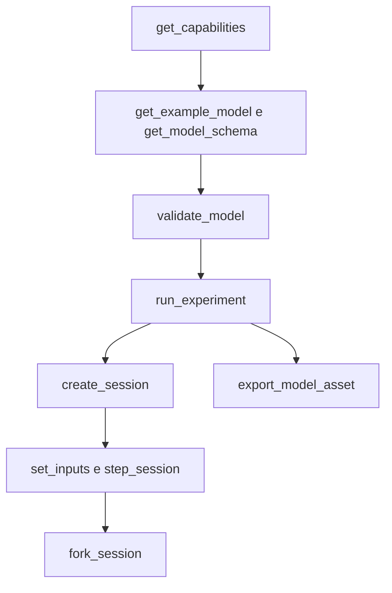

# Interface de agente

[English](AGENT_API.md) · [简体中文](AGENT_API.zh-CN.md) · [Français](AGENT_API.fr.md) · [Русский](AGENT_API.ru.md) · [日本語](AGENT_API.ja.md) · [한국어](AGENT_API.ko.md) · [Deutsch](AGENT_API.de.md) · [Español](AGENT_API.es.md) · [Italiano](AGENT_API.it.md) · **Português**

`Power.Core`, `Power.Agent` e o MCP são entradas diferentes para um único núcleo físico. A API não está presa a uma versão de GPT nem a um provedor de modelos. Leia a versão, as capacidades e o esquema, e então gere um modelo. Um nome familiar não significa que esse componente esteja implementado.

A [rede finita de gás](GAS_NETWORK.pt-BR.md) está disponível por JSON, CLI e MCP, com composição do gás, restrições controladas, reservatórios fixos, elos de calor de parede e canais de conservação retidos em assets portáteis. A semântica existente dos modelos lineares e de cilindro fechado permanece inalterada.

O [componente de embreagem acoplado](CLUTCH_NETWORK.pt-BR.md) está disponível pelos contratos compartilhados de JSON, experimento e sessão. Ele inclui entradas limitadas de engate, capacidades estática e de deslizamento, relações com sinal, saídas de fase/calor e eventos internos transacionais. O [par exato](CLUTCH_PHYSICS.pt-BR.md) isolado continua uma referência de verificação.

Os [componentes de engrenagem/planetária ideais](GEAR_NETWORK.pt-BR.md) participam do solver compartilhado e dos contratos de documento. `ideal_gear` tem portas A/B e uma relação não nula com sinal; `planetary_gear` tem portas sol/coroa/porta-planetas A/B/C e uma relação de dentes coroa/sol maior que um. Velocidades iniciais compatíveis e restrições permanentes independentes são exigidas. As capacidades descrevem a política de posto, as tolerâncias do solver e as saídas de reação média.

O [contrato do pistão hidráulico](HYDRAULIC_PISTON.pt-BR.md) acrescenta nós `translational`, `linear_spring`, `hydraulic_piston`, `piston_clutch` e `force_source`. Os agentes podem observar deslocamento, velocidade, força de pressão, energia/força da pastilha, capacidades da embreagem e calor acumulado de amortecimento. Uma embreagem de pistão não tem entrada de engate: comande suas válvulas de enchimento/drenagem e inspecione o contato da pastilha. `get_capabilities.hydraulic_piston` descreve unidades SI, a convenção de volume/trabalho, o escopo do solver e a recuperação de pressão negativa. A validação do modelo retorna erros acionáveis de unidade, intervalo e conexão; os contratos de revisão de sessão, cancelamento e ramificação independente se aplicam sem mudança.

`hydraulic_spool_valve` referencia um componente de pistão e posições explícitas de fechado/totalmente aberto. Sua abertura segue o movimento real; ela não aceita comando de abertura nem substituição de entrada inicial. Escoamento, perda e abertura são observáveis pelo contrato compartilhado de modelo/sessão. `get_capabilities.hydraulic_spool_valve` declara as unidades de posição/escoamento, a solução simultânea e a física de força de jato omitida. Solicite `spool-regulated-pump` para inspecionar a regulação mecânica de pressão; veja [o contrato de dosagem](HYDRAULIC_SPOOL.pt-BR.md).

`gas_piston` liga um nó translacional a uma câmara de gás móvel, com área explícita, volume/posição de referência, pressão absoluta de referência e direção de compressão com sinal. Observe massa, energia, pressão, temperatura, volume, força e trabalho de referência do gás. Combine-o com um pistão hidráulico na mesma massa para um acumulador; use portas de gás/elos de calor explícitos para transporte. A validação confere um único dono de volume e volume nominal positivo de gás. As capacidades declaram o limite de intervalo de um quarto de volume; o contrato declara a fronteira de precisão do acoplamento de parede. Solicite `gas-accumulator-pump`; veja [o contrato gás/fluido](GAS_PISTON.pt-BR.md).

`gas_fuel_injector` conecta volumes compatíveis de gás rastreado e finito de fonte/receptor e um virabrequim explícito de temporização. Sua entrada é kg solicitados por ciclo; observe a solicitação travada, o combustível entregue no ciclo/total e a vazão média entregue. Mudanças de entrada no meio da janela se aplicam ao próximo ciclo observado. Contrapressão/falta de suprimento podem causar subentrega sem erro de execução; use a evidência de saída e os KPIs. As capacidades declaram fronteiras de temporização, dose e escopo. Solicite `metered-fired-cylinder`; veja [o contrato de medição](FUEL_METERING.pt-BR.md). Isto é admissão gasosa, enquanto pulverização líquida, evaporação e hardware calibrado de combustível/ECU continuam abertos.

## Inicialização e configuração do cliente

```sh
dotnet run --file tools/Build.cs -- build
dotnet /absolute/path/to/Power!/src/Power.Mcp/bin/Release/net10.0/Power.Mcp.dll
```

Uma entrada genérica de cliente MCP. Coloque-a na configuração de servidor do cliente e substitua o caminho:

```json
{
  "mcpServers": {
    "power": {
      "command": "dotnet",
      "args": ["/absolute/path/to/Power!/src/Power.Mcp/bin/Release/net10.0/Power.Mcp.dll"]
    }
  }
}
```

O Windows usa o mesmo comando `dotnet` e um caminho absoluto para a DLL. Uma conexão de produção deve executar a DLL compilada diretamente, para que a saída de compilação não se misture ao protocolo stdio. O servidor não precisa de Unity, credenciais nem conexão de rede. A primeira restauração NuGet precisa de rede. Transporte e compatibilidade de versão vêm do [MCP C# SDK](https://csharp.sdk.modelcontextprotocol.io/v2/concepts/getting-started.html) oficial fixado.

## Ferramentas e resultados

Na versão 0.32.0 da API de agente, `get_example_model` aceita um `name` opcional: `electrothermal` (padrão), `sealed-cylinder`, `gas-network`, `moving-cylinder`, `crank-timed-cylinder`, `fired-cylinder`, `fired-clutch`, `fired-planetary`, `fired-converter`, `fired-hydraulic`, `fired-pump`, `fired-pump-losses`, `electric-pump`, `pressure-regulated-pump`, `battery-regulated-pump`, `piston-actuated-clutch`, `spool-regulated-pump`, `gas-accumulator-pump`, `metered-fired-cylinder`, `film-fired-cylinder`, `liquid-injected-cylinder`, `needle-actuated-cylinder`, `closure-compensated-cylinder`, `dual-clutch-transmission`, `fired-dual-clutch`, `controlled-dual-clutch`, `controlled-fired-dual-clutch`, `ravigneaux-transmission`, `fired-ravigneaux-converter`, `resolved-ravigneaux-transmission`, `fired-resolved-ravigneaux-converter`, `hydraulic-ravigneaux-transmission` ou `fired-hydraulic-ravigneaux`. `get_capabilities` anuncia os níveis de fidelidade suportados, as versões de asset legíveis, os limites do solver e os limites de entrada. As exportações usam `power.asset.v27`; assets v1–v23 continuam legíveis. Canais de saída e suas unidades são retornados pela validação do modelo e pela criação da sessão. KPIs de laboratório aprovados não estabelecem um powertrain completo nem calibrado.

| Ferramenta | Finalidade |
|---|---|
| `get_capabilities` | Versão, capacidades do modelo, limites de tamanho, semântica de tempo e o fluxo de trabalho |
| `get_model_schema` | O JSON Schema completo de `power.model.v1` |
| `get_example_model` | Um exemplo editável com eventos e KPIs |
| `validate_model` | Confere o modelo e o experimento. Retorna a impressão digital, os canais e os diagnósticos, e não avança o tempo |
| `run_experiment` | Experimento completo, dois replays com tamanhos de lote diferentes, KPIs e procedência. O resultado é compacto por padrão |
| `export_model_asset` | Valida e exporta um `.powerasset`. Retorna o conteúdo em Base64, o digest do arquivo, a procedência e a impressão digital do modelo |
| `create_session` | Cria uma simulação interativa independente. Retorna o instantâneo inicial e os metadados dos canais |
| `read_snapshot` | Tempo atual, revisão, hash e canais de saída selecionados |
| `set_inputs` | Submete atomicamente um quadro de entrada no tempo atual e avança a revisão da sessão |
| `step_session` | Avança atomicamente um número solicitado de nanossegundos. Cancelamento é suportado. A revisão avança |
| `fork_session` | Copia o estado físico atual para um ramo novo na revisão 0 |
| `close_session` | Libera uma sessão |

Cada ferramenta tem um esquema de entrada e um esquema de saída. Sucesso e erros de domínio retornam `structuredContent` e um resultado de texto compatível. O `isError` do MCP corresponde a `ok=false`. Veja [resultados estruturados de ferramenta no SDK](https://csharp.sdk.modelcontextprotocol.io/v2/concepts/tools/tools.html).

```json
{"schema":"power.agent.v1","ok":true,"data":{"revision":"2","time_ns":"1000000000","state_hash":"...","values":[]}}
```

```json
{"schema":"power.agent.v1","ok":false,"error":{"code":"revision_conflict","message":"Read the snapshot, then use its current revision.","retryable":true,"current_revision":"2"}}
```

Veja o [esquema do modelo](../schemas/power.model.v1.schema.json) e o [esquema de resposta](../schemas/power.agent.v1.schema.json). O esquema do modelo confere a estrutura. O compilador então confere dimensões, topologia, valores positivos, valores finitos e o sistema numérico. A validação do experimento confere alinhamento de tick, ordem dos eventos, canais e limites de KPI.

## Sequência de operação



1. Chame `get_capabilities` e confirme que os componentes físicos de que você precisa são suportados.
2. Obtenha um exemplo e o esquema, e então construa um objeto `document`. Os parâmetros precisam carregar unidades.
3. `validate_model({"document": ...})`. Repare o modelo a partir de `error.object_id`, `error.field` e `error.code`.
4. `run_experiment({"document": ...})`. Confira `data.passed`, `checks`, `replay` e `model.calibration`. `ok=true` só significa que o experimento terminou. Os KPIs ainda podem falhar.
5. `create_session` com o mesmo documento. Guarde `session_id`, a `revision` inicial e o mapa de canais.
6. Por exemplo, `set_inputs({"session_id":"...","expected_revision":"0","values":[{"channel":"100","value":24}]})`, e então leia a revisão que volta.
7. `step_session({"session_id":"...","expected_revision":"1","delta_ns":"1000000000"})` retorna o instantâneo um segundo depois.
8. `fork_session({"session_id":"...","expected_revision":"2"})`. Freie o filho em 4 V e mantenha o pai como controle.
9. Depois da comparação, `close_session` cada um com a sua própria revisão mais recente.

Para inspecionar o modelo no Unity, chame `export_model_asset({"document": ..., "name": "My laboratory"})`. Decodifique `data.content` de Base64, confira `data.asset_sha256` contra o arquivo inteiro, salve-o como `.powerasset` em `Assets` do Unity e abra-o com **Open in Studio** no Inspector do asset. A ferramenta retorna só o conteúdo. Ela não escreve um arquivo local. Uma exportação bem-sucedida significa que os dados são válidos. KPIs e calibração são verificações separadas. Formato e limites estão em [assets de modelo](ASSET_FORMAT.pt-BR.md).

As revisões começam em 0. Cada confirmação bem-sucedida de entrada e cada passo bem-sucedido soma 1. Uma operação obsoleta, inválida ou cancelada não soma uma revisão. Uma ramificação deixa a revisão do pai inalterada. Depois de qualquer interrupção de transporte, leia o instantâneo e use essa revisão. Não reenvie uma escrita que ainda carregue a revisão antiga.

`time_ns`, `revision` e IDs de canal num instantâneo de sessão são strings, para permanecerem exatos além do limite inteiro do JavaScript. O tempo de experimento num documento de modelo é de no máximo uma hora. Os canais de entrada do modelo são inteiros hoje. Escolha IDs não maiores que `2^53-1` se outro cliente JSON precisar mantê-los exatos. IDs de namespace alto nas saídas continuam strings, sem mudança.

`channels` em `read_snapshot` é um array de strings de ID de saída. Omita-o para retornar todas as saídas. Canais de entrada e campos duplicados são rejeitados. `include_samples=true` é o que faz um experimento retornar cada fronteira de amostra.

## Erros e reparo

| Erro | Próximo passo |
|---|---|
| `model_unit` / `model_connection` / `model_range` | Repare a unidade, a referência ou o parâmetro nesse objeto e campo |
| `invalid_argument` / `invalid_json` | Corrija o campo, a ordem dos eventos, o tempo ou a estrutura do documento |
| `unknown_channel` / `invalid_input` | Escolha uma entrada da tabela de canais e remova duplicatas e valores não finitos |
| `invalid_time_step` | Use uma contagem inteira positiva de ticks, no máximo um milhão de ticks por chamada |
| `numerical_failure` | Confira a escala dos parâmetros, as entradas e o passo. O estado atual não foi modificado |
| `revision_conflict` | Leia o instantâneo mais recente e então decida a partir desse estado |
| `cancelled` | O lote inteiro fez rollback. Tente de novo com um lote menor |
| `session_capacity` | Feche sessões de que você não precisa mais |
| `unknown_session` | O processo reiniciou ou a sessão foi fechada. Crie-a de novo e faça replay |

Uma sessão é um objeto no processo. Ela não é persistida e não se liga a uma cena Unity em execução. A interface MCP hoje executa experimentos sem interface no mesmo núcleo. Uma conexão Unity posterior ainda precisa manter os contratos de revisão, tempo e atomicidade.

## Acrescentar um componente

Escreva as equações e o escopo, defina portas e parâmetros com unidades, implemente-os no núcleo e tire evidência de uma solução analítica, de conservação, de convergência de passo e de testes de falha. Então acrescente o esquema e a descoberta de capacidades, entregue um experimento reproduzível e conecte uma vista Unity. Procedência medida e incerteza são registradas à parte. Um teste aprovado não significa que o modelo esteja calibrado.

## Fluxo da rede de gás

Solicite `gas-network`, valide-o e então execute o experimento e exporte o asset com as ferramentas existentes. `power.model.v1` ganha definições aditivas de nó/componente de gás; os clientes devem descobri-las a partir do esquema e das capacidades. Nenhum nome de ferramenta muda. Volumes de gás consomem dois estados escalares cada, e volumes conectados precisam compartilhar R e gamma.

Entradas de `gas_orifice` usam valores `fraction` em [0, 1]. Um canal de entrada ausente ou zero mantém o `initial_input` explícito fixo. Validação e exportação rejeitam valores agendados fora do intervalo antes que qualquer experimento execute. A rejeição interativa preserva tanto o estado quanto a revisão. Compilação, execução bem-sucedida, sucesso de KPI e calibração continuam distintos: o exemplo é sintético e `unverified`.

Operações de sessão só de gás usam os mesmos tempos em nanossegundos, verificações de revisão, cancelamento, instantâneos filtrados e ramificações independentes. As sessões partem das entradas iniciais dos componentes; `create_session` não executa a agenda de eventos do experimento. Use `run_experiment` ou a reprodução portátil para essa agenda. A validação estática não pode garantir que um estado futuro permaneça numericamente solúvel: em `numerical_failure`, reduza `step_ns` e inspecione área de escoamento, volume, condutância e condições iniciais antes de recriar a sessão.

## Fluxo do cilindro móvel

`get_example_model({"name":"moving-cylinder"})` retorna um experimento de motoreagem não calibrado, com duas restrições controladas no tempo, trabalho de pressão do virabrequim e transferência de parede. Nós de gás sem `storage` precisam se conectar a exatamente um `gas_cylinder`, cujos parâmetros fornecem a geometria. O compilador valida a posse e deriva massa/energia iniciais da pressão/temperatura do nó de gás e da geometria inicial do virabrequim.

As capacidades anunciam `moving_cylinder_gas_exchange`, o limite de 0.25 rad do virabrequim e o escopo da integração dividida. Os estados de gás continuam canais no nó de gás; volume, deslocamento e torque são canais no componente de cilindro de gás. Os contratos de experimento, exportação, sessão, revisão e falha não mudam. Veja [cilindros móveis](MOVING_CYLINDER.pt-BR.md). Restrições agendadas no tempo não estabelecem comando de válvulas por ângulo do virabrequim nem combustão.

## Fluxo de válvulas cronometradas pelo virabrequim

`get_example_model({"name":"crank-timed-cylinder"})` retorna um experimento de motoreagem de 720 graus, com velocidade variável, perfis de admissão/escape e calor de parede. `valve_timing` num `gas_orifice` exige um `crank_node` rotacional e `cycle_angle`, `open_angle` e `duration_angle` com unidade. O objeto de capacidade anuncia ciclos, perfil, limites e recuperação. Veja [o contrato de temporização](VALVE_TIMING.pt-BR.md).

Canais de entrada cronometrados representam `peak_opening` em [0, 1]; a `effective_opening` observável é derivada do ângulo real do virabrequim. Use o campo de KPI `opening` para conferi-la. Um virabrequim parado pode permanecer aberto; o movimento reverso refaz o mesmo perfil. A fase é explícita, independente da fase da geometria do cilindro. Uma mudança agendada de pico escala o lóbulo; ela não substitui a temporização do virabrequim.

A validação confere topologia e parâmetros, mas não garante a resolução em runtime. Em `numerical_failure`, reduza `step_ns` para que o avanço angular e o avanço de velocidade na extremidade permaneçam dentro de `min(0.25 rad, duration_angle/8)`, e então recrie a sessão. O lote falho inteiro preserva entradas, estado e revisão. O asset v11 conserva o perfil e a compatibilidade v1–v10. A fidelidade nova é `crank_timed_gas_exchange`; execução bem-sucedida, KPIs aprovados e calibração continuam distintos.

## Fluxo de combustão premisturada

`get_example_model({"name":"fired-cylinder"})` retorna um cilindro em combustão premisturada acionando uma carga externa. A capacidade `combustion` declara a prescrição de Wiebe, as classes de combustível/ar/produtos, o intervalo de entrada, o comportamento de histórico à frente e os limites numéricos. Nós de gás especificam `gas.premixed`, e suas restrições de reservatório especificam `reservoir_fractions` explícitas. O compilador rejeita frações ausentes, misturas conectadas incompatíveis e múltiplos componentes de queima numa câmara.

`premixed_combustion` conecta um `node_a` rotacional a um `node_b` de gás premisturado, com ângulos explícitos de ciclo/início/duração, expoente de forma e coeficiente de queima. Seu canal de entrada opcional escala o hazard por `burn_multiplier` em [0,1]. Zero desativa a queima, mas não impede o combustível de chegar a uma admissão aberta. Ângulos à frente além da fronteira registrada consomem combustível; parar/reverter/refazer o caminho não pode repetir a liberação de calor.

Descubra massas de constituintes, energia química, combustível acumulado queimado, calor liberado e `burn_frontier_angle` a partir da tabela de canais. Resíduos globais de combustível/ar fresco complementam a massa e a energia totais. `reservoir_enthalpy` inclui a energia química transportada para gases premisturados, e `net_fuel_energy_in` expõe essa parte em separado. A energia interna do gás continua térmica. As fidelidades do relatório são `premixed_gas_transport` ou `premixed_wiebe_combustion`; ambas continuam `unverified`.

Numa falha de resolução da queima, reduza `step_ns` e recrie a sessão. A queima habilitada exige avanço do virabrequim e avanço de velocidade na extremidade não maiores que `min(0.25 rad, burn duration/32)`; o calor por tick é limitado a 25% da energia térmica anterior à queima. O rollback da chamada inteira e os contratos de revisão permanecem inalterados. Um modelo válido ainda pode falhar num limite de runtime; uma execução bem-sucedida ainda pode falhar nos KPIs. Veja [PREMIXED_COMBUSTION.pt-BR.md](PREMIXED_COMBUSTION.pt-BR.md) para equações e limitações.

## Fluxo da embreagem

`get_example_model({"name":"fired-clutch"})` retorna um motor em combustão, carga separada, embreagem e sumidouro de calor, com eventos de engate/liberação em ticks exatos. As capacidades `clutch` declaram limites de entrada, orçamentos do solver, códigos de modo e a semântica do histórico de saída. Defina `parameters.static_capacity` e `sliding_capacity` em Nm, mais uma `ratio` não nula com sinal. O compilador impõe `static >= sliding >= 0`, extremidades rotacionais e um sumidouro de perda térmica. Freios contra o solo usam `node_b` omitido/zero e relação um.

A entrada `engagement` está em `[0,1]`; zero desengata. Descubra o deslizamento relativo atual, a última fase aceita, o torque/potência de calor médios do último tick e o calor acumulado de atrito a partir da tabela de canais. As fases são 0 desengatada, 1 travada, 2 deslizamento positivo e 3 deslizamento negativo. Atualizar o engate não reescreve as saídas médias nem a fase do tick anterior. A fidelidade `hybrid_clutch_powertrain` identifica modelos que contêm este componente; ela não implica uma transmissão completa nem um veículo calibrado.

Use `run_experiment` para avaliar evidência de KPI e de replay, ou as ferramentas de sessão para variar o engate preservando verificações de revisão e ramos independentes. Em falha numérica, reduza `step_ns` e inspecione a escala de inércia/relação, restrições redundantes e agendas de capacidade. A chamada falha/cancelada não confirma entradas, fases, calor nem estado físico. A ruptura da aderência sob cargas variáveis usa a demanda média do intervalo; o refinamento do passo de tempo é necessário perto das transições. Veja [CLUTCH_NETWORK.pt-BR.md](CLUTCH_NETWORK.pt-BR.md).

## Fluxo da transmissão ideal

Solicite `fired-planetary` para obter um motor sintético, freio da coroa, embreagem sol/coroa, conjunto planetário e redução final. A troca para cima/para baixo agendada usa a mesma semântica de tick exato dos outros experimentos, com 84 fronteiras de replay coincidentes. `node_c` é o porta-planetas; as engrenagens aceitam só suas portas rotacionais e `parameters.ratio`.

`slip_speed` e `constraint_error` expõem os resíduos atuais de velocidade e de fase. `torque`, `torque_at_b` e `torque_at_c` só da planetária são reações médias nos rotores correspondentes ao longo do último tick completo. Elas começam em zero e não são reescritas por mudanças de entrada na fronteira. Falhas de velocidade inicial retornam `model_connection` com o campo `initial_speed`; linhas de restrição dependentes retornam `model_solver` com o campo `gear.constraints`. Corrija a topologia ou as condições iniciais, em vez de tentar de novo os mesmos dados.

O asset v11 conserva todos os leitores anteriores, inclusive uma fixture autêntica v7 de embreagem em combustão. Este modelo estabelece um caminho sintético de transmissão, não DCT/AT completas, acionamento hidráulico, comportamento de TCU nem calibração medida. A evidência real do Unity continua separada.

## Fluxo do conversor

Solicite `fired-converter` para um motor sintético, caminho de fluido mapeado, trava separada, troca planetária e sumidouro térmico. As capacidades anunciam os quatro mapas com sinal exigidos, limites de ponto/componente, a convenção do membro de referência, orçamentos de iteração não linear, semântica observável e recuperação de runtime. A fidelidade é `quasisteady_converter_powertrain`; passar nas 87 fronteiras de replay estabelece consistência numérica, não desempenho medido da transmissão.

`torque_converter` exige `node_a`/`node_b` de bomba/turbina, opcionalmente `heat_node`, e quatro arrays explícitos de mapa em `parameters`. Cada ponto tem razões adimensionais de velocidade e de torque e um coeficiente em `nm_s2_rad2`. Nenhum mapa, quadrante reverso, canal de entrada ou porta de rotor do estator é inferido. A compilação confere a passividade da interpolação e a continuidade do mapa, reportando `converter.<map>` ou `converter.counter_rotation` com o ID do objeto.

Descubra torques médios de bomba/turbina/estator, potência de calor do fluido, calor acumulado do fluido, razão atual de velocidades com sinal e código do acionador a partir dos canais. Uma `clutch` paralela fornece o engate da trava. Os contratos de revisão de sessão, cancelamento, independência de ramo e rollback completo também cobrem os históricos do conversor. Em `numerical_failure`, reduza `step_ns` e inspecione inclinações dos mapas, escalas de inércia/velocidade e restrições de embreagem. Veja [as equações, os limites e as evidências](CONVERTER_NETWORK.pt-BR.md). As exportações usam o asset v11; fixtures anteriores autênticas preservam a compatibilidade v1–v10. Controle hidráulico automático e validação real de Unity Editor/Player continuam trabalho inacabado separado.

## Fluxo hidráulico

Solicite `fired-hydraulic` para câmaras de pressão controladas por válvula que operam embreagens de troca e de trava. A capacidade `hydraulics` expõe a convenção de pressão manométrica, modelos de armazenamento e de escoamento, unidades, limites de iteração, tolerância de pressão, escopo do atuador e recuperação. A fidelidade é `compliant_hydraulic_powertrain`; a calibração continua `unverified`.

Um nó hidráulico exige `storage` de flexibilidade positiva em `m3_pa` e pressão manométrica inicial não negativa. `hydraulic_resistance` e `hydraulic_orifice` exigem coeficientes explícitos de escoamento e abertura de válvula; um orifício precisa ainda de uma pressão de transição positiva. Extremidades de reservatório exigem uma `reservoir_pressure` explícita. Um canal de entrada ausente ou zero fixa a abertura fornecida. O compilador nunca infere propriedades do fluido, vazamento, pressão de reservatório ou um mapa OEM.

`hydraulic_clutch` tem portas rotacionais e geometria em `parameters`, inclusive o seu `pressure_node` hidráulico. Ela não tem entrada de engate. Descubra pressão, volume de referência armazenado, trabalho hidráulico de fronteira, resíduo de inventário, calor de restrição, força de aperto e capacidades atuais de atrito junto com os canais existentes de histórico da embreagem. Mudanças da entrada da válvula preservam a pressão armazenada e as médias do último tick até que um avanço aceito as mova.

Os contratos de estado completo, revisão, cancelamento e ramo cobrem pressão hidráulica e balanços. Em falha numérica, reduza `step_ns` e inspecione flexibilidade, coeficientes, pressões manométricas e geometria do atuador. Pressão final negativa rejeita o lote inteiro; ela não é limitada em silêncio. Veja [HYDRAULIC_NETWORK.pt-BR.md](HYDRAULIC_NETWORK.pt-BR.md). O asset v11 conserva fronteiras de pressão, leis de escoamento e geometria do atuador; todos os leitores v1–v10 permanecem. Mapas medidos de perda/controle, dinâmica medida de válvula/acumulador, controle completo de ECU/TCU e aceitação real do Unity continuam abertos.

## Fluxo de alimentação da bomba

Solicite `fired-pump` para uma bomba acionada pelo virabrequim, linha flexível, alívio e transmissão acionada por pressão. As capacidades expõem `hydraulic_pump`, unidades de cilindrada, convenção de entrada, limites do solver conjunto e semântica de trabalho com sinal. O `hydraulic_work` da bomba é transferência interna de eixo para fluido; o `hydraulic_work` global continua trabalho externo do reservatório. Este exemplo tem trabalho hidráulico externo zero e pressão armazenada inicial explícita.

`hydraulic_pump` exige portas de eixo/saída, `parameters.inlet_node` explícito, `displacement` positivo em `m3_rad` e pressão de reservatório só para entrada zero. O alívio exige condutância e pressão de início de abertura, sem canal de entrada. Portas ausentes ou de domínio errado, dimensões e parâmetros irrelevantes produzem erros de validação acionáveis. O asset v11 conserva as duas definições. Revisões, cancelamento, ramificações, rollback completo e as distinções de KPI/calibração permanecem inalterados. Veja [HYDRAULIC_PUMP.pt-BR.md](HYDRAULIC_PUMP.pt-BR.md).

## Fluxo da montagem da bomba

Solicite `fired-pump-losses`, `electric-pump`, `pressure-regulated-pump` ou `battery-regulated-pump`. A capacidade `pump_assembly` dá as equações de vazão líquida/reação, unidades de perda, composição dos componentes e a fronteira de alimentação elétrica. Os modelos contêm registros ordinários de bomba, resistência e eixo; o exemplo elétrico acrescenta o motor RL existente. Nenhum tipo novo de componente, esquema ou versão de asset é exigido. Clientes do Core podem usar `HydraulicPumpAssembly.CreateComponents` com os próprios IDs estáveis para produzir as mesmas definições de grafo.

O vazamento é uma resistência explícita de saída para entrada, com coeficiente em `m3_s_pa`; o atrito de eixo é um eixo de rigidez zero ligado ao solo, com amortecimento em `nm_s_rad`. Os dois exigem valores fornecidos e roteamento explícito de calor. Uma bomba elétrica aceita tensão do motor por uma entrada `v`, com força contraeletromotriz, corrente e calor no cobre na solução compartilhada. Ela não infere bateria, eficiência, viscosidade, controlador nem calibração. Descubra os canais, em vez de interpretar o escoamento do ramo da bomba ideal como a entrega líquida da montagem. Revisões, cancelamento, ramificações e rollback completo do lote existentes se aplicam à composição inteira.

## Fluxo de realimentação de pressão

Solicite `pressure-regulated-pump`. As capacidades anunciam o componente `pressure_controller`, ganhos dimensionais, requisitos de sensor/alvo, amostragem inteira, grampeamento e semântica de transação. Valide, execute e exporte com as ferramentas existentes. O asset v12 conserva a definição completa do controlador, e todos os leitores anteriores continuam suportados.

A entrada `105` do exemplo muda o ponto de ajuste de pressão em Pa SI. O canal de tensão `100` do motor pertence ao controlador e está ausente dos canais graváveis. Escritas diretas retornam `controlled_input`, com orientação para escrever `pressure_setpoint`; a rejeição não muda estado nem revisão. Alvos de pressão negativa são rejeitados. A validação estática detecta donos em conflito, domínios/unidades errados e períodos de amostra desalinhados.

Leia `sampled_pressure`, `pressure_error`, `integral_voltage` e `command_voltage` pelos IDs de saída descobríveis. Estes são o estado da última amostra e o comando retido. Os instantes do instantâneo identificam a fase do relógio. Mudanças de entrada não avançam o histórico de controle; a próxima amostra devida o atualiza num tick físico. Ramificações incluem a memória da integral e a fase do relógio. Cancelamento ou falha aritmética/do solver posterior não confirma nenhuma parte do lote. A recuperação de estouro exige inspecionar ganhos, alvos e escalas da integral, em vez de tentar de novo as mesmas entradas às cegas.

Execução bem-sucedida e replay exato podem acompanhar KPIs de rastreamento reprovados quando o atuador satura. Confira `passed` e os limites de erro em separado de `ok`. O sensor ideal e a fonte de tensão do exemplo são componentes de pesquisa; eles não estabelecem uma bateria, ECU/TCU completas, controles calibrados nem aceitação do Unity.

## Fluxo de alimentação por bateria

Solicite `battery-regulated-pump`. As capacidades expõem carga finita, equações de OCV/RC, regras de carga e de duty, posse do controle e recuperação. O `storage` do nó de bateria usa `c` ou `ah`, `initial` é o SOC em `fraction` e `position` é a tensão de polarização em `v`. O registro da bateria exige os cinco parâmetros elétricos. Unidades, limites de capacidade/estado, portas de fonte, sumidouros de calor, OCV crescente e períodos do controlador são validados.

`battery_motor` exige uma porta A rotacional, uma porta B de bateria e entrada de duty em [-1,1]. `resistive_load` tem uma porta A de bateria, resistência e abertura em [0,1]. O canal `106` do exemplo muda a carga de acessório; `105` muda o ponto de ajuste de pressão em Pa SI. O duty `100` pertence a `pressure_duty_controller` e não pode ser escrito diretamente. Seus ganhos usam `fraction_pa` e `fraction_pa_s`; os limites de saída são adimensionais.

Leia `state_of_charge`, `charge`, `battery_current`, `terminal_voltage`, `polarization_voltage`, a energia armazenada e o calor da bateria, junto com `integral_duty` e `command_duty`. Canais de tensão/corrente/potência de carga são observáveis algébricos instantâneos, então mudanças válidas de duty/carga podem alterá-los sem mudar os estados armazenados. O trabalho da bateria é interno; o `source_work` global inclui só fronteiras explícitas de potência externa. Violações de SOC/tensão rejeitam o lote inteiro. Inspecione carga inicial, capacidade, duty, cargas e comprimento do lote antes de tentar de novo. Não há grampo silencioso de SOC.

O asset v22 conserva todos os parâmetros de alimentação/controle, com leitores/fixtures anteriores autênticos. Cancelamento e falha posterior preservam carga, memória RC/de controle, entradas e revisão. Ramificações independentes comparam estratégias de acessório/duty a partir do mesmo histórico físico. Todos os parâmetros continuam não verificados; um conversor ideal de duty médio não é um BMS de bateria, um laço PWM/corrente, um sistema elétrico completo de veículo nem uma calibração.

## Fluxo do filme líquido

Solicite `film-fired-cylinder`. A capacidade `fuel_film` declara portas finitas de gás/parede, referência de energia de fase, unidades, precisão da divisão e escopo. Forneça inventário líquido inicial explícito, temperatura, calor específico, temperatura de saturação, energia interna latente e condutância. Valide e descubra IDs de saída antes de executar ou exportar o modelo. Filmes não expõem um canal de entrada gravável.

Leia `mass` restante, `internal_energy` com sinal, `chemical_energy`, `evaporated_fuel_mass`, `mass_flow` médio do último tick, `film_wall_heat` acumulado e `heat_flow` instantâneo, junto com o combustível do receptor e o calor de reação. Filmes secos reportam a temperatura de saturação declarada e fluxo de calor zero. A disponibilidade real de vapor governa a reação; uma definição válida de filme não implica evaporação nem KPIs de liberação de calor aprovados.

O asset v18 conserva quantidades de fase e os leitores anteriores. Verificações de revisão, cancelamento, ramificações independentes e rollback de falha tardia incluem todos os históricos líquidos, térmicos, de constituintes e compensados. Unidades/portas erradas, líquido inicial superaquecido e contagens de estado em excesso retornam erros estruturados. Inspecione o objeto/campo reportado e o orçamento finito de calor antes de tentar de novo um modelo falho. O [contrato do filme](FUEL_FILM.pt-BR.md) registra as equações e a fronteira de precisão. O molhamento inicial não estabelece injeção líquida, propriedades calibradas de combustível, controle completo do motor nem aceitação real do Unity.

## Fluxo de injeção líquida finita

Solicite `liquid-injected-cylinder`. A capacidade `liquid_fuel_injector` declara a fonte flexível finita, a entrada de ciclo em `kg`, unidades de densidade/flexibilidade, o balanço de energia e a fronteira do receptor. Forneça todas as quantidades do trilho, a geometria do bico e uma referência existente de filme/virabrequim. Valide primeiro e descubra IDs/unidades de saída.

A entrada `104` do exemplo solicita kg por ciclo. Mudanças ficam travadas numa janela à frente observada mais tarde; a entrega atual pode continuar limitada pela pressão da fonte. Leia `mass`, `pressure`, `internal_energy` armazenada, energia química e volume do trilho, junto com `requested_fuel_dose`, `delivered_fuel_dose`, `total_fuel_delivered` e `mass_flow` médio do último tick. Massa/temperatura/evaporação do filme e o calor de reação separado identificam o atraso entre aceitar uma dose e a combustão real do vapor.

O `source_work` do componente é o trabalho de pressão armazenada do trilho liberado, `hydraulic_work` é o trabalho de pressão do receptor exportado, e `fluid_heat` é a dissipação do bico roteada para a parede do filme. Suas identidades são distintas do trabalho externo global da fonte. O receptor de volume líquido desprezível exporta o trabalho de deslocamento explicitamente; ele não acrescenta trabalho oculto de virabrequim nem modela a geometria da pulverização.

O asset v19 conserva fonte, bico e temporização completos, com leitores v1-v18. Revisões, cancelamento, ramificações e falha tardia/especulativa incluem cada histórico de trilho/cota/calor. Unidades erradas, volume flexível impossível, líquido superaquecido e posse incompatível de filme/virabrequim produzem diagnósticos estruturados. Inspecione o objeto/campo que falhou e as fronteiras de pressão/dose antes de tentar de novo. A execução bem-sucedida da ferramenta não implica entrega completa, KPIs aprovados nem hardware calibrado. Veja [LIQUID_FUEL_INJECTION.pt-BR.md](LIQUID_FUEL_INJECTION.pt-BR.md).

## Fluxo da agulha física

Solicite `needle-actuated-cylinder`. As capacidades declaram unidades de inclinação magnética, energia de fluxo, abertura real, controle amostrado e limites de pesquisa. O comando `104` em kg do injetor é gravável; a tensão `107` da bobina, de que o driver é dono, não é. Escritas rejeitadas retornam `controlled_input` com o nome/canal corretos do comando e preservam estado/revisão. Atualize a massa de combustível solicitada e avance ticks físicos exatos.

Leia deslocamento/velocidade reais da agulha e a abertura do injetor, junto com corrente da bobina, energia magnética, calor no cobre, trabalho elétrico, tensão mantida e alvo/entrega da última amostra. O fluido pode continuar depois que a tensão é removida, a janela fecha ou a entrega alvo é atingida. Líquido restante, combustível gasoso, combustível não queimado/de fronteira e reação continuam observáveis em separado. Uma solicitação válida ou uma ferramenta bem-sucedida não estabelece entrega exata de dose nem controle calibrado.

O asset v20 conserva tabelas magnéticas/de curso/de agulha/de driver e leitores v1-v19. Períodos de amostragem precisam se alinhar aos ticks; a tensão tem um dono; as referências de agulha, bobina e virabrequim precisam coincidir. Para erros do solver, inspecione `L(x)` positivo, R/L/gradiente, curso e passo de tempo; refine os intervalos físicos/de controle antes de afirmar precisão dinâmica. Cancelamento, ramificações e lotes rejeitados/especulativos incluem todos os históricos de fluxo, térmicos, amostrados/mantidos e de fase. Veja [NEEDLE_ACTUATION.pt-BR.md](NEEDLE_ACTUATION.pt-BR.md).

## Fluxo da agulha com compensação de fechamento

Solicite `closure-compensated-cylinder`. Seu driver habilita um horizonte finito alinhado `closure_prediction_ns`. As capacidades dão o limite de 4096 ticks, a hipótese de entradas mantidas e a busca limitada de corte. Solicitações de kg da fonte continuam graváveis; a tensão continua pertencendo ao driver. Descubra canais de massa/contagem previstas, trava de corte e ticks pendentes, junto com a posição real da agulha, a entrega e a tensão mantida.

A predição é um replay separado da planta com estado completo. Ela mantém os outros comandos e não conhece eventos futuros de entrada externa, então inspecione a entrega real depois do fechamento e o refinamento de horizonte/passo de tempo, em vez de tratar a previsão como combustível medido. Predição falha/cancelada não confirma nenhuma parte do lote real. Estouro de relógio, horizonte inválido ou candidatos de corte não monótonos exigem revisar as hipóteses de temporização/modelo; previsões parciais não são aceitas em silêncio.

O asset v21 escreve o horizonte e conserva os leitores anteriores. Revisões, ramificações independentes e rollback do lote inteiro incluem a trava de predição e a contagem regressiva. Clientes do Core podem emitir `PredictNeedleClosure` somente leitura; instantâneos MCP expõem a estimativa do último candidato selecionado amostrado. Escopo e evidência estão em [CLOSURE_PREDICTION.pt-BR.md](CLOSURE_PREDICTION.pt-BR.md).

## Fluxo do caminho de potência de embreagem dupla

Solicite `dual-clutch-transmission` ou `fired-dual-clutch`. As capacidades descrevem o grafo ordinário de sete marchas à frente/ré, dois caminhos de entrada, três ramos de saída e os limites de pesquisa. Valide e descubra cada reação de engrenagem, deslizamento/modo/calor da embreagem e velocidade do rotor antes de mudar comandos de seletor/tração.

Os exemplos usam canais de tração `500`/`501` e canais de seletor `600`-`607` para à frente 1-7 e ré. Os comandos são frações; as relações continuam restrições permanentes. Pré-selecione um caminho sem carga liberando o seletor anterior e engatando o alvo, e então coordene a entrega da embreagem de tração em separado. `DualClutchGraph.SelectPath` do Core produz o conjunto atômico de comandos de seletor desse caminho. Ele não implementa sensoriamento de TCU, intertravamentos nem dinâmica de atuador.

Instantâneos expõem todos os cubos livres/selecionados, velocidades de entrada/saída, calor de sincronização e de tração, erro de fase da engrenagem e evidência global de fonte/energia/combustível. Combinações inseguras podem travar ou frear a transmissão física; uma escrita de entrada bem-sucedida não estabelece uma troca válida. Verificações de revisão, cancelamento, ramificações independentes e falha tardia preservam cada estado/histórico. O formato portátil existente e os leitores anteriores são conservados. Veja [DUAL_CLUTCH_TRANSMISSION.pt-BR.md](DUAL_CLUTCH_TRANSMISSION.pt-BR.md).

## Fluxo do controle DCT amostrado

Solicite `controlled-dual-clutch` ou `controlled-fired-dual-clutch`. Escreva um `requested_gear` inteiro no canal `700`: 1-7 à frente, -1 ré, 0 ponto morto. O controlador é dono da tração `500`/`501` e dos seletores `600`-`607`; escritas diretas retornam `controlled_input` com o canal correto de marcha solicitada. Marchas fracionárias são inválidas e não alteram estado/revisão.

Leia a marcha real confirmada, as seleções comandadas, a fase, o deslizamento do seletor alvo e a falha. A marcha solicitada não implica troca concluída. A máquina de estados pré-seleciona caminhos sem carga, confirma o travamento físico, usa entrega escalonada com interrupção de torque e expõe falhas de tempo esgotado/direção/travamento persistente. O ponto morto aborta numa amostra devida; outro alvo pode recuperar uma falha. Um deslizamento transitório pode reportar marcha real não confirmada enquanto o controlador monitora a sua duração.

O limite explícito de estado reportado é 128, com 32 nós/64 componentes inalterados. A composição real de combustão/controlador e as verificações perto/acima do limite estão verificadas; as verificações Standard ainda rodam no .NET 10 e não são evidência do Unity. O asset v22 conserva rotas imutáveis e estado temporizado, com os leitores anteriores. Cancelamento, ramificações, falha tardia e o histórico de coordenadas compensadas continuam transações do lote inteiro. Mistura completa de torque da ECU, atuadores e calibração continuam requisitos separados. Veja [DCT_CONTROL.pt-BR.md](DCT_CONTROL.pt-BR.md).

## Caminhos planetários compostos

`double_pinion_planetary_gear` exige portas sol/coroa/porta-planetas A/B/C e relação `k > 1`. Sua restrição é `sun - k ring + (k-1) carrier = 0`. O `planetary_gear` existente conserva o sinal de pinhão simples. Os dois expõem resíduos de velocidade/fase e os três torques de reação. Velocidades iniciais incompatíveis, domínios errados, linhas redundantes e porta-planetas incompletos retornam erros de compilação acionáveis.

Solicite `ravigneaux-transmission` ou `fired-ravigneaux-converter` para agendas explícitas de pesquisa de cinco elementos, integração de conversor/trava e replay físico completo. As entradas de engate são frações; um comando bem-sucedido não prova uma faixa travada. Nenhum controlador AT é dono dessas entradas prescritas. O asset v23 conserva a topologia e lê v1-v22. Veja [RAVIGNEAUX_TRANSMISSION.pt-BR.md](RAVIGNEAUX_TRANSMISSION.pt-BR.md).

## Engrenamentos relativos ao porta-planetas e dinâmica interna dos planetas

`carrier_gear` exige portas rotacionais A/B/C distintas, relação finita não nula com sinal e velocidades iniciais compatíveis. A restrição é `A - ratio B + (ratio-1) C = 0`; relações externas negativas e internas positivas, inclusive um, são suportadas. C é um porta-planetas móvel real, com o próprio torque de reação, não um solo implícito. Os canais expõem os três torques médios e os resíduos de velocidade/fase. Relações zero, porta-planetas ausentes, domínios errados e restrições dependentes retornam erros de compilação tipados.

Solicite `resolved-ravigneaux-transmission` ou `fired-resolved-ravigneaux-converter`. Os dois conservam quatro engrenamentos físicos, dois estados de giro absoluto dos planetas e inércia orbital declarada no porta-planetas. O armazenamento simples de rotor inclui as energias cinéticas reais deles; as entradas continuam frações prescritas de engate, não controle AT completo. O grafo plano registra inércias e relações agregadas, enquanto as descrições de origem conservam a geometria/massas declaradas que os geraram. O asset v24 inclui este primitivo e lê v1-v23. Veja [RESOLVED_PLANETS.pt-BR.md](RESOLVED_PLANETS.pt-BR.md).

## Acionamento por pistão da AT alimentado pela bomba

Solicite `hydraulic-ravigneaux-transmission` ou `fired-hydraulic-ravigneaux`. Use frações explícitas de enchimento/drenagem em 700/701 até 708/709; a trava em combustão usa 710/711. Os IDs anteriores de engate de faixa estão ausentes. Valide/descubra os canais antes de escrever. Pressão/curso/contato do pistão determinam as capacidades; um comando aceito pela API não confirma o travamento físico.

Os relatórios conservam pressão de linha/câmara, curso, capacidade de contato, trabalho da bomba, volume varrido, calor de atrito/restrição/amortecimento e cada hash de modelo. Revisões completas, cancelamento, rollback tardio e ramificações independentes de liberação de válvula usam os contratos ordinários. O grafo usa registros existentes do asset v24, não um formato novo de serialização. Veja [AT_HYDRAULIC_ACTUATION.pt-BR.md](AT_HYDRAULIC_ACTUATION.pt-BR.md).

## Realimentação de AT hidráulica

`at_controller` aceita uma marcha solicitada inteira em [-1,4]; zero indica neutro. Ele controla cinco pares de válvulas de enchimento/drenagem e o bloqueio opcional do conversor. A ordem é entrada do portasatélites, solar pequeno, solar grande, freio do portasatélites, freio do solar grande e bloqueio.

`controlled-hydraulic-ravigneaux` e `controlled-fired-hydraulic-ravigneaux` usam o canal 900 e o ID 1400. Preservam 99 e 122 estados relatados dentro do limite inalterado de 128. v27 preserva rotas, ganhos e relógios e lê v1-v26.

São controles de pesquisa e os parâmetros continuam `unverified`. Coordenação de torque ECU, sensores/válvulas detalhados, falhas completas do veículo e calibração OEM permanecem pendentes. Verificações managed e Standard não comprovam aceitação real Unity Editor/Play/Player/IL2CPP.

[AT_CONTROL.pt-BR.md](AT_CONTROL.pt-BR.md)

## Rail de combustível líquido alimentado por bomba

`liquid_rail_feed` associa um injetor líquido a uma bomba volumétrica existente e a uma fronteira explícita de matéria/calor. O nó de saída hidráulica deve corresponder à complacência e pressão absoluta inicial do rail. Bomba e injetor possuem esse nó; outras rotas fluidas não contabilizadas são rejeitadas.

v27 preserva conexões e temperatura da fonte e lê v1-v26. Troca analítica eixo/pressão, refinamento ODE simultâneo independente, mistura térmica, balanços massa/combustível/energia/volume, retorno e rollback completo têm verificações separadas.

Capacidade geométrica, ventilação/espaço gasoso/oscilação, cavitação, enchimento/eficiência/regulação medidos e spray resolvido seguem abertos. Parâmetros `unverified`; Unity Editor/Play/Player/IL2CPP real e calibração OEM seguem não verificados.

[PUMP_FED_FUEL.pt-BR.md](PUMP_FED_FUEL.pt-BR.md)

## Tanque finito de combustível líquido

`liquid_fuel_tank` guarda massa líquida finita e energia térmica com densidade, referência térmica do filme e poder calorífico do injetor associado. A alimentação o escolhe por `tank_component` e omite `supply_temperature`. Cada tanque pertence a uma alimentação compatível.

Energias térmica e química do tanque entram no armazenamento completo. Transferência interna não adiciona massa ou energia química externa. A pressão de entrada prescrita mantém sua fronteira de trabalho de pressão. Admissão/escape gasoso ainda podem transportar energia química.

Capacidade geométrica, ventilação/espaço gasoso/oscilação, cavitação, enchimento/eficiência/regulação medidos e spray resolvido seguem abertos. Parâmetros `unverified`; Unity Editor/Play/Player/IL2CPP real e calibração OEM seguem não verificados.

[LIQUID_FUEL_TANK.pt-BR.md](LIQUID_FUEL_TANK.pt-BR.md)
