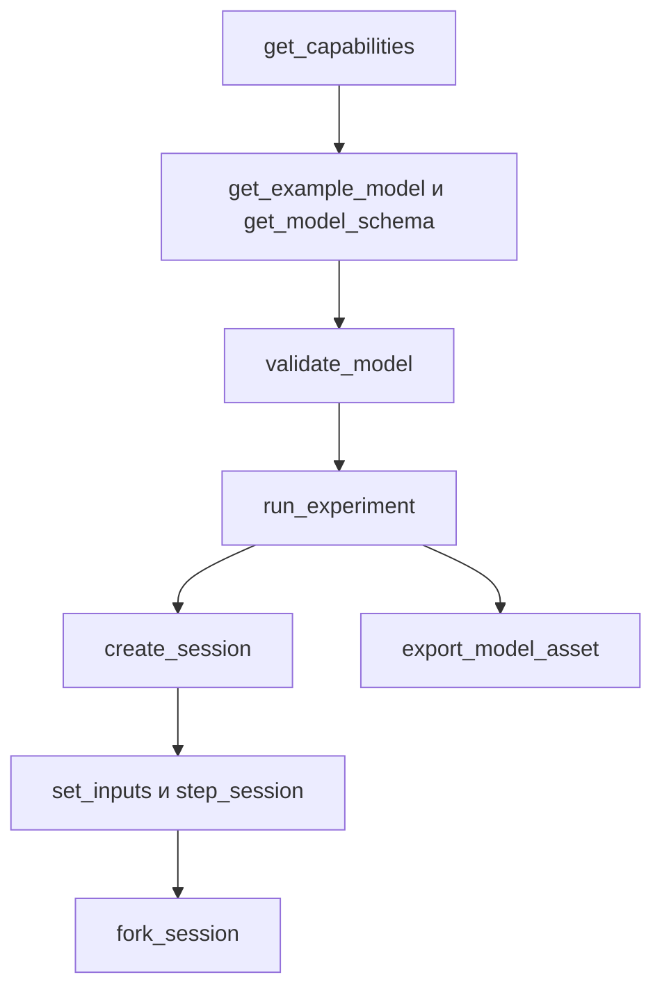

# Интерфейс агента

[English](AGENT_API.md) · [简体中文](AGENT_API.zh-CN.md) · [Français](AGENT_API.fr.md) · **Русский** · [日本語](AGENT_API.ja.md) · [한국어](AGENT_API.ko.md) · [Deutsch](AGENT_API.de.md) · [Español](AGENT_API.es.md) · [Italiano](AGENT_API.it.md) · [Português](AGENT_API.pt-BR.md)

`Power.Core`, `Power.Agent` и MCP — разные входы в одно физическое ядро. API не привязан к версии GPT или к поставщику моделей. Прочитайте версию, возможности и схему, затем порождайте модель. Знакомое имя не означает, что компонент реализован.

[Конечная газовая сеть](GAS_NETWORK.ru.md) доступна через JSON, CLI и MCP; состав газа, управляемые сужения, фиксированные резервуары, тепловые связи со стенкой и каналы сохранения сохраняются в переносимых активах. Существующая семантика линейных моделей и моделей закрытого цилиндра не меняется.

[Связанный компонент сцепления](CLUTCH_NETWORK.ru.md) доступен через общие контракты JSON, эксперимента и сессии. В него входят ограниченные входы замыкания, статическая и скользящая ёмкости, отношения со знаком, выходы фазы и теплоты и транзакционные внутренние события. Отдельная [точная пара](CLUTCH_PHYSICS.ru.md) остаётся эталоном проверки.

[Идеальные компоненты шестерни и планетарного ряда](GEAR_NETWORK.ru.md) участвуют в общем решателе и в контрактах документов. У `ideal_gear` порты A/B и ненулевое отношение со знаком; у `planetary_gear` порты солнца, короны и водила A/B/C и отношение чисел зубьев короны и солнца больше единицы. Нужны совместимые начальные скорости и независимые постоянные ограничения. Возможности описывают политику ранга, допуски решателя и средние выходы реакций.

[Контракт гидравлического поршня](HYDRAULIC_PISTON.ru.md) добавляет узлы `translational`, `linear_spring`, `hydraulic_piston`, `piston_clutch` и `force_source`. Агенты могут наблюдать перемещение, скорость, силу давления, энергию и силу накладки, ёмкости сцепления и накопленную теплоту демпфирования. У поршневого сцепления нет входа замыкания: командуйте его клапанами заполнения и слива и смотрите контакт накладки. `get_capabilities.hydraulic_piston` описывает единицы СИ, соглашение об объёме и работе, объём решателя и восстановление при отрицательном давлении. Проверка модели возвращает действенные ошибки единиц, диапазона и соединения; контракты ревизии сессии, отмены и независимого ветвления применяются без изменений.

`hydraulic_spool_valve` ссылается на компонент поршня и явные закрытое и полностью открытое положения. Его открытие следует фактическому движению; он не принимает команду открытия и подмену начального входа. Поток, потери и открытие наблюдаемы через общий контракт модели и сессии. `get_capabilities.hydraulic_spool_valve` объявляет единицы положения и потока, совместное решение и опущенную физику силы струи. Запросите `spool-regulated-pump`, чтобы посмотреть механическое регулирование давления; см. [контракт дозирования](HYDRAULIC_SPOOL.ru.md).

`gas_piston` связывает поступательный узел с подвижной газовой камерой с явными площадью, опорными объёмом и положением, абсолютным опорным давлением и знаковым направлением сжатия. Наблюдайте массу газа, энергию, давление, температуру, объём, силу и опорную работу. Сочетайте его с гидравлическим поршнем на той же массе для аккумулятора; для переноса используйте явные газовые порты и тепловые связи. Проверка требует одного владельца объёма и положительного номинального объёма газа. Возможности объявляют предел интервала в четверть объёма; контракт называет границу точности связи со стенкой. Запросите `gas-accumulator-pump`; см. [контракт газа и жидкости](GAS_PISTON.ru.md).

`gas_fuel_injector` соединяет совместимые конечные отслеживаемые объёмы газа источника и приёмника и явный коленвал фаз. Его вход — запрошенные kg за цикл; наблюдайте зафиксированный запрос, отданное топливо цикла и полное и средний отданный поток. Изменения входа в середине окна применяются к следующему наблюдаемому циклу. Противодавление и голодание могут дать недоподачу без ошибки исполнения; используйте свидетельства выходов и KPI. Возможности объявляют границы фаз, дозы и объёма. Запросите `metered-fired-cylinder`; см. [контракт дозирования](FUEL_METERING.ru.md). Это газообразная подача, а жидкостный распыл, испарение и калиброванное оборудование топлива и ECU остаются открытыми.

## Запуск и настройка клиента

```sh
dotnet run --file tools/Build.cs -- build
dotnet /absolute/path/to/Power!/src/Power.Mcp/bin/Release/net10.0/Power.Mcp.dll
```

Общая запись клиента MCP. Поместите её в конфигурацию серверов клиента и замените путь:

```json
{
  "mcpServers": {
    "power": {
      "command": "dotnet",
      "args": ["/absolute/path/to/Power!/src/Power.Mcp/bin/Release/net10.0/Power.Mcp.dll"]
    }
  }
}
```

Windows использует ту же команду `dotnet` и абсолютный путь к DLL. Рабочее соединение должно запускать собранную DLL напрямую, чтобы вывод сборки не смешивался с протоколом stdio. Серверу не нужны Unity, учётные данные или сетевое соединение. Первое восстановление NuGet сеть всё же требует. Транспорт и совместимость версий берутся из закреплённого официального [MCP C# SDK](https://csharp.sdk.modelcontextprotocol.io/v2/concepts/getting-started.html).

## Инструменты и результаты

В версии API агента 0.33.0 `get_example_model` принимает необязательный `name`: `electrothermal` (по умолчанию), `sealed-cylinder`, `gas-network`, `moving-cylinder`, `crank-timed-cylinder`, `fired-cylinder`, `fired-clutch`, `fired-planetary`, `fired-converter`, `fired-hydraulic`, `fired-pump`, `fired-pump-losses`, `electric-pump`, `pressure-regulated-pump`, `battery-regulated-pump`, `piston-actuated-clutch`, `spool-regulated-pump`, `gas-accumulator-pump`, `metered-fired-cylinder`, `film-fired-cylinder`, `liquid-injected-cylinder`, `needle-actuated-cylinder`, `closure-compensated-cylinder`, `dual-clutch-transmission`, `fired-dual-clutch`, `controlled-dual-clutch`, `controlled-fired-dual-clutch`, `ravigneaux-transmission`, `fired-ravigneaux-converter`, `resolved-ravigneaux-transmission`, `fired-resolved-ravigneaux-converter`, `hydraulic-ravigneaux-transmission` или `fired-hydraulic-ravigneaux`. `get_capabilities` объявляет поддерживаемые уровни fidelity, читаемые версии активов, пределы решателя и границы входов. Экспорт использует `power.asset.v28`; активы v1–v23 остаются читаемыми. Каналы выходов и их единицы возвращают проверка модели и создание сессии. Пройденные KPI лаборатории не устанавливают полный или калиброванный силовой агрегат.

| Инструмент | Назначение |
|---|---|
| `get_capabilities` | Версия, возможности модели, пределы размера, семантика времени и рабочий процесс |
| `get_model_schema` | Полная JSON Schema `power.model.v1` |
| `get_example_model` | Редактируемый пример с событиями и KPI |
| `validate_model` | Проверить модель и эксперимент. Возвращает отпечаток, каналы и диагностику и не продвигает время |
| `run_experiment` | Полный эксперимент, два повтора с разными размерами пакета, KPI и происхождение. Результат по умолчанию компактный |
| `export_model_asset` | Проверить и экспортировать `.powerasset`. Возвращает содержимое Base64, дайджест файла, происхождение и отпечаток модели |
| `create_session` | Создать независимую интерактивную симуляцию. Возвращает начальный снимок и метаданные каналов |
| `read_snapshot` | Текущие время, ревизия, хеш и выбранные выходные каналы |
| `set_inputs` | Атомарно подать кадр входов в текущий момент и продвинуть ревизию сессии |
| `step_session` | Атомарно продвинуть запрошенное число наносекунд. Отмена поддерживается. Ревизия продвигается |
| `fork_session` | Скопировать текущее физическое состояние в новую ветку с ревизией 0 |
| `close_session` | Освободить одну сессию |

У каждого инструмента есть схема входа и схема выхода. И успех, и ошибки области возвращают `structuredContent` и совместимый текстовый результат. MCP `isError` соответствует `ok=false`. См. [структурированные результаты инструментов в SDK](https://csharp.sdk.modelcontextprotocol.io/v2/concepts/tools/tools.html).

```json
{"schema":"power.agent.v1","ok":true,"data":{"revision":"2","time_ns":"1000000000","state_hash":"...","values":[]}}
```

```json
{"schema":"power.agent.v1","ok":false,"error":{"code":"revision_conflict","message":"Read the snapshot, then use its current revision.","retryable":true,"current_revision":"2"}}
```

См. [схему модели](../schemas/power.model.v1.schema.json) и [схему ответа](../schemas/power.agent.v1.schema.json). Схема модели проверяет структуру. Затем компилятор проверяет размерности, топологию, положительные значения, конечные значения и численную систему. Проверка эксперимента проверяет выравнивание по тику, порядок событий, каналы и границы KPI.

## Последовательность операций



1. Вызовите `get_capabilities` и подтвердите, что нужные физические компоненты поддерживаются.
2. Получите пример и схему, затем соберите объект `document`. У параметров должны быть единицы.
3. `validate_model({"document": ...})`. Исправьте модель по `error.object_id`, `error.field` и `error.code`.
4. `run_experiment({"document": ...})`. Проверьте `data.passed`, `checks`, `replay` и `model.calibration`. `ok=true` означает только то, что эксперимент завершился. KPI всё ещё могут не пройти.
5. `create_session` с тем же документом. Сохраните `session_id`, начальную `revision` и карту каналов.
6. Например, `set_inputs({"session_id":"...","expected_revision":"0","values":[{"channel":"100","value":24}]})`, затем прочитайте вернувшуюся ревизию.
7. `step_session({"session_id":"...","expected_revision":"1","delta_ns":"1000000000"})` возвращает снимок на одну секунду позже.
8. `fork_session({"session_id":"...","expected_revision":"2"})`. Затормозите дочернюю ветку при 4 V и оставьте родительскую как контроль.
9. После сравнения вызовите `close_session` для каждой со своей последней ревизией.

Чтобы посмотреть модель в Unity, вызовите `export_model_asset({"document": ..., "name": "My laboratory"})`. Декодируйте `data.content` из Base64, сверьте `data.asset_sha256` со всем файлом, сохраните его как `.powerasset` в `Assets` Unity и откройте через **Open in Studio** в инспекторе актива. Инструмент возвращает только содержимое. Локальный файл он не пишет. Успешный экспорт означает, что данные верны. KPI и калибровка — отдельные проверки. Формат и пределы — в [модельных активах](ASSET_FORMAT.ru.md).

Ревизии начинаются с 0. Каждая успешная фиксация входа и каждый успешный шаг добавляют 1. Устаревшая, неверная или отменённая операция ревизию не добавляет. Ветвление оставляет ревизию родителя неизменной. После любого разрыва транспорта прочитайте снимок и используйте эту ревизию. Не посылайте повторно запись, которая всё ещё несёт старую ревизию.

`time_ns`, `revision` и ID каналов в снимке сессии — строки, поэтому они остаются точными за пределом целого JavaScript. Время эксперимента в документе модели — не более одного часа. Входные каналы модели сегодня — целые. Выбирайте ID не больше `2^53-1`, если другой клиент JSON должен сохранять их точно. ID высокого пространства имён в выходах остаются строками, без изменений.

`channels` у `read_snapshot` — массив строк ID выходов. Опустите его, чтобы вернуть каждый выход. Входные каналы и повторяющиеся поля отклоняются. `include_samples=true` — то, что заставляет эксперимент вернуть каждую границу выборки.

## Ошибки и исправление

| Ошибка | Следующий шаг |
|---|---|
| `model_unit` / `model_connection` / `model_range` | Исправьте единицу, ссылку или параметр этого объекта и поля |
| `invalid_argument` / `invalid_json` | Исправьте поле, порядок событий, время или структуру документа |
| `unknown_channel` / `invalid_input` | Возьмите вход из таблицы каналов и уберите повторы и неконечные значения |
| `invalid_time_step` | Используйте положительное целое число тиков, не более одного миллиона тиков на вызов |
| `numerical_failure` | Проверьте масштаб параметров, входы и шаг. Текущее состояние не изменялось |
| `revision_conflict` | Прочитайте последний снимок, затем решайте из этого состояния |
| `cancelled` | Весь пакет откатился. Повторите меньшим пакетом |
| `session_capacity` | Закройте сессии, которые больше не нужны |
| `unknown_session` | Процесс перезапустился или сессия была закрыта. Создайте её снова и повторите |

Сессия — объект внутри процесса. Она не сохраняется и не присоединяется к работающей сцене Unity. Интерфейс MCP сейчас выполняет эксперименты без интерфейса на том же ядре. Более позднее соединение с Unity всё равно должно сохранять контракты ревизии, времени и атомарности.

## Добавление компонента

Напишите уравнения и объём, задайте порты и параметры с единицами, реализуйте их в ядре и возьмите свидетельства из аналитического решения, сохранения, сходимости шага и тестов отказа. Затем добавьте схему и обнаружение возможностей, поставьте повторяемый эксперимент и подключите вид Unity. Измеренные происхождение и неопределённость записываются отдельно. Пройденный тест не означает, что модель калибрована.

## Рабочий процесс газовой сети

Запросите `gas-network`, проверьте его, затем выполните эксперимент и экспортируйте его актив существующими инструментами. `power.model.v1` получает аддитивные определения газовых узлов и компонентов; клиентам следует обнаруживать их из схемы и возможностей. Имена инструментов не меняются. Газовые объёмы потребляют по два скалярных состояния каждый, и соединённые объёмы должны делить R и gamma.

Входы `gas_orifice` используют значения `fraction` в [0, 1]. Отсутствующий или нулевой входной канал держит явное `initial_input` фиксированным. Проверка и экспорт отклоняют запланированные значения вне диапазона до исполнения любого эксперимента. Интерактивное отклонение сохраняет и состояние, и ревизию. Компиляция, успешное исполнение, успех KPI и калибровка остаются различными: пример синтетический и `unverified`.

Операции сессии только с газом используют те же наносекундные времена, проверки ревизий, отмену, отфильтрованные снимки и независимые ветвления. Сессии начинаются с начальных входов компонентов; `create_session` не исполняет расписание событий эксперимента. Для этого расписания используйте `run_experiment` или переносимое воспроизведение. Статическая проверка не может гарантировать, что будущее состояние останется численно решаемым: при `numerical_failure` уменьшите `step_ns` и осмотрите площадь потока, объём, проводимость и начальные условия, прежде чем создавать сессию заново.

## Рабочий процесс подвижного цилиндра

`get_example_model({"name":"moving-cylinder"})` возвращает некалиброванный эксперимент прокрутки с двумя сужениями, управляемыми по времени, работой давления на коленвале и переносом со стенкой. Газовые узлы без `storage` должны соединяться ровно с одним `gas_cylinder`, чьи параметры задают геометрию. Компилятор проверяет владение и выводит начальные массу и энергию из давления и температуры газового узла и начальной геометрии коленвала.

Возможности объявляют `moving_cylinder_gas_exchange`, границу коленвала 0.25 rad и объём расщеплённого интегрирования. Состояния газа остаются каналами газового узла; объём, перемещение и момент — каналами компонента газового цилиндра. Контракты эксперимента, экспорта, сессии, ревизии и отказа не изменились. См. [подвижные цилиндры](MOVING_CYLINDER.ru.md). Сужения по расписанию времени не устанавливают фазы клапанов по углу коленвала и не устанавливают сгорание.

## Рабочий процесс клапана по углу коленвала

`get_example_model({"name":"crank-timed-cylinder"})` возвращает эксперимент прокрутки на 720 градусов с переменной скоростью, профилями впуска и выпуска и теплотой стенки. `valve_timing` на `gas_orifice` требует вращательный `crank_node` и `cycle_angle`, `open_angle` и `duration_angle` с единицами. Объект возможностей объявляет циклы, профиль, пределы и восстановление. См. [контракт фаз](VALVE_TIMING.ru.md).

Каналы входа с фазами представляют `peak_opening` в [0, 1]; наблюдаемое `effective_opening` выводится из фактического угла коленвала. Проверяйте его полем KPI `opening`. Остановленный коленвал может оставаться открытым; обратное движение проходит тот же профиль снова. Фаза явна и не зависит от фазы геометрии цилиндра. Запланированное изменение пика масштабирует кулачок; фазы коленвала оно не заменяет.

Проверка смотрит топологию и параметры, но не гарантирует разрешение во время выполнения. При `numerical_failure` уменьшите `step_ns`, чтобы ход по углу и ход по скорости конечной точки оставались в пределах `min(0.25 rad, duration_angle/8)`, затем создайте сессию заново. Весь неудачный пакет сохраняет входы, состояние и ревизию. Актив v11 сохраняет профиль и совместимость v1–v10. Новая fidelity — `crank_timed_gas_exchange`; успешное исполнение, пройденные KPI и калибровка остаются различными.

## Рабочий процесс предварительно смешанного сгорания

`get_example_model({"name":"fired-cylinder"})` возвращает цилиндр со сгоранием предварительно смешанной смеси, ведущий внешнюю нагрузку. Возможность `combustion` объявляет предписание Вибе, классы топлива, воздуха и продуктов, диапазон входа, поведение прямой истории и численные пределы. Газовые узлы задают `gas.premixed`, а их сужения резервуара — явные `reservoir_fractions`. Компилятор отклоняет отсутствующие доли, несовместимые соединённые смеси и несколько компонентов выгорания на одной камере.

`premixed_combustion` соединяет вращательный `node_a` с предварительно смешанным газовым `node_b`, с явными углами цикла, начала и длительности, показателем формы и коэффициентом выгорания. Его необязательный входной канал масштабирует интенсивность выгорания через `burn_multiplier` в [0,1]. Ноль отключает выгорание, но не останавливает прибытие топлива в открытый впуск. Углы вперёд за записанную границу расходуют топливо; останов, реверс и повторный проход не могут повторить тепловыделение.

Обнаруживайте массы составляющих, химическую энергию, накопленное сгоревшее топливо, выделенную теплоту и `burn_frontier_angle` из таблицы каналов. Глобальные остатки топлива и свежего воздуха дополняют полные массу и энергию. `reservoir_enthalpy` включает перенесённую химическую энергию для предварительно смешанных газов, а `net_fuel_energy_in` открывает эту часть отдельно. Внутренняя энергия газа остаётся тепловой. Fidelity отчёта — `premixed_gas_transport` или `premixed_wiebe_combustion`; обе остаются `unverified`.

При отказе разрешения выгорания уменьшите `step_ns` и создайте сессию заново. Включённое выгорание требует, чтобы ход коленвала и ход по скорости конечной точки были не больше `min(0.25 rad, burn duration/32)`; теплота на тик ограничена 25% тепловой энергии до выгорания. Откат всего вызова и контракты ревизии остаются неизменными. Верная модель всё ещё может не пройти границу времени выполнения; успешное исполнение всё ещё может не пройти KPI. Уравнения и ограничения — в [PREMIXED_COMBUSTION.ru.md](PREMIXED_COMBUSTION.ru.md).

## Рабочий процесс сцепления

`get_example_model({"name":"fired-clutch"})` возвращает двигатель со сгоранием, отдельную нагрузку, сцепление и тепловой сток, с событиями замыкания и размыкания в точных тиках. Возможности `clutch` объявляют границы входа, бюджеты решателя, коды режима и семантику истории выходов. Задайте `parameters.static_capacity` и `sliding_capacity` в Nm плюс ненулевое `ratio` со знаком. Компилятор требует `static >= sliding >= 0`, вращательные конечные точки и сток тепловых потерь. Тормоза на стойку используют опущенный или нулевой `node_b` и отношение единица.

Вход `engagement` лежит в `[0,1]`; ноль размыкает. Обнаруживайте текущее относительное скольжение, последнюю принятую фазу, средний момент и тепловую мощность последнего тика и накопленную теплоту трения из таблицы каналов. Фазы: 0 разомкнуто, 1 заблокировано, 2 положительное скольжение и 3 отрицательное скольжение. Обновление замыкания не переписывает средние выходы или фазу предшествующего тика. Fidelity `hybrid_clutch_powertrain` обозначает модели, содержащие этот компонент; полную трансмиссию или калиброванный автомобиль она не подразумевает.

Используйте `run_experiment`, чтобы оценить свидетельства KPI и повтора, или инструменты сессии, чтобы менять замыкание, сохраняя проверки ревизий и независимые ветки. При численном отказе уменьшите `step_ns` и осмотрите масштабы инерции и отношения, избыточные ограничения и расписания ёмкости. Неудачный или отменённый вызов не фиксирует входы, фазы, теплоту или физическое состояние. Срыв под меняющимися нагрузками использует потребность, усреднённую по интервалу; вблизи переходов нужно уточнение шага. См. [CLUTCH_NETWORK.ru.md](CLUTCH_NETWORK.ru.md).

## Рабочий процесс идеальной трансмиссии

Запросите `fired-planetary`, чтобы получить синтетический двигатель, тормоз короны, сцепление солнца и короны, планетарный ряд и главную передачу. Запланированные переключения вверх и вниз используют ту же семантику точного тика, что и другие эксперименты, с 84 совпадающими границами повтора. `node_c` — водило планетарного ряда; шестерни принимают только свои вращательные порты и `parameters.ratio`.

`slip_speed` и `constraint_error` открывают текущие остатки скорости и фазы. `torque`, `torque_at_b` и только у планетарного ряда `torque_at_c` — средние реакции на соответствующих роторах за последний полный тик. Они начинаются с нуля и не переписываются изменениями входа на границе. Отказы начальной скорости возвращают `model_connection` с полем `initial_speed`; зависимые строки ограничений возвращают `model_solver` с полем `gear.constraints`. Исправьте топологию или начальные условия, а не повторяйте неизменные данные.

Актив v11 сохраняет все прежние читатели, включая подлинную фикстуру сцепления со сгоранием v7. Эта модель устанавливает синтетический путь трансмиссии, а не полные DCT/AT, гидравлический привод, поведение TCU или измеренную калибровку. Фактические свидетельства Unity остаются отдельными.

## Рабочий процесс гидротрансформатора

Запросите `fired-converter` для синтетического двигателя, жидкостного пути с картой, отдельной блокировки, планетарного переключения и теплового стока. Возможности объявляют все четыре обязательные карты со знаком, пределы точек и компонентов, соглашение об опорном элементе, бюджеты нелинейных итераций, семантику наблюдаемых величин и восстановление во время выполнения. Fidelity — `quasisteady_converter_powertrain`; прохождение 87 границ повтора устанавливает численную согласованность, а не измеренную работу трансмиссии.

`torque_converter` требует `node_a` и `node_b` насоса и турбины, необязательно `heat_node`, и четыре явных массива карт в `parameters`. У каждой точки безразмерные отношения скорости и момента и коэффициент в `nm_s2_rad2`. Ни карта, ни обратный квадрант, ни входной канал, ни порт ротора статора не выводятся. Компиляция проверяет пассивность интерполяции и непрерывность карты и сообщает `converter.<map>` или `converter.counter_rotation` с ID объекта.

Обнаруживайте средние моменты насоса, турбины и статора, тепловую мощность жидкости, накопленную теплоту жидкости, текущее отношение скоростей со знаком и код драйвера из каналов. Параллельное `clutch` даёт замыкание блокировки. Контракты ревизии сессии, отмены, независимости веток и полного отката покрывают и истории гидротрансформатора. При `numerical_failure` уменьшите `step_ns` и осмотрите наклоны карт, масштабы инерции и скорости и ограничения сцепления. См. [уравнения, границы и свидетельства](CONVERTER_NETWORK.ru.md). Экспорт использует актив v11; подлинные прежние фикстуры сохраняют совместимость v1–v10. Автоматическое гидравлическое управление и фактическая проверка Unity Editor/Player остаются отдельной незавершённой работой.

## Гидравлический рабочий процесс

Запросите `fired-hydraulic` для камер давления с клапанным управлением, которые приводят сцепления переключения и блокировки. Возможность `hydraulics` открывает соглашение об избыточном давлении, модели накопителя и потока, единицы, пределы итераций, допуск давления, объём привода и восстановление. Fidelity — `compliant_hydraulic_powertrain`; калибровка остаётся `unverified`.

Гидравлический узел требует положительную податливость `storage` в `m3_pa` и неотрицательное начальное избыточное давление. `hydraulic_resistance` и `hydraulic_orifice` требуют явные коэффициенты потока и открытие клапана; отверстию дополнительно нужно положительное давление перехода. Конечные точки резервуара требуют явное `reservoir_pressure`. Отсутствующий или нулевой входной канал фиксирует заданное открытие. Компилятор никогда не выводит свойства жидкости, утечки, давление резервуара или карту OEM.

У `hydraulic_clutch` вращательные порты и геометрия в `parameters`, включая его гидравлический `pressure_node`. Входа замыкания у него нет. Обнаруживайте давление, сохранённый опорный объём, гидравлическую граничную работу, остаток запаса, теплоту сужения, силу прижима и текущие ёмкости трения рядом с существующими каналами истории сцепления. Изменения входа клапана сохраняют запасённое давление и средние прошлого тика, пока принятый шаг их не продвинет.

Полные контракты состояния, ревизии, отмены и веток покрывают гидравлическое давление и журналы учёта. При численном отказе уменьшите `step_ns` и осмотрите податливость, коэффициенты, избыточные давления и геометрию привода. Отрицательное конечное давление отклоняет весь пакет; молча оно не зажимается. См. [HYDRAULIC_NETWORK.ru.md](HYDRAULIC_NETWORK.ru.md). Актив v11 сохраняет границы давления, законы потока и геометрию привода; все читатели v1–v10 остаются. Измеренные карты потерь и управления, измеренная динамика клапанов и аккумуляторов, полное управление ECU/TCU и фактическая приёмка Unity остаются открытыми.

## Рабочий процесс питания насоса

Запросите `fired-pump` для насоса от коленвала, податливой линии, предохранительного клапана и трансмиссии, управляемой давлением. Возможности открывают `hydraulic_pump`, единицы рабочего объёма, соглашение о входе, пределы совместного решателя и семантику знаковой работы. `hydraulic_work` насоса — внутренний перенос вала в жидкость; глобальная `hydraulic_work` остаётся внешней работой резервуара. У этого примера нулевая внешняя гидравлическая работа и явное начальное запасённое давление.

`hydraulic_pump` требует порты вала и выхода, явный `parameters.inlet_node`, положительный `displacement` в `m3_rad` и давление резервуара только для нулевого входа. Предохранительный клапан требует проводимость и давление открытия, без входного канала. Отсутствующие или неверной области порты, размерности и не относящиеся к делу параметры дают действенные ошибки проверки. Актив v11 сохраняет оба определения. Ревизии, отмена, ветвления, полный откат и различие KPI и калибровки остаются неизменными. См. [HYDRAULIC_PUMP.ru.md](HYDRAULIC_PUMP.ru.md).

## Рабочий процесс компоновки насоса

Запросите `fired-pump-losses`, `electric-pump`, `pressure-regulated-pump` или `battery-regulated-pump`. Возможность `pump_assembly` даёт уравнения чистого потока и реакции, единицы потерь, состав компонентов и границу электрического питания. Модели содержат обычные записи насоса, сопротивления и вала; электрический пример добавляет существующий двигатель RL. Новый вид компонента, схема или версия актива не требуются. Клиенты ядра могут использовать `HydraulicPumpAssembly.CreateComponents` со своими устойчивыми ID, чтобы получить те же определения графа.

Утечка — явное сопротивление от выхода ко входу с коэффициентом в `m3_s_pa`; трение вала — вал на стойку нулевой жёсткости с демпфированием в `nm_s_rad`. Оба требуют заданные значения и явную маршрутизацию теплоты. Электрический насос принимает напряжение двигателя через вход `v`, с противо-ЭДС, током и теплотой в меди в общем решении. Батарею, КПД, вязкость, регулятор или калибровку он не выводит. Обнаруживайте каналы, а не читайте поток идеальной ветви насоса как чистую подачу компоновки. Существующие ревизии, отмена, ветвления и полный откат пакета применяются ко всей композиции.

## Рабочий процесс обратной связи по давлению

Запросите `pressure-regulated-pump`. Возможности объявляют компонент `pressure_controller`, размерные коэффициенты, требования к датчику и цели, целочисленную дискретизацию, зажим и семантику транзакции. Проверяйте, запускайте и экспортируйте существующими инструментами. Актив v12 сохраняет полное определение регулятора, и все прежние читатели остаются поддерживаемыми.

Вход `105` примера меняет уставку давления в СИ, в Pa. Канал напряжения двигателя `100` принадлежит регулятору и отсутствует среди записываемых каналов. Прямые записи возвращают `controlled_input` с указанием писать `pressure_setpoint`; отклонение не меняет ни состояние, ни ревизию. Отрицательные цели давления отклоняются. Статическая проверка обнаруживает конфликтующих владельцев, неверные области и единицы и невыровненные периоды дискретизации.

Читайте `sampled_pressure`, `pressure_error`, `integral_voltage` и `command_voltage` через обнаруживаемые ID выходов. Это состояние последней выборки и удерживаемая команда. Метки времени снимка указывают фазу часов. Изменения входа не продвигают историю управления; следующая должная выборка обновляет её на физическом тике. Ветвления включают память интеграла и фазу часов. Отмена или более поздний арифметический отказ или отказ решателя не фиксируют никакую часть пакета. Восстановление после переполнения требует осмотреть коэффициенты, цели и масштабы интеграла, а не повторять те же входы вслепую.

Успешное исполнение и точный повтор могут сопровождать проваленные KPI слежения, когда исполнительный механизм насыщается. Проверяйте `passed` и границы ошибки отдельно от `ok`. Идеальные датчик и источник напряжения примера — исследовательские компоненты; батарею, полный ECU/TCU, калиброванное управление или приёмку Unity они не устанавливают.

## Рабочий процесс питания от батареи

Запросите `battery-regulated-pump`. Возможности открывают конечный заряд, уравнения OCV и RC, правила нагрузки и скважности, владение управлением и восстановление. `storage` узла батареи использует `c` или `ah`, `initial` — SOC в `fraction`, а `position` — напряжение поляризации в `v`. Запись батареи требует все пять электрических параметров. Проверяются единицы, границы ёмкости и состояния, порты источника, тепловые стоки, возрастающее OCV и периоды регулятора.

`battery_motor` требует вращательный порт A, порт батареи B и вход скважности в [-1,1]. У `resistive_load` порт батареи A, сопротивление и открытие в [0,1]. Канал `106` примера меняет вспомогательную нагрузку; `105` меняет уставку давления в СИ, в Pa. Скважность `100` принадлежит `pressure_duty_controller` и не может быть записана напрямую. Его коэффициенты используют `fraction_pa` и `fraction_pa_s`; границы выхода безразмерны.

Читайте `state_of_charge`, `charge`, `battery_current`, `terminal_voltage`, `polarization_voltage`, запасённую энергию и теплоту батареи рядом с `integral_duty` и `command_duty`. Каналы напряжения, тока и мощности нагрузки — мгновенные алгебраические наблюдаемые, поэтому верные изменения скважности и нагрузки могут менять их, не меняя запасённые состояния. Работа батареи внутренняя; глобальная `source_work` включает только явные внешние границы мощности. Нарушения SOC или напряжения отклоняют весь пакет. Осмотрите начальный заряд, ёмкость, скважность, нагрузки и длину пакета, прежде чем повторять. Молчаливого зажима SOC нет.

Актив v22 сохраняет все параметры питания и управления с подлинными прежними читателями и фикстурами. Отмена и более поздний отказ сохраняют заряд, память RC и управления, входы и ревизию. Независимые ветвления сравнивают стратегии вспомогательной нагрузки и скважности из одной и той же физической истории. Все параметры остаются непроверенными; идеальный усреднённый преобразователь скважности — это не BMS батареи, контур PWM или тока, полная электрическая система автомобиля или калибровка.

## Рабочий процесс жидкостной плёнки

Запросите `film-fired-cylinder`. Возможность `fuel_film` объявляет конечные порты газа и стенки, опору энергии фазы, единицы, точность расщепления и объём. Задайте явные начальный запас жидкости, температуру, удельную теплоёмкость, температуру насыщения, скрытую внутреннюю энергию и проводимость. Проверьте и обнаружьте ID выходов, прежде чем запускать или экспортировать модель. Плёнки не открывают записываемый входной канал.

Читайте оставшиеся `mass`, знаковую `internal_energy`, `chemical_energy`, `evaporated_fuel_mass`, средний `mass_flow` последнего тика, накопленную `film_wall_heat` и мгновенный `heat_flow` рядом с топливом приёмника и теплотой реакции. Сухие плёнки сообщают объявленную температуру насыщения и нулевой тепловой поток. Фактическая доступность пара управляет реакцией; верное определение плёнки не означает испарение или прохождение KPI тепловыделения.

Актив v18 сохраняет фазовые величины и более ранние читатели. Проверки ревизий, отмена, независимые ветвления и откат позднего отказа включают все жидкостные, тепловые, составляющие и компенсированные истории. Неверные единицы и порты, перегретая начальная жидкость и избыточные счётчики состояния возвращают структурированные ошибки. Осмотрите сообщённые объект и поле и конечный тепловой бюджет, прежде чем повторять неудачную модель. [Контракт плёнки](FUEL_FILM.ru.md) записывает уравнения и границу точности. Начальное смачивание не устанавливает жидкостный впрыск, калиброванные свойства топлива, полное управление двигателем или фактическую приёмку Unity.

## Рабочий процесс конечного жидкостного впрыска

Запросите `liquid-injected-cylinder`. Возможность `liquid_fuel_injector` объявляет конечный податливый источник, вход цикла в `kg`, единицы плотности и податливости, энергетический журнал и границу приёмника. Задайте все величины рейки, геометрию сопла и существующую ссылку на плёнку и коленвал. Сначала проверьте и обнаружьте ID и единицы выходов.

Вход `104` примера запрашивает kg за цикл. Изменения фиксируются в более позднем наблюдаемом прямом окне; текущая подача может оставаться ограниченной давлением источника. Читайте `mass`, `pressure`, запасённую `internal_energy`, химическую энергию и объём рейки рядом с `requested_fuel_dose`, `delivered_fuel_dose`, `total_fuel_delivered` и средним `mass_flow` последнего тика. Масса, температура и испарение плёнки и отдельная теплота реакции показывают задержку между принятием дозы и фактическим сгоранием пара.

`source_work` компонента — освобождённая запасённая работа давления рейки, `hydraulic_work` — отданная работа давления приёмника, а `fluid_heat` — диссипация сопла, направленная в стенку плёнки. Их тождества отличны от глобальной внешней работы источника. Приёмник с пренебрежимо малым объёмом жидкости явно отдаёт работу вытеснения; скрытую работу коленвала он не добавляет и геометрию распыла не моделирует.

Актив v19 сохраняет полные источник, сопло и фазы с читателями v1-v18. Ревизии, отмена, ветвления и поздний или пробный отказ включают каждую историю рейки, квоты и теплоты. Неверные единицы, невозможный податливый объём, перегретая жидкость и несовпадающее владение плёнкой и коленвалом дают структурированную диагностику. Осмотрите отказавшие объект и поле и границы давления и дозы, прежде чем повторять. Успешное выполнение инструмента не означает полную подачу, пройденные KPI или калиброванное оборудование. См. [LIQUID_FUEL_INJECTION.ru.md](LIQUID_FUEL_INJECTION.ru.md).

## Рабочий процесс физической иглы

Запросите `needle-actuated-cylinder`. Возможности объявляют единицы магнитного наклона, энергию потока, фактическое открытие, дискретное управление и исследовательские пределы. Команда форсунки `104` в kg записываема; напряжение катушки `107`, принадлежащее драйверу, нет. Отклонённые записи возвращают `controlled_input` с верным именем и каналом команды и сохраняют состояние и ревизию. Обновляйте запрошенную массу топлива и продвигайте точные физические тики.

Читайте фактические перемещение и скорость иглы и открытие форсунки рядом с током катушки, магнитной энергией, теплотой в меди, электрической работой, удерживаемым напряжением и целью и подачей последней выборки. Жидкость может продолжаться после снятия напряжения, закрытия окна или достижения целевой подачи. Оставшаяся жидкость, газовое топливо, несгоревшее и граничное топливо и реакция остаются наблюдаемыми раздельно. Верный запрос или успешный инструмент не устанавливают точную подачу дозы или калиброванное управление.

Актив v20 сохраняет таблицы магнитики, хода, иглы и драйвера и читателей v1-v19. Периоды дискретизации должны выравниваться по тикам; у напряжения один владелец; ссылки иглы, катушки и коленвала должны совпадать. При ошибках решателя осмотрите положительное `L(x)`, R/L/градиент, ход и шаг; уточняйте интервалы физики и управления, прежде чем заявлять о динамической точности. Отмена, ветвления и отклонённые или пробные пакеты включают все истории потока, теплоты, выборки и удержания и фазы. См. [NEEDLE_ACTUATION.ru.md](NEEDLE_ACTUATION.ru.md).

## Рабочий процесс иглы с компенсацией закрытия

Запросите `closure-compensated-cylinder`. Его драйвер включает выровненный конечный горизонт `closure_prediction_ns`. Возможности дают предел 4096 тиков, предположение удерживаемых входов и ограниченный поиск отсечки. Запросы kg источника остаются записываемыми; напряжение остаётся у драйвера. Обнаруживайте каналы предсказанных массы и счётчика, фиксации отсечки и ожидающих тиков рядом с фактическим положением иглы, подачей и удерживаемым напряжением.

Предсказание — отдельный повтор объекта с полным состоянием. Оно удерживает другие команды и не знает будущих внешних входных событий, поэтому смотрите фактическую подачу после закрытия и уточнение горизонта и шага, а не принимайте прогноз за измеренное топливо. Неудачное или отменённое предсказание не фиксирует никакую часть реального пакета. Переполнение часов, неверный горизонт или немонотонные кандидаты отсечки требуют пересмотреть предположения о фазах и модели; частичные прогнозы молча не принимаются.

Актив v21 пишет горизонт и сохраняет более ранние читатели. Ревизии, независимые ветвления и откат всего пакета включают фиксацию предсказания и обратный отсчёт. Клиенты ядра могут вызывать `PredictNeedleClosure` только для чтения; снимки MCP открывают последнюю выбранную оценку выбранного кандидата. Объём и свидетельства — в [CLOSURE_PREDICTION.ru.md](CLOSURE_PREDICTION.ru.md).

## Рабочий процесс пути мощности с двумя сцеплениями

Запросите `dual-clutch-transmission` или `fired-dual-clutch`. Возможности описывают обычный граф семи передних передач и заднего хода, два входных пути, три выходные ветви и исследовательские пределы. Проверьте и обнаружьте каждую реакцию шестерни, скольжение, режим и теплоту сцепления и скорость ротора, прежде чем менять команды селектора и тяги.

Примеры используют каналы тяги `500`/`501` и каналы селекторов `600`-`607` для передних 1-7 и заднего хода. Команды — доли; отношения остаются постоянными ограничениями. Предвыберите ненагруженный путь, отпустив его прежний селектор и замкнув цель, затем отдельно согласуйте передачу сцеплений тяги. `DualClutchGraph.SelectPath` ядра порождает атомарный набор команд селекторов этого пути. Чувствительность TCU, блокировки и динамику приводов он не реализует.

Снимки открывают все свободные и выбранные ступицы, скорости входа и выхода, теплоту синхронизации и тяги, ошибку фазы шестерни и глобальные свидетельства источника, энергии и топлива. Небезопасные сочетания могут заклинить или затормозить физическую трансмиссию; успешная запись входа не устанавливает верное переключение. Проверки ревизий, отмена, независимые ветвления и поздний отказ сохраняют каждое состояние и историю. Существующие переносимый формат и прежние читатели сохранены. См. [DUAL_CLUTCH_TRANSMISSION.ru.md](DUAL_CLUTCH_TRANSMISSION.ru.md).

## Рабочий процесс дискретного управления DCT

Запросите `controlled-dual-clutch` или `controlled-fired-dual-clutch`. Запишите целочисленную `requested_gear` в канал `700`: 1-7 передний ход, -1 задний ход, 0 нейтраль. Регулятор владеет тягой `500`/`501` и селекторами `600`-`607`; прямые записи возвращают `controlled_input` с верным каналом запрошенной передачи. Дробные передачи неверны и не меняют состояние и ревизию.

Читайте подтверждённую фактическую передачу, скомандованные выборы, фазу, скольжение целевого селектора и неисправность. Запрошенная передача не означает завершённое переключение. Автомат предвыбирает ненагруженные пути, подтверждает физическую блокировку, использует поэтапную передачу с разрывом момента и открывает неисправности таймаута, направления и устойчивой потери блокировки. Нейтраль прерывает на должной выборке; другая цель может восстановить неисправность. Переходное скольжение может сообщить неподтверждённую фактическую передачу, пока регулятор следит за её длительностью.

Явный предел сообщаемого состояния — 128, при неизменных 32 узлах и 64 компонентах. Фактическая композиция со сгоранием и регулятором и проверки около предела и сверх предела проверены; проверки Standard всё ещё идут на .NET 10 и не являются свидетельствами Unity. Актив v22 сохраняет неизменяемые маршруты и состояние по времени с прежними читателями. Отмена, ветвления, поздний отказ и компенсированная история координат остаются транзакциями всего пакета. Полное смешение момента ECU, приводы и калибровка остаются отдельными требованиями. См. [DCT_CONTROL.ru.md](DCT_CONTROL.ru.md).

## Составные планетарные пути

`double_pinion_planetary_gear` требует порты солнца, короны и водила A/B/C и отношение `k > 1`. Его ограничение — `sun - k ring + (k-1) carrier = 0`. Существующий `planetary_gear` сохраняет знак односателлитного ряда. Оба открывают остатки скорости и фазы и все три момента реакций. Несовместимые начальные скорости, неверные области, избыточные строки и неполные водила возвращают действенные ошибки компиляции.

Запросите `ravigneaux-transmission` или `fired-ravigneaux-converter` для явных исследовательских расписаний пяти элементов, интеграции гидротрансформатора и блокировки и полного физического повтора. Входы замыкания — доли; успешная команда не доказывает заблокированный диапазон. Никакой регулятор AT не владеет этими предписанными входами. Актив v23 сохраняет топологию и читает v1-v22. См. [RAVIGNEAUX_TRANSMISSION.ru.md](RAVIGNEAUX_TRANSMISSION.ru.md).

## Зацепления относительно водила и внутренняя динамика сателлитов

`carrier_gear` требует различные вращательные порты A/B/C, конечное ненулевое отношение со знаком и совместимые начальные скорости. Ограничение — `A - ratio B + (ratio-1) C = 0`; поддерживаются отрицательные внешние и положительные внутренние отношения, включая единицу. C — фактическое подвижное водило со своим моментом реакции, а не неявная стойка. Каналы открывают все три средних момента и остатки скорости и фазы. Нулевые отношения, отсутствующие водила, неверные области и зависимые ограничения возвращают типизированные ошибки компиляции.

Запросите `resolved-ravigneaux-transmission` или `fired-resolved-ravigneaux-converter`. Оба сохраняют четыре физических зацепления, два состояния абсолютного вращения сателлитов и объявленную орбитальную инерцию в водиле. Обычный запас ротора включает их фактические кинетические энергии; входы остаются предписанными долями замыкания, а не полным управлением AT. Плоский граф записывает суммарные инерции и отношения, а исходные описания сохраняют объявленные геометрию и массы, которые их породили. Актив v24 включает этот примитив и читает v1-v23. См. [RESOLVED_PLANETS.ru.md](RESOLVED_PLANETS.ru.md).

## Поршневой привод AT от насоса

Запросите `hydraulic-ravigneaux-transmission` или `fired-hydraulic-ravigneaux`. Используйте явные доли заполнения и слива на 700/701 по 708/709; блокировка со сгоранием использует 710/711. Прежние ID замыкания диапазона отсутствуют. Проверьте и обнаружьте каналы, прежде чем писать. Давление, ход и контакт поршня определяют ёмкости; команда, принятая API, не подтверждает физическую блокировку.

Отчёты сохраняют давление линии и камеры, ход, контактную ёмкость, работу насоса, вытесненный объём, теплоту трения, сужения и демпфирования и каждый хеш модели. Полные ревизии, отмена, поздний откат и независимые ветвления со сбросом клапана используют обычные контракты. Граф использует существующие записи актива v24, а не новый формат сериализации. См. [AT_HYDRAULIC_ACTUATION.ru.md](AT_HYDRAULIC_ACTUATION.ru.md).

## Обратная связь гидравлической AT

`at_controller` принимает целочисленную передачу в [-1,4]; ноль означает нейтраль. Он управляет пятью парами клапанов наполнения/слива и необязательной блокировкой гидротрансформатора. Порядок: вход водила, малого солнца, большого солнца, тормоз водила, тормоз большого солнца, затем блокировка.

Примеры `controlled-hydraulic-ravigneaux` и `controlled-fired-hydraulic-ravigneaux` используют канал 900 и ID 1400. Они сохраняют 99 и 122 отслеживаемых состояния при неизменном пределе 128. Формат v28 хранит маршруты, усиления и часы и читает v1-v27.

Это исследовательское управление, параметры остаются `unverified`. Координация момента ECU, подробные датчики/клапаны, полный набор неисправностей автомобиля и калибровка OEM ещё не завершены. Проверки managed и Standard не подтверждают реальные Unity Editor/Play/Player/IL2CPP.

[AT_CONTROL.ru.md](AT_CONTROL.ru.md)

## Жидкая топливная рампа с насосной подачей

`liquid_rail_feed` связывает жидкий инжектор с существующим объёмным насосом и явной материальной/тепловой границей. Выходной гидравлический узел должен совпадать с податливостью и начальным абсолютным давлением рампы. Насос и инжектор владеют этим узлом; другие неучтённые жидкостные пути отклоняются.

Формат v28 хранит связи подачи и температуру источника и читает v1-v27. Аналитический обмен вал/давление, независимое совместное уточнение ODE, смешение тепла, балансы массы/топлива/энергии/объёма, обратный поток и полный rollback проверяются отдельно.

Геометрическая вместимость, вентиляция/газовая полость/плескание, кавитация, измеренные заполнение/КПД/регулирование и разрешённый распыл остаются открытыми. Параметры `unverified`; реальные Unity Editor/Play/Player/IL2CPP и OEM-калибровка не проверены.

[PUMP_FED_FUEL.ru.md](PUMP_FED_FUEL.ru.md)

## Конечный бак жидкого топлива

`liquid_fuel_tank` хранит конечную массу жидкости и тепловую энергию с плотностью, тепловым отсчётом плёнки и теплотой сгорания связанного инжектора. Подача выбирает его через `tank_component`, исключая `supply_temperature`. Каждый бак принадлежит одной совместимой подаче.

Тепловая и химическая энергия бака входят в полное хранилище. Внутренний перенос не добавляет внешней массы или химической энергии. Заданное входное давление насоса сохраняет границу работы давления. Впуск/выпуск газа всё ещё может переносить химическую энергию.

Геометрическая вместимость, вентиляция/газовая полость/плескание, кавитация, измеренные заполнение/КПД/регулирование и разрешённый распыл остаются открытыми. Параметры `unverified`; реальные Unity Editor/Play/Player/IL2CPP и OEM-калибровка не проверены.

[LIQUID_FUEL_TANK.ru.md](LIQUID_FUEL_TANK.ru.md)

## Отслеживаемый возврат через сброс топлива

`liquid_rail_return` связывает подачу с исключительно принадлежащим ей однонаправленным `hydraulic_relief`. Клапан соединяет рампу с тем же заданным входным давлением насоса. Все жидкостные пути регистрируются; несовместимые порты, повторное владение и неучтённые пути отклоняются.

`fluid_heat_fraction` явно выбирает долю [0,1] потерь, переносимую обратным топливом. Остальное тепло следует объявленному пути. Совместное смешение рампы/бака сохраняет массу, химию, работу давления и тепло. Возврат внешнему источнику выводит массу и энергию через границу.

[LIQUID_FUEL_RETURN.ru.md](LIQUID_FUEL_RETURN.ru.md)
