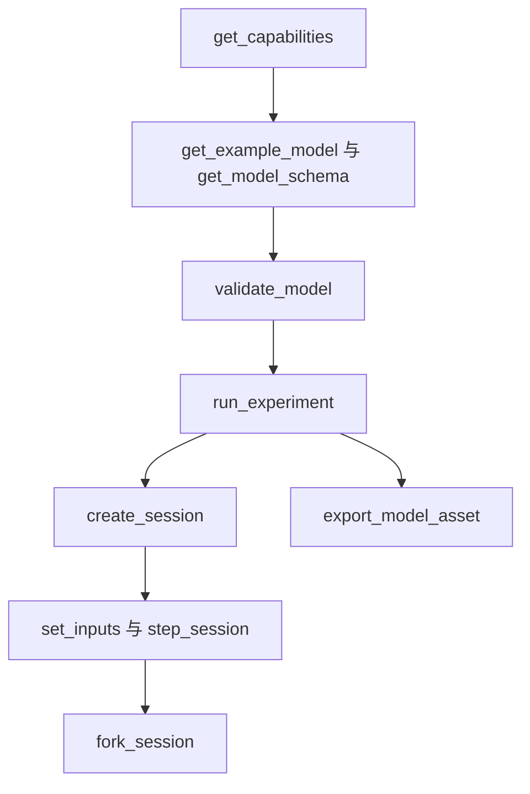

# 智能体接口

[English](AGENT_API.md) · **简体中文** · [Français](AGENT_API.fr.md) · [Русский](AGENT_API.ru.md) · [日本語](AGENT_API.ja.md) · [한국어](AGENT_API.ko.md) · [Deutsch](AGENT_API.de.md) · [Español](AGENT_API.es.md) · [Italiano](AGENT_API.it.md) · [Português](AGENT_API.pt-BR.md)

`Power.Core`、`Power.Agent` 与 MCP 是同一个物理核心的不同入口。API 不绑定某个 GPT 版本或模型提供商。先读取版本、能力与 schema,再生成模型。熟悉的名字并不表示该元件已经实现。

[有限气体网络](GAS_NETWORK.zh-CN.md) 可通过 JSON、CLI 与 MCP 使用,气体组分、受控节流、固定储气库、壁面热链与守恒通道保留在可移植资产中。现有线性模型与封闭气缸模型的语义保持不变。

[耦合离合器元件](CLUTCH_NETWORK.zh-CN.md) 可通过共享的 JSON、实验与会话契约使用。它包括有界接合输入、静摩擦与滑摩容量、有符号速比、相位/热量输出以及事务性内部事件。独立的 [精确配对](CLUTCH_PHYSICS.zh-CN.md) 仍是验证参考。

[理想齿轮/行星元件](GEAR_NETWORK.zh-CN.md) 参与共享求解器与文档契约。`ideal_gear` 有 A/B 端口和一个有符号非零速比;`planetary_gear` 有太阳轮/齿圈/行星架端口 A/B/C,以及大于一的齿圈/太阳轮齿数比。需要相容的初始转速与独立的永久约束。能力描述秩策略、求解器容差与平均反作用输出。

[液压活塞契约](HYDRAULIC_PISTON.zh-CN.md) 增加 `translational` 节点、`linear_spring`、`hydraulic_piston`、`piston_clutch` 与 `force_source`。智能体可以观察位移、速度、压力力、衬片能量/力、离合器容量与累积阻尼热。活塞离合器没有接合输入:指挥其充/放阀,并检查衬片接触。`get_capabilities.hydraulic_piston` 描述 SI 单位、体积/功约定、求解器范围与负压恢复。模型校验返回可操作的单位、范围与连接错误;会话修订、取消与独立分支契约保持不变。

`hydraulic_spool_valve` 引用一个活塞元件以及显式的关闭/全开位置。其开度跟随实际运动;它不接受开度指令或初始输入覆盖。流量、损失与开度可通过共享的模型/会话契约观察。`get_capabilities.hydraulic_spool_valve` 声明位置/流量单位、联立求解以及被省略的射流力物理。请求 `spool-regulated-pump` 以检查机械压力调节;参见 [计量契约](HYDRAULIC_SPOOL.zh-CN.md)。

`gas_piston` 用显式面积、参考容积/位置、绝对参考压力与有符号压缩方向,把平动节点连到运动气室。观察气体质量、能量、压力、温度、容积、力与参考功。把它与同一质量上的液压活塞组合成蓄能器;输运使用显式气体端口/热链。校验检查单一容积所有者与正的名义气体容积。能力声明四分之一容积的区间限制;契约说明壁面耦合的精度边界。请求 `gas-accumulator-pump`;参见 [气体/液体契约](GAS_PISTON.zh-CN.md)。

`gas_fuel_injector` 连接相容的有限被追踪源/接收气体容积与一根显式定时曲轴。其输入是每循环请求的 kg;观察锁存的请求、本循环/累计已供给燃油以及平均供给流量。窗口中途的输入更改作用于下一个被观察的循环。背压/供油不足可以造成供给不足,而不会产生执行错误;使用输出证据与 KPI。能力声明定时、剂量与范围边界。请求 `metered-fired-cylinder`;参见 [计量契约](FUEL_METERING.zh-CN.md)。这是气体供入;液体喷雾、蒸发以及已标定的燃油/ECU 硬件仍未完成。

## 启动与客户端配置

```sh
dotnet run --file tools/Build.cs -- build
dotnet /absolute/path/to/Power!/src/Power.Mcp/bin/Release/net10.0/Power.Mcp.dll
```

通用 MCP 客户端条目。把它放进客户端的服务器配置,并替换路径:

```json
{
  "mcpServers": {
    "power": {
      "command": "dotnet",
      "args": ["/absolute/path/to/Power!/src/Power.Mcp/bin/Release/net10.0/Power.Mcp.dll"]
    }
  }
}
```

Windows 使用同一条 `dotnet` 命令,以及指向 DLL 的绝对路径。生产连接应直接运行已构建的 DLL,这样构建输出不会混入 stdio 协议。服务器不需要 Unity、凭据或网络连接。首次 NuGet 还原确实需要网络。传输与版本兼容性来自锁定的官方 [MCP C# SDK](https://csharp.sdk.modelcontextprotocol.io/v2/concepts/getting-started.html)。

## 工具与结果

在智能体 API 版本 0.31.0 中,`get_example_model` 接受可选的 `name`:`electrothermal`(默认)、`sealed-cylinder`、`gas-network`、`moving-cylinder`、`crank-timed-cylinder`、`fired-cylinder`、`fired-clutch`、`fired-planetary`、`fired-converter`、`fired-hydraulic`、`fired-pump`、`fired-pump-losses`、`electric-pump`、`pressure-regulated-pump`、`battery-regulated-pump`、`piston-actuated-clutch`、`spool-regulated-pump`、`gas-accumulator-pump`、`metered-fired-cylinder`、`film-fired-cylinder`、`liquid-injected-cylinder`、`needle-actuated-cylinder`、`closure-compensated-cylinder`、`dual-clutch-transmission`、`fired-dual-clutch`、`controlled-dual-clutch`、`controlled-fired-dual-clutch`、`ravigneaux-transmission`、`fired-ravigneaux-converter`、`resolved-ravigneaux-transmission`、`fired-resolved-ravigneaux-converter`、`hydraulic-ravigneaux-transmission` 或 `fired-hydraulic-ravigneaux`。`get_capabilities` 通告支持的保真度级别、可读资产版本、求解器限制与输入界限。导出使用 `power.asset.v26`;v1–v23 资产仍可读取。输出通道及其单位由模型校验与会话创建返回。通过实验室 KPI 并不确立完整或已标定的动力总成。

| 工具 | 作用 |
|---|---|
| `get_capabilities` | 版本、模型能力、大小限制、时间语义与工作流 |
| `get_model_schema` | 完整的 `power.model.v1` JSON Schema |
| `get_example_model` | 带事件与 KPI 的可编辑示例 |
| `validate_model` | 检查模型与实验。返回指纹、通道与诊断,并且不推进时间 |
| `run_experiment` | 完整实验、两次不同批量大小的回放、KPI 与溯源。结果默认是紧凑的 |
| `export_model_asset` | 校验并导出 `.powerasset`。返回 Base64 内容、文件摘要、溯源与模型指纹 |
| `create_session` | 创建独立的交互仿真。返回初始快照与通道元数据 |
| `read_snapshot` | 当前时间、修订号、哈希与所选输出通道 |
| `set_inputs` | 在当前时刻原子地提交一帧输入,并推进会话修订号 |
| `step_session` | 原子地推进所请求的纳秒数。支持取消。修订号会推进 |
| `fork_session` | 把当前物理状态复制到修订号为 0 的新分支 |
| `close_session` | 释放一个会话 |

每个工具都有输入 schema 与输出 schema。成功与领域错误都返回 `structuredContent` 以及兼容的文本结果。MCP 的 `isError` 对应 `ok=false`。参见 [SDK 中的结构化工具结果](https://csharp.sdk.modelcontextprotocol.io/v2/concepts/tools/tools.html)。

```json
{"schema":"power.agent.v1","ok":true,"data":{"revision":"2","time_ns":"1000000000","state_hash":"...","values":[]}}
```

```json
{"schema":"power.agent.v1","ok":false,"error":{"code":"revision_conflict","message":"Read the snapshot, then use its current revision.","retryable":true,"current_revision":"2"}}
```

参见 [模型 schema](../schemas/power.model.v1.schema.json) 与 [响应 schema](../schemas/power.agent.v1.schema.json)。模型 schema 检查结构。编译器随后检查量纲、拓扑、正值、有限值与数值系统。实验校验检查节拍对齐、事件顺序、通道与 KPI 界限。

## 操作序列



1. 调用 `get_capabilities`,确认你需要的物理元件受支持。
2. 取得示例与 schema,然后构建 `document` 对象。参数必须带单位。
3. `validate_model({"document": ...})`。根据 `error.object_id`、`error.field` 与 `error.code` 修复模型。
4. `run_experiment({"document": ...})`。检查 `data.passed`、`checks`、`replay` 与 `model.calibration`。`ok=true` 只表示实验已结束。KPI 仍可能失败。
5. 用同一文档 `create_session`。保留 `session_id`、初始 `revision` 与通道映射。
6. 例如 `set_inputs({"session_id":"...","expected_revision":"0","values":[{"channel":"100","value":24}]})`,然后读取返回的修订号。
7. `step_session({"session_id":"...","expected_revision":"1","delta_ns":"1000000000"})` 返回一秒之后的快照。
8. `fork_session({"session_id":"...","expected_revision":"2"})`。把子会话制动到 4 V,父会话保持为对照。
9. 比较之后,用各自最新的修订号对每一个调用 `close_session`。

要在 Unity 中查看模型,调用 `export_model_asset({"document": ..., "name": "My laboratory"})`。对 `data.content` 做 Base64 解码,用 `data.asset_sha256` 对照整个文件,把它保存为 Unity `Assets` 下的 `.powerasset`,并在资产 Inspector 中用 **Open in Studio** 打开。该工具只返回内容。它不写本地文件。导出成功表示数据有效。KPI 与标定是分开的检查。格式与限制见 [模型资产](ASSET_FORMAT.zh-CN.md)。

修订号从 0 开始。每次成功的输入提交和每次成功的步进都加 1。过期、无效或已取消的操作不加修订号。分支不改变父修订号。任何传输中断之后,读取快照并使用那个修订号。不要重发仍携带旧修订号的写入。

会话快照中的 `time_ns`、`revision` 与通道 ID 是字符串,因此它们在越过 JavaScript 整数限制后仍保持精确。模型文档中的实验时间最多一小时。模型输入通道目前是整数。如果另一个 JSON 客户端必须保持精确,选择不大于 `2^53-1` 的 ID。输出中的高命名空间 ID 保持为字符串,不变。

`read_snapshot` 上的 `channels` 是输出 ID 字符串的数组。省略它则返回每一个输出。输入通道与重复字段会被拒绝。`include_samples=true` 才会让实验返回每一个采样边界。

## 错误与修复

| 错误 | 下一步 |
|---|---|
| `model_unit` / `model_connection` / `model_range` | 修复该对象和字段上的单位、引用或参数 |
| `invalid_argument` / `invalid_json` | 修复字段、事件顺序、时间或文档结构 |
| `unknown_channel` / `invalid_input` | 从通道表中选择一个输入,并去掉重复项与非有限值 |
| `invalid_time_step` | 使用正整数节拍数,每次调用最多一百万个节拍 |
| `numerical_failure` | 检查参数尺度、输入与步长。当前状态未被修改 |
| `revision_conflict` | 读取最新快照,再根据该状态决定 |
| `cancelled` | 整批已回滚。用更小的批量重试 |
| `session_capacity` | 关闭不再需要的会话 |
| `unknown_session` | 进程已重启,或会话已关闭。重新创建并回放 |

会话是进程内对象。它不持久化,也不附着到正在运行的 Unity 场景。MCP 接口目前在同一核心上运行无头实验。以后的 Unity 连接仍必须保持修订号、时间与原子性契约。

## 增加元件

写下方程与范围,定义带单位的端口与参数,在核心中实现它们,并从解析解、守恒、步长收敛与失败测试取得证据。然后加入 schema 与能力发现,交付可回放的实验,并连接 Unity 视图。实测溯源与不确定度单独记录。测试通过并不表示模型已标定。

## 气体网络工作流

请求 `gas-network`,校验它,然后用现有工具运行实验并导出其资产。`power.model.v1` 增加气体节点/元件定义;客户端应从 schema 与能力中发现它们。工具名不变。每个气体容积消耗两个标量状态,相连容积必须共享 R 与 gamma。

`gas_orifice` 输入使用 `[0, 1]` 内的 `fraction` 值。缺失或为零的输入通道保持显式的 `initial_input` 固定。校验与导出在任何实验执行之前拒绝越界的排程值。交互拒绝同时保留状态与修订号。编译、成功执行、KPI 成功与标定保持区分:该示例是合成的,并且是 `unverified`。

纯气体的会话操作使用相同的纳秒时间、修订检查、取消、过滤快照与独立分支。会话从元件初始输入开始;`create_session` 不执行实验的事件排程。该排程使用 `run_experiment` 或可移植回放。静态校验不能保证未来状态在数值上仍可解:遇到 `numerical_failure` 时,减小 `step_ns`,并在重建会话之前检查流通面积、容积、热导与初始条件。

## 运动气缸工作流

`get_example_model({"name":"moving-cylinder"})` 返回一个未标定的拖动实验,带有两个时间控制的节流、曲轴压力功与壁面传递。没有 `storage` 的气体节点必须恰好连接到一个 `gas_cylinder`,其参数提供几何。编译器校验所有权,并由气体节点的压力/温度与曲轴的初始几何导出初始质量/能量。

能力通告 `moving_cylinder_gas_exchange`、0.25 rad 曲轴界限与分裂积分范围。气体状态仍是气体节点上的通道;容积、排量与扭矩是气体气缸元件上的通道。实验、导出、会话、修订与失败契约不变。参见 [运动气缸](MOVING_CYLINDER.zh-CN.md)。按时间排程的节流并不确立曲轴转角气门定时或燃烧。

## 曲轴定时气门工作流

`get_example_model({"name":"crank-timed-cylinder"})` 返回一个 720 度拖动实验,带有变转速、进/排气曲线与壁面热。`gas_orifice` 上的 `valve_timing` 需要转动的 `crank_node`,以及带单位的 `cycle_angle`、`open_angle` 与 `duration_angle`。能力对象通告循环、曲线、限制与恢复。参见 [定时契约](VALVE_TIMING.zh-CN.md)。

定时输入通道表示 `[0, 1]` 内的 `peak_opening`;可观察的 `effective_opening` 由实际曲轴转角导出。用 KPI 字段 `opening` 检查它。停住的曲轴可以保持开启;反向运动沿同一曲线折返。相位是显式的,独立于气缸几何相位。排程的峰值变化缩放凸角;它不替换曲轴定时。

校验检查拓扑与参数,但不保证运行时分辨率。遇到 `numerical_failure` 时,减小 `step_ns`,使角度行程与端点转速行程保持在 `min(0.25 rad, duration_angle/8)` 之内,然后重建会话。整个失败批次保留输入、状态与修订号。资产 v11 保留该曲线以及 v1–v10 兼容性。新保真度是 `crank_timed_gas_exchange`;成功执行、通过 KPI 与标定保持区分。

## 预混燃烧工作流

`get_example_model({"name":"fired-cylinder"})` 返回一个驱动外部负载的预混点火气缸。`combustion` 能力声明 Wiebe 预设、燃油/空气/产物类别、输入范围、向前历史行为与数值限制。气体节点指定 `gas.premixed`,其储气库节流指定显式的 `reservoir_fractions`。编译器拒绝缺失分数、不相容的相连混合物,以及一个气室上的多个燃烧元件。

`premixed_combustion` 把转动的 `node_a` 连到预混气体 `node_b`,并带有显式的循环/开始/持续角度、形状指数与燃烧系数。其可选输入通道通过 `[0,1]` 内的 `burn_multiplier` 缩放燃烧危险率。零会禁用燃烧,但不会阻止燃油到达开启的入口。超过已记录前沿的向前角度会消耗燃油;停止/反转/折返不能重复放热。

从通道表发现组分质量、化学能、累积已燃燃油、已释放热量与 `burn_frontier_angle`。全局燃油/新鲜空气残差补充总质量与能量。对预混气体,`reservoir_enthalpy` 包含输运的化学能,`net_fuel_energy_in` 单独暴露该部分。气体内能仍是热能。报告保真度是 `premixed_gas_transport` 或 `premixed_wiebe_combustion`;二者仍为 `unverified`。

遇到燃烧分辨率失败时,减小 `step_ns` 并重建会话。启用的燃烧要求曲轴行程与端点转速行程不大于 `min(0.25 rad, burn duration/32)`;每节拍热量限制为燃烧前热能的 25%。整次调用的回滚与修订契约保持不变。有效模型仍可能违反运行时界限;成功执行仍可能使 KPI 失败。方程与限制见 [预混燃烧](PREMIXED_COMBUSTION.zh-CN.md)。

## 离合器工作流

`get_example_model({"name":"fired-clutch"})` 返回点火发动机、独立负载、离合器与热沉,以及精确节拍的接合/分离事件。`clutch` 能力声明输入界限、求解器预算、模式代码与输出历史语义。以 Nm 定义 `parameters.static_capacity` 与 `sliding_capacity`,再加上有符号非零 `ratio`。编译器强制 `static >= sliding >= 0`、转动端点以及热损失热沉。对地制动使用省略或为零的 `node_b`,速比为一。

`engagement` 输入位于 `[0,1]`;零表示分离。从通道表发现当前相对滑差、上次接受的相位、上一节拍的平均扭矩/热功率以及累积摩擦热。相位为 0 分离、1 锁止、2 正滑差、3 负滑差。更新接合不会改写前一节拍的平均输出或相位。保真度 `hybrid_clutch_powertrain` 标识含有该元件的模型;它并不意味着完整变速器或已标定车辆。

用 `run_experiment` 评估 KPI 与回放证据,或用会话工具在保留修订检查与独立分支的同时改变接合。数值失败时,减小 `step_ns`,并检查惯量/速比尺度、冗余约束与容量排程。失败或取消的调用不提交输入、相位、热量或物理状态。变化载荷下的脱离使用区间平均需求;过渡附近需要细化时间步。参见 [离合器网络](CLUTCH_NETWORK.zh-CN.md)。

## 理想传动工作流

请求 `fired-planetary`,以获得合成发动机、齿圈制动、太阳轮/齿圈离合器、行星排与主减速器。排程的升挡/降挡使用与其他实验相同的精确节拍语义,并有 84 个匹配的回放边界。`node_c` 是行星架;齿轮只接受其转动端口与 `parameters.ratio`。

`slip_speed` 与 `constraint_error` 暴露当前转速与相位残差。`torque`、`torque_at_b` 以及仅行星排的 `torque_at_c` 是对应转子在上一个完整节拍上的平均反作用。它们从零开始,并且不会被边界输入更改改写。初始转速失败返回字段为 `initial_speed` 的 `model_connection`;相关约束行返回字段为 `gear.constraints` 的 `model_solver`。应改正拓扑或初始条件,而不是原样重试未更改的数据。

资产 v11 保留全部先前读取器,包括一份真实的 v7 点火离合器夹具。该模型确立一条合成传动路径,而不是完整 DCT/AT、液压驱动、TCU 行为或实测标定。真实的 Unity 证据仍是分开的。

## 变矩器工作流

请求 `fired-converter`,以获得合成发动机、映射流体路径、独立锁止、行星换挡与热沉。能力通告全部四张必需的有符号图谱、点/元件限制、参考构件约定、非线性迭代预算、可观察语义与运行时恢复。保真度是 `quasisteady_converter_powertrain`;通过 87 个回放边界确立的是数值一致性,不是实测变速器性能。

`torque_converter` 需要泵轮/涡轮 `node_a`/`node_b`,可选的 `heat_node`,以及 `parameters` 下的四个显式图谱数组。每个点有无量纲转速比、扭矩比,以及单位为 `nm_s2_rad2` 的系数。不会推断图谱、反向象限、输入通道或导轮转子端口。编译检查插值无源性与图谱连续性,并用对象 ID 报告 `converter.<map>` 或 `converter.counter_rotation`。

从通道发现平均泵轮/涡轮/导轮扭矩、流体热功率、累积流体热、当前有符号转速比与驱动代码。并联的 `clutch` 提供锁止接合。会话修订、取消、分支独立与完整回滚契约也覆盖变矩器历史。遇到 `numerical_failure` 时,减小 `step_ns`,并检查图谱斜率、惯量/转速尺度与离合器约束。参见 [方程、界限与证据](CONVERTER_NETWORK.zh-CN.md)。导出使用资产 v11;真实的先前夹具保留 v1–v10 兼容性。自动液压控制与真实的 Unity 编辑器/Player 验证仍是分开的未完成工作。

## 液压工作流

请求 `fired-hydraulic`,以获得操作换挡与锁止离合器的阀门控制压力腔。`hydraulics` 能力暴露表压约定、储能与流动模型、单位、迭代限制、压力容差、执行器范围与恢复。保真度是 `compliant_hydraulic_powertrain`;标定仍为 `unverified`。

液压节点需要单位为 `m3_pa` 的正柔度 `storage`,以及非负初始表压。`hydraulic_resistance` 与 `hydraulic_orifice` 需要显式流量系数与阀门开度;孔口还需要正的过渡压力。储液器端点需要显式的 `reservoir_pressure`。缺失或为零的输入通道固定所给开度。编译器从不推断流体属性、泄漏、储液器压力或 OEM 图谱。

`hydraulic_clutch` 在 `parameters` 下有转动端口与几何,包括其液压 `pressure_node`。它没有接合输入。在现有离合器历史通道之外,发现压力、储存的参考容积、液压边界功、存量残差、节流热、压紧力与当前摩擦容量。阀门输入更改会保留储存的压力与上一节拍的平均值,直到已接受的步进推进它们。

完整状态、修订、取消与分支契约覆盖液压压力与账本。数值失败时,减小 `step_ns`,并检查柔度、系数、表压与执行器几何。最终压力为负会拒绝整批;它不会被静默钳位。参见 [液压网络](HYDRAULIC_NETWORK.zh-CN.md)。资产 v11 保留压力边界、流动定律与执行器几何;全部 v1–v10 读取器仍然保留。实测损失/控制图谱、实测阀门/蓄能器动力学、完整 ECU/TCU 控制与真实 Unity 验收仍未完成。

## 泵供给工作流

请求 `fired-pump`,以获得曲轴驱动泵、柔性管路、泄压与压力驱动的传动。能力暴露 `hydraulic_pump`、排量单位、入口约定、联合求解器限制与有符号功语义。泵的 `hydraulic_work` 是内部的轴到流体传递;全局 `hydraulic_work` 仍是外部储液器功。该示例的外部液压功为零,并有显式的初始储存压力。

`hydraulic_pump` 需要轴/出口端口、显式的 `parameters.inlet_node`、单位为 `m3_rad` 的正 `displacement`,并且只在入口为零时需要储液器压力。泄压需要流导与开启压力,没有输入通道。缺失或域错误的端口、量纲以及无关参数会产生可操作的校验错误。资产 v11 保留这两个定义。修订、取消、分支、完整回滚以及 KPI/标定区分保持不变。参见 [泵](HYDRAULIC_PUMP.zh-CN.md)。

## 泵总成工作流

请求 `fired-pump-losses`、`electric-pump`、`pressure-regulated-pump` 或 `battery-regulated-pump`。`pump_assembly` 能力给出净流量/反作用方程、损失单位、元件组成与电气供电边界。模型包含普通的泵、节流与轴记录;电驱动示例增加现有的 RL 电机。不需要新的元件种类、schema 或资产版本。核心客户端可以用自己的稳定 ID 调用 `HydraulicPumpAssembly.CreateComponents`,以产生相同的图定义。

泄漏是显式的出口到入口节流,系数单位为 `m3_s_pa`;轴摩擦是接地的、零刚度轴,阻尼单位为 `nm_s_rad`。二者都需要所给数值与显式热路由。电泵通过 `v` 输入接受电机电压,反电动势、电流与铜损热量在共享求解中。它不推断电池、效率、黏度、控制器或标定。应发现通道,而不是把理想泵支路流量解释成总成净供给。现有的修订、取消、分支与完整批量回滚适用于整个组合。

## 压力反馈工作流

请求 `pressure-regulated-pump`。能力通告 `pressure_controller` 元件、有量纲增益、传感器/目标要求、整数采样、钳位与事务语义。用现有工具校验、运行并导出。资产 v12 保留完整的控制器定义,全部先前读取器仍受支持。

示例的 `105` 输入以 SI Pa 改变压力设定值。电机的电压通道 `100` 由控制器拥有,并且不在可写通道中。直接写入返回 `controlled_input`,并指导去写 `pressure_setpoint`;拒绝既不改变状态也不改变修订号。负的压力目标会被拒绝。静态校验检测冲突的所有者、错误的域/单位以及未对齐的采样周期。

通过可发现的输出 ID 读取 `sampled_pressure`、`pressure_error`、`integral_voltage` 与 `command_voltage`。这些是上次采样的状态与保持的指令。快照时间戳标识时钟相位。输入更改不推进控制历史;下一个到期采样在物理节拍上更新它。分支包含积分记忆与时钟相位。取消或随后的算术/求解器失败不提交该批的任何部分。溢出恢复需要检查增益、目标与积分尺度,而不是盲目重试相同输入。

当执行器饱和时,成功执行与精确回放可以伴随失败的跟踪 KPI。把 `passed` 和误差界限与 `ok` 分开检查。示例的理想传感器与电压源是研究元件;它们并不确立电池、完整 ECU/TCU、已标定控制或 Unity 验收。

## 电池供电工作流

请求 `battery-regulated-pump`。能力暴露有限电荷、开路电压/RC 方程、负载与占空比规则、控制所有权与恢复。电池节点的 `storage` 使用 `c` 或 `ah`,`initial` 是单位为 `fraction` 的荷电状态,`position` 是单位为 `v` 的极化电压。电池记录需要全部五个电气参数。单位、容量/状态界限、源端口、热沉、递增的开路电压以及控制器周期都会被校验。

`battery_motor` 需要转动 A 端口、电池 B 端口以及 [-1,1] 内的占空比输入。`resistive_load` 有电池 A 端口、电阻以及 [0,1] 内的开度。示例的 `106` 通道改变附件负载;`105` 以 SI Pa 改变压力设定值。占空比 `100` 由 `pressure_duty_controller` 拥有,不能直接写入。其增益使用 `fraction_pa` 与 `fraction_pa_s`;输出界限无量纲。

在 `integral_duty` 与 `command_duty` 之外,读取 `state_of_charge`、`charge`、`battery_current`、`terminal_voltage`、`polarization_voltage`、电池储存能量与热量。电压/电流/负载功率通道是瞬时代数可观察量,因此有效的占空比/负载更改可以改变它们,而不改变储存状态。电池功是内部的;全局 `source_work` 只包括显式外部功率边界。荷电状态/电压违规会拒绝整批。重试之前检查初始电荷、容量、占空比、负载与批量长度。没有静默的荷电状态钳位。

资产 v22 保留全部供电/控制参数,以及真实的先前读取器/夹具。取消与随后的失败保留电荷、RC/控制记忆、输入与修订号。独立分支从同一物理历史比较附件/占空比策略。全部参数仍未核实;理想的平均占空比变换器不是电池 BMS、PWM/电流环、完整车辆电气系统或标定。

## 液体油膜工作流

请求 `film-fired-cylinder`。`fuel_film` 能力声明有限气体/壁面端口、相能参考、单位、分裂精度与范围。提供显式的初始液体存量、温度、比热、饱和温度、潜热内能与热导。在运行或导出模型之前先校验并发现输出 ID。油膜不暴露可写输入通道。

在接收端燃油与反应热之外,读取剩余 `mass`、有符号 `internal_energy`、`chemical_energy`、`evaporated_fuel_mass`、上一节拍平均 `mass_flow`、累积 `film_wall_heat` 以及瞬时 `heat_flow`。干燥油膜报告所声明的饱和温度与零热流。实际蒸气可用性支配反应;有效的油膜定义并不意味着发生蒸发或通过放热 KPI。

资产 v18 保留相量与更早的读取器。修订检查、取消、独立分支与延迟失败回滚包括全部液体、热、组分与补偿历史。错误的单位/端口、过热的初始液体以及过多的状态计数会返回结构化错误。在重试失败模型之前,检查所报告的对象/字段以及有限热预算。[油膜契约](FUEL_FILM.zh-CN.md) 记录方程与精度边界。初始湿润并不确立液体喷射、已标定的燃油属性、完整发动机控制或真实的 Unity 验收。

## 有限液体喷射工作流

请求 `liquid-injected-cylinder`。`liquid_fuel_injector` 能力声明有限柔性源、`kg` 循环输入、密度/柔度单位、能量账本与接收端边界。提供全部油轨量、喷嘴几何以及现有的油膜/曲轴引用。先校验,并发现输出 ID/单位。

示例的 `104` 输入请求每循环 kg。更改在稍后被观察的向前窗口锁存;当前供给仍可能受源压力限制。在 `requested_fuel_dose`、`delivered_fuel_dose`、`total_fuel_delivered` 与上一节拍平均 `mass_flow` 之外,读取油轨 `mass`、`pressure`、储存的 `internal_energy`、化学能与体积。油膜质量/温度/蒸发以及分开的反应热标识接受剂量与实际蒸气燃烧之间的延迟。

元件 `source_work` 是释放的储存油轨压力功,`hydraulic_work` 是导出的接收端压力功,`fluid_heat` 是路由到油膜壁面的喷嘴耗散。它们的恒等式不同于全局外部源功。可忽略液体体积的接收端显式导出位移功;它不增加隐藏的曲轴功,也不建模喷雾几何。

资产 v19 保留完整的源、喷嘴与定时,以及 v1-v18 读取器。修订、取消、分支与延迟/试探失败包括每一项油轨/配额/热历史。错误单位、不可能的柔性体积、过热液体以及不匹配的油膜/曲轴所有权会产生结构化诊断。重试之前检查失败的对象/字段以及压力/剂量边界。工具执行成功并不意味着完全供给、通过 KPI 或已标定硬件。参见 [低压喷射](LIQUID_FUEL_INJECTION.zh-CN.md)。

## 物理针阀工作流

请求 `needle-actuated-cylinder`。能力声明磁斜率单位、磁通能量、实际开度、采样控制与研究限制。喷油器的 `104` kg 指令可写;驱动器拥有的线圈电压 `107` 不可写。被拒绝的写入返回 `controlled_input`,带有正确的指令名/通道,并保留状态/修订号。更新请求燃油质量,并推进精确的物理节拍。

在线圈电流、磁能、铜损热量、电功、保持电压与上次采样的目标/供给之外,读取实际针阀位移/速度与喷油器开度。电压移除、窗口关闭或达到目标供给之后,流体仍可以继续。剩余液体、气体燃油、未燃/边界燃油与反应保持分别可观察。有效请求或成功的工具并不确立精确的剂量供给或已标定控制。

资产 v20 保留磁/行程/针阀/驱动器表以及 v1-v19 读取器。采样周期必须对齐到节拍;电压有一个所有者;针阀、线圈与曲轴引用必须匹配。对求解器错误,检查正的 `L(x)`、R/L/梯度、行程量与时间步;在声称动态精度之前细化物理/控制区间。取消、分支与被拒绝/试探的批次包括全部磁通、热、采样/保持与相历史。参见 [针阀驱动](NEEDLE_ACTUATION.zh-CN.md)。

## 闭合补偿针阀工作流

请求 `closure-compensated-cylinder`。其驱动器启用一个对齐的有限 `closure_prediction_ns` 时程。能力给出 4096 节拍限制、输入保持假设与有界断电搜索。源的 kg 请求仍可写;电压仍由驱动器拥有。在实际针阀位置、供给量与保持电压之外,发现预测质量/计数、断电锁存与待关闭节拍通道。

预测是一次分开的全状态对象回放。它保持其他指令,并且不知道未来的外部输入事件,因此应检查实际闭合后的供给以及时程/时间步细化,而不是把预测当作测得的燃油。失败或取消的预测不提交真实批次的任何部分。时钟溢出、无效时程或非单调断电候选需要修改定时/模型假设;部分预测不会被静默接受。

资产 v21 写入该时程并保留更早的读取器。修订、独立分支与整批回滚包括预测锁存与倒计时。核心客户端可以发出只读的 `PredictNeedleClosure`;MCP 快照暴露上次采样所选候选的估计。范围与证据见 [闭合预测](CLOSURE_PREDICTION.zh-CN.md)。

## 双离合动力路径工作流

请求 `dual-clutch-transmission` 或 `fired-dual-clutch`。能力描述普通的七前进/倒挡图、两条输入路径、三个输出分支与研究限制。在更改选挡/驱动指令之前,校验并发现每一个齿轮反作用、离合器滑差/模式/热量以及转子转速。

示例使用驱动通道 `500`/`501` 与选挡通道 `600`-`607`,对应前进 1-7 与倒挡。指令是分数;速比仍是永久约束。预选一条无载路径时,释放其先前选挡器并接合目标,然后单独协调驱动离合器交接。核心的 `DualClutchGraph.SelectPath` 产生该路径的原子选挡指令集。它不实现 TCU 感知、互锁或执行器动力学。

快照暴露全部自由/已选毂、输入/输出转速、同步与驱动热量、齿轮相位误差,以及全局源/能量/燃油证据。不安全的组合可以卡死或制动物理变速器;成功的输入写入并不确立一次有效换挡。修订检查、取消、独立分支与延迟失败保留每一个状态/历史。现有可移植格式与先前读取器予以保留。参见 [双离合变速器](DUAL_CLUTCH_TRANSMISSION.zh-CN.md)。

## 采样 DCT 控制工作流

请求 `controlled-dual-clutch` 或 `controlled-fired-dual-clutch`。把整数 `requested_gear` 写到通道 `700`:1-7 为前进,-1 为倒挡,0 为空挡。控制器拥有驱动 `500`/`501` 与选挡器 `600`-`607`;直接写入返回 `controlled_input`,并带有正确的请求挡位通道。分数挡位无效,并且不改变状态/修订号。

读取已确认的实际挡位、受指令的选择、相位、目标选挡器滑差与故障。请求的挡位并不意味着换挡已完成。状态机预选无载路径,确认物理锁止,使用分阶段的扭矩中断交接,并暴露超时/方向/持续失锁故障。空挡在到期采样上中止;另一个目标可以恢复故障。瞬态滑差可以在控制器监测其持续时间时报告未确认的实际挡位。

显式的被报告状态限制是 128,32 个节点/64 个元件不变。实际的点火/控制器组合以及接近/超过限制的检查已经验证;Standard 检查仍在 .NET 10 上运行,并且不是 Unity 证据。资产 v22 保留不可变路线与定时状态,以及先前读取器。取消、分支、延迟失败与补偿坐标历史仍是整批事务。完整的 ECU 扭矩混合、执行器与标定仍是分开的要求。参见 [DCT 控制](DCT_CONTROL.zh-CN.md)。

## 复合行星路径

`double_pinion_planetary_gear` 需要太阳轮/齿圈/行星架端口 A/B/C,以及速比 `k > 1`。其约束是 `sun - k ring + (k-1) carrier = 0`。现有的 `planetary_gear` 保留其单行星轮符号。二者都暴露转速/相位残差与全部三个反作用扭矩。不相容的初始转速、错误的域、冗余行与不完整的行星架返回可操作的编译错误。

请求 `ravigneaux-transmission` 或 `fired-ravigneaux-converter`,以获得显式的五元件研究排程、变矩器/锁止集成与完整物理回放。接合输入是分数;成功的指令并不证明某个挡域已锁止。没有 AT 控制器拥有这些预设输入。资产 v23 保留拓扑并读取 v1-v22。参见 [Ravigneaux 变速器](RAVIGNEAUX_TRANSMISSION.zh-CN.md)。

## 相对行星架啮合与内部行星动力学

`carrier_gear` 需要彼此不同的转动 A/B/C 端口、有限非零有符号速比,以及相容的初始转速。约束是 `A - ratio B + (ratio-1) C = 0`;支持负的外啮合与正的内啮合速比,包括一。C 是带有自身反作用扭矩的真实运动行星架,不是隐含地面。通道暴露全部三个平均扭矩以及转速/相位残差。零速比、缺失行星架、错误的域与相关约束返回带类型的编译错误。

请求 `resolved-ravigneaux-transmission` 或 `fired-resolved-ravigneaux-converter`。二者都保留四个物理啮合、两个绝对行星自转状态,以及行星架中声明的轨道惯量。普通转子储能包含它们的实际动能;输入仍是预设的接合分数,而不是完整 AT 控制。扁平图记录合计惯量与速比,而源描述保留生成它们的声明几何/质量。资产 v24 包含该原语并读取 v1-v23。参见 [分解行星](RESOLVED_PLANETS.zh-CN.md)。

## 泵供能的 AT 活塞驱动

请求 `hydraulic-ravigneaux-transmission` 或 `fired-hydraulic-ravigneaux`。在 700/701 直到 708/709 上使用显式充/放分数;点火锁止使用 710/711。先前的挡域接合 ID 不存在。写入之前先校验/发现通道。活塞压力/行程/接触决定容量;被 API 接受的指令并不确认物理锁止。

报告保留管路/腔室压力、行程、接触容量、泵功、扫过体积、摩擦/节流/阻尼热以及每一个模型哈希。完整修订、取消、延迟回滚与独立的阀门释放分支使用普通契约。该图使用现有资产 v24 记录,而不是新的序列化格式。参见 [AT 驱动](AT_HYDRAULIC_ACTUATION.zh-CN.md)。

## 液压 AT 反馈控制

`at_controller` 接受 [-1,4] 范围内的整数目标挡位；零表示空挡。它管理五组充油/泄压阀以及可选的变矩器锁止支路。支路顺序为行星架输入、小太阳轮输入、大太阳轮输入、行星架制动、大太阳轮制动，最后是锁止。

示例 `controlled-hydraulic-ravigneaux` 和 `controlled-fired-hydraulic-ravigneaux` 使用请求通道 900、控制器 ID 1400。两者分别保留 99 和 122 个报告状态，未改变 128 状态上限。资产 v26 保留支路、增益和时钟，并可读取 v1-v25。

这是研究控制，参数仍为 `unverified`。协调 ECU 扭矩融合、详细传感器/阀模型、完整车辆故障及 OEM 标定仍待完成。托管和 Standard 检查不能证明实际 Unity Editor/Play/Player/IL2CPP 验收。

[AT_CONTROL.zh-CN.md](AT_CONTROL.zh-CN.md)

## 泵送液体燃油轨

`liquid_rail_feed` 将液体喷射器与现有排量泵及显式质量/热边界配对。液压出口节点必须与燃轨的顺应性和初始绝对压力一致。配对泵和喷射器管理该压力节点；其他未计入的流体路径会被拒绝。

资产 v26 保留补给连接和源温度，并读取 v1-v25。泵轴/压力解析交换、独立联立 ODE 细化、热混合、质量/燃料/能量/体积账本、反向回输与完整回滚各有独立检查。

源是显式外部边界，不是已建模的有限燃料箱。油箱耗尽、泵效率/调压、管路损失、气蚀、压力相关物性和有限体积喷雾仍待完成。参数为 `unverified`；这不构成 OEM 标定或实际 Unity Editor/Play/Player/IL2CPP 验收。

[PUMP_FED_FUEL.zh-CN.md](PUMP_FED_FUEL.zh-CN.md)
