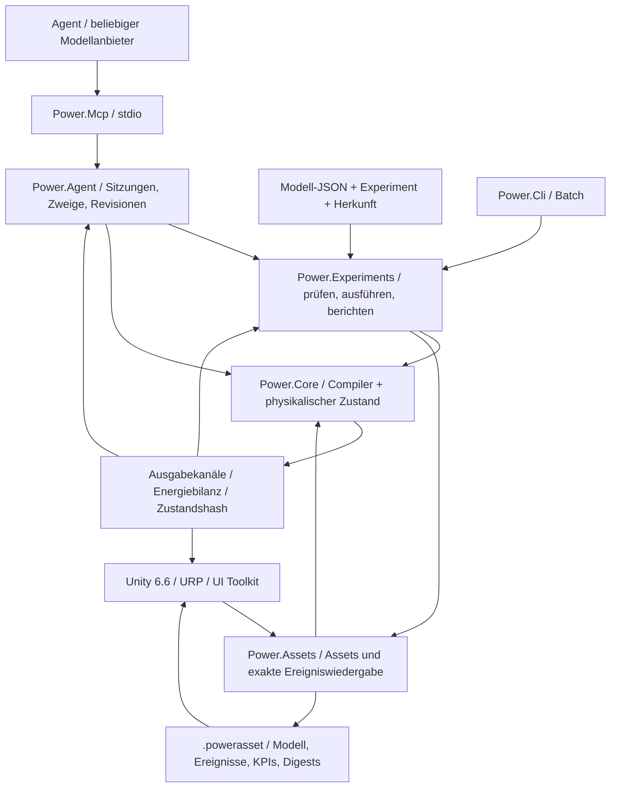

# C#-/Unity-/Agenten-Architektur

[English](ARCHITECTURE.md) · [简体中文](ARCHITECTURE.zh-CN.md) · [Français](ARCHITECTURE.fr.md) · [Русский](ARCHITECTURE.ru.md) · [日本語](ARCHITECTURE.ja.md) · [한국어](ARCHITECTURE.ko.md) · **Deutsch** · [Español](ARCHITECTURE.es.md) · [Italiano](ARCHITECTURE.it.md) · [Português](ARCHITECTURE.pt-BR.md)

Die aktive Anwendung bleibt C#/.NET mit Unity. Die archivierten nativen Prototypen verwenden jetzt **Zig 0.15.2**; die ursprüngliche C-Herkunft bleibt in Git und einem Quellenhash-Manifest erhalten. Die [native Grenze](NATIVE_ZIG.de.md) definiert eine eigene Shared Library und das bestehende versionierte binäre ABI. In den verwalteten Kern oder die Unity-Assemblies kommt keine native Laufzeitabhängigkeit.


Die Architekturentscheidung datiert vom 2026-09-07. Die aktive Linie ist von den alten C-Prototypen auf verwaltetes C# gewechselt. Unity stellt das 3D-Studio. Physikmodelle und die Agentenautomatisierung laufen für sich.



## Abhängigkeiten und Grenzen

`Power.Core` hat keine Abhängigkeit von Unity, Netzwerk, JSON, MCP, einem Modellanbieter oder einem Drittanbieterpaket. Dieselbe Quelle kompiliert nach `net10.0` und `netstandard2.1`. Records, Muster und das Übrige aus C# 14 werden zur Bauzeit in verwaltetes IL abgesenkt. Unity lädt nur die Assemblies. Die Kompatibilitätsdefinition `IsExternalInit` gilt nur für das Standardbibliotheksziel. Unity-Szenen serialisieren Record-Typen nicht direkt.

`Power.Experiments` macht aus Modell-JSON eine explizite Modellbeschreibung, begrenzt Experimentzeit und -größe, führt zwei Replays mit unterschiedlichen Batch-Größen aus, prüft KPIs und schreibt Nachweise. `Power.Agent` ist ein transportunabhängiger Arbeitsbereich. `Power.Mcp` stellt ihn über das offizielle SDK als Werkzeuge bereit. Ein Wechsel des Modellanbieters ändert nur den Agenten-Client.

`Power.Assets` zielt ebenfalls auf `net10.0` und `netstandard2.1` und hängt nur vom Kern ab. Es speichert die unveränderliche Modellbeschreibung, eine Herkunftszusammenfassung, Ereignisse und KPIs und bietet eine größenbegrenzte binäre Kodierung sowie einen Player. CLI und MCP exportieren geprüftes JSON als `.powerasset`. Nach dem Import kompiliert Unity das Modell neu und prüft den Fingerabdruck, statt Löserinterna zu serialisieren. Das Format steht in [Modell-Assets](ASSET_FORMAT.de.md).

Unity verweist direkt auf die Standardbibliotheks-Assemblies von Core und Assets. Der Szenencode baut Ansichten und Steuerungen aus Knoten und Kanälen und kann jede Topologie zeigen, die der aktuelle Kern unterstützt. Er baut kein festes Beispiel mehr von Hand. Allgemeines Bearbeiten und Speichern von Graphen ist nicht umgesetzt. Die tatsächliche Import- und Play-Abnahme braucht weiterhin den Unity-Editor.

## Modellkompilierung

`ModelDefinition` ist eine zusammensetzbare Topologiebeschreibung. Ein Knoten nennt seine physikalische Domäne, seinen Speicher und den Anfangszustand. Eine Komponente nennt Endpunkte, Parameter, Eingabekanäle und wohin Verluste gehen. Jeder dimensionsbehaftete Parameter trägt eine Einheit und wird zur Kompilierzeit auf SI normiert, einschließlich rpm nach rad/s und Grad nach Radiant.

Der Compiler kopiert Definitionen, sortiert stabile IDs und prüft Einheiten, Endlichkeit, Verbindungen, Eingabebesitz und Kapazität. Modelle sind auf 32 Knoten, 64 Komponenten und 128 gemeldete Zustandseinträge begrenzt. Nicht unterstützte oder unlösbare Definitionen liefern Objekt- und Felddiagnosen.

`CompiledModel` speichert die unveränderliche Topologie, die Kanaltabelle, den Modell-Fingerabdruck und die LU-Faktorisierung. Mehrere `Simulation`-Instanzen teilen sich ein Modell, und jede besitzt einen vollständigen Zustand und Arbeitsbereich. Änderungen an den ursprünglichen Beschreibungsarrays nach der Kompilierung ändern das kompilierte Modell nicht.

## Referenzgrenze der idealen Übersetzung

`IdealGearPair` und `SimplePlanetaryGear` sind unveränderliche Referenzprimitive bei konstanter Last mit expliziten SI-Eigenschaften und reinen Ergebnis-Records. Sie liefern unabhängige Nachweise für die getrennten gekoppelten Zahnradbedingungen und behalten einen reinen lokalen Referenzzustand. Das Planetenrad verwendet eine reduzierte Massenmatrix der kinetischen Energie und wird gegen eine getrennte Lösung der Beschleunigungsnebenbedingung geprüft. Siehe [den Referenzvertrag](IDEAL_GEARS.de.md).

## Dauerhafte Zahnradbedingungen

Der [gekoppelte Zahnradlöser](GEAR_NETWORK.de.md) projiziert den elektromechanischen Mittelpunkt und alle Kraftantworten von Zylinder, Wandler und Kupplung auf dauerhafte ideale Zahnrad- und Planetenbedingungen. Normierte Zeilen und Volltick-Faktoren sind unveränderliche kompilierte Daten; Faktoren variabler Intervalle und Multiplikatorpuffer gehören zu jeder Simulation. Anfangsdrehzahlen müssen verträglich sein, die anfängliche relative Phase bleibt erhalten, und abhängige Bedingungen werden abgelehnt. Mittlere Reaktionen je Port werden über akzeptierte interne Intervalle angesammelt und mit dem vollständigen Zustand kopiert, gehasht und zurückgerollt. Asset v8 führte begrenzte Topologiedatensätze ein, während frühere zahnradfreie Fingerabdrücke und Replay-Hashes unverändert bleiben.

## Gemeinsame Lösung von Wandler und Zylinder

Das [Wandlergesetz](CONVERTER_NETWORK.de.md) besitzt vier unveränderliche vorzeichenbehaftete Kennfelder und lehnt energieerzeugende Interpolation ab. Ein gemeinsames nichtlineares System löst Kurbelinkremente des Zylinders und die Mittelpunktsdrehzahlen der Wandlerports über dieselbe projizierte elektromechanische Antwort. Kupplungsiterationen und interne Ereignisintervalle verwenden dieses System erneut, einschließlich Antworten mit variabler Schrittweite. Wandlerfreie Modelle behalten ihren bisherigen Löserpfad und ihre Fingerabdrücke.

Mittlere Pumpen- und Turbinenmomente, mittlere Wärmeleistung und kompensierte kumulative Fluidwärme gehören zum transaktionalen Simulationszustand. Die Statorreaktion ist ihre entgegengesetzte Momentensumme, am feststehenden Bezug. Die Wärmeführung verwendet die tatsächlich abgeführte mechanische Arbeit. Kennfelddefinitionen gehen über JSON und begrenzte Datensätze von Asset v9; Faktoren und Laufzeithistorien rekonstruiert das Replay. Die Überbrückung ist eine getrennte parallele Kupplung. Die quasistationäre Komponente fügt keine Abhängigkeit von Core-Transport, Unity, JSON oder Drittanbietern hinzu.

## Hydrauliknetz und Druckbetätigung

Das [Hydrauliknetz](HYDRAULIC_NETWORK.de.md) führt den Überdruck über konstante Nachgiebigkeit und explizite lineare sowie regularisierte turbulente Drosseln fort. Erhaltenes Referenzvolumen, quadratische elastische Energie, Reservoirarbeit und Druckverlustwärme verwenden dieselben akzeptierten Überträge. Der Newton-Arbeitsbereich je Simulation ist begrenzt und allokationsfrei.

Druckbetätigte Kupplungen leiten die Kapazität aus dem hydraulischen Intervallmittelpunkt, der Kolbenfläche, der Vorspannung, der Reibung und dem wirksamen Radius ab. Jeder spekulative Versuch eines Kupplungsereignisses besitzt eine vollständige Kopie des Hydraulikzustands; das Rollback umfasst Druck, mittlere Ströme, kumulativen Verlust und Randbilanzen. Mittlere Ausgaben werden über den vollständigen Tick normiert. Asset v10 erhält die expliziten Druckränder und Stellports; hydraulikfreie Pfade behalten ihre bisherigen Fingerabdrücke. Pumpen und bewegte Kolben brauchen weitere erhaltende Komponenten.

## Elektromechanischer Kern

Der [gekoppelte Kupplungslöser](CLUTCH_NETWORK.de.md) ergänzt das elektromechanische Mittelpunktsystem mit Zylinder um begrenzte Haftreaktionen und Gleitreibung. Interne Ereignisse bei Schlupf null werden gegen vollständige spekulative Zustandskopien eingegrenzt; Intervallfaktoren gehören zu jeder Simulation. Reibungswärme geht in thermische Knoten oder in die externe Bilanz. Phase, mittleres Moment, mittlere Leistung und kompensierte kumulative Wärme nehmen an Hashes, Abzweigungen und am Rollback des gesamten Batches teil. Das [eigenständige Gesetz und das exakte Paar](CLUTCH_PHYSICS.de.md) bleiben unabhängige Referenzen bei konstanter Last. Die externe Zeit bleibt in begrenzten ganzzahligen Ticks.

Modelle mit abgeschlossenen Zylindern ergänzen eine begrenzte nichtlineare Lösung mit diskretem Gradienten um das bestehende elektromechanische Mittelpunktsystem. Die Druckarbeit des Gases ist an die Kurbelbewegung gekoppelt und in der Energiebilanz enthalten. Der ursprüngliche lineare Pfad behält Löserversion 2 und seine Modell-Fingerabdrücke; Zylindermodelle verwenden Löserversion 3. Siehe [die Gleichungen, Grenzen und Nachweise](SEALED_CYLINDER.de.md). Diese erste Zylinderkomponente leitet den Gaszustand konstanter Masse aus dem Kurbelwinkel ab. Getrennte Gasknoten festen Volumens tragen jetzt unabhängige Masse und innere Energie durch den [Gasnetz-Löser des Kerns](GAS_NETWORK.de.md); die [Kopplung des bewegten Zylinders](MOVING_CYLINDER.de.md) verbindet diese Zustände nun mit der Kurbeldruckarbeit. Optionale [Kurbelwinkelsteuerung](VALVE_TIMING.de.md) steuert Drosseln jetzt aus der tatsächlichen Kurbelposition; die [Vormischverbrennung](PREMIXED_COMBUSTION.de.md) ergänzt die Bilanz von Bestandteilen und chemischer Energie. Detaillierte Chemie und vollständiges Motorverhalten bleiben offen.

Mechanik und Motor teilen ein gekoppeltes lineares System, sodass Gegen-EMK, Wellenmoment und Drehzahl nicht als unverbundene Einwegsignale behandelt werden:

```text
x_mid = (I - h A / 2)^-1 (x_n + h b / 2)
x_next = 2 x_mid - x_n

L di/dt = V - R i - k ω
J dω/dt = k i + τ_external + τ_shaft

twist = θ_a - r θ_b - θ_rest
slip  = ω_a - r ω_b
τ_a   = -K twist - D slip
τ_b   = -r τ_a
```

Die Momentenkonstante des Motors und die Gegen-EMK-Konstante verwenden denselben SI-Kopplungskoeffizienten. Positive und negative Übersetzungen werden so zusammengesetzt, dass die Leistungsrichtung konsistent bleibt. Widerstands- und Dämpfungsverluste werden am Mittelpunkt bewertet und an einen benannten thermischen Knoten oder nach außen geführt.

Das Wärmenetz verwendet Rückwärts-Euler: `(C + h G) T_next = C T_n + Q_loss + h G_ambient T_ambient`. Interne Wärmeströme werden paarweise aufgestellt. Wärme, die nach außen geht, tritt in die Bilanz ein. Mechanische und motorische lineare Dynamik haben eine Konvergenzprüfung zweiter Ordnung. Die thermische Dynamik ist erster Ordnung. Ein großer Schritt, der stabil bleibt, ist kein großer Schritt, der genau bleibt.

Das globale Energiereziduum ist `source_work - heat_rejected - stored_energy_change`. Quellenarbeit darf negativ sein, sodass regeneratives Bremsen die kumulative Quellenarbeit verringert. Kumulative Quellenarbeit und Wärme verwenden kompensierte Summation. Die Bilanz prüft außerdem, dass Ausgaben und gespeicherte Energie endlich bleiben.

## Zeit, Transaktionen und Reproduzierbarkeit

Die Kernzeit ist ein `ulong` in Nanosekunden. Der kompilierte Schritt liegt fest zwischen 1 ns und 1 s. Jeder Aufruf muss vollständige Ticks abdecken und darf höchstens eine Million Ticks vorrücken.

`SubmitInputs` prüft den gesamten Eingaberahmen und schreibt ihn dann einmal fest. `Step` rückt jeden Tick in einem voraus allokierten Kandidatenzustand vor. Überlauf, eine nicht endliche Ausgabe, eine unzulässige Temperatur oder Abbruch verwirft den gesamten Batch. Die Abbruchmarkierung wird höchstens einmal alle 256 Ticks geprüft. Der Erfolgspfad für Eingaben, Schritte und den Pufferschnappschuss des Aufrufers allokiert keinen verwalteten Speicher.

`Step(delta, scheduledInputs)` nimmt Eingabeereignisse zu absoluten Nanosekundenzeiten an. Zeiten müssen geordnet, am Tick ausgerichtet und innerhalb des Intervalls dieses Aufrufs liegen. Derselbe Kanal darf zur selben Zeit nicht zweimal gesetzt werden. Ein Ereignis am Anfang wird vor dem ersten Tick übergeben. Ein Ereignis am Ende wird vor dem Schnappschuss übergeben. Schlägt der Batch fehl, rollen die Eingaben mit ihm zurück. `AssetPlayback` bewegt den Ereigniscursor erst nach Erfolg, sodass ein anderer Darstellungs-Batch das Experiment nicht ändert. Eine interaktive Änderung kann vom Wiedergabezustand in eine unabhängige Simulation abzweigen.

`Fork` kopiert den aktuellen vollständigen Zustand und die Kompensationsterme, sodass unterschiedliche Eingaben von derselben physikalischen Geschichte aus verglichen werden können. Zweige teilen nur das kompilierte Modell. Sie teilen keinen veränderlichen Zustand. Gleichzeitiger Zugriff auf eine Kerninstanz liefert `Busy`. Schnappschuss und Fork werfen eine eigene Busy-Ausnahme, weil sich ihre Signaturen unterscheiden. Verschiedene Instanzen dürfen parallel laufen.

Der Fingerabdruck umfasst Modellsemantik, normierte Parameter, den Schritt und die Löserversion. Der Zustandshash umfasst außerdem Zeit, Zustand, Eingaben und Kompensationsterme der Bilanz. Er ist eine Replay-Prüfung, kein Sicherheitshash. Bitweise Übereinstimmung ist für dasselbe Binary, dieselbe Laufzeit und dieselbe Architektur erforderlich. Verschiedene CPUs, JIT, Mono oder IL2CPP werden mit einer physikalischen Toleranz verglichen und sind nicht bitgenau versprochen.

## Kernvertrag für Agenten

- Fähigkeiten und Grenzen sind entdeckbar. Rückgabewerte nennen Modelltreue und Kalibrierungsstatus.
- Eingabefehler werden durch `TryCompile` oder eine strukturierte Ausnahme verortet. Aufrufer parsen keinen Konsolentext.
- Kanäle verwenden stabile IDs, eine Richtung, eine Einheit und einen physikalischen Namen. Adapter serialisieren 64-Bit-IDs, Zeit und Revision als Dezimalzeichenketten.
- Sitzungsschreibvorgänge tragen `expected_revision`. Die Prüfung und die Zustandsänderung teilen eine Sperre. Ein veralteter Aufruf rückt die Simulation nicht ein zweites Mal vor.
- Schnappschüsse können Felder auswählen. Ein Experiment liefert standardmäßig Endwerte und Validierungsnachweise, damit der Modellkontext klein bleibt.
- Ein Parameterzweig kopiert zuerst den Zustand und übergibt Eingaben danach getrennt. Fehler und Abbruch lassen die Zweigbasis unberührt.
- Ein Bericht hält „der Lauf ist fertig“, „die KPIs sind bestanden“ und „die Parameter sind kalibriert“ auseinander. Kein aktuelles Modell ist auf ein Fahrzeug kalibriert.

MCP-Sitzungen leben im lokalen Serverprozess. Die Grenze ist 16. Sie werden freigegeben, wenn der Server endet. Ein JSON-Dokument enthält nur Daten. Es führt keinen Code und keine Anweisungen im Dokument aus. Die Kernmodellierung braucht keinen API-Schlüssel. Ein Physik-Tick wartet nicht auf eine Netzwerkanfrage.

## Was noch offen ist

Kompressibler Gaswechsel, vorgeschriebene Vormischverbrennung, Kupplungen, Zahnräder, ein tabellierter Wandler und hydraulische Betätigung existieren jetzt als Komponenten mit Ports, Zustand und Erhaltungsprüfungen. Sie schließen den Antriebsstrang nicht ab. Noch offen: Leitungspumpe und Nachfüllung, Zündungsregelung, detaillierte Saug- und Auslassseite, mechanische Verluste, reichere Thermochemie, Nachgiebigkeit der Verzahnung, vollständige AT-Druck- und Schaltregelung, abgestimmtes ECU-/TCU-Verhalten und gemessene Kalibrierung. Eine neue Gleichung braucht weiterhin eine explizite Modellversion, Dimensionen und numerische Nachweise. Bestehende Komponentensemantik wird nicht still erweitert.

Ein Agent kann eine Topologie und einen Anfangszustand erzeugen, Parameterhypothesen vorschlagen, Komponentenkandidaten schreiben, Experimente bauen und die Nachweise zurücklesen. Der Ausführungskern besitzt weiterhin numerische Nebenbedingungen und Prüfungen. Ein Urteil eines Sprachmodells ist keine physikalische Tatsache. Graphbearbeitung in Unity, ein Simulations-Worker-Thread und ein austauschbares Hochleistungslöser-Backend warten, bis die Grenze stabil ist. Nichts hier behauptet einen allgemeinen nichtlinearen Löser, Burst oder einen GPU-Löser.

## Gasintegration vom 2026-09-22

`ModelDocument` und `power.model.v1` bilden jetzt endliche Gaszusammensetzung und Drosselparameter auf die bestehenden Kerndefinitionen ab. `CompiledModel.ValidateInput` stellt die statische Prüfung von Kanal, Endlichkeit und Bereich bereit, genutzt von Experiment- und Asset-Zeitplanprüfungen; zustandsabhängige Prüfungen beobachtbarer Größen bleiben in `Simulation`. Die Lösergleichungen und der Aufbau des Fingerabdrucks sind unverändert.

Asset-Format v3 erweitert die begrenzten binären Tabellen um die Gaszusammensetzung der Knoten und um Drosseldatensätze. Es behält Leser für v1/v2 und prüft Abdeckung, Typ, Eindeutigkeit und Länge der Erweiterungen, bevor es kompiliert und Fingerabdrücke vergleicht. Wandwärmeleitwert des Gases und Reservoirtemperatur verwenden die bestehenden Basisfelder der Komponente. So bleiben Core und Assets frei von Abhängigkeiten zu JSON, Transport und Unity.

CLI und MCP teilen die Semantik von Gasdokument, Asset und Experiment. Das Studio liest dasselbe Asset und ergänzt schematische Behälter und Pfade; seine neuen Editor- und Play-Tests brauchen weiterhin einen echten Editorlauf. Siehe [Entwicklungsstand](DEVELOPMENT_STATUS.de.md) für die verbleibende Arbeit.

## Kopplung des bewegten Zylinders

Ein `gas_cylinder` besitzt das Volumen eines Gasknotens und verweist auf eine rotatorische Kurbel. Der Gasknoten lässt unabhängigen Speicher weg, sodass die Kompilierung das Anfangsvolumen aus der Geometrie beim Anfangswinkel der Kurbel ableitet. Druck, Temperatur, Masse und Energie bleiben am Gasknoten; die Geometriekomponente stellt Volumen, Verdrängung und Kurbelmoment bereit.

Modelle mit bewegten Kammern ergänzen Fingerabdruck-Tag 5 und verwenden eine symmetrische Integration aus Halbstrom, Vollkurbel und Halbstrom. Die adiabatische Energieänderung der Kammer und das Kurbelmoment verwenden denselben diskreten Gradienten, einschließlich externer Gegendruckarbeit. Die Wandkopplung bleibt erster Ordnung. Der bisherige Löserpfad nur für festes Volumen und frühere Fingerabdrücke bleiben intakt. Der gesamte Kandidatenzustand von Gas, Kurbel und Bilanz gehört weiterhin zur Transaktion des ganzen Aufrufs.

Asset v4 ergänzt indizierte Datensätze bewegter Geometrie und behält die früheren Leser. Das JSON- und MCP-Beispiel und die Unity-Ansicht des bewegten Kolbens verwenden dieselben Definitionen; die tatsächliche Editorprüfung bleibt ausstehend. Siehe [MOVING_CYLINDER.de.md](MOVING_CYLINDER.de.md).

## Drosselprofile über den Kurbelwinkel

Eine optionale unveränderliche `ValveTimingDefinition` an einer Gasdrossel verweist auf einen rotatorischen Knoten und auf explizite Winkel für Zyklus, Öffnung und Dauer. `CrankValveProfile` normiert die Phase und wertet eine stetige Hüllkurve mit sin² aus. Die Drosseleingabe wird zur Spitzenöffnung; der Gaslöser und der beobachtbare Massenstrom teilen denselben wirksamen Anteil. Es gibt keinen getrennten veränderlichen Nockenwellenzustand. Zeitgesteuerte Modelle ergänzen Fingerabdruck-Tag 6 und verwenden die symmetrische Aufteilung von Gas und Kurbel auch bei festen Gasvolumina. Modelle ohne Steuerung behalten ihren bisherigen Pfad und ihre Fingerabdrücke.

Winkel und Drehzahl je Nocken sowie Präzisionsgrenzen lehnen unzureichend aufgelöste Ticks innerhalb der bestehenden Kandidatenzustandstransaktion ab. JSON, Asset v10 und MCP stellen denselben Vertrag bereit, während das Studio den Kanal der wirksamen Öffnung für seine schematische Markierung liest. Die tatsächliche Unity-Ausführung bleibt getrennt ausstehend. Siehe [VALVE_TIMING.de.md](VALVE_TIMING.de.md).

## Vormischreaktion und Transport der Bestandteile

Optionales `GasDefinition.Premixed` liefert expliziten Heizwert, stöchiometrisches Verhältnis und anfängliche Anteile von Kraftstoff und Frischluft. `GasNetwork` kompiliert verträgliche verbundene Gemische und explizite Reservoiranteile. Der Gaslöser transportiert drei nichtnegative Bestandteilmassen mit der stromaufwärtigen Strömung, rekonstruiert die Gesamtmasse und bilanziert die chemische Enthalpie an der Modellgrenze. Der Vormischtransport enthält zusätzlich zu den bestehenden Grenzen für Nettomasse und Energie eine Grenze für den ausgehenden Strom.

`PremixedCombustion` verweist auf den Gasknoten und seine Kurbel. `CombustionSolver` schätzt während der Kurbeliteration Wärme aus der Vorwärts-Wiebe-Exposition und den begrenzenden Reaktanten voraus. Das Druckmoment verwendet die Hälfte der vorausgeschätzten Wärme vor der adiabatischen Arbeit; die andere Hälfte folgt dem Arbeitsschritt. Akzeptierter Verbrauch von Kraftstoff und Luft, Produktbildung, chemische Bilanzen und die irreversible Winkelfront leben in `MixtureState` innerhalb der normalen Kandidatentransaktion. Sie wird bei Abzweigungen kopiert und in Hashes aufgenommen; Vorschauen im Arbeitsbereich überstehen einen fehlgeschlagenen Aufruf nicht als festgeschriebener Zustand.

Vormischmodelle ergänzen Fingerabdruck-Tag 7. Asset v10 behält Erweiterungen für Gemisch, Reservoir und Verbrennung; frühere nicht reagierende Semantik bleibt unverändert. JSON, CLI und MCP stellen Kraftstoff- und Wärmenachweise bereit, während das Studio denselben Wärmefreisetzungskanal für seine schematische Markierung verwendet. Die tatsächliche Editorausführung bleibt ausstehend. Der volle numerische und physikalische Umfang steht in [PREMIXED_COMBUSTION.de.md](PREMIXED_COMBUSTION.de.md).

## Wellengetriebene Hydraulikkopplung

Modelle mit Pumpen erweitern das gemeinsame nichtlineare System um Wellendrehzahlen der Pumpe und alle hydraulischen Mittelpunktsdrücke. Die Druckreaktion tritt in dieselben zahnradprojizierten Kraftantworten ein wie Zylinder- und Wandlermoment. Der Pumpenstrom tritt in gepaarte Bilanzen der Nachgiebigkeitsknoten ein; druckabhängige Kupplungskapazitäten werden innerhalb der Bedingungsiteration aktualisiert. Akzeptierte Überträge schreiben Volumen, Randarbeit, Arbeit von der Welle ins Fluid und Wärme der Druckbegrenzung fest. Der gesamte Arbeitsbereich gehört der Simulation, und das Schreiten allokiert keinen verwalteten Speicher.

Pumpenfreie Modelle behalten den vorherigen Hydrauliklöserpfad und die Replay-Hashes. Ideale Verdrängung, Grenzen der Druckbegrenzung mit endlichem Leitwert, typisierte Ports, Beobachtungsgrößen und unabhängige Nachweise sind in [HYDRAULIC_PUMP.de.md](HYDRAULIC_PUMP.de.md) festgelegt. Core und Assets bleiben abhängigkeitsfreie Assemblies mit Doppelziel; tatsächliche Unity-Nachweise sind getrennt.

## Abgetastete Regelung in der Modelltransaktion

`PressureControllerDefinition` nennt den Hydrauliksensor, den besessenen Spannungskanal des Gleichstrommotors, explizite Verstärkungen und Grenzen, das Anfangsintegral und eine ganzzahlige Abtastperiode, die am Tick ausgerichtet ist. Die Kompilierung bindet je Motoreingabe einen Reglerbesitzer und entfernt diese Eingabe aus der Tabelle externer Schreibvorgänge. Der Drucksollwert eines Reglers bleibt mit Einheiten und stabilen IDs entdeckbar. Modelle ohne Regler behalten ihre bisherigen Fingerabdrücke.

Am Anfang jedes vollständigen Ticks, nach geplanten Eingaben zu dieser Zeit, tastet der Kandidatenzustand fällige Regler am aktuellen Hydraulikdruck ab. Er aktualisiert Integral, abgetasteten Druck und Fehler sowie die gehaltene Spannung und führt dann die physikalische Lösung aus. Interne Versuchsintervalle der Kupplung kopieren diesen Zustand und tasten ihn nicht neu ab. Der physikalische Motor bilanziert weiterhin die gesamte elektrische Arbeit und Wärme. Der Regler hat keinen erfundenen Energiespeicher.

Reglergedächtnis und besessene Motoreingaben werden von Abzweigungen kopiert, gehasht und nur mit dem gesamten Batch festgeschrieben. Abbruch oder späteres numerisches Versagen rollt die Regelhistorie zusammen mit physikalischem Zustand und Eingaben zurück. Die Abtastung allokiert keinen verwalteten Speicher. JSON, Asset v12, CLI und MCP teilen diese Modellsemantik; die tatsächliche Editorausführung bleibt getrennt ausstehend. Siehe [den vollständigen Vertrag](HYDRAULIC_PUMP.de.md#sampled-pressure-regulation).

## Gekoppelte elektrische Versorgung

Batterieknoten ergänzen Ladezustand und Polarisationsspannung zum selben dynamischen Zustandsvektor wie Rotationskoordinaten und Ströme des RL-Motors. Die chemische Energie ist das Integral der expliziten affinen Leerlaufspannungskurve über die Ladung; der RC-Zweig speichert quadratische Energie. Kein Modellanbieter, kein Transport, kein Unity und keine Drittanbieterabhängigkeit tritt in diese Gleichungen ein.

Gehaltenes Tastverhältnis und Öffnungen ohmscher Lasten ändern die elektrische Matrix und die affine Anregung. `ElectricalDynamics` besitzt seine Raten, LU-Faktoren und den Eingabecache je Simulation. Antworten von Zahnrad, Zylinder, Wandler und Kupplung verwenden die vorbereiteten Faktoren, einschließlich interner Erfassungsversuche variabler Dauer. Fehlgeschlagene Vorbereitung macht Caches ungültig; der Kandidatenzustand von Physik und Regelung wird weiterhin nur mit dem gesamten Batch festgeschrieben. Caches sind Arbeitsbereich, kein geteilter Modellzustand und keine dauerhafte Simulationshistorie.

Die Motorarbeit der Batterie wird intern übertragen. Änderungen der Batterieenergie, der induktiven, mechanischen und hydraulischen Energie gleichen explizite Wärme und externe Arbeit idealer Quellen und Lasten aus. Ladung und Polarisation leben im normalen Zustandsvektor, sodass Abzweigungen, Hashes und Rollback sie automatisch einschließen. Die Regelung des Tastverhältnisses verwendet dimensionslose Ausgaben und denselben Vertrag für Abtastung und Anti-Windup wie die Spannungsregelung. Asset v14 sowie JSON und MCP behalten vollständige Versorgungsdefinitionen. [Der Versorgungsvertrag](HYDRAULIC_PUMP.de.md#finite-battery-supply-and-duty-regulation) hält Umfang, Grenzen und unabhängige Nachweise fest.

## Translatorische hydraulische Betätigung

Knoten `translational` ergänzen Weg- und Geschwindigkeitszustände mit positiver konzentrierter Masse. Hydraulikkolben ergänzen Koordinatenunbekannte zum bestehenden gemeinsamen Löser für Mechanik und Druck. Überstrichene Vorder- und Rückvolumina koppeln an die Nachgiebigkeit; die Druckarbeit des Reservoirs bleibt eine explizite externe Grenze. Lineare Federn verwenden dieselbe Mittelpunktsmatrix mit translatorischen Einheiten. Kräfte von Belag und Hubanschlag verwenden diskrete Potentialgradienten und analytische Jacobi-Matrizen und erhalten Druck- und Kontaktarbeit über Aktivierung und Lösen des Gelenks.

Kontaktkupplungen leiten Kapazitäten während der Lösung aus der diskreten Belagkraft ab und stellen dann momentane Kraft und Kapazität in Schnappschüssen bereit. Jede Simulation besitzt kompakte kompensierte Historien von Feder und Dämpfung, die mit jedem Kandidatenzustand kopiert und gehasht werden. Bei erfolgreichem stationärem Schreiten oder beim Lesen von Schnappschüssen gibt es keine Allokationen im Arbeitsbereich. Asset v14 sowie JSON und MCP behalten die Bewegungs- und Kontakttopologie. Siehe [HYDRAULIC_PISTON.de.md](HYDRAULIC_PISTON.de.md) für Gleichungen, Grenzen und Nachweise.

## Mechanisch dosierter Strom

Steuerkanten des Schieberventils binden an bestehende Kolbenkoordinaten. Das hydraulische Residuum liest ihre Mittelpunktsposition und enthält analytische Stromableitungen nach Druck und Kolbenweg. Druckrückführung, Bewegung und Dosierung teilen daher die Newton-Matrix und spekulative Kupplungsintervalle. Passive Portwärme und überstrichenes Volumen werden über die bestehenden Hydraulikhistorien festgeschrieben. Steigungen der Position verwenden begrenzte Puffer, die der Simulation gehören; erfolgreiches Schreiten fügt keine verwalteten Allokationen hinzu. Asset v15, JSON und tatsächliches MCP-Replay behalten die Geometrie. Die erklärte druckausgeglichene Steuerkante vernachlässigt die axiale Strahlkraft; siehe [HYDRAULIC_SPOOL.de.md](HYDRAULIC_SPOOL.de.md).

## Lineare Kopplung von Gas- und Fluidenergie

Gaskolben ergänzen Besitzer linearer Geometrie zum endlichen Gasnetz. Anfangsmasse und Anfangsenergie verwenden die tatsächliche Anfangsgeometrie; Strom und Wandwärme lesen das aktuelle Volumen. Der gemeinsame mechanische Löser sammelt eindeutige translatorische Koordinaten, sodass gegenüberliegende Gaskammern und ein Hydrauliktrenner eine Masse teilen. Die Gaskraft verwendet adiabatische diskrete Druckarbeit, eine analytische Ableitung und eine stabile Reihe für kleine Wege. Absolute Arbeit des Referenzdrucks ist extern; die innere Energie des Gases bleibt ein normaler Transaktionszustand. Keine angepasste Druckkurve ersetzt diesen Zustand.

Geschlossene ungemischte Kammern ohne Transport oder Wärme überspringen nach der Zustandsprüfung die Integration mit Rate null. Ein gemessenes Replay vor und nach dem Vorgang erhält jeden Wert und jeden Hash. Grenzen, Rollback, Abzweigungen und allokationsfreies Schreiten gelten für die kombinierten Gas- und Fluidhistorien. Asset v16 sowie JSON und MCP behalten Geometrie und Orientierung. Siehe [GAS_PISTON.de.md](GAS_PISTON.de.md) für Thermodynamik, Umfang und Nachweise.

## Zyklusdosierung des Kraftstoffs

Endliche verfolgte Gasleitungen und Empfänger verwenden die bestehenden erhaltenden Drosselüberträge. Ein Regler je Zyklus verriegelt die angeforderte Kraftstoffmasse in einem Vorwärtsfenster der Kurbel. Eine Obergrenze der Kraftstoffrate skaliert denselben Strom von Masse, Bestandteilen und Enthalpie; akzeptierte Heun-Überträge aktualisieren die vollständige Historie von Kontingent und Lieferung. Chemische Energie bewegt sich intern und bleibt getrennt von Reaktionswärme und externen Grenzen. Eine Richtungsumkehr setzt ein beobachtetes Kontingent nicht zurück. Historien gehören zu jeder Simulation, einschließlich spekulativer Kupplungsintervalle, Abbruch und Abzweigungen. Zeitweg und Zustandszählungen bleiben begrenzt; Schreiten im warmen Zustand allokiert keinen verwalteten Speicher. Asset v17 sowie JSON und MCP behalten Düse, Steuerung und Dosis. Siehe [FUEL_METERING.de.md](FUEL_METERING.de.md).

## Endliche Flüssigphase und Verfügbarkeit von Dampf

Filme ergänzen explizite Flüssigkeitsmasse sowie thermischen und chemischen Bestand neben verfolgten Gasempfängern. Das analytische Gesetz des endlichen Bads löst Heizung, vorgeschriebene Sättigung und Austrocknung, mit einem Phasenversatz der inneren Energie, der zur Wärmekapazität des Empfängerdampfs passt. Dampf tritt in die normalen Gas- und Kraftstoffzustände ein; Flüssigkeit bleibt außerhalb des Reaktionsbestands. Die endliche Wand bezahlt jeden Phasenübergang.

Halbschritte Film/Gas/Mechanik/Gas/Film kehren die Filmreihenfolge im zweiten Durchlauf um, sodass Filmüberträge an einer gemeinsamen Wand symmetrisch geteilt sind. Andere Wandwärmequellen behalten die explizite Wandtemperatur des äußeren Intervalls und ihre Genauigkeitsgrenze erster Ordnung. Unabhängige gleichzeitige Prüfungen der ODE-Verfeinerung unterscheiden diese Fälle. Phasenbestände, kompensierte Historien von Wärme und Lieferung sowie mittlere Ströme werden mit dem vollständigen Simulationszustand kopiert, gehasht und zurückgerollt, einschließlich spekulativer Kupplungsintervalle. Asset v18 sowie JSON und MCP behalten alle Phasengrößen. Siehe [FUEL_FILM.de.md](FUEL_FILM.de.md).

## Endliche nachgiebige Zufuhr flüssigen Kraftstoffs

Flüssigeinspritzer besitzen endlichen Quellenbestand und Druckenergie der Leitung. Der Druck leitet sich aus dem kompensierten abgegebenen Volumen über die angegebene Nachgiebigkeit ab; die Einwegdüse integriert den Abbau der Druckhöhe am festen Empfänger analytisch. Gemeinsame Kontingente des Vorwärtszyklus begrenzen die Lieferung und erhalten die Semantik von Umkehr und Befehl. Kalorische und chemische Energie der Flüssigkeit gehen zum Film, ohne die Verdampfung zu umgehen. Die Druckarbeit der Leitung trennt sich in Düsenwärme der endlichen Wand und eine explizit exportierte Grenze der Verdrängungsarbeit des Empfängers unter der Reduktion vernachlässigbaren Flüssigkeitsvolumens. Nur diese exportierte Arbeit tritt in die globale externe Arbeit ein; gespeicherte Leitungsenergie wird nicht doppelt gezählt.

Die Einspritzung umschließt die bestehende Aufteilung von Film, Gas und Mechanik mit umgekehrter Ordnung in der zweiten Hälfte. Bestände von Quelle und Film sowie alle Historien von Kontingent, Druck, Wärme und Kompensation überstehen spekulative Kupplungsintervalle, vollständiges Rollback, Abbruch und unabhängige Abzweigungen. Unabhängige gleichzeitige ODE-Verfeinerung und aktive Allokationsprüfungen verifizieren den gemeinsamen Pfad. Asset v19, JSON und tatsächliches MCP behalten die Definitionen von Quelle, Düse und Steuerung. Siehe [LIQUID_FUEL_INJECTION.de.md](LIQUID_FUEL_INJECTION.de.md).

## Reziprokes Solenoid und physische Nadel

Flussverkettung und linear positionsabhängige Induktivität ergänzen gespeicherte magnetische Energie und reziproke Kraft zur gemeinsamen mechanischen Lösung. Eine analytische elektrische Elimination und die Ableitung nach der Position erhalten eine symmetrische diskrete Energieidentität; akzeptierte Bewegung schreibt magnetischen Fluss, Kupferwärme und elektrische Arbeit einmal fest. Elastische Weganschläge verwenden erneut erhaltende Gelenkgradienten, ohne den Zustand zu klemmen. Koordinaten werden, wo das passt, mit bestehenden Koordinaten von Hydraulik- und Gaskolben zusammengeführt.

Der tatsächliche Nadelhub dosiert den Flüssigkeitsstrom unabhängig vom Abschneiden durch gewünschte Dosis und Fenster. Ein abgetasteter Treiber besitzt die Spulenspannung und verwendet das verriegelte Zyklusziel und die gemessene Lieferung; Ausläufer von Schließen und Sitzabprall bleiben erhalten. Der vollständige Zustand umfasst magnetische Größen, abgetasteten und gehaltenen Regler, Quelle und Phase sowie alle kompensierten Historien über Abzweigungen, Abbruch, spekulative Kupplungserfassung und spätes Versagen. Asset v20 sowie JSON und MCP behalten die Definitionen. Umfang, Reziprozität und Nachweise stehen in [NEEDLE_ACTUATION.de.md](NEEDLE_ACTUATION.de.md).

## Begrenztes Schließ-Replay und geplante Abschaltung

Treiber mit Vorhersage kopieren den vollständigen Zustand in einen voraus allokierten Replay-Zustand, halten andere Stellbefehle und spielen eine Streckenzukunft mit Spannung null oder mit verzögerter Abschaltung ab. Die normalen physikalischen Gleichungen und akzeptierte hybride Intervalle bestimmen die zusätzliche Lieferung. Vorhersagen schreiben nichts fest und führen abgetastete Regler nicht rekursiv aus; echte Intervalle bereiten ihren Löserarbeitsbereich nach jeder Vorhersage vor.

Eine begrenzte ganzzahlige Kandidatensuche plant die Abschaltung innerhalb der nächsten Abtastperiode. Die Verriegelung je Zyklus und der Countdown auf dem physischen Tick verhindern wiederholtes Öffnen durch winzige Vorhersageunterschiede. Vorhersagemasse und -anzahl, Verriegelung und Zyklus sowie der Countdown gehören zu Kopie, Hash und Rollback des vollständigen Zustands. Horizontausrichtung, Uhrbereich, endliches Tickbudget und Monotonie der Kandidaten werden geprüft. Asset v21 behält den optionalen Horizont; abgeschaltete Vorhersagen erhalten frühere Hashes von Modell und Zustand. Siehe [CLOSURE_PREDICTION.de.md](CLOSURE_PREDICTION.de.md).

## Zusammensetzung des Doppelkupplungsgraphen

Die unveränderliche DCT-Baugruppe senkt sieben Vorwärts- und Rückwärtspfade in bestehende Datensätze von Rotor, Zahnrad und Kupplung ab, mit stabilen IDs im Besitz des Aufrufers. Freie Naben, zwei Eingangswellen, das Rückwärts-Zwischenrad und drei Abgangs- und Achszweige behalten explizite Trägheit. Wähler übertragen Synchronimpuls und Synchronwärme, Antriebskupplungen übertragen tatsächliche Leistung; eine Gangnummer ersetzt die dauerhafte Topologie nicht.

Der große lineare Graph legte an der Übergabe sechs/sieben eine langsame Projektion korrelierter Verriegelung offen. Die primäre begrenzte Projektion bleibt erhalten; wenn sie die Iterationen ausschöpft, verwenden unabhängige lineare Verriegelungen eine normierte, voraus allokierte Schur-Faktorisierung mit denselben statischen Grenzen, derselben Modusfreigabe und denselben Prüfungen von Residuum und passiver Wärme. Singuläre oder nichtlineare Fälle behalten ihr bestehendes Verhalten. Gewöhnliche Pfade von JSON, Asset und MCP sowie die ursprünglichen Fingerabdrücke bleiben unverändert. Verweise und Umfang stehen in [DUAL_CLUTCH_TRANSMISSION.de.md](DUAL_CLUTCH_TRANSMISSION.de.md).

## Abgetasteter DCT-Zustand und geregelte Kinematik

Der Regler besitzt alle zehn Befehle von Antrieb und Wähler und prüft ihre tatsächliche Topologie aus ungeradem Pfad, geradem Pfad, Zwischenrad und Abgang. Ganzzahlige Anforderungen werden auf begrenzten Uhren abgetastet; physikalischer Schlupf und Verriegelung geben Vorauswahl und gestaffelte exklusive Übergabe frei. Neutral, Richtungssperre, Zeitüberschreitung, dauerhafter Verriegelungsverlust und Erholung bei neuer Anforderung behalten getrennte Ausgaben für Zustand und Fehler. Gehaltene Befehle, Wahlen, Phase und Überwachungsuhren werden mit den vollständigen physikalischen Historien kopiert, gehasht und zurückgerollt.

Geregelte Modelle akkumulieren Koordinaten aus der Mittelpunktsgeschwindigkeit mit kompensiertem Rundungsfehler. Strenge Grenzen der Gangphase bleiben unverändert; die Kompensation ist transaktional und gehasht. Vorhergehende Modelle behalten ihre bisherige Integration und ihr bisheriges Replay. Die gemeldete Zustandsgrenze wächst auf 128, während die Grenzen für Knoten und Komponenten bei 32 und 64 bleiben, mit Prüfungen an der exakten Grenze und bei Überlauf. Das trägt die vollständige Forschungszusammensetzung aus Zündung, DCT und Regelung, statt Motorzustand zu streichen, um in die frühere Grenze zu passen. Asset v22 sowie JSON und MCP behalten alle Definitionen von Pfad, Zeit und Toleranz. Siehe [DCT_CONTROL.de.md](DCT_CONTROL.de.md).

## Zusammengesetzte Planetenbaugruppe der Forschung

Die [Ravigneaux-Baugruppe](RAVIGNEAUX_TRANSMISSION.de.md) kombiniert eine Nebenbedingung aus Einzelritzel an der großen Sonne und Doppelritzel an der kleinen Sonne, die Hohlrad und Träger teilen. Normierte Zeilen erhalten die summierte Reaktionsleistung; projizierte Antworten treten in die gewöhnliche Lösung aus Mechanik, Wandler und Kupplung ein. Zusammengesetzte Graphen akkumulieren Koordinaten mit transaktionaler kompensierter Korrektur, um die Phase über lange Läufe unter Last zu erhalten; bestehende Modelle, die nur den Graphen enthalten, behalten ihren bisherigen Pfad für Integration und Hash. Vier Gliedträgheiten sind explizite Forschungswerte; die innere Planetendrehung bleibt unaufgelöst. Fünf Reibverbindungen wählen vier Vorwärtsbereiche oder Rückwärts, ohne eine vorgeschriebene Drehzahlquelle hinzuzufügen.

Die Baugruppe liefert unveränderliche gewöhnliche Definitionen mit stabilen IDs für Ports und Befehle. Die Erfassung am Träger erzeugt tatsächliche Reibungswärme. Jede Historie von Reaktion und Wärme nimmt am bestehenden Vertrag für Kopie, Hash und Rollback des Zustands teil. JSON und Asset v23 behalten die Doppelritzel-Topologie; frühere Fingerabdrücke ohne diese Komponente und authentisches Replay von v22 bleiben unverändert. Das begründet keine vollständige AT-Regelung und kein gemessenes Verhalten des Zielantriebsstrangs.

## Aufgelöste innere Planetenbewegung

Der [aufgelöste Ravigneaux-Graph](RESOLVED_PLANETS.de.md) verwendet vier trägerrelative Verzahnungszeilen zwischen sechs inneren Rotoren. Die absolute Planetendrehung behält diagonale kinetische Speicherung der Rotoren; erklärte Massen je Planet ergänzen dem Träger exakte Bahnträgheit. Unabhängige reduzierte Massenmatrizen, Drehimpuls, Erfassungswärme und jede Replay-Grenze prüfen den gewöhnlichen gekoppelten Graphen. Er fügt kein vorgeschriebenes Drehzahlsignal und keinen getrennten unverfolgten Energiespeicher hinzu.

Trägerverzahnungen unterstützen endliche, von null verschiedene, vorzeichenbehaftete relative Übersetzungen und explizite Reaktionen des bewegten Trägers. Ihre normierte Schur-Projektion führt höchstens drei relative Residuenverfeinerungen aus, einschließlich kleiner Kraftantworten von Kupplung, Zylinder und Wandler. Freie Mittelpunktsziele erzwingen am nächsten Endpunkt ein Geschwindigkeitsresiduum von null und vermeiden, vorherigen Rundungsfehler wiederholt durch dieselbe Kraftantwort zu spiegeln. Korrekturmultiplikatoren akkumulieren in tatsächliche Reaktionen. Kompilierte Faktoren bleiben unveränderlich; Arbeitspeicher im Besitz der Simulation und Puffer, die nur im Konstruktor leben, halten Zweige unabhängig. Bestehende Graphen behalten den vorherigen Projektionspfad. Das neue Primitiv ergänzt Fingerabdruck-Tag 28 und Topologieunterstützung in Asset v24.

## Gemeinsame Baugruppe der hydraulischen Betätigung

Die [Baugruppe der AT-Ansteuerung](AT_HYDRAULIC_ACTUATION.de.md) senkt 1..6 erklärte Kupplungsziele in tatsächliche Kolben- und Kontaktkupplungen, Füll- und Ablassdrosseln sowie Rückstellfedern ab, versorgt von einer gemeinsamen reversiblen Pumpe, von Leckage und Schlepp und von der Druckbegrenzung. Explizite Vorder- und Rückflächen erhalten überstrichenen Bestand und Arbeit des Referenzdrucks. Unveränderliche gewöhnliche Definitionen erhalten die bestehende gemeinsame Lösung aus Druck, Bewegung und Reibung, die portable Semantik von v24 und den vollständigen atomaren Zustand. Vorgeschriebene Ventilzeitpläne bleiben getrennt von AT-Rückführung und AT-Regelung sowie von der gemessenen Abnahme des Ventilkörpers.

## Hydraulische AT-Rückführung

`at_controller` akzeptiert einen ganzzahligen Sollgang in [-1,4]; null bedeutet Neutral. Er besitzt fünf Füll-/Ablassventilpaare und optional die Wandlerüberbrückung. Die Reihenfolge lautet Trägereingang, kleines Sonnenrad, großes Sonnenrad, Trägerbremse, große Sonnenradbremse, dann Überbrückung.

`controlled-hydraulic-ravigneaux` und `controlled-fired-hydraulic-ravigneaux` verwenden Wunschkanal 900 und Regler-ID 1400. Sie behalten 99 und 122 gemeldete Zustände innerhalb der unveränderten Grenze 128. v25 speichert Routen, Verstärkungen und Uhren und liest v1-v24.

Diese Regelung ist Forschung; Parameter bleiben `unverified`. ECU-Drehmomentkoordination, detaillierte Sensoren/Ventile, umfassende Fahrzeugfehler und OEM-Kalibrierung sind offen. Managed- und Standard-Prüfungen belegen keine tatsächliche Unity Editor/Play/Player/IL2CPP-Abnahme.

[AT_CONTROL.de.md](AT_CONTROL.de.md)
