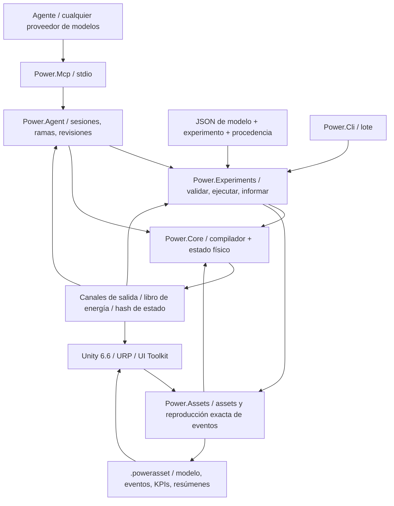

# Arquitectura C# / Unity / agente

[English](ARCHITECTURE.md) · [简体中文](ARCHITECTURE.zh-CN.md) · [Français](ARCHITECTURE.fr.md) · [Русский](ARCHITECTURE.ru.md) · [日本語](ARCHITECTURE.ja.md) · [한국어](ARCHITECTURE.ko.md) · [Deutsch](ARCHITECTURE.de.md) · **Español** · [Italiano](ARCHITECTURE.it.md) · [Português](ARCHITECTURE.pt-BR.md)

La aplicación activa sigue siendo C#/.NET con Unity. Los prototipos nativos archivados usan ahora **Zig 0.15.2**, con la procedencia C original conservada en Git y en un manifiesto de hashes de fuente. La [frontera nativa](NATIVE_ZIG.es.md) define una biblioteca compartida separada y el ABI binario versionado existente. No se introduce ninguna dependencia de runtime nativo en el núcleo gestionado ni en los ensamblados de Unity.


La decisión de arquitectura está fechada el 2026-09-07. La línea activa pasó de los prototipos C antiguos a C# gestionado. Unity aporta el estudio 3D. Los modelos físicos y la automatización de agentes funcionan por su cuenta.



## Dependencias y fronteras

`Power.Core` no tiene dependencia de Unity, de red, de JSON, de MCP, de un proveedor de modelos ni de un paquete de terceros. La misma fuente se compila a `net10.0` y a `netstandard2.1`. Los records, los patrones y el resto de C# 14 se rebajan a IL gestionado en el momento de la build. Unity solo carga los ensamblados. La definición de compatibilidad `IsExternalInit` es solo para el destino de biblioteca estándar. Las escenas de Unity no serializan tipos record directamente.

`Power.Experiments` convierte el JSON del modelo en una descripción de modelo explícita, acota el tiempo y el tamaño del experimento, ejecuta dos repeticiones con tamaños de lote distintos, comprueba los KPI y escribe la evidencia. `Power.Agent` es un espacio de trabajo independiente del transporte. `Power.Mcp` lo expone como herramientas a través del SDK oficial. Cambiar el proveedor de modelos solo cambia el cliente del agente.

`Power.Assets` también tiene como destino `net10.0` y `netstandard2.1`, y solo depende del núcleo. Almacena la descripción inmutable del modelo, un resumen de procedencia, eventos y KPIs, y ofrece una codificación binaria de tamaño limitado y un reproductor. La CLI y MCP exportan JSON validado como `.powerasset`. Tras la importación, Unity recompila el modelo y comprueba la huella, en lugar de serializar los internos del solver. El formato está en [assets de modelo](ASSET_FORMAT.es.md).

Unity referencia directamente los ensamblados de biblioteca estándar de Core y de Assets. El código de escena construye vistas y controles a partir de nodos y canales, y puede mostrar cualquier topología que admita el núcleo actual. Ya no construye una muestra fija a mano. La edición y el guardado generales de grafos no están implementados. La importación real y la aceptación en Play siguen necesitando el Unity Editor.

## Compilación del modelo

`ModelDefinition` es una descripción de topología componible. Un nodo declara su dominio físico, su almacenamiento y su estado inicial. Un componente declara extremos, parámetros, canales de entrada y adónde van las pérdidas. Cada parámetro dimensional lleva una unidad y se normaliza al SI en tiempo de compilación, incluidos rpm a rad/s y grado a radián.

El compilador copia las definiciones, ordena los IDs estables y comprueba unidades, finitud, conexiones, propiedad de las entradas y capacidad. Los modelos se limitan a 32 nodos, 64 componentes y 128 entradas de estado informadas. Las definiciones no admitidas o no resolubles devuelven diagnósticos de objeto y de campo.

`CompiledModel` almacena la topología inmutable, la tabla de canales, la huella del modelo y la factorización LU. Varias instancias de `Simulation` comparten un modelo y cada una posee un estado completo y un espacio de trabajo. Cambiar los arrays de descripción originales después de la compilación no cambia el modelo compilado.

## Frontera de referencia de la transmisión ideal

`IdealGearPair` y `SimplePlanetaryGear` son primitivos de referencia inmutables de carga constante,
con propiedades SI explícitas y registros de resultado puros. Aportan evidencia independiente
para las restricciones de engranaje acopladas y separadas, y conservan un estado de referencia local puro. El planetario usa una matriz de masa
de energía cinética reducida y se comprueba frente a una solución separada de restricción de aceleración. Consulta
[el contrato de referencia](IDEAL_GEARS.es.md).

## Restricciones permanentes de engranaje

El [solver de engranajes acoplados](GEAR_NETWORK.es.md) proyecta el punto medio electromecánico y
todas las respuestas de fuerza de cilindro, convertidor y embrague sobre restricciones permanentes de engranaje ideal y planetario.
Las filas normalizadas y los factores de tick completo son datos compilados inmutables; los factores de intervalo
variable y los búferes de multiplicadores pertenecen a cada simulación. Las velocidades iniciales deben ser
compatibles, se conserva la fase relativa inicial y se rechazan las restricciones dependientes.
Las reacciones medias por puerto se acumulan a lo largo de los intervalos internos aceptados y se copian,
se incluyen en el hash y se revierten con el estado completo. El asset v8 introdujo registros de topología acotados, mientras
las huellas anteriores sin engranajes y los hashes de repetición no cambian.

## Resolución conjunta de convertidor y cilindro

La [ley del convertidor](CONVERTER_NETWORK.es.md) posee cuatro mapas con signo inmutables y rechaza
la interpolación que crea energía. Un sistema no lineal conjunto resuelve los incrementos del cigüeñal del cilindro
y las velocidades de puerto del convertidor en el punto medio a través de la misma respuesta electromecánica proyectada.
Las iteraciones de embrague y los intervalos de eventos internos reutilizan ese sistema, incluidas las respuestas
de paso variable. Los modelos sin convertidor conservan su camino de solver anterior y sus huellas.

Los pares medios de bomba y turbina, la potencia térmica media y el calor de fluido acumulado compensado pertenecen
al estado de simulación transaccional. La reacción del estator es la suma de pares opuesta, en
masa estacionaria. El encaminamiento térmico usa el trabajo mecánico realmente extraído. Las definiciones de mapa
atraviesan JSON y los registros acotados del asset v9; la repetición reconstruye los factores y los historiales de runtime.
El bloqueo es un embrague paralelo separado. El componente cuasiestacionario no añade al núcleo ninguna
dependencia de transporte, de Unity, de JSON ni de terceros.

## Red hidráulica y actuación por presión

La [red hidráulica](HYDRAULIC_NETWORK.es.md) avanza la presión manométrica a través de una flexibilidad
constante y de restricciones lineales y turbulentas regularizadas explícitas. El volumen de referencia
conservado, la energía elástica cuadrática, el trabajo de depósito y el calor de pérdida de presión usan las mismas
transferencias aceptadas. El espacio de trabajo de Newton por simulación está acotado y no asigna memoria.

Los embragues accionados por presión derivan la capacidad del punto medio del intervalo hidráulico, del área
del pistón, de la precarga, de la fricción y del radio efectivo. Cada ensayo especulativo de evento de embrague posee
una copia completa del estado hidráulico; la reversión incluye la presión, los caudales medios, la pérdida acumulada y
los libros de frontera. Las salidas medias se normalizan sobre el tick completo. El asset v10 conserva
las fronteras de presión explícitas y los puertos de actuador; los caminos sin hidráulica conservan sus
huellas anteriores. Las bombas y los pistones móviles exigen más componentes conservativos.

## Núcleo electromecánico

El [solver de embrague acoplado](CLUTCH_NETWORK.es.md) añade reacciones estáticas acotadas y fricción
cinética al sistema de punto medio electromecánico y de cilindro. Los eventos internos de deslizamiento nulo
se delimitan frente a copias especulativas completas del estado; los factores de intervalo pertenecen a
cada simulación. El calor de fricción entra en nodos térmicos o en el libro externo. La fase,
el par y la potencia medios, y el calor acumulado compensado participan en los hashes, las bifurcaciones y
la reversión del lote entero. La [ley independiente y el par exacto](CLUTCH_PHYSICS.es.md) siguen siendo
referencias independientes de carga constante. El tiempo externo permanece en ticks enteros acotados.

Los modelos que contienen cilindros cerrados añaden una resolución no lineal acotada de gradiente discreto en torno al sistema de punto medio electromecánico existente. El trabajo de presión del gas se acopla al movimiento del cigüeñal y entra en el libro de energía. El camino lineal original conserva la versión 2 del solver y sus huellas de modelo; los modelos de cilindro usan la versión 3 del solver. Consulta [las ecuaciones, los límites y la evidencia](SEALED_CYLINDER.es.md). Este primer componente de cilindro deriva el estado de gas de masa constante a partir del ángulo del cigüeñal. Unos nodos de gas de volumen fijo separados llevan ahora masa y energía interna independientes a través del [solver de red de gas del núcleo](GAS_NETWORK.es.md); el [acoplamiento del cilindro móvil](MOVING_CYLINDER.es.md) conecta ahora esos estados con el trabajo de presión del cigüeñal. La [temporización opcional por ángulo de cigüeñal](VALVE_TIMING.es.md) controla ahora las restricciones a partir de la posición real del cigüeñal; la [combustión premmezclada](PREMIXED_COMBUSTION.es.md) añade ahora la contabilidad de constituyentes y de energía química. La química detallada y el comportamiento completo del motor siguen pendientes.

La mecánica y el motor comparten un sistema lineal acoplado, así que la fuerza contraelectromotriz, el par de eje y la velocidad no se tratan como señales unidireccionales sin relación:

```text
x_mid = (I - h A / 2)^-1 (x_n + h b / 2)
x_next = 2 x_mid - x_n

L di/dt = V - R i - k ω
J dω/dt = k i + τ_external + τ_shaft

twist = θ_a - r θ_b - θ_rest
slip  = ω_a - r ω_b
τ_a   = -K twist - D slip
τ_b   = -r τ_a
```

La constante de par del motor y la constante de fuerza contraelectromotriz usan el mismo coeficiente de acoplamiento del SI. Las relaciones positivas y negativas se ensamblan de modo que la dirección de la potencia se mantenga coherente. Las pérdidas por resistencia y amortiguación se evalúan en el punto medio y se envían a un nodo térmico nombrado o al exterior.

La red térmica usa Euler hacia atrás: `(C + h G) T_next = C T_n + Q_loss + h G_ambient T_ambient`. Los flujos de calor internos se ensamblan por pares. El calor que sale al exterior entra en el libro. La dinámica lineal mecánica y del motor tiene una comprobación de convergencia de segundo orden. La dinámica térmica es de primer orden. Un paso grande que se mantiene estable no es un paso grande que se mantiene preciso.

El residuo global de energía es `source_work - heat_rejected - stored_energy_change`. El trabajo de fuente puede ser negativo, así que el frenado regenerativo reduce el trabajo de fuente acumulado. El trabajo de fuente acumulado y el calor usan suma compensada. El libro comprueba también que las salidas y la energía almacenada se mantengan finitas.

## Tiempo, transacciones y reproducibilidad

El tiempo del núcleo es un `ulong` en nanosegundos. El paso compilado es fijo entre 1 ns y 1 s. Cada llamada debe cubrir ticks completos y puede avanzar como máximo un millón de ticks.

`SubmitInputs` comprueba el marco de entrada entero y después lo confirma una sola vez. `Step` avanza cada tick en un estado candidato preasignado. Un desbordamiento, una salida no finita, una temperatura ilegal o la cancelación descartan el lote entero. El indicador de cancelación se comprueba como máximo una vez cada 256 ticks. El camino de éxito de las entradas, del avance y de la instantánea del búfer del llamador no asigna memoria gestionada.

`Step(delta, scheduledInputs)` acepta eventos de entrada en tiempos absolutos de nanosegundos. Los tiempos deben estar ordenados, alineados al tick y dentro del intervalo de esta llamada. El mismo canal no puede fijarse dos veces en el mismo instante. Un evento al inicio se envía antes del primer tick. Un evento al final se envía antes de la instantánea. Si el lote falla, las entradas se revierten con él. `AssetPlayback` mueve el cursor de eventos solo después del éxito, de modo que un lote de presentación distinto no cambia el experimento. Un cambio interactivo puede bifurcar desde el estado de reproducción hacia una simulación independiente.

`Fork` copia el estado completo actual y los términos de compensación, de modo que se pueden comparar entradas distintas a partir del mismo historial físico. Las ramas solo comparten el modelo compilado. No comparten estado mutable. El acceso concurrente a una instancia del núcleo devuelve `Busy`. La instantánea y la bifurcación lanzan una excepción de ocupado distinta porque sus firmas difieren. Instancias distintas pueden ejecutarse en paralelo.

La huella cubre la semántica del modelo, los parámetros normalizados, el paso y la versión del solver. El hash de estado cubre también el tiempo, el estado, las entradas y los términos de compensación del libro. Es una comprobación de repetición, no un hash de seguridad. Se exige acuerdo bit a bit para el mismo binario, runtime y arquitectura. CPU, JIT, Mono o IL2CPP distintos se comparan con una tolerancia física y no se promete que coincidan bit a bit.

## Contrato del núcleo para agentes

- Las capacidades y los límites son descubribles. Los valores de retorno indican la fidelidad del modelo y el estado de calibración.
- Los errores de entrada se localizan con `TryCompile` o una excepción estructurada. Quienes llaman no analizan prosa de consola.
- Los canales usan IDs estables, una dirección, una unidad y un nombre físico. Los adaptadores serializan IDs de 64 bits, el tiempo y la revisión como cadenas decimales.
- Las escrituras de sesión llevan `expected_revision`. La comprobación y el cambio de estado comparten un mismo bloqueo. Una llamada obsoleta no avanza la simulación una segunda vez.
- Las instantáneas pueden seleccionar campos. Un experimento devuelve por defecto los valores finales y la evidencia de validación, de modo que el contexto del modelo se mantiene pequeño.
- Una rama de parámetros copia primero el estado y después envía las entradas por separado. El fallo y la cancelación dejan intacta la línea base de la rama.
- Un informe mantiene separados «la ejecución terminó», «los KPI pasaron» y «los parámetros están calibrados». Ningún modelo actual está calibrado a un vehículo.

Las sesiones MCP viven en el proceso local del servidor. El límite es 16. Se liberan cuando el servidor termina. Un documento JSON solo contiene datos. No ejecuta código ni instrucciones dentro del documento. El modelado del núcleo no necesita una clave de API. Un tick físico no espera una petición de red.

## Lo que sigue pendiente

El intercambio de gas compresible, la combustión premmezclada prescrita, los embragues, los engranajes, un convertidor mapeado y la actuación hidráulica existen ahora como componentes con puertos, estado y comprobaciones de conservación. No completan el grupo motopropulsor. Siguen pendientes: la bomba y el repostaje del raíl, el control de encendido, la admisión y el escape detallados, las pérdidas mecánicas, una termoquímica más rica, la flexibilidad de engrane, el control completo de presión y cambio de la AT, el comportamiento coordinado de ECU/TCU y la calibración medida. Una ecuación nueva sigue necesitando una versión de modelo explícita, dimensiones y evidencia numérica. La semántica de los componentes existentes no se amplía cambiándola en silencio.

Un agente puede generar una topología y un estado inicial, proponer hipótesis de parámetros, escribir candidatos de componente, construir experimentos y leer la evidencia de vuelta. El núcleo de ejecución sigue siendo dueño de las restricciones y comprobaciones numéricas. El juicio de un modelo de lenguaje no es un hecho físico. La edición de grafos en Unity, un hilo de trabajo de simulación y un backend de solver de alto rendimiento sustituible esperan a que la frontera sea estable. Nada de esto afirma un solver no lineal general, Burst ni un solver en GPU.

## Integración de gas del 2026-09-22

`ModelDocument` y `power.model.v1` trasladan ahora la composición finita del gas y los parámetros
de restricción a las definiciones existentes del núcleo. `CompiledModel.ValidateInput` expone
la validación estática de canal, finitud y rango, usada por las comprobaciones de calendario del experimento y del asset;
las comprobaciones observables dependientes del estado siguen en `Simulation`. Las ecuaciones del solver y
la construcción de la huella no cambian.

El formato de asset v3 amplía las tablas binarias acotadas con registros de composición de nodo de gas y de orificio.
Conserva los lectores v1/v2 y comprueba la cobertura, el tipo, la unicidad y la
longitud de las extensiones antes de compilar y comparar huellas. La conductancia de pared del gas y la temperatura del depósito
usan los campos de componente base existentes. Esto mantiene el núcleo y Assets libres de
dependencias de JSON, de transporte y de Unity.

La CLI y MCP comparten la semántica de documento de gas, de asset y de experimento. Studio lee el
mismo asset y añade recipientes y caminos esquemáticos; sus pruebas nuevas de Editor/Play siguen exigiendo una
ejecución real del Editor. Consulta el [estado de desarrollo](DEVELOPMENT_STATUS.es.md) para el trabajo restante.

## Acoplamiento del cilindro móvil

Un `gas_cylinder` posee el volumen de un nodo de gas y referencia un cigüeñal rotacional.
El nodo de gas omite el almacenamiento independiente, así que la compilación deriva el volumen inicial de la
geometría en el ángulo inicial del cigüeñal. La presión, la temperatura, la masa y la energía permanecen en
el nodo de gas; el componente de geometría expone el volumen, el desplazamiento y el par del cigüeñal.

Los modelos con cámaras móviles añaden la etiqueta de huella 5 y usan una integración simétrica de medio flujo, cigüeñal completo y
medio flujo. El cambio de energía de la cámara adiabática y el par del cigüeñal usan el mismo
gradiente discreto, incluido el trabajo de contrapresión externa. El acoplamiento de pared sigue siendo de primer
orden. El camino de solver anterior, solo de volumen fijo, y las huellas previas permanecen intactos.
Todo el estado candidato de gas, de cigüeñal y de libro sigue perteneciendo a la transacción de la llamada entera.

El asset v4 añade registros indexados de geometría móvil y conserva los lectores anteriores. El
ejemplo de JSON/MCP y la vista de pistón móvil de Unity usan las mismas definiciones; la verificación real del Editor
sigue pendiente. Consulta [MOVING_CYLINDER.es.md](MOVING_CYLINDER.es.md).

## Perfiles de restricción por ángulo de cigüeñal

Una `ValveTimingDefinition` inmutable y opcional en un orificio de gas referencia un nodo
rotacional y ángulos explícitos de ciclo, de apertura y de duración. `CrankValveProfile` normaliza
la fase y evalúa una envolvente continua de seno al cuadrado. La entrada del orificio pasa a ser la apertura
de pico; el solver de gas y el caudal másico observable comparten la misma fracción efectiva.
No hay un estado de leva mutable y separado. Los modelos temporizados añaden la etiqueta de huella 6 y usan la
división simétrica de gas y cigüeñal incluso cuando sus volúmenes de gas son fijos. Los modelos sin temporización
conservan su camino y sus huellas anteriores.

Las protecciones de ángulo y velocidad por lóbulo, y de precisión, rechazan los ticks poco resueltos dentro de la transacción
de estado candidato existente. JSON, el asset v10 y MCP exponen el mismo contrato, mientras
Studio lee el canal de apertura efectiva para su marcador esquemático. La ejecución real de Unity
sigue pendiente por separado. Consulta [VALVE_TIMING.es.md](VALVE_TIMING.es.md).

## Reacción premmezclada y transporte de constituyentes

`GasDefinition.Premixed` opcional aporta un poder calorífico explícito, una relación estequiométrica
y fracciones iniciales de combustible y de aire fresco. `GasNetwork` compila mezclas conectadas compatibles
y fracciones de depósito explícitas. El solver de gas transporta tres masas de constituyentes no negativas
con el flujo aguas arriba, reconstruye la masa total y contabiliza la entalpía química
en la frontera del modelo. El transporte premmezclado incluye una cota de flujo saliente además
de las cotas existentes de masa y energía netas.

`PremixedCombustion` referencia el nodo de gas y su cigüeñal. `CombustionSolver` anticipa
el calor a partir de la exposición de Wiebe hacia adelante y de los reactivos limitantes durante la iteración del cigüeñal.
El par de presión usa la mitad del calor anticipado antes del trabajo adiabático; la otra
mitad sigue al paso de trabajo. El consumo aceptado de combustible y aire, la formación de productos, los
libros químicos y la frontera angular irreversible viven en `MixtureState` dentro de la transacción
candidata normal. Se copia en las bifurcaciones y entra en los hashes; las anticipaciones del espacio de trabajo
nunca sobreviven a una llamada fallida como estado confirmado.

Los modelos premmezclados añaden la etiqueta de huella 7. El asset v10 conserva las extensiones de mezcla, de depósito y de quemado;
la semántica anterior sin reacción no cambia. JSON, la CLI y MCP exponen evidencia
de combustible y de calor, mientras Studio usa el mismo canal de liberación de calor para su marcador
esquemático. La ejecución real del Editor sigue pendiente. El alcance numérico y físico completo
está documentado en [PREMIXED_COMBUSTION.es.md](PREMIXED_COMBUSTION.es.md).

## Acoplamiento hidráulico accionado por eje

Los modelos con bombas amplían el sistema no lineal conjunto con las velocidades de eje de la bomba y todas
las presiones hidráulicas del punto medio. La reacción de presión entra en las mismas respuestas de fuerza proyectadas
sobre engranajes que el par del cilindro y del convertidor. El caudal de la bomba entra en balances emparejados de nodos
de flexibilidad; las capacidades del embrague dependientes de la presión se actualizan dentro de la iteración de restricciones.
Las transferencias aceptadas confirman el volumen, el trabajo de frontera, el trabajo de eje a fluido y el calor de alivio.
Todo el espacio de trabajo pertenece a la simulación y el avance no asigna memoria gestionada.

Los modelos sin bomba conservan el camino de solver hidráulico precedente y los hashes de repetición. Los
límites de cilindrada ideal y de alivio de conductancia finita, los puertos tipados, los observables y la
evidencia independiente se especifican en [HYDRAULIC_PUMP.es.md](HYDRAULIC_PUMP.es.md). El núcleo y
Assets siguen siendo ensamblados de doble destino y sin dependencias; la evidencia real de Unity es aparte.

## Control muestreado en la transacción del modelo

`PressureControllerDefinition` declara el sensor hidráulico, el canal de voltaje del motor CC
que posee, ganancias y cotas explícitas, la integral inicial y un periodo de muestreo entero
alineado al tick. La compilación vincula un propietario controlador por entrada de motor y retira esa entrada
de la tabla de escritura externa. La consigna de presión de un controlador sigue siendo descubrible
con unidades e IDs estables. Los modelos sin controladores conservan sus huellas anteriores.

Al inicio de cada tick completo, después de las entradas programadas en ese instante, el estado
candidato muestrea los controladores debidos a partir de la presión hidráulica actual. Actualiza la integral,
la presión y el error muestreados y el voltaje retenido, y después realiza la resolución física. Los intervalos
internos de ensayo del embrague copian este estado y no lo vuelven a muestrear. El motor físico sigue
contabilizando todo el trabajo eléctrico y el calor. El controlador no tiene un almacén de energía inventado.

Las bifurcaciones copian la memoria del controlador y las entradas de motor que posee, entran en el hash y se confirman
solo con el lote entero. La cancelación o un fallo numérico posterior revierten el historial de control
junto al estado físico y las entradas. El muestreo no asigna memoria gestionada.
JSON, el asset v12, la CLI y MCP comparten esta semántica de modelo, y la ejecución real del Editor
sigue pendiente por separado. Consulta [el contrato completo](HYDRAULIC_PUMP.es.md#sampled-pressure-regulation).

## Alimentación eléctrica acoplada

Los nodos de batería añaden el SOC y el voltaje de polarización al mismo vector de estado dinámico que
las coordenadas rotacionales y las corrientes del motor RL. La energía química es la integral de la
curva de OCV afín explícita sobre la carga; la rama RC almacena energía cuadrática. Ningún
proveedor de modelos, transporte, Unity ni dependencia de terceros entra en estas ecuaciones.

El ciclo de trabajo retenido y las aperturas de carga resistiva cambian la matriz eléctrica y el término afín.
`ElectricalDynamics` posee sus tasas, sus factores LU y su caché de entrada por simulación. Las respuestas de engranaje,
cilindro, convertidor y embrague usan los factores preparados, incluidos los ensayos internos
de captura de duración variable. Una preparación fallida invalida las cachés; el estado candidato
físico y de control solo se confirma con el lote entero. Las cachés son espacio de trabajo,
no estado de modelo compartido ni historial persistente de simulación.

El trabajo del motor de batería se transfiere de forma interna. Los cambios de energía de batería, inductiva, mecánica e hidráulica
equilibran el calor explícito y el trabajo externo de fuente ideal y de carga. La carga y
la polarización viven en el vector de estado normal, así que las bifurcaciones, los hashes y la reversión las incluyen
de forma automática. El control de ciclo de trabajo usa salidas adimensionales y el mismo contrato de muestreo
y de anti-windup que el control de voltaje. El asset v14 y JSON/MCP conservan las definiciones completas de alimentación.
[El contrato de alimentación](HYDRAULIC_PUMP.es.md#finite-battery-supply-and-duty-regulation)
registra el alcance, los límites y la evidencia independiente.

## Actuación hidráulica de traslación

Los nodos `translational` añaden estados de desplazamiento y de velocidad con masa concentrada
positiva. Los pistones hidráulicos añaden incógnitas de coordenada al solver conjunto existente de mecánica
y presión. Los volúmenes barridos de las caras delantera y trasera se acoplan a la flexibilidad; el trabajo de presión del depósito
sigue siendo una frontera externa explícita. Los resortes lineales usan la misma matriz de punto medio
con unidades de traslación. Las fuerzas de pastilla y de tope de carrera usan gradientes de potencial discretos
y jacobianos analíticos, y conservan el trabajo de presión y de contacto a través de la activación
y la liberación de la bisagra.

Los embragues de contacto derivan las capacidades de la fuerza discreta de la pastilla durante la resolución,
y después exponen la fuerza y la capacidad instantáneas en las instantáneas. Cada simulación posee historiales
compactos y compensados de resorte y amortiguación, copiados e incluidos en el hash con cada estado candidato.
No hay asignaciones de espacio de trabajo durante un avance estacionario correcto ni durante lecturas de instantánea.
El asset v14 y JSON/MCP conservan la topología de movimiento y de contacto. Consulta
[HYDRAULIC_PISTON.es.md](HYDRAULIC_PISTON.es.md) para las ecuaciones, los límites y la evidencia.

## Caudal dosificado de forma mecánica

Los escalones de la válvula de corredera se vinculan a coordenadas de pistón existentes. El residuo hidráulico lee
su posición de punto medio e incluye derivadas analíticas del caudal respecto de la
presión y de la carrera del pistón. La realimentación de presión, el movimiento y la dosificación comparten por tanto
la matriz de Newton y los intervalos especulativos del embrague. El calor pasivo de puerto y el volumen
barrido se confirman a través de los historiales hidráulicos existentes. Las pendientes de posición usan búferes
acotados y propiedad de la simulación; un avance correcto no añade asignaciones gestionadas. El asset v15,
JSON y la repetición MCP real conservan la geometría. El escalón equilibrado en presión declarado
desprecia la fuerza axial de chorro; consulta [HYDRAULIC_SPOOL.es.md](HYDRAULIC_SPOOL.es.md).

## Acoplamiento lineal de energía de gas y fluido

Los pistones de gas añaden propietarios de geometría lineal a la red de gas finita. La masa y la energía
iniciales usan la geometría inicial real; el flujo y el calor de pared leen el volumen actual.
El solver mecánico conjunto reúne coordenadas de traslación únicas, de modo que cámaras de gas
opuestas y un separador hidráulico comparten una masa. La fuerza del gas usa trabajo de presión adiabático
discreto, una derivada analítica y una serie estable de recorrido pequeño.
El trabajo de presión de referencia absoluta es externo; la energía interna del gas sigue siendo un estado
transaccional normal. Ninguna curva de presión ajustada sustituye ese estado.

Las cámaras cerradas y no mezcladas, sin transporte ni calor, omiten la integración de tasa nula después de
validar el estado. La repetición medida de antes y después conserva cada valor y cada hash. Las cotas,
la reversión, las bifurcaciones y el avance sin asignaciones se aplican a los historiales combinados de gas y fluido.
El asset v16 y JSON/MCP conservan la geometría y la orientación. Consulta
[GAS_PISTON.es.md](GAS_PISTON.es.md) para la termodinámica, el alcance y la evidencia.

## Dosificación de combustible por ciclo

Los raíles y receptores de gas finitos y rastreados usan las transferencias de orificio conservativas
existentes. Un controlador por ciclo enclava la masa de combustible solicitada en una ventana de cigüeñal
hacia adelante. Un techo de caudal de combustible escala el mismo flujo de masa, de constituyentes y de entalpía;
las transferencias de Heun aceptadas actualizan el historial completo de cuota y de entrega. La energía química
se mueve de forma interna y sigue separada del calor de reacción y de las fronteras externas.
La inversión no reinicia una cuota observada. Los historiales pertenecen a cada simulación,
incluidos los intervalos especulativos del embrague, la cancelación y las bifurcaciones. El recorrido de temporización y
los recuentos de estado siguen acotados; el avance en caliente no asigna memoria gestionada. El asset v17
y JSON/MCP conservan la tobera, la temporización y la dosis. Consulta [FUEL_METERING.es.md](FUEL_METERING.es.md).

## Fase líquida finita y disponibilidad de vapor

Las películas añaden masa líquida explícita e inventario térmico y químico junto a receptores de gas
rastreados. La ley analítica de baño finito resuelve el calentamiento, la saturación prescrita
y el secado, usando un desplazamiento de fase de energía interna ajustado a la capacidad calorífica del vapor
del receptor. El vapor entra en los estados normales de gas y de combustible; el líquido permanece fuera
del inventario de reacción. La pared finita paga cada transferencia de fase.

Los medios pasos película/gas/mecánica/gas/película invierten el orden de las películas en el segundo barrido, de modo que
las transferencias de película de una pared compartida tienen una división simétrica. Las demás fuentes de calor de pared conservan
la temperatura de pared explícita del intervalo exterior y su límite de precisión de primer orden.
Comprobaciones independientes de refinamiento ODE simultáneo distinguen estos casos. Los inventarios
de fase, los historiales compensados de calor y de entrega, y los caudales medios se copian, entran en el hash y se revierten
con el estado completo de simulación, incluidos los intervalos especulativos del embrague. El asset v18
y JSON/MCP conservan todas las cantidades de fase. Consulta [FUEL_FILM.es.md](FUEL_FILM.es.md).

## Entrega de combustible líquido flexible y finita

Los inyectores líquidos poseen un inventario de fuente finito y energía de presión del raíl. La presión
se deriva del volumen descargado compensado a través de la flexibilidad suministrada; la
tobera unidireccional integra de forma analítica el decaimiento de la altura de presión del receptor fijo. Las cuotas compartidas
del ciclo hacia adelante acotan la entrega y conservan la semántica de inversión y de comando.
La energía calórica y química del líquido pasa a la película sin saltarse la evaporación.
El trabajo de presión del raíl se separa en calor de tobera de la pared finita y en una frontera explícita de trabajo
de desplazamiento del receptor exportado, bajo la reducción de volumen líquido despreciable.
Solo ese trabajo exportado entra en el trabajo externo global; la energía de raíl almacenada no se
cuenta dos veces.

La inyección envuelve la división existente película/gas/mecánica con el orden invertido de la segunda
mitad. Los inventarios de fuente y de película, y todos los historiales de cuota, de presión y calor, y compensados
sobreviven a los intervalos especulativos del embrague, a la reversión completa, a la cancelación
y a las bifurcaciones independientes. El refinamiento ODE simultáneo independiente y las comprobaciones activas
de asignación verifican el camino compartido. El asset v19, JSON y el MCP real conservan
las definiciones de fuente, tobera y temporización. Consulta [LIQUID_FUEL_INJECTION.es.md](LIQUID_FUEL_INJECTION.es.md).

## Solenoide recíproco y aguja física

El enlace de flujo y la inductancia lineal dependiente de la posición añaden energía magnética almacenada
y fuerza recíproca a la resolución mecánica conjunta. Una eliminación eléctrica analítica
y la derivada de posición conservan una identidad de energía discreta simétrica;
el movimiento aceptado confirma el flujo magnético, el calor del cobre y el trabajo eléctrico una sola vez.
Los topes elásticos de carrera reutilizan gradientes de bisagra conservativos sin recortar el estado.
Las coordenadas se fusionan con las coordenadas existentes de pistón hidráulico y de gas, según corresponda.

La elevación real de la aguja dosifica el caudal líquido con independencia del corte de dosis deseada o de ventana.
Un accionamiento muestreado posee el voltaje de bobina y usa el objetivo de ciclo enclavado y la entrega
medida, y conserva las colas de cierre y de rebote en el asiento. El estado completo incluye los historiales magnéticos,
del controlador muestreado y retenido, de fuente y fase, y todos los historiales compensados, a través de bifurcaciones,
cancelación, captura especulativa del embrague y fallo tardío. El asset v20 y JSON/MCP
conservan las definiciones. El alcance, la reciprocidad y la evidencia están en
[NEEDLE_ACTUATION.es.md](NEEDLE_ACTUATION.es.md).

## Repetición de cierre acotada y corte programado

Los accionamientos con predicción habilitada copian el estado completo en un estado de repetición
preasignado, retienen los demás comandos de actuador y repiten un futuro de la planta a voltaje cero o con corte
retardado. Las ecuaciones físicas normales y los intervalos híbridos aceptados determinan
la entrega adicional. Los pronósticos nunca confirman estado ni ejecutan controladores muestreados de forma recursiva;
los intervalos reales preparan su espacio de trabajo del solver después de cada predicción.

Una búsqueda acotada de candidatos enteros planifica el corte dentro del siguiente periodo de muestra.
El enclavamiento por ciclo y la cuenta atrás en ticks físicos evitan reaperturas repetidas por
diferencias mínimas del pronóstico. La masa y el recuento de la predicción, el enclavamiento y el ciclo, y la cuenta atrás se unen
a la copia, el hash y la reversión del estado completo. Se comprueban la alineación del horizonte, el rango del reloj, el presupuesto finito de ticks
y la monotonía de los candidatos. El asset v21 conserva el horizonte opcional;
las predicciones desactivadas conservan las huellas de modelo y los hashes de estado anteriores. Consulta
[CLOSURE_PREDICTION.es.md](CLOSURE_PREDICTION.es.md).

## Composición del grafo de doble embrague

El ensamblado DCT inmutable reduce siete caminos adelante y de marcha atrás a registros existentes
de rotor, engranaje y embrague, con IDs estables propiedad del llamador. Los cubos libres, dos ejes de entrada,
el piñón loco de marcha atrás y tres ramas de salida y finales conservan inercia explícita.
Los selectores transfieren impulso y calor de sincronización, y los embragues de tracción transfieren potencia
real; un número de marcha no sustituye la topología permanente.

El grafo lineal grande expuso una proyección lenta de bloqueos correlacionados en una entrega
seis/siete. Se conserva la proyección acotada primaria; cuando agota las iteraciones,
los bloqueos lineales independientes usan una factorización de Schur normalizada y preasignada, con
los mismos límites estáticos y las mismas comprobaciones de liberación de modo, de residuo y de calor pasivo. Los casos
singulares o no lineales conservan su comportamiento existente. Los caminos ordinarios de JSON, asset y MCP,
y las huellas originales, no cambian. Las referencias y el alcance están en
[DUAL_CLUTCH_TRANSMISSION.es.md](DUAL_CLUTCH_TRANSMISSION.es.md).

## Estado DCT muestreado y cinemática controlada

El controlador posee los diez comandos de tracción y de selector, y valida su topología real
impar, par, de piñón loco y final. Las solicitudes enteras se muestrean en relojes acotados;
el deslizamiento y el bloqueo físicos condicionan la preselección y la entrega exclusiva escalonada. El punto muerto,
el bloqueo de dirección, el tiempo de espera, la pérdida persistente de bloqueo y la recuperación por solicitud nueva conservan
salidas de estado y de fallo separadas. Los comandos retenidos, las selecciones, la fase y los relojes de vigilancia
se copian, entran en el hash y se revierten con los historiales físicos completos.

Los modelos controlados acumulan coordenadas a partir de la velocidad del punto medio, con redondeo
compensado. Las cotas estrictas de fase de engranaje no cambian; la compensación es transaccional
y entra en el hash. Los modelos anteriores conservan su integración y su repetición previas. La cota de estado
informado se amplía a 128, mientras los límites de nodos y componentes siguen en 32/64, con pruebas de frontera
exacta y de desbordamiento. Esto admite la composición completa de investigación de encendido, DCT y control,
en lugar de descartar estado del motor para caber en el límite anterior.
El asset v22 y JSON/MCP conservan todas las definiciones de ruta, temporización y tolerancia. Consulta
[DCT_CONTROL.es.md](DCT_CONTROL.es.md).

## Ensamblado de investigación planetario compuesto

El [ensamblado Ravigneaux](RAVIGNEAUX_TRANSMISSION.es.md) combina una restricción de sol grande
de piñón simple y de sol pequeño de piñón doble que comparten corona y portasatélites. Las filas
normalizadas conservan la potencia de reacción sumada; las respuestas proyectadas entran en la resolución
ordinaria de mecánica, convertidor y embrague. Los grafos compuestos acumulan coordenadas con
corrección compensada transaccional para conservar la fase de larga duración bajo carga;
los modelos que solo son grafo conservan su camino anterior de integración y de hash. Las cuatro inercias de miembro son valores de investigación
explícitos; el giro interno de los satélites sigue sin resolver. Cinco conexiones de fricción seleccionan
cuatro rangos adelante o marcha atrás sin añadir una fuente de velocidad prescrita.

El ensamblado devuelve definiciones ordinarias inmutables con IDs estables de puerto y de comando.
La captura del portasatélites genera calor de fricción real. Cada historial de reacción y de calor
participa en el contrato existente de copia, hash y reversión del estado. JSON y
el asset v23 conservan la topología de piñón doble; las huellas anteriores sin el componente y
la repetición auténtica de v22 no cambian. Esto no establece un control AT completo
ni el comportamiento medido del grupo motopropulsor objetivo.

## Movimiento interno de satélites resuelto

El [grafo Ravigneaux resuelto](RESOLVED_PLANETS.es.md) usa cuatro filas de engrane relativas
al portasatélites entre seis rotores internos. El giro absoluto del satélite conserva el almacenamiento
cinético diagonal del rotor; las masas declaradas por satélite añaden inercia orbital exacta al
portasatélites. Matrices de masa reducida independientes, el momento angular, el calor de captura
y cada límite de repetición comprueban el grafo acoplado ordinario. No añade una
señal de velocidad prescrita ni un almacén de energía aparte y no rastreado.

Los engranes del portasatélites admiten relaciones relativas con signo, finitas y distintas de cero, y reacciones
explícitas del portasatélites móvil. Su proyección de Schur normalizada realiza como máximo tres
refinamientos del residuo relativo, incluidas respuestas pequeñas de fuerza de embrague, cilindro y convertidor.
Los objetivos libres del punto medio imponen un residuo nulo de velocidad en el extremo siguiente,
y evitan reflejar de nuevo el redondeo precedente a través de la misma respuesta de fuerza. Los multiplicadores de corrección se acumulan en las reacciones reales. Los factores
compilados siguen siendo inmutables; el espacio de trabajo propiedad de la simulación y los búferes locales del constructor
mantienen independientes las ramas. Los grafos existentes conservan el camino de proyección anterior.
El primitivo nuevo añade la etiqueta de huella 28 y el soporte de topología del asset v24.

## Ensamblado compartido de actuación hidráulica

El [ensamblado de actuación AT](AT_HYDRAULIC_ACTUATION.es.md) reduce los objetivos de embrague declarados 1..6
a embragues reales de pistón y de contacto, restricciones de llenado y drenaje, y resortes
de retorno alimentados por una bomba reversible compartida, fugas, arrastre y alivio. Las áreas
explícitas de las caras delantera y trasera conservan el inventario barrido y el trabajo de presión de referencia. Las definiciones
ordinarias inmutables conservan la resolución conjunta existente de presión, movimiento y fricción,
la semántica portátil de v24 y el estado atómico completo. Los calendarios de válvula prescritos
siguen separados de la realimentación y el control de la AT, y de la aceptación medida del cuerpo de válvulas.

## Realimentación de AT hidráulica

`at_controller` acepta una marcha solicitada entera en [-1,4]; cero es punto muerto. Controla cinco pares de válvulas de llenado/vaciado y el bloqueo opcional del convertidor. El orden es entrada del portasatélites, solar pequeño, solar grande, freno del portasatélites, freno del solar grande y bloqueo.

`controlled-hydraulic-ravigneaux` y `controlled-fired-hydraulic-ravigneaux` usan canal 900 e ID 1400. Conservan 99 y 122 estados declarados dentro del límite sin cambios de 128. v28 conserva rutas, ganancias y relojes y lee v1-v27.

Son controles de investigación y los parámetros siguen `unverified`. Coordinación de par ECU, sensores/válvulas detallados, fallos completos del vehículo y calibración OEM siguen pendientes. Las pruebas managed y Standard no acreditan Unity Editor/Play/Player/IL2CPP real.

[AT_CONTROL.es.md](AT_CONTROL.es.md)

## Raíl de combustible líquido alimentado por bomba

`liquid_rail_feed` asocia un inyector líquido con una bomba de desplazamiento existente y una frontera explícita de materia/calor. El nodo de salida hidráulica debe coincidir con la compliancia y presión absoluta inicial del raíl. Bomba e inyector poseen ese nodo; otras rutas fluidas no contabilizadas se rechazan.

v28 conserva enlaces y temperatura de fuente y lee v1-v27. Intercambio analítico eje/presión, refinamiento ODE simultáneo independiente, mezcla térmica, balances masa/combustible/energía/volumen, retorno y rollback completo tienen verificaciones separadas.

Capacidad geométrica, ventilación/espacio gaseoso/oleaje, cavitación, llenado/eficiencia/regulación medidos y spray resuelto siguen abiertos. Parámetros `unverified`; Unity Editor/Play/Player/IL2CPP real y calibración OEM siguen sin verificar.

[PUMP_FED_FUEL.es.md](PUMP_FED_FUEL.es.md)

## Tanque finito de combustible líquido

`liquid_fuel_tank` guarda masa líquida finita y energía térmica con densidad, referencia térmica de película y poder calorífico del inyector asociado. La alimentación lo elige con `tank_component` y omite `supply_temperature`. Cada tanque pertenece a una alimentación compatible.

Energías térmica y química del tanque forman el almacenamiento completo. La transferencia interna no agrega masa ni suministro químico externos. La presión de entrada prescrita mantiene su frontera de trabajo de presión. Admisión/escape gaseoso aún pueden llevar energía química.

Capacidad geométrica, ventilación/espacio gaseoso/oleaje, cavitación, llenado/eficiencia/regulación medidos y spray resuelto siguen abiertos. Parámetros `unverified`; Unity Editor/Play/Player/IL2CPP real y calibración OEM siguen sin verificar.

[LIQUID_FUEL_TANK.es.md](LIQUID_FUEL_TANK.es.md)

## Retorno de alivio de combustible trazado

`liquid_rail_return` une una alimentación con un `hydraulic_relief` unidireccional exclusivo. La válvula conecta el raíl a la misma presión de entrada prescrita de la bomba. Registrar toda ruta fluida; puertos incompatibles, propiedad duplicada y rutas no seguidas se rechazan.

`fluid_heat_fraction` elige explícitamente la fracción [0,1] de pérdida transportada por combustible retornado. El resto sigue la ruta térmica declarada. Mezcla simultánea raíl/tanque conserva masa, química, trabajo de presión y calor. El retorno a fuente externa saca masa/energía por la frontera.

[LIQUID_FUEL_RETURN.es.md](LIQUID_FUEL_RETURN.es.md)
