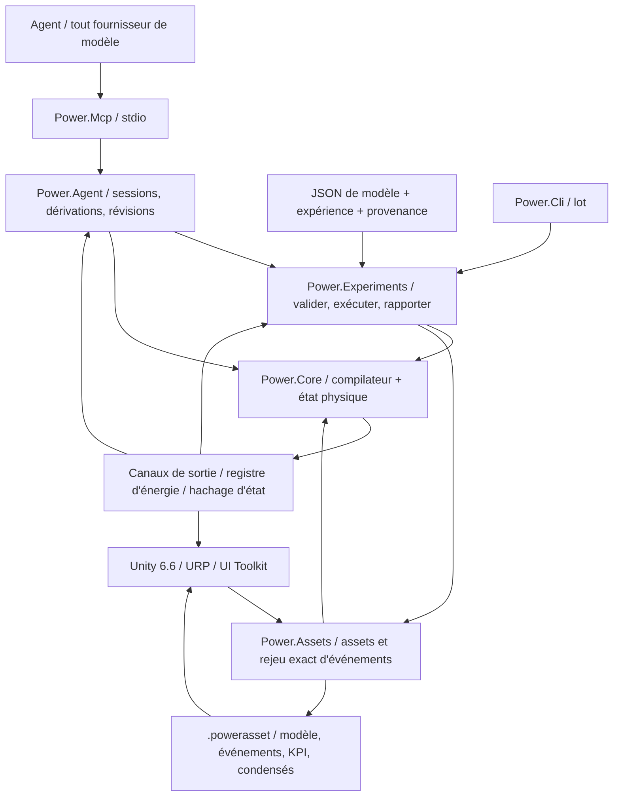

# Architecture C# / Unity / agent

[English](ARCHITECTURE.md) · [简体中文](ARCHITECTURE.zh-CN.md) · **Français** · [Русский](ARCHITECTURE.ru.md) · [日本語](ARCHITECTURE.ja.md) · [한국어](ARCHITECTURE.ko.md) · [Deutsch](ARCHITECTURE.de.md) · [Español](ARCHITECTURE.es.md) · [Italiano](ARCHITECTURE.it.md) · [Português](ARCHITECTURE.pt-BR.md)

L'application active reste C#/.NET avec Unity. Les prototypes natifs archivés utilisent maintenant **Zig 0.15.2**, avec la provenance C d'origine préservée dans Git et un manifeste de hachages source. La [frontière native](NATIVE_ZIG.fr.md) définit une bibliothèque partagée séparée et l'ABI binaire versionnée existante. Aucune dépendance de runtime natif n'est introduite dans le cœur managé ni dans les assemblys Unity.

La décision d'architecture est datée du 2026-09-07. La ligne active est passée des anciens prototypes C au C# managé. Unity fournit le studio 3D. Les modèles physiques et l'automatisation agent s'exécutent de leur côté.



## Dépendances et frontières

`Power.Core` n'a aucune dépendance Unity, réseau, JSON, MCP, fournisseur de modèle ou paquet tiers. La même source se compile vers `net10.0` et `netstandard2.1`. Les records C# 14, les motifs et le reste sont abaissés en IL managé au moment de la construction. Unity ne charge que les assemblys. La définition de compatibilité `IsExternalInit` ne sert qu'à la cible de bibliothèque standard. Les scènes Unity ne sérialisent pas directement les types record.

`Power.Experiments` transforme le JSON de modèle en une description de modèle explicite, borne le temps et la taille de l'expérience, exécute deux rejeus avec des tailles de lot différentes, vérifie les KPI et écrit les preuves. `Power.Agent` est un espace de travail indépendant du transport. `Power.Mcp` l'expose comme outils via le SDK officiel. Changer de fournisseur de modèle ne change que le client agent.

`Power.Assets` cible aussi `net10.0` et `netstandard2.1` et ne dépend que du cœur. Il stocke la description de modèle immuable, un résumé de provenance, les événements et les KPI, et fournit un encodage binaire à taille limitée et un lecteur. La CLI et le MCP exportent le JSON validé en `.powerasset`. Après l'import, Unity recompile le modèle et vérifie l'empreinte, au lieu de sérialiser les internes du solveur. Le format est dans [les assets de modèle](ASSET_FORMAT.fr.md).

Unity référence directement les assemblys Core et Assets de bibliothèque standard. Le code de scène construit des vues et des contrôles à partir des nœuds et des canaux, et peut montrer toute topologie que le cœur actuel prend en charge. Il ne construit plus un échantillon fixe à la main. L'édition et l'enregistrement généraux de graphe ne sont pas implémentés. L'import réel et l'acceptation Play ont encore besoin de l'éditeur Unity.

## Compilation du modèle

`ModelDefinition` est une description de topologie composable. Un nœud déclare son domaine physique, son stockage et son état initial. Un composant déclare les extrémités, les paramètres, les canaux d'entrée et la destination des pertes. Chaque paramètre dimensionnel porte une unité et est normalisé en SI à la compilation, y compris rpm vers rad/s et degré vers radian.

Le compilateur copie les définitions, trie les ID stables et vérifie les unités, la finitude, les connexions, la propriété des entrées et la capacité. Les modèles sont bornés à 32 nœuds, 64 composants et 128 entrées d'état rapportées. Les définitions non prises en charge ou non résolubles renvoient des diagnostics d'objet/champ.

`CompiledModel` stocke la topologie immuable, la table des canaux, l'empreinte du modèle et la factorisation LU. Plusieurs instances de `Simulation` partagent un modèle et chacune possède un état et un espace de travail complets. Modifier les tableaux de description d'origine après la compilation ne change pas le modèle compilé.

## Frontière de référence de transmission idéale

`IdealGearPair` et `SimplePlanetaryGear` sont des primitives de référence immuables à charge constante, avec des propriétés SI explicites et des enregistrements de résultat purs. Ils fournissent des preuves indépendantes pour les contraintes d'engrenage couplées séparées, tout en conservant un état de référence local pur. Le planétaire utilise une matrice de masse d'énergie cinétique réduite et est contrôlé contre une solution séparée de contrainte d'accélération. Voir [le contrat de référence](IDEAL_GEARS.fr.md).

## Contraintes d'engrenage permanentes

Le [solveur d'engrenages couplés](GEAR_NETWORK.fr.md) projette le point milieu électromécanique et toutes les réponses de force cylindre/convertisseur/embrayage sur des contraintes permanentes d'engrenage idéal et de planétaire. Les lignes normalisées et les facteurs de tick complet sont des données compilées immuables ; les facteurs d'intervalle variable et les tampons de multiplicateurs appartiennent à chaque simulation. Les vitesses initiales doivent être compatibles, la phase relative initiale est préservée, et les contraintes dépendantes sont rejetées. Les réactions moyennes par port sont accumulées sur les intervalles internes acceptés, puis copiées, hachées et ramenées en arrière avec l'état complet. L'asset v8 a introduit des enregistrements de topologie bornés, tandis que les empreintes et hachages de rejeu antérieurs sans engrenage restent inchangés.

## Résolution conjointe convertisseur et cylindre

La [loi de convertisseur](CONVERTER_NETWORK.fr.md) possède quatre cartes signées immuables et rejette une interpolation qui créerait de l'énergie. Un système non linéaire conjoint résout les incréments de vilebrequin du cylindre et les vitesses de port au point milieu du convertisseur à travers la même réponse électromécanique projetée. Les itérations d'embrayage et les intervalles d'événement interne réutilisent ce système, y compris les réponses à pas variable. Les modèles sans convertisseur conservent leur chemin de solveur et leurs empreintes précédents.

Les couples moyens pompe/turbine, la puissance thermique moyenne et la chaleur de fluide cumulée compensée appartiennent à l'état de simulation transactionnel. La réaction du stator est la somme de couple opposée, à la masse stationnaire. Le routage thermique utilise le travail mécanique réellement retiré. Les définitions de carte traversent le JSON et les enregistrements d'asset v9 bornés ; les facteurs et les historiques d'exécution sont reconstruits par rejeu. Le verrouillage est un embrayage parallèle séparé. Le composant quasi stationnaire n'ajoute aucune dépendance de transport, Unity, JSON ou tierce au Core.

## Réseau hydraulique et actionnement par pression

Le [réseau hydraulique](HYDRAULIC_NETWORK.fr.md) fait avancer la pression manométrique à travers une compliance constante et des restrictions linéaires/turbulentes régularisées explicites. Le volume de référence conservé, l'énergie élastique quadratique, le travail de réservoir et la chaleur de perte de pression utilisent les mêmes transferts acceptés. L'espace de travail de Newton par simulation est borné et sans allocation.

Les embrayages commandés par pression dérivent la capacité du point milieu de l'intervalle hydraulique, de l'aire du piston, de la précharge, du frottement et du rayon effectif. Chaque essai spéculatif d'événement d'embrayage possède une copie complète de l'état hydraulique ; le rollback inclut la pression, les débits moyens, la perte cumulée et les registres de frontière. Les sorties moyennes sont normalisées sur le tick complet. L'asset v10 préserve les frontières de pression explicites et les ports d'actionneur ; les chemins sans hydraulique conservent leurs empreintes précédentes. Les pompes et les pistons mobiles exigent d'autres composants conservatifs.

## Cœur électromécanique

Le [solveur d'embrayage couplé](CLUTCH_NETWORK.fr.md) ajoute des réactions statiques bornées et le frottement cinétique au système de point milieu électromécanique/cylindre. Les événements internes de glissement nul sont encadrés contre des copies d'état spéculatif complètes ; les facteurs d'intervalle appartiennent à chaque simulation. La chaleur de frottement entre dans les nœuds thermiques ou le registre externe. La phase, le couple/la puissance moyens et la chaleur cumulée compensée participent aux hachages, aux dérivations et au rollback de lot entier. La [loi autonome et la paire exacte](CLUTCH_PHYSICS.fr.md) restent des références indépendantes à charge constante. Le temps externe reste en ticks entiers bornés.

Les modèles qui contiennent des cylindres fermés ajoutent une résolution de gradient discret non linéaire bornée autour du système de point milieu électromécanique existant. Le travail de pression du gaz est couplé au mouvement du vilebrequin et inclus dans le registre d'énergie. Le chemin linéaire d'origine conserve la version 2 du solveur et ses empreintes de modèle ; les modèles à cylindre utilisent la version 3 du solveur. Voir [les équations, les limites et les preuves](SEALED_CYLINDER.fr.md). Ce premier composant de cylindre dérive l'état gazeux à masse constante de l'angle vilebrequin. Des nœuds gazeux à volume fixe séparés portent maintenant une masse et une énergie interne indépendantes à travers le [solveur de réseau gazeux Core](GAS_NETWORK.fr.md) ; le [couplage de cylindre mobile](MOVING_CYLINDER.fr.md) connecte maintenant ces états au travail de pression au vilebrequin. Le [calage à l'angle vilebrequin](VALVE_TIMING.fr.md) facultatif commande maintenant les restrictions depuis la position réelle du vilebrequin ; la [combustion prémélangée](PREMIXED_COMBUSTION.fr.md) ajoute maintenant le bilan des constituants et de l'énergie chimique. La chimie détaillée et le comportement moteur complet restent ouverts.

La mécanique et le moteur partagent un seul système linéaire couplé, de sorte que la force contre-électromotrice, le couple d'arbre et la vitesse ne sont pas traités comme des signaux à sens unique sans rapport :

```text
x_mid = (I - h A / 2)^-1 (x_n + h b / 2)
x_next = 2 x_mid - x_n

L di/dt = V - R i - k ω
J dω/dt = k i + τ_external + τ_shaft

twist = θ_a - r θ_b - θ_rest
slip  = ω_a - r ω_b
τ_a   = -K twist - D slip
τ_b   = -r τ_a
```

La constante de couple du moteur et la constante de force contre-électromotrice utilisent le même coefficient de couplage SI. Les rapports positifs et négatifs sont assemblés de sorte que le sens de la puissance reste cohérent. Les pertes de résistance et d'amortissement sont évaluées au point milieu et envoyées vers un nœud thermique nommé ou vers l'extérieur.

Le réseau thermique utilise Euler arrière : `(C + h G) T_next = C T_n + Q_loss + h G_ambient T_ambient`. Les flux de chaleur internes sont assemblés par paires. La chaleur qui sort vers l'extérieur entre dans le registre. Les dynamiques linéaires mécaniques et moteur ont un contrôle de convergence du second ordre. La dynamique thermique est du premier ordre. Un grand pas qui reste stable n'est pas un grand pas qui reste précis.

Le résidu d'énergie global est `source_work - heat_rejected - stored_energy_change`. Le travail de source peut être négatif, donc le freinage récupératif réduit le travail de source cumulé. Le travail de source cumulé et la chaleur utilisent une sommation compensée. Le registre vérifie aussi que les sorties et l'énergie stockée restent finies.

## Temps, transactions et reproductibilité

Le temps du Core est un `ulong` en nanosecondes. Le pas compilé est fixe entre 1 ns et 1 s. Chaque appel doit couvrir des ticks complets et peut avancer d'au plus un million de ticks.

`SubmitInputs` vérifie la trame d'entrée entière, puis la valide une fois. `Step` avance chaque tick dans un état candidat préalloué. Un dépassement, une sortie non finie, une température illégale ou une annulation écarte le lot entier. Le drapeau d'annulation est vérifié au plus une fois tous les 256 ticks. Le chemin de succès des entrées, du pas et de l'instantané du tampon de l'appelant n'alloue aucune mémoire managée.

`Step(delta, scheduledInputs)` accepte des événements d'entrée à des temps absolus en nanosecondes. Les temps doivent être ordonnés, alignés sur le tick et à l'intérieur de l'intervalle de cet appel. Le même canal ne peut pas être fixé deux fois au même instant. Un événement au début est soumis avant le premier tick. Un événement à la fin est soumis avant l'instantané. Si le lot échoue, les entrées reviennent en arrière avec lui. `AssetPlayback` ne déplace le curseur d'événements qu'après le succès, de sorte qu'un lot de présentation différent ne change pas l'expérience. Un changement interactif peut dériver depuis l'état de rejeu vers une simulation indépendante.

`Fork` copie l'état complet courant et les termes de compensation, afin que des entrées différentes puissent être comparées depuis le même historique physique. Les branches ne partagent que le modèle compilé. Elles ne partagent pas d'état mutable. Un accès concurrent à une instance de cœur renvoie `Busy`. L'instantané et la dérivation lèvent une exception d'occupation distincte, parce que leurs signatures diffèrent. Des instances différentes peuvent s'exécuter en parallèle.

L'empreinte couvre la sémantique du modèle, les paramètres normalisés, le pas et la version du solveur. Le hachage d'état couvre aussi le temps, l'état, les entrées et les termes de compensation du registre. C'est un contrôle de rejeu, pas un hachage de sécurité. L'accord bit à bit est requis pour le même binaire, le même runtime et la même architecture. Des CPU, JIT, Mono ou IL2CPP différents sont comparés avec une tolérance physique et ne sont pas promis bit à bit.

## Contrat du cœur pour les agents

- Les capacités et les limites sont découvrables. Les valeurs de retour indiquent la fidélité du modèle et l'état de calibration.
- Les erreurs d'entrée sont localisées par `TryCompile` ou une exception structurée. Les appelants n'analysent pas la prose de console.
- Les canaux utilisent des ID stables, une direction, une unité et un nom physique. Les adaptateurs sérialisent les ID 64 bits, le temps et la révision comme chaînes décimales.
- Les écritures de session portent `expected_revision`. Le contrôle et le changement d'état partagent un verrou. Un appel périmé n'avance pas la simulation une seconde fois.
- Les instantanés peuvent sélectionner des champs. Une expérience renvoie par défaut les valeurs finales et les preuves de validation, afin que le contexte du modèle reste petit.
- Une branche de paramètres copie d'abord l'état, puis soumet les entrées séparément. L'échec et l'annulation laissent la référence de la branche intacte.
- Un rapport tient séparés « l'exécution s'est terminée », « les KPI ont réussi » et « les paramètres sont calibrés ». Aucun modèle actuel n'est calibré sur un véhicule.

Les sessions MCP vivent dans le processus serveur local. La limite est 16. Elles sont libérées à la sortie du serveur. Un document JSON ne contient que des données. Il n'exécute ni code ni instructions à l'intérieur du document. La modélisation du cœur n'a pas besoin d'une clé d'API. Un tick physique n'attend pas une requête réseau.

## Ce qui reste ouvert

L'échange gazeux compressible, la combustion prémélangée prescrite, les embrayages, les engrenages, un convertisseur cartographié et l'actionnement hydraulique existent maintenant comme composants avec ports, état et contrôles de conservation. Ils n'achèvent pas le groupe motopropulseur. Encore ouvert : pompe et ravitaillement de rampe, contrôle d'allumage, admission et échappement détaillés, pertes mécaniques, thermochimie plus riche, compliance d'engrènement, pression et contrôle de passage AT complets, comportement ECU/TCU coordonné, et calibration mesurée. Une nouvelle équation a encore besoin d'une version de modèle explicite, de dimensions et de preuves numériques. La sémantique des composants existants n'est pas étendue en la changeant en silence.

Un agent peut générer une topologie et un état initial, proposer des hypothèses de paramètres, écrire des candidats de composants, construire des expériences et relire les preuves. Le cœur d'exécution possède encore les contraintes numériques et les contrôles. Le jugement d'un modèle de langage n'est pas un fait physique. L'édition de graphe Unity, un fil de travailleur de simulation et un backend de solveur haute performance remplaçable attendent que la frontière soit stable. Rien ici ne revendique un solveur non linéaire général, Burst ou un solveur GPU.

## Intégration gazeuse du 2026-09-22

`ModelDocument` et `power.model.v1` font maintenant correspondre la composition gazeuse finie et les paramètres de restriction aux définitions Core existantes. `CompiledModel.ValidateInput` expose la validation statique de canal/finitude/plage, utilisée par les contrôles de calendrier d'expérience et d'asset ; les contrôles d'observables dépendants de l'état restent dans `Simulation`. Les équations du solveur et la construction de l'empreinte sont inchangées.

Le format d'asset v3 étend les tables binaires bornées avec des enregistrements de composition de nœud gazeux et d'orifice. Il conserve les lecteurs v1/v2 et vérifie la couverture, le type, l'unicité et la longueur des extensions avant de compiler et de comparer les empreintes. La conductance de paroi gazeuse et la température de réservoir utilisent les champs de composant de base existants. Cela garde Core et Assets libres de dépendances JSON, de transport et Unity.

La CLI et le MCP partagent la sémantique de document gazeux, d'asset et d'expérience. Le Studio lit le même asset et ajoute des réservoirs/chemins schématiques ; ses nouveaux tests Editor/Play exigent encore une exécution réelle de l'éditeur. Voir [l'état du développement](DEVELOPMENT_STATUS.fr.md) pour le travail restant.

## Couplage du cylindre mobile

Un `gas_cylinder` possède le volume d'un nœud gazeux et référence un vilebrequin en rotation. Le nœud gazeux omet le stockage indépendant, donc la compilation dérive le volume initial de la géométrie à l'angle initial du vilebrequin. La pression, la température, la masse et l'énergie restent sur le nœud gazeux ; le composant de géométrie expose le volume, le déplacement et le couple au vilebrequin.

Les modèles à chambres mobiles ajoutent la balise d'empreinte 5 et utilisent une intégration demi-écoulement/vilebrequin complet/demi-écoulement symétrique. Le changement d'énergie de chambre adiabatique et le couple au vilebrequin utilisent le même gradient discret, y compris le travail de contre-pression externe. Le couplage de paroi reste du premier ordre. Le chemin de solveur précédent, uniquement à volume fixe, et les empreintes antérieures restent intacts. Tout l'état candidat de gaz, de vilebrequin et de registre appartient encore à la transaction de l'appel entier.

L'asset v4 ajoute des enregistrements de géométrie mobile indexés et conserve les lecteurs antérieurs. L'exemple JSON/MCP et la vue de piston mobile Unity utilisent les mêmes définitions ; la vérification réelle de l'éditeur reste en attente. Voir [MOVING_CYLINDER.fr.md](MOVING_CYLINDER.fr.md).

## Profils de restriction à l'angle vilebrequin

Une `ValveTimingDefinition` immuable facultative sur un orifice gazeux référence un nœud en rotation et des angles explicites de cycle, d'ouverture et de durée. `CrankValveProfile` normalise la phase et évalue une enveloppe continue en sinus carré. L'entrée d'orifice devient l'ouverture de pic ; le solveur gazeux et le débit massique observable partagent la même fraction effective. Il n'y a pas d'état de came mutable séparé. Les modèles calés ajoutent la balise d'empreinte 6 et utilisent la scission gaz/vilebrequin symétrique même lorsque leurs volumes gazeux sont fixes. Les modèles sans calage conservent leur chemin et leurs empreintes antérieurs.

Des gardes d'angle/vitesse par lobe et de précision rejettent les ticks sous-résolus à l'intérieur de la transaction d'état candidat existante. Le JSON, l'asset v10 et le MCP exposent le même contrat, tandis que le Studio lit le canal d'ouverture effective pour son marqueur schématique. L'exécution Unity réelle reste séparément en attente. Voir [VALVE_TIMING.fr.md](VALVE_TIMING.fr.md).

## Réaction prémélangée et transport des constituants

`GasDefinition.Premixed` facultatif fournit le pouvoir calorifique explicite, le rapport stœchiométrique et les fractions initiales de carburant/air frais. `GasNetwork` compile les mélanges connectés compatibles et les fractions de réservoir explicites. Le solveur gazeux transporte trois masses de constituants non négatives avec l'écoulement amont, reconstruit la masse totale et comptabilise l'enthalpie chimique à la frontière du modèle. Le transport prémélangé inclut une borne d'écoulement sortant en plus des bornes existantes de masse/énergie nettes.

`PremixedCombustion` référence le nœud gazeux et son vilebrequin. `CombustionSolver` prévisualise la chaleur depuis l'exposition de Wiebe avant et les réactifs limitants pendant l'itération de vilebrequin. Le couple de pression utilise la moitié de la chaleur prévisualisée avant le travail adiabatique ; l'autre moitié suit le pas de travail. La consommation acceptée de carburant/air, la formation de produits, les registres chimiques et la frontière d'angle irréversible vivent dans `MixtureState`, à l'intérieur de la transaction candidat normale. Elle est copiée lors des dérivations et incluse dans les hachages ; les prévisualisations d'espace de travail ne survivent jamais à un appel échoué comme état validé.

Les modèles prémélangés ajoutent la balise d'empreinte 7. L'asset v10 conserve les extensions de mélange, de réservoir et de combustion ; la sémantique antérieure non réactive reste inchangée. JSON/CLI/MCP exposent les preuves de carburant et de chaleur, tandis que le Studio utilise le même canal de dégagement de chaleur pour son marqueur schématique. L'exécution réelle de l'éditeur reste en attente. Le périmètre numérique et physique complet est documenté dans [PREMIXED_COMBUSTION.fr.md](PREMIXED_COMBUSTION.fr.md).

## Couplage hydraulique entraîné par arbre

Les modèles avec pompes étendent le système non linéaire conjoint avec les vitesses d'arbre de pompe et toutes les pressions hydrauliques au point milieu. La réaction de pression entre dans les mêmes réponses de force projetées sur les engrenages que le couple de cylindre et de convertisseur. Le débit de pompe entre dans les bilans de nœuds à compliance appariés ; les capacités d'embrayage dépendantes de la pression se rafraîchissent dans l'itération de contrainte. Les transferts acceptés valident le volume, le travail de frontière, le travail arbre vers fluide et la chaleur de décharge. Tout l'espace de travail appartient à la simulation, et le pas n'alloue aucune mémoire managée.

Les modèles sans pompe conservent le chemin de solveur hydraulique précédent et les hachages de rejeu. Les limites de cylindrée idéale et de décharge à conductance finie, les ports typés, les observables et les preuves indépendantes sont spécifiés dans [HYDRAULIC_PUMP.fr.md](HYDRAULIC_PUMP.fr.md). Core et Assets restent des assemblys à double cible sans dépendance ; les preuves Unity réelles sont séparées.

## Contrôle échantillonné dans la transaction de modèle

`PressureControllerDefinition` déclare le capteur hydraulique, le canal de tension de moteur CC possédé, les gains/bornes explicites, l'intégrale initiale et une période d'échantillonnage entière alignée sur les ticks. La compilation lie un propriétaire contrôleur par entrée moteur et retire cette entrée de la table d'écriture externe. La consigne de pression d'un contrôleur reste découvrable, avec unités et ID stables. Les modèles sans contrôleur conservent leurs empreintes précédentes.

Au début de chaque tick complet, après les entrées planifiées à cet instant, l'état candidat échantillonne les contrôleurs dus depuis la pression hydraulique courante. Il met à jour l'intégrale, la pression/erreur échantillonnées et la tension tenue, puis effectue la résolution physique. Les intervalles d'essai d'embrayage internes copient cet état et ne le rééchantillonnent pas. Le moteur physique comptabilise encore tout le travail électrique et la chaleur. Le contrôleur n'a pas de réserve d'énergie inventée.

La mémoire du contrôleur et les entrées moteur possédées sont copiées par les dérivations, hachées, et validées seulement avec le lot entier. L'annulation ou un échec numérique ultérieur ramène en arrière l'historique de contrôle en même temps que l'état physique et les entrées. L'échantillonnage n'alloue aucune mémoire managée. Le JSON, l'asset v12, la CLI et le MCP partagent cette sémantique de modèle, l'exécution réelle de l'éditeur restant séparément en attente. Voir [le contrat complet](HYDRAULIC_PUMP.fr.md#sampled-pressure-regulation).

## Alimentation électrique couplée

Les nœuds batterie ajoutent le SOC et la tension de polarisation au même vecteur d'état dynamique que les coordonnées en rotation et les courants de moteur RL. L'énergie chimique est l'intégrale de la courbe OCV affine explicite sur la charge ; la branche RC stocke une énergie quadratique. Aucun fournisseur de modèle, transport, Unity ou dépendance tierce n'entre dans ces équations.

Le rapport cyclique tenu et les ouvertures de charge résistive changent la matrice électrique et le forçage affine. `ElectricalDynamics` possède ses taux, ses facteurs LU et son cache d'entrée par simulation. Les réponses d'engrenage, de cylindre, de convertisseur et d'embrayage utilisent les facteurs préparés, y compris les essais de capture internes à durée variable. Une préparation échouée invalide les caches ; l'état physique/contrôle candidat n'est encore validé qu'avec le lot entier. Les caches sont de l'espace de travail, pas un état de modèle partagé ni un historique de simulation persistant.

Le travail du moteur batterie se transfère en interne. Les changements d'énergie de batterie, inductive, mécanique et hydraulique équilibrent la chaleur explicite et le travail externe de source/charge idéale. La charge et la polarisation vivent dans le vecteur d'état normal, donc les dérivations, les hachages et le rollback les incluent automatiquement. Le contrôle de rapport cyclique utilise des sorties sans dimension et le même contrat d'échantillonnage/anti-windup que le contrôle de tension. L'asset v14 et JSON/MCP conservent les définitions d'alimentation complètes. [Le contrat d'alimentation](HYDRAULIC_PUMP.fr.md#finite-battery-supply-and-duty-regulation) enregistre le périmètre, les limites et les preuves indépendantes.

## Actionnement hydraulique en translation

Les nœuds `translational` ajoutent des états de déplacement et de vitesse avec une masse concentrée positive. Les pistons hydrauliques ajoutent des inconnues de coordonnées au solveur mécanique/pression conjoint existant. Les volumes avant/arrière balayés se couplent à la compliance ; le travail de pression de réservoir reste une frontière externe explicite. Les ressorts linéaires utilisent la même matrice de point milieu avec des unités de translation. Les forces de garniture et de butée de course utilisent des gradients de potentiel discret et des jacobiens analytiques, en préservant le travail de pression/contact à travers l'activation et la libération de charnière.

Les embrayages par contact dérivent les capacités de la force discrète de la garniture pendant la résolution, puis exposent la force/capacité instantanée dans les instantanés. Chaque simulation possède des historiques compacts d'amortissement de ressort compensés, copiés et hachés avec chaque état candidat. Aucune allocation d'espace de travail n'a lieu pendant un pas stationnaire réussi ou une lecture d'instantané. L'asset v14 et JSON/MCP conservent la topologie de mouvement et de contact. Voir [HYDRAULIC_PISTON.fr.md](HYDRAULIC_PISTON.fr.md) pour les équations, les limites et les preuves.

## Écoulement dosé mécaniquement

Les portées de vanne à coulisseau se lient aux coordonnées de piston existantes. Le résidu hydraulique lit leur position au point milieu et inclut les dérivées analytiques d'écoulement par rapport à la pression et à la course du piston. Le retour de pression, le mouvement et le dosage partagent donc la matrice de Newton et les intervalles d'embrayage spéculatifs. La chaleur de port passive et le volume balayé se valident à travers les historiques hydrauliques existants. Les pentes de position utilisent des tampons bornés appartenant à la simulation ; un pas réussi n'ajoute aucune allocation managée. L'asset v15, le JSON et le rejeu MCP réel conservent la géométrie. La portée équilibrée en pression déclarée néglige la force de jet axiale ; voir [HYDRAULIC_SPOOL.fr.md](HYDRAULIC_SPOOL.fr.md).

## Couplage d'énergie linéaire gaz/fluide

Les pistons à gaz ajoutent des propriétaires de géométrie linéaire au réseau gazeux fini. La masse/énergie initiale utilise la géométrie initiale réelle ; l'écoulement et la chaleur de paroi lisent le volume courant. Le solveur mécanique conjoint collecte les coordonnées de translation uniques, de sorte que des chambres à gaz opposées et un séparateur hydraulique partagent une masse. La force gazeuse utilise le travail de pression discret adiabatique, une dérivée analytique et une série stable de petit déplacement. Le travail de pression de référence absolue est externe ; l'énergie interne du gaz reste un état transactionnel normal. Aucune courbe de pression ajustée ne remplace cet état.

Les chambres fermées non mélangées, sans transport ni chaleur, sautent l'intégration à taux nul après validation de l'état. Le rejeu mesuré avant/après préserve chaque valeur/hachage. Les bornes, le rollback/les dérivations et le pas sans allocation s'appliquent aux historiques gaz/fluide combinés. L'asset v16 et JSON/MCP conservent la géométrie et l'orientation. Voir [GAS_PISTON.fr.md](GAS_PISTON.fr.md) pour la thermodynamique, le périmètre et les preuves.

## Dosage carburant par cycle

Les rampes et récepteurs gazeux finis suivis utilisent les transferts d'orifice conservatifs existants. Un contrôleur par cycle verrouille la masse de carburant demandée dans une fenêtre de vilebrequin avant. Un plafond de débit carburant met à l'échelle le même flux de masse, de constituants et d'enthalpie ; les transferts de Heun acceptés mettent à jour l'historique complet de quota/livraison. L'énergie chimique se déplace en interne et reste séparée de la chaleur de réaction et des frontières externes. L'inversion ne réinitialise pas un quota observé. Les historiques appartiennent à chaque simulation, y compris les intervalles d'embrayage spéculatifs, l'annulation et les dérivations. Le parcours de calage et les nombres d'états restent bornés ; le pas à chaud n'alloue aucune mémoire managée. L'asset v17 et JSON/MCP conservent la buse, le calage et la dose. Voir [FUEL_METERING.fr.md](FUEL_METERING.fr.md).

## Phase liquide finie et disponibilité de vapeur

Les films ajoutent une masse liquide explicite et un inventaire thermique/chimique à côté des récepteurs gazeux suivis. La loi analytique de bain fini résout le chauffage, la saturation prescrite et l'assèchement, avec un décalage d'énergie interne de phase accordé à la capacité thermique de la vapeur du récepteur. La vapeur entre dans les états gazeux et carburant normaux ; le liquide reste hors de l'inventaire de réaction. La paroi finie paie chaque transfert de phase.

Les demi-pas film/gaz/mécanique/gaz/film inversent l'ordre des films au second balayage, afin que les transferts de films à paroi partagée aient une scission symétrique. Les autres sources de chaleur de paroi conservent la température de paroi d'intervalle externe explicite et sa limite de précision du premier ordre. Des contrôles indépendants de raffinement d'EDO simultané distinguent ces cas. Les inventaires de phase, les historiques de chaleur/livraison compensés et les débits moyens se copient/hachent/reviennent en arrière avec l'état de simulation complet, y compris les intervalles d'embrayage spéculatifs. L'asset v18 et JSON/MCP conservent toutes les quantités de phase. Voir [FUEL_FILM.fr.md](FUEL_FILM.fr.md).

## Livraison de carburant liquide souple finie

Les injecteurs liquides possèdent un inventaire de source fini et l'énergie de pression de rampe. La pression dérive du volume déchargé compensé à travers la compliance fournie ; la buse à sens unique intègre analytiquement la décroissance de charge de pression du récepteur fixe. Les quotas de cycle avant partagés bornent la livraison et préservent la sémantique d'inversion/commande. L'énergie calorifique et chimique liquide va au film sans contourner l'évaporation. Le travail de pression de rampe se sépare en chaleur de buse de paroi finie et en une frontière explicite de travail de déplacement exporté vers le récepteur, sous la réduction de volume liquide négligeable. Seul ce travail exporté entre dans le travail externe global ; l'énergie de rampe stockée n'est pas comptée deux fois.

L'injection enveloppe la scission film/gaz/mécanique existante avec un ordre inversé de seconde moitié. Les inventaires source/film et tous les historiques de quota, de pression/chaleur et compensés survivent aux intervalles d'embrayage spéculatifs, au rollback complet, à l'annulation et aux dérivations indépendantes. Un raffinement d'EDO simultané indépendant et des contrôles d'allocation active vérifient le chemin partagé. L'asset v19, le JSON et le MCP réel conservent les définitions de source/buse/calage. Voir [LIQUID_FUEL_INJECTION.fr.md](LIQUID_FUEL_INJECTION.fr.md).

## Solénoïde réciproque et aiguille physique

La liaison de flux et l'inductance linéaire dépendante de la position ajoutent l'énergie magnétique stockée et la force réciproque à la résolution mécanique conjointe. Une élimination électrique analytique et une dérivée de position préservent une identité d'énergie discrète symétrique ; le mouvement accepté valide le flux magnétique, la chaleur cuivre et le travail électrique une fois. Les butées de course élastiques réutilisent des gradients de charnière conservatifs sans écrêter l'état. Les coordonnées fusionnent avec les coordonnées existantes de piston hydraulique/gaz selon le cas.

La levée réelle de l'aiguille dose l'écoulement liquide indépendamment de la coupure de dose souhaitée/fenêtre. Un pilote échantillonné possède la tension de bobine et utilise la cible de cycle verrouillée et la livraison mesurée, en conservant les queues de fermeture et de rebond de siège. L'état complet inclut les historiques magnétiques, de contrôleur échantillonné/tenu, de source/phase et tous les historiques compensés à travers les dérivations, l'annulation, la capture d'embrayage spéculative et l'échec tardif. L'asset v20 et JSON/MCP conservent les définitions. Le périmètre, la réciprocité et les preuves sont dans [NEEDLE_ACTUATION.fr.md](NEEDLE_ACTUATION.fr.md).

## Rejeu de fermeture borné et coupure planifiée

Les pilotes avec prédiction activée copient l'état complet dans un état de rejeu préalloué, tiennent les autres commandes d'actionneur et rejouent un futur de plant à tension nulle ou à coupure retardée. Les équations physiques normales et les intervalles hybrides acceptés déterminent la livraison supplémentaire. Les prévisions ne valident jamais et n'exécutent pas les contrôleurs échantillonnés de façon récursive ; les intervalles réels préparent leur espace de travail de solveur après chaque prédiction.

Une recherche de candidats entiers bornée planifie la coupure dans la prochaine période d'échantillon. Le verrou par cycle et le compte à rebours de tick physique empêchent une réouverture répétée à cause de petites différences de prévision. La masse/le compte de prédiction, le verrou/cycle et le compte à rebours rejoignent la copie/le hachage/le rollback de l'état complet. L'alignement d'horizon, la plage d'horloge, le budget de ticks fini et la monotonie des candidats sont vérifiés. L'asset v21 conserve l'horizon facultatif ; les prédictions désactivées préservent les hachages de modèle/état antérieurs. Voir [CLOSURE_PREDICTION.fr.md](CLOSURE_PREDICTION.fr.md).

## Composition du graphe double embrayage

L'assemblage DCT immuable abaisse sept chemins avant/marche arrière en enregistrements existants de rotor, d'engrenage et d'embrayage, avec des ID stables appartenant à l'appelant. Les moyeux libres, deux arbres d'entrée, le pignon de renvoi de marche arrière et trois branches de sortie/finale conservent une inertie explicite. Les sélecteurs transfèrent l'impulsion/chaleur de synchronisation et les embrayages d'entraînement transfèrent la puissance réelle ; un numéro de rapport ne remplace pas la topologie permanente.

Le grand graphe linéaire a exposé une projection lente de verrouillage corrélé à une passation six/sept. La projection bornée primaire est conservée ; lorsqu'elle épuise les itérations, des verrouillages linéaires indépendants utilisent une factorisation de Schur préallouée et normalisée, avec les mêmes limites statiques, la libération de mode, le résidu et les contrôles de chaleur passive. Les cas singuliers ou non linéaires conservent leur comportement existant. Les chemins JSON/asset/MCP ordinaires et les empreintes d'origine restent inchangés. Les références et le périmètre sont dans [DUAL_CLUTCH_TRANSMISSION.fr.md](DUAL_CLUTCH_TRANSMISSION.fr.md).

## État DCT échantillonné et cinématique contrôlée

Le contrôleur possède les dix commandes d'entraînement/sélecteur et valide leur topologie réelle impair/pair/renvoi/finale. Les demandes entières sont échantillonnées sur des horloges bornées ; le glissement et le verrouillage physiques ouvrent la présélection et la passation exclusive étagée. Le point mort, le blocage de direction, le délai, la perte de verrouillage persistante et la récupération sur nouvelle demande conservent des sorties d'état/défaut séparées. Les commandes tenues, les sélections, la phase et les horloges de surveillance se copient/hachent/reviennent en arrière avec les historiques physiques complets.

Les modèles contrôlés accumulent les coordonnées depuis la vitesse au point milieu, avec un arrondi compensé. Les bornes strictes de phase d'engrenage restent inchangées ; la compensation est transactionnelle et hachée. Les modèles précédents conservent leur intégration/rejeu antérieur. La borne d'état rapporté s'étend à 128 tandis que les limites de nœuds/composants restent 32/64, avec des tests de frontière exacte et de dépassement. Cela prend en charge la composition de recherche complète allumée/DCT/contrôle, plutôt que d'abandonner l'état moteur pour tenir dans la limite antérieure. L'asset v22 et JSON/MCP conservent toutes les définitions de route/calage/tolérance. Voir [DCT_CONTROL.fr.md](DCT_CONTROL.fr.md).

## Assemblage de recherche planétaire composé

L'[assemblage Ravigneaux](RAVIGNEAUX_TRANSMISSION.fr.md) combine une contrainte de grand solaire à simple satellite et de petit solaire à double satellite partageant couronne/porte-satellites. Les lignes normalisées préservent la puissance de réaction sommée ; les réponses projetées entrent dans la résolution mécanique/convertisseur/embrayage ordinaire. Les graphes composés accumulent les coordonnées avec une correction compensée transactionnelle pour préserver la phase de longue durée sous charge ; les modèles de graphe seul existants conservent leur chemin d'intégration/hachage précédent. Quatre inerties de membres sont des valeurs de recherche explicites ; la rotation interne des planétaires reste non résolue. Cinq connexions de frottement sélectionnent quatre plages avant ou la marche arrière sans ajouter une source de vitesse prescrite.

L'assemblage renvoie des définitions ordinaires immuables avec des ID de port et de commande stables. La capture du porte-satellites génère une chaleur de frottement réelle. Chaque historique de réaction et de chaleur participe au contrat existant de copie/hachage/rollback d'état. Le JSON et l'asset v23 conservent la topologie à double satellite ; les empreintes antérieures sans ce composant et le rejeu authentique v22 restent inchangés. Cela n'établit ni un contrôle AT complet ni un comportement mesuré du groupe motopropulseur cible.

## Mouvement interne résolu des planétaires

Le [graphe Ravigneaux résolu](RESOLVED_PLANETS.fr.md) utilise quatre lignes d'engrènement relatives au porte-satellites entre six rotors internes. La rotation absolue des planétaires conserve le stockage cinétique diagonal des rotors ; les masses déclarées par planétaire ajoutent l'inertie orbitale exacte au porte-satellites. Des matrices de masse réduite indépendantes, le moment cinétique, la chaleur de capture et chaque frontière de rejeu contrôlent le graphe couplé ordinaire. Il n'ajoute ni signal de vitesse prescrit ni réserve d'énergie séparée non suivie.

Les engrènements de porte-satellites prennent en charge des rapports relatifs signés finis non nuls et des réactions explicites de porte-satellites mobile. Leur projection de Schur normalisée effectue au plus trois raffinements de résidu relatif, y compris les petites réponses de force d'embrayage/cylindre/convertisseur. Les cibles de point milieu libres imposent un résidu de vitesse nul à l'extrémité suivante, en évitant la réflexion répétée de l'arrondi précédent à travers la même réponse de force. Les multiplicateurs de correction s'accumulent dans les réactions réelles. Les facteurs compilés restent immuables ; le brouillon appartenant à la simulation et les tampons locaux au constructeur gardent les branches indépendantes. Les graphes existants conservent le chemin de projection antérieur. La nouvelle primitive ajoute la balise d'empreinte 28 et la prise en charge de topologie de l'asset v24.

## Assemblage d'actionnement hydraulique partagé

L'[assemblage d'actionnement AT](AT_HYDRAULIC_ACTUATION.fr.md) abaisse 1..6 cibles d'embrayage déclarées en embrayages réels à piston/contact, restrictions de remplissage/vidange et ressorts de rappel alimentés par une pompe réversible partagée, des fuites/traînée et une décharge. Les aires avant/arrière explicites conservent l'inventaire balayé et le travail de pression de référence. Les définitions ordinaires immuables préservent la résolution conjointe existante pression/mouvement/frottement, la sémantique portable v24 et l'état atomique complet. Les calendriers de vanne prescrits restent séparés du retour/contrôle AT et de l'acceptation mesurée du corps de vanne.

## Régulation hydraulique de boîte AT

`at_controller` accepte un rapport demandé entier dans [-1,4] ; zéro désigne le point mort. Il commande cinq paires de vannes de remplissage/vidange et le verrouillage facultatif du convertisseur. L'ordre est entrée du porte-satellites, petit soleil, grand soleil, frein du porte-satellites, frein du grand soleil, puis verrouillage.

Les exemples `controlled-hydraulic-ravigneaux` et `controlled-fired-hydraulic-ravigneaux` utilisent le canal 900 et l'ID 1400. Ils conservent 99 et 122 états déclarés dans la limite inchangée de 128. Le format v25 conserve routes, gains et horloges et lit v1-v24.

Ces commandes sont expérimentales et les paramètres restent `unverified`. Coordination du couple ECU, capteurs/vannes détaillés, défauts véhicule complets et calibration OEM restent à réaliser. Les contrôles gérés et Standard ne valident pas Unity Editor/Play/Player/IL2CPP réel.

[AT_CONTROL.fr.md](AT_CONTROL.fr.md)
