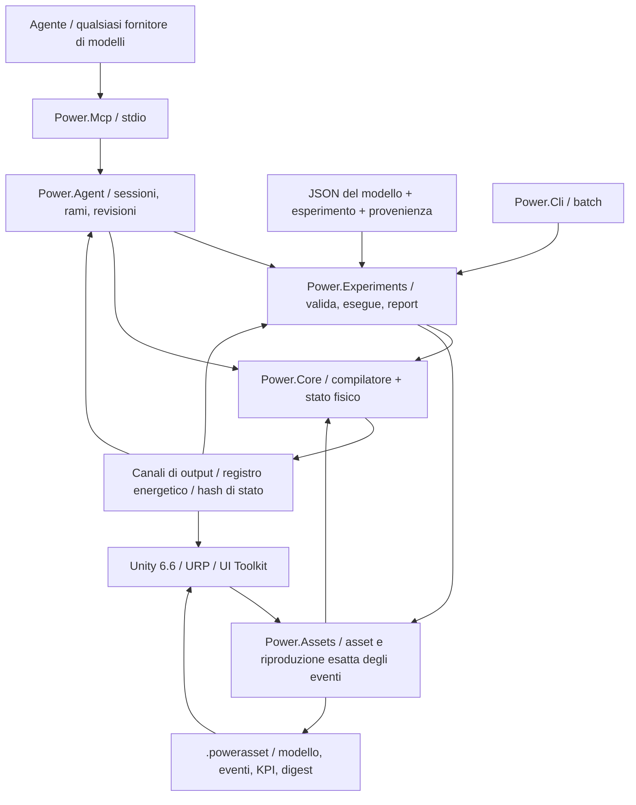

# Architettura C# / Unity / agente

[English](ARCHITECTURE.md) · [简体中文](ARCHITECTURE.zh-CN.md) · [Français](ARCHITECTURE.fr.md) · [Русский](ARCHITECTURE.ru.md) · [日本語](ARCHITECTURE.ja.md) · [한국어](ARCHITECTURE.ko.md) · [Deutsch](ARCHITECTURE.de.md) · [Español](ARCHITECTURE.es.md) · **Italiano** · [Português](ARCHITECTURE.pt-BR.md)

L'applicazione attiva resta C#/.NET con Unity. I prototipi nativi archiviati ora usano **Zig 0.15.2**, con la provenienza C originale conservata in Git e in un manifest degli hash dei sorgenti. Il [confine nativo](NATIVE_ZIG.it.md) definisce una libreria condivisa separata e l'ABI binaria versionata esistente. Nessuna dipendenza di runtime nativa è introdotta nel nucleo gestito o negli assembly Unity.


La decisione di architettura è datata 2026-09-07. La linea attiva è passata dai vecchi prototipi C al C# gestito. Unity fornisce lo studio 3D. I modelli fisici e l'automazione degli agenti girano per conto loro.



## Dipendenze e confini

`Power.Core` non ha dipendenze da Unity, rete, JSON, MCP, fornitore di modelli o pacchetti di terze parti. Lo stesso sorgente compila per `net10.0` e `netstandard2.1`. Record, pattern e il resto del C# 14 sono abbassati a IL gestito al momento della build. Unity carica solo gli assembly. La definizione di compatibilità `IsExternalInit` serve solo al target della libreria standard. Le scene Unity non serializzano direttamente i tipi record.

`Power.Experiments` trasforma il JSON del modello in una descrizione esplicita, limita tempo e dimensione dell'esperimento, esegue due replay con dimensioni di batch diverse, controlla i KPI e scrive l'evidenza. `Power.Agent` è uno spazio di lavoro indipendente dal trasporto. `Power.Mcp` lo espone come strumenti attraverso l'SDK ufficiale. Cambiare il fornitore di modelli cambia solo il client agente.

`Power.Assets` punta anch'esso a `net10.0` e `netstandard2.1` e dipende solo dal nucleo. Conserva la descrizione immutabile del modello, un riepilogo di provenienza, gli eventi e i KPI, e fornisce una codifica binaria a dimensione limitata e un player. CLI e MCP esportano il JSON validato come `.powerasset`. Dopo l'importazione, Unity ricompila il modello e controlla l'impronta, invece di serializzare gli interni del solver. Il formato sta negli [asset dei modelli](ASSET_FORMAT.it.md).

Unity riferisce direttamente gli assembly Core e Assets della libreria standard. Il codice di scena costruisce viste e controlli da nodi e canali e può mostrare qualsiasi topologia che il nucleo attuale supporti. Non costruisce più a mano un campione fisso. La modifica generale del grafo e il salvataggio non sono implementati. L'importazione reale e l'accettazione Play hanno ancora bisogno dell'Editor Unity.

## Compilazione del modello

`ModelDefinition` è una descrizione di topologia componibile. Un nodo dichiara il suo dominio fisico, l'accumulo e lo stato iniziale. Un componente dichiara gli estremi, i parametri, i canali di input e dove vanno le perdite. Ogni parametro dimensionale porta un'unità ed è normalizzato al SI al momento della compilazione, compresi i rpm in rad/s e i gradi in radianti.

Il compilatore copia le definizioni, ordina gli ID stabili e controlla unità, finitezza, connessioni, proprietà degli input e capacità. I modelli sono limitati a 32 nodi, 64 componenti e 128 voci di stato riportate. Le definizioni non supportate o non risolvibili restituiscono diagnostica di oggetto/campo.

`CompiledModel` conserva la topologia immutabile, la tabella dei canali, l'impronta del modello e la fattorizzazione LU. Più istanze di `Simulation` condividono un modello e ciascuna possiede uno stato completo e uno spazio di lavoro. Modificare gli array della descrizione originale dopo la compilazione non cambia il modello compilato.

## Confine di riferimento della trasmissione ideale

`IdealGearPair` e `SimplePlanetaryGear` sono primitivi di riferimento immutabili a carico costante, con proprietà SI esplicite e record di risultato puri. Forniscono evidenza indipendente per i vincoli di ingranaggi accoppiati separati, conservando uno stato di riferimento locale puro. Il planetario usa una matrice di massa ridotta dell'energia cinetica ed è controllato contro una soluzione separata con vincolo di accelerazione. Vedi [il contratto di riferimento](IDEAL_GEARS.it.md).

## Vincoli permanenti degli ingranaggi

Il [solver di ingranaggi accoppiato](GEAR_NETWORK.it.md) proietta il punto medio elettromeccanico e tutte le risposte di forza di cilindro/convertitore/frizione sui vincoli permanenti di ingranaggi ideali e planetari. Le righe normalizzate e i fattori sull'intero tick sono dati compilati immutabili; i fattori a intervallo variabile e i buffer dei moltiplicatori appartengono a ciascuna simulazione. Le velocità iniziali devono essere compatibili, la fase relativa iniziale è conservata e i vincoli dipendenti sono rifiutati. Le reazioni medie per porta sono accumulate attraverso gli intervalli interni accettati e copiate, sottoposte a hash e riportate indietro con rollback insieme allo stato completo. L'asset v8 ha introdotto record di topologia limitati, mentre le impronte e gli hash di replay privi di ingranaggi precedenti restano invariati.

## Soluzione congiunta di convertitore e cilindro

La [legge del convertitore](CONVERTER_NETWORK.it.md) possiede quattro mappe con segno immutabili e rifiuta l'interpolazione che crea energia. Un sistema non lineare congiunto risolve gli incrementi di manovella del cilindro e le velocità di porta al punto medio del convertitore attraverso la stessa risposta elettromeccanica proiettata. Le iterazioni della frizione e gli intervalli di evento interni riusano quel sistema, comprese le risposte a passo variabile. I modelli senza convertitore conservano il percorso di solver precedente e le impronte.

Le coppie medie di pompa/turbina, la potenza termica media e il calore cumulativo del fluido compensato appartengono allo stato di simulazione transazionale. La reazione dello statore è la somma di coppia opposta, a terra fissa. L'instradamento termico usa il lavoro meccanico realmente sottratto. Le definizioni delle mappe attraversano il JSON e i record limitati dell'asset v9; fattori e storie di runtime sono ricostruiti dal replay. Il blocco è una frizione parallela separata. Il componente quasi stazionario non aggiunge al Core dipendenze di trasporto, Unity, JSON o terze parti.

## Rete idraulica e azionamento in pressione

La [rete idraulica](HYDRAULIC_NETWORK.it.md) fa avanzare la pressione manometrica attraverso una cedevolezza costante e restrizioni esplicite lineari/turbolente regolarizzate. Volume di riferimento conservato, energia elastica quadratica, lavoro del serbatoio e calore di perdita di pressione usano gli stessi trasferimenti accettati. Lo spazio di lavoro di Newton per simulazione è limitato e senza allocazioni.

Le frizioni azionate dalla pressione ricavano la capacità dal punto medio dell'intervallo idraulico, dall'area dello stantuffo, dal precarico, dall'attrito e dal raggio efficace. Ogni prova speculativa di evento di frizione possiede una copia completa dello stato idraulico; il rollback include pressione, portate medie, perdita cumulativa e registri al confine. Gli output medi sono normalizzati sull'intero tick. L'asset v10 conserva i confini di pressione espliciti e le porte degli attuatori; i percorsi senza idraulica conservano le impronte precedenti. Pompe e stantuffi mobili richiedono ulteriori componenti conservativi.

## Nucleo elettromeccanico

Il [solver di frizione accoppiato](CLUTCH_NETWORK.it.md) aggiunge reazioni statiche limitate e attrito cinetico al sistema di punto medio elettromeccanico/del cilindro. Gli eventi interni di slittamento nullo sono racchiusi rispetto a copie complete di stato speculativo; i fattori di intervallo appartengono a ciascuna simulazione. Il calore di attrito entra nei nodi termici o nel registro esterno. Fase, coppia/potenza medie e calore cumulativo compensato partecipano a hash, fork e rollback dell'intero batch. La [legge autonoma e la coppia esatta](CLUTCH_PHYSICS.it.md) restano riferimenti indipendenti a carico costante. Il tempo esterno resta in tick interi limitati.

I modelli che contengono cilindri chiusi aggiungono una soluzione non lineare limitata a gradiente discreto intorno al sistema di punto medio elettromeccanico esistente. Il lavoro di pressione del gas è accoppiato al moto della manovella e incluso nel registro energetico. Il percorso lineare originale conserva la versione 2 del solver e le sue impronte di modello; i modelli con cilindro usano la versione 3 del solver. Vedi [le equazioni, i limiti e l'evidenza](SEALED_CYLINDER.it.md). Questo primo componente di cilindro ricava lo stato del gas a massa costante dall'angolo di manovella. Nodi gas separati a volume fisso ora portano massa ed energia interna indipendenti attraverso il [solver della rete gas del Core](GAS_NETWORK.it.md); l'[accoppiamento del cilindro mobile](MOVING_CYLINDER.it.md) ora collega quegli stati al lavoro di pressione all'albero a gomiti. La [fasatura opzionale sull'angolo di manovella](VALVE_TIMING.it.md) ora controlla le restrizioni dalla posizione reale della manovella; la [combustione premiscelata](PREMIXED_COMBUSTION.it.md) ora aggiunge la contabilità dei costituenti e dell'energia chimica. Chimica dettagliata e comportamento completo del motore restano aperti.

Meccanica e motore condividono un unico sistema lineare accoppiato, così forza controelettromotrice, coppia d'albero e velocità non sono trattate come segnali unidirezionali scollegati:

```text
x_mid = (I - h A / 2)^-1 (x_n + h b / 2)
x_next = 2 x_mid - x_n

L di/dt = V - R i - k ω
J dω/dt = k i + τ_external + τ_shaft

twist = θ_a - r θ_b - θ_rest
slip  = ω_a - r ω_b
τ_a   = -K twist - D slip
τ_b   = -r τ_a
```

La costante di coppia del motore e la costante di forza controelettromotrice usano lo stesso coefficiente di accoppiamento SI. Rapporti positivi e negativi sono assemblati così che la direzione della potenza resti coerente. Le perdite di resistenza e di smorzamento sono valutate al punto medio e inviate a un nodo termico nominato o all'esterno.

La rete termica usa l'Eulero all'indietro: `(C + h G) T_next = C T_n + Q_loss + h G_ambient T_ambient`. I flussi di calore interni sono assemblati a coppie. Il calore che esce verso l'esterno entra nel registro. La dinamica lineare meccanica e del motore ha un controllo di convergenza del secondo ordine. La dinamica termica è del primo ordine. Un passo grande che resta stabile non è un passo grande che resta accurato.

Il residuo energetico globale è `source_work - heat_rejected - stored_energy_change`. Il lavoro della sorgente può essere negativo, così la frenata rigenerativa riduce il lavoro cumulativo della sorgente. Lavoro cumulativo della sorgente e calore usano la somma compensata. Il registro controlla anche che output ed energia immagazzinata restino finiti.

## Tempo, transazioni e riproducibilità

Il tempo del Core è un `ulong` in nanosecondi. Il passo compilato è fisso tra 1 ns e 1 s. Ogni chiamata deve coprire tick completi e può avanzare al massimo di un milione di tick.

`SubmitInputs` controlla l'intero frame di input, poi lo committa una volta. `Step` fa avanzare ogni tick in uno stato candidato preallocato. Overflow, un output non finito, una temperatura illecita o l'annullamento scartano l'intero batch. Il flag di annullamento è controllato al massimo una volta ogni 256 tick. Il percorso di successo per gli input, l'avanzamento e l'istantanea del buffer del chiamante non alloca memoria gestita.

`Step(delta, scheduledInputs)` accetta eventi di input a tempi assoluti in nanosecondi. I tempi devono essere ordinati, allineati al tick e interni all'intervallo di questa chiamata. Lo stesso canale non può essere impostato due volte allo stesso tempo. Un evento all'inizio è inviato prima del primo tick. Un evento alla fine è inviato prima dell'istantanea. Se il batch fallisce, gli input fanno rollback con esso. `AssetPlayback` sposta il cursore degli eventi solo dopo il successo, così un batch di presentazione diverso non cambia l'esperimento. Una modifica interattiva può ramificare dallo stato di riproduzione in una simulazione indipendente.

`Fork` copia lo stato completo corrente e i termini di compensazione, così input diversi possono essere confrontati a partire dalla stessa storia fisica. I rami condividono solo il modello compilato. Non condividono stato mutabile. L'accesso concorrente a un'istanza del nucleo restituisce `Busy`. Istantanea e fork lanciano un'eccezione di occupato distinta perché le loro firme differiscono. Istanze diverse possono girare in parallelo.

L'impronta copre la semantica del modello, i parametri normalizzati, il passo e la versione del solver. L'hash di stato copre anche tempo, stato, input e termini di compensazione del registro. È un controllo di replay, non un hash di sicurezza. L'accordo bit a bit è richiesto per lo stesso binario, runtime e architettura. CPU, JIT, Mono o IL2CPP diversi si confrontano con una tolleranza fisica e non è promesso che coincidano bit per bit.

## Contratto del nucleo per gli agenti

- Capacità e limiti sono individuabili. I valori restituiti indicano la fedeltà del modello e lo stato di calibrazione.
- Gli errori di input sono localizzati da `TryCompile` o da un'eccezione strutturata. I chiamanti non analizzano la prosa della console.
- I canali usano ID stabili, una direzione, un'unità e un nome fisico. Gli adattatori serializzano ID a 64 bit, tempo e revisione come stringhe decimali.
- Le scritture di sessione portano `expected_revision`. Il controllo e il cambiamento di stato condividono un unico lock. Una chiamata obsoleta non fa avanzare la simulazione una seconda volta.
- Le istantanee possono selezionare i campi. Un esperimento restituisce per impostazione predefinita i valori finali e l'evidenza di validazione, così il contesto del modello resta piccolo.
- Un ramo di parametri copia prima lo stato, poi invia gli input separatamente. Fallimento e annullamento lasciano intatta la baseline del ramo.
- Un report tiene separati "l'esecuzione è terminata", "i KPI sono superati" e "i parametri sono calibrati". Nessun modello attuale è calibrato su un veicolo.

Le sessioni MCP vivono nel processo del server locale. Il limite è 16. Sono rilasciate quando il server esce. Un documento JSON contiene solo dati. Non esegue codice né istruzioni dentro il documento. La modellazione del nucleo non ha bisogno di una chiave API. Un tick fisico non attende una richiesta di rete.

## Che cosa è ancora aperto

Scambio gas comprimibile, combustione premiscelata prescritta, frizioni, ingranaggi, un convertitore mappato e l'azionamento idraulico esistono ora come componenti con porte, stato e controlli di conservazione. Non completano il gruppo motopropulsore. Ancora aperti: pompa e rabbocco del binario, controllo dell'accensione, aspirazione e scarico dettagliati, perdite meccaniche, termochimica più ricca, cedevolezza di ingranamento, controllo completo di pressione e cambio AT, comportamento ECU/TCU coordinato e calibrazione misurata. Una nuova equazione ha ancora bisogno di una versione esplicita del modello, di dimensioni e di evidenza numerica. La semantica dei componenti esistenti non si estende cambiandola in silenzio.

Un agente può generare una topologia e uno stato iniziale, proporre ipotesi sui parametri, scrivere candidati di componenti, costruire esperimenti e rileggere l'evidenza. Il nucleo di esecuzione possiede ancora i vincoli numerici e i controlli. Un giudizio di un modello linguistico non è un fatto fisico. La modifica del grafo in Unity, un thread di lavoro della simulazione e un backend di solver ad alte prestazioni sostituibile aspettano che il confine sia stabile. Niente qui afferma un solver non lineare generale, Burst o un solver su GPU.

## Integrazione gas del 2026-09-22

`ModelDocument` e `power.model.v1` ora mappano la composizione finita del gas e i parametri delle restrizioni nelle definizioni Core esistenti. `CompiledModel.ValidateInput` espone la validazione statica di canale/finitezza/intervallo, usata dai controlli di programmazione di esperimento e di asset; i controlli osservabili dipendenti dallo stato restano in `Simulation`. Le equazioni del solver e la costruzione dell'impronta sono invariate.

Il formato asset v3 estende le tabelle binarie limitate con la composizione dei nodi gas e i record degli orifizi. Conserva i lettori v1/v2 e controlla copertura dell'estensione, tipo, unicità e lunghezza prima di compilare e confrontare le impronte. La conduttanza di parete del gas e la temperatura del serbatoio usano i campi esistenti del componente base. Questo tiene Core e Assets liberi da dipendenze JSON, di trasporto e Unity.

CLI e MCP condividono la semantica di documento gas, asset ed esperimento. Lo Studio legge lo stesso asset e aggiunge recipienti/percorsi schematici; i suoi nuovi test Editor/Play richiedono ancora un'esecuzione reale dell'Editor. Vedi lo [stato di sviluppo](DEVELOPMENT_STATUS.it.md) per il lavoro restante.

## Accoppiamento del cilindro mobile

Un `gas_cylinder` possiede il volume di un nodo gas e riferisce una manovella rotazionale. Il nodo gas omette l'accumulo indipendente, così la compilazione ricava il volume iniziale dalla geometria all'angolo iniziale della manovella. Pressione, temperatura, massa ed energia restano sul nodo gas; il componente di geometria espone volume, spostamento e coppia all'albero a gomiti.

I modelli con camere mobili aggiungono il tag di impronta 5 e usano l'integrazione simmetrica mezzo flusso/manovella intera/mezzo flusso. La variazione di energia della camera adiabatica e la coppia all'albero a gomiti usano lo stesso gradiente discreto, compreso il lavoro di contropressione esterna. L'accoppiamento di parete resta del primo ordine. Il percorso di solver precedente solo a volume fisso e le impronte precedenti restano intatti. Tutto lo stato candidato di gas, manovella e registro appartiene ancora alla transazione dell'intera chiamata.

L'asset v4 aggiunge record di geometria mobile indicizzati e conserva i lettori precedenti. L'esempio JSON/MCP e la vista Unity del pistone mobile usano le stesse definizioni; la verifica reale dell'Editor resta in sospeso. Vedi [MOVING_CYLINDER.it.md](MOVING_CYLINDER.it.md).

## Profili di restrizione sull'angolo di manovella

Una `ValveTimingDefinition` immutabile opzionale su un orifizio gas riferisce un nodo rotazionale e angoli espliciti di ciclo, apertura e durata. `CrankValveProfile` normalizza la fase e valuta un inviluppo continuo seno-quadro. L'input dell'orifizio diventa l'apertura di picco; il solver del gas e la portata massica osservabile condividono la stessa frazione efficace. Non c'è uno stato di camma mutabile separato. I modelli fasati aggiungono il tag di impronta 6 e usano la suddivisione simmetrica gas/manovella anche quando i loro volumi di gas sono fissi. I modelli senza fasatura conservano il percorso e le impronte precedenti.

Le protezioni per lobo di angolo/velocità e di precisione rifiutano i tick sotto-risolti dentro la transazione di stato candidato esistente. JSON, asset v10 e MCP espongono lo stesso contratto, mentre lo Studio legge il canale di apertura efficace per il suo marcatore schematico. L'esecuzione Unity reale resta separatamente in sospeso. Vedi [VALVE_TIMING.it.md](VALVE_TIMING.it.md).

## Reazione premiscelata e trasporto dei costituenti

`GasDefinition.Premixed` opzionale fornisce potere calorifico esplicito, rapporto stechiometrico e frazioni iniziali di carburante/aria fresca. `GasNetwork` compila miscele collegate compatibili e frazioni di serbatoio esplicite. Il solver del gas trasporta tre masse di costituenti non negative con il flusso a monte, ricostruisce la massa totale e contabilizza l'entalpia chimica al confine del modello. Il trasporto premiscelato include un limite sul flusso uscente oltre ai limiti esistenti di massa/energia netta.

`PremixedCombustion` riferisce il nodo gas e la sua manovella. `CombustionSolver` anticipa il calore dall'esposizione di Wiebe in avanti e dai reagenti limitanti durante l'iterazione della manovella. La coppia di pressione usa metà del calore anticipato prima del lavoro adiabatico; l'altra metà segue il passo di lavoro. Il consumo accettato di carburante/aria, la formazione dei prodotti, i registri chimici e la frontiera angolare irreversibile vivono in `MixtureState` dentro la transazione candidata ordinaria. È copiato sui fork e incluso negli hash; le anteprime dello spazio di lavoro non sopravvivono mai a una chiamata fallita come stato committato.

I modelli premiscelati aggiungono il tag di impronta 7. L'asset v10 conserva le estensioni di miscela, serbatoio e combustione; la semantica precedente non reagente resta invariata. JSON/CLI/MCP espongono l'evidenza di carburante e di calore, mentre lo Studio usa lo stesso canale di rilascio di calore per il suo marcatore schematico. L'esecuzione reale dell'Editor resta in sospeso. L'ambito numerico e fisico completo è documentato in [PREMIXED_COMBUSTION.it.md](PREMIXED_COMBUSTION.it.md).

## Accoppiamento idraulico comandato dall'albero

I modelli con pompe estendono il sistema non lineare congiunto con le velocità dell'albero della pompa e tutte le pressioni idrauliche al punto medio. La reazione di pressione entra nelle stesse risposte di forza proiettate sugli ingranaggi della coppia di cilindro e convertitore. Il flusso della pompa entra nei bilanci accoppiati dei nodi di cedevolezza; le capacità delle frizioni dipendenti dalla pressione si aggiornano dentro l'iterazione dei vincoli. I trasferimenti accettati committano volume, lavoro al confine, lavoro da albero a fluido e calore di scarico. Tutto lo spazio di lavoro è posseduto dalla simulazione e l'avanzamento non alloca memoria gestita.

I modelli senza pompa conservano il percorso di solver idraulico precedente e gli hash di replay. I limiti di cilindrata ideale e di scarico a conduttanza finita, le porte tipizzate, gli osservabili e l'evidenza indipendente sono specificati in [HYDRAULIC_PUMP.it.md](HYDRAULIC_PUMP.it.md). Core e Assets restano assembly a doppio target privi di dipendenze; l'evidenza Unity reale è separata.

## Controllo campionato nella transazione del modello

`PressureControllerDefinition` dichiara il sensore idraulico, il canale di tensione del motore CC posseduto, guadagni/limiti espliciti, l'integrale iniziale e un periodo di campionamento intero allineato ai tick. La compilazione vincola un proprietario regolatore per input del motore e rimuove quell'input dalla tabella di scrittura esterna. Il setpoint di pressione di un regolatore resta individuabile con unità e ID stabili. I modelli senza regolatori conservano le impronte precedenti.

All'inizio di ogni tick completo, dopo gli input programmati a quel tempo, lo stato candidato campiona i regolatori in scadenza dalla pressione idraulica corrente. Aggiorna integrale, pressione/errore campionati e tensione tenuta, poi esegue la soluzione fisica. Gli intervalli di prova interni della frizione copiano questo stato e non lo ricampionano. Il motore fisico contabilizza ancora tutto il lavoro elettrico e il calore. Il regolatore non ha un accumulo di energia inventato.

La memoria del regolatore e gli input del motore posseduti sono copiati dai fork, sottoposti a hash e committati solo con l'intero batch. L'annullamento o un fallimento numerico successivo riporta indietro con rollback la storia del controllo insieme allo stato fisico e agli input. Il campionamento non alloca memoria gestita. JSON, asset v12, CLI e MCP condividono questa semantica di modello, con l'esecuzione reale dell'Editor che resta separatamente in sospeso. Vedi [il contratto completo](HYDRAULIC_PUMP.it.md#sampled-pressure-regulation).

## Alimentazione elettrica accoppiata

I nodi batteria aggiungono SOC e tensione di polarizzazione allo stesso vettore di stato dinamico delle coordinate rotazionali e delle correnti del motore RL. L'energia chimica è l'integrale della curva OCV affine esplicita sulla carica; il ramo RC immagazzina energia quadratica. Nessun fornitore di modelli, trasporto, Unity o dipendenza di terze parti entra in queste equazioni.

Il duty tenuto e le aperture del carico resistivo cambiano la matrice elettrica e il termine affine. `ElectricalDynamics` possiede le sue derivate, i fattori LU e la cache degli input per simulazione. Le risposte di ingranaggi, cilindro, convertitore e frizione usano i fattori preparati, comprese le prove interne di cattura a durata variabile. Una preparazione fallita invalida le cache; lo stato fisico/di controllo candidato si committa ancora solo con l'intero batch. Le cache sono spazio di lavoro, non stato di modello condiviso né storia persistente della simulazione.

Il lavoro del motore di batteria si trasferisce internamente. Le variazioni di energia di batteria, induttiva, meccanica e idraulica bilanciano il calore esplicito e il lavoro esterno di sorgente/carico ideali. Carica e polarizzazione vivono nel vettore di stato ordinario, così fork, hash e rollback le includono automaticamente. Il controllo di duty usa output adimensionali e lo stesso contratto di campionamento/anti-windup del controllo di tensione. L'asset v14 e JSON/MCP conservano le definizioni complete di alimentazione. [Il contratto di alimentazione](HYDRAULIC_PUMP.it.md#finite-battery-supply-and-duty-regulation) registra ambito, limiti ed evidenza indipendente.

## Azionamento idraulico traslazionale

I nodi `translational` aggiungono stati di spostamento e di velocità con massa concentrata positiva. Gli stantuffi idraulici aggiungono incognite di coordinata al solver congiunto meccanico/di pressione esistente. I volumi spazzati anteriore/posteriore si accoppiano alla cedevolezza; il lavoro della pressione di serbatoio resta un confine esterno esplicito. Le molle lineari usano la stessa matrice di punto medio con unità traslazionali. Le forze di pastiglia e di fine corsa usano gradienti di potenziale discreti e Jacobiani analitici, conservando il lavoro di pressione/contatto attraverso l'attivazione e il rilascio della cerniera.

Le frizioni a contatto ricavano le capacità dalla forza discreta della pastiglia durante la soluzione, poi espongono forza/capacità istantanee nelle istantanee. Ogni simulazione possiede storie compatte compensate di molla-smorzamento, copiate e sottoposte a hash con ogni stato candidato. Non ci sono allocazioni di spazio di lavoro durante l'avanzamento ordinario riuscito o le letture di istantanea. L'asset v14 e JSON/MCP conservano la topologia di moto e di contatto. Vedi [HYDRAULIC_PISTON.it.md](HYDRAULIC_PISTON.it.md) per equazioni, limiti ed evidenza.

## Flusso dosato meccanicamente

Le spalle della valvola a cursore si legano alle coordinate dello stantuffo esistenti. Il residuo idraulico legge la loro posizione al punto medio e include le derivate analitiche del flusso rispetto a pressione e corsa dello stantuffo. Retroazione di pressione, moto e dosatura condividono quindi la matrice di Newton e gli intervalli speculativi della frizione. Il calore passivo delle porte e il volume spazzato si committano attraverso le storie idrauliche esistenti. Le pendenze di posizione usano buffer limitati posseduti dalla simulazione; l'avanzamento riuscito non aggiunge allocazioni gestite. L'asset v15, JSON e il replay MCP reale conservano la geometria. La spalla dichiarata equilibrata in pressione trascura la forza assiale del getto; vedi [HYDRAULIC_SPOOL.it.md](HYDRAULIC_SPOOL.it.md).

## Accoppiamento energetico lineare gas/fluido

Gli stantuffi a gas aggiungono proprietari di geometria lineare alla rete gas finita. Massa/energia iniziali usano la geometria iniziale reale; flusso e calore di parete leggono il volume corrente. Il solver meccanico congiunto raccoglie coordinate traslazionali uniche, così camere a gas opposte e un separatore idraulico condividono una massa. La forza del gas usa il lavoro di pressione discreto adiabatico, una derivata analitica e serie stabili per piccoli spostamenti. Il lavoro della pressione assoluta di riferimento è esterno; l'energia interna del gas resta uno stato transazionale ordinario. Nessuna curva di pressione adattata sostituisce quello stato.

Le camere chiuse non miscelate senza trasporto né calore saltano l'integrazione a derivata nulla dopo la validazione dello stato. Il replay misurato prima/dopo conserva ogni valore/hash. Limiti, rollback/fork e avanzamento senza allocazioni si applicano alle storie combinate gas/fluido. L'asset v16 e JSON/MCP conservano geometria e orientamento. Vedi [GAS_PISTON.it.md](GAS_PISTON.it.md) per termodinamica, ambito ed evidenza.

## Dosatura del carburante per ciclo

Binari e ricevitori di gas finiti e tracciati usano i trasferimenti conservativi esistenti dell'orifizio. Un regolatore per ciclo aggancia la massa di carburante richiesta in una finestra di manovella in avanti. Un tetto di portata del carburante scala lo stesso flusso di massa, costituenti ed entalpia; i trasferimenti di Heun accettati aggiornano la storia completa di quota/erogazione. L'energia chimica si muove internamente e resta separata dal calore di reazione e dai confini esterni. L'inversione non azzera una quota osservata. Le storie appartengono a ciascuna simulazione, compresi gli intervalli speculativi della frizione, l'annullamento e i fork. La corsa di fasatura e i conteggi di stato restano limitati; l'avanzamento a caldo non alloca memoria gestita. L'asset v17 e JSON/MCP conservano ugello, fasatura e dose. Vedi [FUEL_METERING.it.md](FUEL_METERING.it.md).

## Fase liquida finita e disponibilità del vapore

I film aggiungono massa liquida esplicita e inventario termico/chimico accanto ai ricevitori di gas tracciati. La legge analitica del bagno finito risolve riscaldamento, saturazione prescritta ed essiccamento, usando uno scostamento di fase dell'energia interna accordato alla capacità termica del vapore del ricevitore. Il vapore entra negli stati ordinari di gas e di carburante; il liquido resta fuori dall'inventario di reazione. La parete finita paga ogni trasferimento di fase.

I mezzi passi film/gas/meccanica/gas/film invertono l'ordine dei film nella seconda passata, così i trasferimenti dei film che condividono la parete hanno una suddivisione simmetrica. Le altre sorgenti di calore di parete conservano la temperatura di parete esplicita dell'intervallo esterno e il suo limite di accuratezza del primo ordine. Controlli indipendenti di raffinamento ODE simultaneo distinguono questi casi. Inventari di fase, storie compensate di calore/erogazione e portate medie si copiano/sottopongono a hash/fanno rollback con lo stato completo della simulazione, compresi gli intervalli speculativi della frizione. L'asset v18 e JSON/MCP conservano tutte le quantità di fase. Vedi [FUEL_FILM.it.md](FUEL_FILM.it.md).

## Erogazione di carburante liquido finita e cedevole

Gli iniettori liquidi possiedono un inventario di sorgente finito e l'energia di pressione del binario. La pressione si ricava dal volume scaricato compensato attraverso la cedevolezza fornita; l'ugello unidirezionale integra analiticamente il decadimento del carico di pressione a ricevitore fisso. Le quote del ciclo in avanti condivise limitano l'erogazione e conservano la semantica di inversione/comando. L'energia calorica e chimica del liquido si muove verso il film senza aggirare l'evaporazione. Il lavoro di pressione del binario si separa in calore dell'ugello sulla parete finita e in un confine esplicito di lavoro di spostamento del ricevitore esportato, sotto la riduzione a volume liquido trascurabile. Solo quel lavoro esportato entra nel lavoro esterno globale; l'energia del binario immagazzinata non è contata due volte.

L'iniezione avvolge la suddivisione esistente film/gas/meccanica con l'ordinamento invertito della seconda metà. Inventari di sorgente/film e tutte le storie di quota, pressione/calore e compensate sopravvivono agli intervalli speculativi della frizione, al rollback completo, all'annullamento e ai fork indipendenti. Il raffinamento ODE simultaneo indipendente e i controlli di allocazione attiva verificano il percorso condiviso. L'asset v19, JSON e l'MCP reale conservano le definizioni di sorgente/ugello/fasatura. Vedi [LIQUID_FUEL_INJECTION.it.md](LIQUID_FUEL_INJECTION.it.md).

## Solenoide reciproco e ago fisico

Il concatenamento di flusso e l'induttanza lineare dipendente dalla posizione aggiungono energia magnetica immagazzinata e forza reciproca alla soluzione meccanica congiunta. Un'eliminazione elettrica analitica e la derivata rispetto alla posizione conservano un'identità energetica discreta simmetrica; il moto accettato committa una sola volta flusso magnetico, calore nel rame e lavoro elettrico. Gli arresti elastici di corsa riusano gradienti di cerniera conservativi senza bloccare lo stato. Le coordinate si fondono con le coordinate esistenti di stantuffo idraulico/a gas, secondo i casi.

L'alzata reale dell'ago dosa il flusso liquido indipendentemente dal taglio di dose desiderata/finestra. Un driver campionato possiede la tensione della bobina e usa il bersaglio di ciclo agganciato e l'erogazione misurata, conservando le code di chiusura e di rimbalzo sulla sede. Lo stato completo include storie magnetiche, del regolatore campionato/tenuto, di sorgente/fase e tutte le storie compensate attraverso fork, annullamento, cattura speculativa della frizione e fallimento tardivo. L'asset v20 e JSON/MCP conservano le definizioni. Ambito, reciprocità ed evidenza stanno in [NEEDLE_ACTUATION.it.md](NEEDLE_ACTUATION.it.md).

## Replay di chiusura limitato e taglio programmato

I driver con predizione abilitata copiano lo stato completo in un unico stato di replay preallocato, tengono gli altri comandi degli attuatori ed eseguono il replay di un futuro dell'impianto a tensione nulla o a taglio ritardato. Le equazioni fisiche ordinarie e gli intervalli ibridi accettati determinano l'erogazione aggiuntiva. Le previsioni non committano mai né eseguono i regolatori campionati in modo ricorsivo; gli intervalli reali preparano il loro spazio di lavoro del solver dopo ogni predizione.

Una ricerca limitata di candidati interi programma il taglio entro il periodo di campionamento successivo. L'aggancio per ciclo e il conto alla rovescia sui tick fisici impediscono riaperture ripetute da piccole differenze di previsione. Massa/conteggio di predizione, aggancio/ciclo e conto alla rovescia entrano nella copia/hash/rollback dello stato completo. Si controllano allineamento dell'orizzonte, intervallo dell'orologio, budget finito di tick e monotonicità dei candidati. L'asset v21 conserva l'orizzonte opzionale; le predizioni disabilitate conservano gli hash precedenti di modello/stato. Vedi [CLOSURE_PREDICTION.it.md](CLOSURE_PREDICTION.it.md).

## Composizione del grafo a doppia frizione

L'assemblaggio DCT immutabile abbassa sette percorsi avanti/retromarcia nei record esistenti di rotore, ingranaggio e frizione con ID stabili posseduti dal chiamante. Mozzi liberi, due alberi di ingresso, la ruota folle di retromarcia e tre rami di uscita/finale conservano l'inerzia esplicita. I selettori trasferiscono impulso/calore di sincronizzazione e le frizioni di trazione trasferiscono la potenza reale; un numero di marcia non sostituisce la topologia permanente.

Il grafo lineare grande ha esposto una proiezione lenta dei blocchi correlati a un passaggio sei/sette. La proiezione limitata primaria è conservata; quando esaurisce le iterazioni, i blocchi lineari indipendenti usano una fattorizzazione di Schur normalizzata e preallocata con gli stessi limiti statici, rilascio di modo, residuo e controlli di calore passivo. I casi singolari o non lineari conservano il comportamento esistente. I percorsi ordinari JSON/asset/MCP e le impronte originali restano invariati. Riferimenti e ambito stanno in [DUAL_CLUTCH_TRANSMISSION.it.md](DUAL_CLUTCH_TRANSMISSION.it.md).

## Stato DCT campionato e cinematica controllata

Il regolatore possiede tutti e dieci i comandi di trazione/selettore e valida la loro topologia reale dispari/pari/ruota folle/finale. Le richieste intere sono campionate su orologi limitati; slittamento e blocco fisici governano la preselezione e il passaggio esclusivo graduale. Folle, blocco di direzione, timeout, perdita di blocco persistente e recupero su nuova richiesta conservano output separati di stato/guasto. Comandi tenuti, selezioni, fase e orologi di monitoraggio si copiano/sottopongono a hash/fanno rollback con le storie fisiche complete.

I modelli controllati accumulano le coordinate dalla velocità al punto medio con arrotondamento compensato. I limiti stretti di fase degli ingranaggi restano invariati; la compensazione è transazionale e sottoposta a hash. I modelli precedenti conservano la loro integrazione/replay precedenti. Il limite di stato riportato si estende a 128 mentre i limiti di nodi/componenti restano 32/64, con test di confine esatto e di overflow. Questo supporta la composizione completa di ricerca accesa/DCT/controllo invece di scartare lo stato del motore per entrare nel limite precedente. L'asset v22 e JSON/MCP conservano tutte le definizioni di percorso/fasatura/tolleranza. Vedi [DCT_CONTROL.it.md](DCT_CONTROL.it.md).

## Assemblaggio di ricerca planetario composto

L'[assemblaggio Ravigneaux](RAVIGNEAUX_TRANSMISSION.it.md) combina un vincolo a pignone singolo sul solare grande e a doppio pignone sul solare piccolo che condividono corona/portasatelliti. Le righe normalizzate conservano la potenza di reazione sommata; le risposte proiettate entrano nella soluzione ordinaria meccanica/convertitore/frizione. I grafi composti accumulano le coordinate con una correzione compensata transazionale per conservare la fase di lungo periodo sotto carico; i modelli esistenti solo grafo conservano il percorso precedente di integrazione/hash. Quattro inerzie dei membri sono valori di ricerca espliciti; la rotazione interna dei satelliti resta non risolta. Cinque connessioni di attrito selezionano quattro gamme avanti o la retromarcia senza aggiungere una sorgente di velocità prescritta.

L'assemblaggio restituisce definizioni ordinarie immutabili con ID stabili di porte e di comandi. La cattura del portasatelliti genera calore di attrito reale. Ogni storia di reazione e di calore partecipa al contratto esistente di copia/hash/rollback dello stato. JSON e asset v23 conservano la topologia a doppio pignone; le impronte precedenti prive del componente e il replay autentico v22 restano invariati. Questo non stabilisce un controllo AT completo né un comportamento misurato del gruppo motopropulsore obiettivo.

## Moto interno risolto dei satelliti

Il [grafo Ravigneaux risolto](RESOLVED_PLANETS.it.md) usa quattro righe di ingranamento relative al portasatelliti tra sei rotori interni. La rotazione assoluta dei satelliti conserva l'accumulo cinetico diagonale dei rotori; le masse dichiarate per satellite aggiungono al portasatelliti l'inerzia orbitale esatta. Matrici di massa ridotte indipendenti, momento angolare, calore di cattura e ogni confine di replay controllano il grafo accoppiato ordinario. Non aggiunge un segnale di velocità prescritto né un accumulo di energia separato non tracciato.

Gli ingranamenti del portasatelliti supportano rapporti relativi con segno finiti e diversi da zero e reazioni esplicite del portasatelliti mobile. La loro proiezione di Schur normalizzata esegue al massimo tre raffinamenti del residuo relativo, comprese le piccole risposte di forza di frizione/cilindro/convertitore. I bersagli liberi al punto medio impongono un residuo nullo di velocità all'estremo successivo, evitando la riflessione ripetuta dell'arrotondamento precedente attraverso la stessa risposta di forza. I moltiplicatori di correzione si accumulano nelle reazioni reali. I fattori compilati restano immutabili; i buffer di lavoro posseduti dalla simulazione e i buffer locali del costruttore tengono i rami indipendenti. I grafi esistenti conservano il percorso di proiezione precedente. Il nuovo primitivo aggiunge il tag di impronta 28 e il supporto di topologia dell'asset v24.

## Assemblaggio condiviso di azionamento idraulico

L'[assemblaggio di azionamento AT](AT_HYDRAULIC_ACTUATION.it.md) abbassa i bersagli di frizione dichiarati 1..6 in frizioni reali a stantuffo/contatto, restrizioni di riempimento/scarico e molle di richiamo alimentate da una pompa reversibile condivisa, trafilamento/trascinamento e scarico. Le aree esplicite anteriore/posteriore conservano l'inventario spazzato e il lavoro della pressione di riferimento. Le definizioni ordinarie immutabili conservano la soluzione congiunta esistente di pressione/moto/attrito, la semantica portabile v24 e lo stato atomico completo. Le programmazioni di valvole prescritte restano separate dalla retroazione/dal controllo AT e dall'accettazione misurata del corpo valvole.

## Retroazione AT idraulica

`at_controller` accetta una marcia richiesta intera in [-1,4]; zero indica folle. Gestisce cinque coppie di valvole di riempimento/scarico e il blocco facoltativo del convertitore. L'ordine è ingresso del portasatelliti, solare piccolo, solare grande, freno del portasatelliti, freno del solare grande, poi blocco.

`controlled-hydraulic-ravigneaux` e `controlled-fired-hydraulic-ravigneaux` usano il canale 900 e l'ID 1400. Conservano 99 e 122 stati dichiarati entro il limite invariato di 128. v26 conserva percorsi, guadagni e clock e legge v1-v25.

Sono controlli di ricerca e i parametri restano `unverified`. Coordinamento della coppia ECU, sensori/valvole dettagliati, guasti completi del veicolo e calibrazione OEM restano aperti. Le verifiche managed e Standard non provano l'accettazione reale Unity Editor/Play/Player/IL2CPP.

[AT_CONTROL.it.md](AT_CONTROL.it.md)

## Rail di combustibile liquido alimentato da pompa

`liquid_rail_feed` associa un iniettore liquido a una pompa volumetrica esistente e a un confine esplicito di materia/calore. Il nodo di uscita idraulica deve corrispondere alla cedevolezza e alla pressione assoluta iniziale del rail. Pompa e iniettore possiedono questo nodo; altri percorsi fluidi non contabilizzati sono rifiutati.

v26 conserva collegamenti e temperatura sorgente e legge v1-v25. Scambio analitico albero/pressione, raffinamento ODE simultaneo indipendente, miscelazione termica, bilanci massa/combustibile/energia/volume, ritorno e rollback completo hanno verifiche separate.

La sorgente è un confine esterno esplicito, non un serbatoio finito modellato. Svuotamento, efficienza/regolazione pompa, perdite tubazioni, cavitazione, proprietà dipendenti dalla pressione e spray a volume finito restano aperti. Parametri `unverified`; non si stabilisce calibrazione OEM o accettazione reale Unity Editor/Play/Player/IL2CPP.

[PUMP_FED_FUEL.it.md](PUMP_FED_FUEL.it.md)
