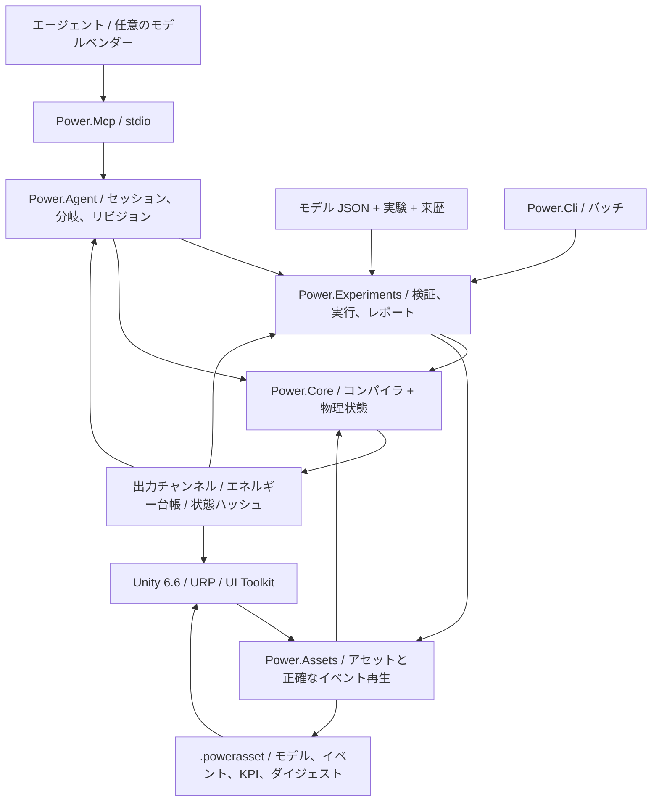

# C# / Unity / エージェントのアーキテクチャ

[English](ARCHITECTURE.md) · [简体中文](ARCHITECTURE.zh-CN.md) · [Français](ARCHITECTURE.fr.md) · [Русский](ARCHITECTURE.ru.md) · **日本語** · [한국어](ARCHITECTURE.ko.md) · [Deutsch](ARCHITECTURE.de.md) · [Español](ARCHITECTURE.es.md) · [Italiano](ARCHITECTURE.it.md) · [Português](ARCHITECTURE.pt-BR.md)

現行アプリケーションは、C#/.NET と Unity のままです。保管されたネイティブプロトタイプは、今は **Zig 0.15.2** を使います。元の C の来歴は、Git とソースハッシュのマニフェストに保たれます。[ネイティブ境界](NATIVE_ZIG.ja.md) は、別の共有ライブラリと、既存のバージョン付きバイナリ ABI を定義します。マネージドコアや Unity アセンブリへ、ネイティブのランタイム依存は導入されません。

アーキテクチャの決定は 2026-09-07 付です。現行の系統は、古い C プロトタイプからマネージド C# へ移りました。Unity が 3D スタジオを提供します。物理モデルとエージェント自動化は、それぞれ独立して動きます。



## 依存関係と境界

`Power.Core` に、Unity、ネットワーク、JSON、MCP、モデルベンダー、サードパーティパッケージの依存はありません。同じソースが `net10.0` と `netstandard2.1` へコンパイルされます。C# 14 の record、パターン、その他は、ビルド時にマネージド IL へ下げられます。Unity がロードするのはアセンブリだけです。`IsExternalInit` の互換定義は、標準ライブラリ向けターゲットのためだけにあります。Unity シーンは record 型を直接直列化しません。

`Power.Experiments` は、モデル JSON を明示的なモデル記述へ変え、実験の時間とサイズを制限し、バッチサイズの異なる 2 回のリプレイを実行し、KPI を検査し、エビデンスを書きます。`Power.Agent` は、トランスポートに依存しないワークスペースです。`Power.Mcp` は、公式 SDK を通じてそれをツールとして公開します。モデルベンダーを変えても変わるのは、エージェントクライアントだけです。

`Power.Assets` も `net10.0` と `netstandard2.1` を対象にし、コアだけに依存します。不変のモデル記述、来歴の要約、イベント、KPI を蓄え、サイズ制限のあるバイナリ符号化と再生器を提供します。CLI と MCP は、検証済み JSON を `.powerasset` としてエクスポートします。インポートのあと、Unity はソルバー内部を直列化せず、モデルを再コンパイルしてフィンガープリントを検査します。形式は [モデルアセット](ASSET_FORMAT.ja.md) にあります。

Unity は、Core と Assets の標準ライブラリアセンブリを直接参照します。シーンコードは、ノードとチャンネルからビューとコントロールを作り、現在のコアがサポートする任意のトポロジーを表示できます。固定サンプルを手で組み立てることは、もうしません。一般的なグラフ編集と保存は未実装です。実際のインポートと Play の受け入れには、まだ Unity Editor が必要です。

## モデルのコンパイル

`ModelDefinition` は、組み合わせ可能なトポロジー記述です。ノードは物理領域、貯蔵、初期状態を宣言します。コンポーネントは端点、パラメーター、入力チャンネル、損失の行き先を宣言します。すべての次元付きパラメーターは単位を持ち、コンパイル時に SI へ正規化されます。rpm から rad/s、度からラジアンを含みます。

コンパイラは定義をコピーし、安定 ID をソートし、単位、有限性、接続、入力の所有、容量を検査します。モデルはノード 32、コンポーネント 64、報告される状態項目 128 までに制限されます。サポートされない、または解けない定義は、オブジェクト/フィールドの診断を返します。

`CompiledModel` は、不変のトポロジー、チャンネルテーブル、モデルフィンガープリント、LU 分解を蓄えます。複数の `Simulation` インスタンスが 1 つのモデルを共有し、それぞれが完全な状態とワークスペースを所有します。コンパイル後に元の記述配列を変えても、コンパイル済みモデルは変わりません。

## 理想変速の参照境界

`IdealGearPair` と `SimplePlanetaryGear` は、不変で一定負荷の参照原始素です。明示的な SI 物性と、純粋な結果レコードを持ちます。別の連成歯車拘束に対する独立したエビデンスを提供しつつ、純粋な局所参照状態を保持します。遊星は縮小された運動エネルギー質量行列を使い、別の加速度拘束解と照合されます。[参照契約](IDEAL_GEARS.ja.md) を参照してください。

## 恒久的な歯車拘束

[連成歯車ソルバー](GEAR_NETWORK.ja.md) は、電気機械の中点と、すべての気筒/コンバーター/クラッチの力応答を、恒久的な理想歯車拘束と遊星拘束へ射影します。正規化された行と完全ティックの因子は、不変のコンパイル済みデータです。可変区間の因子と乗数バッファは、各シミュレーションに属します。初期速度は両立しなければならず、初期の相対位相は保たれ、従属な拘束は拒否されます。ポートごとの平均反力は、受理された内部区間にわたって蓄積され、完全な状態とともにコピー、ハッシュ、ロールバックされます。アセット v8 は有界なトポロジーレコードを導入し、歯車を持たない以前のフィンガープリントとリプレイハッシュは変わりません。

## コンバーターと気筒の連成求解

[コンバーター則](CONVERTER_NETWORK.ja.md) は、4 つの不変な符号付きマップを所有し、エネルギーを生む補間を拒否します。連成した非線形系が、気筒クランクの増分とコンバーター中点のポート速度を、同じ射影済み電気機械応答を通じて解きます。クラッチ反復と内部イベント区間は、可変ステップ応答を含めてその系を再利用します。コンバーターを持たないモデルは、以前のソルバー経路とフィンガープリントを保持します。

平均のポンプ/タービントルク、平均熱出力、補償された累積流体熱は、トランザクションなシミュレーション状態に属します。ステーター反力は、それらの反対向きのトルク和で、静止した接地にあります。熱の経路は、実際に取り除かれた機械仕事を使います。マップ定義は、JSON と有界なアセット v9 レコードを横断します。因子と実行時履歴はリプレイで再構成されます。ロックアップは、別の並列クラッチです。準定常コンポーネントは、Core にトランスポート、Unity、JSON、サードパーティの依存を追加しません。

## 油圧ネットワークと圧力作動

[油圧ネットワーク](HYDRAULIC_NETWORK.ja.md) は、一定コンプライアンスと、明示的な線形/正則化乱流の絞りを通じてゲージ圧を進めます。保存される参照容積、二次の弾性エネルギー、リザーバー仕事、圧力損失熱は、同じ受理済み輸送を使います。シミュレーションごとの Newton ワークスペースは有界で、割り当てなしです。

圧力作動クラッチは、油圧区間の中点、ピストン面積、予圧、摩擦、有効半径から容量を導きます。投機的なクラッチイベントの試行は、それぞれ完全な油圧状態のコピーを所有します。ロールバックは、圧力、平均流量、累積損失、境界台帳を含みます。平均出力は、完全ティックにわたって正規化されます。アセット v10 は明示的な圧力境界とアクチュエーターポートを保ちます。油圧を持たない経路は、以前のフィンガープリントを保持します。ポンプと可動ピストンには、さらに保存的なコンポーネントが必要です。

## 電気機械コア

[連成クラッチソルバー](CLUTCH_NETWORK.ja.md) は、有界な静止反力と動摩擦を、電気機械/気筒の中点系へ追加します。内部の滑りゼロイベントは、完全な投機的状態コピーに対して挟み込まれます。区間因子は各シミュレーションに属します。摩擦熱は熱ノードか外部台帳へ入ります。位相、平均トルク/出力、補償された累積熱は、ハッシュ、分岐、バッチ全体のロールバックに参加します。[スタンドアロンの法則と厳密なペア](CLUTCH_PHYSICS.ja.md) は、独立した一定負荷の参照のままです。外部時間は、有界な整数ティックのままです。

密閉気筒を含むモデルは、既存の電気機械中点系のまわりに、有界な非線形離散勾配の求解を追加します。ガス圧力仕事はクランク運動へ結合され、エネルギー台帳に含まれます。元の線形経路はソルバーバージョン 2 とそのモデルフィンガープリントを保持します。気筒モデルはソルバーバージョン 3 を使います。[方程式、限界、エビデンス](SEALED_CYLINDER.ja.md) を参照してください。この最初の気筒コンポーネントは、一定質量のガス状態をクランク角から導きます。別の固定容積ガスノードは、今は [コアのガスネットワークソルバー](GAS_NETWORK.ja.md) を通じて独立した質量と内部エネルギーを運びます。[可動気筒の結合](MOVING_CYLINDER.ja.md) は、今はそれらの状態をクランク圧力仕事へ接続します。任意の [クランク角タイミング](VALVE_TIMING.ja.md) は、実際のクランク位置から絞りを制御します。[予混合燃焼](PREMIXED_COMBUSTION.ja.md) は、成分と化学エネルギーの収支を追加します。詳細な化学と完全なエンジン挙動は、まだ開いています。

力学とモーターは 1 つの連成線形系を共有するので、逆起電力、シャフトトルク、速度は、無関係な一方向信号としては扱われません。

```text
x_mid = (I - h A / 2)^-1 (x_n + h b / 2)
x_next = 2 x_mid - x_n

L di/dt = V - R i - k ω
J dω/dt = k i + τ_external + τ_shaft

twist = θ_a - r θ_b - θ_rest
slip  = ω_a - r ω_b
τ_a   = -K twist - D slip
τ_b   = -r τ_a
```

モーターのトルク定数と逆起電力定数は、同じ SI 結合係数を使います。正と負の変速比は、動力の向きが一貫するよう組み立てられます。抵抗と減衰の損失は中点で評価され、名前付き熱ノードか外部へ送られます。

熱ネットワークは後退 Euler を使います。`(C + h G) T_next = C T_n + Q_loss + h G_ambient T_ambient` です。内部熱流は対で組み立てられます。外部へ出る熱は台帳に入ります。機械とモーターの線形動特性には 2 次の収束検査があります。熱動特性は 1 次です。安定なままの大きなステップは、正確なままの大きなステップではありません。

全体のエネルギー残差は `source_work - heat_rejected - stored_energy_change` です。源の仕事は負になり得るので、回生制動は累積源仕事を減らします。累積源仕事と熱は補償加算を使います。台帳は、出力と蓄積エネルギーが有限であることも検査します。

## 時間、トランザクション、再現性

コア時間はナノ秒の `ulong` です。コンパイル済みステップは 1 ns から 1 s のあいだで固定です。すべての呼び出しは完全ティックを覆わなければならず、進められるのは最大 100 万ティックです。

`SubmitInputs` は入力フレーム全体を検査してから、一度に確定します。`Step` は、事前割り当てされた候補状態の中でティックごとに進めます。オーバーフロー、非有限な出力、不正な温度、キャンセルは、バッチ全体を捨てます。キャンセルフラグは、最大でも 256 ティックに 1 回検査されます。入力、ステップ、呼び出し側バッファのスナップショットの成功経路は、マネージドメモリを割り当てません。

`Step(delta, scheduledInputs)` は、絶対ナノ秒時刻の入力イベントを受け付けます。時刻は順序付けられ、ティックに揃い、この呼び出しの区間内になければなりません。同じチャンネルを同じ時刻に 2 回設定することはできません。開始時のイベントは最初のティックの前に提出されます。終了時のイベントはスナップショットの前に提出されます。バッチが失敗すると、入力も一緒にロールバックされます。`AssetPlayback` は成功のあとだけイベントカーソルを動かすので、提示用の別バッチが実験を変えることはありません。対話的な変更は、再生状態から独立したシミュレーションへ分岐できます。

`Fork` は現在の完全な状態と補償項をコピーするので、同じ物理履歴から異なる入力を比べられます。分岐が共有するのはコンパイル済みモデルだけです。可変状態は共有しません。1 つのコアインスタンスへの同時アクセスは `Busy` を返します。スナップショットとフォークは、シグネチャが異なるため、別のビジー例外を投げます。異なるインスタンスは並列に実行できます。

フィンガープリントは、モデル意味論、正規化パラメーター、ステップ、ソルバーバージョンを覆います。状態ハッシュは、時刻、状態、入力、台帳の補償項も覆います。これはリプレイ検査であり、セキュリティハッシュではありません。同じバイナリ、ランタイム、アーキテクチャでは、ビット単位の一致が必要です。異なる CPU、JIT、Mono、IL2CPP は物理許容差で比較され、ビット単位の一致は約束されません。

## エージェント向けコア契約

- 機能と制限は発見できます。戻り値は、モデルの忠実度とキャリブレーション状態を述べます。
- 入力エラーは、`TryCompile` または構造化された例外で位置が分かります。呼び出し側はコンソールの文章を解析しません。
- チャンネルは安定した ID、方向、単位、物理名を使います。アダプターは 64 ビット ID、時刻、リビジョンを十進文字列として直列化します。
- セッションの書き込みは `expected_revision` を運びます。検査と状態変更は 1 つのロックを共有します。古い呼び出しが、シミュレーションを二度進めることはありません。
- スナップショットはフィールドを選べます。実験は既定で最終値と検証エビデンスを返すので、モデルの文脈は小さく保たれます。
- パラメーター分岐は、先に状態をコピーし、それから入力を別に提出します。失敗とキャンセルは、分岐の基線をそのまま残します。
- レポートは、「実行が終わった」「KPI に合格した」「パラメーターがキャリブレーション済みである」を分けて保ちます。現在のモデルで、車両にキャリブレーションされたものはありません。

MCP セッションはローカルサーバープロセスにあります。上限は 16 です。サーバーが終了すると解放されます。JSON ドキュメントが含むのはデータだけです。ドキュメント内のコードや指示は実行しません。コアのモデリングに API キーは不要です。物理ティックがネットワーク要求を待つことはありません。

## まだ開いているもの

圧縮性ガス交換、規定予混合燃焼、クラッチ、歯車、マップ化されたコンバーター、油圧駆動は、ポート、状態、保存検査を持つコンポーネントとして存在します。それらがパワートレインを完成させるわけではありません。まだ開いているもの: レールポンプと補給、点火制御、詳細な吸気と排気、機械損失、より豊富な熱化学、噛み合いのコンプライアンス、完全な AT の圧力と変速の制御、協調した ECU/TCU 挙動、実測キャリブレーション。新しい方程式には、明示的なモデルバージョン、次元、数値エビデンスがまだ必要です。既存コンポーネントの意味論は、静かに変えることで拡張されません。

エージェントは、トポロジーと初期状態を生成し、パラメーター仮説を提案し、コンポーネント候補を書き、実験を作り、エビデンスを読み戻せます。実行コアが、数値制約と検査をまだ所有します。言語モデルの判断は物理的事実ではありません。Unity のグラフ編集、シミュレーションワーカースレッド、交換可能な高性能ソルバーバックエンドは、境界が安定するまで待ちます。ここにあるものは、一般的な非線形ソルバー、Burst、GPU ソルバーを主張しません。

## 2026-09-22 のガス統合

`ModelDocument` と `power.model.v1` は、今は有限ガス組成と絞りパラメーターを、既存のコア定義へ写像します。`CompiledModel.ValidateInput` は、静的なチャンネル/有限性/範囲の検証を公開し、実験とアセットのスケジュール検査が使います。状態に依存する観測検査は `Simulation` に残ります。ソルバー方程式とフィンガープリントの構成は変わりません。

アセット形式 v3 は、有界なバイナリテーブルを、ガスノード組成とオリフィスレコードで拡張します。v1/v2 リーダーを保持し、コンパイルしてフィンガープリントを比べる前に、拡張の網羅、型、一意性、長さを検査します。ガス壁のコンダクタンスとリザーバー温度は、既存の基本コンポーネントフィールドを使います。これにより Core と Assets は、JSON、トランスポート、Unity の依存を持たないままです。

CLI と MCP は、ガスのドキュメント、アセット、実験の意味論を共有します。スタジオは同じアセットを読み、模式的な容器/経路を追加します。新しい Editor/Play テストには、まだ実際の Editor 実行が必要です。残る作業は [開発ステータス](DEVELOPMENT_STATUS.ja.md) を参照してください。

## 可動気筒の結合

`gas_cylinder` は 1 つのガスノードの容積を所有し、1 つの回転クランクを参照します。ガスノードは独立した貯蔵を省くので、コンパイルはクランクの初期角における形状から初期容積を導きます。圧力、温度、質量、エネルギーはガスノードに残ります。形状コンポーネントは、容積、変位、クランクトルクを公開します。

可動室を持つモデルはフィンガープリントタグ 5 を追加し、対称な半流れ/全クランク/半流れの積分を使います。断熱室のエネルギー変化とクランクトルクは、外部背圧仕事を含めて同じ離散勾配を使います。壁面結合は 1 次のままです。以前の固定容積だけのソルバー経路と、先行するフィンガープリントは保たれます。候補のガス、クランク、台帳の状態は、すべて呼び出し全体のトランザクションに属したままです。

アセット v4 は、インデックス付きの可動形状レコードを追加し、以前のリーダーを保持します。JSON/MCP の例と Unity の可動ピストンビューは、同じ定義を使います。実際の Editor 検証は未了のままです。[MOVING_CYLINDER.md](MOVING_CYLINDER.ja.md) を参照してください。

## クランク角の絞りプロファイル

ガスオリフィス上の任意で不変な `ValveTimingDefinition` は、回転ノードと、明示的なサイクル、開弁、持続の角度を参照します。`CrankValveProfile` は位相を正規化し、連続な sin 二乗の包絡線を評価します。オリフィス入力はピーク開度になります。ガスソルバーと観測可能な質量流量は、同じ実効割合を共有します。別の可変カム状態はありません。タイミング付きモデルはフィンガープリントタグ 6 を追加し、ガス容積が固定でも対称なガス/クランク分割を使います。タイミングのないモデルは、以前の経路とフィンガープリントを保持します。

ローブごとの角度/速度と精度のガードは、既存の候補状態トランザクションの中で、分解不足のティックを拒否します。JSON、アセット v10、MCP は同じ契約を公開し、スタジオは模式マーカーのために実効開度チャンネルを読みます。実際の Unity 実行は、別に未了のままです。[VALVE_TIMING.md](VALVE_TIMING.ja.md) を参照してください。

## 予混合反応と成分輸送

任意の `GasDefinition.Premixed` は、明示的な発熱量、理論比、初期の燃料/新鮮空気割合を供給します。`GasNetwork` は、互換な接続混合物と明示的なリザーバー割合をコンパイルします。ガスソルバーは、非負の 3 つの成分質量を上流流れで輸送し、総質量を再構成し、モデル境界で化学エンタルピーを計上します。予混合輸送は、既存の正味質量/エネルギー境界に加え、流出境界を含みます。

`PremixedCombustion` はガスノードとそのクランクを参照します。`CombustionSolver` は、クランク反復のあいだ、前進 Wiebe 露出と制限反応物から熱を予見します。圧力トルクは、断熱仕事の前に予見熱の半分を使い、残りの半分は仕事ステップのあとに続きます。受理された燃料/空気の消費、生成物の形成、化学台帳、不可逆な角度フロンティアは、通常の候補トランザクションの中の `MixtureState` にあります。分岐でコピーされ、ハッシュに含まれます。ワークスペースの予見が、失敗した呼び出しの確定状態として生き残ることはありません。

予混合モデルはフィンガープリントタグ 7 を追加します。アセット v10 は、混合物、リザーバー、燃焼の拡張を保持します。それ以前の非反応の意味論は変わりません。JSON/CLI/MCP は燃料と熱のエビデンスを公開し、スタジオは模式マーカーに同じ熱放出チャンネルを使います。実際の Editor 実行は未了のままです。完全な数値範囲と物理範囲は [PREMIXED_COMBUSTION.md](PREMIXED_COMBUSTION.ja.md) に文書化されています。

## シャフト駆動の油圧結合

ポンプを持つモデルは、連成非線形系を、ポンプシャフト速度とすべての油圧中点圧力で拡張します。圧力反力は、気筒とコンバーターのトルクと同じ、歯車射影された力応答へ入ります。ポンプ流量は、対になったコンプライアンスノードの収支へ入ります。圧力依存のクラッチ容量は、拘束反復の中で更新されます。受理された輸送は、容積、境界仕事、シャフトから流体への仕事、リリーフ熱を確定します。ワークスペースはすべてシミュレーションが所有し、ステップはマネージドメモリを割り当てません。

ポンプを持たないモデルは、先行する油圧ソルバー経路とリプレイハッシュを保持します。理想押しのけ量と有限コンダクタンスのリリーフ限界、型付きポート、観測量、独立エビデンスは [HYDRAULIC_PUMP.md](HYDRAULIC_PUMP.ja.md) に規定されています。Core と Assets は、依存関係のないデュアルターゲットアセンブリのままです。実際の Unity エビデンスは別です。

## モデルトランザクション内のサンプリング制御

`PressureControllerDefinition` は、油圧センサー、所有する直流モーター電圧チャンネル、明示的なゲイン/境界、初期積分、ティックに揃った整数サンプリング周期を宣言します。コンパイルは、モーター入力ごとにコントローラー所有者を 1 つ束縛し、その入力を外部書き込みテーブルから除きます。コントローラーの圧力設定値は、単位と安定 ID とともに発見できるままです。コントローラーを持たないモデルは、以前のフィンガープリントを保持します。

各完全ティックの開始時、その時刻の予定入力のあと、候補状態は現在の油圧圧力から到来したコントローラーをサンプリングします。積分、サンプリング圧力/誤差、保持電圧を更新し、それから物理求解を行います。内部のクラッチ試行区間はこの状態をコピーし、再サンプリングしません。物理モーターは、すべての電気仕事と熱を引き続き計上します。コントローラーに、作られたエネルギー貯蔵はありません。

コントローラーメモリと所有されるモーター入力は、分岐でコピーされ、ハッシュされ、バッチ全体とともにだけ確定されます。キャンセルまたはその後の数値失敗は、物理状態と入力とともに制御履歴をロールバックします。サンプリングはマネージドメモリを割り当てません。JSON、アセット v12、CLI、MCP はこのモデル意味論を共有し、実際の Editor 実行は別に未了のままです。[完全な契約](HYDRAULIC_PUMP.ja.md#sampled-pressure-regulation) を参照してください。

## 連成した電気供給

電池ノードは、回転座標と RL モーター電流と同じ動的状態ベクトルへ、SOC と分極電圧を追加します。化学エネルギーは、電荷にわたる明示的なアフィン OCV 曲線の積分です。RC 枝は二次エネルギーを蓄えます。これらの方程式へ、モデルプロバイダー、トランスポート、Unity、サードパーティの依存は入りません。

保持されたデューティーと抵抗負荷の開度は、電気行列とアフィン強制を変えます。`ElectricalDynamics` は、レート、LU 因子、入力キャッシュをシミュレーションごとに所有します。歯車、気筒、コンバーター、クラッチの応答は、準備された因子を使います。持続時間が可変な内部捕捉の試行を含みます。準備の失敗はキャッシュを無効にします。候補の物理/制御状態は、それでもバッチ全体とともにだけ確定されます。キャッシュはワークスペースであり、共有モデル状態でも永続的なシミュレーション履歴でもありません。

電池モーターの仕事は内部で伝達されます。電池、誘導、機械、油圧のエネルギー変化は、明示的な熱と、外部の理想源/負荷の仕事と釣り合います。電荷と分極は通常の状態ベクトルにあるので、分岐、ハッシュ、ロールバックは自動的にそれらを含みます。デューティー制御は無次元出力と、電圧制御と同じサンプリング/アンチワインドアップ契約を使います。アセット v14 と JSON/MCP は、完全な供給定義を保持します。[供給契約](HYDRAULIC_PUMP.ja.md#finite-battery-supply-and-duty-regulation) は、範囲、限界、独立エビデンスを記録します。

## 並進の油圧駆動

`translational` ノードは、正の集中質量を持つ変位と速度の状態を追加します。油圧ピストンは、既存の連成した機械/圧力ソルバーへ座標未知数を追加します。掃引される前面/背面の容積はコンプライアンスへ結合します。リザーバー圧力仕事は、明示的な外部境界のままです。線形ばねは、並進単位を持つ同じ中点行列を使います。パッドと行程ストッパの力は、離散ポテンシャル勾配と解析ヤコビアンを使い、ヒンジの作動と解放をまたいで圧力/接触仕事を保ちます。

接触クラッチは、求解中のパッドの離散力から容量を導き、スナップショットでは瞬間的な力/容量を公開します。各シミュレーションは、コンパクトな補償ばね減衰履歴を所有し、すべての候補状態とともにコピーされハッシュされます。成功する定常ステップやスナップショット読み取りのあいだ、ワークスペースの割り当ては起こりません。アセット v14 と JSON/MCP は、運動と接触のトポロジーを保持します。方程式、限界、エビデンスは [HYDRAULIC_PISTON.md](HYDRAULIC_PISTON.ja.md) を参照してください。

## 機械式に計量される流れ

スプールバルブのランドは、既存のピストン座標へ束縛されます。油圧残差はその中点位置を読み、圧力とピストン行程に関する解析的な流量微分を含みます。したがって圧力フィードバック、運動、計量は、Newton 行列と投機的なクラッチ区間を共有します。受動ポートの熱と掃引容積は、既存の油圧履歴を通じて確定されます。位置の傾きは、有界でシミュレーション所有のバッファを使います。成功するステップはマネージド割り当てを追加しません。アセット v15、JSON、実際の MCP リプレイは形状を保持します。宣言された圧力平衡ランドは軸方向ジェット力を無視します。[HYDRAULIC_SPOOL.md](HYDRAULIC_SPOOL.ja.md) を参照してください。

## 線形のガス/流体エネルギー結合

ガスピストンは、有限ガスネットワークへ線形形状の所有者を追加します。初期質量/エネルギーは実際の初期形状を使います。流れと壁面熱は現在の容積を読みます。連成機械ソルバーは一意な並進座標を集めるので、対向するガス室と油圧分離器は 1 つの質量を共有します。ガス力は、断熱の離散圧力仕事、解析微分、安定な小行程級数を使います。絶対参照圧力の仕事は外部です。ガス内部エネルギーは通常のトランザクション状態のままです。適合された圧力曲線が、その状態を置き換えることはありません。

輸送も熱もない閉じた非混合室は、状態検証のあと、ゼロレートの積分を省きます。前後を測ったリプレイは、すべての値/ハッシュを保ちます。境界、ロールバック/分岐、割り当てなしのステップは、組み合わされたガス/流体の履歴に適用されます。アセット v16 と JSON/MCP は、形状と向きを保持します。熱力学、範囲、エビデンスは [GAS_PISTON.md](GAS_PISTON.ja.md) を参照してください。

## サイクル燃料計量

有限で追跡されるガスレールと受け側は、既存の保存的なオリフィス輸送を使います。サイクルごとのコントローラーは、前進クランク窓の中で要求燃料質量をラッチします。燃料流量の上限は、同じ質量、成分、エンタルピー流束を拡大縮小します。受理された Heun 輸送は、完全な割当/供給の履歴を更新します。化学エネルギーは内部で移動し、反応熱と外部境界とは別のままです。逆転は、観測された割当をリセットしません。履歴は各シミュレーションに属します。投機的なクラッチ区間、キャンセル、分岐を含みます。タイミングの移動と状態数は有界なままです。温まったステップはマネージドメモリを割り当てません。アセット v17 と JSON/MCP は、ノズル、タイミング、ドーズを保持します。[FUEL_METERING.md](FUEL_METERING.ja.md) を参照してください。

## 有限な液相と蒸気の可用性

フィルムは、追跡されるガスの受け側のそばに、明示的な液体質量と熱/化学の在庫を追加します。解析的な有限浴の法則が、加熱、規定飽和、ドライアウトを解き、受け側の蒸気熱容量に合わせた内部エネルギーの相オフセットを使います。蒸気は通常のガス状態と燃料状態へ入ります。液体は反応在庫の外に残ります。有限な壁が、すべての相移動の費用を払います。

フィルム/ガス/機械/ガス/フィルムの半ステップは、2 回目の掃引でフィルム順を逆にし、壁を共有するフィルム輸送が対称な分割を持つようにします。他の壁面熱源は、明示的な外側区間の壁温度と、その 1 次の精度限界を保持します。独立した同時 ODE の精細化検査が、これらの場合を区別します。相の在庫、補償された熱/供給の履歴、平均流量は、完全なシミュレーション状態とともにコピー/ハッシュ/ロールバックされます。投機的なクラッチ区間を含みます。アセット v18 と JSON/MCP は、すべての相の量を保持します。[FUEL_FILM.md](FUEL_FILM.ja.md) を参照してください。

## 有限で柔軟な液体燃料の供給

液体インジェクターは、有限な源の在庫とレール圧力エネルギーを所有します。圧力は、与えられたコンプライアンスを通る補償済み排出容積から導かれます。一方向ノズルは、固定受け側の圧力ヘッド減衰を解析的に積分します。共有される前進サイクル割当が供給を制限し、逆転/指令の意味論を保ちます。液体の熱量と化学エネルギーは、蒸発を迂回せずにフィルムへ移動します。レール圧力仕事は、有限壁のノズル熱と、液体容積を無視できる縮小の下で明示的に書き出される受け側押しのけ仕事の境界とに分かれます。全体の外部仕事に入るのは、その書き出された仕事だけです。蓄えられたレールエネルギーが二重に数えられることはありません。

噴射は、既存のフィルム/ガス/機械の分割を包み、後半の順序を逆にします。源/フィルムの在庫と、すべての割当、圧力/熱、補償履歴は、投機的なクラッチ区間、完全なロールバック、キャンセル、独立した分岐を生き延びます。独立した同時 ODE の精細化と、能動的な割り当て検査が、共有経路を検証します。アセット v19、JSON、実際の MCP は、源/ノズル/タイミングの定義を保持します。[LIQUID_FUEL_INJECTION.md](LIQUID_FUEL_INJECTION.ja.md) を参照してください。

## 相反ソレノイドと物理ニードル

磁束鎖交と、線形で位置に依存するインダクタンスが、磁気蓄積エネルギーと相反力を連成機械求解へ追加します。解析的な電気消去と位置微分が、対称な離散エネルギー恒等式を保ちます。受理された運動は、磁束、銅熱、電気仕事を一度だけ確定します。弾性行程ストッパは、状態をクランプせずに保存的なヒンジ勾配を再利用します。座標は、必要に応じて既存の油圧/ガスピストン座標と併合されます。

実際のニードルリフトは、希望ドーズ/窓の切断とは独立に液体流量を計量します。サンプリングドライバーはコイル電圧を所有し、ラッチされたサイクル目標と測定された供給を使い、閉じとシート反発の尾を残します。完全な状態は、磁気、サンプリング/保持のコントローラー、源/相、すべての補償履歴を、分岐、キャンセル、投機的なクラッチ捕捉、遅い失敗を通じて含みます。アセット v20 と JSON/MCP は定義を保持します。範囲、相反性、エビデンスは [NEEDLE_ACTUATION.md](NEEDLE_ACTUATION.ja.md) にあります。

## 有界なクロージャリプレイと計画された切断

予測を有効にしたドライバーは、完全な状態を 1 つの事前割り当てされたリプレイ状態へコピーし、他のアクチュエーター指令を保持し、ゼロ電圧または遅延切断のプラント未来をリプレイします。通常の物理方程式と、受理されたハイブリッド区間が、追加の供給を決めます。予測が確定したり、サンプリングコントローラーを再帰的に実行したりすることはありません。実際の区間は、各予測のあとでソルバーワークスペースを準備します。

有界な整数候補探索が、次のサンプル周期の中で切断を計画します。サイクルごとのラッチと物理ティックのカウントダウンが、わずかな予測差による繰り返しの再開を防ぎます。予測質量/件数、ラッチ/サイクル、カウントダウンは、完全な状態のコピー/ハッシュ/ロールバックに加わります。ホライズンの整合、クロック範囲、有限なティック予算、候補の単調性が検査されます。アセット v21 は任意のホライズンを保持します。無効な予測は、以前のモデル/状態ハッシュを保ちます。[CLOSURE_PREDICTION.md](CLOSURE_PREDICTION.ja.md) を参照してください。

## デュアルクラッチグラフの構成

不変の DCT アセンブリは、7 つの前進/リバース経路を、呼び出し側が所有する安定 ID を持つ既存のローター、歯車、クラッチのレコードへ下げます。自由ハブ、2 本の入力軸、リバースアイドラー、3 つの出力/ファイナル分岐は、明示的な慣性を保持します。セレクターは同期の力積/熱を伝え、駆動クラッチは実際の動力を伝えます。段番号が恒久的なトポロジーを置き換えることはありません。

大きな線形グラフは、6/7 の引き継ぎで、相関したロック射影が遅いことを示しました。主の有界射影は保持されます。それが反復を使い果たすと、独立した線形ロックは、正規化され事前割り当てされた Schur 分解を使います。同じ静的制限、モード解放、残差、受動熱の検査を伴います。特異または非線形の場合は、既存の挙動を保持します。通常の JSON/アセット/MCP の経路と、元のフィンガープリントは変わりません。参照と範囲は [DUAL_CLUTCH_TRANSMISSION.md](DUAL_CLUTCH_TRANSMISSION.ja.md) にあります。

## サンプリング DCT 状態と制御された運動学

コントローラーは 10 個の駆動/セレクター指令をすべて所有し、それらの実際の奇数/偶数/アイドラー/ファイナルのトポロジーを検証します。整数要求は有界なクロックでサンプリングされます。物理的な滑りとロックが、プリセレクトと段階的で排他的な引き継ぎをゲートします。ニュートラル、方向ブロック、タイムアウト、持続的なロック喪失、新しい要求による回復は、別々の状態/故障出力を保持します。保持された指令、選択、位相、監視クロックは、完全な物理履歴とともにコピー/ハッシュ/ロールバックされます。

制御されたモデルは、中点速度から座標を蓄積し、補償された丸めを使います。厳密な歯車位相の境界は変わりません。補償はトランザクションであり、ハッシュされます。先行するモデルは、以前の積分/リプレイを保持します。報告される状態上限は 128 へ広がり、ノード/コンポーネントの制限は 32/64 のままです。正確な境界とオーバーフローのテストがあります。これは、以前の上限に合わせるためにエンジン状態を捨てるのではなく、完全な研究用の燃焼/DCT/制御の構成を支えるためです。アセット v22 と JSON/MCP は、すべての経路/タイミング/許容差の定義を保持します。[DCT_CONTROL.md](DCT_CONTROL.ja.md) を参照してください。

## 複合遊星の研究アセンブリ

[Ravigneaux アセンブリ](RAVIGNEAUX_TRANSMISSION.ja.md) は、単一ピニオンの大サンと二重ピニオンの小サンの拘束を組み合わせ、リング/キャリアを共有します。正規化された行は、合計された反力動力を保ちます。射影された応答は、通常の機械/コンバーター/クラッチの求解へ入ります。複合グラフは、負荷下の長時間位相を保つため、トランザクションな補償補正で座標を蓄積します。グラフだけの既存モデルは、以前の積分/ハッシュ経路を保持します。4 つの部材慣性は明示的な研究値です。内部の遊星自転は未分解のままです。5 つの摩擦接続が、規定速度源を追加せずに、4 つの前進レンジまたはリバースを選びます。

アセンブリは、安定したポート ID と指令 ID を持つ、不変の通常定義を返します。キャリア捕捉は実際の摩擦熱を生成します。すべての反力と熱の履歴は、既存の状態コピー/ハッシュ/ロールバック契約に参加します。JSON とアセット v23 は二重ピニオンのトポロジーを保持します。それ以前の、コンポーネントを持たないフィンガープリントと、正規の v22 リプレイは変わりません。これは、完全な AT 制御や、実測された対象パワートレインの挙動を確立しません。

## 分解された内部遊星運動

[分解 Ravigneaux グラフ](RESOLVED_PLANETS.ja.md) は、6 つの内部ローターのあいだに 4 つのキャリア相対の噛み合い行を使います。絶対的な遊星自転は、対角のローター運動エネルギー貯蔵を保持します。宣言された遊星ごとの質量が、正確な軌道慣性をキャリアへ加えます。独立した縮小質量行列、角運動量、捕捉熱、すべてのリプレイ境界が、通常の連成グラフを検査します。規定速度信号や、別の未追跡エネルギー貯蔵は追加しません。

キャリア噛み合いは、有限で非ゼロの符号付き相対変速比と、明示的な可動キャリア反力をサポートします。それらの正規化 Schur 射影は、相対残差の精細化を最大 3 回行います。小さなクラッチ/気筒/コンバーターの力応答を含みます。自由な中点目標は、次の端点速度残差をゼロに強制し、先行する丸めが同じ力応答を通じて繰り返し反射されることを避けます。補正乗数は実際の反力へ蓄積されます。コンパイル済み因子は不変のままです。シミュレーション所有のスクラッチと、コンストラクタ局所のバッファが、分岐を独立に保ちます。既存グラフは先行する射影経路を保持します。新しい原始素はフィンガープリントタグ 28 と、アセット v24 のトポロジーサポートを追加します。

## 共有油圧駆動アセンブリ

[AT 駆動アセンブリ](AT_HYDRAULIC_ACTUATION.ja.md) は、宣言された 1..6 のクラッチ対象を、実際のピストン/接触クラッチ、充填/排出の絞り、戻しばねへ下げます。共有の可逆ポンプ、漏れ/抵抗、リリーフが供給します。明示的な前面/背面の面積が、掃引在庫と参照圧力仕事を保持します。不変の通常定義は、既存の連成した圧力/運動/摩擦の求解、移植可能な v24 意味論、完全なアトミック状態を保ちます。規定されたバルブスケジュールは、AT のフィードバック/制御や、実測のバルブボディ受け入れとは別のままです。

## 油圧 AT フィードバック

`at_controller` は [-1,4] の整数目標段を受け取り、ゼロはニュートラルです。五組の充填/排油弁と任意のトルクコンバーターのロックアップを管理します。経路の順序はキャリア入力、小サン入力、大サン入力、キャリアブレーキ、大サンブレーキ、最後にロックアップです。

例 `controlled-hydraulic-ravigneaux` と `controlled-fired-hydraulic-ravigneaux` は要求チャンネル 900 とコントローラー ID 1400 を使います。変更していない 128 状態の上限内で 99 と 122 の報告状態を保ちます。v27 は経路、ゲイン、時計を保存し、v1-v26 を読みます。

研究用の制御であり、パラメーターは `unverified` のままです。ECU トルク協調、詳細なセンサー/弁、包括的な車両故障、OEM 校正は未完成です。managed と Standard の検査は実際の Unity Editor/Play/Player/IL2CPP の受入を証明しません。

[AT_CONTROL.ja.md](AT_CONTROL.ja.md)

## ポンプ供給の液体燃料レール

`liquid_rail_feed` は液体噴射器を既存の容積ポンプと明示的な物質/熱境界に結びます。油圧出口ノードはレールのコンプライアンスと初期絶対圧に一致する必要があります。ポンプと噴射器がこの圧力ノードを所有し、未追跡の他の流体経路は拒否されます。

v27 は補給接続と源温度を保存し v1-v26 を読みます。軸/圧力の解析交換、独立した同時 ODE 細化、熱混合、質量/燃料/エネルギー/体積台帳、逆流と完全 rollback は別々に検査します。

形状容量、通気/気相空間/揺動、キャビテーション、実測充液/効率/調圧、解像噴霧は未完了です。パラメーターは `unverified` で、実際の Unity Editor/Play/Player/IL2CPP と OEM 校正は未検証です。

[PUMP_FED_FUEL.ja.md](PUMP_FED_FUEL.ja.md)

## 有限液体燃料タンク

`liquid_fuel_tank` は対応する噴射器の密度、フィルム熱基準、発熱量を使い、有限液体質量と熱エネルギーを保存します。補給は `tank_component` で選び、`supply_temperature` を省略します。各タンクは燃料物性が一致する一つの補給に属します。

タンクの熱/化学エネルギーは全貯蔵台帳に入ります。内部移送は外部質量や化学供給を追加しません。明示したポンプ入口規定圧は圧力仕事境界を保持します。ガス吸排気は化学境界エネルギーを運ぶ場合があります。

形状容量、通気/気相空間/揺動、キャビテーション、実測充液/効率/調圧、解像噴霧は未完了です。パラメーターは `unverified` で、実際の Unity Editor/Play/Player/IL2CPP と OEM 校正は未検証です。

[LIQUID_FUEL_TANK.ja.md](LIQUID_FUEL_TANK.ja.md)
