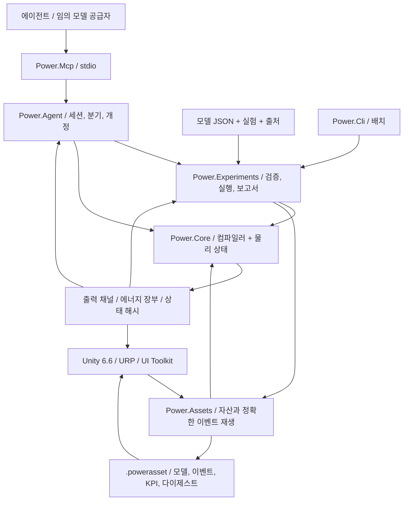

# C# / Unity / 에이전트 아키텍처

[English](ARCHITECTURE.md) · [简体中文](ARCHITECTURE.zh-CN.md) · [Français](ARCHITECTURE.fr.md) · [Русский](ARCHITECTURE.ru.md) · [日本語](ARCHITECTURE.ja.md) · **한국어** · [Deutsch](ARCHITECTURE.de.md) · [Español](ARCHITECTURE.es.md) · [Italiano](ARCHITECTURE.it.md) · [Português](ARCHITECTURE.pt-BR.md)

활성 응용 프로그램은 C#/.NET과 Unity로 남습니다. 보관된 네이티브 프로토타입은 이제 **Zig 0.15.2**를 사용하며, 원래 C 출처는 Git과 소스 해시 매니페스트에 보존됩니다. [네이티브 경계](NATIVE_ZIG.ko.md)는 별도 공유 라이브러리와 기존의 버전이 있는 바이너리 ABI를 정의합니다. 관리형 코어나 Unity 어셈블리에는 네이티브 런타임 의존성이 도입되지 않습니다.


아키텍처 결정은 2026-09-07입니다. 활성 계열은 예전 C 프로토타입에서 관리형 C#로 옮겼습니다. Unity가 3D 스튜디오를 제공합니다. 물리 모델과 에이전트 자동화는 각자 실행됩니다.



## 의존성과 경계

`Power.Core`는 Unity, 네트워크, JSON, MCP, 모델 공급자, 제3자 패키지 의존성이 없습니다. 같은 소스가 `net10.0`과 `netstandard2.1`로 컴파일됩니다. C# 14 레코드, 패턴, 그 나머지는 빌드 시점에 관리형 IL로 낮춰집니다. Unity는 어셈블리만 로드합니다. `IsExternalInit` 호환 정의는 표준 라이브러리 대상에만 해당합니다. Unity 씬은 레코드 타입을 직접 직렬화하지 않습니다.

`Power.Experiments`는 모델 JSON을 명시적 모델 설명으로 바꾸고, 실험 시간과 크기를 제한하고, 배치 크기가 다른 두 번의 리플레이를 실행하고, KPI를 검사하고, 증거를 기록합니다. `Power.Agent`는 전송에 독립적인 작업 공간입니다. `Power.Mcp`는 공식 SDK를 통해 그것을 도구로 노출합니다. 모델 공급자를 바꿔도 에이전트 클라이언트만 바뀝니다.

`Power.Assets`도 `net10.0`과 `netstandard2.1`을 대상으로 하며 코어에만 의존합니다. 불변 모델 설명, 출처 요약, 이벤트, KPI를 저장하고, 크기가 제한된 이진 인코딩과 플레이어를 제공합니다. CLI와 MCP는 검증된 JSON을 `.powerasset`으로 내보냅니다. 가져온 뒤 Unity는 솔버 내부를 직렬화하는 대신 모델을 다시 컴파일하고 지문을 검사합니다. 형식은 [모델 자산](ASSET_FORMAT.ko.md)에 있습니다.

Unity는 Core와 Assets 표준 라이브러리 어셈블리를 직접 참조합니다. 씬 코드는 노드와 채널에서 뷰와 컨트롤을 만들고, 현재 코어가 지원하는 어떤 토폴로지든 보여줄 수 있습니다. 더 이상 고정 샘플을 손으로 구성하지 않습니다. 일반적인 그래프 편집과 저장은 구현되어 있지 않습니다. 실제 가져오기와 Play 수용에는 여전히 Unity 편집기가 필요합니다.

## 모델 컴파일

`ModelDefinition`은 조합 가능한 토폴로지 설명입니다. 노드는 물리 영역, 저장, 초기 상태를 선언합니다. 컴포넌트는 끝점, 매개변수, 입력 채널, 손실이 가는 곳을 선언합니다. 차원을 가진 모든 매개변수는 단위를 가지며, rpm에서 rad/s, 도에서 라디안을 포함해 컴파일 시 SI로 정규화됩니다.

컴파일러는 정의를 복사하고, 안정 ID를 정렬하고, 단위, 유한성, 연결, 입력 소유권, 용량을 검사합니다. 모델은 노드 32개, 컴포넌트 64개, 보고되는 상태 항목 128개로 제한됩니다. 지원되지 않거나 풀 수 없는 정의는 객체/필드 진단을 반환합니다.

`CompiledModel`은 불변 토폴로지, 채널 표, 모델 지문, LU 분해를 저장합니다. 여러 `Simulation` 인스턴스가 하나의 모델을 공유하고, 각각 완전한 상태와 작업 공간을 소유합니다. 컴파일 뒤에 원래 설명 배열을 바꿔도 컴파일된 모델은 바뀌지 않습니다.

## 이상 변속기 기준 경계

`IdealGearPair`와 `SimplePlanetaryGear`는 명시적 SI 속성과 순수한 결과 레코드를 가진, 불변의 일정 부하 기준 원시 요소입니다. 이들은 별도의 결합 기어 제약에 대한 독립 증거를 제공하면서, 순수한 국소 기준 상태를 유지합니다. 유성은 축소된 운동 에너지 질량 행렬을 사용하며, 별도의 가속도 제약 해와 대조됩니다. [기준 계약](IDEAL_GEARS.ko.md)을 참고하세요.

## 영구 기어 제약

[결합 기어 솔버](GEAR_NETWORK.ko.md)는 전기기계 중점과 모든 실린더/컨버터/클러치 힘 응답을 영구적인 이상 기어 및 유성 제약 위로 사영합니다. 정규화된 행과 전체 틱 인자는 불변 컴파일 데이터입니다. 가변 구간 인자와 승수 버퍼는 각 시뮬레이션에 속합니다. 초기 속도는 양립해야 하고, 초기 상대 위상은 보존되며, 종속 제약은 거부됩니다. 포트별 평균 반력은 수용된 내부 구간에 걸쳐 누적되고, 전체 상태와 함께 복사, 해시, 롤백됩니다. 자산 v8은 유계 토폴로지 레코드를 도입했고, 이전의 기어 없는 지문과 리플레이 해시는 변하지 않습니다.

## 결합 컨버터와 실린더 해석

[컨버터 법칙](CONVERTER_NETWORK.ko.md)은 네 개의 불변 부호 맵을 소유하고, 에너지를 생성하는 보간을 거부합니다. 결합 비선형 시스템은 같은 사영된 전기기계 응답을 통해 실린더 크랭크 증분과 컨버터 중점 포트 속도를 풉니다. 클러치 반복과 내부 이벤트 구간은 가변 스텝 응답을 포함해 그 시스템을 재사용합니다. 컨버터가 없는 모델은 이전 솔버 경로와 지문을 유지합니다.

평균 펌프/터빈 토크, 평균 열 동력, 보정된 누적 유체 열은 트랜잭션 시뮬레이션 상태에 속합니다. 스테이터 반력은 그 반대 토크 합이며, 정지한 지면에 있습니다. 열 경로는 실제로 제거된 기계 일을 사용합니다. 맵 정의는 JSON과 유계 자산 v9 레코드를 가로지릅니다. 인자와 런타임 이력은 리플레이로 재구성됩니다. 록업은 별도의 병렬 클러치입니다. 준정상 컴포넌트는 Core에 전송, Unity, JSON, 제3자 의존성을 추가하지 않습니다.

## 유압 네트워크와 압력 구동

[유압 네트워크](HYDRAULIC_NETWORK.ko.md)는 일정한 컴플라이언스와 명시적 선형/정규화된 난류 유동 제한을 통해 게이지 압력을 진행합니다. 보존되는 기준 체적, 이차 탄성 에너지, 저장소 일, 압력 손실 열은 같은 수용된 전달을 사용합니다. 시뮬레이션별 뉴턴 작업 공간은 유계이고 할당이 없습니다.

압력 작동 클러치는 유압 구간 중점, 피스톤 면적, 예압, 마찰, 유효 반경에서 용량을 유도합니다. 모든 시험적 클러치 이벤트 시도는 완전한 유압 상태 사본을 소유합니다. 롤백에는 압력, 평균 유량, 누적 손실, 경계 장부가 포함됩니다. 평균 출력은 완전한 틱에 걸쳐 정규화됩니다. 자산 v10은 명시적 압력 경계와 액추에이터 포트를 보존합니다. 유압이 없는 경로는 이전 지문을 유지합니다. 펌프와 움직이는 피스톤에는 추가적인 보존 컴포넌트가 필요합니다.

## 전기기계 코어

[결합 클러치 솔버](CLUTCH_NETWORK.ko.md)는 전기기계/실린더 중점 시스템에 유계 정지 반력과 운동 마찰을 더합니다. 내부 슬립 영점 이벤트는 완전한 시험적 상태 사본에 대해 구간이 잡힙니다. 구간 인자는 각 시뮬레이션에 속합니다. 마찰 열은 열 노드나 외부 장부로 들어갑니다. 위상, 평균 토크/동력, 보정된 누적 열은 해시, 분기, 배치 전체 롤백에 참여합니다. [독립 법칙과 정확한 쌍](CLUTCH_PHYSICS.ko.md)은 독립적인 일정 부하 기준으로 남습니다. 외부 시간은 유계 정수 틱으로 남습니다.

밀폐 실린더를 포함하는 모델은 기존 전기기계 중점 시스템 주위에 유계 비선형 이산 기울기 해석을 더합니다. 가스 압력 일은 크랭크 운동에 결합되고 에너지 장부에 포함됩니다. 원래 선형 경로는 솔버 버전 2와 그 모델 지문을 유지합니다. 실린더 모델은 솔버 버전 3을 사용합니다. [방정식, 제한, 증거](SEALED_CYLINDER.ko.md)를 참고하세요. 이 첫 실린더 컴포넌트는 크랭크각에서 일정 질량 가스 상태를 유도합니다. 별도의 고정 체적 가스 노드는 이제 [Core 가스 네트워크 솔버](GAS_NETWORK.ko.md)를 통해 독립적인 질량과 내부 에너지를 가집니다. [가동 실린더 결합](MOVING_CYLINDER.ko.md)은 이제 그 상태를 크랭크 압력 일에 연결합니다. 선택적 [크랭크각 타이밍](VALVE_TIMING.ko.md)은 이제 실제 크랭크 위치에서 유동 제한을 제어합니다. [예혼합 연소](PREMIXED_COMBUSTION.ko.md)는 이제 성분과 화학 에너지 수지를 더합니다. 상세 화학과 완전한 엔진 동작은 열려 있습니다.

역학과 모터는 하나의 결합 선형 시스템을 공유하므로, 역기전력, 축 토크, 속도는 서로 무관한 단방향 신호로 다루지 않습니다.

```text
x_mid = (I - h A / 2)^-1 (x_n + h b / 2)
x_next = 2 x_mid - x_n

L di/dt = V - R i - k ω
J dω/dt = k i + τ_external + τ_shaft

twist = θ_a - r θ_b - θ_rest
slip  = ω_a - r ω_b
τ_a   = -K twist - D slip
τ_b   = -r τ_a
```

모터 토크 상수와 역기전력 상수는 같은 SI 결합 계수를 사용합니다. 양수와 음수 변속비는 동력 방향이 일관되도록 조립됩니다. 저항과 감쇠 손실은 중점에서 평가되어, 이름이 있는 열 노드나 외부로 보내집니다.

열 네트워크는 후방 오일러를 사용합니다. `(C + h G) T_next = C T_n + Q_loss + h G_ambient T_ambient`. 내부 열 흐름은 쌍으로 조립됩니다. 외부로 나가는 열은 장부에 들어갑니다. 기계와 모터 선형 동역학에는 2차 수렴 검사가 있습니다. 열 동역학은 1차입니다. 안정하게 남는 큰 스텝이 정확하게 남는 큰 스텝은 아닙니다.

전역 에너지 잔차는 `source_work - heat_rejected - stored_energy_change`입니다. 공급 일은 음수일 수 있으므로, 회생 제동은 누적 공급 일을 줄입니다. 누적 공급 일과 열은 보정 합산을 사용합니다. 장부는 출력과 저장 에너지가 유한한지도 검사합니다.

## 시간, 트랜잭션, 재현성

코어 시간은 나노초 단위의 `ulong`입니다. 컴파일된 스텝은 1 ns와 1 s 사이로 고정됩니다. 모든 호출은 완전한 틱을 덮어야 하며, 최대 백만 틱까지 진행할 수 있습니다.

`SubmitInputs`는 입력 프레임 전체를 검사한 뒤 한 번에 커밋합니다. `Step`은 미리 할당된 후보 상태에서 모든 틱을 진행합니다. 오버플로, 비유한 출력, 잘못된 온도, 취소는 배치 전체를 버립니다. 취소 플래그는 최대 256틱마다 한 번 검사됩니다. 입력, 스텝, 호출자 버퍼 스냅샷의 성공 경로는 관리형 메모리를 할당하지 않습니다.

`Step(delta, scheduledInputs)`는 절대 나노초 시각의 입력 이벤트를 받습니다. 시각은 정렬되어 있고, 틱에 맞으며, 이 호출의 구간 안에 있어야 합니다. 같은 채널을 같은 시각에 두 번 설정할 수 없습니다. 시작 시각의 이벤트는 첫 틱 전에 제출됩니다. 끝 시각의 이벤트는 스냅샷 전에 제출됩니다. 배치가 실패하면 입력도 함께 롤백됩니다. `AssetPlayback`은 성공 후에만 이벤트 커서를 옮기므로, 다른 표현 배치가 실험을 바꾸지 않습니다. 대화형 변경은 재생 상태에서 독립 시뮬레이션으로 분기할 수 있습니다.

`Fork`는 현재의 완전한 상태와 보정항을 복사하므로, 같은 물리 이력에서 다른 입력을 비교할 수 있습니다. 분기는 컴파일된 모델만 공유합니다. 가변 상태는 공유하지 않습니다. 하나의 코어 인스턴스에 대한 동시 접근은 `Busy`를 반환합니다. 스냅샷과 분기는 시그니처가 다르므로 별개의 busy 예외를 던집니다. 다른 인스턴스는 병렬로 실행될 수 있습니다.

지문은 모델 의미론, 정규화된 매개변수, 스텝, 솔버 버전을 덮습니다. 상태 해시는 시간, 상태, 입력, 장부 보정항도 덮습니다. 이것은 리플레이 검사이며 보안 해시가 아닙니다. 같은 바이너리, 런타임, 아키텍처에는 비트 단위 일치가 필요합니다. 다른 CPU, JIT, Mono, IL2CPP는 물리적 허용 오차로 비교되며, 비트 단위 일치를 약속하지 않습니다.

## 에이전트를 위한 코어 계약

- 기능과 제한은 탐색할 수 있습니다. 반환 값은 모델 충실도와 교정 상태를 밝힙니다.
- 입력 오류는 `TryCompile`이나 구조화된 예외로 위치를 지정합니다. 호출자는 콘솔 문장을 파싱하지 않습니다.
- 채널은 안정 ID, 방향, 단위, 물리 이름을 사용합니다. 어댑터는 64비트 ID, 시간, 개정을 십진 문자열로 직렬화합니다.
- 세션 쓰기는 `expected_revision`을 동반합니다. 검사와 상태 변경은 하나의 잠금을 공유합니다. 오래된 호출은 시뮬레이션을 두 번째로 진행하지 않습니다.
- 스냅샷은 필드를 선택할 수 있습니다. 실험은 기본적으로 최종 값과 검증 증거를 반환하므로, 모델 맥락은 작게 유지됩니다.
- 매개변수 분기는 먼저 상태를 복사한 뒤 입력을 따로 제출합니다. 실패와 취소는 분기 기준선을 그대로 둡니다.
- 보고서는 "실행이 끝났음", "KPI가 통과했음", "매개변수가 교정되었음"을 분리합니다. 현재 어떤 모델도 차량에 교정되어 있지 않습니다.

MCP 세션은 로컬 서버 프로세스에 있습니다. 한도는 16입니다. 서버가 종료되면 해제됩니다. JSON 문서는 데이터만 담습니다. 문서 안의 코드나 지시를 실행하지 않습니다. 코어 모델링에는 API 키가 필요하지 않습니다. 물리 틱은 네트워크 요청을 기다리지 않습니다.

## 아직 열려 있는 것

압축성 가스 교환, 규정 예혼합 연소, 클러치, 기어, 맵 기반 컨버터, 유압 구동은 이제 포트, 상태, 보존 검사를 갖춘 컴포넌트로 존재합니다. 이들이 파워트레인을 끝내지는 않습니다. 아직 열려 있는 것: 레일 펌프와 보충, 점화 제어, 상세 흡기 및 배기, 기계 손실, 더 풍부한 열화학, 물림 컴플라이언스, 완전한 AT 압력 및 변속 제어, 조율된 ECU/TCU 동작, 실측 교정. 새 방정식에는 여전히 명시적 모델 버전, 차원, 수치 증거가 필요합니다. 기존 컴포넌트 의미론은 조용히 바꾸어 확장하지 않습니다.

에이전트는 토폴로지와 초기 상태를 생성하고, 매개변수 가설을 제안하고, 컴포넌트 후보를 작성하고, 실험을 구성하고, 증거를 다시 읽을 수 있습니다. 실행 코어가 여전히 수치 제약과 검사를 소유합니다. 언어 모델의 판단은 물리적 사실이 아닙니다. Unity 그래프 편집, 시뮬레이션 워커 스레드, 교체 가능한 고성능 솔버 백엔드는 경계가 안정될 때까지 기다립니다. 여기의 어떤 내용도 일반 비선형 솔버, Burst, GPU 솔버를 주장하지 않습니다.

## 2026-09-22 가스 통합

`ModelDocument`와 `power.model.v1`은 이제 유한 가스 조성과 유동 제한 매개변수를 기존 Core 정의로 매핑합니다. `CompiledModel.ValidateInput`은 정적 채널/유한성/범위 검증을 노출하며, 실험과 자산 일정 검사가 그것을 사용합니다. 상태에 의존하는 관측 가능 검사는 `Simulation`에 남습니다. 솔버 방정식과 지문 구성은 변하지 않습니다.

자산 형식 v3는 유계 이진 표에 가스 노드 조성과 오리피스 레코드를 확장합니다. v1/v2 판독기를 유지하고, 컴파일과 지문 비교 전에 확장 커버리지, 타입, 고유성, 길이를 검사합니다. 가스 벽 컨덕턴스와 저장소 온도는 기존 기본 컴포넌트 필드를 사용합니다. 이렇게 하면 Core와 Assets가 JSON, 전송, Unity 의존성에서 자유롭습니다.

CLI와 MCP는 가스 문서, 자산, 실험 의미론을 공유합니다. 스튜디오는 같은 자산을 읽고 개략 용기/경로를 더합니다. 새 편집기/Play 테스트에는 여전히 실제 편집기 실행이 필요합니다. 남은 작업은 [개발 상태](DEVELOPMENT_STATUS.ko.md)를 참고하세요.

## 가동 실린더 결합

`gas_cylinder`는 가스 노드 하나의 체적을 소유하고 회전 크랭크 하나를 참조합니다. 가스 노드는 독립 저장을 생략하므로, 컴파일은 크랭크 초기 각도에서의 기하에서 초기 체적을 유도합니다. 압력, 온도, 질량, 에너지는 가스 노드에 남습니다. 기하 컴포넌트는 체적, 변위, 크랭크 토크를 노출합니다.

움직이는 챔버가 있는 모델은 지문 태그 5를 더하고, 대칭 반흐름/전체 크랭크/반흐름 적분을 사용합니다. 단열 챔버 에너지 변화와 크랭크 토크는 외부 배압 일을 포함해 같은 이산 기울기를 사용합니다. 벽 결합은 1차로 남습니다. 이전의 고정 체적 전용 솔버 경로와 이전 지문은 그대로입니다. 모든 후보 가스, 크랭크, 장부 상태는 여전히 호출 전체 트랜잭션에 속합니다.

자산 v4는 인덱싱된 가동 기하 레코드를 더하고 이전 판독기를 유지합니다. JSON/MCP 예제와 Unity 가동 피스톤 뷰는 같은 정의를 사용합니다. 실제 편집기 검증은 아직 남아 있습니다. [MOVING_CYLINDER.ko.md](MOVING_CYLINDER.ko.md)를 참고하세요.

## 크랭크각 유동 제한 프로파일

가스 오리피스의 선택적 불변 `ValveTimingDefinition`은 회전 노드와 명시적 사이클, 개방, 지속 각도를 참조합니다. `CrankValveProfile`은 위상을 정규화하고 연속 sin 제곱 포락선을 평가합니다. 오리피스 입력은 피크 개방이 됩니다. 가스 솔버와 관측 가능한 질량 흐름은 같은 유효 분율을 공유합니다. 별도의 가변 캠 상태는 없습니다. 타이밍 모델은 지문 태그 6을 더하고, 가스 체적이 고정이어도 대칭 가스/크랭크 분할을 사용합니다. 타이밍이 없는 모델은 이전 경로와 지문을 유지합니다.

로브별 각도/속도와 정밀도 가드는 기존 후보 상태 트랜잭션 안에서 분해능이 부족한 틱을 거부합니다. JSON, 자산 v10, MCP는 같은 계약을 노출하고, 스튜디오는 개략 표식을 위해 유효 개방 채널을 읽습니다. 실제 Unity 실행은 별도로 아직 남아 있습니다. [VALVE_TIMING.ko.md](VALVE_TIMING.ko.md)를 참고하세요.

## 예혼합 반응과 성분 수송

선택적 `GasDefinition.Premixed`는 명시적 발열량, 이론비, 초기 연료/신선 공기 분율을 제공합니다. `GasNetwork`는 양립하는 연결된 혼합물과 명시적 저장소 분율을 컴파일합니다. 가스 솔버는 상류 흐름과 함께 세 개의 비음수 성분 질량을 수송하고, 총 질량을 재구성하며, 모델 경계에서 화학 엔탈피를 계산합니다. 예혼합 수송은 기존 순 질량/에너지 한계에 더해 유출 흐름 한계를 포함합니다.

`PremixedCombustion`은 가스 노드와 그 크랭크를 참조합니다. `CombustionSolver`는 크랭크 반복 동안 전방 Wiebe 노출과 제한 반응물에서 열을 미리 봅니다. 압력 토크는 단열 일 전에 미리 본 열의 절반을 사용합니다. 나머지 절반은 일 스텝을 따릅니다. 수용된 연료/공기 소비, 생성물 형성, 화학 장부, 비가역 각도 프런티어는 보통 후보 트랜잭션 안의 `MixtureState`에 있습니다. 분기 때 복사되고 해시에 포함됩니다. 작업 공간의 미리 보기는 실패한 호출의 커밋된 상태로 남지 않습니다.

예혼합 모델은 지문 태그 7을 더합니다. 자산 v10은 혼합물, 저장소, 연소 확장을 유지합니다. 이전의 비반응 의미론은 변하지 않습니다. JSON/CLI/MCP는 연료와 열 증거를 노출하고, 스튜디오는 개략 표식에 같은 열 방출 채널을 사용합니다. 실제 편집기 실행은 아직 남아 있습니다. 전체 수치·물리 범위는 [PREMIXED_COMBUSTION.ko.md](PREMIXED_COMBUSTION.ko.md)에 문서화되어 있습니다.

## 축 구동 유압 결합

펌프가 있는 모델은 결합 비선형 시스템에 펌프 축 속도와 모든 유압 중점 압력을 확장합니다. 압력 반력은 실린더 및 컨버터 토크와 같은 기어 사영 힘 응답에 들어갑니다. 펌프 유량은 쌍을 이룬 컴플라이언스 노드 수지에 들어갑니다. 압력 의존 클러치 용량은 제약 반복 안에서 갱신됩니다. 수용된 전달은 체적, 경계 일, 축에서 유체로의 일, 릴리프 열을 커밋합니다. 모든 작업 공간은 시뮬레이션이 소유하며, 스텝은 관리형 메모리를 할당하지 않습니다.

펌프가 없는 모델은 앞선 유압 솔버 경로와 리플레이 해시를 유지합니다. 이상 배제 체적과 유한 컨덕턴스 릴리프 한계, 타입이 있는 포트, 관측 가능량, 독립 증거는 [HYDRAULIC_PUMP.ko.md](HYDRAULIC_PUMP.ko.md)에 명시됩니다. Core와 Assets는 의존성 없는 이중 대상 어셈블리로 남습니다. 실제 Unity 증거는 별개입니다.

## 모델 트랜잭션 안의 샘플링 제어

`PressureControllerDefinition`은 유압 센서, 소유한 직류 모터 전압 채널, 명시적 게인/한계, 초기 적분, 틱에 정렬된 정수 샘플링 주기를 선언합니다. 컴파일은 모터 입력당 제어기 소유자 하나를 묶고, 그 입력을 외부 쓰기 표에서 제거합니다. 제어기의 압력 설정값은 단위와 안정 ID와 함께 탐색 가능한 상태로 남습니다. 제어기가 없는 모델은 이전 지문을 유지합니다.

각 완전한 틱의 시작에서, 그 시각의 예약 입력 뒤에, 후보 상태는 현재 유압 압력에서 도래한 제어기를 샘플링합니다. 적분, 샘플링된 압력/오차, 유지 전압을 갱신한 뒤 물리 해석을 수행합니다. 내부 클러치 시도 구간은 이 상태를 복사하고 다시 샘플링하지 않습니다. 물리 모터는 여전히 모든 전기 일과 열을 계산합니다. 제어기에는 지어낸 에너지 저장이 없습니다.

제어기 기억과 소유한 모터 입력은 분기가 복사하고, 해시되며, 배치 전체와 함께만 커밋됩니다. 취소나 이후의 수치 실패는 물리 상태와 입력과 함께 제어 이력을 롤백합니다. 샘플링은 관리형 메모리를 할당하지 않습니다. JSON, 자산 v12, CLI, MCP는 이 모델 의미론을 공유하며, 실제 편집기 실행은 별도로 아직 남아 있습니다. [완전한 계약](HYDRAULIC_PUMP.ko.md#sampled-pressure-regulation)을 참고하세요.

## 결합 전기 공급

배터리 노드는 회전 좌표와 RL 모터 전류와 같은 동적 상태 벡터에 SOC와 분극 전압을 더합니다. 화학 에너지는 충전량에 대한 명시적 아핀 OCV 곡선의 적분입니다. RC 가지는 이차 에너지를 저장합니다. 이 방정식에는 모델 공급자, 전송, Unity, 제3자 의존성이 들어가지 않습니다.

유지된 듀티와 저항 부하 개방은 전기 행렬과 아핀 강제항을 바꿉니다. `ElectricalDynamics`는 시뮬레이션마다 자신의 변화율, LU 인자, 입력 캐시를 소유합니다. 기어, 실린더, 컨버터, 클러치 응답은 내부 가변 지속 포획 시도를 포함해 준비된 인자를 사용합니다. 실패한 준비는 캐시를 무효화합니다. 후보 물리/제어 상태는 여전히 배치 전체와 함께만 커밋됩니다. 캐시는 작업 공간이지, 공유 모델 상태나 지속되는 시뮬레이션 이력이 아닙니다.

배터리 모터 일은 내부에서 전달됩니다. 배터리, 유도, 기계, 유압 에너지 변화는 명시적 열과 외부 이상 공급/부하 일과 균형을 이룹니다. 충전량과 분극은 보통 상태 벡터에 있으므로, 분기, 해시, 롤백이 자동으로 포함합니다. 듀티 제어는 무차원 출력과, 전압 제어와 같은 샘플링/와인드업 방지 계약을 사용합니다. 자산 v14와 JSON/MCP는 완전한 공급 정의를 유지합니다. [공급 계약](HYDRAULIC_PUMP.ko.md#finite-battery-supply-and-duty-regulation)이 범위, 한계, 독립 증거를 기록합니다.

## 병진 유압 구동

`translational` 노드는 양의 집중 질량과 함께 변위와 속도 상태를 더합니다. 유압 피스톤은 기존 결합 기계/압력 솔버에 좌표 미지수를 더합니다. 쓸린 전면/후면 체적은 컴플라이언스에 결합됩니다. 저장소 압력 일은 명시적 외부 경계로 남습니다. 선형 스프링은 병진 단위로 같은 중점 행렬을 사용합니다. 패드와 행정 정지 힘은 이산 퍼텐셜 기울기와 해석적 야코비안을 사용해, 힌지 활성화와 해제에 걸쳐 압력/접촉 일을 보존합니다.

접촉 클러치는 해석 동안 패드의 이산 힘에서 용량을 유도한 뒤, 스냅샷에서 순간 힘/용량을 노출합니다. 각 시뮬레이션은 간결한 보정 스프링-감쇠 이력을 소유하며, 모든 후보 상태와 함께 복사되고 해시됩니다. 성공적인 정상 스텝이나 스냅샷 읽기 동안 작업 공간 할당은 없습니다. 자산 v14와 JSON/MCP는 운동과 접촉 토폴로지를 유지합니다. 방정식, 한계, 증거는 [HYDRAULIC_PISTON.ko.md](HYDRAULIC_PISTON.ko.md)를 참고하세요.

## 기계적으로 계량되는 흐름

스풀 밸브 랜드는 기존 피스톤 좌표에 묶입니다. 유압 잔차는 그 중점 위치를 읽고, 압력과 피스톤 이동에 대한 해석적 유량 도함수를 포함합니다. 따라서 압력 피드백, 운동, 계량은 뉴턴 행렬과 시험적 클러치 구간을 공유합니다. 수동 포트 열과 쓸린 체적은 기존 유압 이력을 통해 커밋됩니다. 위치 기울기는 유계이고 시뮬레이션이 소유한 버퍼를 사용합니다. 성공적인 스텝은 관리형 할당을 더하지 않습니다. 자산 v15, JSON, 실제 MCP 리플레이는 기하를 유지합니다. 선언된 압력 균형 랜드는 축 방향 제트력을 무시합니다. [HYDRAULIC_SPOOL.ko.md](HYDRAULIC_SPOOL.ko.md)를 참고하세요.

## 선형 가스/유체 에너지 결합

가스 피스톤은 유한 가스 네트워크에 선형 기하 소유자를 더합니다. 초기 질량/에너지는 실제 초기 기하를 사용합니다. 흐름과 벽 열은 현재 체적을 읽습니다. 결합 기계 솔버는 고유한 병진 좌표를 모으므로, 마주 보는 가스 챔버와 유압 분리기가 하나의 질량을 공유합니다. 가스 힘은 단열 이산 압력 일, 해석적 도함수, 안정적인 작은 이동 급수를 사용합니다. 절대 기준 압력 일은 외부입니다. 가스 내부 에너지는 보통 트랜잭션 상태로 남습니다. 맞춘 압력 곡선이 그 상태를 대체하지 않습니다.

수송이나 열이 없는 닫힌 비혼합 챔버는 상태 검증 뒤 변화율이 0인 적분을 건너뜁니다. 측정된 전/후 리플레이는 모든 값/해시를 보존합니다. 한계, 롤백/분기, 할당 없는 스텝은 결합된 가스/유체 이력에 적용됩니다. 자산 v16과 JSON/MCP는 기하와 방향을 유지합니다. 열역학, 범위, 증거는 [GAS_PISTON.ko.md](GAS_PISTON.ko.md)를 참고하세요.

## 사이클 연료 계량

유한하게 추적되는 가스 레일과 수신기는 기존 보존적 오리피스 전달을 사용합니다. 사이클별 제어기는 전방 크랭크 창에서 요청된 연료 질량을 래치합니다. 연료 유량 상한은 같은 질량, 성분, 엔탈피 유속을 스케일합니다. 수용된 Heun 전달은 완전한 할당량/공급 이력을 갱신합니다. 화학 에너지는 내부로 이동하며 반응 열 및 외부 경계와 분리된 상태로 남습니다. 역전은 관측된 할당량을 재설정하지 않습니다. 이력은 시험적 클러치 구간, 취소, 분기를 포함해 각 시뮬레이션에 속합니다. 타이밍 이동과 상태 개수는 유계로 남습니다. 워밍된 스텝은 관리형 메모리를 할당하지 않습니다. 자산 v17과 JSON/MCP는 노즐, 타이밍, 도즈를 유지합니다. [FUEL_METERING.ko.md](FUEL_METERING.ko.md)를 참고하세요.

## 유한 액체 상과 증기 가용성

필름은 추적되는 가스 수신기 옆에 명시적 액체 질량과 열/화학 재고를 더합니다. 해석적 유한 욕 법칙은 가열, 규정 포화, 건조를 풀며, 수신기 증기 열용량에 맞춘 내부 에너지 상 오프셋을 사용합니다. 증기는 보통 가스와 연료 상태로 들어갑니다. 액체는 반응 재고 밖에 남습니다. 유한한 벽이 모든 상 전달을 부담합니다.

필름/가스/기계/가스/필름 반스텝은 두 번째 스윕에서 필름 순서를 뒤집어, 벽을 공유하는 필름 전달이 대칭 분할을 갖도록 합니다. 다른 벽 열원은 명시적 바깥 구간 벽 온도와 그 1차 정확도 한계를 유지합니다. 독립적인 동시 ODE 세분화 검사가 이 경우를 구분합니다. 상 재고, 보정된 열/공급 이력, 평균 흐름은 시험적 클러치 구간을 포함해 완전한 시뮬레이션 상태와 함께 복사/해시/롤백됩니다. 자산 v18과 JSON/MCP는 모든 상 수량을 유지합니다. [FUEL_FILM.ko.md](FUEL_FILM.ko.md)를 참고하세요.

## 유한 컴플라이언트 액체 연료 공급

액체 인젝터는 유한 공급 재고와 레일 압력 에너지를 소유합니다. 압력은 제공된 컴플라이언스를 통해 보정된 토출 체적에서 유도됩니다. 일방향 노즐은 고정 수신기 압력 수두 감쇠를 해석적으로 적분합니다. 공유 전방 사이클 할당량은 공급을 제한하고 역전/명령 의미론을 보존합니다. 액체 열량과 화학 에너지는 증발을 우회하지 않고 필름으로 이동합니다. 레일 압력 일은 유한 벽 노즐 열과, 무시할 수 있는 액체 체적 축소 아래의 명시적으로 내보내진 수신기 변위 일 경계로 나뉩니다. 그 내보내진 일만 전역 외부 일에 들어갑니다. 저장된 레일 에너지는 두 번 세지 않습니다.

분사는 기존 필름/가스/기계 분할을, 두 번째 절반의 순서를 뒤집어 감쌉니다. 공급/필름 재고와 모든 할당량, 압력/열, 보정 이력은 시험적 클러치 구간, 완전한 롤백, 취소, 독립 분기를 견딥니다. 독립적인 동시 ODE 세분화와 활성 할당 검사가 공유 경로를 검증합니다. 자산 v19, JSON, 실제 MCP는 공급/노즐/타이밍 정의를 유지합니다. [LIQUID_FUEL_INJECTION.ko.md](LIQUID_FUEL_INJECTION.ko.md)를 참고하세요.

## 상반 솔레노이드와 물리적 니들

자속 쇄교와 선형 위치 의존 인덕턴스는 결합 기계 해석에 자기 저장 에너지와 상반력을 더합니다. 해석적 전기 소거와 위치 도함수는 대칭 이산 에너지 항등식을 보존합니다. 수용된 운동은 자속, 구리 열, 전기 일을 한 번 커밋합니다. 탄성 이동 정지는 상태를 클램핑하지 않고 보존적 힌지 기울기를 재사용합니다. 좌표는 적절한 경우 기존 유압/가스 피스톤 좌표와 병합됩니다.

실제 니들 양정은 원하는 도즈/창 차단과 독립적으로 액체 흐름을 계량합니다. 샘플링 드라이버는 코일 전압을 소유하고, 래치된 사이클 목표와 측정된 공급을 사용하며, 닫힘과 시트 반발 꼬리를 유지합니다. 완전한 상태에는 분기, 취소, 시험적 클러치 포획, 늦은 실패를 관통하는 자기, 샘플링/유지 제어기, 공급/상, 모든 보정 이력이 포함됩니다. 자산 v20과 JSON/MCP는 정의를 유지합니다. 범위, 상반성, 증거는 [NEEDLE_ACTUATION.ko.md](NEEDLE_ACTUATION.ko.md)에 있습니다.

## 유계 폐쇄 리플레이와 예정된 차단

예측이 켜진 드라이버는 완전한 상태를 미리 할당된 리플레이 상태 하나에 복사하고, 다른 액추에이터 명령을 유지한 채 영전압 또는 지연 차단의 플랜트 미래를 리플레이합니다. 보통 물리 방정식과 수용된 하이브리드 구간이 추가 공급을 결정합니다. 예측은 커밋되지 않으며 샘플링 제어기를 재귀적으로 실행하지 않습니다. 실제 구간은 각 예측 뒤에 솔버 작업 공간을 준비합니다.

유계 정수 후보 탐색은 다음 샘플 주기 안에서 차단을 계획합니다. 사이클별 래치와 물리 틱 카운트다운은 아주 작은 예측 차이로 반복 재개방되는 것을 막습니다. 예측 질량/개수, 래치/사이클, 카운트다운은 완전한 상태 복사/해시/롤백에 참여합니다. 지평 정렬, 시계 범위, 유한 틱 예산, 후보 단조성이 검사됩니다. 자산 v21은 선택적 지평을 유지합니다. 예측을 끈 모델은 이전 모델/상태 해시를 보존합니다. [CLOSURE_PREDICTION.ko.md](CLOSURE_PREDICTION.ko.md)를 참고하세요.

## 듀얼 클러치 그래프 구성

불변 DCT 조립은 일곱 전진/후진 경로를, 호출자가 소유한 안정 ID를 가진 기존 로터, 기어, 클러치 레코드로 내립니다. 자유 허브, 두 입력 축, 후진 아이들러, 세 출력/종감속 분기는 명시적 관성을 유지합니다. 셀렉터는 동기화 충격량/열을 전달하고, 구동 클러치는 실제 동력을 전달합니다. 기어 번호가 영구 토폴로지를 대체하지는 않습니다.

큰 선형 그래프는 6/7단 인계에서 느린 상관 잠금 사영을 드러냈습니다. 기본 유계 사영은 유지됩니다. 반복이 소진되면, 독립 선형 잠금은 같은 정적 한계, 모드 해제, 잔차, 수동 열 검사와 함께 정규화되고 미리 할당된 Schur 분해를 사용합니다. 특이하거나 비선형인 경우는 기존 거동을 유지합니다. 보통 JSON/자산/MCP 경로와 원래 지문은 변하지 않습니다. 참고와 범위는 [DUAL_CLUTCH_TRANSMISSION.ko.md](DUAL_CLUTCH_TRANSMISSION.ko.md)에 있습니다.

## 샘플링 DCT 상태와 제어되는 기구학

제어기는 열 개의 구동/셀렉터 명령을 모두 소유하고, 실제 홀수/짝수/아이들러/종감속 토폴로지를 검증합니다. 정수 요청은 유계 시계에서 샘플링됩니다. 물리적 슬립과 잠금이 사전 선택과 단계적 배타 인계를 게이트합니다. 중립, 방향 차단, 시간 초과, 지속적인 잠금 상실, 새 요청 회복은 별도의 상태/결함 출력을 유지합니다. 유지 명령, 선택, 위상, 감시 시계는 완전한 물리 이력과 함께 복사/해시/롤백됩니다.

제어되는 모델은 보정된 반올림과 함께 중점 속도에서 좌표를 누적합니다. 엄격한 기어 위상 한계는 변하지 않습니다. 보정은 트랜잭션이며 해시됩니다. 앞선 모델은 이전 적분/리플레이를 유지합니다. 보고되는 상태 한계는 128로 늘어나고, 노드/컴포넌트 한계는 32/64로 남으며, 정확한 경계와 오버플로 테스트가 있습니다. 이것은 더 이른 한계에 맞추려고 엔진 상태를 버리는 대신, 완전한 연구용 점화/DCT/제어 구성을 지원합니다. 자산 v22와 JSON/MCP는 모든 경로/타이밍/허용 오차 정의를 유지합니다. [DCT_CONTROL.ko.md](DCT_CONTROL.ko.md)를 참고하세요.

## 복합 유성 연구 조립

[Ravigneaux 조립](RAVIGNEAUX_TRANSMISSION.ko.md)은 링/캐리어를 공유하는 단일 피니언 대선과 이중 피니언 소선 제약을 결합합니다. 정규화된 행은 합산된 반력 동력을 보존합니다. 사영된 응답은 보통 기계/컨버터/클러치 해석에 들어갑니다. 복합 그래프는 부하 아래의 장기 위상을 보존하기 위해 트랜잭션 보정과 함께 좌표를 누적합니다. 기존 그래프 전용 모델은 이전 적분/해시 경로를 유지합니다. 네 부재 관성은 명시적 연구 값입니다. 내부 유성 자전은 미분해로 남습니다. 다섯 마찰 연결은 규정 속도 공급원을 더하지 않고 네 전진 레인지 또는 후진을 선택합니다.

조립은 안정 포트와 명령 ID를 가진 불변의 보통 정의를 반환합니다. 캐리어 포획은 실제 마찰 열을 생성합니다. 모든 반력과 열 이력은 기존 상태 복사/해시/롤백 계약에 참여합니다. JSON과 자산 v23은 이중 피니언 토폴로지를 유지합니다. 이전의 컴포넌트 없는 지문과 진본 v22 리플레이는 변하지 않습니다. 이것은 완전한 AT 제어나 실측 목표 파워트레인 거동을 확립하지 않습니다.

## 분해된 내부 유성 운동

[분해된 Ravigneaux 그래프](RESOLVED_PLANETS.ko.md)는 여섯 내부 로터 사이의 네 캐리어 상대 물림 행을 사용합니다. 절대 유성 자전은 대각 로터 운동 에너지 저장을 유지합니다. 선언된 유성별 질량은 캐리어에 정확한 궤도 관성을 더합니다. 독립적인 축소 질량 행렬, 각운동량, 포획 열, 모든 리플레이 경계가 보통 결합 그래프를 검사합니다. 규정 속도 신호나 별도로 추적되지 않는 에너지 저장을 더하지 않습니다.

캐리어 물림은 유한하고 0이 아닌 부호 있는 상대 변속비와 명시적 움직이는 캐리어 반력을 지원합니다. 그 정규화 Schur 사영은 작은 클러치/실린더/컨버터 힘 응답을 포함해 최대 세 번의 상대 잔차 세분화를 수행합니다. 자유 중점 목표는 다음 끝점 속도 잔차를 0으로 강제해, 앞선 반올림이 같은 힘 응답을 통해 반복 반사되는 것을 피합니다. 보정 승수는 실제 반력에 누적됩니다. 컴파일된 인자는 불변으로 남습니다. 시뮬레이션이 소유한 스크래치와 생성자 지역 버퍼가 분기를 독립적으로 유지합니다. 기존 그래프는 이전 사영 경로를 유지합니다. 새 원시 요소는 지문 태그 28과 자산 v24 토폴로지 지원을 더합니다.

## 공유 유압 구동 조립

[AT 구동 조립](AT_HYDRAULIC_ACTUATION.ko.md)은 선언된 클러치 대상 1..6을 실제 피스톤/접촉 클러치, 충전/배출 유동 제한, 복귀 스프링으로 내립니다. 공유 가역 펌프, 누출/항력, 릴리프가 공급합니다. 명시적 전면/후면 면적은 쓸린 재고와 기준 압력 일을 유지합니다. 불변의 보통 정의는 기존 결합 압력/운동/마찰 해석, 이식 가능한 v24 의미론, 완전한 원자적 상태를 보존합니다. 규정 밸브 일정은 AT 피드백/제어 및 실측 밸브 바디 수용과 분리된 상태로 남습니다.

## 유압 AT 피드백

`at_controller`는 [-1,4] 범위의 정수 목표 단을 받으며 0은 중립입니다. 다섯 쌍의 충전/배출 밸브와 선택적인 토크 컨버터 록업을 관리합니다. 경로 순서는 캐리어 입력, 작은 선기어 입력, 큰 선기어 입력, 캐리어 브레이크, 큰 선기어 브레이크, 마지막으로 록업입니다.

예제 `controlled-hydraulic-ravigneaux`와 `controlled-fired-hydraulic-ravigneaux`는 요청 채널 900과 컨트롤러 ID 1400을 사용합니다. 변경되지 않은 128 상태 한도 안에서 99와 122개의 보고 상태를 보존합니다. v28는 경로, 게인과 클록을 저장하고 v1-v27를 읽습니다.

연구용 제어이며 매개변수는 `unverified`입니다. ECU 토크 협조, 상세 센서/밸브, 전체 차량 고장과 OEM 보정은 아직 미완성입니다. managed 및 Standard 검사는 실제 Unity Editor/Play/Player/IL2CPP 검증을 입증하지 않습니다.

[AT_CONTROL.ko.md](AT_CONTROL.ko.md)

## 펌프 공급 액체 연료 레일

`liquid_rail_feed`는 액체 인젝터를 기존 용적 펌프와 명시적인 물질/열 경계에 연결합니다. 유압 출구 노드는 레일 컴플라이언스와 초기 절대압에 일치해야 합니다. 펌프와 인젝터가 이 압력 노드를 소유하고 다른 미추적 유체 경로는 거부됩니다.

v28은 공급 연결과 원천 온도를 저장하고 v1-v27를 읽습니다. 축/압력 해석 교환, 독립 동시 ODE 세분화, 열 혼합, 질량/연료/에너지/체적 원장, 역류와 완전 rollback을 각각 확인합니다.

기하학적 용량, 통기/기체 공간/슬로싱, 캐비테이션, 실측 충액/효율/조압과 분해 분무는 미완성입니다. 매개변수는 `unverified`이며 실제 Unity Editor/Play/Player/IL2CPP와 OEM 보정은 미검증입니다.

[PUMP_FED_FUEL.ko.md](PUMP_FED_FUEL.ko.md)

## 유한 액체 연료 탱크

`liquid_fuel_tank`는 연결 인젝터의 밀도, 필름 열 기준과 발열량으로 유한 액체 질량과 열 에너지를 저장합니다. 공급은 `tank_component`로 선택하고 `supply_temperature`를 생략합니다. 각 탱크는 연료 물성이 같은 한 공급에 속합니다.

탱크 열/화학 에너지는 전체 저장 원장에 포함됩니다. 내부 전달은 외부 질량이나 화학 공급을 추가하지 않습니다. 명시적 펌프 입구 지정 압력은 압력 일 경계를 유지합니다. 가스 흡배기는 화학 경계 에너지를 운반할 수 있습니다.

기하학적 용량, 통기/기체 공간/슬로싱, 캐비테이션, 실측 충액/효율/조압과 분해 분무는 미완성입니다. 매개변수는 `unverified`이며 실제 Unity Editor/Play/Player/IL2CPP와 OEM 보정은 미검증입니다.

[LIQUID_FUEL_TANK.ko.md](LIQUID_FUEL_TANK.ko.md)

## 추적 가능한 연료 릴리프 반환

`liquid_rail_return`는 공급을 독점 단방향 `hydraulic_relief`에 연결합니다. 밸브는 레일을 펌프와 같은 지정 입구 압력에 연결합니다. 모든 유체 경로를 등록하며 비호환 포트, 중복 소유와 미추적 경로는 거부됩니다.

`fluid_heat_fraction`는 반환 연료가 운반하는 밸브 손실 비율 [0,1]을 명시합니다. 나머지 열은 선언된 밸브 열 경로를 따릅니다. 레일/탱크 동시 열 혼합은 질량, 화학, 압력 일과 열 원장을 보존하며 외부 원천 반환은 경계를 통해 질량/에너지를 내보냅니다.

[LIQUID_FUEL_RETURN.ko.md](LIQUID_FUEL_RETURN.ko.md)
