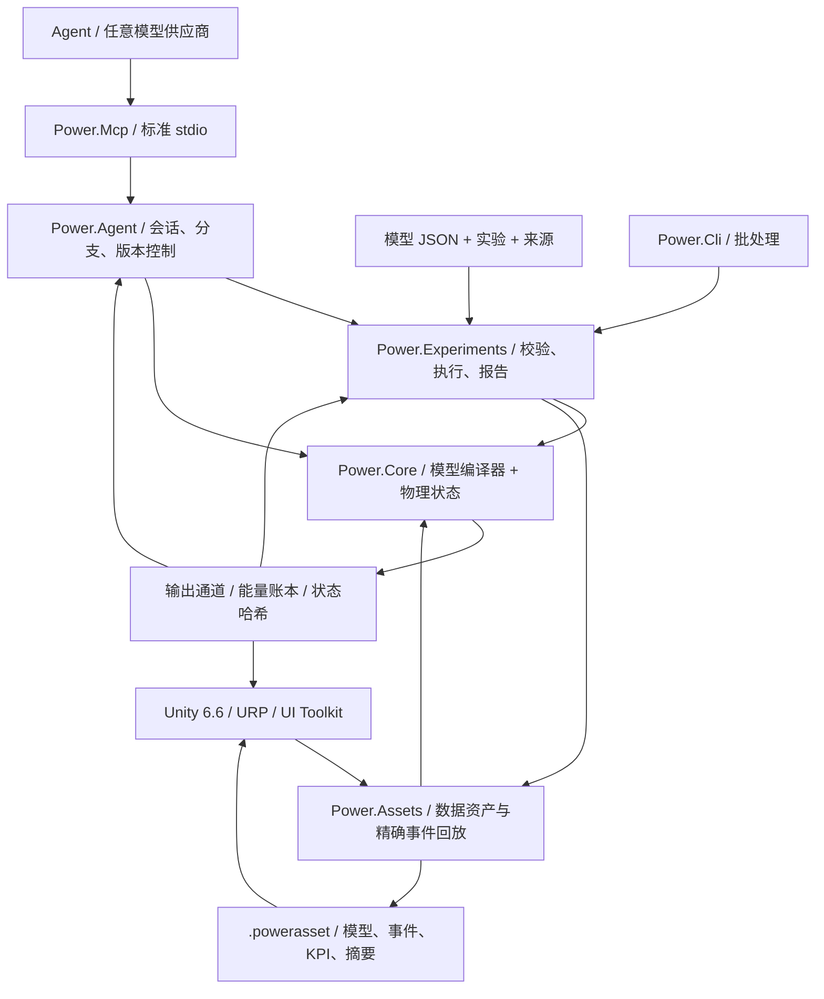

# C# / Unity / Agent 架构

The active application remains C#/.NET with Unity. The archived native prototypes now use **Zig 0.15.2**, with original C provenance preserved in Git and a source-hash manifest. The [native boundary](NATIVE_ZIG.md) defines a separate shared library and the existing versioned binary ABI. No native runtime dependency is introduced into the managed core or Unity assemblies.


架构决策日期：2026-09-07。主线从旧 C 原型迁至托管 C#；Unity 提供三维工作室，物理模型与 Agent 自动化可以独立运行。



## 依赖与边界

`Power.Core` 无 Unity、网络、JSON、MCP、模型供应商或第三方包依赖。相同源码编译为 `net10.0` 与 `netstandard2.1`。C# 14 的记录类型、模式等在构建期降低为托管 IL；Unity 只加载程序集。`IsExternalInit` 兼容定义只用于标准库目标，Unity 场景不直接序列化记录类型。

`Power.Experiments` 负责把模型 JSON 转为明确的建模描述、约束实验时间与规模、运行两个批大小不同的回放、检查 KPI 并生成证据。`Power.Agent` 是与传输无关的工作区，`Power.Mcp` 通过官方 SDK 把它暴露为工具。模型供应商更换只影响 Agent 客户端。

`Power.Assets` 同样以 `net10.0` 和 `netstandard2.1` 为目标，仅依赖核心。它保存不可变的模型描述、来源摘要、事件和 KPI，并提供有大小上限的二进制编码与回放器。CLI 和 MCP 把已校验 JSON 导出为 `.powerasset`；Unity 导入后重新编译模型并核对指纹，避免直接序列化求解器内部状态。格式见 [模型资产](ASSET_FORMAT.md)。

Unity 直接引用 Core、Assets 的标准库程序集。场景代码按节点和通道生成显示与控件，支持任意受当前核心支持的拓扑，不再直接创建固定样例。通用图编辑和保存交互修改尚未实现；实际导入与 Play 验收仍需 Unity Editor。

## 模型编译

`ModelDefinition` 是可组合的拓扑描述。节点声明物理域、储能容量和初态；组件声明端点、参数、输入通道和损耗去向。每项有量纲的参数携带单位，编译时归一为 SI，支持 rpm/rad·s⁻¹ 与 degree/radian 转换。

编译器复制描述，按稳定 ID 排序，检查全局 ID、域、单位、有限值、正值、连接、输入冲突和容量。模型最多 32 个节点、64 个组件、64 个动态/热状态；不满足这些条件或离散系统不可求解时返回定位到对象与字段的诊断。

`CompiledModel` 保存不变的拓扑、通道表、模型指纹与 LU 分解。多个 `Simulation` 共享模型，各自拥有完整状态及工作区。调用者在编译之后修改原始描述数组不会改变已编译模型。

## Ideal transmission reference boundary

`IdealGearPair` and `SimplePlanetaryGear` are immutable constant-load reference primitives
with explicit SI properties and pure result records. They provide independent evidence
for the separate coupled gear constraints, while retaining pure local reference state. The planetary uses a reduced kinetic-energy mass
matrix and is checked against a separate acceleration-constraint solution. See
[the reference contract](IDEAL_GEARS.md).

## Permanent gear constraints

The [coupled gear solver](GEAR_NETWORK.md) projects the electromechanical midpoint and
all cylinder/converter/clutch force responses onto permanent ideal gear and planetary constraints.
Normalized rows and full-tick factors are immutable compiled data; variable-interval
factors and multiplier buffers belong to each simulation. Initial speeds must be
compatible, initial relative phase is preserved, and dependent constraints are rejected.
Per-port mean reactions are accumulated across accepted internal intervals and copied,
hashed and rolled back with the full state. Asset v8 introduced bounded topology records while
prior gear-free fingerprints and replay hashes remain unchanged.

## Joint converter and cylinder solve

The [converter law](CONVERTER_NETWORK.md) owns four immutable signed maps and rejects
energy-creating interpolation. A joint nonlinear system solves cylinder crank increments
and converter midpoint port speeds through the same projected electromechanical response.
Clutch iterations and internal event intervals reuse that system, including variable-step
responses. Converter-free models retain their previous solver path and fingerprints.

Mean pump/turbine torques, mean heat power and compensated cumulative fluid heat belong
to transactional simulation state. Stator reaction is their opposite torque sum, at
stationary ground. Thermal routing uses actual removed mechanical work. Map definitions
cross JSON and bounded asset v9 records; factors and runtime histories are reconstructed
by replay. Lockup is a separate parallel clutch. The quasi-steady component adds no Core
transport, Unity, JSON or third-party dependency.

## Hydraulic network and pressure actuation

The [hydraulic network](HYDRAULIC_NETWORK.md) advances gauge pressure through constant
compliance and explicit linear/regularized-turbulent restrictions. Conserved reference
volume, quadratic elastic energy, reservoir work and pressure-loss heat use the same
accepted transfers. The per-simulation Newton workspace is bounded and allocation-free.

Pressure-operated clutches derive capacity from the hydraulic interval midpoint, piston
area, preload, friction and effective radius. Every speculative clutch event trial owns
a full hydraulic state copy; rollback includes pressure, mean flows, cumulative loss and
boundary ledgers. Mean outputs are normalized over the complete tick. Asset v10 preserves
the explicit pressure boundaries and actuator ports; hydraulic-free paths retain their
previous fingerprints. Pumps and moving pistons require further conserving components.

## 当前求解器

The [coupled clutch solver](CLUTCH_NETWORK.md) adds bounded static reactions and kinetic
friction to the electromechanical/cylinder midpoint system. Internal slip-zero events
are bracketed against complete speculative state copies; interval factors belong to
each simulation. Friction heat enters thermal nodes or the external ledger. Phase,
mean torque/power and compensated cumulative heat participate in hashes, forks and
whole-batch rollback. The [standalone law and exact pair](CLUTCH_PHYSICS.md) remain
independent constant-load references. External time stays in bounded integer ticks.

Models containing sealed cylinders add a bounded nonlinear discrete-gradient solve around the existing electromechanical midpoint system. Gas pressure work is coupled to crank motion and included in the energy ledger. The original linear path retains solver version 2 and its model fingerprints; cylinder models use solver version 3. See [the equations, limits and evidence](SEALED_CYLINDER.md). This first cylinder component derives constant-mass gas state from crank angle. Separate fixed-volume gas nodes now carry independent mass and internal energy through the [Core gas-network solver](GAS_NETWORK.md); the [moving-cylinder coupling](MOVING_CYLINDER.md) now connects those states to crank pressure work. Optional [crank-angle timing](VALVE_TIMING.md) now controls restrictions from actual crank position; [premixed combustion](PREMIXED_COMBUSTION.md) now adds constituent and chemical-energy accounting. Detailed chemistry and complete engine behavior remain open.

机械与电机使用一个耦合线性系统，避免把反电动势、轴扭矩和转速当作互不相关的单向信号：

```text
x_mid = (I - h A / 2)^-1 (x_n + h b / 2)
x_next = 2 x_mid - x_n

L di/dt = V - R i - k ω
J dω/dt = k i + τ_external + τ_shaft

twist = θ_a - r θ_b - θ_rest
slip  = ω_a - r ω_b
τ_a   = -K twist - D slip
τ_b   = -r τ_a
```

电机的力矩常数与反电动势常数使用同一个 SI 耦合系数。正负传动比都按功率一致的方向关系装配。电阻和阻尼在中点计算损耗，送入指定热节点或外界。

热网络采用后向 Euler：`(C + h G) T_next = C T_n + Q_loss + h G_ambient T_ambient`。内部热流成对装配，外界热流纳入账本。机械/电机线性动态有二阶收敛验证；热动态是一阶。大步长稳定并不证明大步长准确。

全局能量残差为 `source_work - heat_rejected - stored_energy_change`。源功允许负值，因此制动回馈会减少累计源功。累计源功和热量使用补偿求和；账本同时检查输出与储能有限性。

## 时间、事务和可复现性

核心时间采用 `ulong` 纳秒。步长在编译时固定为 1 ns 至 1 s；每次调用必须是完整 tick，最多推进一百万个 tick。

`SubmitInputs` 先检查整个输入帧，再一次提交。`Step` 在预分配的候选状态中推进全部 tick；溢出、非有限输出、非法温度或取消都会丢弃整批结果。取消标记最多每 256 个 tick 检查一次。成功路径中的输入、步进和调用者缓冲区快照不分配托管内存。

`Step(delta, scheduledInputs)` 接受绝对纳秒时刻的输入事件。时刻必须有序、与 tick 对齐并位于本次调用区间内；同一时刻不可重复设置同一通道。起点事件在首个 tick 前提交，终点事件在快照前提交。整批失败时连同输入一起回滚。`AssetPlayback` 只在成功后移动事件游标，因此不同呈现批次不会改变实验语义；交互修改可以从回放状态分支为独立仿真。

`Fork` 复制当前完整状态及补偿项，允许从同一个物理历史比较不同输入。分支之间只共享已编译模型，不共享可变状态。核心同一实例的并发访问返回 `Busy`，快照和分支因签名不同抛出明确的忙异常；不同实例可并行。

指纹覆盖模型语义、归一化参数、步长和求解器版本。状态哈希还覆盖时间、状态、输入和账本补偿项。这是回放检验值，不是安全哈希。相同二进制、运行时与架构内要求逐位一致；不同 CPU、JIT、Mono 或 IL2CPP 之间通过物理容差比较，不能承诺逐位一致。

## 对 Agent 的核心契约

- 能力与限制可发现，返回值声明模型保真度和标定状态。
- 输入错误通过 `TryCompile` 或结构化异常定位，不需要解析控制台自然语言。
- 通道使用稳定 ID、方向、单位和物理名称；适配器把 64 位 ID、时间、版本序列化为十进制字符串。
- 会话写操作携带 `expected_revision`，检查和状态修改在同一个锁内完成；过期调用不会重复推进。
- 快照支持字段选择，实验默认只返回最终值与验证证据，避免填满模型上下文。
- 参数分支先复制状态，再分别提交输入；失败和取消不破坏分支基线。
- 报告把“执行成功”“KPI 通过”“参数已标定”分开。当前所有模型均未实车标定。

MCP 会话存在于本地服务进程，数量限制为 16；服务退出即释放。JSON 文档只包含数据，不执行其中的代码或指令。核心建模无需 API key，物理 tick 不等待网络请求。

## 后续扩展

下一阶段把压缩性气体、燃烧、排气与变速器变成带端口、状态和守恒约束的组件，再增加非线性/混合事件求解。现有线性求解器继续作为可验证子集。新增方程能力需要明确的模型版本、量纲与数值验证，不通过默默改变已有组件语义扩展。

未来更强的 Agent 可以生成拓扑和初值、提出参数假设、编写组件候选、构造实验并读回证据。执行核心仍负责数值约束和验证，不能把语言模型判断当成物理事实。Unity 图编辑、仿真工作线程和可替换高性能求解后端在边界稳定后推进；目前没有假称实现通用非线性求解、Burst 或 GPU 求解。

## 2026-09-22 gas integration

`ModelDocument` and `power.model.v1` now map finite gas composition and restriction
parameters into the existing Core definitions. `CompiledModel.ValidateInput` exposes
static channel/finiteness/range validation, used by experiment and asset schedule checks;
state-dependent observable checks remain in `Simulation`. The solver equations and
fingerprint construction are unchanged.

Asset format v3 extends the bounded binary tables with gas-node composition and orifice
records. It retains v1/v2 readers and checks extension coverage, type, uniqueness and
length before compiling and comparing fingerprints. Gas wall conductance and reservoir
temperature use the existing base component fields. This keeps Core and Assets free of
JSON, transport and Unity dependencies.

CLI and MCP share the gas document, asset and experiment semantics. Studio reads the
same asset and adds schematic vessels/paths; its new Editor/Play tests still require an
actual Editor run. See [development status](DEVELOPMENT_STATUS.md) for remaining work.

## Moving-cylinder coupling

A `gas_cylinder` owns the volume of one gas node and references one rotational crank.
The gas node omits independent storage, so compilation derives initial volume from the
geometry at the crank's initial angle. Pressure, temperature, mass and energy remain on
the gas node; the geometry component exposes volume, displacement and crank torque.

Models with moving chambers add fingerprint tag 5 and use symmetric half-flow/full-crank/
half-flow integration. Adiabatic chamber energy change and crank torque use the same
discrete gradient, including external back-pressure work. Wall coupling remains first
order. The previous fixed-volume-only solver path and prior fingerprints remain intact.
All candidate gas, crank and ledger state still belongs to the whole-call transaction.

Asset v4 adds indexed moving-geometry records and retains the earlier readers. The
JSON/MCP example and Unity moving-piston view use the same definitions; actual Editor
verification remains pending. See [MOVING_CYLINDER.md](MOVING_CYLINDER.md).

## Crank-angle restriction profiles

An optional immutable `ValveTimingDefinition` on a gas orifice references a rotational
node and explicit cycle, opening and duration angles. `CrankValveProfile` normalizes
phase and evaluates a continuous sin-squared envelope. The orifice input becomes peak
opening; the gas solver and observable mass flow share the same effective fraction.
There is no separate mutable cam state. Timed models add fingerprint tag 6 and use the
symmetric gas/crank split even when their gas volumes are fixed. Models without timing
retain their prior path and fingerprints.

Per-lobe angle/speed and precision guards reject under-resolved ticks within the existing
candidate-state transaction. JSON, asset v10 and MCP expose the same contract, while
Studio reads the effective-opening channel for its schematic marker. Actual Unity
execution remains separately pending. See [VALVE_TIMING.md](VALVE_TIMING.md).

## Premixed reaction and constituent transport

Optional `GasDefinition.Premixed` supplies explicit heating value, stoichiometric ratio
and initial fuel/fresh-air fractions. `GasNetwork` compiles compatible connected mixtures
and explicit reservoir fractions. The gas solver transports three nonnegative constituent
masses with upstream flow, reconstructs total mass, and accounts for chemical enthalpy
at the model boundary. Premixed transport includes an outgoing-flow bound in addition
to the existing net mass/energy bounds.

`PremixedCombustion` references the gas node and its crank. `CombustionSolver` previews
heat from forward Wiebe exposure and limiting reactants during the crank iteration.
The pressure torque uses half the preview heat before adiabatic work; the remaining
half follows the work step. Accepted fuel/air consumption, product formation, chemical
ledgers and the irreversible angle frontier live in `MixtureState` inside the normal
candidate transaction. It is copied on forks and included in hashes; workspace previews
never survive a failed call as committed state.

Premixed models add fingerprint tag 7. Asset v10 retains mixture, reservoir and burn
extensions; earlier nonreacting semantics remain unchanged. JSON/CLI/MCP expose fuel
and heat evidence, while Studio uses the same heat-release channel for its schematic
marker. Actual Editor execution remains pending. The full numerical and physical scope
is documented in [PREMIXED_COMBUSTION.md](PREMIXED_COMBUSTION.md).

## Shaft-driven hydraulic coupling

Models with pumps extend the joint nonlinear system with pump shaft speeds and all
hydraulic midpoint pressures. Pressure reaction enters the same gear-projected force
responses as cylinder and converter torque. Pump flow enters paired compliance-node
balances; pressure-dependent clutch capacities refresh within constraint iteration.
Accepted transfers commit volume, boundary work, shaft-to-fluid work and relief heat.
All workspace is simulation-owned and stepping allocates no managed memory.

Pump-free models retain the preceding hydraulic solver path and replay hashes. The
ideal displacement and finite-conductance relief limits, typed ports, observables and
independent evidence are specified in [HYDRAULIC_PUMP.md](HYDRAULIC_PUMP.md). Core and
Assets remain dependency-free dual-target assemblies; actual Unity evidence is separate.
