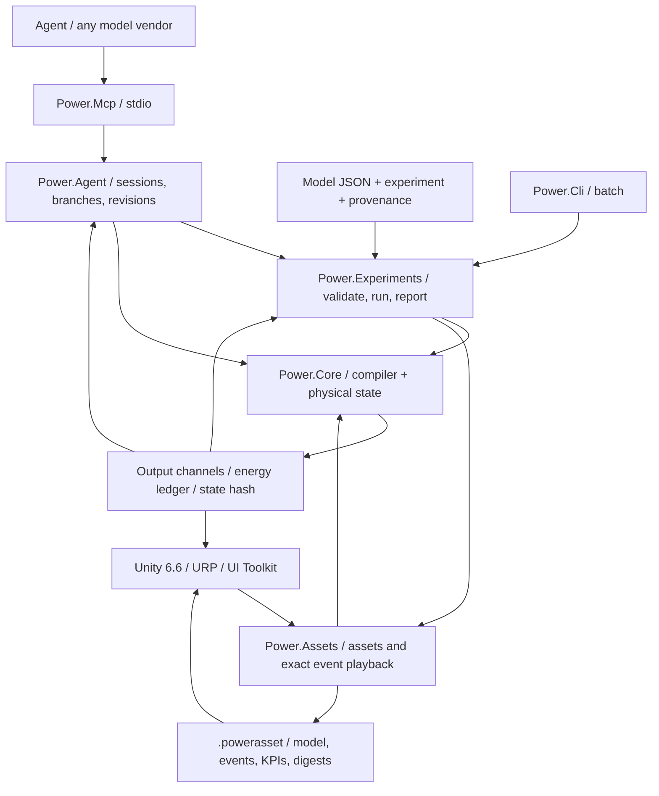

# C# / Unity / Agent architecture

**English** · [简体中文](ARCHITECTURE.zh-CN.md) · [Français](ARCHITECTURE.fr.md) · [Русский](ARCHITECTURE.ru.md) · [日本語](ARCHITECTURE.ja.md) · [한국어](ARCHITECTURE.ko.md) · [Deutsch](ARCHITECTURE.de.md) · [Español](ARCHITECTURE.es.md) · [Italiano](ARCHITECTURE.it.md) · [Português](ARCHITECTURE.pt-BR.md)

The active application remains C#/.NET with Unity. The archived native prototypes now use **Zig 0.15.2**, with original C provenance preserved in Git and a source-hash manifest. The [native boundary](NATIVE_ZIG.md) defines a separate shared library and the existing versioned binary ABI. No native runtime dependency is introduced into the managed core or Unity assemblies.


The architecture decision is dated 2026-09-07. The active line moved from the old C prototypes to managed C#. Unity provides the 3D studio. Physics models and agent automation run on their own.


```mermaid
flowchart TD
    Agent[Agent / any model vendor] --> MCP[Power.Mcp / stdio]
    MCP --> Workspace[Power.Agent / sessions, branches, revisions]
    JSON[Model JSON + experiment + provenance] --> Experiments[Power.Experiments / validate, run, report]
    CLI[Power.Cli / batch] --> Experiments
    Workspace --> Experiments
    Workspace --> Core[Power.Core / compiler + physical state]
    Experiments --> Core
    Experiments --> Assets[Power.Assets / assets and exact event playback]
    Assets --> Core
    Assets --> File[.powerasset / model, events, KPIs, digests]
    File --> Unity[Unity 6.6 / URP / UI Toolkit]
    Unity --> Assets
    Core --> Evidence[Output channels / energy ledger / state hash]
    Evidence --> Unity
    Evidence --> Workspace
    Evidence --> Experiments
```

## Dependencies and boundaries

`Power.Core` has no Unity, network, JSON, MCP, model-vendor or third-party package dependency. The same source compiles to `net10.0` and `netstandard2.1`. C# 14 records, patterns and the rest are lowered to managed IL at build time. Unity only loads the assemblies. The `IsExternalInit` compatibility definition is only for the standard-library target. Unity scenes do not serialize record types directly.

`Power.Experiments` turns model JSON into an explicit model description, bounds experiment time and size, runs two replays with different batch sizes, checks KPIs and writes evidence. `Power.Agent` is a transport-independent workspace. `Power.Mcp` exposes it as tools through the official SDK. Changing the model vendor only changes the agent client.

`Power.Assets` also targets `net10.0` and `netstandard2.1` and depends only on the core. It stores the immutable model description, a provenance summary, events and KPIs, and provides a size-limited binary encoding and a player. CLI and MCP export validated JSON as `.powerasset`. After import, Unity recompiles the model and checks the fingerprint, instead of serializing solver internals. The format is in [model assets](ASSET_FORMAT.md).

Unity references the Core and Assets standard-library assemblies directly. Scene code builds views and controls from nodes and channels and can show any topology the current core supports. It no longer constructs a fixed sample by hand. General graph editing and saving are not implemented. Actual import and Play acceptance still need the Unity Editor.

## Model compilation

`ModelDefinition` is a composable topology description. A node declares its physical domain, storage and initial state. A component declares endpoints, parameters, input channels and where losses go. Every dimensional parameter carries a unit and is normalized to SI at compile time, including rpm to rad/s and degree to radian.

The compiler copies definitions, sorts stable IDs and checks units, finiteness, connections, input ownership and capacity. Models are bounded to 32 nodes, 64 components and 128 reported state entries. Unsupported or unsolvable definitions return object/field diagnostics.

`CompiledModel` stores the immutable topology, channel table, model fingerprint and LU factorization. Several `Simulation` instances share one model and each owns a complete state and workspace. Changing the original description arrays after compilation does not change the compiled model.

## Ideal transmission reference boundary

`IdealGearPair` and `SimplePlanetaryGear` are immutable constant-load reference primitives
with explicit SI properties and pure result records. They provide independent evidence
for the separate coupled gear constraints, while retaining pure local reference state. The planetary uses a reduced kinetic-energy mass
matrix and is checked against a separate acceleration-constraint solution. See
[the reference contract](IDEAL_GEARS.md).

## Permanent gear constraints

The [coupled gear solver](GEAR_NETWORK.md) projects the electromechanical midpoint and
all cylinder/converter/clutch force responses onto permanent ideal gear and planetary constraints.
Normalized rows and full-tick factors are immutable compiled data; variable-interval
factors and multiplier buffers belong to each simulation. Initial speeds must be
compatible, initial relative phase is preserved, and dependent constraints are rejected.
Per-port mean reactions are accumulated across accepted internal intervals and copied,
hashed and rolled back with the full state. Asset v8 introduced bounded topology records while
prior gear-free fingerprints and replay hashes remain unchanged.

## Joint converter and cylinder solve

The [converter law](CONVERTER_NETWORK.md) owns four immutable signed maps and rejects
energy-creating interpolation. A joint nonlinear system solves cylinder crank increments
and converter midpoint port speeds through the same projected electromechanical response.
Clutch iterations and internal event intervals reuse that system, including variable-step
responses. Converter-free models retain their previous solver path and fingerprints.

Mean pump/turbine torques, mean heat power and compensated cumulative fluid heat belong
to transactional simulation state. Stator reaction is their opposite torque sum, at
stationary ground. Thermal routing uses actual removed mechanical work. Map definitions
cross JSON and bounded asset v9 records; factors and runtime histories are reconstructed
by replay. Lockup is a separate parallel clutch. The quasi-steady component adds no Core
transport, Unity, JSON or third-party dependency.

## Hydraulic network and pressure actuation

The [hydraulic network](HYDRAULIC_NETWORK.md) advances gauge pressure through constant
compliance and explicit linear/regularized-turbulent restrictions. Conserved reference
volume, quadratic elastic energy, reservoir work and pressure-loss heat use the same
accepted transfers. The per-simulation Newton workspace is bounded and allocation-free.

Pressure-operated clutches derive capacity from the hydraulic interval midpoint, piston
area, preload, friction and effective radius. Every speculative clutch event trial owns
a full hydraulic state copy; rollback includes pressure, mean flows, cumulative loss and
boundary ledgers. Mean outputs are normalized over the complete tick. Asset v10 preserves
the explicit pressure boundaries and actuator ports; hydraulic-free paths retain their
previous fingerprints. Pumps and moving pistons require further conserving components.

## Electromechanical core

The [coupled clutch solver](CLUTCH_NETWORK.md) adds bounded static reactions and kinetic
friction to the electromechanical/cylinder midpoint system. Internal slip-zero events
are bracketed against complete speculative state copies; interval factors belong to
each simulation. Friction heat enters thermal nodes or the external ledger. Phase,
mean torque/power and compensated cumulative heat participate in hashes, forks and
whole-batch rollback. The [standalone law and exact pair](CLUTCH_PHYSICS.md) remain
independent constant-load references. External time stays in bounded integer ticks.

Models containing sealed cylinders add a bounded nonlinear discrete-gradient solve around the existing electromechanical midpoint system. Gas pressure work is coupled to crank motion and included in the energy ledger. The original linear path retains solver version 2 and its model fingerprints; cylinder models use solver version 3. See [the equations, limits and evidence](SEALED_CYLINDER.md). This first cylinder component derives constant-mass gas state from crank angle. Separate fixed-volume gas nodes now carry independent mass and internal energy through the [Core gas-network solver](GAS_NETWORK.md); the [moving-cylinder coupling](MOVING_CYLINDER.md) now connects those states to crank pressure work. Optional [crank-angle timing](VALVE_TIMING.md) now controls restrictions from actual crank position; [premixed combustion](PREMIXED_COMBUSTION.md) now adds constituent and chemical-energy accounting. Detailed chemistry and complete engine behavior remain open.

Mechanics and the motor share one coupled linear system, so back-EMF, shaft torque and speed are not treated as unrelated one-way signals:

```text
x_mid = (I - h A / 2)^-1 (x_n + h b / 2)
x_next = 2 x_mid - x_n

L di/dt = V - R i - k ω
J dω/dt = k i + τ_external + τ_shaft

twist = θ_a - r θ_b - θ_rest
slip  = ω_a - r ω_b
τ_a   = -K twist - D slip
τ_b   = -r τ_a
```

The motor torque constant and the back-EMF constant use the same SI coupling coefficient. Positive and negative ratios are assembled so that power direction stays consistent. Resistance and damping losses are evaluated at the midpoint and sent to a named thermal node or to the outside.

The thermal network uses backward Euler: `(C + h G) T_next = C T_n + Q_loss + h G_ambient T_ambient`. Internal heat flows are assembled in pairs. Heat leaving to the outside enters the ledger. Mechanical and motor linear dynamics have a second-order convergence check. Thermal dynamics are first order. A large step that stays stable is not a large step that stays accurate.

The global energy residual is `source_work - heat_rejected - stored_energy_change`. Source work may be negative, so regenerative braking reduces cumulative source work. Cumulative source work and heat use compensated summation. The ledger also checks that outputs and stored energy stay finite.

## Time, transactions and reproducibility

Core time is a `ulong` in nanoseconds. The compiled step is fixed between 1 ns and 1 s. Every call must cover complete ticks and may advance at most one million ticks.

`SubmitInputs` checks the whole input frame, then commits it once. `Step` advances every tick in a preallocated candidate state. Overflow, a non-finite output, an illegal temperature or cancellation discards the whole batch. The cancellation flag is checked at most once every 256 ticks. The success path for inputs, stepping and the caller's buffer snapshot allocates no managed memory.

`Step(delta, scheduledInputs)` accepts input events at absolute nanosecond times. Times must be ordered, aligned to the tick and inside this call's interval. The same channel cannot be set twice at the same time. An event at the start is submitted before the first tick. An event at the end is submitted before the snapshot. If the batch fails, the inputs roll back with it. `AssetPlayback` moves the event cursor only after success, so a different presentation batch does not change the experiment. An interactive change can branch from playback state into an independent simulation.

`Fork` copies the current complete state and the compensation terms, so different inputs can be compared from the same physical history. Branches share only the compiled model. They do not share mutable state. Concurrent access to one core instance returns `Busy`. Snapshot and fork throw a distinct busy exception because their signatures differ. Different instances may run in parallel.

The fingerprint covers model semantics, normalized parameters, the step and the solver version. The state hash also covers time, state, inputs and ledger compensation terms. It is a replay check, not a security hash. Bitwise agreement is required for the same binary, runtime and architecture. Different CPUs, JIT, Mono or IL2CPP are compared with a physical tolerance and are not promised to match bit for bit.

## Core contract for agents

- Capabilities and limits are discoverable. Return values state model fidelity and calibration status.
- Input errors are located by `TryCompile` or a structured exception. Callers do not parse console prose.
- Channels use stable IDs, a direction, a unit and a physical name. Adapters serialize 64-bit IDs, time and revision as decimal strings.
- Session writes carry `expected_revision`. The check and the state change share one lock. A stale call does not advance the simulation a second time.
- Snapshots can select fields. An experiment returns final values and validation evidence by default, so the model context stays small.
- A parameter branch copies state first, then submits inputs separately. Failure and cancellation leave the branch baseline intact.
- A report keeps "the run finished", "the KPIs passed" and "the parameters are calibrated" apart. No current model is calibrated to a vehicle.

MCP sessions live in the local server process. The limit is 16. They are released when the server exits. A JSON document contains data only. It does not execute code or instructions inside the document. Core modeling does not need an API key. A physics tick does not wait on a network request.

## What is still open

Compressible gas exchange, prescribed premixed combustion, clutches, gears, a mapped converter and hydraulic actuation now exist as components with ports, state and conservation checks. They do not finish the powertrain. Still open: rail pump and refill, ignition control, detailed intake and exhaust, mechanical losses, richer thermochemistry, mesh compliance, complete AT pressure and shift control, coordinated ECU/TCU behavior, and measured calibration. A new equation still needs an explicit model version, dimensions and numerical evidence. Existing component semantics are not extended by changing them quietly.

An agent can generate a topology and initial state, propose parameter hypotheses, write component candidates, build experiments and read the evidence back. The execution core still owns numerical constraints and checks. A language-model judgment is not a physical fact. Unity graph editing, a simulation worker thread and a replaceable high-performance solver backend wait until the boundary is stable. Nothing here claims a general nonlinear solver, Burst or a GPU solver.

## 2026-09-22 gas integration

`ModelDocument` and `power.model.v1` now map finite gas composition and restriction
parameters into the existing Core definitions. `CompiledModel.ValidateInput` exposes
static channel/finiteness/range validation, used by experiment and asset schedule checks;
state-dependent observable checks remain in `Simulation`. The solver equations and
fingerprint construction are unchanged.

Asset format v3 extends the bounded binary tables with gas-node composition and orifice
records. It retains v1/v2 readers and checks extension coverage, type, uniqueness and
length before compiling and comparing fingerprints. Gas wall conductance and reservoir
temperature use the existing base component fields. This keeps Core and Assets free of
JSON, transport and Unity dependencies.

CLI and MCP share the gas document, asset and experiment semantics. Studio reads the
same asset and adds schematic vessels/paths; its new Editor/Play tests still require an
actual Editor run. See [development status](DEVELOPMENT_STATUS.md) for remaining work.

## Moving-cylinder coupling

A `gas_cylinder` owns the volume of one gas node and references one rotational crank.
The gas node omits independent storage, so compilation derives initial volume from the
geometry at the crank's initial angle. Pressure, temperature, mass and energy remain on
the gas node; the geometry component exposes volume, displacement and crank torque.

Models with moving chambers add fingerprint tag 5 and use symmetric half-flow/full-crank/
half-flow integration. Adiabatic chamber energy change and crank torque use the same
discrete gradient, including external back-pressure work. Wall coupling remains first
order. The previous fixed-volume-only solver path and prior fingerprints remain intact.
All candidate gas, crank and ledger state still belongs to the whole-call transaction.

Asset v4 adds indexed moving-geometry records and retains the earlier readers. The
JSON/MCP example and Unity moving-piston view use the same definitions; actual Editor
verification remains pending. See [MOVING_CYLINDER.md](MOVING_CYLINDER.md).

## Crank-angle restriction profiles

An optional immutable `ValveTimingDefinition` on a gas orifice references a rotational
node and explicit cycle, opening and duration angles. `CrankValveProfile` normalizes
phase and evaluates a continuous sin-squared envelope. The orifice input becomes peak
opening; the gas solver and observable mass flow share the same effective fraction.
There is no separate mutable cam state. Timed models add fingerprint tag 6 and use the
symmetric gas/crank split even when their gas volumes are fixed. Models without timing
retain their prior path and fingerprints.

Per-lobe angle/speed and precision guards reject under-resolved ticks within the existing
candidate-state transaction. JSON, asset v10 and MCP expose the same contract, while
Studio reads the effective-opening channel for its schematic marker. Actual Unity
execution remains separately pending. See [VALVE_TIMING.md](VALVE_TIMING.md).

## Premixed reaction and constituent transport

Optional `GasDefinition.Premixed` supplies explicit heating value, stoichiometric ratio
and initial fuel/fresh-air fractions. `GasNetwork` compiles compatible connected mixtures
and explicit reservoir fractions. The gas solver transports three nonnegative constituent
masses with upstream flow, reconstructs total mass, and accounts for chemical enthalpy
at the model boundary. Premixed transport includes an outgoing-flow bound in addition
to the existing net mass/energy bounds.

`PremixedCombustion` references the gas node and its crank. `CombustionSolver` previews
heat from forward Wiebe exposure and limiting reactants during the crank iteration.
The pressure torque uses half the preview heat before adiabatic work; the remaining
half follows the work step. Accepted fuel/air consumption, product formation, chemical
ledgers and the irreversible angle frontier live in `MixtureState` inside the normal
candidate transaction. It is copied on forks and included in hashes; workspace previews
never survive a failed call as committed state.

Premixed models add fingerprint tag 7. Asset v10 retains mixture, reservoir and burn
extensions; earlier nonreacting semantics remain unchanged. JSON/CLI/MCP expose fuel
and heat evidence, while Studio uses the same heat-release channel for its schematic
marker. Actual Editor execution remains pending. The full numerical and physical scope
is documented in [PREMIXED_COMBUSTION.md](PREMIXED_COMBUSTION.md).

## Shaft-driven hydraulic coupling

Models with pumps extend the joint nonlinear system with pump shaft speeds and all
hydraulic midpoint pressures. Pressure reaction enters the same gear-projected force
responses as cylinder and converter torque. Pump flow enters paired compliance-node
balances; pressure-dependent clutch capacities refresh within constraint iteration.
Accepted transfers commit volume, boundary work, shaft-to-fluid work and relief heat.
All workspace is simulation-owned and stepping allocates no managed memory.

Pump-free models retain the preceding hydraulic solver path and replay hashes. The
ideal displacement and finite-conductance relief limits, typed ports, observables and
independent evidence are specified in [HYDRAULIC_PUMP.md](HYDRAULIC_PUMP.md). Core and
Assets remain dependency-free dual-target assemblies; actual Unity evidence is separate.

## Sampled control in the model transaction

`PressureControllerDefinition` declares the hydraulic sensor, owned DC motor voltage
channel, explicit gains/bounds, initial integral and a tick-aligned integer sampling
period. Compilation binds one controller owner per motor input and removes that input
from the external write table. A controller's pressure setpoint remains discoverable
with units and stable IDs. Models without controllers retain their previous fingerprints.

At the start of each complete tick, after scheduled inputs at that time, the candidate
state samples due controllers from current hydraulic pressure. It updates integral,
sampled pressure/error and held voltage, then performs the physical solve. Internal
clutch trial intervals copy this state and do not resample it. The physical motor still
accounts for all electrical work and heat. The controller has no invented energy store.

Controller memory and owned motor inputs are copied by forks, hashed, and committed
only with the whole batch. Cancellation or later numerical failure rolls back control
history alongside physical state and inputs. Sampling allocates no managed memory.
JSON, asset v12, CLI and MCP share this model semantics, with actual Editor execution
remaining separately pending. See [the complete contract](HYDRAULIC_PUMP.md#sampled-pressure-regulation).

## Coupled electrical supply

Battery nodes add SOC and polarization voltage to the same dynamic state vector as
rotational coordinates and RL motor currents. Chemical energy is the integral of the
explicit affine OCV curve over charge; the RC branch stores quadratic energy. No model
provider, transport, Unity or third-party dependency enters these equations.

Held duty and resistive load openings change the electrical matrix and affine forcing.
`ElectricalDynamics` owns its rates, LU factors and input cache per simulation. Gear,
cylinder, converter and clutch responses use the prepared factors, including internal
variable-duration capture trials. Failed preparation invalidates caches; candidate
physical/control state still commits only with the whole batch. Caches are workspace,
not shared model state or persistent simulation history.

Battery motor work transfers internally. Battery, inductive, mechanical and hydraulic
energy changes balance explicit heat and external ideal-source/load work. Charge and
polarization live in the normal state vector, so forks, hashes and rollback include
them automatically. Duty control uses dimensionless outputs and the same sampling/
anti-windup contract as voltage control. Asset v14 and JSON/MCP retain complete supply
definitions. [The supply contract](HYDRAULIC_PUMP.md#finite-battery-supply-and-duty-regulation)
records scope, limits and independent evidence.

## Translational hydraulic actuation

`translational` nodes add displacement and velocity states with positive lumped
mass. Hydraulic pistons add coordinate unknowns to the existing joint mechanical/
pressure solver. Swept front/back volumes couple to compliance; reservoir pressure
work remains an explicit external boundary. Linear springs use the same midpoint
matrix with translational units. Pad and stroke-stop forces use discrete potential
gradients and analytic Jacobians, preserving pressure/contact work across hinge
activation and release.

Contact clutches derive capacities from the pad's discrete force during the solve,
then expose instantaneous force/capacity in snapshots. Each simulation owns compact
compensated spring-damping histories, copied and hashed with every candidate state.
No workspace allocations occur during successful steady stepping or snapshot reads.
Asset v14 and JSON/MCP retain the motion and contact topology. See
[HYDRAULIC_PISTON.md](HYDRAULIC_PISTON.md) for equations, limits and evidence.

## Mechanically metered flow

Spool-valve lands bind to existing piston coordinates. The hydraulic residual reads
their midpoint position and includes analytic flow derivatives with respect to
pressure and piston travel. Pressure feedback, motion and metering therefore share
the Newton matrix and speculative clutch intervals. Passive port heat and swept
volume commit through the existing hydraulic histories. Position slopes use bounded
simulation-owned buffers; successful stepping adds no managed allocations. Asset v15,
JSON and actual MCP replay retain the geometry. The declared pressure-balanced land
neglects axial jet force; see [HYDRAULIC_SPOOL.md](HYDRAULIC_SPOOL.md).

## Linear gas/fluid energy coupling

Gas pistons add linear geometry owners to the finite gas network. Initial mass/
energy use the actual initial geometry; flow and wall heat read the current volume.
The joint mechanical solver collects unique translational coordinates, so opposed
gas chambers and a hydraulic separator share one mass. Gas force uses adiabatic
discrete pressure work, an analytic derivative and stable small-travel series.
Absolute reference-pressure work is external; gas internal energy remains a normal
transactional state. No fitted pressure curve replaces that state.

Closed unmixed chambers without transport or heat skip zero-rate integration after
state validation. Measured before/after replay preserves every value/hash. Bounds,
rollback/forks and allocation-free stepping apply to the combined gas/fluid histories.
Asset v16 and JSON/MCP retain geometry and orientation. See
[GAS_PISTON.md](GAS_PISTON.md) for thermodynamics, scope and evidence.

## Cycle fuel metering

Finite tracked gas rails and receivers use the existing conservative orifice
transfers. A per-cycle controller latches requested fuel mass in a forward crank
window. A fuel-rate ceiling scales the same mass, constituent and enthalpy flux;
accepted Heun transfers update complete quota/delivery history. Chemical energy
moves internally and remains separate from reaction heat and external boundaries.
Reversal does not reset an observed quota. Histories belong to each simulation,
including speculative clutch intervals, cancellation and forks. Timing travel and
state counts remain bounded; warm stepping allocates no managed memory. Asset v17
and JSON/MCP retain nozzle, timing and dose. See [FUEL_METERING.md](FUEL_METERING.md).

## Finite liquid phase and vapor availability

Films add explicit liquid mass and thermal/chemical inventory beside tracked gas
receivers. The analytic finite-bath law resolves heating, prescribed saturation
and dryout, using an internal-energy phase offset matched to the receiver's vapor
heat capacity. Vapor enters the normal gas and fuel states; liquid remains outside
the reaction inventory. The finite wall pays every phase transfer.

Film/gas/mechanics/gas/film half-steps reverse film order on the second sweep so
shared-wall film transfers have a symmetric split. Other wall heat sources retain
the explicit outer-interval wall temperature and its first-order accuracy limit.
Independent simultaneous ODE refinement checks distinguish these cases. Phase
inventories, compensated heat/delivery histories and mean flows copy/hash/rollback
with complete simulation state, including speculative clutch intervals. Asset v18
and JSON/MCP retain all phase quantities. See [FUEL_FILM.md](FUEL_FILM.md).

## Finite compliant liquid fuel delivery

Liquid injectors own finite source inventory and rail pressure energy. Pressure
derives from compensated discharged volume through supplied compliance; the
one-way nozzle integrates fixed-receiver pressure-head decay analytically. Shared
forward-cycle quotas bound delivery and preserve reversal/command semantics.
Liquid caloric and chemical energy move to the film without bypassing evaporation.
Rail pressure work separates into finite-wall nozzle heat and an explicit exported
receiver displacement-work boundary under the negligible-liquid-volume reduction.
Only that exported work enters global external work; stored rail energy isn't
counted twice.

Injection wraps the existing film/gas/mechanical split with reversed second-half
ordering. Source/film inventories and all quota, pressure/heat and compensated
histories survive speculative clutch intervals, complete rollback, cancellation
and independent forks. Independent simultaneous ODE refinement and active
allocation checks verify the shared path. Asset v19, JSON and actual MCP retain
source/nozzle/timing definitions. See [LIQUID_FUEL_INJECTION.md](LIQUID_FUEL_INJECTION.md).

## Reciprocal solenoid and physical needle

Flux linkage and linear position-dependent inductance add magnetic stored energy
and reciprocal force to the joint mechanical solve. An analytic electrical
elimination and position derivative preserve a symmetric discrete energy identity;
accepted motion commits magnetic flux, copper heat and electrical work once.
Elastic travel stops reuse conservative hinge gradients without clamping state.
Coordinates merge with existing hydraulic/gas-piston coordinates as appropriate.

Actual needle lift meters liquid flow independently of desired-dose/window cutoff.
A sampled driver owns coil voltage and uses the latched cycle target and measured
delivery, retaining closing and seat-rebound tails. Complete state includes magnetic,
sampled/held controller, source/phase and all compensated histories through forks,
cancellation, speculative clutch capture and late failure. Asset v20 and JSON/MCP
retain the definitions. Scope, reciprocity and evidence are in
[NEEDLE_ACTUATION.md](NEEDLE_ACTUATION.md).

## Bounded closure replay and scheduled cutoff

Prediction-enabled drivers copy complete state into one preallocated replay
state, hold other actuator commands and replay a zero-voltage or delayed-cutoff
plant future. Normal physical equations and accepted hybrid intervals determine
additional delivery. Forecasts never commit or run sampled controllers recursively;
real intervals prepare their solver workspace after each prediction.

Bounded integer candidate search schedules cutoff within the next sample period.
The per-cycle latch and physical-tick countdown prevent repeated reopening from
tiny forecast differences. Prediction mass/count, latch/cycle and countdown join
complete state copy/hash/rollback. Horizon alignment, clock range, finite tick
budget and candidate monotonicity are checked. Asset v21 retains the optional
horizon; disabled predictions preserve earlier model/state hashes. See
[CLOSURE_PREDICTION.md](CLOSURE_PREDICTION.md).

## Dual-clutch graph composition

The immutable DCT assembly lowers seven forward/reverse paths into existing
rotor, gear and clutch records with caller-owned stable IDs. Free hubs, two input
shafts, reverse idler and three output/final branches retain explicit inertia.
Selectors transfer synchronization impulse/heat and drive clutches transfer actual
power; a gear number doesn't replace the permanent topology.

The large linear graph exposed slow correlated-lock projection at a six/seven
handoff. The primary bounded projection is retained; when it exhausts iterations,
independent linear locks use a normalized preallocated Schur factorization with
the same static limits, mode release, residual and passive-heat checks. Singular
or nonlinear cases retain their existing behavior. Ordinary JSON/asset/MCP paths
and original fingerprints remain unchanged. References and scope are in
[DUAL_CLUTCH_TRANSMISSION.md](DUAL_CLUTCH_TRANSMISSION.md).

## Sampled DCT state and controlled kinematics

The controller owns all ten drive/selector commands and validates their actual
odd/even/idler/final topology. Integer requests are sampled on bounded clocks;
physical slip and lock gate preselection and staged exclusive handoff. Neutral,
direction block, timeout, persistent lock loss and new-request recovery retain
separate state/fault outputs. Held commands, selections, phase and monitoring
clocks copy/hash/rollback with complete physical histories.

Controlled models accumulate coordinates from midpoint velocity with compensated
roundoff. Strict gear phase bounds remain unchanged; compensation is transactional
and hashed. Preceding models retain their prior integration/replay. The reported
state bound expands to 128 while node/component limits stay 32/64, with exact-
boundary and overflow tests. This supports the complete research fired/DCT/control
composition rather than dropping engine state to fit the earlier limit.
Asset v22 and JSON/MCP retain all route/timing/tolerance definitions. See
[DCT_CONTROL.md](DCT_CONTROL.md).

## Compound planetary research assembly

The [Ravigneaux assembly](RAVIGNEAUX_TRANSMISSION.md) combines a single-pinion
large-sun and double-pinion small-sun constraint sharing ring/carrier. Normalized
rows preserve summed reaction power; projected responses enter the ordinary
mechanical/converter/clutch solve. Compound graphs accumulate coordinates with
transactional compensated correction to preserve long-run phase under load;
existing graph-only models retain their previous integration/hash path. Four member inertias are explicit research
values; internal planet spin remains unresolved. Five friction connections select
four forward ranges or reverse without adding a prescribed speed source.

The assembly returns immutable ordinary definitions with stable port and command
IDs. Carrier capture generates actual friction heat. Every reaction and heat
history participates in the existing state copy/hash/rollback contract. JSON and
asset v23 retain double-pinion topology; earlier component-free fingerprints and
authentic v22 replay remain unchanged. This does not establish complete AT control
or measured target-powertrain behavior.

## Resolved internal planet motion

The [resolved Ravigneaux graph](RESOLVED_PLANETS.md) uses four carrier-relative
mesh rows between six internal rotors. Absolute planet spin retains diagonal
rotor kinetic storage; declared per-planet masses add exact orbital inertia to
the carrier. Independent reduced mass matrices, angular momentum, capture heat
and every replay boundary check the ordinary coupled graph. It does not add a
prescribed speed signal or separate untracked energy store.

Carrier meshes support finite nonzero signed relative ratios and explicit moving
carrier reactions. Their normalized Schur projection performs at most three
relative residual refinements, including small clutch/cylinder/converter force
responses. Free midpoint targets enforce zero next-endpoint velocity residual,
avoiding repeated reflection of preceding roundoff through the same force response. Correction multipliers accumulate into actual reactions. Compiled
factors remain immutable; simulation-owned scratch and constructor-local buffers
keep branches independent. Existing graphs retain the prior projection path.
The new primitive adds fingerprint tag 28 and asset v24 topology support.

## Shared hydraulic actuation assembly

The [AT actuation assembly](AT_HYDRAULIC_ACTUATION.md) lowers 1..6 declared clutch
targets into actual piston/contact clutches, fill/drain restrictions and return
springs supplied by a shared reversible pump, leakage/drag and relief. Explicit
front/back areas retain swept inventory and reference-pressure work. Immutable
ordinary definitions preserve the existing joint pressure/motion/friction solve,
portable v24 semantics and complete atomic state. Prescribed valve schedules
remain separate from AT feedback/control and measured valve-body acceptance.

## Hydraulic AT feedback

`at_controller` accepts an integer requested range in [-1,4]; zero is neutral. It owns five fill/drain actuator pairs and optional converter lockup. Route order is carrier input, small-sun input, large-sun input, carrier brake, large-sun brake, then lockup.

The examples `controlled-hydraulic-ravigneaux` and `controlled-fired-hydraulic-ravigneaux` use request channel 900 and controller ID 1400. They retain 99 and 122 reported states within the unchanged 128-state limit. Asset v29 retains routes, gains and clocks and reads v1-v28.

These are research controls and parameters remain `unverified`. Coordinated ECU torque blending, detailed sensors/valves, comprehensive vehicle faults and OEM calibration remain unfinished. Managed and Standard checks do not establish actual Unity Editor/Play/Player/IL2CPP acceptance.

[AT_CONTROL.md](AT_CONTROL.md)

## Pump-fed liquid fuel rail

`liquid_rail_feed` pairs a liquid injector with an existing displacement pump and explicit material/thermal boundary. The hydraulic outlet node must match the rail compliance and initial absolute pressure. The paired pump and injector own this pressure node; other untracked fluid paths are rejected.

Asset v29 retains feed links and source temperature and reads v1-v28. Analytic shaft/pressure exchange, independent simultaneous ODE refinement, caloric mixing, mass/fuel/energy/volume ledgers, reverse return and complete rollback have separate checks.

This is a rigid mixed tank with incompressible liquid and ideal gas. Slosh/hydrostatic shape, vapor-phase equilibrium, cavitation, measured pump/valve maps, OEM calibration and actual Unity Editor/Play/Player/IL2CPP remain open. Parameters remain `unverified`.

[PUMP_FED_FUEL.md](PUMP_FED_FUEL.md)

## Finite liquid fuel tank

`liquid_fuel_tank` stores finite liquid mass and caloric energy using the paired injector's density, film thermal reference and heating value. A feed selects it with `tank_component` and omits `supply_temperature`. Each tank belongs to one feed with matching fuel properties.

Tank caloric and chemical energy enter the complete stored-energy ledger. Tank-to-rail transfer adds no external mass or chemical supply. The explicit prescribed pump inlet pressure retains its pressure-work boundary. Gas inlet/exhaust can still carry chemical boundary energy.

This is a rigid mixed tank with incompressible liquid and ideal gas. Slosh/hydrostatic shape, vapor-phase equilibrium, cavitation, measured pump/valve maps, OEM calibration and actual Unity Editor/Play/Player/IL2CPP remain open. Parameters remain `unverified`.

[LIQUID_FUEL_TANK.md](LIQUID_FUEL_TANK.md)

## Tracked fuel relief return

`liquid_rail_return` pairs a feed with an exclusively owned one-way `hydraulic_relief`. The valve connects the rail to the pump's same prescribed inlet pressure. Register every fluid path; incompatible ports, duplicate valve ownership and untracked paths reject.

`fluid_heat_fraction` explicitly selects the fraction in [0,1] of valve loss carried with returned fuel. The remaining heat follows the valve's declared heat path. Simultaneous rail/tank caloric mixing preserves the full mass, chemical, pressure-work and thermal ledgers. External-source returns instead carry mass and energy out through the boundary.

[LIQUID_FUEL_RETURN.md](LIQUID_FUEL_RETURN.md)

## Geometric tank and finite headspace

`liquid_fuel_tank.parameters.headspace` declares `capacity` in `m3` or `l` and `gas_node`. The gas node omits `storage`: its volume is `capacity - liquid_mass / density`. It must have one owner and remain positive. The paired pump and relief return use zero prescribed reservoir pressure because the finite gas owns inlet pressure.

The coupled solve exchanges shaft, rail and gas pressure work without an external pressure source. Gas orifices and heat links provide explicit vent/thermal paths. Read tank `pressure`, `fill_fraction` and signed cumulative `hydraulic_work`, plus headspace gas mass, energy and volume. Prescribed dose, delivered liquid, evaporation and burn remain separate.

[Geometric tank and finite headspace](TANK_HEADSPACE.md)
