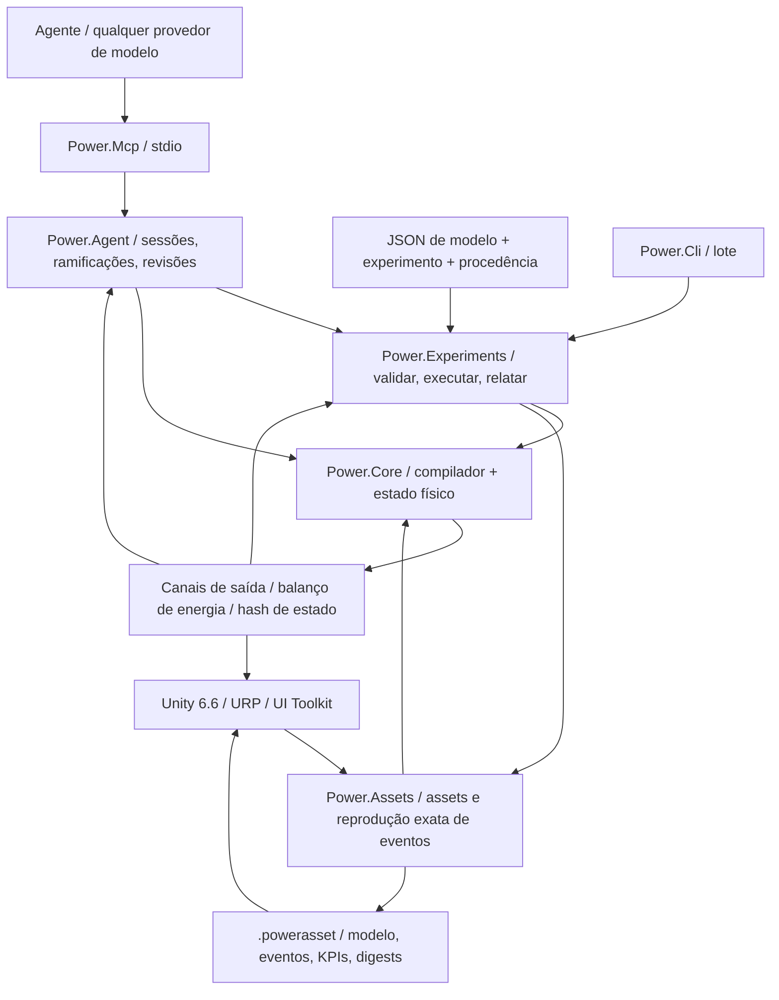

# Arquitetura C# / Unity / agente

[English](ARCHITECTURE.md) · [简体中文](ARCHITECTURE.zh-CN.md) · [Français](ARCHITECTURE.fr.md) · [Русский](ARCHITECTURE.ru.md) · [日本語](ARCHITECTURE.ja.md) · [한국어](ARCHITECTURE.ko.md) · [Deutsch](ARCHITECTURE.de.md) · [Español](ARCHITECTURE.es.md) · [Italiano](ARCHITECTURE.it.md) · **Português**

O aplicativo ativo continua C#/.NET com Unity. Os protótipos nativos arquivados agora usam **Zig 0.15.2**, com a procedência C original preservada no Git e um manifesto de hashes de fonte. A [fronteira nativa](NATIVE_ZIG.pt-BR.md) define uma biblioteca compartilhada separada e o ABI binário versionado existente. Nenhuma dependência de runtime nativo é introduzida no núcleo gerenciado nem nos assemblies do Unity.

A decisão de arquitetura é datada de 2026-09-07. A linha ativa passou dos antigos protótipos C para o C# gerenciado. O Unity fornece o estúdio 3D. Os modelos físicos e a automação de agente rodam por conta própria.



## Dependências e fronteiras

`Power.Core` não tem dependência de Unity, rede, JSON, MCP, provedor de modelos nem pacote de terceiros. A mesma fonte compila para `net10.0` e `netstandard2.1`. Records, padrões e o restante do C# 14 são rebaixados para IL gerenciado no momento da compilação. O Unity só carrega os assemblies. A definição de compatibilidade `IsExternalInit` existe só para o alvo de biblioteca padrão. Cenas do Unity não serializam tipos record diretamente.

`Power.Experiments` transforma o JSON do modelo numa descrição explícita de modelo, limita o tempo e o tamanho do experimento, executa dois replays com tamanhos de lote diferentes, confere os KPIs e escreve a evidência. `Power.Agent` é um espaço de trabalho independente de transporte. `Power.Mcp` o expõe como ferramentas pelo SDK oficial. Trocar o provedor de modelos só muda o cliente do agente.

`Power.Assets` também visa `net10.0` e `netstandard2.1` e depende só do núcleo. Ele guarda a descrição imutável do modelo, um resumo de procedência, eventos e KPIs, e fornece uma codificação binária de tamanho limitado e um reprodutor. A CLI e o MCP exportam JSON validado como `.powerasset`. Depois da importação, o Unity recompila o modelo e confere a impressão digital, em vez de serializar os internos do solver. O formato está em [assets de modelo](ASSET_FORMAT.pt-BR.md).

O Unity referencia diretamente os assemblies de biblioteca padrão de Core e Assets. O código de cena constrói vistas e controles a partir de nós e canais e pode mostrar qualquer topologia que o núcleo atual suporte. Ele não constrói mais uma amostra fixa à mão. Edição e gravação gerais de grafo não estão implementadas. A importação real e a aceitação de Play ainda precisam do Unity Editor.

## Compilação do modelo

`ModelDefinition` é uma descrição de topologia composável. Um nó declara seu domínio físico, armazenamento e estado inicial. Um componente declara extremidades, parâmetros, canais de entrada e para onde vão as perdas. Todo parâmetro dimensional carrega uma unidade e é normalizado para SI no tempo de compilação, inclusive rpm para rad/s e grau para radiano.

O compilador copia as definições, ordena IDs estáveis e confere unidades, finitude, conexões, posse das entradas e capacidade. Os modelos são limitados a 32 nós, 64 componentes e 128 entradas de estado reportadas. Definições não suportadas ou insolúveis retornam diagnósticos de objeto/campo.

`CompiledModel` guarda a topologia imutável, a tabela de canais, a impressão digital do modelo e a fatoração LU. Várias instâncias de `Simulation` compartilham um modelo, e cada uma possui um estado completo e um espaço de trabalho. Alterar os arrays originais de descrição depois da compilação não muda o modelo compilado.

## Fronteira de referência da transmissão ideal

`IdealGearPair` e `SimplePlanetaryGear` são primitivos imutáveis de referência com carga constante, com propriedades SI explícitas e records de resultado puro. Eles fornecem evidência independente para as restrições de engrenagem acopladas separadas, conservando um estado de referência local puro. A planetária usa uma matriz de massa reduzida de energia cinética e é conferida contra uma solução separada de restrição de aceleração. Veja [o contrato de referência](IDEAL_GEARS.pt-BR.md).

## Restrições permanentes de engrenagem

O [solver de engrenagens acoplado](GEAR_NETWORK.pt-BR.md) projeta o ponto médio eletromecânico e todas as respostas de força de cilindro/conversor/embreagem sobre restrições ideais permanentes de engrenagem e planetária. Linhas normalizadas e fatores de tick completo são dados compilados imutáveis; fatores de intervalo variável e buffers de multiplicador pertencem a cada simulação. As velocidades iniciais precisam ser compatíveis, a fase relativa inicial é preservada e restrições dependentes são rejeitadas. Reações médias por porta são acumuladas ao longo dos intervalos internos aceitos e copiadas, hasheadas e revertidas com o estado completo. O asset v8 introduziu registros limitados de topologia, enquanto as impressões digitais anteriores sem engrenagem e os hashes de replay permanecem inalterados.

## Solução conjunta de conversor e cilindro

A [lei do conversor](CONVERTER_NETWORK.pt-BR.md) possui quatro mapas imutáveis com sinal e rejeita interpolação que cria energia. Um sistema não linear conjunto resolve incrementos de virabrequim do cilindro e velocidades de porta do conversor no ponto médio pela mesma resposta eletromecânica projetada. Iterações de embreagem e intervalos de evento interno reutilizam esse sistema, inclusive respostas de passo variável. Modelos sem conversor conservam o caminho anterior do solver e as impressões digitais.

Torques médios de bomba/turbina, potência média de calor e calor acumulado compensado do fluido pertencem ao estado transacional da simulação. A reação do estator é a soma oposta desses torques, no solo estacionário. O roteamento térmico usa o trabalho mecânico realmente removido. As definições de mapa atravessam o JSON e os registros limitados do asset v9; fatores e históricos de runtime são reconstruídos pelo replay. A trava é uma embreagem paralela separada. O componente quase estacionário não acrescenta dependência de transporte do Core, Unity, JSON nem de terceiros.

## Rede hidráulica e acionamento por pressão

A [rede hidráulica](HYDRAULIC_NETWORK.pt-BR.md) avança a pressão manométrica por flexibilidade constante e restrições explícitas lineares/turbulentas regularizadas. Volume de referência conservado, energia elástica quadrática, trabalho do reservatório e calor de perda de pressão usam as mesmas transferências aceitas. O espaço de trabalho de Newton por simulação é limitado e sem alocação.

Embreagens acionadas por pressão derivam a capacidade do ponto médio do intervalo hidráulico, da área do pistão, da pré-carga, do atrito e do raio efetivo. Cada tentativa especulativa de evento de embreagem possui uma cópia completa do estado hidráulico; o rollback inclui pressão, vazões médias, perda acumulada e balanços de fronteira. As saídas médias são normalizadas sobre o tick completo. O asset v10 preserva as fronteiras explícitas de pressão e as portas do atuador; caminhos sem hidráulica conservam as impressões digitais anteriores. Bombas e pistões móveis exigem componentes conservativos adicionais.

## Núcleo eletromecânico

O [solver de embreagens acoplado](CLUTCH_NETWORK.pt-BR.md) acrescenta reações estáticas limitadas e atrito cinético ao sistema de ponto médio eletromecânico/cilindro. Eventos internos de deslizamento nulo são delimitados contra cópias completas de estado especulativo; os fatores de intervalo pertencem a cada simulação. O calor de atrito entra em nós térmicos ou no balanço externo. Fase, torque/potência médios e calor acumulado compensado participam de hashes, ramificações e rollback do lote inteiro. A [lei isolada e o par exato](CLUTCH_PHYSICS.pt-BR.md) continuam referências independentes de carga constante. O tempo externo permanece em ticks inteiros limitados.

Modelos que contêm cilindros fechados acrescentam uma solução não linear limitada de gradiente discreto em torno do sistema de ponto médio eletromecânico existente. O trabalho de pressão do gás é acoplado ao movimento do virabrequim e incluído no balanço de energia. O caminho linear original conserva a versão 2 do solver e suas impressões digitais de modelo; modelos com cilindro usam a versão 3 do solver. Veja [as equações, os limites e as evidências](SEALED_CYLINDER.pt-BR.md). Este primeiro componente de cilindro deriva o estado do gás de massa constante a partir do ângulo do virabrequim. Nós separados de gás de volume fixo agora carregam massa e energia interna independentes pelo [solver de rede de gás do Core](GAS_NETWORK.pt-BR.md); o [acoplamento do cilindro móvel](MOVING_CYLINDER.pt-BR.md) agora conecta esses estados ao trabalho de pressão do virabrequim. A [temporização opcional por ângulo do virabrequim](VALVE_TIMING.pt-BR.md) agora controla restrições a partir da posição real do virabrequim; a [combustão premisturada](PREMIXED_COMBUSTION.pt-BR.md) agora acrescenta o balanço de constituintes e de energia química. Química detalhada e comportamento completo do motor continuam abertos.

A mecânica e o motor compartilham um sistema linear acoplado, então a força contraeletromotriz, o torque de eixo e a velocidade não são tratados como sinais unidirecionais sem relação:

```text
x_mid = (I - h A / 2)^-1 (x_n + h b / 2)
x_next = 2 x_mid - x_n

L di/dt = V - R i - k ω
J dω/dt = k i + τ_external + τ_shaft

twist = θ_a - r θ_b - θ_rest
slip  = ω_a - r ω_b
τ_a   = -K twist - D slip
τ_b   = -r τ_a
```

A constante de torque do motor e a constante de força contraeletromotriz usam o mesmo coeficiente de acoplamento SI. Relações positivas e negativas são montadas de modo que a direção da potência permaneça consistente. Perdas de resistência e de amortecimento são avaliadas no ponto médio e enviadas a um nó térmico nomeado ou para fora.

A rede térmica usa Euler regressivo: `(C + h G) T_next = C T_n + Q_loss + h G_ambient T_ambient`. Os fluxos internos de calor são montados aos pares. O calor que sai para fora entra no balanço. A dinâmica linear mecânica e do motor tem uma verificação de convergência de segunda ordem. A dinâmica térmica é de primeira ordem. Um passo grande que permanece estável não é um passo grande que permanece preciso.

O resíduo global de energia é `source_work - heat_rejected - stored_energy_change`. O trabalho da fonte pode ser negativo, então a frenagem regenerativa reduz o trabalho acumulado da fonte. O trabalho acumulado da fonte e o calor usam soma compensada. O balanço também confere que as saídas e a energia armazenada permaneçam finitas.

## Tempo, transações e reprodutibilidade

O tempo do Core é um `ulong` em nanossegundos. O passo compilado é fixo entre 1 ns e 1 s. Cada chamada precisa cobrir ticks completos e pode avançar no máximo um milhão de ticks.

`SubmitInputs` confere o quadro inteiro de entrada e depois o confirma uma vez. `Step` avança cada tick num estado candidato pré-alocado. Estouro, uma saída não finita, uma temperatura ilegal ou cancelamento descartam o lote inteiro. O sinalizador de cancelamento é conferido no máximo uma vez a cada 256 ticks. O caminho de sucesso de entradas, avanço e instantâneo do buffer do chamador não aloca memória gerenciada.

`Step(delta, scheduledInputs)` aceita eventos de entrada em tempos absolutos de nanossegundo. Os tempos precisam estar ordenados, alinhados ao tick e dentro do intervalo desta chamada. O mesmo canal não pode ser definido duas vezes no mesmo instante. Um evento no início é submetido antes do primeiro tick. Um evento no fim é submetido antes do instantâneo. Se o lote falha, as entradas fazem rollback com ele. `AssetPlayback` move o cursor de eventos só depois do sucesso, então um lote de apresentação diferente não muda o experimento. Uma mudança interativa pode ramificar a partir do estado de reprodução para uma simulação independente.

`Fork` copia o estado completo atual e os termos de compensação, para que entradas diferentes possam ser comparadas a partir do mesmo histórico físico. As ramificações compartilham só o modelo compilado. Elas não compartilham estado mutável. O acesso concorrente a uma instância do núcleo retorna `Busy`. Instantâneo e ramificação lançam uma exceção distinta de ocupado porque suas assinaturas diferem. Instâncias diferentes podem rodar em paralelo.

A impressão digital cobre a semântica do modelo, os parâmetros normalizados, o passo e a versão do solver. O hash de estado também cobre tempo, estado, entradas e termos de compensação do balanço. É uma verificação de replay, não um hash de segurança. A concordância bit a bit é exigida para o mesmo binário, runtime e arquitetura. CPUs, JIT, Mono ou IL2CPP diferentes são comparados com uma tolerância física e não há promessa de coincidência bit a bit.

## Contrato do núcleo para agentes

- Capacidades e limites são descobríveis. Os valores de retorno declaram a fidelidade do modelo e o estado de calibração.
- Erros de entrada são localizados por `TryCompile` ou por uma exceção estruturada. Os chamadores não analisam prosa do console.
- Os canais usam IDs estáveis, uma direção, uma unidade e um nome físico. Os adaptadores serializam IDs de 64 bits, tempo e revisão como strings decimais.
- Escritas de sessão carregam `expected_revision`. A verificação e a mudança de estado compartilham um mesmo lock. Uma chamada obsoleta não avança a simulação uma segunda vez.
- Instantâneos podem selecionar campos. Um experimento retorna valores finais e evidência de validação por padrão, para que o contexto do modelo permaneça pequeno.
- Um ramo de parâmetros copia o estado primeiro e depois submete as entradas em separado. Falha e cancelamento deixam a linha de base do ramo intacta.
- Um relatório mantém separados "a execução terminou", "os KPIs passaram" e "os parâmetros estão calibrados". Nenhum modelo atual está calibrado para um veículo.
- As sessões MCP vivem no processo local do servidor. O limite é 16. Elas são liberadas quando o servidor encerra. Um documento JSON contém só dados. Ele não executa código nem instruções dentro do documento. A modelagem do núcleo não precisa de uma chave de API. Um tick físico não espera uma requisição de rede.

## O que ainda está aberto

Troca de gás compressível, combustão premisturada prescrita, embreagens, engrenagens, um conversor mapeado e acionamento hidráulico agora existem como componentes com portas, estado e verificações de conservação. Eles não concluem o powertrain. Ainda aberto: bomba e reabastecimento do trilho, controle de ignição, admissão e escape detalhados, perdas mecânicas, termoquímica mais rica, flexibilidade de engrenamento, controle completo de pressão e troca da AT, comportamento coordenado de ECU/TCU e calibração medida. Uma equação nova ainda precisa de uma versão explícita de modelo, dimensões e evidência numérica. A semântica dos componentes existentes não é estendida alterando-os em silêncio.

Um agente pode gerar uma topologia e um estado inicial, propor hipóteses de parâmetros, escrever candidatos de componente, construir experimentos e ler a evidência de volta. O núcleo de execução continua dono das restrições e verificações numéricas. O julgamento de um modelo de linguagem não é um fato físico. Edição de grafo no Unity, uma thread de trabalho de simulação e um backend substituível de solver de alto desempenho esperam até a fronteira estar estável. Nada aqui afirma um solver não linear geral, Burst ou um solver de GPU.

## Integração de gás em 2026-09-22

`ModelDocument` e `power.model.v1` agora mapeiam composição finita de gás e parâmetros de restrição nas definições existentes do Core. `CompiledModel.ValidateInput` expõe validação estática de canal/finitude/intervalo, usada pelas verificações de agenda de experimento e de asset; verificações observáveis dependentes do estado continuam em `Simulation`. As equações do solver e a construção da impressão digital não mudam.

O formato de asset v3 estende as tabelas binárias limitadas com registros de composição de nó de gás e de orifício. Ele conserva os leitores v1/v2 e confere cobertura da extensão, tipo, unicidade e comprimento antes de compilar e comparar impressões digitais. A condutância de parede do gás e a temperatura do reservatório usam os campos existentes do componente de base. Isso mantém Core e Assets livres de dependências de JSON, transporte e Unity.

CLI e MCP compartilham a semântica de documento de gás, asset e experimento. O Studio lê o mesmo asset e acrescenta vasos/caminhos esquemáticos; seus novos testes de Editor/Play ainda exigem uma execução real do Editor. Veja o [estado de desenvolvimento](DEVELOPMENT_STATUS.pt-BR.md) para o trabalho restante.

## Acoplamento do cilindro móvel

Um `gas_cylinder` possui o volume de um nó de gás e referencia um virabrequim rotacional. O nó de gás omite armazenamento independente, então a compilação deriva o volume inicial da geometria no ângulo inicial do virabrequim. Pressão, temperatura, massa e energia permanecem no nó de gás; o componente de geometria expõe volume, deslocamento e torque do virabrequim.

Modelos com câmaras móveis acrescentam a etiqueta 5 de impressão digital e usam integração simétrica de meio escoamento/virabrequim completo/meio escoamento. A variação de energia da câmara adiabática e o torque do virabrequim usam o mesmo gradiente discreto, inclusive o trabalho externo de contrapressão. O acoplamento de parede continua de primeira ordem. O caminho anterior do solver só de volume fixo e as impressões digitais anteriores permanecem intactos. Todo o estado candidato de gás, virabrequim e balanço ainda pertence à transação da chamada inteira.

O asset v4 acrescenta registros indexados de geometria móvel e conserva os leitores anteriores. O exemplo JSON/MCP e a vista de pistão móvel do Unity usam as mesmas definições; a verificação real do Editor continua pendente. Veja [MOVING_CYLINDER.pt-BR.md](MOVING_CYLINDER.pt-BR.md).

## Perfis de restrição por ângulo do virabrequim

Um `ValveTimingDefinition` imutável opcional num orifício de gás referencia um nó rotacional e ângulos explícitos de ciclo, abertura e duração. `CrankValveProfile` normaliza a fase e avalia uma envoltória contínua de seno ao quadrado. A entrada do orifício passa a ser a abertura de pico; o solver de gás e a vazão mássica observável compartilham a mesma fração efetiva. Não há um estado de came mutável separado. Modelos cronometrados acrescentam a etiqueta 6 de impressão digital e usam a divisão simétrica gás/virabrequim mesmo quando seus volumes de gás são fixos. Modelos sem temporização conservam o caminho e as impressões digitais anteriores.

Ângulo/velocidade por lóbulo e proteções de precisão rejeitam ticks sub-resolvidos dentro da transação existente de estado candidato. JSON, asset v10 e MCP expõem o mesmo contrato, enquanto o Studio lê o canal de abertura efetiva para o seu marcador esquemático. A execução real do Unity continua pendente em separado. Veja [VALVE_TIMING.pt-BR.md](VALVE_TIMING.pt-BR.md).

## Reação premisturada e transporte de constituintes

`GasDefinition.Premixed` opcional fornece poder calorífico explícito, razão estequiométrica e frações iniciais de combustível/ar fresco. `GasNetwork` compila misturas conectadas compatíveis e frações explícitas de reservatório. O solver de gás transporta três massas não negativas de constituintes com o escoamento a montante, reconstrói a massa total e contabiliza a entalpia química na fronteira do modelo. O transporte premisturado inclui um limite de escoamento de saída, além dos limites existentes de massa/energia líquidas.

`PremixedCombustion` referencia o nó de gás e o seu virabrequim. `CombustionSolver` pré-visualiza o calor a partir da exposição de Wiebe à frente e dos reagentes limitantes durante a iteração do virabrequim. O torque de pressão usa metade do calor pré-visualizado antes do trabalho adiabático; a metade restante segue o passo de trabalho. Consumo aceito de combustível/ar, formação de produtos, balanços químicos e a fronteira angular irreversível vivem em `MixtureState` dentro da transação candidata normal. Isso é copiado nas ramificações e incluído nos hashes; pré-visualizações do espaço de trabalho nunca sobrevivem a uma chamada falha como estado confirmado.

Modelos premisturados acrescentam a etiqueta 7 de impressão digital. O asset v10 conserva extensões de mistura, reservatório e queima; a semântica anterior sem reação permanece inalterada. JSON/CLI/MCP expõem evidência de combustível e calor, enquanto o Studio usa o mesmo canal de liberação de calor para o seu marcador esquemático. A execução real do Editor continua pendente. O escopo numérico e físico completo está documentado em [PREMIXED_COMBUSTION.pt-BR.md](PREMIXED_COMBUSTION.pt-BR.md).

## Acoplamento hidráulico acionado pelo eixo

Modelos com bombas estendem o sistema não linear conjunto com velocidades de eixo da bomba e todas as pressões hidráulicas de ponto médio. A reação de pressão entra nas mesmas respostas de força projetadas nas engrenagens que o torque de cilindro e de conversor. A vazão da bomba entra nos balanços pareados dos nós de flexibilidade; capacidades de embreagem dependentes da pressão são atualizadas dentro da iteração de restrições. Transferências aceitas confirmam volume, trabalho de fronteira, trabalho de eixo para fluido e calor de alívio. Todo o espaço de trabalho pertence à simulação, e o avanço não aloca memória gerenciada.

Modelos sem bomba conservam o caminho anterior do solver hidráulico e os hashes de replay. Os limites de cilindrada ideal e de alívio de condutância finita, as portas tipadas, os observáveis e a evidência independente estão especificados em [HYDRAULIC_PUMP.pt-BR.md](HYDRAULIC_PUMP.pt-BR.md). Core e Assets continuam assemblies de alvo duplo sem dependências; a evidência real do Unity é separada.

## Controle amostrado na transação do modelo

`PressureControllerDefinition` declara o sensor hidráulico, o canal de tensão do motor CC de que é dono, ganhos/limites explícitos, a integral inicial e um período de amostragem inteiro alinhado ao tick. A compilação vincula um dono controlador por entrada de motor e remove essa entrada da tabela de escrita externa. O ponto de ajuste de pressão de um controlador continua descobrível, com unidades e IDs estáveis. Modelos sem controladores conservam as impressões digitais anteriores.

No início de cada tick completo, depois das entradas agendadas nesse instante, o estado candidato amostra os controladores devidos a partir da pressão hidráulica atual. Ele atualiza a integral, a pressão/erro amostrados e a tensão mantida, e então executa a solução física. Intervalos de tentativa interna de embreagem copiam esse estado e não o reamostram. O motor físico ainda contabiliza todo o trabalho elétrico e o calor. O controlador não tem um reservatório de energia inventado.

A memória do controlador e as entradas de motor de que ele é dono são copiadas pelas ramificações, hasheadas e confirmadas só com o lote inteiro. Cancelamento ou falha numérica posterior reverte o histórico de controle junto com o estado físico e as entradas. A amostragem não aloca memória gerenciada. JSON, asset v12, CLI e MCP compartilham essa semântica de modelo, com a execução real do Editor ainda pendente em separado. Veja [o contrato completo](HYDRAULIC_PUMP.pt-BR.md#sampled-pressure-regulation).

## Alimentação elétrica acoplada

Nós de bateria acrescentam SOC e tensão de polarização ao mesmo vetor de estado dinâmico que as coordenadas rotacionais e as correntes do motor RL. A energia química é a integral da curva OCV afim explícita sobre a carga; o ramo RC armazena energia quadrática. Nenhum provedor de modelos, transporte, Unity ou dependência de terceiros entra nessas equações.

Duty retido e aberturas de carga resistiva mudam a matriz elétrica e o forçamento afim. `ElectricalDynamics` possui suas taxas, fatores LU e cache de entrada por simulação. Respostas de engrenagem, cilindro, conversor e embreagem usam os fatores preparados, inclusive tentativas internas de captura de duração variável. Uma preparação falha invalida os caches; o estado físico/de controle candidato ainda só é confirmado com o lote inteiro. Caches são espaço de trabalho, não estado compartilhado do modelo nem histórico persistente da simulação.

O trabalho do motor da bateria é transferido internamente. Variações de energia da bateria, indutiva, mecânica e hidráulica equilibram calor explícito e trabalho externo de fonte/carga ideal. Carga e polarização vivem no vetor de estado normal, então ramificações, hashes e rollback as incluem automaticamente. O controle de duty usa saídas adimensionais e o mesmo contrato de amostragem/anti-windup do controle de tensão. O asset v14 e JSON/MCP conservam definições completas de alimentação. [O contrato de alimentação](HYDRAULIC_PUMP.pt-BR.md#finite-battery-supply-and-duty-regulation) registra escopo, limites e evidência independente.

## Acionamento hidráulico translacional

Nós `translational` acrescentam estados de deslocamento e velocidade com massa concentrada positiva. Pistões hidráulicos acrescentam incógnitas de coordenada ao solver conjunto existente de mecânica/pressão. Volumes varridos dianteiro/traseiro acoplam-se à flexibilidade; o trabalho de pressão do reservatório continua uma fronteira externa explícita. Molas lineares usam a mesma matriz de ponto médio com unidades translacionais. Forças de pastilha e de batente de curso usam gradientes discretos de potencial e jacobianos analíticos, preservando o trabalho de pressão/contato através da ativação e da liberação da charneira.

Embreagens de contato derivam capacidades da força discreta da pastilha durante a solução e depois expõem força/capacidade instantâneas nos instantâneos. Cada simulação possui históricos compactos e compensados de mola-amortecimento, copiados e hasheados com cada estado candidato. Não há alocações de espaço de trabalho durante o avanço estacionário bem-sucedido nem durante leituras de instantâneo. O asset v14 e JSON/MCP conservam a topologia de movimento e de contato. Veja [HYDRAULIC_PISTON.pt-BR.md](HYDRAULIC_PISTON.pt-BR.md) para equações, limites e evidência.

## Escoamento dosado mecanicamente

Os ressaltos da válvula de carretel se vinculam a coordenadas de pistão existentes. O resíduo hidráulico lê a posição de ponto médio deles e inclui derivadas analíticas do escoamento em relação à pressão e ao curso do pistão. Realimentação de pressão, movimento e dosagem portanto compartilham a matriz de Newton e os intervalos especulativos de embreagem. Calor passivo das portas e volume varrido são confirmados pelos históricos hidráulicos existentes. Inclinações de posição usam buffers limitados pertencentes à simulação; o avanço bem-sucedido não acrescenta alocações gerenciadas. O asset v15, JSON e o replay MCP real conservam a geometria. O ressalto declarado balanceado em pressão despreza a força axial de jato; veja [HYDRAULIC_SPOOL.pt-BR.md](HYDRAULIC_SPOOL.pt-BR.md).

## Acoplamento linear de energia gás/fluido

Pistões de gás acrescentam donos de geometria linear à rede finita de gás. Massa/energia iniciais usam a geometria inicial real; escoamento e calor de parede leem o volume atual. O solver mecânico conjunto coleta coordenadas translacionais únicas, então câmaras de gás opostas e um separador hidráulico compartilham uma massa. A força do gás usa trabalho discreto adiabático de pressão, uma derivada analítica e uma série estável de pequeno curso. O trabalho absoluto de pressão de referência é externo; a energia interna do gás continua um estado transacional normal. Nenhuma curva de pressão ajustada substitui esse estado.

Câmaras fechadas sem mistura, sem transporte nem calor, pulam a integração de taxa nula depois da validação de estado. O replay medido antes/depois preserva cada valor/hash. Limites, rollback/ramificações e avanço sem alocação se aplicam aos históricos combinados de gás/fluido. O asset v16 e JSON/MCP conservam geometria e orientação. Veja [GAS_PISTON.pt-BR.md](GAS_PISTON.pt-BR.md) para termodinâmica, escopo e evidência.

## Medição de combustível por ciclo

Trilhos e receptores de gás rastreados e finitos usam as transferências conservativas existentes por orifício. Um controlador por ciclo trava a massa de combustível solicitada numa janela de virabrequim à frente. Um teto de vazão de combustível escala o mesmo fluxo de massa, constituintes e entalpia; transferências de Heun aceitas atualizam o histórico completo de cota/entrega. A energia química se move internamente e permanece separada do calor de reação e das fronteiras externas. A reversão não zera uma cota observada. Os históricos pertencem a cada simulação, inclusive intervalos especulativos de embreagem, cancelamento e ramificações. O avanço angular de temporização e as contagens de estado permanecem limitados; o avanço já aquecido não aloca memória gerenciada. O asset v17 e JSON/MCP conservam bico, temporização e dose. Veja [FUEL_METERING.pt-BR.md](FUEL_METERING.pt-BR.md).

## Fase líquida finita e disponibilidade de vapor

Filmes acrescentam massa líquida explícita e inventário térmico/químico ao lado de receptores de gás rastreados. A lei analítica de banho finito resolve aquecimento, saturação prescrita e secagem, usando um deslocamento de fase da energia interna casado com a capacidade térmica do vapor do receptor. O vapor entra nos estados normais de gás e de combustível; o líquido permanece fora do inventário de reação. A parede finita paga cada transferência de fase.

Meios passos filme/gás/mecânica/gás/filme invertem a ordem do filme na segunda varredura, para que transferências de filme em parede compartilhada tenham uma divisão simétrica. Outras fontes de calor de parede conservam a temperatura explícita de parede do intervalo externo e o seu limite de precisão de primeira ordem. Verificações independentes de refinamento de EDO simultânea distinguem esses casos. Inventários de fase, históricos compensados de calor/entrega e vazões médias são copiados/hasheados/revertidos com o estado completo da simulação, inclusive intervalos especulativos de embreagem. O asset v18 e JSON/MCP conservam todas as quantidades de fase. Veja [FUEL_FILM.pt-BR.md](FUEL_FILM.pt-BR.md).

## Entrega finita de combustível líquido flexível

Injetores líquidos possuem inventário finito da fonte e energia de pressão do trilho. A pressão deriva do volume descarregado compensado pela flexibilidade fornecida; o bico unidirecional integra analiticamente o decaimento de carga de pressão do receptor fixo. Cotas do ciclo à frente compartilhadas limitam a entrega e preservam a semântica de reversão/comando. Energia calórica e química do líquido vão para o filme sem contornar a evaporação. O trabalho de pressão do trilho se separa em calor do bico na parede finita e numa fronteira explícita de trabalho de deslocamento do receptor exportada, sob a redução de volume líquido desprezível. Só esse trabalho exportado entra no trabalho externo global; a energia armazenada do trilho não é contada duas vezes.

A injeção envolve a divisão existente filme/gás/mecânica com ordenação invertida da segunda metade. Inventários de fonte/filme e todos os históricos de cota, pressão/calor e compensados sobrevivem a intervalos especulativos de embreagem, rollback completo, cancelamento e ramificações independentes. Refinamento independente de EDO simultânea e verificações de alocação ativa conferem o caminho compartilhado. O asset v19, JSON e o MCP real conservam as definições de fonte/bico/temporização. Veja [LIQUID_FUEL_INJECTION.pt-BR.md](LIQUID_FUEL_INJECTION.pt-BR.md).

## Solenoide recíproco e agulha física

Fluxo concatenado e indutância linear dependente da posição acrescentam energia magnética armazenada e força recíproca à solução mecânica conjunta. Uma eliminação elétrica analítica e a derivada de posição preservam uma identidade discreta simétrica de energia; o movimento aceito confirma fluxo magnético, calor no cobre e trabalho elétrico uma vez. Batentes elásticos de curso reutilizam gradientes conservativos de charneira sem grampear o estado. As coordenadas se fundem com as coordenadas existentes de pistão hidráulico/de gás, conforme o caso.

O levantamento real da agulha dosa o escoamento líquido independentemente do corte de dose desejada/janela. Um driver amostrado é dono da tensão da bobina e usa o alvo de ciclo travado e a entrega medida, conservando as caudas de fechamento e de ricochete no assento. O estado completo inclui históricos magnéticos, de controlador amostrado/mantido, de fonte/fase e todos os históricos compensados através de ramificações, cancelamento, captura especulativa de embreagem e falha tardia. O asset v20 e JSON/MCP conservam as definições. Escopo, reciprocidade e evidência estão em [NEEDLE_ACTUATION.pt-BR.md](NEEDLE_ACTUATION.pt-BR.md).

## Replay limitado de fechamento e corte agendado

Drivers com predição habilitada copiam o estado completo para um estado de replay pré-alocado, mantêm os outros comandos de atuador e reproduzem um futuro da planta com tensão nula ou corte atrasado. As equações físicas normais e os intervalos híbridos aceitos determinam a entrega adicional. Previsões nunca são confirmadas nem executam controladores amostrados de forma recursiva; intervalos reais preparam o espaço de trabalho do solver depois de cada predição.

Uma busca limitada de candidatos inteiros agenda o corte dentro do próximo período de amostra. A trava por ciclo e a contagem regressiva em ticks físicos impedem reaberturas repetidas a partir de diferenças minúsculas de previsão. Massa/contagem de predição, trava/ciclo e contagem regressiva entram na cópia/hash/rollback do estado completo. Alinhamento de horizonte, faixa do relógio, orçamento finito de ticks e monotonicidade dos candidatos são conferidos. O asset v21 conserva o horizonte opcional; predições desabilitadas preservam os hashes anteriores de modelo/estado. Veja [CLOSURE_PREDICTION.pt-BR.md](CLOSURE_PREDICTION.pt-BR.md).

## Composição do grafo de embreagem dupla

A montagem DCT imutável reduz sete caminhos à frente/ré em registros existentes de rotor, engrenagem e embreagem, com IDs estáveis pertencentes ao chamador. Cubos livres, dois eixos de entrada, a intermediária de ré e três ramos de saída/final conservam inércia explícita. Seletores transferem impulso/calor de sincronização e embreagens de tração transferem potência real; um número de marcha não substitui a topologia permanente.

O grafo linear grande expôs uma projeção lenta de travamento correlacionado na entrega seis/sete. A projeção limitada primária é conservada; quando ela esgota as iterações, travamentos lineares independentes usam uma fatoração de Schur normalizada e pré-alocada, com os mesmos limites estáticos e as mesmas verificações de liberação de modo, resíduo e calor passivo. Casos singulares ou não lineares conservam o comportamento existente. Os caminhos ordinários de JSON/asset/MCP e as impressões digitais originais permanecem inalterados. Referências e escopo estão em [DUAL_CLUTCH_TRANSMISSION.pt-BR.md](DUAL_CLUTCH_TRANSMISSION.pt-BR.md).

## Estado DCT amostrado e cinemática controlada

O controlador é dono dos dez comandos de tração/seletor e valida a topologia real ímpar/par/intermediária/final. Solicitações inteiras são amostradas em relógios limitados; deslizamento e travamento físicos condicionam a pré-seleção e a entrega exclusiva escalonada. Ponto morto, bloqueio de direção, tempo esgotado, perda persistente de travamento e recuperação por nova solicitação conservam saídas separadas de estado/falha. Comandos retidos, seleções, fase e relógios de monitoramento são copiados/hasheados/revertidos com os históricos físicos completos.

Modelos controlados acumulam coordenadas a partir da velocidade de ponto médio, com arredondamento compensado. Os limites estritos de fase da engrenagem permanecem inalterados; a compensação é transacional e hasheada. Os modelos anteriores conservam a integração/replay anteriores. O limite de estado reportado se expande para 128, enquanto os limites de nó/componente continuam 32/64, com testes de fronteira exata e de estouro. Isso sustenta a composição completa de pesquisa combustão/DCT/controle, em vez de descartar estado do motor para caber no limite anterior. O asset v22 e JSON/MCP conservam todas as definições de rota/temporização/tolerância. Veja [DCT_CONTROL.pt-BR.md](DCT_CONTROL.pt-BR.md).

## Montagem de pesquisa planetária composta

A [montagem Ravigneaux](RAVIGNEAUX_TRANSMISSION.pt-BR.md) combina uma restrição de sol grande com pinhão simples e de sol pequeno com pinhão duplo, compartilhando coroa/porta-planetas. Linhas normalizadas preservam a potência de reação somada; respostas projetadas entram na solução ordinária de mecânica/conversor/embreagem. Grafos compostos acumulam coordenadas com correção compensada transacional para preservar a fase de longa duração sob carga; modelos só de grafo existentes conservam o caminho anterior de integração/hash. Quatro inércias de membro são valores explícitos de pesquisa; o giro interno dos planetas permanece não resolvido. Cinco conexões de atrito selecionam quatro faixas à frente ou ré sem acrescentar uma fonte de velocidade prescrita.

A montagem retorna definições ordinárias imutáveis com IDs estáveis de porta e de comando. A captura do porta-planetas gera calor real de atrito. Cada histórico de reação e de calor participa do contrato existente de cópia/hash/rollback de estado. JSON e o asset v23 conservam a topologia de pinhão duplo; impressões digitais anteriores sem o componente e o replay autêntico de v22 permanecem inalterados. Isso não estabelece controle AT completo nem comportamento medido do powertrain alvo.

## Movimento interno resolvido dos planetas

O [grafo Ravigneaux resolvido](RESOLVED_PLANETS.pt-BR.md) usa quatro linhas de engrenamento relativas ao porta-planetas entre seis rotores internos. O giro absoluto dos planetas conserva armazenamento cinético diagonal do rotor; massas declaradas por planeta acrescentam inércia orbital exata ao porta-planetas. Matrizes independentes de massa reduzida, momento angular, calor de captura e cada fronteira de replay conferem o grafo acoplado ordinário. Ele não acrescenta um sinal de velocidade prescrita nem um reservatório separado de energia não rastreada.

Engrenamentos do porta-planetas suportam relações relativas finitas, não nulas e com sinal, e reações explícitas do porta-planetas móvel. A projeção de Schur normalizada faz no máximo três refinamentos de resíduo relativo, inclusive respostas pequenas de força de embreagem/cilindro/conversor. Alvos livres de ponto médio impõem resíduo nulo de velocidade na extremidade seguinte, evitando a reflexão repetida do arredondamento anterior pela mesma resposta de força. Multiplicadores de correção se acumulam nas reações reais. Os fatores compilados permanecem imutáveis; rascunho pertencente à simulação e buffers locais ao construtor mantêm as ramificações independentes. Grafos existentes conservam o caminho anterior de projeção. O primitivo novo acrescenta a etiqueta 28 de impressão digital e suporte de topologia no asset v24.

## Montagem compartilhada de acionamento hidráulico

A [montagem de acionamento da AT](AT_HYDRAULIC_ACTUATION.pt-BR.md) reduz 1..6 alvos de embreagem declarados em embreagens reais de pistão/contato, restrições de enchimento/drenagem e molas de retorno alimentadas por uma bomba reversível compartilhada, vazamento/arrasto e alívio. Áreas dianteira/traseira explícitas conservam o inventário varrido e o trabalho de pressão de referência. Definições ordinárias imutáveis preservam a solução conjunta existente de pressão/movimento/atrito, a semântica portátil v24 e o estado atômico completo. Agendas prescritas de válvulas continuam separadas da realimentação/controle da AT e da aceitação medida do corpo de válvulas.

## Realimentação de AT hidráulica

`at_controller` aceita uma marcha solicitada inteira em [-1,4]; zero indica neutro. Ele controla cinco pares de válvulas de enchimento/drenagem e o bloqueio opcional do conversor. A ordem é entrada do portasatélites, solar pequeno, solar grande, freio do portasatélites, freio do solar grande e bloqueio.

`controlled-hydraulic-ravigneaux` e `controlled-fired-hydraulic-ravigneaux` usam o canal 900 e o ID 1400. Preservam 99 e 122 estados relatados dentro do limite inalterado de 128. v27 preserva rotas, ganhos e relógios e lê v1-v26.

São controles de pesquisa e os parâmetros continuam `unverified`. Coordenação de torque ECU, sensores/válvulas detalhados, falhas completas do veículo e calibração OEM permanecem pendentes. Verificações managed e Standard não comprovam aceitação real Unity Editor/Play/Player/IL2CPP.

[AT_CONTROL.pt-BR.md](AT_CONTROL.pt-BR.md)

## Rail de combustível líquido alimentado por bomba

`liquid_rail_feed` associa um injetor líquido a uma bomba volumétrica existente e a uma fronteira explícita de matéria/calor. O nó de saída hidráulica deve corresponder à complacência e pressão absoluta inicial do rail. Bomba e injetor possuem esse nó; outras rotas fluidas não contabilizadas são rejeitadas.

v27 preserva conexões e temperatura da fonte e lê v1-v26. Troca analítica eixo/pressão, refinamento ODE simultâneo independente, mistura térmica, balanços massa/combustível/energia/volume, retorno e rollback completo têm verificações separadas.

Capacidade geométrica, ventilação/espaço gasoso/oscilação, cavitação, enchimento/eficiência/regulação medidos e spray resolvido seguem abertos. Parâmetros `unverified`; Unity Editor/Play/Player/IL2CPP real e calibração OEM seguem não verificados.

[PUMP_FED_FUEL.pt-BR.md](PUMP_FED_FUEL.pt-BR.md)

## Tanque finito de combustível líquido

`liquid_fuel_tank` guarda massa líquida finita e energia térmica com densidade, referência térmica do filme e poder calorífico do injetor associado. A alimentação o escolhe por `tank_component` e omite `supply_temperature`. Cada tanque pertence a uma alimentação compatível.

Energias térmica e química do tanque entram no armazenamento completo. Transferência interna não adiciona massa ou energia química externa. A pressão de entrada prescrita mantém sua fronteira de trabalho de pressão. Admissão/escape gasoso ainda podem transportar energia química.

Capacidade geométrica, ventilação/espaço gasoso/oscilação, cavitação, enchimento/eficiência/regulação medidos e spray resolvido seguem abertos. Parâmetros `unverified`; Unity Editor/Play/Player/IL2CPP real e calibração OEM seguem não verificados.

[LIQUID_FUEL_TANK.pt-BR.md](LIQUID_FUEL_TANK.pt-BR.md)
