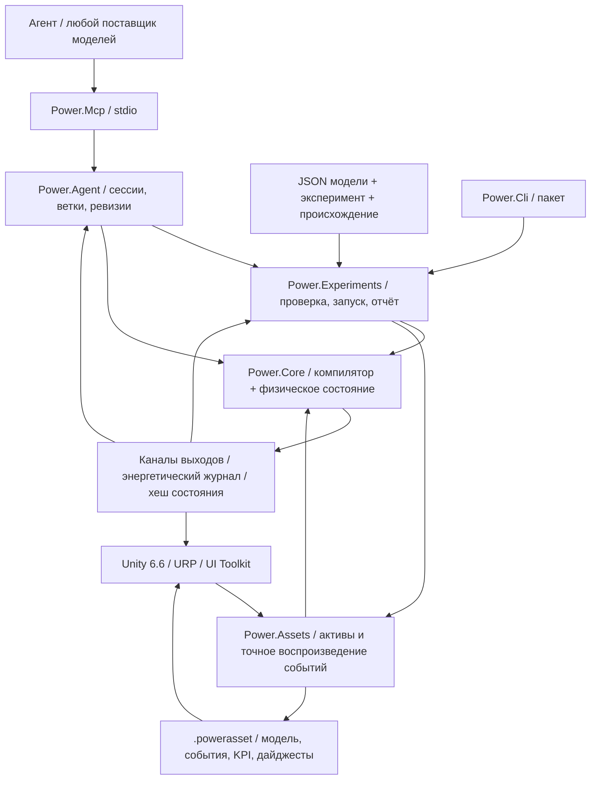

# Архитектура C# / Unity / агента

[English](ARCHITECTURE.md) · [简体中文](ARCHITECTURE.zh-CN.md) · [Français](ARCHITECTURE.fr.md) · **Русский** · [日本語](ARCHITECTURE.ja.md) · [한국어](ARCHITECTURE.ko.md) · [Deutsch](ARCHITECTURE.de.md) · [Español](ARCHITECTURE.es.md) · [Italiano](ARCHITECTURE.it.md) · [Português](ARCHITECTURE.pt-BR.md)

Активное приложение остаётся на C#/.NET с Unity. Архивные нативные прототипы теперь используют **Zig 0.15.2**; исходное происхождение C сохранено в Git и в манифесте хешей исходников. [Нативная граница](NATIVE_ZIG.ru.md) задаёт отдельную динамическую библиотеку и существующий версионируемый бинарный ABI. В управляемое ядро и сборки Unity нативная зависимость среды выполнения не вводится.


Решение об архитектуре датировано 2026-09-07. Активная линия перешла от старых прототипов на C к управляемому C#. Unity даёт студию 3D. Физические модели и автоматизация агентов работают сами по себе.



## Зависимости и границы

У `Power.Core` нет зависимости от Unity, сети, JSON, MCP, поставщика моделей или стороннего пакета. Тот же исходник компилируется в `net10.0` и `netstandard2.1`. Записи C# 14, образцы и остальное понижаются до управляемого IL при сборке. Unity только загружает сборки. Определение совместимости `IsExternalInit` нужно только для цели стандартной библиотеки. Сцены Unity не сериализуют типы записей напрямую.

`Power.Experiments` превращает JSON модели в явное описание модели, ограничивает время и размер эксперимента, выполняет два повтора с разными размерами пакета, проверяет KPI и пишет свидетельства. `Power.Agent` — рабочая область, не зависящая от транспорта. `Power.Mcp` открывает её как инструменты через официальный SDK. Смена поставщика моделей меняет только клиент агента.

`Power.Assets` тоже нацелен на `net10.0` и `netstandard2.1` и зависит только от ядра. Он хранит неизменяемое описание модели, сводку происхождения, события и KPI и даёт ограниченное по размеру бинарное кодирование и проигрыватель. CLI и MCP экспортируют проверенный JSON как `.powerasset`. После импорта Unity заново компилирует модель и сверяет отпечаток, а не сериализует внутренности решателя. Формат — в [модельных активах](ASSET_FORMAT.ru.md).

Unity ссылается на сборки стандартной библиотеки Core и Assets напрямую. Код сцены строит виды и элементы управления из узлов и каналов и может показать любую топологию, которую поддерживает текущее ядро. Фиксированный образец руками он больше не собирает. Общее редактирование графа и сохранение не реализованы. Фактические импорт и приёмка Play всё ещё требуют Unity Editor.

## Компиляция модели

`ModelDefinition` — составное описание топологии. Узел объявляет физическую область, накопитель и начальное состояние. Компонент объявляет конечные точки, параметры, входные каналы и то, куда уходят потери. У каждого размерного параметра есть единица, и при компиляции он приводится к СИ, включая rpm в rad/s и градус в радиан.

Компилятор копирует определения, сортирует устойчивые ID и проверяет единицы, конечность, соединения, владение входами и ёмкость. Модели ограничены 32 узлами, 64 компонентами и 128 сообщаемыми записями состояния. Неподдерживаемые или нерешаемые определения возвращают диагностику объекта и поля.

`CompiledModel` хранит неизменяемую топологию, таблицу каналов, отпечаток модели и LU-разложение. Несколько экземпляров `Simulation` делят одну модель, и каждый владеет полным состоянием и рабочей областью. Изменение исходных массивов описания после компиляции не меняет скомпилированную модель.

## Граница эталона идеальной трансмиссии

`IdealGearPair` и `SimplePlanetaryGear` — неизменяемые эталонные примитивы постоянной нагрузки с явными свойствами в СИ и чистыми записями результата. Они дают независимые свидетельства для отдельных связанных ограничений шестерён и сохраняют чистое локальное эталонное состояние. Планетарный ряд использует редуцированную матрицу масс по кинетической энергии и сверяется с отдельным решением ограничения ускорений. См. [эталонный контракт](IDEAL_GEARS.ru.md).

## Постоянные ограничения шестерён

[Связанный решатель шестерён](GEAR_NETWORK.ru.md) проецирует электромеханическую среднюю точку и все силовые отклики цилиндра, гидротрансформатора и сцепления на постоянные идеальные ограничения шестерён и планетарных рядов. Нормированные строки и коэффициенты полного тика — неизменяемые скомпилированные данные; коэффициенты переменного интервала и буферы множителей принадлежат каждой симуляции. Начальные скорости должны быть совместимы, начальная относительная фаза сохраняется, зависимые ограничения отклоняются. Средние реакции по портам накапливаются по принятым внутренним интервалам и копируются, хешируются и откатываются вместе с полным состоянием. Актив v8 ввёл ограниченные записи топологии, а прежние отпечатки и хеши повтора без шестерён остаются неизменными.

## Совместное решение гидротрансформатора и цилиндра

[Закон гидротрансформатора](CONVERTER_NETWORK.ru.md) владеет четырьмя неизменяемыми картами со знаком и отклоняет интерполяцию, создающую энергию. Совместная нелинейная система решает приращения коленвала цилиндра и скорости портов гидротрансформатора в средней точке через тот же спроецированный электромеханический отклик. Итерации сцепления и внутренние интервалы событий используют эту систему повторно, включая отклики переменного шага. Модели без гидротрансформатора сохраняют прежний путь решателя и отпечатки.

Средние моменты насоса и турбины, средняя тепловая мощность и компенсированная накопленная теплота жидкости принадлежат транзакционному состоянию симуляции. Реакция статора — противоположная сумма их моментов, на неподвижной стойке. Тепловая маршрутизация использует фактически снятую механическую работу. Определения карт пересекают JSON и ограниченные записи актива v9; коэффициенты и истории времени выполнения восстанавливаются повтором. Блокировка — отдельное параллельное сцепление. Квазистационарный компонент не добавляет в ядро транспорт, Unity, JSON или стороннюю зависимость.

## Гидравлическая сеть и привод давлением

[Гидравлическая сеть](HYDRAULIC_NETWORK.ru.md) продвигает избыточное давление через постоянную податливость и явные линейные и регуляризованные турбулентные сужения. Сохраняемый опорный объём, квадратичная упругая энергия, работа резервуара и теплота потерь давления используют одни и те же принятые переносы. Рабочая область Ньютона на симуляцию ограничена и не выделяет память.

Сцепления, управляемые давлением, выводят ёмкость из средней точки гидравлического интервала, площади поршня, предварительного натяга, трения и эффективного радиуса. У каждой пробной попытки события сцепления есть полная копия гидравлического состояния; откат включает давление, средние расходы, накопленные потери и граничные журналы учёта. Средние выходы нормируются на полный тик. Актив v10 сохраняет явные границы давления и порты приводов; пути без гидравлики сохраняют прежние отпечатки. Насосы и подвижные поршни требуют дальнейших сохраняющих компонентов.

## Электромеханическое ядро

[Связанный решатель сцеплений](CLUTCH_NETWORK.ru.md) добавляет ограниченные статические реакции и кинетическое трение в систему средней точки электромеханики и цилиндра. Внутренние события нулевого скольжения локализуются по полным пробным копиям состояния; коэффициенты интервала принадлежат каждой симуляции. Теплота трения входит в тепловые узлы или во внешний журнал учёта. Фаза, средний момент и мощность и компенсированная накопленная теплота участвуют в хешах, ветвлениях и откате всего пакета. [Отдельный закон и точная пара](CLUTCH_PHYSICS.ru.md) остаются независимыми эталонами постоянной нагрузки. Внешнее время остаётся в ограниченных целочисленных тиках.

Модели с закрытыми цилиндрами добавляют ограниченное нелинейное решение дискретного градиента вокруг существующей системы средней точки электромеханики. Работа давления газа связана с движением коленвала и входит в энергетический журнал. Исходный линейный путь сохраняет версию решателя 2 и свои отпечатки моделей; модели цилиндров используют версию решателя 3. См. [уравнения, пределы и свидетельства](SEALED_CYLINDER.ru.md). Этот первый компонент цилиндра выводит состояние газа постоянной массы из угла коленвала. Отдельные газовые узлы постоянного объёма теперь несут независимые массу и внутреннюю энергию через [решатель газовой сети ядра](GAS_NETWORK.ru.md); [связь подвижного цилиндра](MOVING_CYLINDER.ru.md) теперь соединяет эти состояния с работой давления на коленвале. Необязательные [фазы по углу коленвала](VALVE_TIMING.ru.md) теперь управляют сужениями от фактического положения коленвала; [предварительно смешанное сгорание](PREMIXED_COMBUSTION.ru.md) теперь добавляет учёт составляющих и химической энергии. Подробная химия и полное поведение двигателя остаются открытыми.

Механика и двигатель делят одну связанную линейную систему, поэтому противо-ЭДС, момент вала и скорость не считаются несвязанными односторонними сигналами:

```text
x_mid = (I - h A / 2)^-1 (x_n + h b / 2)
x_next = 2 x_mid - x_n

L di/dt = V - R i - k ω
J dω/dt = k i + τ_external + τ_shaft

twist = θ_a - r θ_b - θ_rest
slip  = ω_a - r ω_b
τ_a   = -K twist - D slip
τ_b   = -r τ_a
```

Постоянная момента двигателя и постоянная противо-ЭДС используют один и тот же коэффициент связи в СИ. Положительные и отрицательные передаточные отношения собираются так, чтобы направление мощности оставалось согласованным. Потери на сопротивлении и демпфировании оцениваются в средней точке и направляются в именованный тепловой узел или наружу.

Тепловая сеть использует обратный Эйлер: `(C + h G) T_next = C T_n + Q_loss + h G_ambient T_ambient`. Внутренние тепловые потоки собираются парами. Теплота, уходящая наружу, входит в журнал учёта. У линейной динамики механики и двигателя есть проверка сходимости второго порядка. Тепловая динамика — первого порядка. Большой шаг, который остаётся устойчивым, — это не большой шаг, который остаётся точным.

Глобальный остаток энергии — `source_work - heat_rejected - stored_energy_change`. Работа источника может быть отрицательной, поэтому рекуперативное торможение уменьшает накопленную работу источника. Накопленные работа источника и теплота используют компенсированное суммирование. Журнал учёта также проверяет, что выходы и запасённая энергия остаются конечными.

## Время, транзакции и воспроизводимость

Время ядра — `ulong` в наносекундах. Скомпилированный шаг фиксирован между 1 ns и 1 s. Каждый вызов должен покрывать полные тики и может продвинуть не более одного миллиона тиков.

`SubmitInputs` проверяет весь кадр входов, затем фиксирует его один раз. `Step` продвигает каждый тик в заранее выделенном состоянии-кандидате. Переполнение, неконечный выход, недопустимая температура или отмена отбрасывают весь пакет. Флаг отмены проверяется не чаще одного раза на 256 тиков. Успешный путь для входов, шага и снимка буфера вызывающей стороны не выделяет управляемую память.

`Step(delta, scheduledInputs)` принимает входные события в абсолютные моменты в наносекундах. Моменты должны быть упорядочены, выровнены по тику и лежать внутри интервала этого вызова. Один и тот же канал нельзя задать дважды в один момент. Событие в начале подаётся до первого тика. Событие в конце подаётся до снимка. Если пакет не проходит, входы откатываются вместе с ним. `AssetPlayback` двигает курсор событий только после успеха, поэтому другой пакет представления не меняет эксперимент. Интерактивное изменение может ответвиться от состояния воспроизведения в независимую симуляцию.

`Fork` копирует текущее полное состояние и члены компенсации, поэтому разные входы можно сравнить из одной и той же физической истории. Ветки делят только скомпилированную модель. Изменяемое состояние они не делят. Одновременный доступ к одному экземпляру ядра возвращает `Busy`. Снимок и ветвление бросают отдельное исключение занятости, потому что их сигнатуры различаются. Разные экземпляры могут выполняться параллельно.

Отпечаток покрывает семантику модели, нормированные параметры, шаг и версию решателя. Хеш состояния также покрывает время, состояние, входы и члены компенсации журнала учёта. Это проверка повтора, а не хеш безопасности. Побитовое совпадение требуется для одного и того же бинарника, среды выполнения и архитектуры. Разные CPU, JIT, Mono или IL2CPP сравниваются с физическим допуском и не обещают побитового совпадения.

## Контракт ядра для агентов

- Возможности и пределы обнаруживаемы. Возвращаемые значения сообщают fidelity модели и статус калибровки.
- Ошибки входа локализуются через `TryCompile` или структурированное исключение. Вызывающие стороны не разбирают текст консоли.
- У каналов устойчивые ID, направление, единица и физическое имя. Адаптеры сериализуют 64-битные ID, время и ревизию десятичными строками.
- Записи сессии несут `expected_revision`. Проверка и изменение состояния делят одну блокировку. Устаревший вызов не продвигает симуляцию второй раз.
- Снимки могут выбирать поля. Эксперимент по умолчанию возвращает конечные значения и свидетельства проверки, чтобы контекст модели оставался небольшим.
- Ветка параметров сначала копирует состояние, затем отдельно подаёт входы. Отказ и отмена оставляют базу ветки нетронутой.
- Отчёт разделяет «запуск завершился», «KPI пройдены» и «параметры калиброваны». Ни одна текущая модель не калибрована по автомобилю.

Сессии MCP живут в локальном процессе сервера. Предел — 16. Они освобождаются при выходе сервера. Документ JSON содержит только данные. Код или инструкции внутри документа он не исполняет. Моделированию ядра не нужен ключ API. Физический тик не ждёт сетевого запроса.

## Что ещё открыто

Сжимаемый газообмен, предписанное предварительно смешанное сгорание, сцепления, шестерни, гидротрансформатор с картой и гидравлический привод теперь существуют как компоненты с портами, состоянием и проверками сохранения. Силовой агрегат они не заканчивают. Всё ещё открыто: насос и заправка рейки, управление зажиганием, подробные впуск и выпуск, механические потери, более богатая термохимия, податливость зацепления, полное управление давлением и переключением AT, согласованное поведение ECU/TCU и измеренная калибровка. Новому уравнению всё ещё нужны явная версия модели, размерности и численные свидетельства. Семантику существующих компонентов не расширяют, тихо её меняя.

Агент может породить топологию и начальное состояние, предложить гипотезы параметров, написать кандидатов компонентов, собрать эксперименты и прочитать свидетельства обратно. Ядро исполнения по-прежнему владеет численными ограничениями и проверками. Суждение языковой модели — не физический факт. Редактирование графа в Unity, рабочий поток симуляции и заменяемый высокопроизводительный сервер решателя ждут, пока граница не станет устойчивой. Здесь не заявляется общий нелинейный решатель, Burst или решатель на GPU.

## Интеграция газа 2026-09-22

`ModelDocument` и `power.model.v1` теперь отображают конечный состав газа и параметры сужений в существующие определения ядра. `CompiledModel.ValidateInput` открывает статическую проверку канала, конечности и диапазона; её используют проверки расписания эксперимента и актива. Проверки наблюдаемых величин, зависящие от состояния, остаются в `Simulation`. Уравнения решателя и построение отпечатка не изменились.

Формат актива v3 расширяет ограниченные бинарные таблицы записями состава газового узла и отверстия. Он сохраняет читатели v1/v2 и проверяет покрытие расширений, тип, уникальность и длину до компиляции и сравнения отпечатков. Проводимость стенки газа и температура резервуара используют существующие поля базового компонента. Так ядро и Assets остаются без зависимостей JSON, транспорта и Unity.

CLI и MCP делят семантику газового документа, актива и эксперимента. Студия читает тот же актив и добавляет схематичные сосуды и пути; её новые тесты Editor/Play всё ещё требуют фактического запуска редактора. Оставшаяся работа — в [статусе разработки](DEVELOPMENT_STATUS.ru.md).

## Связь подвижного цилиндра

`gas_cylinder` владеет объёмом одного газового узла и ссылается на один вращательный коленвал. Газовый узел опускает независимый накопитель, поэтому компиляция выводит начальный объём из геометрии при начальном угле коленвала. Давление, температура, масса и энергия остаются на газовом узле; компонент геометрии открывает объём, перемещение и момент коленвала.

Модели с подвижными камерами добавляют тег отпечатка 5 и используют симметричное интегрирование полупоток / полный коленвал / полупоток. Изменение энергии адиабатической камеры и момент коленвала используют один и тот же дискретный градиент, включая внешнюю работу противодавления. Связь со стенкой остаётся первого порядка. Прежний путь решателя только для постоянного объёма и прежние отпечатки остаются нетронутыми. Всё состояние-кандидат газа, коленвала и журнала учёта по-прежнему принадлежит транзакции всего вызова.

Актив v4 добавляет индексированные записи подвижной геометрии и сохраняет прежние читатели. Пример JSON/MCP и вид подвижного поршня в Unity используют те же определения; фактическая проверка редактора всё ещё ожидает. См. [MOVING_CYLINDER.ru.md](MOVING_CYLINDER.ru.md).

## Профили сужений по углу коленвала

Необязательное неизменяемое `ValveTimingDefinition` на газовом отверстии ссылается на вращательный узел и явные углы цикла, открытия и длительности. `CrankValveProfile` нормирует фазу и вычисляет непрерывную огибающую квадрата синуса. Вход отверстия становится пиковым открытием; решатель газа и наблюдаемый массовый расход делят одну и ту же эффективную долю. Отдельного изменяемого состояния кулачка нет. Модели с фазами добавляют тег отпечатка 6 и используют симметричное расщепление газа и коленвала, даже когда объёмы газа постоянны. Модели без фаз сохраняют прежний путь и отпечатки.

Ограничители угла и скорости на каждый кулачок и ограничители точности отклоняют недостаточно разрешённые тики внутри существующей транзакции состояния-кандидата. JSON, актив v10 и MCP открывают тот же контракт, а студия читает канал эффективного открытия для своего схематичного маркера. Фактическое исполнение Unity остаётся отдельно ожидающим. См. [VALVE_TIMING.ru.md](VALVE_TIMING.ru.md).

## Предварительно смешанная реакция и перенос составляющих

Необязательный `GasDefinition.Premixed` задаёт явную теплоту сгорания, стехиометрическое отношение и начальные доли топлива и свежего воздуха. `GasNetwork` компилирует совместимые соединённые смеси и явные доли резервуара. Решатель газа переносит три неотрицательные массы составляющих с набегающим потоком, восстанавливает полную массу и учитывает химическую энтальпию на границе модели. Перенос предварительно смешанной смеси включает границу исходящего потока вдобавок к существующим границам чистых массы и энергии.

`PremixedCombustion` ссылается на газовый узел и его коленвал. `CombustionSolver` предпросматривает теплоту из прямого раскрытия Вибе и лимитирующих реагентов во время итерации коленвала. Момент давления использует половину предпросмотренной теплоты до адиабатической работы; оставшаяся половина следует за шагом работы. Принятые расход топлива и воздуха, образование продуктов, химические журналы учёта и необратимая угловая граница живут в `MixtureState` внутри обычной транзакции кандидата. При ветвлении это копируется и входит в хеши; предпросмотры рабочей области не переживают неудачный вызов как зафиксированное состояние.

Модели с предварительно смешанной смесью добавляют тег отпечатка 7. Актив v10 сохраняет расширения смеси, резервуара и выгорания; прежняя семантика без реакции остаётся неизменной. JSON/CLI/MCP открывают свидетельства топлива и теплоты, а студия использует тот же канал тепловыделения для своего схематичного маркера. Фактическое исполнение редактора всё ещё ожидает. Полный численный и физический объём описан в [PREMIXED_COMBUSTION.ru.md](PREMIXED_COMBUSTION.ru.md).

## Гидравлическая связь с приводом от вала

Модели с насосами расширяют совместную нелинейную систему скоростями вала насоса и всеми давлениями гидравлики в средней точке. Реакция давления входит в те же спроецированные силовые отклики шестерён, что момент цилиндра и гидротрансформатора. Поток насоса входит в парные балансы узлов податливости; ёмкости сцеплений, зависящие от давления, обновляются внутри итерации ограничений. Принятые переносы фиксируют объём, граничную работу, работу вала в жидкость и теплоту предохранительного клапана. Вся рабочая область принадлежит симуляции, и шаг не выделяет управляемую память.

Модели без насоса сохраняют предшествующий путь гидравлического решателя и хеши повтора. Пределы идеального рабочего объёма и предохранительного клапана конечной проводимости, типизированные порты, наблюдаемые величины и независимые свидетельства заданы в [HYDRAULIC_PUMP.ru.md](HYDRAULIC_PUMP.ru.md). Ядро и Assets остаются сборками без зависимостей на две целевые платформы; фактические свидетельства Unity отдельны.

## Дискретное управление в транзакции модели

`PressureControllerDefinition` объявляет гидравлический датчик, принадлежащий канал напряжения двигателя постоянного тока, явные коэффициенты и границы, начальный интеграл и целочисленный период дискретизации, выровненный по тику. Компиляция связывает одного владельца-регулятор на вход двигателя и убирает этот вход из таблицы внешних записей. Уставка давления регулятора остаётся обнаруживаемой, с единицами и устойчивыми ID. Модели без регуляторов сохраняют прежние отпечатки.

В начале каждого полного тика, после запланированных входов в этот момент, состояние-кандидат выбирает должные регуляторы по текущему гидравлическому давлению. Оно обновляет интеграл, выбранные давление и ошибку и удерживаемое напряжение, затем выполняет физическое решение. Внутренние интервалы проб сцепления копируют это состояние и не выбирают его заново. Физический двигатель по-прежнему учитывает всю электрическую работу и теплоту. У регулятора нет выдуманного накопителя энергии.

Память регулятора и принадлежащие входы двигателя копируются ветвлениями, хешируются и фиксируются только вместе со всем пакетом. Отмена или более поздний численный отказ откатывает историю управления вместе с физическим состоянием и входами. Дискретизация не выделяет управляемую память. JSON, актив v12, CLI и MCP делят эту семантику модели; фактическое исполнение редактора остаётся отдельно ожидающим. См. [полный контракт](HYDRAULIC_PUMP.ru.md#sampled-pressure-regulation).

## Связанное электрическое питание

Узлы батареи добавляют SOC и напряжение поляризации в тот же вектор динамического состояния, что вращательные координаты и токи двигателя RL. Химическая энергия — интеграл явной аффинной кривой OCV по заряду; ветвь RC хранит квадратичную энергию. В эти уравнения не входят поставщик моделей, транспорт, Unity или сторонняя зависимость.

Удерживаемая скважность и открытия резистивной нагрузки меняют электрическую матрицу и аффинное воздействие. `ElectricalDynamics` владеет своими скоростями, множителями LU и кешем входов на каждую симуляцию. Отклики шестерён, цилиндра, гидротрансформатора и сцепления используют подготовленные множители, включая внутренние пробы захвата переменной длительности. Неудачная подготовка делает кеши недействительными; физическое состояние и состояние управления кандидата всё равно фиксируются только вместе со всем пакетом. Кеши — рабочая область, а не общее состояние модели и не постоянная история симуляции.

Работа двигателя от батареи передаётся внутренне. Изменения энергии батареи, индуктивности, механики и гидравлики уравновешивают явную теплоту и работу внешнего идеального источника и нагрузки. Заряд и поляризация живут в обычном векторе состояния, поэтому ветвления, хеши и откат включают их автоматически. Управление скважностью использует безразмерные выходы и тот же контракт дискретизации и anti-windup, что управление напряжением. Актив v14 и JSON/MCP сохраняют полные определения питания. [Контракт питания](HYDRAULIC_PUMP.ru.md#finite-battery-supply-and-duty-regulation) записывает объём, пределы и независимые свидетельства.

## Поступательный гидравлический привод

Узлы `translational` добавляют состояния перемещения и скорости с положительной сосредоточенной массой. Гидравлические поршни добавляют неизвестные координаты в существующий совместный решатель механики и давления. Вытесняемые передний и задний объёмы связываются с податливостью; работа давления резервуара остаётся явной внешней границей. Линейные пружины используют ту же матрицу средней точки с поступательными единицами. Силы накладки и упора хода используют дискретные градиенты потенциала и аналитические якобианы, сохраняя работу давления и контакта через включение и отпускание шарнира.

Контактные сцепления выводят ёмкости из дискретной силы накладки во время решения, затем открывают мгновенные силу и ёмкость в снимках. Каждая симуляция владеет компактными компенсированными историями пружины и демпфирования, копируемыми и хешируемыми с каждым состоянием-кандидатом. При успешном установившемся шаге и чтении снимков выделений рабочей области нет. Актив v14 и JSON/MCP сохраняют топологию движения и контакта. Уравнения, пределы и свидетельства — в [HYDRAULIC_PISTON.ru.md](HYDRAULIC_PISTON.ru.md).

## Механически дозируемый поток

Пояски золотникового клапана привязаны к существующим координатам поршня. Гидравлическая невязка читает их положение в средней точке и включает аналитические производные потока по давлению и ходу поршня. Обратная связь по давлению, движение и дозирование поэтому делят матрицу Ньютона и пробные интервалы сцепления. Теплота пассивного порта и вытесненный объём фиксируются через существующие гидравлические истории. Наклоны положения используют ограниченные буферы, принадлежащие симуляции; успешный шаг не добавляет управляемых выделений. Актив v15, JSON и фактический повтор MCP сохраняют геометрию. Объявленный уравновешенный по давлению поясок пренебрегает осевой силой струи; см. [HYDRAULIC_SPOOL.ru.md](HYDRAULIC_SPOOL.ru.md).

## Линейная связь энергии газа и жидкости

Газовые поршни добавляют владельцев линейной геометрии в конечную газовую сеть. Начальные масса и энергия используют фактическую начальную геометрию; поток и теплота стенки читают текущий объём. Совместный механический решатель собирает уникальные поступательные координаты, поэтому встречные газовые камеры и гидравлический разделитель делят одну массу. Сила газа использует адиабатическую дискретную работу давления, аналитическую производную и устойчивый ряд для малого хода. Работа абсолютного опорного давления внешняя; внутренняя энергия газа остаётся обычным транзакционным состоянием. Подобранная кривая давления это состояние не заменяет.

Замкнутые несмешиваемые камеры без переноса и теплоты пропускают интегрирование нулевой скорости после проверки состояния. Повтор со сравнением до и после сохраняет каждое значение и хеш. Границы, откат и ветвления и шаг без выделений применяются к совместным историям газа и жидкости. Актив v16 и JSON/MCP сохраняют геометрию и ориентацию. Термодинамика, объём и свидетельства — в [GAS_PISTON.ru.md](GAS_PISTON.ru.md).

## Дозирование топлива за цикл

Конечные отслеживаемые газовые рейки и приёмники используют существующие сохраняющие переносы через отверстие. Регулятор на цикл фиксирует запрошенную массу топлива в прямом окне коленвала. Потолок расхода топлива масштабирует тот же поток массы, составляющих и энтальпии; принятые переносы Хьюна обновляют полную историю квоты и подачи. Химическая энергия движется внутренне и остаётся отдельной от теплоты реакции и внешних границ. Реверс не сбрасывает наблюдаемую квоту. Истории принадлежат каждой симуляции, включая пробные интервалы сцепления, отмену и ветвления. Ход по фазам и счётчики состояния остаются ограниченными; прогретый шаг не выделяет управляемую память. Актив v17 и JSON/MCP сохраняют сопло, фазы и дозу. См. [FUEL_METERING.ru.md](FUEL_METERING.ru.md).

## Конечная жидкая фаза и доступность пара

Плёнки добавляют явную массу жидкости и тепловой и химический запас рядом с отслеживаемыми газовыми приёмниками. Аналитический закон конечной ванны разрешает нагрев, предписанное насыщение и осушение, используя смещение фазы внутренней энергии, согласованное с теплоёмкостью пара приёмника. Пар входит в обычные состояния газа и топлива; жидкость остаётся вне запаса реакции. Конечная стенка платит за каждый фазовый перенос.

Полушаги плёнка/газ/механика/газ/плёнка меняют порядок плёнок на втором проходе, чтобы переносы плёнок с общей стенкой имели симметричное расщепление. Другие источники теплоты стенки сохраняют явную температуру стенки внешнего интервала и её предел точности первого порядка. Независимые проверки одновременного уточнения ОДУ различают эти случаи. Фазовые запасы, компенсированные истории теплоты и подачи и средние потоки копируются, хешируются и откатываются вместе с полным состоянием симуляции, включая пробные интервалы сцепления. Актив v18 и JSON/MCP сохраняют все фазовые величины. См. [FUEL_FILM.ru.md](FUEL_FILM.ru.md).

## Конечная податливая подача жидкого топлива

Жидкостные форсунки владеют конечным запасом источника и энергией давления рейки. Давление выводится из компенсированного выданного объёма через заданную податливость; одностороннее сопло аналитически интегрирует спад напора давления при фиксированном приёмнике. Общие квоты прямого цикла ограничивают подачу и сохраняют семантику реверса и команды. Калорическая и химическая энергия жидкости переходит в плёнку, не обходя испарение. Работа давления рейки разделяется на теплоту сопла конечной стенки и явную отданную границу работы вытеснения приёмника при редукции пренебрежимо малого объёма жидкости. Только эта отданная работа входит в глобальную внешнюю работу; запасённая энергия рейки не считается дважды.

Впрыск оборачивает существующее расщепление плёнка/газ/механика с обратным порядком второй половины. Запасы источника и плёнки и все истории квоты, давления, теплоты и компенсации переживают пробные интервалы сцепления, полный откат, отмену и независимые ветвления. Независимое одновременное уточнение ОДУ и проверки активных выделений проверяют общий путь. Актив v19, JSON и фактический MCP сохраняют определения источника, сопла и фаз. См. [LIQUID_FUEL_INJECTION.ru.md](LIQUID_FUEL_INJECTION.ru.md).

## Взаимный соленоид и физическая игла

Потокосцепление и линейная индуктивность, зависящая от положения, добавляют запасённую магнитную энергию и взаимную силу в совместное механическое решение. Аналитическое электрическое исключение и производная по положению сохраняют симметричное дискретное тождество энергии; принятое движение один раз фиксирует магнитный поток, теплоту в меди и электрическую работу. Упругие упоры хода повторно используют сохраняющие градиенты шарнира, не зажимая состояние. Координаты сливаются с существующими координатами гидравлического поршня и газового поршня, где это уместно.

Фактический подъём иглы дозирует поток жидкости независимо от отсечки желаемой дозы и окна. Дискретный драйвер владеет напряжением катушки и использует зафиксированную цель цикла и измеренную подачу, сохраняя хвосты закрытия и отскока от седла. Полное состояние включает магнитные величины, выбранный и удерживаемый регулятор, источник и фазу и все компенсированные истории через ветвления, отмену, пробный захват сцепления и поздний отказ. Актив v20 и JSON/MCP сохраняют определения. Объём, взаимность и свидетельства — в [NEEDLE_ACTUATION.ru.md](NEEDLE_ACTUATION.ru.md).

## Ограниченный повтор закрытия и запланированная отсечка

Драйверы с предсказанием копируют полное состояние в одно заранее выделенное состояние повтора, удерживают другие команды приводов и повторяют будущее объекта при нулевом напряжении или отложенной отсечке. Обычные физические уравнения и принятые гибридные интервалы определяют дополнительную подачу. Прогнозы никогда не фиксируются и не запускают дискретные регуляторы рекурсивно; реальные интервалы готовят рабочую область решателя после каждого предсказания.

Ограниченный целочисленный поиск кандидата планирует отсечку внутри следующего периода дискретизации. Фиксация на цикл и обратный отсчёт физических тиков не дают повторно открываться из-за мелких различий прогноза. Масса и счётчик предсказания, фиксация и цикл и обратный отсчёт входят в полное копирование, хеш и откат состояния. Выравнивание горизонта, диапазон часов, конечный бюджет тиков и монотонность кандидатов проверяются. Актив v21 сохраняет необязательный горизонт; отключённые предсказания сохраняют прежние хеши модели и состояния. См. [CLOSURE_PREDICTION.ru.md](CLOSURE_PREDICTION.ru.md).

## Компоновка графа с двумя сцеплениями

Неизменяемая компоновка DCT понижает семь путей переднего хода и заднего хода в существующие записи роторов, шестерён и сцеплений с устойчивыми ID, принадлежащими вызывающей стороне. Свободные ступицы, два входных вала, промежуточная шестерня заднего хода и три выходные ветви и главные передачи сохраняют явную инерцию. Селекторы передают импульс и теплоту синхронизации, а сцепления тяги передают фактическую мощность; номер передачи не заменяет постоянную топологию.

Большой линейный граф проявил медленную проекцию коррелированных блокировок на передаче шесть/семь. Основная ограниченная проекция сохранена; когда она исчерпывает итерации, независимые линейные блокировки используют нормированную заранее выделенную факторизацию Шура с теми же статическими пределами и проверками отпускания режима, невязки и пассивной теплоты. Вырожденные или нелинейные случаи сохраняют прежнее поведение. Обычные пути JSON, актива и MCP и исходные отпечатки остаются неизменными. Ссылки и объём — в [DUAL_CLUTCH_TRANSMISSION.ru.md](DUAL_CLUTCH_TRANSMISSION.ru.md).

## Дискретное состояние DCT и управляемая кинематика

Регулятор владеет всеми десятью командами тяги и селекторов и проверяет их фактическую топологию нечётного, чётного, промежуточного и главного пути. Целочисленные запросы дискретизируются на ограниченных часах; физические скольжение и блокировка открывают предвыбор и поэтапную исключительную передачу. Нейтраль, блокировка направления, таймаут, устойчивая потеря блокировки и восстановление по новому запросу сохраняют отдельные выходы состояния и неисправности. Удерживаемые команды, выборы, фаза и часы наблюдения копируются, хешируются и откатываются вместе с полными физическими историями.

Управляемые модели накапливают координаты из скорости в средней точке с компенсированным округлением. Строгие границы фазы шестерни остаются неизменными; компенсация транзакционна и хешируется. Предшествующие модели сохраняют прежнее интегрирование и повтор. Сообщаемый предел состояния расширяется до 128, а пределы узлов и компонентов остаются 32/64, с тестами точной границы и переполнения. Это поддерживает полную исследовательскую композицию со сгоранием, DCT и управлением, а не отбрасывает состояние двигателя, чтобы уложиться в прежний предел. Актив v22 и JSON/MCP сохраняют все определения маршрута, фаз и допусков. См. [DCT_CONTROL.ru.md](DCT_CONTROL.ru.md).

## Исследовательская компоновка составного планетарного ряда

[Компоновка Ravigneaux](RAVIGNEAUX_TRANSMISSION.ru.md) сочетает ограничение большого солнца с одним сателлитом и малого солнца с двумя сателлитами, делящих корону и водило. Нормированные строки сохраняют суммарную мощность реакций; спроецированные отклики входят в обычное решение механики, гидротрансформатора и сцепления. Составные графы накапливают координаты с транзакционной компенсированной поправкой, чтобы сохранить фазу на длинном прогоне под нагрузкой; существующие модели только с графом сохраняют прежний путь интегрирования и хеша. Четыре инерции элементов — явные исследовательские значения; внутреннее вращение сателлитов остаётся неразрешённым. Пять фрикционных соединений выбирают четыре передних диапазона или задний ход, не добавляя предписанный источник скорости.

Компоновка возвращает неизменяемые обычные определения с устойчивыми ID портов и команд. Захват водила порождает фактическую теплоту трения. Каждая история реакции и теплоты участвует в существующем контракте копирования, хеша и отката состояния. JSON и актив v23 сохраняют топологию с двумя сателлитами; прежние отпечатки без компонентов и подлинный повтор v22 остаются неизменными. Это не устанавливает полное управление AT или измеренное поведение целевого силового агрегата.

## Разрешённое внутреннее движение сателлитов

[Разрешённый граф Ravigneaux](RESOLVED_PLANETS.ru.md) использует четыре строки зацепления относительно водила между шестью внутренними роторами. Абсолютное вращение сателлита сохраняет диагональный кинетический запас ротора; объявленные массы сателлитов добавляют точную орбитальную инерцию к водилу. Независимые редуцированные матрицы масс, момент импульса, теплота захвата и каждая граница повтора проверяют обычный связанный граф. Предписанный сигнал скорости или отдельный неотслеживаемый накопитель энергии он не добавляет.

Зацепления водила поддерживают конечные ненулевые знаковые относительные отношения и явные реакции подвижного водила. Их нормированная проекция Шура выполняет не более трёх уточнений относительной невязки, включая малые силовые отклики сцепления, цилиндра и гидротрансформатора. Свободные цели средней точки требуют нулевой невязки скорости следующей конечной точки, избегая повторного отражения предшествующего округления через тот же силовой отклик. Поправочные множители накапливаются в фактические реакции. Скомпилированные коэффициенты остаются неизменяемыми; временные буферы симуляции и буферы, локальные для конструктора, держат ветки независимыми. Существующие графы сохраняют прежний путь проекции. Новый примитив добавляет тег отпечатка 28 и поддержку топологии актива v24.

## Общая компоновка гидравлического привода

[Компоновка привода AT](AT_HYDRAULIC_ACTUATION.ru.md) понижает 1..6 объявленных целей сцепления в фактические поршневые и контактные сцепления, сужения заполнения и слива и возвратные пружины, которые питает общий реверсивный насос, с утечками, сопротивлением и предохранительным клапаном. Явные передняя и задняя площади сохраняют вытесненный запас и работу опорного давления. Неизменяемые обычные определения сохраняют существующее совместное решение давления, движения и трения, переносимую семантику v24 и полное атомарное состояние. Предписанные расписания клапанов остаются отдельными от обратной связи и управления AT и от измеренной приёмки гидроблока.

## Обратная связь гидравлической AT

`at_controller` принимает целочисленную передачу в [-1,4]; ноль означает нейтраль. Он управляет пятью парами клапанов наполнения/слива и необязательной блокировкой гидротрансформатора. Порядок: вход водила, малого солнца, большого солнца, тормоз водила, тормоз большого солнца, затем блокировка.

Примеры `controlled-hydraulic-ravigneaux` и `controlled-fired-hydraulic-ravigneaux` используют канал 900 и ID 1400. Они сохраняют 99 и 122 отслеживаемых состояния при неизменном пределе 128. Формат v28 хранит маршруты, усиления и часы и читает v1-v27.

Это исследовательское управление, параметры остаются `unverified`. Координация момента ECU, подробные датчики/клапаны, полный набор неисправностей автомобиля и калибровка OEM ещё не завершены. Проверки managed и Standard не подтверждают реальные Unity Editor/Play/Player/IL2CPP.

[AT_CONTROL.ru.md](AT_CONTROL.ru.md)

## Жидкая топливная рампа с насосной подачей

`liquid_rail_feed` связывает жидкий инжектор с существующим объёмным насосом и явной материальной/тепловой границей. Выходной гидравлический узел должен совпадать с податливостью и начальным абсолютным давлением рампы. Насос и инжектор владеют этим узлом; другие неучтённые жидкостные пути отклоняются.

Формат v28 хранит связи подачи и температуру источника и читает v1-v27. Аналитический обмен вал/давление, независимое совместное уточнение ODE, смешение тепла, балансы массы/топлива/энергии/объёма, обратный поток и полный rollback проверяются отдельно.

Геометрическая вместимость, вентиляция/газовая полость/плескание, кавитация, измеренные заполнение/КПД/регулирование и разрешённый распыл остаются открытыми. Параметры `unverified`; реальные Unity Editor/Play/Player/IL2CPP и OEM-калибровка не проверены.

[PUMP_FED_FUEL.ru.md](PUMP_FED_FUEL.ru.md)

## Конечный бак жидкого топлива

`liquid_fuel_tank` хранит конечную массу жидкости и тепловую энергию с плотностью, тепловым отсчётом плёнки и теплотой сгорания связанного инжектора. Подача выбирает его через `tank_component`, исключая `supply_temperature`. Каждый бак принадлежит одной совместимой подаче.

Тепловая и химическая энергия бака входят в полное хранилище. Внутренний перенос не добавляет внешней массы или химической энергии. Заданное входное давление насоса сохраняет границу работы давления. Впуск/выпуск газа всё ещё может переносить химическую энергию.

Геометрическая вместимость, вентиляция/газовая полость/плескание, кавитация, измеренные заполнение/КПД/регулирование и разрешённый распыл остаются открытыми. Параметры `unverified`; реальные Unity Editor/Play/Player/IL2CPP и OEM-калибровка не проверены.

[LIQUID_FUEL_TANK.ru.md](LIQUID_FUEL_TANK.ru.md)

## Отслеживаемый возврат через сброс топлива

`liquid_rail_return` связывает подачу с исключительно принадлежащим ей однонаправленным `hydraulic_relief`. Клапан соединяет рампу с тем же заданным входным давлением насоса. Все жидкостные пути регистрируются; несовместимые порты, повторное владение и неучтённые пути отклоняются.

`fluid_heat_fraction` явно выбирает долю [0,1] потерь, переносимую обратным топливом. Остальное тепло следует объявленному пути. Совместное смешение рампы/бака сохраняет массу, химию, работу давления и тепло. Возврат внешнему источнику выводит массу и энергию через границу.

[LIQUID_FUEL_RETURN.ru.md](LIQUID_FUEL_RETURN.ru.md)
