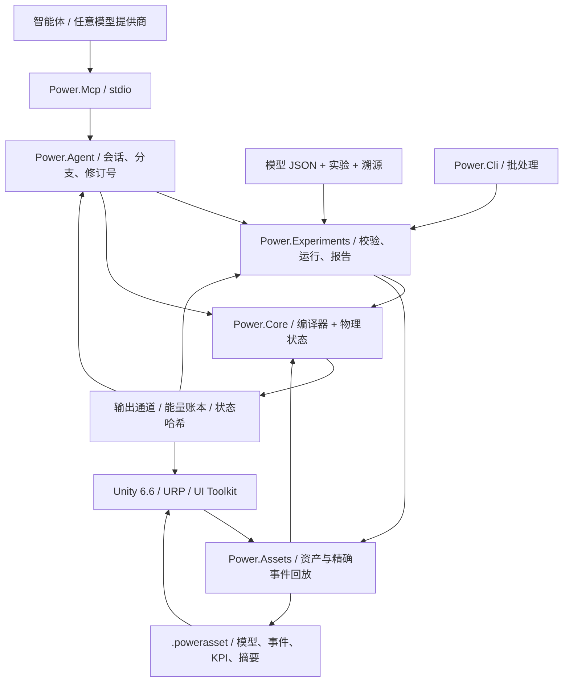

# C# / Unity / 智能体架构

[English](ARCHITECTURE.md) · **简体中文** · [Français](ARCHITECTURE.fr.md) · [Русский](ARCHITECTURE.ru.md) · [日本語](ARCHITECTURE.ja.md) · [한국어](ARCHITECTURE.ko.md) · [Deutsch](ARCHITECTURE.de.md) · [Español](ARCHITECTURE.es.md) · [Italiano](ARCHITECTURE.it.md) · [Português](ARCHITECTURE.pt-BR.md)

现行应用仍是带 Unity 的 C#/.NET。归档的原生原型现使用 **Zig 0.15.2**,原始 C 溯源保存在 Git 与一份源码哈希清单中。[原生边界](NATIVE_ZIG.zh-CN.md)定义独立的共享库与现有带版本的二进制 ABI。托管核心与 Unity 程序集不引入原生运行时依赖。

架构决策日期为 2026-09-07。现行线路已从旧的 C 原型迁到托管 C#。Unity 提供 3D 工作室。物理模型与智能体自动化各自运行。



## 依赖与边界

`Power.Core` 没有 Unity、网络、JSON、MCP、模型提供商或第三方包依赖。同一套源码编译到 `net10.0` 与 `netstandard2.1`。C# 14 的记录、模式及其余语法在构建时降为托管 IL。Unity 只加载程序集。`IsExternalInit` 兼容定义只用于标准库目标。Unity 场景不直接序列化记录类型。

`Power.Experiments` 把模型 JSON 变成显式模型描述,限制实验时间与规模,用不同批量大小做两次回放,检查 KPI 并写出证据。`Power.Agent` 是与传输无关的工作区。`Power.Mcp` 通过官方 SDK 把它暴露为工具。更换模型提供商只更换智能体客户端。

`Power.Assets` 同样面向 `net10.0` 与 `netstandard2.1`,并且只依赖核心。它保存不可变模型描述、溯源摘要、事件与 KPI,并提供有大小限制的二进制编码与播放器。CLI 与 MCP 把已校验的 JSON 导出为 `.powerasset`。导入之后,Unity 重新编译模型并校验指纹,而不是序列化求解器内部状态。格式见 [模型资产](ASSET_FORMAT.zh-CN.md)。

Unity 直接引用 Core 与 Assets 的标准库程序集。场景代码由节点与通道构建视图和控件,可以显示当前核心支持的任何拓扑。它不再手工构造固定样本。通用图编辑与保存尚未实现。真实的导入与 Play 验收仍需要 Unity 编辑器。

## 模型编译

`ModelDefinition` 是可组合的拓扑描述。节点声明其物理域、储能与初始状态。元件声明端点、参数、输入通道以及损失去向。每个有量纲的参数都带单位,并在编译时归一化到 SI,包括 rpm 到 rad/s、度到弧度。

编译器复制定义、排序稳定 ID,并检查单位、有限性、连接、输入所有权与容量。模型限制为 32 个节点、64 个元件和 128 个被报告的状态项。不支持或不可解的定义返回对象/字段诊断。

`CompiledModel` 保存不可变拓扑、通道表、模型指纹与 LU 分解。多个 `Simulation` 实例共享一个模型,各自拥有完整状态与工作区。编译之后更改原始描述数组不会改变编译模型。

## 理想传动参考边界

`IdealGearPair` 与 `SimplePlanetaryGear` 是不可变的恒定载荷参考原语,带有显式 SI 属性与纯结果记录。它们为单独的耦合齿轮约束提供独立证据,同时保留纯局部参考状态。行星排使用降阶动能质量矩阵,并对照单独的加速度约束解进行检查。参见 [参考契约](IDEAL_GEARS.zh-CN.md)。

## 永久齿轮约束

[耦合齿轮求解器](GEAR_NETWORK.zh-CN.md) 把机电中点以及全部气缸/变矩器/离合器力响应投影到永久的理想齿轮与行星约束上。归一化行与整节拍因子是不可变的编译数据;变区间因子与乘子缓冲属于每次仿真。初始转速必须相容,初始相对相位予以保留,相关约束会被拒绝。每端口平均反作用在已接受的内部区间上累积,并随完整状态一起复制、哈希与回滚。资产 v8 引入了有界拓扑记录,而先前的无齿轮指纹与回放哈希保持不变。

## 变矩器与气缸的联合求解

[变矩器定律](CONVERTER_NETWORK.zh-CN.md) 拥有四张不可变的有符号图谱,并拒绝会产生能量的插值。一个联合非线性系统通过同一投影后的机电响应,求解气缸曲轴增量与变矩器中点端口转速。离合器迭代与内部事件区间复用该系统,包括变步长响应。无变矩器模型保留其先前的求解器路径与指纹。

平均泵轮/涡轮扭矩、平均热功率与补偿后的累积流体热量属于事务性仿真状态。导轮反作用是它们的反向扭矩和,作用在静止地面上。热路由使用实际移除的机械功。图谱定义跨越 JSON 与有界资产 v9 记录;因子与运行时历史由回放重建。锁止是一个独立的并联离合器。该准稳态元件不给核心增加传输、Unity、JSON 或第三方依赖。

## 液压网络与压力驱动

[液压网络](HYDRAULIC_NETWORK.zh-CN.md) 通过恒定柔度以及显式的线性/正则化湍流节流推进表压。守恒的参考容积、二次弹性能、储液器功与压力损失热使用同一批已接受的传递。每次仿真的 Newton 工作区有界且无分配。

压力驱动离合器由液压区间中点、活塞面积、预紧力、摩擦与有效半径导出容量。每一次试探性离合器事件试验都拥有完整的液压状态副本;回滚包括压力、平均流量、累积损失与边界账本。平均输出按完整节拍归一化。资产 v10 保留显式压力边界与执行器端口;无液压路径保留其先前指纹。泵与运动活塞需要进一步的守恒元件。

## 机电核心

[耦合离合器求解器](CLUTCH_NETWORK.zh-CN.md) 为机电/气缸中点系统增加有界静反作用与动摩擦。内部滑差过零事件对照完整的试探状态副本被括界;区间因子属于每次仿真。摩擦热进入热节点或外部账本。相位、平均扭矩/功率与补偿累积热量参与哈希、分支与整批回滚。[独立定律与精确配对](CLUTCH_PHYSICS.zh-CN.md) 仍是独立的恒定载荷参考。外部时间保持为有界整数节拍。

含封闭气缸的模型在现有机电中点系统周围增加有界的非线性离散梯度求解。气体压力功耦合到曲轴运动,并计入能量账本。原始线性路径保留求解器版本 2 及其模型指纹;气缸模型使用求解器版本 3。参见 [方程、限制与证据](SEALED_CYLINDER.zh-CN.md)。这第一个气缸元件由曲轴转角导出定质量气体状态。独立的定容气体节点现在通过 [核心气体网络求解器](GAS_NETWORK.zh-CN.md) 携带独立的质量与内能;[运动气缸耦合](MOVING_CYLINDER.zh-CN.md) 现在把这些状态连接到曲轴压力功。可选的 [曲轴转角定时](VALVE_TIMING.zh-CN.md) 现在按实际曲轴位置控制节流;[预混燃烧](PREMIXED_COMBUSTION.zh-CN.md) 现在增加组分与化学能记账。详细化学与完整发动机行为仍未完成。

机械与电机共享一个耦合线性系统,因此反电动势、轴扭矩与转速不被当作彼此无关的单向信号:

```text
x_mid = (I - h A / 2)^-1 (x_n + h b / 2)
x_next = 2 x_mid - x_n

L di/dt = V - R i - k ω
J dω/dt = k i + τ_external + τ_shaft

twist = θ_a - r θ_b - θ_rest
slip  = ω_a - r ω_b
τ_a   = -K twist - D slip
τ_b   = -r τ_a
```

电机扭矩常数与反电动势常数使用同一个 SI 耦合系数。正负速比的组装使功率方向保持一致。电阻与阻尼损失在中点求值,并送到具名热节点或外部。

热网络使用后向欧拉:`(C + h G) T_next = C T_n + Q_loss + h G_ambient T_ambient`。内部热流成对组装。流向外部的热量进入账本。机械与电机线性动力学有二阶收敛检查。热动力学是一阶的。保持稳定的大步长并不是保持准确的大步长。

全局能量残差是 `source_work - heat_rejected - stored_energy_change`。源功可以为负,因此再生制动会减少累积源功。累积源功与热量使用补偿求和。账本还检查输出与储存能量保持有限。

## 时间、事务与可复现性

核心时间是以纳秒计的 `ulong`。编译步长固定在 1 ns 到 1 s 之间。每次调用必须覆盖完整节拍,并且最多推进一百万个节拍。

`SubmitInputs` 检查整帧输入,然后一次提交。`Step` 在预分配的候选状态中推进每个节拍。溢出、非有限输出、非法温度或取消会丢弃整批。取消标志最多每 256 个节拍检查一次。输入、步进与调用方缓冲快照的成功路径不分配托管内存。

`Step(delta, scheduledInputs)` 在绝对纳秒时刻接受输入事件。时刻必须有序、对齐到节拍,并落在本次调用的区间内。同一通道不能在同一时刻设置两次。起点事件在第一个节拍之前提交。终点事件在快照之前提交。如果批次失败,输入随之一起回滚。`AssetPlayback` 只在成功后移动事件游标,因此不同的呈现批次不会改变实验。交互更改可以从回放状态分支出独立仿真。

`Fork` 复制当前完整状态与补偿项,从而可以从同一物理历史比较不同输入。分支只共享编译模型。它们不共享可变状态。对同一核心实例的并发访问返回 `Busy`。快照与分支因签名不同而抛出单独的忙碌异常。不同实例可以并行运行。

指纹覆盖模型语义、归一化参数、步长与求解器版本。状态哈希还覆盖时间、状态、输入与账本补偿项。它是回放检查,不是安全哈希。同一二进制、运行时与体系结构要求按位一致。不同 CPU、JIT、Mono 或 IL2CPP 用物理容差比较,并不承诺按位匹配。

## 面向智能体的核心契约

- 能力与限制可以发现。返回值说明模型保真度与标定状态。
- 输入错误由 `TryCompile` 或结构化异常定位。调用方不解析控制台文字。
- 通道使用稳定 ID、方向、单位与物理名称。适配器把 64 位 ID、时间与修订号序列化为十进制字符串。
- 会话写入携带 `expected_revision`。检查与状态更改共用一把锁。过期调用不会再次推进仿真。
- 快照可以选择字段。实验默认返回最终值与验证证据,因此模型上下文保持精简。
- 参数分支先复制状态,再单独提交输入。失败与取消使分支基线保持完整。
- 报告把「运行已结束」「KPI 已通过」与「参数已标定」分开。当前没有任何模型标定到车辆。

MCP 会话位于本地服务器进程中。上限是 16。服务器退出时释放它们。JSON 文档只含数据。它不执行文档内的代码或指令。核心建模不需要 API 密钥。物理节拍不等待网络请求。

## 仍未完成的部分

可压缩换气、预设预混燃烧、离合器、齿轮、映射式变矩器与液压驱动现在作为带端口、状态与守恒检查的元件存在。它们并不完成动力总成。仍未完成:油轨泵送与加注、点火控制、详细进气与排气、机械损失、更丰富的热化学、啮合柔性、完整 AT 压力与换挡控制、协调的 ECU/TCU 行为,以及实测标定。新方程仍需要显式模型版本、量纲与数值证据。现有元件语义不会通过悄悄修改来扩展。

智能体可以生成拓扑与初始状态、提出参数假设、编写元件候选、构建实验并读回证据。执行核心仍拥有数值约束与检查。语言模型的判断不是物理事实。Unity 图编辑、仿真工作线程与可替换的高性能求解器后端要等到边界稳定。这里并不声称有通用非线性求解器、Burst 或 GPU 求解器。

## 2026-09-22 气体集成

`ModelDocument` 与 `power.model.v1` 现在把有限气体组分与节流参数映射到现有核心定义。`CompiledModel.ValidateInput` 暴露静态的通道/有限性/范围校验,供实验与资产排程检查使用;与状态相关的可观察量检查仍在 `Simulation` 中。求解器方程与指纹构造不变。

资产格式 v3 用气体节点组分与孔口记录扩展有界二进制表。它保留 v1/v2 读取器,并在编译和比较指纹之前检查扩展覆盖、类型、唯一性与长度。气体壁面热导与储气库温度使用现有的基本元件字段。这使核心与 Assets 保持没有 JSON、传输和 Unity 依赖。

CLI 与 MCP 共享气体文档、资产与实验语义。工作室读取同一资产并增加示意容器/路径;其新的编辑器/Play 测试仍需要真实的编辑器运行。剩余工作见 [开发状态](DEVELOPMENT_STATUS.zh-CN.md)。

## 运动气缸耦合

一个 `gas_cylinder` 拥有一个气体节点的容积,并引用一根转动曲轴。该气体节点省略独立储能,因此编译由曲轴初始转角处的几何导出初始容积。压力、温度、质量与能量仍在气体节点上;几何元件暴露容积、排量与曲轴扭矩。

带运动气室的模型增加指纹标签 5,并使用对称的半流动/全曲轴/半流动积分。绝热气室能量变化与曲轴扭矩使用同一个离散梯度,包括外部背压功。壁面耦合仍是一阶的。先前仅定容的求解器路径与先前指纹保持完整。全部候选气体、曲轴与账本状态仍属于整次调用的事务。

资产 v4 增加带索引的运动几何记录,并保留更早的读取器。JSON/MCP 示例与 Unity 运动活塞视图使用相同定义;真实的编辑器验证仍待完成。参见 [运动气缸](MOVING_CYLINDER.zh-CN.md)。

## 曲轴转角节流曲线

气体孔口上可选的不可变 `ValveTimingDefinition` 引用一个转动节点,以及显式的循环、开启与持续角度。`CrankValveProfile` 归一化相位,并计算连续的正弦平方包络。孔口输入变成峰值开度;气体求解器与可观察质量流共享同一个有效分数。没有单独的可变凸轮状态。定时模型增加指纹标签 6,并且即使气体容积固定也使用对称的气体/曲轴分裂。没有定时的模型保留其先前路径与指纹。

每个凸轮凸起的角度/转速与精度保护在现有候选状态事务内拒绝分辨率不足的节拍。JSON、资产 v10 与 MCP 暴露同一契约,工作室则读取有效开度通道作为其示意标记。真实的 Unity 执行仍单独待完成。参见 [气门定时](VALVE_TIMING.zh-CN.md)。

## 预混反应与组分输运

可选的 `GasDefinition.Premixed` 提供显式热值、化学计量比以及初始燃油/新鲜空气分数。`GasNetwork` 编译相容的相连混合物与显式储气库分数。气体求解器随上游流动输运三种非负组分质量,重建总质量,并在模型边界计及化学焓。预混输运在现有净质量/能量界限之外,还包含流出界限。

`PremixedCombustion` 引用气体节点及其曲轴。`CombustionSolver` 在曲轴迭代期间由向前 Wiebe 暴露与限制反应物预览热量。压力扭矩在绝热功之前使用预览热量的一半;剩余一半跟在功步骤之后。已接受的燃油/空气消耗、产物生成、化学账本与不可逆角度前沿位于正常候选事务内的 `MixtureState` 中。分支时复制它,并把它计入哈希;工作区预览从不作为已提交状态在失败调用之后留存。

预混模型增加指纹标签 7。资产 v10 保留混合物、储气库与燃烧扩展;更早的非反应语义保持不变。JSON/CLI/MCP 暴露燃油与热量证据,工作室则用同一放热通道作为其示意标记。真实的编辑器执行仍待完成。完整的数值与物理范围记录在 [预混燃烧](PREMIXED_COMBUSTION.zh-CN.md)。

## 轴驱动液压耦合

带泵的模型用泵轴转速与全部液压中点压力扩展联合非线性系统。压力反作用进入与气缸和变矩器扭矩相同的、经齿轮投影的力响应。泵流量进入成对的柔度节点平衡;压力相关的离合器容量在约束迭代内刷新。已接受的传递提交体积、边界功、轴到流体的功以及泄压热。全部工作区由仿真持有,步进不分配托管内存。

无泵模型保留此前的液压求解器路径与回放哈希。理想排量与有限流导泄压限制、带类型的端口、可观察量与独立证据在 [泵](HYDRAULIC_PUMP.zh-CN.md) 中规定。核心与 Assets 仍是无依赖的双目标程序集;真实的 Unity 证据是分开的。

## 模型事务中的采样控制

`PressureControllerDefinition` 声明液压传感器、所拥有的直流电机电压通道、显式增益/界限、初始积分,以及与节拍对齐的整数采样周期。编译为每个电机输入绑定一个控制器所有者,并把该输入从外部写入表中移除。控制器的压力设定值仍可发现,带有单位与稳定 ID。没有控制器的模型保留其先前指纹。

在每个完整节拍开始时,在该时刻的排程输入之后,候选状态根据当前液压压力对到期控制器采样。它更新积分、采样压力/误差与保持电压,然后执行物理求解。内部离合器试验区间复制该状态,并且不再采样。物理电机仍计及全部电功与热量。控制器没有臆造的能量储存。

控制器记忆与所拥有的电机输入由分支复制、进入哈希,并且只随整批一起提交。取消或随后的数值失败会把控制历史与物理状态和输入一起回滚。采样不分配托管内存。JSON、资产 v12、CLI 与 MCP 共享这套模型语义,真实的编辑器执行仍单独待完成。参见 [完整契约](HYDRAULIC_PUMP.zh-CN.md#sampled-pressure-regulation)。

## 耦合电源

电池节点把荷电状态与极化电压加入与转动坐标和 RL 电机电流相同的动态状态向量。化学能是显式仿射开路电压曲线对电荷的积分;RC 支路储存二次能量。这些方程不引入模型提供商、传输、Unity 或第三方依赖。

保持的占空比与电阻负载开度改变电气矩阵与仿射强迫项。`ElectricalDynamics` 拥有每次仿真的变化率、LU 因子与输入缓存。齿轮、气缸、变矩器与离合器响应使用准备好的因子,包括内部变时长捕获试验。准备失败会使缓存失效;候选的物理/控制状态仍只随整批一起提交。缓存是工作区,不是共享模型状态或持久仿真历史。

电池电机功在内部传递。电池、电感、机械与液压的能量变化平衡显式热量与外部理想源/负载功。电荷与极化位于正常状态向量中,因此分支、哈希与回滚自动包含它们。占空比控制使用无量纲输出,以及与电压控制相同的采样/抗积分饱和契约。资产 v14 与 JSON/MCP 保留完整的供电定义。[供电契约](HYDRAULIC_PUMP.zh-CN.md#finite-battery-supply-and-duty-regulation) 记录范围、限制与独立证据。

## 平动液压驱动

`translational` 节点增加位移与速度状态,并带有正的集中质量。液压活塞把坐标未知量加入现有的联合机械/压力求解器。前/后扫过容积耦合到柔度;储液器压力功仍是显式外部边界。线性弹簧使用同一中点矩阵,单位为平动单位。衬片与行程止挡力使用离散势能梯度与解析雅可比,从而在铰式接触激活与释放时保持压力/接触功。

接触离合器在求解期间由衬片的离散力导出容量,然后在快照中暴露瞬时力/容量。每次仿真拥有紧凑的补偿弹簧-阻尼历史,并随每个候选状态复制与哈希。成功的稳态步进或快照读取期间不发生工作区分配。资产 v14 与 JSON/MCP 保留运动与接触拓扑。方程、限制与证据见 [活塞](HYDRAULIC_PISTON.zh-CN.md)。

## 机械计量流动

滑阀台肩绑定到现有活塞坐标。液压残差读取其中点位置,并包含流量对压力与活塞行程的解析导数。因此压力反馈、运动与计量共享 Newton 矩阵和试探离合器区间。被动端口热量与扫过容积通过现有液压历史提交。位置斜率使用有界的、仿真持有的缓冲;成功步进不增加托管分配。资产 v15、JSON 与真实 MCP 回放保留该几何。所声明的压力平衡台肩忽略轴向射流力;参见 [滑阀](HYDRAULIC_SPOOL.zh-CN.md)。

## 线性气体/液体能量耦合

气体活塞为有限气体网络增加线性几何所有者。初始质量/能量使用实际初始几何;流动与壁面热读取当前容积。联合机械求解器收集唯一的平动坐标,因此对置气室与液压分隔件共用一个质量。气体力使用绝热离散压力功、解析导数与稳定的小行程级数。绝对参考压力功是外部的;气体内能仍是正常的事务状态。没有拟合压力曲线替换该状态。

没有输运或传热的封闭未混合气室在状态校验后跳过零速率积分。前后对照的回放保留每一个值与哈希。界限、回滚/分支与无分配步进适用于组合后的气体/液体历史。资产 v16 与 JSON/MCP 保留几何与朝向。热力学、范围与证据见 [气体蓄能器](GAS_PISTON.zh-CN.md)。

## 循环燃油计量

有限的被追踪气体油轨与接收端使用现有的守恒孔口传递。按循环的控制器在向前的曲轴窗口内锁存请求燃油质量。燃油速率上限按比例缩放同一质量、组分与焓通量;已接受的 Heun 传递更新完整的配额/供给历史。化学能在内部移动,并与反应热及外部边界保持分开。反转不会重置已观察到的配额。历史属于每次仿真,包括试探离合器区间、取消与分支。定时行程与状态计数保持有界;预热后的步进不分配托管内存。资产 v17 与 JSON/MCP 保留喷嘴、定时与剂量。参见 [燃油计量](FUEL_METERING.zh-CN.md)。

## 有限液相与蒸气可用性

油膜在被追踪的气体接收端旁边增加显式液体质量与热/化学存量。解析有限浴定律处理加热、预设饱和与蒸干,使用与接收端蒸气热容匹配的内能相偏移。蒸气进入正常的气体与燃油状态;液体留在反应存量之外。有限壁面支付每一次相变传递。

油膜/气体/机械/气体/油膜半步在第二次扫描时反转油膜顺序,使共用壁面的油膜传递有对称分裂。其他壁面热源保留显式的外区间壁温及其一阶精度限制。独立的联立 ODE 细化检查区分这些情形。相存量、补偿的热/供给历史与平均流量随完整仿真状态复制/哈希/回滚,包括试探离合器区间。资产 v18 与 JSON/MCP 保留全部相量。参见 [油膜](FUEL_FILM.zh-CN.md)。

## 有限柔性液体燃油供给

液体喷油器拥有有限源存量与油轨压力能。压力由补偿后的排出体积经所给柔度导出;单向喷嘴解析地积分固定接收端的压头衰减。共享的向前循环配额限制供给,并保留反转/指令语义。液体热焓与化学能移到油膜,而不绕过蒸发。油轨压力功分为有限壁面喷嘴热,以及在可忽略液体体积简化下显式导出的接收端位移功边界。只有该导出功进入全局外部功;储存的油轨能量不会被计算两次。

喷射用反转的后半顺序包裹现有的油膜/气体/机械分裂。源/油膜存量以及全部配额、压力/热与补偿历史在试探离合器区间、完整回滚、取消与独立分支中保留。独立的联立 ODE 细化与运行中的分配检查验证这条共享路径。资产 v19、JSON 与真实 MCP 保留源/喷嘴/定时定义。参见 [低压喷射](LIQUID_FUEL_INJECTION.zh-CN.md)。

## 互易电磁铁与物理针阀

磁链与线性位置相关电感为联合机械求解增加磁储能与互易力。解析的电气消元与位置导数保持对称的离散能量恒等式;已接受的运动把磁通、铜损热量与电功提交一次。弹性行程止挡复用守恒的铰式梯度,而不钳位状态。坐标在适当时与现有液压/气体活塞坐标合并。

真实针阀升程独立于期望剂量/窗口截止来计量液体流量。采样驱动器拥有线圈电压,并使用锁存的循环目标与测得的供给量,保留关闭与阀座回弹尾段。完整状态包括磁状态、采样/保持的控制器、源/相以及全部补偿历史,并贯穿分支、取消、试探离合器捕获与延迟失败。资产 v20 与 JSON/MCP 保留这些定义。范围、互易性与证据见 [针阀驱动](NEEDLE_ACTUATION.zh-CN.md)。

## 有界闭合回放与排程断电

启用预测的驱动器把完整状态复制到一个预分配的回放状态,保持其他执行器指令,并回放零电压或延迟断电的对象未来。正常物理方程与已接受的混合区间决定额外供给。预测从不提交,也不递归运行采样控制器;真实区间在每次预测之后准备其求解器工作区。

有界整数候选搜索在下一个采样周期内安排断电。按循环锁存与物理节拍倒计时防止微小预测差异造成反复重新开启。预测质量/计数、锁存/循环与倒计时加入完整状态的复制/哈希/回滚。检查时程对齐、时钟范围、有限节拍预算与候选单调性。资产 v21 保留可选时程;禁用的预测保留更早的模型/状态哈希。参见 [闭合预测](CLOSURE_PREDICTION.zh-CN.md)。

## 双离合图组合

不可变 DCT 总成把七条前进/倒挡路径降为现有的转子、齿轮与离合器记录,ID 由调用方持有且稳定。自由毂、两根输入轴、倒挡惰轮与三个输出/主减速分支保留显式惯量。选挡器传递同步冲量/热量,驱动离合器传递实际功率;挡位编号不会替换永久拓扑。

大型线性图在六/七挡交接处暴露出缓慢的相关锁止投影。主要的有界投影予以保留;当它耗尽迭代时,独立线性锁止使用归一化的预分配 Schur 分解,并带有相同的静态限制、模式释放、残差与被动热检查。奇异或非线性情形保留其现有行为。普通 JSON/资产/MCP 路径与原始指纹保持不变。参考与范围见 [双离合变速器](DUAL_CLUTCH_TRANSMISSION.zh-CN.md)。

## 采样 DCT 状态与受控运动学

控制器拥有全部十个驱动/选挡指令,并校验其真实的奇/偶/惰轮/主减速拓扑。整数请求在有界时钟上采样;物理滑差与锁止门控预选挡和分阶段互斥交接。空挡、方向阻塞、超时、持续失锁与新请求恢复保留各自的状态/故障输出。保持的指令、选择、相位与监测时钟随完整物理历史一起复制/哈希/回滚。

受控模型由中点速度累积坐标,并对舍入做补偿。严格的齿轮相位界限不变;补偿是事务性的并进入哈希。此前的模型保留其先前积分/回放。被报告的状态上界扩大到 128,而节点/元件限制仍为 32/64,并带有精确边界与溢出测试。这支持完整的研究用点火/DCT/控制组合,而不是为了适应更早的限制而丢掉发动机状态。资产 v22 与 JSON/MCP 保留全部路线/定时/容差定义。参见 [DCT 控制](DCT_CONTROL.zh-CN.md)。

## 复合行星研究总成

[Ravigneaux 总成](RAVIGNEAUX_TRANSMISSION.zh-CN.md) 把共用齿圈/行星架的单行星轮大太阳轮约束与双行星轮小太阳轮约束组合在一起。归一化行保持反作用功率之和;投影后的响应进入普通的机械/变矩器/离合器求解。复合图用事务性补偿修正累积坐标,以在载荷下保持长期相位;现有的纯图模型保留其先前积分/哈希路径。四个构件惯量是显式研究值;内部行星自转仍未分解。五个摩擦连接选择四个前进挡域或倒挡,而不加入规定的转速源。

总成返回带稳定端口与指令 ID 的不可变普通定义。行星架捕获产生真实摩擦热。每一项反作用与热量历史都参与现有的状态复制/哈希/回滚契约。JSON 与资产 v23 保留双行星轮拓扑;更早的无该元件指纹与真实 v22 回放保持不变。这并不确立完整 AT 控制或实测目标动力总成行为。

## 已分解的内部行星运动

[分解 Ravigneaux 图](RESOLVED_PLANETS.zh-CN.md) 在六个内部转子之间使用四行相对行星架的啮合。绝对行星自转保留对角转子动能储存;声明的每行星质量向行星架加入精确轨道惯量。独立的降阶质量矩阵、角动量、捕获热量与每一条回放边界检查普通耦合图。它不加入规定的转速信号或单独的未追踪能量储存。

行星架啮合支持有限、非零、有符号的相对速比,以及显式的运动行星架反作用。其归一化 Schur 投影最多做三次相对残差细化,包括小的离合器/气缸/变矩器力响应。自由中点目标强制下一端点速度残差为零,避免先前舍入通过同一力响应被反复反射。修正乘子累积到真实反作用中。编译因子保持不可变;仿真持有的暂存与构造函数局部缓冲使分支保持独立。现有图保留先前的投影路径。新原语增加指纹标签 28 与资产 v24 拓扑支持。

## 共享液压驱动总成

[AT 驱动总成](AT_HYDRAULIC_ACTUATION.zh-CN.md) 把 1..6 个声明的离合器目标降为真实的活塞/接触离合器、充/放节流与回位弹簧,由共享的可逆泵、泄漏/黏性阻力与泄压供能。显式的前/后面积保留扫过存量与参考压力功。不可变普通定义保留现有的联合压力/运动/摩擦求解、可移植 v24 语义与完整原子状态。预设阀门排程与 AT 反馈/控制以及实测阀体验收保持分开。
