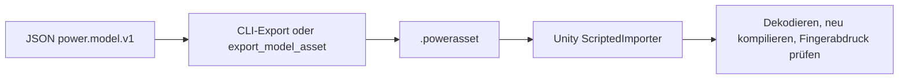

# Modell-Assets

[English](ASSET_FORMAT.md) · [简体中文](ASSET_FORMAT.zh-CN.md) · [Français](ASSET_FORMAT.fr.md) · [Русский](ASSET_FORMAT.ru.md) · [日本語](ASSET_FORMAT.ja.md) · [한국어](ASSET_FORMAT.ko.md) · **Deutsch** · [Español](ASSET_FORMAT.es.md) · [Italiano](ASSET_FORMAT.it.md) · [Português](ASSET_FORMAT.pt-BR.md)

JSON `power.model.v1` ist die Autoreneingabe. Eine Datei `.powerasset` trägt Modell- und Experimentdaten für andere Laufzeiten. `Power.Assets` hängt nicht von einer JSON-Bibliothek, von Unity oder einem Drittanbieterpaket ab und kompiliert mit dem Kern für .NET 10 und .NET Standard 2.1.

Der CLI-Befehl `export` und das MCP-Werkzeug `export_model_asset` verwenden denselben Encoder. Der Unity-`ScriptedImporter` importiert die Datei als `PowerModelAsset` und serialisiert nur die Datenbytes. Zur Laufzeit werden die Bytes dekodiert, das Modell wird erneut kompiliert, und es wird kein beliebiger Code und keine gespeicherte LU-Faktorisierung geladen. Die Standard-Assets erzeugt `tools/Build.cs`; sie lassen sich aus JSON neu bauen.

## Aktuelle Version 29

`liquid_fuel_tank.parameters.headspace` deklariert `capacity` in `m3` oder `l` und `gas_node`. Der Gasnode lässt `storage` aus: Volumen `capacity - liquid_mass / density`, ein Eigentümer und positives Volumen. Pumpe und Rücklauf setzen den vorgeschriebenen Reservoirdruck auf null; das endliche Gas bestimmt den Einlassdruck.

`vented-tank-liquid-cylinder` und `vented-tank-needle-cylinder` nutzen Tank 1513, Gas 1520 und Entlüftungseingang 960. Asset v29 speichert Geometrie und liest v1-v28. Analytische Arbeit/Ableitungen, unabhängige ODE-Konvergenz, Bilanzen, portable/MCP-Replay, Rollback und allokationsfreie Schritte bestehen.

| Identifier | Value |
|---|---|
| fingerprint_tag | 33 (headspace geometry) |
| fill_fraction_field | 88 |
| count_table_int32 | 40 |
| count_table_bytes | 160 |
| header_bytes | 238 + UTF-8 name length |
| liquid_tank_record_bytes | 48 |
| headspace_extension_bytes | 16 (capacity quantity + gas_node) |

[Tankgeometrie und endlicher Gasraum](TANK_HEADSPACE.de.md)

## Beibehaltene Version 28

`recirculating-liquid-cylinder` und `recirculating-needle-cylinder` behalten endlichen Kraftstoff, tatsächliche Einspritzung, Verdampfung und optionale Nadeldynamik. v28 speichert Verknüpfung/Wärmeanteil und liest v1-v27. Jeder Rücklauf fügt 8 Zustände innerhalb gleicher Grenzen hinzu.

| Identifier | Value |
|---|---|
| kind | 41 (`liquid_rail_return`) |
| fingerprint_tag | 32 |
| count_table_int32 | 40 |
| count_table_bytes | 160 |
| header_bytes | 238 + UTF-8 name length |
| liquid_return_record_bytes | 24 |

[LIQUID_FUEL_RETURN.de.md](LIQUID_FUEL_RETURN.de.md)

## Beibehaltene Version 27

v27 speichert Tank und Speisewahl und liest v1-v26. Jeder Tank fügt 4 Zustände innerhalb gleicher Grenzen hinzu. Unabhängiger Nass-Austausch, analytischer Leerdruck/Wellenenergie, Rückmischung, vollständige Bilanzen, rollback, Zweige und allokationsfreie Schritte sind geprüft.

| Identifier | Value |
|---|---|
| kind | 40 (`liquid_fuel_tank`) |
| fingerprint_tag | 31 |
| tank_state_field | 87 |
| count_table_int32 | 39 |
| count_table_bytes | 156 |
| header_bytes | 234 + UTF-8 name length |
| liquid_feed_record_bytes | 28 |
| liquid_tank_record_bytes | 32 |

[LIQUID_FUEL_TANK.de.md](LIQUID_FUEL_TANK.de.md)

## Beibehaltene Version 26

Der Encoder schreibt `power.asset.v26` und liest v1-v26. Es gibt 38 int32-Zähler (152 bytes); der Header umfasst 230 + UTF-8-Namenslänge bytes. Typ 39 ist `liquid_rail_feed`, Fingerprint-Tag 30. Ein 24-bytes-Datensatz speichert Index, Injektor-/Pumpen-IDs und Quellentemperatur. Typen und exklusiver Besitz werden geprüft; ein neu signiertes v25-Downgrade weist den neuen Typ zurück.

## Beibehaltene Version 25

Der Encoder schreibt `power.asset.v25` und liest v1-v25. Die Tabelle enthält 37 int32-Werte (148 bytes); der Header umfasst 226 + UTF-8-Namenslänge bytes. Typ 38 ist `at_controller`, mit Fingerprint-Tag 29. Jeder Datensatz hat 208 feste bytes plus 12 bytes je Route. Die Routenzahl ist 5 oder 6; die begrenzte Summe wird getrennt angegeben. Typen, Uhren, Einheiten, Eigentümer und Topologie werden geprüft. Ein neu signiertes v24-Downgrade weist den neuen Typ zurück.

## Beibehaltene Version 24

Der Encoder schreibt `power.asset.v24`; die Versionen 1 bis 24 bleiben lesbar.
Zähltabelle und Datensatzgrößen bleiben die von v23. Kind 37 ist `carrier_gear`:
seine Basisübersetzung ist endlich, vorzeichenbehaftet und von null verschieden; seine Zahnrad-Erweiterung von 8 Byte behält
Komponentenindex und den verschiedenen bewegten Träger. Typisierte Zählungen decken jede
Trägerverzahnung ab. Ein auf Digest neu versiegeltes Downgrade auf v23 lehnt die neue Art ab.

Trägerverzahnungen ergänzen Fingerabdruck-Tag 28, kompensierte Koordinaten, Konsistenz der Endpunktbedingung und begrenzte relative Projektionsverfeinerung mit
angesammelten Reaktionen. Gewöhnliche Rotordatensätze
behalten absolute Planetendrehung und die gesamte Bahnträgheit des Trägers. Eine authentische
reduzierte Ravigneaux-Fixture von v23 behält Digest und Fingerabdruck sowie exaktes hochgestuftes
Replay. Siehe [RESOLVED_PLANETS.de.md](RESOLVED_PLANETS.de.md).

## Erhaltene Version 23

Version 23 behält die Zähltabelle und die Datensatzgrößen von v22. Kind 36 ist
`double_pinion_planetary_gear`: die vorzeichenbehaftete Basisübersetzung und die bestehende Zahnraderweiterung von 8 Byte behalten den verschiedenen Träger. Zählungen und typisierte Abdeckung schließen die neue
Art ein. Ältere Versionen lehnen sie ab, einschließlich eines auf Digest neu versiegelten Downgrades auf v22.

Zusammengesetzte Modelle ergänzen Fingerabdruck-Tag 27, einschließlich kompensierter Koordinatenakkumulation. Ihre vollständige Zeile tritt in den gewöhnlichen
Vertrag für Reaktion, Phase und Replay ein; bestehende Modelle behalten vorhergehende Fingerabdrücke.
Eine authentische Fixture des geregelten DCT von v22 behält ihren Digest und exaktes hochgestuftes
Replay. Siehe [RAVIGNEAUX_TRANSMISSION.de.md](RAVIGNEAUX_TRANSMISSION.de.md).

## Erhaltene Version 22

Die Zähltabelle von Version 22
hat 35 Werte int32 (140 Byte); die Kopfgröße ist
`218 + UTF-8 name length`. Die DCT-Reglerzählung folgt den Betätigungszählungen von v21. Nach den Treiberdatensätzen ist jeder DCT-Datensatz 104 Byte: Komponentenindex int32;
Fahrzeug sowie IDs der ungeraden und geraden Kupplung uint32; acht Wähler-IDs uint32; Werte für Abtastung, Lösen,
Eingriff und Zeitüberschreitung uint64; und zwei Größen für die Synchronisationstoleranz
und die Richtungsdrehzahlgrenze.

Kind 35 ist `dct_controller`. Die Felder 73-79 sind angeforderter und tatsächlicher Gang, Wahl ungerade und gerade,
Schaltphase, Synchronisationsfehler und Regelfehler. Bestehende IDs
sind unverändert. Reglermodelle ergänzen Fingerabdruck-Tag 26 mit stabilen Pfaden,
Zeiten und Toleranzen. Anfangs gelöste Befehle, alleiniger Besitz, volle Topologie,
ganzzahlige Anforderung, begrenzte Zustandszählung und Zeitausrichtung werden bei der Kompilierung geprüft.
Gefälschte Downgrades auf v21 lehnen Reglerdatensätze und -arten ab. Ein authentischer DCT-Graph von v21
behält Digest und Fingerabdruck sowie hochgestuftes Replay derselben Laufzeit. Siehe
[DCT_CONTROL.de.md](DCT_CONTROL.de.md).

## Erhaltene Version 21

Bei Version 21 bleiben
die Zähltabelle von v20 und der Kopf `214 + UTF-8 name length` unverändert. Jeder Datensatz des Nadeltreibers ist 40 Byte: die Felder von v20 plus optionaler Schließhorizont uint64.
Ältere Treiberdatensätze sind 32 Byte und werden mit abgeschalteter Vorhersage dekodiert.

Vorhersagemodelle ergänzen Fingerabdruck-Tag 25 und Horizont-Nanosekunden; abgeschaltete Modelle
behalten vorherige Fingerabdrücke und Zustandshashes. Die Felder 69-72 sind vorhergesagte Kraftstoffmasse,
Vorhersage-Ticks, Abschaltzustand des Treibers und ausstehende Schließticks. Bestehende IDs
bleiben fest. Regeln für Horizont, Ausrichtung, Budget und Uhr gehören zur Kompilierung von Physik und Regelung.
Gefälschte Downgrades, die eine eingeschaltete Vorhersage entfernen, scheitern an der Fingerabdruckprüfung. Authentische Assets von v20 behalten ihre Digests und hochgestuftes Replay derselben Laufzeit. Siehe [CLOSURE_PREDICTION.de.md](CLOSURE_PREDICTION.de.md).

## Erhaltene Version 20

Bei Version 20 belegen
34 Zählungen int32 136 Byte; der Kopf ist `214 + UTF-8 name length` Byte.
Vier Zählungen nach der Zählung der Flüssigeinspritzer beschreiben Solenoide, Weganschläge,
optionale Einspritzernadeln und abgetastete Nadeltreiber. Nach der Flüssigkeitstabelle:

| Tabelle | Bytes | Daten |
|---|---:|---|
| Solenoid | 28 | Komponentenindex int32; Größen für Referenzposition und Induktivitätsgradient |
| Weganschlag | 40 | Komponentenindex int32; Größen für minimale und maximale Position und für Steifigkeit |
| Nadel | 32 | Komponentenindex des Einspritzers int32; Knoten-ID der Nadel uint32; Größen für geschlossen und voll geöffnet |
| Treiber | 32 | Komponentenindex int32; IDs von Einspritzer und Solenoid uint32; Periode uint64; Größe der Treiberspannung |

R, L und Anfangsstrom des Solenoids, Spannungseingabe und Wärmesenke verwenden Basisdatensätze.
Die Arten 32-34 sind `solenoid`, `travel_stop` und `needle_driver`; `HenryPerMeter` wird
an die Einheitenenumeration angehängt (`h_m`), und Feld 68 ist `copper_heat`. Bestehende IDs behalten
ihre Werte. Modelle mit Magnetik und Anschlag ergänzen Fingerabdruck-Tag 22, physische Nadelöffnung
ergänzt Tag 23, und Treiberdefinitionen ergänzen Tag 24. Parameter, stabile Verweise und
Abtastperioden gehen in den Fingerabdruck ein.

Typisierte begrenzte Datensätze, Einheiten, verschiedene Besitzer, vollständige Abdeckung und physische
Kompilierung bleiben erforderlich. Gefälschte Downgrades auf v19 lehnen Betätigungsarten ab; das Entfernen
einer Nadelerweiterung ändert den kompilierten Fingerabdruck. Eine authentische Flüssigkeitsfixture von v19 behält Digest und Fingerabdruck sowie hochgestuftes Replay derselben Laufzeit. Siehe
[NEEDLE_ACTUATION.de.md](NEEDLE_ACTUATION.de.md).

## Erhaltene Version 19

Bei Version 19 belegen
30 Zählungen int32 120 Byte; der Kopf ist `198 + UTF-8 name length` Byte.
Die Zählung der Flüssigeinspritzer folgt der Filmzählung von v18. Nach der Filmphasentabelle
belegt jeder Flüssigkeitsdatensatz 120 Byte: Index der Komponententabelle int32, ID des Zielfilms
uint32, Kurbel-ID uint32, dann neun Größen für Zyklus-, Start- und Dauerwinkel,
maximale Dosis, anfängliche Quellenmasse, Versorgungstemperatur, Dichte, anfänglichen absoluten
Druck und Drucknachgiebigkeit. Jede Größe ist double plus Einheit int32. Fläche und Beiwert der Düse
verwenden die bestehende Drosselerweiterung von 36 Byte.

Kind 31 ist `liquid_fuel_injector`; `KilogramPerCubicMeter` wird an die Einheitenenumeration angehängt, mit JSON-Namen `kg_m3`. Bestehende IDs von Domäne, Einheit und Ausgabe bleiben fest. Flüssigkeitsmodelle ergänzen Fingerabdruck-Tag 21, einschließlich stabiler Film- und Kurbel-IDs, Steuerung und Quelleneigenschaften. Begrenzte typisierte vollständige Abdeckung, Digest, Einheiten und physischer Besitz
sind erforderlich; gefälschte Downgrades auf v18 lehnen Flüssigeinspritzer ab. Eine authentische Filmfixture von v18 behält Digest und Fingerabdruck sowie hochgestuftes Replay derselben Laufzeit. Siehe
[LIQUID_FUEL_INJECTION.de.md](LIQUID_FUEL_INJECTION.de.md).

## Erhaltene Version 18

Bei Version 18 belegen
29 Zählungen int32 116 Byte; der Kopf ist `194 + UTF-8 name length` Byte.
Eine Filmzählung folgt der Kraftstoffeinspritzer-Zählung von v17. Nach den Einspritzerdatensätzen
belegt jeder Filmdatensatz 64 Byte: Index der Komponententabelle int32, dann anfängliche
Masse, Anfangstemperatur, spezifische Wärme der Flüssigkeit, Sättigungstemperatur und latente
innere Energie als fünf Größen (double plus Einheit int32). Leitwert und die
IDs von Empfänger und Wand bleiben im Basiskomponenten-Datensatz.

Kind 30 ist `fuel_film`; die Felder 66-67 sind kumulative verdampfte Kraftstoffmasse in kg und
Filmwandwärme in J. Bestehende IDs bleiben fest. Filmmodelle ergänzen Fingerabdruck-Tag 20,
einschließlich anfänglicher Phasenenergie, Flüssigkeitsmasse und der Phasenkonstanten. Typisierte vollständige
Abdeckung, begrenzte Zählungen und Länge, Digest, Einheiten und physische Kompilierung sind erforderlich.
Gefälschte Downgrades auf v17 lehnen Filme ab. Die authentische Fixture des dosierten Zylinders von v17 behält
Digest und Fingerabdruck sowie hochgestuftes Replay derselben Laufzeit. Siehe [FUEL_FILM.de.md](FUEL_FILM.de.md).

## Erhaltene Version 17

Bei Version 17 belegen
28 Zählungen int32 112 Byte; der Kopf ist `190 + UTF-8 name length` Byte.
Eine Einspritzerzählung folgt der Gaskolben-Zählung von v16. Nach der Gaskolbengeometrie
belegt jeder Einspritzerdatensatz 56 Byte: Index der Komponententabelle int32, ID der Steuerkurbel
uint32, dann Zyklus-, Start- und Dauerwinkel sowie maximale Dosis als vier Größen.
Fläche und Beiwert seiner Düse verwenden außerdem den bestehenden Gasdrossel-Datensatz von 36 Byte.
Die Basiseingabegröße trägt kg je Zyklus, nicht einen Öffnungsanteil.

Kind 29 ist `gas_fuel_injector`. Die Felder 63-65 sind angeforderte Zyklusdosis, gelieferte
Zyklusdosis und kumulativ gelieferter Kraftstoff in kg. Bestehende IDs bleiben fest. Diese
Modelle ergänzen Fingerabdruck-Tag 19 und behalten Kurbel-ID, Fenster und Dosisgrenze. Typisierte
vollständige Abdeckung, begrenzte Zählungen und Länge, Digest, Einheiten und verträgliche endliche
Ports sind erforderlich. Gefälschte Downgrades auf v16 lehnen Einspritzer ab. Authentische Gasakkumulator-Assets von v16 behalten Digest und Fingerabdruck sowie hochgestuftes Replay derselben Laufzeit.
Siehe [FUEL_METERING.de.md](FUEL_METERING.de.md).

## Erhaltene Version 16

Bei Version 16 belegen
27 Zählungen int32 108 Byte; der Kopf ist `186 + UTF-8 name length` Byte.
Die Zählung der linearen Gaskolben folgt der Schieberzählung von v15. Nach der Schiebergeometrie
belegt jeder Gaskolben-Datensatz 56 Byte: Index der Komponententabelle int32, Kompressionsrichtung int32 (+1 oder -1) und vier Größen für Fläche, Referenzvolumen,
Referenzposition und absoluten Referenzdruck. Jede Größe ist double plus
Einheit int32. Der Gasknoten verwendet den bestehenden Zusammensetzungsdatensatz und lässt festen Speicher weg.

Kind 28 ist `gas_piston`. Keine bestehende ID von Domäne, Einheit oder Ausgabe ändert sich. Diese Modelle ergänzen
Fingerabdruck-Tag 18, einschließlich Geometrie, Referenzwerten und Orientierung. Typisierte
vollständige Abdeckung, begrenzte Zählungen und Länge, Digest und physische Kompilierung bleiben
erforderlich; gefälschte Downgrades auf v15 lehnen Gaskolben ab. Die authentische Schieber-Fixture von v15
behält Digest, Fingerabdruck, physische Verweise und hochgestuftes Replay derselben Laufzeit.
Siehe [GAS_PISTON.de.md](GAS_PISTON.de.md).

## Erhaltene Version 15

Bei Version 15 belegen
26 Zählungen int32 104 Byte; der Kopf ist `182 + UTF-8 name length` Byte.
Eine Schieberventil-Zählung folgt den Kolben- und Kontaktzählungen von v14. Nach diesen Erweiterungstabellen belegt jeder Schieberdatensatz 32 Byte: Index der Komponententabelle int32, ID der referenzierten
Kolbenkomponente uint32, Größe der geschlossenen Position und Größe der voll geöffneten Position.
Jede Größe ist ein double-Wert plus Einheit int32. Strömungsparameter und Reservoirdruck bleiben im bestehenden Datensatz der hydraulischen Drossel von 40 Byte.

Kind 27 ist `hydraulic_spool_valve`; bestehende IDs, Einheiten und Ausgabefelder behalten
ihre Werte. Schiebermodelle ergänzen Fingerabdruck-Tag 17 sowie beide Steuerkantenpositionen und die Kolben-ID.
Typisierte vollständige Abdeckung, begrenzte Zählungen, Länge, Digest, Einheiten und Hubbesitz
werden geprüft. Gefälschte Downgrades auf v14 lehnen Schieberarten ab. Authentische Kolben-Assets von v14
behalten ihre Digests, Fingerabdrücke und hochgestuftes Replay derselben Laufzeit. Siehe
[HYDRAULIC_SPOOL.de.md](HYDRAULIC_SPOOL.de.md).

## Erhaltene Version 14

Die Zähltabelle von Version 14
enthält 25 Werte int32 (100 Byte). Zwei Zählungen nach den Zählungen von Batterie
und Tastverhältnisregelung von v13 beschreiben Hydraulikkolben und kontaktbetätigte Kupplungen.
Der Kopf ist `178 + UTF-8 name length` Byte. Nach der Tabelle der Tastverhältnisregler:

| Erweiterung | Bytes | Felder |
|---|---:|---|
| Hydraulikkolben | 104 | Index der Komponententabelle int32, ID des Rückknotens uint32; Vorder- und Rückfläche, Rückdruck, minimale und maximale Position, Anschlagsteifigkeit, Kontaktposition und Kontaktsteifigkeit als acht Größen |
| Kolbenkupplung | 40 | Index der Komponententabelle int32, ID der Kolbenkomponente uint32, Größe des wirksamen Radius, Haft- und Gleitbeiwerte als zwei doubles, Reibflächen uint32 |

Translatorische Masse, Geschwindigkeit und Position sowie Parameter von linearer Feder und Kraft verwenden die
bestehenden Basisdatensätze. Domäne 6 ist translatorisch. Die Arten 23-26 sind lineare Feder,
Hydraulikkolben, Kolbenkupplung und Kraftquelle. Die Einheiten 47-49 sind m/s, N/m und N*s/m;
die Felder 60-62 sind Weg, lineare Geschwindigkeit und Kraft. Kumulative Dämpfungswärme der Feder
verwendet das bestehende Feld 34. Kolben- und Kontaktmodelle ergänzen Fingerabdruck-Tag 16, mit
Hub, Belag, Rückgrenze, referenziertem Kolben und Reibgeometrie.

Begrenzte Zählungen, typisierte Indizes, verschiedene vollständige Erweiterungen, exakte Länge, Digest
und die Grenze von 1 MiB werden vor der Modellverwendung geprüft. Ältere Versionen lehnen die neue
Domäne und die neuen Arten ab, auch wenn Erweiterungsdatensätze entfernt und der Digest neu berechnet wird.
Der Compiler prüft SI-Einheiten, typisierte Ports, steigenden Hub, Belagspiel und
Reibordnung. Die authentische Fixture von v13 behält ihren ursprünglichen Digest und
hochgestuftes Replay derselben Laufzeit. Siehe [den Kolbenvertrag](HYDRAULIC_PISTON.de.md).

## Erhaltene Version 13

Version 13
hängt zwei Zählungen int32 an die Tabelle von v12 an: Batterien und Tastverhältnisregler. Ihr Kopf
ist `170 + UTF-8 name length` Byte. Nach den bestehenden Datensätzen des Spannungsreglers:

| Erweiterung | Bytes | Felder |
|---|---:|---|
| Batterie | 68 | Index der Knotentabelle int32, ID des Wärmeknotens uint32; Leerlaufspannung leer und voll, Serienwiderstand, Polarisationswiderstand und Kapazität als fünf Größen |
| Tastverhältnisregler | 80 | Index der Komponententabelle int32, Zielkanal uint64, Abtastperiode uint64; proportionale und integrale Verstärkung, Grenzen des Tastverhältnisses und Anfangsintegral als fünf Größen |

Batteriekapazität, Ladezustand und anfängliche Polarisationsspannung verwenden die bestehenden Knotenfelder.
Batteriemotoren und ohmsche Lasten behalten ihre Ports, RL-Parameter, Widerstand und
Öffnung oder Tastverhältnis in den Basiskomponenten-Datensätzen. Domäne 5 ist die Batterie; die Arten 20–22 sind Batteriemotor, ohmsche Last und Druck-Tastverhältnisregler. Die Einheiten 42–46 sind C, F, Ah,
fraction/Pa und fraction/(Pa·s); die Felder 53–59 sind Ladezustand, Ladung, Klemmen- und Polarisationsspannung, Batteriestrom, integrales Tastverhältnis und Befehlstastverhältnis. Vorherige Bezeichner bleiben fest.

Begrenzte typisierte Tabellen, exakte Abdeckung und Länge, Digest und Grenzen von 1 MiB bleiben. Alte Versionen
lehnen Batteriedomänen und neue Arten ab, auch nachdem ihre Erweiterungstabellen entfernt wurden.
Die Kompilierung prüft Ladungsgrenzen, Dimensionen, typisierte Quellen, Leerlaufspannungsordnung und Regelbesitz. Batteriemodelle ergänzen Fingerabdruck-Tag 14; die Tastverhältnisregelung ergänzt Tag 15. Vorherige Modelle
behalten ihre Fingerabdrücke. Authentische Fixtures von v12 und älter prüfen ursprüngliche Digests
und Replay derselben Laufzeit. Siehe [den Batterievertrag](HYDRAULIC_PUMP.de.md#finite-battery-supply-and-duty-regulation).

## Erhaltene Version 12

Version 12
hängt eine einundzwanzigste Zählung int32 für Druckregler-Datensätze an. Ihr Kopf ist
`162 + UTF-8 name length` Byte. Nach den Tabellen von Pumpe und Druckbegrenzung belegt jede Reglererweiterung 80 Byte:

| Daten | Kodierung |
|---|---|
| Index der Komponententabelle | int32, verschieden und mit Verweis auf Kind 19 (`pressure_controller`) |
| Besessener Zielspannungskanal | uint64 |
| Abtastperiode in Nanosekunden | uint64 |
| Proportionale Verstärkung, integrale Verstärkung, minimale und maximale Spannung, Anfangsintegral | Fünf Größen, jeweils double-Wert plus Einheit int32 |

Sensorknoten, Sollwertkanal und anfängliches Druckziel bleiben im Basiskomponentendatensatz. Eingaben und KPI-Prüfungen folgen der Reglertabelle. Exakte Länge, begrenzte Zählungen,
typisierte Indizes, vollständige Erweiterungsabdeckung, Digest und die Grenze von 1 MiB werden geprüft.
Gefälschte Downgrades auf v11 lehnen Reglerarten ab, auch nachdem ihre Datensätze entfernt wurden.
Die Kompilierung prüft Einheiten, Sensordomäne, Zielbesitz, Grenzen und am Tick ausgerichtete
Perioden. Die Einheiten 40/41 sind V/Pa und V/(Pa·s); die Felder 49–52 sind abgetasteter Druck, Druckfehler, Integralspannung und gehaltener Befehl. Bestehende Bezeichner behalten ihre Werte.

Geregelte Modelle ergänzen Fingerabdruck-Tag 13, einschließlich Abtastperiode, Zielkanal
und Anfangsintegral. Reglerhistorien werden durch Replay rekonstruiert und
nicht serialisiert. Ungeregelte Modelle behalten ihre Fingerabdrücke und Trajektorien. Die
authentische Fixture von v11 und alle vorherigen Fixtures bleiben unverändert. Siehe
[den Vertrag der Druckregelung](HYDRAULIC_PUMP.de.md#sampled-pressure-regulation).

## Erhaltene Version 11

Version 11
hängt Zählungen int32 für Pumpe und Druckbegrenzung an die achtzehn Zählungen von v10 an. Nach den bestehenden
Tabellen der hydraulischen Drossel und des Stellglieds kommen Pumpendatensätze von 32 Byte (Komponentenindex,
ID des Einlassknotens, Verdrängungsgröße, Größe des Reservoirdrucks), dann Datensätze der Druckbegrenzung von 16 Byte
(Komponentenindex und Größe des Öffnungsdrucks). Eine Druckbegrenzung hat außerdem den bestehenden
Drosseldatensatz von 40 Byte für Leitwert und Randdruck. Eingaben und Prüfungen
folgen diesen neuen Tabellen. Der Kopf ist `158 + UTF-8 name length` Byte.

Typisierte verschiedene Indizes, vollständige Datensätze je Art, exakte Länge, SHA-256 und begrenzte
Zählungen werden geprüft. Ältere Formate lehnen die Arten 17/18 (Pumpe/Druckbegrenzung) ab. Einheit 39 ist m³/rad;
Feld 48 ist vorzeichenbehaftete hydraulische Leistung. Pumpenarbeit verwendet Feld 44 an der Komponente erneut, während
Objekt null die externe hydraulische Arbeit behält. Modelle mit Pumpe oder Druckbegrenzung ergänzen Fingerabdruck-Tag 12;
Modelle ohne beides behalten ihre Fingerabdrücke. Eine authentische Hydraulik-Fixture von v10
prüft ihren ursprünglichen Digest und das Replay. Siehe [den Pumpenvertrag](HYDRAULIC_PUMP.de.md).

## Erhaltene Version 10

Version 10
hängt zwei Zählungen int32 nach den sechzehn Zählungen von v9 an: hydraulische Drosseln und hydraulische
Kupplungen. Die Hydraulikknoten-Domäne 4 verwendet den bestehenden Knotendatensatz von 44 Byte: Speicher ist
Nachgiebigkeit, der Anfangswert ist Überdruck, und die Position ist null/None. Ältere Formate
lehnen Hydraulikknoten ab, auch wenn keine Komponentenerweiterung vorhanden ist.

Nach der vollständigen Wandlertabelle variabler Länge kommen diese Datensätze fester Größe:

| Erweiterung | Bytes | Felder |
|---|---:|---|
| Hydraulische Drossel | 40 | Komponentenindex int32; Beiwert, Übergangsdruck und Reservoirdruck als drei Größen |
| Hydraulikkupplung | 64 | Komponentenindex int32, ID des Druckknotens uint32; Kolbenfläche, Vorspannkraft und Radius als Größen; Haft- und Gleitbeiwerte als doubles; Anzahl der Reibflächen uint32 |

Jede Art braucht genau eine verschiedene Erweiterung im gültigen Bereich. Gemeinsame rotatorische und hydraulische
Ports, Übersetzung, Ventileingabe und Wärmesenke bleiben im Basiskomponenten-Datensatz. Der Reservoirdruck wird explizit in der Drosselerweiterung getragen, einschließlich null/None für
interne Kanten. Geplante Eingaben und Prüfungen folgen beiden Hydrauliktabellen. Zählungen, exakte
Länge, SHA-256 und die Grenze von 1 MiB werden geprüft, bevor die Kompilierung Dimensionen,
Topologie und physikalische Bereiche validiert.

Die Arten 14–16 kennzeichnen lineare Drossel, turbulente Drossel und Druckkupplung.
Die Einheiten 34–38 ergänzen Nachgiebigkeit, lineare und turbulente Beiwerte, Volumenstrom und Kraft.
Die Felder 41–47 ergänzen Volumenstrom, Reservoirbestand, Bestandsresiduum, hydraulische Arbeit,
Klemmkraft und Haft- sowie Gleitkapazität. Bestehende Wärme- und Druckfelder werden wiederverwendet. Modelle
mit Hydraulikknoten ergänzen Fingerabdruck-Tag 11; hydraulikfreie Modelle behalten vorherige
Fingerabdrücke. Löserhistorien werden durch Replay rekonstruiert. Eine echte Wandlerfixture von v9 prüft ihren ursprünglichen Digest, Fingerabdruck und die hochgestufte Trajektorie. Siehe
[den Hydraulikvertrag](HYDRAULIC_NETWORK.de.md).

## Erhaltene Version 9

Version 9 hängte zwei Zählungen int32 nach den vierzehn Zählungen von v8 an: Wandlerkomponenten und gesamte
Kennfeldpunkte. Unterstützt werden höchstens acht Wandler und 32 Punkte in jedem von vier Kennfeldern.
Nach der Zahnradtabelle hat jeder Wandlerdatensatz einen Kopf von 20 Byte: Index der Komponententabelle
und vier Punktzählungen int32. Seine Punkte folgen unmittelbar, in der Reihenfolge Pumpe positiv,
Pumpe negativ, Turbine positiv, Turbine negativ. Jeder Punkt belegt 28 Byte:
Drehzahlverhältnis (double), Momentenverhältnis (double), Kapazitätsbeiwert (double + Einheit int32).
Der nächste Wandlerkopf folgt diesen Punkten. Geplante Eingaben und Prüfungen folgen allen
Wandlerdatensätzen. Knoten, Basiskomponenten und vorherige Erweiterungen behalten ihre Größen.

Exakte Größe, SHA-256, die Grenze von 1 MiB, alle aggregierten und je Kennfeld geltenden Zählungen, verschiedene typisierte Indizes
und die insgesamt verbrauchte Punktzahl werden geprüft. Die Kompilierung validiert danach Topologie,
Einheiten, stetige Grenzen des Referenzglieds und Passivität zwischen den Stützstellen. Fehlende,
doppelte, fehlerhafte, artfremde und herabgestufte Wandlerdatensätze werden abgelehnt.

Kind 13 kennzeichnet einen Wandler, Einheit 33 seinen Kapazitätsbeiwert, und die Felder 38–40 ergänzen
Fluidwärme, Drehzahlverhältnis und Code des Referenzglieds. Felder für Moment an B und C sowie Wärmestrom
werden wiederverwendet; das Moment an C ist die Reaktion des stillstehenden Stators ohne dritten Rotorport.
Wandlermodelle ergänzen Fingerabdruck-Tag 10 und alle normierten Kennfeldwerte. Löserfaktoren
und mittlere sowie kumulative Historien rekonstruiert das Replay. Authentische Fixtures von v1–v8
prüfen erhaltene Fingerabdrücke und Wiedergabe. Siehe [den Wandlervertrag](CONVERTER_NETWORK.de.md).

## Erhaltene Version 8

Version 8 hängte eine vierzehnte Zählung int32 für ideale Zahnradtopologie an. Nach der Kupplungs-Erweiterungstabelle enthält jeder Datensatz von 8 Byte den Index der Komponententabelle (int32) und die Trägerknoten-ID (uint32). Genau ein verschiedener Datensatz muss auf jede Komponente `IdealGear` oder
`PlanetaryGear` verweisen. Die Träger-ID ist null für ein ideales Paar und ein verschiedener
rotatorischer Knoten für einen Planetensatz. Knoten-IDs von A und B sowie die Übersetzung bleiben im unveränderten
Basisdatensatz von 156 Byte. Knoten bleiben 44 Byte, und vorherige Erweiterungsgrößen sind unverändert.

Die Zählungen sind der Reihe nach: Knoten, Komponenten, geplante Eingaben, Prüfungen, abgeschlossene Zylinder,
Gasknoten, Drosseln, bewegte Zylinder, Ventile, Gemische, Reservoiranteile, Brenner,
Kupplungen und Zahnräder. Exakte Nutzdatenlänge, SHA-256 und die Grenze von 1 MiB werden vor der
Kompilierung geprüft. Eingaben und KPI-Prüfungen folgen allen Erweiterungstabellen.

Die Kind-IDs 11/12 kennzeichnen ideale Zahnräder und Planetensätze. Die Felder 35/36/37 ergänzen Moment an B, Moment
an C und Phasenfehler; das Drehzahlresiduum des Zahnrads verwendet Feld 32 erneut. Ältere Bezeichner behalten
ihre Werte. Modelle mit Zahnrädern ergänzen Fingerabdruck-Tag 9, einschließlich des Trägerendpunkts;
zahnradfreie Fingerabdrücke sind unverändert. Die anfängliche relative Phase wird aus den Rotorwinkeln abgeleitet. Historie der mittleren Reaktion und Bedingungsfaktoren werden durch Replay rekonstruiert
und nicht als Löserzustand serialisiert.

Ungültige Ports oder Übersetzungen, abhängige Bedingungen, unverträgliche Anfangsdrehzahlen, sachfremde
physikalische Parameter, fehlende, doppelte oder artfremde Erweiterungen und gefälschte Downgrades werden
abgelehnt. Eine echte Fixture der gezündeten Kupplung von v7 bewahrt Digest, Modell-Fingerabdruck und
hochgestuftes Replay; Fixtures von v1–v6 bleiben. Siehe [gekoppelte Zahnräder](GEAR_NETWORK.de.md) und
[Fixture-Herkunft](../tests/Power.Tests/Fixtures/README.md).

## Erhaltene Version 7

Version 7 hängte eine dreizehnte Zählung int32 für Kupplungserweiterungen an. Nach der Verbrennungstabelle
enthält jeder Datensatz von 28 Byte einen Index der Komponententabelle und zwei Größen: Haft- und
Gleitmomentkapazität in Nm. Genau ein Datensatz muss auf jede Komponente `Clutch` verweisen,
mit verschiedenen Indizes im gültigen Bereich. Endpunkte von Boden und Rotor, Übersetzung, Eingriffseingabe und
Wärmeziel bleiben im unveränderten Basiskomponenten-Datensatz von 156 Byte.

Die Kompilierung validiert Einheiten, `static >= sliding >= 0`, Übersetzung, Topologie und Eingriff.
Fehlende, doppelte oder artfremde Erweiterungen, ungültige Kapazitäten, gefälschte Downgrade-Versuche
und Fingerabdruckänderungen werden abgelehnt. Knotendatensätze bleiben 44 Byte, und alle alten
Erweiterungsdatensätze behalten ihre Größen. Zählungen, exakte Größe, Digest und die Grenze von 1 MiB
werden vor der Kompilierung geprüft. Geplante Eingaben und Prüfungen folgen allen Erweiterungstabellen.

Kupplungsart 10, die Felder 32–34 (Schlupfdrehzahl, Modus, Reibungswärme) und Einheit 32 (`StateCode`)
werden angehängt, ohne ältere Bezeichner neu zu nummerieren. Das Modell enthält Fingerabdruck-Tag 8 nur, wenn Kupplungen vorhanden sind. Löserfaktoren, Phasenhistorie, mittlere Ausgaben und Wärmebilanzen werden durch Replay rekonstruiert; sie werden nicht serialisiert. Eine authentische gezündete Fixture von v6
prüft den unveränderten früheren Fingerabdruck und die hochgestufte Wiedergabe. Siehe
[gekoppelte Kupplungen](CLUTCH_NETWORK.de.md) und [Fixture-Herkunft](../tests/Power.Tests/Fixtures/README.md).

## Erhaltene Version 6

Version 6
ergänzt drei Zählungen int32 nach den neun Zählungen von v5, für Vormisch-Gaszusammensetzung,
Reservoiranteile und Verbrennungsparameter. Der Kopf hat daher zwölf Zählungen.
Nach der Steuertabelle folgen diese Erweiterungstabellen in dieser Reihenfolge:

| Erweiterung | Größe | Kodierung |
|---|---|---|
| Vormischgas | 40 Byte | Index der Gasknotentabelle (int32), Heizwert (Größe), stöchiometrisches Luft-Kraftstoff-Verhältnis (double), anfängliche Anteile von Kraftstoff und Frischluft (zwei doubles) |
| Reservoiranteile | 20 Byte | Index der Komponententabelle (int32), Anteile von Kraftstoff und Frischluft (zwei doubles) |
| Verbrennung | 56 Byte | Index der Komponententabelle (int32), Zyklus-, Start- und Dauerwinkel (drei Größen), Formexponent und Brennbeiwert (zwei doubles) |

Jede Tabelle verlangt verschiedene Indizes der passenden Art im gültigen Bereich. Genau ein
Brenndatensatz ist je Komponente `PremixedCombustion` erforderlich. Optionale Gemischdatensätze
werden gegen verbundene Gasknoten geprüft; Vormisch-Reservoirgrenzen verlangen
explizite Anteildatensätze. Zählungen und exakte Länge werden vor der Allokation der Deskriptorarrays geprüft, danach Topologie, Einheiten, Anteilsummen und Profilbedingungen. Das Entfernen
optionaler Zusammensetzung ändert die Semantik und lässt Kompilierung oder Modell-Fingerabdruck scheitern.

Der Basiskomponenten-Datensatz ist unverändert: Kurbel- und Gas-IDs sowie die Eingabe des Brennmultiplikators bleiben
dort. Neue Bezeichner für Art, Feld und Einheit werden angehängt; alte Bezeichner behalten ihre
Werte. Löserzustand, Bestandteilhistorien, irreversible Fronten und kumulative
Bilanzen werden nicht serialisiert; das Replay rekonstruiert sie aus dem Modell und den geplanten Eingaben.
Die authentische Fixture von v5 bewahrt den früheren Fingerabdruck des zeitgesteuerten Modells und das hochgestufte
Replay. Siehe [Vormischverbrennung](PREMIXED_COMBUSTION.de.md).

## Erhaltene Version 5

Version 5
ergänzt eine neunte Zählung int32 nach den Zählungen von v4: optionale Erweiterungen der Kurbelventilsteuerung.
Nach den Datensätzen des bewegten Zylinders enthält jeder Steuerdatensatz von 44 Byte:

| Daten | Kodierung |
|---|---|
| Index der Komponententabelle | int32, eindeutig und mit Verweis auf eine Gasdrossel |
| Kurbelknoten-ID | stabile ID uint32, mit Verweis auf einen rotatorischen Knoten |
| Zykluswinkel, Öffnungswinkel, Dauerwinkel | Drei Größen (jeweils double + Einheit int32) |

Die Steuerung ist an jeder Drossel optional. Zählungen, exakte Länge, Datensatztyp und Eindeutigkeit
werden geprüft, bevor die Kompilierung Einheiten, Zyklus, Phase und Dauer validiert. Das Entfernen eines
Steuerdatensatzes ändert die Modellsemantik und lässt die Prüfung des gespeicherten Fingerabdrucks scheitern. Zeitgesteuerte
Modelle ergänzen Fingerabdruck-Tag 6; Modelle ohne Steuerung behalten ihre vorherigen Fingerabdrücke. Eine authentische
Fixture von v4 prüft unverändertes Replay des bewegten Zylinders nach erneuter Kodierung. Eingaben, Prüfungen
und der SHA-256-Anhang folgen allen Erweiterungstabellen. Siehe [Steuerung](VALVE_TIMING.de.md).

## Erhaltene Version 4

Version 4
ergänzt eine achte Zählung int32 nach den sieben Zählungen von v3: Erweiterungen des bewegten Zylinders.
Nach den Erweiterungen von Gasknoten und Drossel aus v3 enthält jeder Datensatz des bewegten Zylinders:

| Daten | Kodierung |
|---|---|
| Index der Komponententabelle | int32; eindeutig, innerhalb der Grenzen und mit Verweis auf einen Gaszylinder |
| Bohrung, Hub, Pleuellänge und Phase | Vier Größen (jeweils double + Einheit int32) |
| Verdichtungsverhältnis | double |
| Gegendruck | Eine Größe |

Jeder Datensatz ist 72 Byte. Je Gaszylinder ist genau ein Datensatz erforderlich. Sein Gasknoten
speichert Anfangstemperatur, Druck und Zusammensetzung in den bestehenden Feldern; seine Speichergröße ist null/None, weil die Geometrie das Volumen liefert. Der Leser liefert kein Anfangsvolumen und keinen Gaszustand still. Alte Versionen lehnen die neue Komponente ab.
Besitz des Zylinders, Topologie und Dimensionen prüft die Kompilierung, bevor der
Fingerabdruck akzeptiert wird. Die Grenzen von Quelle, Digest, Größe und Zeitplan sind unverändert.

## Erhaltene Version 3 und frühere Leser

Version 3 führte Unterstützung für festes Gasvolumen ein. Sie behält die Basistabellen von Knoten und Komponente und die Zylindererweiterungen von v2. Der
Zählkopf enthält sieben Werte int32, der Reihe nach: Knoten, Komponenten, geplante Eingaben,
Prüfungen, Zylinder, Gasknoten und Gasdrosseln. Nach den Basistabellen und den Zylindererweiterungen kommen diese Datensätze:

| Erweiterung | Größe | Kodierung |
|---|---|---|
| Gaszusammensetzung | 24 Byte | Index der Knotentabelle (int32), spezifische Gaskonstante (Größe), Gamma (double) |
| Gasdrossel | 36 Byte | Index der Komponententabelle (int32), Fläche (Größe), Durchflussbeiwert (double), Reservoirdruck (Größe) |

Eine Größe ist ein double, gefolgt von einem Einheitenbezeichner int32. Die Basisknotentabelle behält
Volumen, Anfangstemperatur und Anfangsdruck. Die Basiskomponententabelle behält
Öffnung, Kanal, Endpunkte, Wandleitwert und Reservoirtemperatur (das bestehende
Feld `AmbientTemperature`). Gas-Wand-Verbindungen brauchen keine Erweiterung. Datensätze verweisen auf sortierte
Tabellenindizes, nicht auf Objekt-IDs.

Jeder Gasknoten, jede Drossel und jeder Zylinder verlangt genau eine Erweiterung seines eigenen Typs.
Unbekannte Versionen, ungültige Zählungen, falsche Längen, doppelte, fehlende oder typfremde
Erweiterungen, fehlerhafte Prüfsummen und abweichende Modell-Fingerabdrücke werden abgelehnt. Zählungen und
exakte Länge werden vor der Allokation der Deskriptorarrays geprüft. Die Grenze von 1 MiB gilt
für die ganze Datei, einschließlich ihres abschließenden SHA-256-Digests. Geplante Öffnungen werden
in [0, 1] validiert, bevor das Asset erzeugt oder exportiert wird.

Alte Leser für v1/v2 bleiben für ihre ursprünglichen Modellsätze erhalten; Gasdomänen und Gaskomponenten
verlangen v3. Authentische Fixtures von v1 und Zylinder-v2 in [Fixtures](../tests/Power.Tests/Fixtures/README.md)
üben Dekodierung und hochgestuftes Replay. Lösersemantik und Modell-Fingerabdrücke bleiben
durch diese Formatrevision unverändert.

## Erhaltene Version 2 und Kompatibilität mit Version 1

Version 2 bewahrt die Basistabellen von Knoten und Komponente und ergänzt nach den ursprünglichen vier Zählungen eine fünfte Zählung int32: die Anzahl der Zylindererweiterungen. Nach der Basiskomponententabelle belegt jede Erweiterung 116 Byte:

| Daten | Kodierung |
|---|---|
| Index der Komponententabelle | int32, eindeutig, innerhalb der Grenzen, mit Verweis auf einen abgeschlossenen Zylinder |
| Bohrung, Hub, Pleuellänge, Phase | Vier Größen, jeweils double-Wert + Einheit int32 |
| Verdichtungsverhältnis | double |
| Anfangsdruck, Anfangstemperatur, spezifische Gaskonstante | Drei Größen |
| Gamma | double |
| Gegendruck | Eine Größe |

Eingaben, Prüfungen und der SHA-256-Anhang folgen den Erweiterungen. Der Dekodierer validiert begrenzte Zählungen und exakte Länge, bevor er Deskriptorarrays allokiert; er lehnt doppelte oder nicht passende Erweiterungen ab. Die Kompilierung verlangt genau einen Parameterdatensatz für jeden abgeschlossenen Zylinder. Die erweiterten Enumerationen von Einheit und Feld hängen Werte an, ohne bestehende Bezeichner zu ändern.

Version 1 hat keine Erweiterungszählung und keine Erweiterungsdatensätze. Modelle, die nur bestehende lineare Komponenten verwenden, behalten Löserversion 2 und ihre Fingerabdrücke, sodass bestehende Assets von v1 dekodiert und abgespielt werden können. Modelle mit abgeschlossenen Zylindern verwenden Löserversion 3. Die unveränderliche [Fixture v1](../tests/Power.Tests/Fixtures/README.md) prüft die Kompatibilität gegen einen echten Export von vor der Änderung.

## Erhaltenes Layout von Version 1

Jede Ganzzahl und jeder IEEE-754-Wert binary64 ist Little-Endian. Eine Datei ist höchstens 1 MiB. Zeichenketten sind striktes UTF-8.

| Reihenfolge | Daten |
|---|---|
| Identität | 8 ASCII-Bytes `POWERAST`, dann Formatversion int32 `1` |
| Modell und Zeit | Modell-Fingerabdruck uint64, Tick-Nanosekunden, Experimentdauer, Abtastintervall |
| Herkunft | Zählung der Namensbytes uint16, der Name, SHA-256 der Quell-JSON mit 32 Byte |
| Zählungen | Vier Werte int32: Knoten, Komponenten, Eingabeänderungen, KPIs |
| Deskriptoren | 44 Byte je Knoten und 156 Byte je Komponente, sortiert nach Objekt-ID |
| Eingaben | 24 Byte je Änderung: Zeit uint64, Kanal uint64, Wert double |
| KPIs | je 33 Byte: Objekt uint32, Feld int32, ein Byte für die Grenzmarkierung, drei double-Grenzen |
| Integrität | SHA-256 jedes vorhergehenden Bytes, 32 Byte |

Die Feldreihenfolge von Knoten und Komponente folgt dem Codec von Version 1 in `src/Power.Assets/AssetCodec.cs`. Zählungen, die exakte Dateilänge und der Digest werden geprüft, bevor Deskriptorarrays allokiert werden. Einheiten, Topologie, Zeit, Ereignisse und KPIs werden als Nächstes validiert, und der Fingerabdruck wird mit dem Modell verglichen, das der aktuelle Löser kompiliert. Eine Abweichung braucht einen neuen Export.

Ein Name hat höchstens 128 Codeeinheiten UTF-16 und enthält keine Steuerzeichen. Ein Modell ist auf 32 Knoten, 64 Komponenten und 128 Zustände begrenzt. Ein Experiment dauert höchstens eine Stunde, zehn Millionen Ticks, 10,000 Eingabezeiten, 65,536 Eingabeänderungen und 256 KPIs. Der ganzzahlige Quotient `duration / sample_every` darf 10,000 nicht überschreiten, und die Dateigrenze von 1 MiB gilt weiterhin. Ereignisse liegen in `[0, duration)`, sind nach absoluter Zeit geordnet, am Tick ausgerichtet und wiederholen einen Kanal zu einem Zeitpunkt nicht.

Der abschließende Digest erkennt Beschädigung. Er ist keine Herkunftsauthentisierung. `asset_sha256` in einem Exportergebnis ist der Digest der ganzen Datei, einschließlich dieses abschließenden Feldes. `source_sha256` kennzeichnet das Autorendokument. Der Modell-Fingerabdruck kennzeichnet die kompilierte Semantik. Erneutes Exportieren nach einer Schrittänderung kann den ursprünglichen Quelldigest behalten und den Modell-Fingerabdruck dennoch ändern. Synthetische Parameter bleiben `unverified`.

`AssetPlayback` wendet die Anfangsereignisse zur Zeit null an und verwendet den atomaren Ereignis-Batch des Kerns innerhalb jedes `Advance`. Fehler und Abbruch behalten Zeit, Zustand und den Ereigniscursor. Ein Aufruf rückt höchstens eine Million Ticks vor. Der Aufrufer teilt längere Läufe. Berichtsgrenzen der CLI, Asset-Wiedergabe und ein lebendiger MCP-Export wurden gegeneinander geprüft. Nachweise der Ausführung in Unity-Editor, Mono und IL2CPP stehen noch aus.
