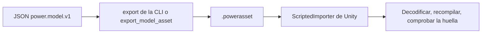

# Assets de modelo

[English](ASSET_FORMAT.md) · [简体中文](ASSET_FORMAT.zh-CN.md) · [Français](ASSET_FORMAT.fr.md) · [Русский](ASSET_FORMAT.ru.md) · [日本語](ASSET_FORMAT.ja.md) · [한국어](ASSET_FORMAT.ko.md) · [Deutsch](ASSET_FORMAT.de.md) · **Español** · [Italiano](ASSET_FORMAT.it.md) · [Português](ASSET_FORMAT.pt-BR.md)

El JSON `power.model.v1` es la entrada de autoría. Un archivo `.powerasset` lleva los datos del modelo y del experimento para otros runtimes. `Power.Assets` no depende de una biblioteca JSON, de Unity ni de un paquete de terceros, y se compila con el núcleo para .NET 10 y .NET Standard 2.1.

El comando `export` de la CLI y la herramienta MCP `export_model_asset` usan el mismo codificador. El `ScriptedImporter` de Unity importa el archivo como un `PowerModelAsset` y serializa solo los bytes de datos. En tiempo de ejecución los bytes se decodifican, el modelo se compila de nuevo y no se carga código arbitrario ni una factorización LU almacenada. Los assets por defecto los produce `tools/Build.cs` y se pueden reconstruir desde JSON.

## Versión actual 27

v27 conserva tanque y selección y lee v1-v26. Cada tanque añade 4 estados dentro de las mismas cotas. Se verifican intercambio húmedo independiente, presión/energía de eje agotadas analíticas, mezcla de retorno, balances completos, rollback, ramas y pasos sin asignación.

| Identifier | Value |
|---|---|
| kind | 40 (`liquid_fuel_tank`) |
| fingerprint_tag | 31 |
| tank_state_field | 87 |
| count_table_int32 | 39 |
| count_table_bytes | 156 |
| header_bytes | 234 + UTF-8 name length |
| liquid_feed_record_bytes | 28 |
| liquid_tank_record_bytes | 32 |

[LIQUID_FUEL_TANK.es.md](LIQUID_FUEL_TANK.es.md)

## Versión 26 conservada

El codificador escribe `power.asset.v26` y lee v1-v26. Hay 38 cuentas int32 (152 bytes); la cabecera ocupa 230 + longitud del nombre UTF-8 bytes. El tipo 39 es `liquid_rail_feed`, etiqueta de huella 30. Un registro de 24 bytes guarda índice, IDs inyector/bomba y temperatura fuente. Se comprueban tipos y propiedad exclusiva; una reducción v25 firmada de nuevo rechaza el tipo nuevo.

## Versión 25 conservada

El codificador escribe `power.asset.v25` y lee v1-v25. La tabla contiene 37 valores int32 (148 bytes); la cabecera ocupa 226 + longitud del nombre UTF-8 bytes. El tipo 38 es `at_controller`, con etiqueta de huella 29. Cada registro tiene 208 bytes fijos más 12 bytes por ruta. Las rutas son 5 o 6; el total limitado se declara por separado. Se comprueban tipos, relojes, unidades, propiedad y topología. Una reducción a v24 con digest firmado de nuevo rechaza el tipo nuevo.

## Versión 24 conservada

El codificador escribe `power.asset.v24`; las versiones 1 a 24 siguen siendo legibles.
La tabla de recuentos y los tamaños de registro siguen siendo los de v23. El tipo 37 es `carrier_gear`:
su relación base es finita, con signo y distinta de cero; su extensión de engranaje de 8 bytes conserva
el índice de componente y el portasatélites móvil distinto. Los recuentos tipados cubren cada
engrane de portasatélites. Una degradación v23 resellada por resumen rechaza el tipo nuevo.

Los engranes de portasatélites añaden la etiqueta de huella 28, coordenadas compensadas, coherencia
de la restricción de extremos y un refinamiento acotado de la proyección relativa con
reacciones acumuladas. Los registros de rotor simple
conservan el giro absoluto de los satélites y la inercia orbital total del portasatélites. Un fixture
auténtico Ravigneaux reducido de v23 conserva su resumen, su huella y la repetición exacta
tras la actualización. Consulta [RESOLVED_PLANETS.es.md](RESOLVED_PLANETS.es.md).

## Versión 23 conservada

La versión 23 conserva la tabla de recuentos y los tamaños de registro de v22. El tipo 36 es
`double_pinion_planetary_gear`: la relación base con signo y la extensión de engranaje existente de 8 bytes
conservan el portasatélites distinto. Los recuentos y la cobertura tipada incluyen el tipo
nuevo. Las versiones anteriores lo rechazan, incluida una degradación v22 resellada por resumen.

Los modelos compuestos añaden la etiqueta de huella 27, incluida la acumulación de coordenadas
compensadas. Su fila completa entra en el contrato ordinario
de reacción, fase y repetición; los modelos existentes conservan las huellas precedentes.
Un fixture auténtico de DCT controlado de v22 conserva su resumen y la repetición exacta
tras la actualización. Consulta [RAVIGNEAUX_TRANSMISSION.es.md](RAVIGNEAUX_TRANSMISSION.es.md).

## Versión 22 conservada

La tabla de recuentos de la versión 22
tiene 35 valores int32 (140 bytes); el tamaño de la cabecera es
`218 + UTF-8 name length`. El recuento del controlador DCT sigue a los recuentos de actuación
de v21. Después de los registros de accionamiento, cada registro DCT ocupa 104 bytes: índice de componente int32;
IDs uint32 del vehículo y de los embragues impar y par; ocho IDs de selector uint32; valores uint64 de muestra, liberación,
acoplamiento y tiempo de espera; y dos cantidades para la tolerancia de sincronización
y el límite de velocidad de dirección.

El tipo 35 es `dct_controller`. Los campos 73-79 son la marcha solicitada y la real, la selección
impar y par, la fase del cambio, el error de sincronización y el fallo de control. Los IDs existentes
no cambian. Los modelos de controlador añaden la etiqueta de huella 26, con rutas estables,
temporización y tolerancias. En la compilación se comprueban los comandos iniciales liberados, la propiedad única, la topología
completa, la solicitud entera, el recuento de estado acotado y la alineación de la temporización.
Las degradaciones v21 falsificadas rechazan los registros y los tipos de controlador. Un grafo DCT auténtico de v21
conserva su resumen, su huella y la repetición en el mismo runtime tras la actualización. Consulta
[DCT_CONTROL.es.md](DCT_CONTROL.es.md).

## Versión 21 conservada

La tabla de recuentos v20 de la versión 21
y la cabecera `214 + UTF-8 name length` no cambian. Cada registro de accionamiento
de aguja ocupa 40 bytes: los campos de v20 más el horizonte de cierre opcional uint64.
Los registros de accionamiento anteriores ocupan 32 bytes y se decodifican con la predicción desactivada.

Los modelos de predicción añaden la etiqueta de huella 25 y los nanosegundos de horizonte; los modelos desactivados
conservan las huellas y los hashes de estado anteriores. Los campos 69-72 son la masa de combustible predicha,
los ticks de predicción, el estado de corte del accionamiento y los ticks de cierre pendientes. Los IDs existentes
siguen fijos. Las reglas de horizonte, alineación, presupuesto y reloj pertenecen a la compilación
física y de control. Las degradaciones falsificadas que eliminan una predicción habilitada fallan la validación
de la huella. Los assets auténticos de v20 conservan sus resúmenes y la repetición en el mismo runtime
tras la actualización. Consulta [CLOSURE_PREDICTION.es.md](CLOSURE_PREDICTION.es.md).

## Versión 20 conservada

Los 34 recuentos int32 de la versión 20
ocupan 136 bytes; la cabecera ocupa `214 + UTF-8 name length` bytes.
Cuatro recuentos después del recuento de inyectores líquidos describen solenoides, topes de carrera,
agujas de inyector opcionales y accionamientos de aguja muestreados. Después de la tabla de líquido:

| Tabla | Bytes | Datos |
|---|---:|---|
| Solenoide | 28 | Índice de componente int32; cantidades de posición de referencia y de gradiente de inductancia |
| Tope de carrera | 40 | Índice de componente int32; cantidades de posición mínima y máxima, y de rigidez |
| Aguja | 32 | Índice de componente del inyector int32; ID del nodo de aguja uint32; cantidades de cierre y de apertura total |
| Accionamiento | 32 | Índice de componente int32; IDs de inyector y solenoide uint32; periodo uint64; cantidad de voltaje de accionamiento |

R, L y la corriente inicial del solenoide, la entrada de voltaje y el sumidero térmico usan registros base.
Los tipos 32-34 son `solenoid`, `travel_stop` y `needle_driver`; `HenryPerMeter` se
añade a la enumeración de unidades (`h_m`), y el campo 68 es `copper_heat`. Los IDs existentes conservan
sus valores. Los modelos magnéticos y de tope añaden la etiqueta de huella 22, la apertura física de la aguja
añade la etiqueta 23 y las definiciones de accionamiento añaden la etiqueta 24. Los parámetros, las referencias estables y
los periodos de muestreo entran en la huella.

Siguen siendo exigidos los registros tipados y acotados, las unidades, los propietarios distintos, la cobertura completa y la
compilación física. Las degradaciones v19 falsificadas rechazan los tipos de actuación; quitar
una extensión de aguja cambia la huella compilada. Un fixture líquido auténtico de v19
conserva su resumen, su huella y la repetición en el mismo runtime tras la actualización. Consulta
[NEEDLE_ACTUATION.es.md](NEEDLE_ACTUATION.es.md).

## Versión 19 conservada

Los 30 recuentos int32 de la versión 19
ocupan 120 bytes; la cabecera ocupa `198 + UTF-8 name length` bytes.
El recuento de inyectores líquidos sigue al recuento de películas de v18. Después de la tabla de fase de la película,
cada registro líquido ocupa 120 bytes: índice de la tabla de componentes int32, ID de la película objetivo
uint32, ID del cigüeñal uint32 y después nueve cantidades para los ángulos de ciclo, inicio y duración,
la dosis máxima, la masa inicial de la fuente, la temperatura de suministro, la densidad, la presión absoluta
inicial y la flexibilidad de presión. Cada cantidad es un double más una unidad int32. El área
y el coeficiente de la tobera usan la extensión de orificio existente de 36 bytes.

El tipo 31 es `liquid_fuel_injector`; `KilogramPerCubicMeter` se añade a la enumeración de
unidades, con nombre JSON `kg_m3`. Los IDs existentes de dominio, unidad y salida siguen fijos. Los modelos
líquidos añaden la etiqueta de huella 21, incluidos los IDs estables de película y cigüeñal, la temporización y las propiedades
de la fuente. Son exigidos la cobertura completa tipada y acotada, el resumen, las unidades y la propiedad física;
las degradaciones v18 falsificadas rechazan los inyectores líquidos. Un fixture de película auténtico de v18
conserva el resumen, la huella y la repetición en el mismo runtime tras la actualización. Consulta
[LIQUID_FUEL_INJECTION.es.md](LIQUID_FUEL_INJECTION.es.md).

## Versión 18 conservada

Los 29 recuentos int32 de la versión 18
ocupan 116 bytes; la cabecera ocupa `194 + UTF-8 name length` bytes.
Un recuento de películas sigue al recuento de inyectores de combustible de v17. Después de los registros de inyector,
cada registro de película ocupa 64 bytes: índice de la tabla de componentes int32 y después la masa
inicial, la temperatura inicial, el calor específico del líquido, la temperatura de saturación y la energía
interna latente como cinco cantidades (double más unidad int32). La conductancia y los
IDs de receptor y de pared permanecen en el registro de componente base.

El tipo 30 es `fuel_film`; los campos 66-67 son la masa de combustible evaporado acumulada en kg y
el calor de pared de la película en J. Los IDs existentes siguen fijos. Los modelos de película añaden la etiqueta de huella 20,
incluidas la energía de fase inicial, la masa líquida y las constantes de fase. Son exigidos la cobertura
completa tipada, los recuentos y la longitud acotados, el resumen, las unidades y la compilación física.
Las degradaciones v17 falsificadas rechazan las películas. El fixture auténtico de cilindro dosificado de v17 conserva
su resumen, su huella y la repetición en el mismo runtime tras la actualización. Consulta [FUEL_FILM.es.md](FUEL_FILM.es.md).

## Versión 17 conservada

Los 28 recuentos int32 de la versión 17
ocupan 112 bytes; la cabecera ocupa `190 + UTF-8 name length` bytes.
Un recuento de inyectores sigue al recuento de pistones de gas de v16. Después de la geometría del pistón de gas,
cada registro de inyector ocupa 56 bytes: índice de la tabla de componentes int32, ID del cigüeñal
de temporización uint32 y después los ángulos de ciclo, inicio y duración, y la dosis máxima, como cuatro cantidades.
Su área y su coeficiente de tobera usan también el registro de orificio de gas existente de 36 bytes.
La cantidad de entrada base lleva kg por ciclo, en lugar de una fracción de apertura.

El tipo 29 es `gas_fuel_injector`. Los campos 63-65 son la dosis de ciclo solicitada, la dosis
de ciclo entregada y el combustible entregado acumulado en kg. Los IDs existentes siguen fijos. Estos
modelos añaden la etiqueta de huella 19, y conservan el ID del cigüeñal, la ventana y el límite de dosis. Son exigidos la cobertura
completa tipada, los recuentos y la longitud acotados, el resumen, las unidades y puertos finitos
compatibles. Las degradaciones v16 falsificadas rechazan los inyectores. Los assets auténticos de acumulador
de gas de v16 conservan el resumen, la huella y la repetición en el mismo runtime tras la actualización.
Consulta [FUEL_METERING.es.md](FUEL_METERING.es.md).

## Versión 16 conservada

Los 27 recuentos int32 de la versión 16
ocupan 108 bytes; la cabecera ocupa `186 + UTF-8 name length` bytes.
El recuento de pistones de gas lineales sigue al recuento de correderas de v15. Después de la geometría de la corredera,
cada registro de pistón de gas ocupa 56 bytes: índice de la tabla de componentes int32, dirección de
compresión int32 (+1 o -1) y cuatro cantidades para el área, el volumen de referencia,
la posición de referencia y la presión de referencia absoluta. Cada cantidad es un double más una
unidad int32. El nodo de gas usa el registro de composición existente y omite el almacenamiento fijo.

El tipo 28 es `gas_piston`. No cambia ningún ID existente de dominio, unidad o salida. Estos modelos añaden
la etiqueta de huella 18, incluidos los valores de geometría y referencia, y la orientación. Siguen siendo
exigidos la cobertura completa tipada, los recuentos y la longitud acotados, el resumen y la compilación física;
las degradaciones v15 falsificadas rechazan los pistones de gas. El fixture de corredera auténtico de v15
conserva su resumen, su huella, sus referencias físicas y la repetición en el mismo runtime
tras la actualización. Consulta [GAS_PISTON.es.md](GAS_PISTON.es.md).

## Versión 15 conservada

Los 26 recuentos int32 de la versión 15
ocupan 104 bytes; la cabecera ocupa `182 + UTF-8 name length` bytes.
Un recuento de válvulas de corredera sigue a los recuentos de pistón y de contacto de v14. Después de esas tablas
de extensión, cada registro de corredera ocupa 32 bytes: índice de la tabla de componentes int32, ID del
componente de pistón referenciado uint32, cantidad de posición cerrada y cantidad de posición de apertura total.
Cada cantidad es un valor double más una unidad int32. Los parámetros de caudal y la presión del depósito
permanecen en el registro de restricción hidráulica existente de 40 bytes.

El tipo 27 es `hydraulic_spool_valve`; los IDs, las unidades y los campos de salida existentes conservan
sus valores. Los modelos de corredera añaden la etiqueta de huella 17 y ambas posiciones de escalón y el ID del pistón.
Se comprueban la cobertura completa tipada, los recuentos acotados, la longitud, el resumen, las unidades y la propiedad de la carrera.
Las degradaciones falsificadas a v14 rechazan los tipos de corredera. Los assets de pistón auténticos de v14
conservan sus resúmenes, sus huellas y la repetición en el mismo runtime tras la actualización. Consulta
[HYDRAULIC_SPOOL.es.md](HYDRAULIC_SPOOL.es.md).

## Versión 14 conservada

La tabla de recuentos de la versión 14
contiene 25 valores int32 (100 bytes). Dos recuentos después de los recuentos de batería
y de control de ciclo de trabajo de v13 describen pistones hidráulicos y embragues accionados por contacto.
La cabecera ocupa `178 + UTF-8 name length` bytes. Después de la tabla del controlador de ciclo de trabajo:

| Extensión | Bytes | Campos |
|---|---:|---|
| Pistón hidráulico | 104 | Índice de la tabla de componentes int32, ID del nodo trasero uint32; áreas delantera y trasera, presión trasera, posición mínima y máxima, rigidez del tope, posición y rigidez de contacto, como ocho cantidades |
| Embrague de pistón | 40 | Índice de la tabla de componentes int32, ID del componente de pistón uint32, cantidad de radio efectivo, coeficientes estático y deslizante como dos doubles, superficies de fricción uint32 |

La masa, la velocidad y la posición de traslación, y los parámetros del resorte lineal y de la fuerza, usan los
registros base existentes. El dominio 6 es de traslación. Los tipos 23-26 son resorte lineal,
pistón hidráulico, embrague de pistón y fuente de fuerza. Las unidades 47-49 son m/s, N/m y N*s/m;
los campos 60-62 son desplazamiento, velocidad lineal y fuerza. El calor acumulado de amortiguación
del resorte usa el campo 34 existente. Los modelos de pistón y de contacto añaden la etiqueta de huella 16, con
la carrera, la pastilla, la frontera trasera, el pistón referenciado y la geometría de fricción incluidos.

Antes de usar el modelo se comprueban los recuentos acotados, los índices tipados, las extensiones completas y distintas, la longitud exacta, el resumen
y el límite de 1 MiB. Las versiones anteriores rechazan el dominio y los tipos nuevos
incluso cuando se retiran los registros de extensión y se recalcula el resumen.
El compilador comprueba las unidades SI, los puertos tipados, la carrera creciente, la holgura de la pastilla y
el orden de la fricción. El fixture auténtico de v13 conserva su resumen original y
la repetición en el mismo runtime tras la actualización. Consulta [el contrato del pistón](HYDRAULIC_PISTON.es.md).

## Versión 13 conservada

La versión 13
añade dos recuentos int32 a la tabla de v12: baterías y controladores de ciclo de trabajo. Su cabecera
ocupa `170 + UTF-8 name length` bytes. Después de los registros existentes del controlador de voltaje:

| Extensión | Bytes | Campos |
|---|---:|---|
| Batería | 68 | Índice de la tabla de nodos int32, ID del nodo de calor uint32; OCV en vacío y a plena carga, resistencia en serie, resistencia de polarización y capacitancia, como cinco cantidades |
| Controlador de ciclo de trabajo | 80 | Índice de la tabla de componentes int32, canal objetivo uint64, periodo de muestra uint64; ganancias proporcional e integral, cotas de ciclo de trabajo e integral inicial, como cinco cantidades |

La capacidad de la batería, el SOC y el voltaje inicial de polarización usan los campos de nodo existentes.
Los motores de batería y las cargas resistivas conservan sus puertos, parámetros RL, resistencia y
apertura o ciclo de trabajo en los registros de componente base. El dominio 5 es de batería; los tipos 20–22 son motor de batería,
carga resistiva y controlador de ciclo de trabajo de presión. Las unidades 42–46 son C, F, Ah,
fraction/Pa y fraction/(Pa·s); los campos 53–59 son SOC, carga, voltaje de terminal y de polarización,
corriente de batería, ciclo de trabajo integral y ciclo de trabajo comandado. Los identificadores anteriores siguen fijos.

Se mantienen las tablas tipadas y acotadas, la cobertura y la longitud exactas, el resumen y los límites de 1 MiB. Las versiones antiguas
rechazan los dominios de batería y los tipos nuevos incluso después de retirar sus tablas de extensión.
La compilación comprueba las cotas de carga, las dimensiones, las fuentes tipadas, el orden de la OCV y la propiedad
del control. Los modelos de batería añaden la etiqueta de huella 14; el control de ciclo de trabajo añade la etiqueta 15. Los modelos anteriores
conservan sus huellas. Los fixtures auténticos de v12 y anteriores verifican los resúmenes originales
y la repetición en el mismo runtime. Consulta [el contrato de la batería](HYDRAULIC_PUMP.es.md#finite-battery-supply-and-duty-regulation).

## Versión 12 conservada

La versión 12
añade un vigesimoprimer recuento int32 para los registros del controlador de presión. Su cabecera ocupa
`162 + UTF-8 name length` bytes. Después de las tablas de bomba y de alivio, cada extensión
de controlador ocupa 80 bytes:

| Datos | Codificación |
|---|---|
| Índice de la tabla de componentes | int32, distinto y que referencia el tipo 19 (`pressure_controller`) |
| Canal de voltaje objetivo que posee | uint64 |
| Periodo de muestra en nanosegundos | uint64 |
| Ganancia proporcional, ganancia integral, voltaje mínimo y máximo, integral inicial | Cinco cantidades, cada una valor double más unidad int32 |

El nodo sensor, el canal de consigna y el objetivo de presión inicial permanecen en el registro de componente
base. Las entradas y las comprobaciones de KPI siguen a la tabla del controlador. Se comprueban la longitud exacta, los recuentos acotados,
los índices tipados, la cobertura completa de extensiones, el resumen y el límite de 1 MiB.
Las degradaciones falsificadas a v11 rechazan los tipos de controlador incluso después de retirar sus registros.
La compilación comprueba las unidades, el dominio del sensor, la propiedad del objetivo, las cotas y los periodos
alineados al tick. Las unidades 40/41 son V/Pa y V/(Pa·s); los campos 49–52 son presión muestreada, error de presión,
voltaje integral y comando retenido. Los identificadores existentes conservan sus valores.

Los modelos controlados añaden la etiqueta de huella 13, incluidos el periodo de muestreo, el canal objetivo
y la integral inicial. Los historiales del controlador se reconstruyen por repetición, en lugar de
serializarse. Los modelos no controlados conservan sus huellas y sus trayectorias. El
fixture auténtico de v11 y todos los fixtures anteriores no cambian. Consulta
[el contrato de regulación de presión](HYDRAULIC_PUMP.es.md#sampled-pressure-regulation).

## Versión 11 conservada

La versión 11
añade recuentos int32 de bomba y de alivio a los dieciocho recuentos de v10. Después de las tablas existentes
de restricción hidráulica y de actuador vienen registros de bomba de 32 bytes (índice de componente,
ID del nodo de admisión, cantidad de cilindrada, cantidad de presión de depósito) y después registros de alivio
de 16 bytes (índice de componente y cantidad de presión de apertura). Un alivio tiene también el registro de
restricción existente de 40 bytes para la conductancia y la presión de frontera. Las entradas y las comprobaciones
siguen a estas tablas nuevas. La cabecera ocupa `158 + UTF-8 name length` bytes.

Se comprueban los índices tipados y distintos, los registros completos por tipo, la longitud exacta, SHA-256 y los recuentos
acotados. Los formatos anteriores rechazan los tipos 17/18 (bomba/alivio). La unidad 39 es m³/rad;
el campo 48 es potencia hidráulica con signo. El trabajo de la bomba reutiliza el campo 44 en el componente, mientras
el objeto cero conserva el trabajo hidráulico externo. Los modelos de bomba y de alivio añaden la etiqueta de huella 12;
los modelos sin ninguno de los dos conservan sus huellas. Un fixture hidráulico auténtico de v10
comprueba su resumen original y su repetición. Consulta [el contrato de la bomba](HYDRAULIC_PUMP.es.md).

## Versión 10 conservada

La versión 10
añade dos recuentos int32 después de los dieciséis recuentos de v9: restricciones hidráulicas y embragues
hidráulicos. El dominio 4 de nodo hidráulico usa el registro de nodo existente de 44 bytes: el almacenamiento es
la flexibilidad, el valor inicial es la presión manométrica y la posición es cero/None. Los formatos anteriores
rechazan los nodos hidráulicos incluso cuando no hay ninguna extensión de componente.

Después de la tabla completa de convertidor, de longitud variable, vienen estos registros de tamaño fijo:

| Extensión | Bytes | Campos |
|---|---:|---|
| Restricción hidráulica | 40 | Índice de componente int32; coeficiente, presión de transición y presión de depósito, como tres cantidades |
| Embrague hidráulico | 64 | Índice de componente int32, ID del nodo de presión uint32; área del pistón, fuerza de precarga y radio, como cantidades; coeficientes estático y deslizante, como doubles; recuento de superficies de fricción uint32 |

Cada tipo necesita exactamente una extensión distinta y dentro de rango. Los puertos rotacionales e hidráulicos
comunes, la relación, la entrada de válvula y el sumidero de calor permanecen en el registro de componente base. La presión del depósito
se lleva de forma explícita en la extensión de restricción, incluido cero/None para las
aristas internas. Las entradas programadas y las comprobaciones siguen a ambas tablas hidráulicas. Los recuentos, la longitud
exacta, SHA-256 y el límite de 1 MiB se comprueban antes de que la compilación valide dimensiones,
topología y rangos físicos.

Los tipos 14–16 identifican la restricción lineal, la restricción turbulenta y el embrague de presión.
Las unidades 34–38 añaden flexibilidad, coeficientes lineal y turbulento, caudal volumétrico y fuerza.
Los campos 41–47 añaden caudal volumétrico, inventario de depósito, residuo de inventario, trabajo hidráulico,
fuerza de apriete y capacidad estática y deslizante. Se reutilizan los campos existentes de calor y de presión. Los modelos
con nodos hidráulicos añaden la etiqueta de huella 11; los modelos sin hidráulica conservan las huellas
anteriores. Los historiales del solver se reconstruyen por repetición. Un fixture de convertidor genuino de v9
comprueba su resumen original, su huella y su trayectoria tras la actualización. Consulta
[el contrato hidráulico](HYDRAULIC_NETWORK.es.md).

## Versión 9 conservada

La versión 9 añadió dos recuentos int32 después de los catorce recuentos de v8: componentes de convertidor y puntos
de mapa totales. Se admiten como máximo ocho convertidores y 32 puntos en cada uno de los cuatro mapas.
Después de la tabla de engranajes, cada registro de convertidor tiene una cabecera de 20 bytes: índice de la tabla
de componentes y cuatro recuentos de puntos int32. Sus puntos siguen de inmediato, en el orden bomba positiva,
bomba negativa, turbina positiva y turbina negativa. Cada punto ocupa 28 bytes:
relación de velocidad (double), relación de par (double), coeficiente de capacidad (double + unidad int32).
La cabecera del convertidor siguiente sigue a esos puntos. Las entradas programadas y las comprobaciones siguen a todos
los registros de convertidor. Los nodos, los componentes base y las extensiones anteriores conservan sus tamaños.

Se comprueban el tamaño exacto, SHA-256, el límite de 1 MiB, todos los recuentos agregados y por mapa, los índices tipados
distintos y el recuento total de puntos consumidos. La compilación valida después la topología,
las unidades, las fronteras continuas del miembro de referencia y la pasividad entre nudos. Se rechazan los registros
de convertidor ausentes, duplicados, mal formados, de tipo incorrecto y degradados.

El tipo 13 identifica un convertidor, la unidad 33 su coeficiente de capacidad, y los campos 38–40 añaden
calor de fluido, relación de velocidad y código del miembro de referencia. Se reutilizan los campos de par en B/C y de flujo de calor;
el par C es la reacción del estator estacionario, sin un tercer puerto de rotor.
Los modelos de convertidor añaden la etiqueta de huella 10 y todos los valores de mapa normalizados. La repetición reconstruye los factores
del solver y los historiales medios y acumulados. Los fixtures auténticos v1–v8
verifican las huellas conservadas y la reproducción. Consulta [el contrato del convertidor](CONVERTER_NETWORK.es.md).

## Versión 8 conservada

La versión 8 añadió un decimocuarto recuento int32 para la topología de engranaje ideal. Después de la tabla de extensión
del embrague, cada registro de 8 bytes contiene el índice de la tabla de componentes (int32) y el ID del nodo
portasatélites (uint32). Exactamente un registro distinto debe referirse a cada componente `IdealGear` o
`PlanetaryGear`. El ID del portasatélites es cero para un par ideal y un nodo
rotacional distinto para un planetario. Los IDs de nodo A/B y la relación permanecen en el registro base
de 156 bytes, sin cambios. Los nodos siguen ocupando 44 bytes y los tamaños de extensión anteriores no cambian.

Los recuentos son, por orden: nodos, componentes, entradas programadas, comprobaciones, cilindros cerrados,
nodos de gas, orificios, cilindros móviles, válvulas, mezclas, fracciones de depósito, quemadores,
embragues y engranajes. La longitud exacta de la carga útil, SHA-256 y el límite de 1 MiB se comprueban antes de
la compilación. Las entradas y las comprobaciones de KPI siguen a todas las tablas de extensión.

Los IDs de tipo 11/12 identifican engranajes ideales y planetarios. Los campos 35/36/37 añaden el par en B, el par
en C y el error de fase; el residuo de velocidad del engranaje reutiliza el campo 32. Los identificadores anteriores conservan
sus valores. Los modelos con engranajes añaden la etiqueta de huella 9, incluido el extremo del portasatélites;
las huellas sin engranajes no cambian. La fase relativa inicial se deriva de los ángulos
de los rotores. La repetición reconstruye el historial de reacción media y los factores de restricción,
y no se serializan como estado del solver.

Se rechazan puertos o relaciones inválidos, restricciones dependientes, velocidades iniciales incompatibles, parámetros
físicos ajenos, extensiones ausentes, duplicadas o de tipo incorrecto, y degradaciones falsificadas.
Un fixture genuino de embrague encendido de v7 conserva su resumen, la huella del modelo y
la repetición tras la actualización; permanecen los fixtures v1–v6. Consulta [engranajes acoplados](GEAR_NETWORK.es.md) y
[la procedencia de los fixtures](../tests/Power.Tests/Fixtures/README.md).

## Versión 7 conservada

La versión 7 añadió un decimotercer recuento int32 para las extensiones de embrague. Después de la tabla de combustión,
cada registro de 28 bytes contiene un índice de la tabla de componentes y dos cantidades: capacidad de par
estática y deslizante en Nm. Exactamente un registro debe referirse a cada componente `Clutch`,
con índices distintos y dentro de rango. Los extremos a masa y a rotor, la relación, la entrada de acoplamiento y
el destino del calor permanecen en el registro de componente base de 156 bytes, sin cambios.

La compilación valida las unidades, `static >= sliding >= 0`, la relación, la topología y el acoplamiento.
Se rechazan las extensiones ausentes, duplicadas o de tipo incorrecto, las capacidades inválidas, los intentos de degradación falsificada
y los cambios de huella. Los registros de nodo siguen ocupando 44 bytes, y todos los registros de
extensión antiguos conservan sus tamaños. Los recuentos, el tamaño exacto, el resumen y el límite de 1 MiB
se comprueban antes de la compilación. Las entradas programadas y las comprobaciones siguen a todas las tablas de extensión.

El tipo de embrague 10, los campos 32–34 (velocidad de deslizamiento, modo, calor de fricción) y la unidad 32 (`StateCode`)
se añaden sin renumerar los identificadores anteriores. El modelo incluye la etiqueta de huella
8 solo cuando existen embragues. La repetición reconstruye los factores del solver, el historial de fase, las salidas medias y los
libros de calor; no se serializan. Un fixture encendido auténtico de v6
verifica la huella anterior sin cambios y la reproducción tras la actualización. Consulta
[embragues acoplados](CLUTCH_NETWORK.es.md) y [la procedencia de los fixtures](../tests/Power.Tests/Fixtures/README.md).

## Versión 6 conservada

La versión 6
añade tres recuentos int32 después de los nueve recuentos de v5, para la composición de gas premmezclado,
las fracciones de depósito y los parámetros de combustión. La cabecera tiene por tanto doce recuentos.
Después de la tabla de temporización, estas tablas de extensión siguen en ese orden:

| Extensión | Tamaño | Codificación |
|---|---|---|
| Gas premmezclado | 40 bytes | Índice de la tabla de nodos de gas (int32), LHV (cantidad), relación estequiométrica aire/combustible (double), fracciones iniciales de combustible y de aire fresco (dos doubles) |
| Fracciones de depósito | 20 bytes | Índice de la tabla de componentes (int32), fracciones de combustible y de aire fresco (dos doubles) |
| Combustión | 56 bytes | Índice de la tabla de componentes (int32), ángulos de ciclo, inicio y duración (tres cantidades), exponente de forma y coeficiente de quemado (dos doubles) |

Cada tabla exige índices distintos, dentro de rango y del tipo adecuado. Se exige exactamente un
registro de quemado por componente `PremixedCombustion`. Los registros de mezcla opcionales
se validan frente a los nodos de gas conectados; las fronteras de depósito premmezclado exigen
registros de fracción explícitos. Los recuentos y la longitud exacta se comprueban antes de asignar el array de
descriptores, y después la topología, las unidades, las sumas de fracciones y las restricciones de perfil. Quitar
la composición opcional cambia la semántica y hace fallar la compilación o la huella del modelo.

El registro de componente base no cambia: los IDs de cigüeñal y de gas, y la entrada del multiplicador de quemado, permanecen
allí. Los identificadores nuevos de tipo, campo y unidad se añaden; los identificadores antiguos conservan sus
valores. No se serializan el estado del solver, los historiales de constituyentes, las fronteras irreversibles ni los libros
acumulados; la repetición los reconstruye a partir del modelo y de las entradas programadas.
El fixture auténtico de v5 conserva la huella anterior del modelo temporizado y la repetición
tras la actualización. Consulta [combustión premmezclada](PREMIXED_COMBUSTION.es.md).

## Versión 5 conservada

La versión 5
añade un noveno recuento int32 después de los recuentos de v4: extensiones opcionales de temporización de válvula por cigüeñal.
Después de los registros de cilindro móvil, cada registro de temporización de 44 bytes contiene:

| Datos | Codificación |
|---|---|
| Índice de la tabla de componentes | int32, único y que se refiere a un orificio de gas |
| ID del nodo de cigüeñal | ID estable uint32, que se refiere a un nodo rotacional |
| Ángulo de ciclo, ángulo de apertura, ángulo de duración | Tres cantidades (double + unidad int32 cada una) |

La temporización es opcional en cada orificio. Los recuentos, la longitud exacta, el tipo de registro y la unicidad
se comprueban antes de que la compilación valide las unidades, el ciclo, la fase y la duración. Quitar un
registro de temporización cambia la semántica del modelo y hace fallar la comprobación de la huella almacenada. Los modelos
temporizados añaden la etiqueta de huella 6; los modelos sin temporización conservan sus huellas anteriores. Un fixture
auténtico de v4 verifica la repetición del cilindro móvil sin cambios después de recodificar. Las entradas, las comprobaciones
y el tráiler SHA-256 siguen a todas las tablas de extensión. Consulta [la distribución](VALVE_TIMING.es.md).

## Versión 4 conservada

La versión 4
añade un octavo recuento int32 después de los siete recuentos de v3: extensiones de cilindro móvil.
Después de las extensiones de nodo de gas y de orificio de v3, cada registro de cilindro móvil contiene:

| Datos | Codificación |
|---|---|
| Índice de la tabla de componentes | int32; único, dentro de límites y que se refiere a un cilindro de gas |
| Diámetro, carrera, longitud de biela y fase | Cuatro cantidades (double + unidad int32 cada una) |
| Relación de compresión | double |
| Contrapresión | Una cantidad |

Cada registro ocupa 72 bytes. Se exige exactamente un registro por cilindro de gas. Su nodo de gas
almacena la temperatura inicial, la presión y la composición en los campos existentes; su cantidad de almacenamiento
es cero/None porque la geometría aporta el volumen. El lector no suministra en silencio ningún volumen inicial ni estado
de gas. Las versiones antiguas rechazan el componente nuevo.
La compilación comprueba la propiedad del cilindro, la topología y las dimensiones antes de que se
acepte la huella. Las cotas de origen, resumen, tamaño y calendario no cambian.

## Versión 3 conservada y lectores anteriores

La versión 3 introdujo el soporte de gas de volumen fijo. Conserva las tablas base de nodos y componentes, y las extensiones de cilindro de v2. La
cabecera de recuentos contiene siete valores int32, por orden: nodos, componentes, entradas programadas,
comprobaciones, cilindros, nodos de gas y orificios de gas. Después de las tablas base y de las extensiones
de cilindro vienen estos registros:

| Extensión | Tamaño | Codificación |
|---|---|---|
| Composición del gas | 24 bytes | Índice de la tabla de nodos (int32), constante específica del gas (cantidad), gamma (double) |
| Orificio de gas | 36 bytes | Índice de la tabla de componentes (int32), área (cantidad), coeficiente de descarga (double), presión de depósito (cantidad) |

Una cantidad es un double seguido de un identificador de unidad int32. La tabla base de nodos conserva
el volumen, la temperatura inicial y la presión inicial. La tabla base de componentes conserva
la apertura, el canal, los extremos, la conductancia de pared y la temperatura del depósito (el campo existente
`AmbientTemperature`). Los enlaces de pared del gas no necesitan extensión. Los registros se refieren a índices
de tabla ordenados, no a IDs de objeto.

Cada nodo de gas, orificio y cilindro exige exactamente una extensión de su propio tipo.
Se rechazan las versiones desconocidas, los recuentos inválidos, las longitudes incorrectas, las extensiones
duplicadas, ausentes o de tipo no coincidente, las sumas de comprobación incorrectas y las huellas de modelo que no coinciden. Los recuentos y
la longitud exacta se comprueban antes de asignar el array de descriptores. El límite de 1 MiB se aplica
al archivo entero, incluido su resumen SHA-256 final. Las aperturas programadas se validan
en [0, 1] antes de crear o exportar el asset.

Se conservan los lectores antiguos v1/v2 para sus conjuntos de modelos originales; los dominios y componentes de gas
exigen v3. Los fixtures auténticos v1 y de cilindro v2 en [Fixtures](../tests/Power.Tests/Fixtures/README.md)
ejercitan la decodificación y la repetición tras la actualización. Esta revisión de formato no cambia
la semántica del solver ni las huellas de modelo.

## Compatibilidad conservada de la versión 2 y de la versión 1

La versión 2 conserva las tablas base de nodos y componentes, y añade un quinto recuento int32 después de los cuatro recuentos originales: el número de extensiones de cilindro. Después de la tabla de componentes base, cada extensión ocupa 116 bytes:

| Datos | Codificación |
|---|---|
| Índice de la tabla de componentes | int32, único, dentro de límites, que se refiere a un cilindro cerrado |
| Diámetro, carrera, longitud de biela, fase | Cuatro cantidades, cada una valor double + unidad int32 |
| Relación de compresión | double |
| Presión inicial, temperatura inicial, constante específica del gas | Tres cantidades |
| Gamma | double |
| Contrapresión | Una cantidad |

Las entradas, las comprobaciones y el tráiler SHA-256 siguen a las extensiones. El decodificador valida los recuentos acotados y la longitud exacta antes de asignar los arrays de descriptores; rechaza las extensiones duplicadas o no coincidentes. La compilación exige exactamente un registro de parámetros para cada cilindro cerrado. Las enumeraciones ampliadas de unidad y de campo añaden valores sin cambiar los identificadores existentes.

La versión 1 no tiene recuento de extensiones ni registros de extensión. Los modelos que solo usan componentes lineales existentes conservan la versión 2 del solver y sus huellas, así que los assets v1 existentes se pueden decodificar y repetir. Los modelos con cilindros cerrados usan la versión 3 del solver. El [fixture v1](../tests/Power.Tests/Fixtures/README.md) inmutable comprueba la compatibilidad frente a una exportación real anterior al cambio.

## Disposición de la versión 1 conservada

Cada entero y cada valor IEEE 754 binary64 es little-endian. Un archivo ocupa como máximo 1 MiB. Las cadenas son UTF-8 estricto.

| Orden | Datos |
|---|---|
| Identidad | 8 bytes ASCII `POWERAST`, después la versión de formato int32 `1` |
| Modelo y tiempo | huella de modelo uint64, nanosegundos del tick, duración del experimento, intervalo de muestra |
| Procedencia | recuento de bytes del nombre uint16, el nombre, SHA-256 de 32 bytes del JSON de origen |
| Recuentos | Cuatro valores int32: nodos, componentes, cambios de entrada, KPIs |
| Descriptores | 44 bytes por nodo y 156 bytes por componente, ordenados por ID de objeto |
| Entradas | 24 bytes por cambio: tiempo uint64, canal uint64, valor double |
| KPIs | 33 bytes cada uno: objeto uint32, campo int32, un byte de indicador de frontera, tres cotas double |
| Integridad | SHA-256 de cada byte precedente, 32 bytes |

El orden de los campos de nodo y de componente sigue el códec de la versión 1 en `src/Power.Assets/AssetCodec.cs`. Los recuentos, la longitud exacta del archivo y el resumen se comprueban antes de asignar los arrays de descriptores. Después se validan las unidades, la topología, el tiempo, los eventos y los KPI, y la huella se compara con el modelo que compila el solver actual. Una discrepancia exige una exportación nueva.

Un nombre tiene como máximo 128 unidades de código UTF-16 y no contiene caracteres de control. Un modelo se limita a 32 nodos, 64 componentes y 128 estados. Un experimento dura como máximo una hora, diez millones de ticks, 10,000 instantes de entrada, 65,536 cambios de entrada y 256 KPIs. El cociente entero `duration / sample_every` no debe superar 10,000, y el límite de archivo de 1 MiB sigue aplicando. Los eventos están en `[0, duration)`, se ordenan por tiempo absoluto, están alineados al tick y no repiten un canal en un mismo instante.

El resumen final detecta daños. No es una autenticación de procedencia. `asset_sha256` en un resultado de exportación es el resumen del archivo entero, incluido ese campo final. `source_sha256` identifica el documento de autoría. La huella del modelo identifica la semántica compilada. Exportar de nuevo tras un cambio de paso puede conservar el resumen de origen original y aun así cambiar la huella del modelo. Los parámetros sintéticos siguen siendo `unverified`.

`AssetPlayback` aplica los eventos iniciales en el instante cero y usa el lote atómico de eventos del núcleo dentro de cada `Advance`. El fallo y la cancelación conservan el tiempo, el estado y el cursor de eventos. Una llamada avanza como máximo un millón de ticks. Quien llama divide las ejecuciones más largas. Se han contrastado entre sí los límites de los informes de la CLI, la reproducción del asset y una exportación MCP en vivo. La evidencia de ejecución de Unity Editor, Mono e IL2CPP sigue pendiente.
