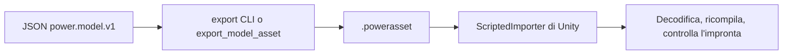

# Asset dei modelli

[English](ASSET_FORMAT.md) · [简体中文](ASSET_FORMAT.zh-CN.md) · [Français](ASSET_FORMAT.fr.md) · [Русский](ASSET_FORMAT.ru.md) · [日本語](ASSET_FORMAT.ja.md) · [한국어](ASSET_FORMAT.ko.md) · [Deutsch](ASSET_FORMAT.de.md) · [Español](ASSET_FORMAT.es.md) · **Italiano** · [Português](ASSET_FORMAT.pt-BR.md)

Il JSON `power.model.v1` è l'input di authoring. Un file `.powerasset` porta i dati di modello e di esperimento per gli altri runtime. `Power.Assets` non dipende da una libreria JSON, da Unity o da un pacchetto di terze parti, e compila con il nucleo per .NET 10 e .NET Standard 2.1.

Il comando CLI `export` e lo strumento MCP `export_model_asset` usano lo stesso encoder. Lo `ScriptedImporter` di Unity importa il file come `PowerModelAsset` e serializza solo i byte dei dati. A runtime i byte sono decodificati, il modello è ricompilato e non viene caricata né codice arbitrario né una fattorizzazione LU memorizzata. Gli asset predefiniti sono prodotti da `tools/Build.cs` e possono essere ricostruiti dal JSON.

## Versione attuale 29

`liquid_fuel_tank.parameters.headspace` dichiara `capacity` in `m3` o `l` e `gas_node`. Il gas omette `storage`: volume `capacity - liquid_mass / density`, un proprietario e volume positivo. Pompa e ritorno usano pressione prescritta nulla: il gas finito determina la pressione d'ingresso.

`vented-tank-liquid-cylinder` e `vented-tank-needle-cylinder` usano serbatoio 1513, gas 1520 e ingresso sfiato 960. Asset v29 conserva geometria e legge v1-v28. Passano lavoro/derivate analitici, convergenza ODE indipendente, bilanci, replay portable/MCP, rollback e passi senza allocazioni.

| Identifier | Value |
|---|---|
| fingerprint_tag | 33 (headspace geometry) |
| fill_fraction_field | 88 |
| count_table_int32 | 40 |
| count_table_bytes | 160 |
| header_bytes | 238 + UTF-8 name length |
| liquid_tank_record_bytes | 48 |
| headspace_extension_bytes | 16 (capacity quantity + gas_node) |

[Geometria del serbatoio e spazio gassoso finito](TANK_HEADSPACE.it.md)

## Versione conservata 28

`recirculating-liquid-cylinder` e `recirculating-needle-cylinder` conservano combustibile finito, iniezione reale, evaporazione e ago opzionale. v28 salva collegamenti/quota e legge v1-v27. Ogni ritorno aggiunge 8 stati nei limiti invariati.

| Identifier | Value |
|---|---|
| kind | 41 (`liquid_rail_return`) |
| fingerprint_tag | 32 |
| count_table_int32 | 40 |
| count_table_bytes | 160 |
| header_bytes | 238 + UTF-8 name length |
| liquid_return_record_bytes | 24 |

[LIQUID_FUEL_RETURN.it.md](LIQUID_FUEL_RETURN.it.md)

## Versione 27 conservata

v27 conserva serbatoio e selezione e legge v1-v26. Ogni serbatoio aggiunge 4 stati nei limiti invariati. Scambio umido indipendente, pressione/energia d'albero esaurite analitiche, miscela di ritorno, bilanci completi, rollback, rami e passi senza allocazioni sono verificati.

| Identifier | Value |
|---|---|
| kind | 40 (`liquid_fuel_tank`) |
| fingerprint_tag | 31 |
| tank_state_field | 87 |
| count_table_int32 | 39 |
| count_table_bytes | 156 |
| header_bytes | 234 + UTF-8 name length |
| liquid_feed_record_bytes | 28 |
| liquid_tank_record_bytes | 32 |

[LIQUID_FUEL_TANK.it.md](LIQUID_FUEL_TANK.it.md)

## Versione 26 conservata

Il codificatore scrive `power.asset.v26` e legge v1-v26. Ci sono 38 conteggi int32 (152 bytes); l'intestazione occupa 230 + lunghezza del nome UTF-8 bytes. Il tipo 39 è `liquid_rail_feed`, tag di impronta 30. Un record di 24 bytes salva indice, ID iniettore/pompa e temperatura sorgente. Tipi e proprietà esclusiva sono verificati; un downgrade v25 rifirmato rifiuta il nuovo tipo.

## Versione 25 conservata

Il codificatore scrive `power.asset.v25` e legge v1-v25. La tabella contiene 37 valori int32 (148 bytes); l'intestazione occupa 226 + lunghezza del nome UTF-8 bytes. Il tipo 38 è `at_controller`, con tag di impronta 29. Ogni record ha 208 bytes fissi più 12 bytes per percorso. I percorsi sono 5 o 6; il totale limitato è dichiarato separatamente. Si verificano tipi, clock, unità, proprietà e topologia. Un downgrade v24 con digest rifirmato rifiuta il nuovo tipo.

## Versione 24 conservata

L'encoder scrive `power.asset.v24`; le versioni da 1 a 24 restano leggibili. La tabella dei conteggi e le dimensioni dei record restano quelle della v23. Il kind 37 è `carrier_gear`: il suo rapporto di base è finito, con segno e diverso da zero; la sua estensione di ingranaggio da 8 byte conserva l'indice del componente e il portasatelliti mobile distinto. I conteggi tipizzati coprono ogni ingranamento del portasatelliti. Una retrocessione v23 risigillata nel digest rifiuta il nuovo kind.

Gli ingranamenti del portasatelliti aggiungono il tag di impronta 28, le coordinate compensate, la coerenza del vincolo agli estremi e il raffinamento limitato della proiezione relativa con reazioni accumulate. I record ordinari dei rotori conservano la rotazione assoluta dei satelliti e l'inerzia orbitale totale del portasatelliti. Una fixture Ravigneaux ridotta autentica v23 conserva il suo digest/impronta e il replay esatto aggiornato. Vedi [RESOLVED_PLANETS.it.md](RESOLVED_PLANETS.it.md).

## Versione 23 conservata

La versione 23 conserva la tabella dei conteggi e le dimensioni dei record della v22. Il kind 36 è `double_pinion_planetary_gear`: il rapporto di base con segno e l'estensione di ingranaggio esistente da 8 byte conservano il portasatelliti distinto. Conteggi e copertura tipizzata includono il nuovo kind. Le versioni più vecchie lo rifiutano, compresa una retrocessione v22 risigillata nel digest.

I modelli composti aggiungono il tag di impronta 27, compreso l'accumulo di coordinate compensate. La loro riga completa entra nel contratto ordinario di reazione/fase/replay; i modelli esistenti conservano le impronte precedenti. Una fixture DCT controllata autentica v22 conserva il suo digest e il replay esatto aggiornato. Vedi [RAVIGNEAUX_TRANSMISSION.it.md](RAVIGNEAUX_TRANSMISSION.it.md).

## Versione 22 conservata

La tabella dei conteggi della versione 22 ha 35 valori int32 (140 byte); la dimensione dell'intestazione è `218 + UTF-8 name length`. Il conteggio del regolatore DCT segue i conteggi di azionamento della v21. Dopo i record dei driver, ogni record DCT è di 104 byte: indice del componente int32; ID uint32 di veicolo e di frizione dispari/pari; otto ID di selettore uint32; valori uint64 di campione/rilascio/innesto/timeout; e due quantità per la tolleranza di sincronizzazione e il limite di velocità di direzione.

Il kind 35 è `dct_controller`. I campi 73-79 sono marcia richiesta/reale, selezione dispari/pari, fase del cambio, errore di sincronizzazione e guasto di controllo. Gli ID esistenti sono invariati. I modelli con regolatore aggiungono il tag di impronta 26 con percorsi, fasatura e tolleranze stabili. Comandi iniziali rilasciati, proprietà esclusiva, topologia completa, richiesta intera, conteggio di stato limitato e allineamento della fasatura sono controllati in compilazione. Le retrocessioni v21 contraffatte rifiutano record/kind del regolatore. Un grafo DCT autentico v21 conserva il suo digest/impronta e il replay aggiornato sullo stesso runtime. Vedi [DCT_CONTROL.it.md](DCT_CONTROL.it.md).

## Versione 21 conservata

La tabella dei conteggi v20 della versione 21 e l'intestazione `214 + UTF-8 name length` restano invariate. Ogni record del driver dell'ago è di 40 byte: i campi v20 più l'orizzonte di chiusura opzionale uint64. I record dei driver più vecchi sono di 32 byte e si decodificano con la predizione disabilitata.

I modelli con predizione aggiungono il tag di impronta 25 e i nanosecondi di orizzonte; i modelli disabilitati conservano le impronte e gli hash di stato precedenti. I campi 69-72 sono massa di carburante predetta, tick di predizione, stato di taglio del driver e tick di chiusura in sospeso. Gli ID esistenti restano fissi. Le regole di orizzonte/allineamento/budget e di orologio appartengono alla compilazione fisica/di controllo. Le retrocessioni contraffatte che tolgono la predizione abilitata falliscono la validazione dell'impronta. Gli asset autentici v20 conservano i loro digest e il replay aggiornato sullo stesso runtime. Vedi [CLOSURE_PREDICTION.it.md](CLOSURE_PREDICTION.it.md).

## Versione 20 conservata

I 34 conteggi int32 della versione 20 occupano 136 byte; l'intestazione è di `214 + UTF-8 name length` byte. Quattro conteggi dopo il conteggio degli iniettori liquidi descrivono solenoidi, arresti di corsa, aghi di iniettore opzionali e driver di ago campionati. Dopo la tabella liquida:

| Tabella | Byte | Dati |
|---|---:|---|
| Solenoide | 28 | Indice del componente int32; quantità di posizione di riferimento e di gradiente di induttanza |
| Arresto di corsa | 40 | Indice del componente int32; quantità di posizione minima/massima e di rigidezza |
| Ago | 32 | Indice del componente iniettore int32; ID del nodo ago uint32; quantità di chiusura/piena apertura |
| Driver | 32 | Indice del componente int32; ID di iniettore/solenoide uint32; periodo uint64; quantità di tensione di comando |

R/L/corrente iniziale del solenoide, input di tensione e pozzo termico usano i record di base. I kind 32-34 sono `solenoid`, `travel_stop` e `needle_driver`; `HenryPerMeter` è accodato all'enumerazione delle unità (`h_m`), e il campo 68 è `copper_heat`. Gli ID esistenti conservano i loro valori. I modelli magnetici/di arresto aggiungono il tag di impronta 22, l'apertura fisica dell'ago aggiunge il tag 23 e le definizioni dei driver aggiungono il tag 24. Parametri, riferimenti stabili e periodi di campionamento entrano nell'impronta.

Restano richiesti record tipizzati limitati, unità, proprietari distinti, copertura completa e compilazione fisica. Le retrocessioni v19 contraffatte rifiutano i kind di azionamento; togliere un'estensione dell'ago cambia l'impronta compilata. Una fixture liquida autentica v19 conserva il suo digest/impronta e il replay aggiornato sullo stesso runtime. Vedi [NEEDLE_ACTUATION.it.md](NEEDLE_ACTUATION.it.md).

## Versione 19 conservata

I 30 conteggi int32 della versione 19 occupano 120 byte; l'intestazione è di `198 + UTF-8 name length` byte. Il conteggio degli iniettori liquidi segue il conteggio dei film della v18. Dopo la tabella di fase dei film, ogni record liquido occupa 120 byte: indice della tabella dei componenti int32, ID del film bersaglio uint32, ID della manovella uint32, poi nove quantità per gli angoli di ciclo/inizio/durata, la dose massima, la massa iniziale della sorgente, la temperatura di alimentazione, la densità, la pressione assoluta iniziale e la cedevolezza di pressione. Ogni quantità è double più unità int32. Area/coefficiente dell'ugello usano l'estensione di orifizio esistente da 36 byte.

Il kind 31 è `liquid_fuel_injector`; `KilogramPerCubicMeter` è accodato all'enumerazione delle unità, con nome JSON `kg_m3`. Gli ID esistenti di dominio/unità/output restano fissi. I modelli liquidi aggiungono il tag di impronta 21, compresi ID stabili di film/manovella, fasatura e proprietà della sorgente. Sono richiesti copertura completa tipizzata e limitata, digest, unità e proprietà fisica; le retrocessioni v18 contraffatte rifiutano gli iniettori liquidi. Una fixture di film autentica v18 conserva digest/impronta e il replay aggiornato sullo stesso runtime. Vedi [LIQUID_FUEL_INJECTION.it.md](LIQUID_FUEL_INJECTION.it.md).

## Versione 18 conservata

I 29 conteggi int32 della versione 18 occupano 116 byte; l'intestazione è di `194 + UTF-8 name length` byte. Un conteggio dei film segue il conteggio degli iniettori di carburante della v17. Dopo i record degli iniettori, ogni record di film occupa 64 byte: indice della tabella dei componenti int32, poi massa iniziale, temperatura iniziale, calore specifico del liquido, temperatura di saturazione ed energia interna latente come cinque quantità (double più unità int32). Conduttanza e gli ID di ricevitore/parete restano nel record del componente base.

Il kind 30 è `fuel_film`; i campi 66-67 sono la massa cumulativa di carburante evaporato in kg e il calore di parete del film in J. Gli ID esistenti restano fissi. I modelli con film aggiungono il tag di impronta 20, compresi energia di fase iniziale, massa liquida e costanti di fase. Sono richiesti copertura completa tipizzata, conteggi/lunghezza limitati, digest, unità e compilazione fisica. Le retrocessioni v17 contraffatte rifiutano i film. La fixture autentica del cilindro dosato v17 conserva il suo digest/impronta e il replay aggiornato sullo stesso runtime. Vedi [FUEL_FILM.it.md](FUEL_FILM.it.md).

## Versione 17 conservata

I 28 conteggi int32 della versione 17 occupano 112 byte; l'intestazione è di `190 + UTF-8 name length` byte. Un conteggio degli iniettori segue il conteggio degli stantuffi a gas della v16. Dopo la geometria dello stantuffo a gas, ogni record di iniettore occupa 56 byte: indice della tabella dei componenti int32, ID della manovella di fasatura uint32, poi angoli di ciclo/inizio/durata e dose massima come quattro quantità. Area/coefficiente del suo ugello usano anche il record di orifizio gas esistente da 36 byte. La quantità di input di base porta kg per ciclo, invece di una frazione di apertura.

Il kind 29 è `gas_fuel_injector`. I campi 63-65 sono la dose di ciclo richiesta, la dose di ciclo erogata e il carburante cumulativo erogato in kg. Gli ID esistenti restano fissi. Questi modelli aggiungono il tag di impronta 19, conservando ID della manovella, finestra e limite di dose. Sono richiesti copertura completa tipizzata, conteggi/lunghezza limitati, digest, unità e porte finite compatibili. Le retrocessioni v16 contraffatte rifiutano gli iniettori. Gli asset autentici di accumulatore a gas v16 conservano digest/impronta e il replay aggiornato sullo stesso runtime. Vedi [FUEL_METERING.it.md](FUEL_METERING.it.md).

## Versione 16 conservata

I 27 conteggi int32 della versione 16 occupano 108 byte; l'intestazione è di `186 + UTF-8 name length` byte. Il conteggio degli stantuffi a gas lineari segue il conteggio dei cursori della v15. Dopo la geometria del cursore, ogni record di stantuffo a gas occupa 56 byte: indice della tabella dei componenti int32, direzione di compressione int32 (+1 o -1) e quattro quantità per area, volume di riferimento, posizione di riferimento e pressione assoluta di riferimento. Ogni quantità è double più unità int32. Il nodo gas usa il record di composizione esistente e omette l'accumulo fisso.

Il kind 28 è `gas_piston`. Nessun ID esistente di dominio/unità/output cambia. Questi modelli aggiungono il tag di impronta 18, compresi valori di geometria/riferimento e orientamento. Restano richiesti copertura completa tipizzata, conteggi/lunghezza limitati, digest e compilazione fisica; le retrocessioni v15 contraffatte rifiutano gli stantuffi a gas. La fixture autentica del cursore v15 conserva il suo digest, l'impronta, i riferimenti fisici e il replay aggiornato sullo stesso runtime. Vedi [GAS_PISTON.it.md](GAS_PISTON.it.md).

## Versione 15 conservata

I 26 conteggi int32 della versione 15 occupano 104 byte; l'intestazione è di `182 + UTF-8 name length` byte. Un conteggio di valvole a cursore segue i conteggi di stantuffo/contatto della v14. Dopo quelle tabelle di estensione, ogni record di cursore occupa 32 byte: indice della tabella dei componenti int32, ID del componente stantuffo riferito uint32, quantità di posizione chiusa e quantità di posizione di piena apertura. Ogni quantità è un valore double più unità int32. I parametri di flusso e la pressione del serbatoio restano nel record di restrizione idraulica esistente da 40 byte.

Il kind 27 è `hydraulic_spool_valve`; gli ID, le unità e i campi di output esistenti conservano i loro valori. I modelli a cursore aggiungono il tag di impronta 17 ed entrambe le posizioni delle spalle/l'ID dello stantuffo. Si controllano copertura completa tipizzata, conteggi limitati, lunghezza, digest, unità e proprietà della corsa. Le retrocessioni contraffatte alla v14 rifiutano i kind del cursore. Gli asset autentici di stantuffo v14 conservano i loro digest, le impronte e il replay aggiornato sullo stesso runtime. Vedi [HYDRAULIC_SPOOL.it.md](HYDRAULIC_SPOOL.it.md).

## Versione 14 conservata

La tabella dei conteggi della versione 14 contiene 25 valori int32 (100 byte). Due conteggi dopo i conteggi di batteria e di controllo di duty della v13 descrivono gli stantuffi idraulici e le frizioni azionate a contatto. L'intestazione è di `178 + UTF-8 name length` byte. Dopo la tabella dei regolatori di duty:

| Estensione | Byte | Campi |
|---|---:|---|
| Stantuffo idraulico | 104 | Indice della tabella dei componenti int32, ID del nodo posteriore uint32; aree anteriore/posteriore, pressione posteriore, posizione minima/massima, rigidezza dell'arresto, posizione/rigidezza di contatto come otto quantità |
| Frizione a stantuffo | 40 | Indice della tabella dei componenti int32, ID del componente stantuffo uint32, quantità del raggio efficace, coefficienti statico/strisciante come due double, superfici di attrito uint32 |

Massa/velocità/posizione traslazionali e i parametri di molla/forza lineari usano i record di base esistenti. Il dominio 6 è traslazionale. I kind 23-26 sono molla lineare, stantuffo idraulico, frizione a stantuffo e sorgente di forza. Le unità 47-49 sono m/s, N/m e N*s/m; i campi 60-62 sono spostamento, velocità lineare e forza. Il calore cumulativo di smorzamento della molla usa il campo 34 esistente. I modelli a stantuffo/contatto aggiungono il tag di impronta 16, con corsa, pastiglia, confine posteriore, stantuffo riferito e geometria di attrito inclusi.

Conteggi limitati, indici tipizzati, estensioni complete distinte, lunghezza esatta, digest e il limite di 1 MiB sono controllati prima dell'uso del modello. Le versioni più vecchie rifiutano il nuovo dominio/i nuovi kind anche quando i record di estensione sono rimossi e il digest è ricalcolato. Il compilatore controlla unità SI, porte tipizzate, corsa crescente, gioco della pastiglia e ordinamento dell'attrito. La fixture autentica v13 conserva il suo digest originale e il replay aggiornato sullo stesso runtime. Vedi [il contratto dello stantuffo](HYDRAULIC_PISTON.it.md).

## Versione 13 conservata

La versione 13 accoda due conteggi int32 alla tabella v12: batterie e regolatori di duty. La sua intestazione è di `170 + UTF-8 name length` byte. Dopo i record esistenti dei regolatori di tensione:

| Estensione | Byte | Campi |
|---|---:|---|
| Batteria | 68 | Indice della tabella dei nodi int32, ID del nodo termico uint32; OCV a scarica e a piena carica, resistenza in serie, resistenza e capacità di polarizzazione come cinque quantità |
| Regolatore di duty | 80 | Indice della tabella dei componenti int32, canale bersaglio uint64, periodo di campionamento uint64; guadagni proporzionale/integrale, limiti di duty e integrale iniziale come cinque quantità |

Capacità della batteria, SOC e tensione iniziale di polarizzazione usano i campi esistenti del nodo. I motori di batteria e i carichi resistivi conservano porte, parametri RL, resistenza e apertura/duty nei record del componente base. Il dominio 5 è la batteria; i kind 20–22 sono motore di batteria, carico resistivo e regolatore di duty di pressione. Le unità 42–46 sono C, F, Ah, fraction/Pa e fraction/(Pa·s); i campi 53–59 sono SOC, carica, tensione di morsetto/polarizzazione, corrente di batteria, duty integrale e duty di comando. Gli identificatori precedenti restano fissi.

Restano tabelle tipizzate limitate, copertura/lunghezza esatte, digest e limiti di 1 MiB. Le versioni vecchie rifiutano i domini batteria e i nuovi kind anche dopo la rimozione delle loro tabelle di estensione. La compilazione controlla i limiti di carica, le dimensioni, le sorgenti tipizzate, l'ordinamento OCV e la proprietà del controllo. I modelli di batteria aggiungono il tag di impronta 14; il controllo di duty aggiunge il tag 15. I modelli precedenti conservano le loro impronte. Le fixture autentiche v12 e più vecchie verificano i digest originali e il replay sullo stesso runtime. Vedi [il contratto della batteria](HYDRAULIC_PUMP.it.md#finite-battery-supply-and-duty-regulation).

## Versione 12 conservata

La versione 12 accoda un ventunesimo conteggio int32 per i record del regolatore di pressione. La sua intestazione è di `162 + UTF-8 name length` byte. Dopo le tabelle di pompa e di scarico, ogni estensione del regolatore occupa 80 byte:

| Dato | Codifica |
|---|---|
| Indice della tabella dei componenti | int32, distinto e riferito al kind 19 (`pressure_controller`) |
| Canale di tensione bersaglio posseduto | uint64 |
| Periodo di campionamento in nanosecondi | uint64 |
| Guadagno proporzionale, guadagno integrale, tensione minima/massima, integrale iniziale | Cinque quantità, ciascuna valore double più unità int32 |

Nodo sensore, canale di setpoint e bersaglio di pressione iniziale restano nel record del componente base. Input e controlli KPI seguono la tabella dei regolatori. Si controllano lunghezza esatta, conteggi limitati, indici tipizzati, copertura completa delle estensioni, digest e il limite di 1 MiB. Le retrocessioni contraffatte alla v11 rifiutano i kind del regolatore anche dopo la rimozione dei loro record. La compilazione controlla unità, dominio del sensore, proprietà del bersaglio, limiti e periodi allineati ai tick. Le unità 40/41 sono V/Pa e V/(Pa·s); i campi 49–52 sono pressione campionata, errore di pressione, tensione integrale e comando tenuto. Gli identificatori esistenti conservano i loro valori.

I modelli controllati aggiungono il tag di impronta 13, compresi periodo di campionamento, canale bersaglio e integrale iniziale. Le storie del regolatore sono ricostruite dal replay invece di essere serializzate. I modelli non controllati conservano le loro impronte e traiettorie. La fixture autentica v11 e tutte le fixture precedenti restano invariate. Vedi [il contratto di regolazione della pressione](HYDRAULIC_PUMP.it.md#sampled-pressure-regulation).

## Versione 11 conservata

La versione 11 accoda conteggi int32 di pompa e di scarico ai diciotto conteggi della v10. Dopo le tabelle esistenti di restrizione idraulica e di attuatore vengono record di pompa da 32 byte (indice del componente, ID del nodo di ingresso, quantità di cilindrata, quantità di pressione del serbatoio), poi record di scarico da 16 byte (indice del componente e quantità di pressione di apertura). Uno scarico ha anche il record di restrizione esistente da 40 byte per conduttanza e pressione al confine. Input e controlli seguono queste nuove tabelle. L'intestazione è di `158 + UTF-8 name length` byte.

Si controllano indici distinti tipizzati, record completi per kind, lunghezza esatta, SHA-256 e conteggi limitati. I formati più vecchi rifiutano i kind 17/18 (pompa/scarico). L'unità 39 è m³/rad; il campo 48 è la potenza idraulica con segno. Il lavoro della pompa riusa il campo 44 sul componente, mentre l'oggetto zero conserva il lavoro idraulico esterno. I modelli pompa/scarico aggiungono il tag di impronta 12; i modelli senza l'uno né l'altro conservano le loro impronte. Una fixture idraulica autentica v10 controlla il suo digest originale e il replay. Vedi [il contratto della pompa](HYDRAULIC_PUMP.it.md).

## Versione 10 conservata

La versione 10 accoda due conteggi int32 dopo i sedici conteggi della v9: restrizioni idrauliche e frizioni idrauliche. Il dominio 4 dei nodi idraulici usa il record di nodo esistente da 44 byte: l'accumulo è la cedevolezza, il valore iniziale è la pressione manometrica e la posizione è zero/None. I formati più vecchi rifiutano i nodi idraulici anche quando non è presente alcuna estensione di componente.

Dopo la tabella completa del convertitore a lunghezza variabile vengono questi record a dimensione fissa:

| Estensione | Byte | Campi |
|---|---:|---|
| Restrizione idraulica | 40 | Indice del componente int32; coefficiente, pressione di transizione e pressione del serbatoio come tre quantità |
| Frizione idraulica | 64 | Indice del componente int32, ID del nodo di pressione uint32; area dello stantuffo, forza di precarico e raggio come quantità; coefficienti statico/strisciante come double; conteggio delle superfici di attrito uint32 |

Ogni kind ha bisogno di esattamente un'estensione distinta e nell'intervallo. Porte rotazionali/idrauliche comuni, rapporto, input di valvola e pozzo di calore restano nel record del componente base. La pressione del serbatoio è portata in modo esplicito nell'estensione della restrizione, compreso zero/None per gli spigoli interni. Input programmati e controlli seguono entrambe le tabelle idrauliche. Conteggi, lunghezza esatta, SHA-256 e il limite di 1 MiB sono controllati prima che la compilazione validi dimensioni, topologia e intervalli fisici.

I kind 14–16 identificano restrizione lineare, restrizione turbolenta e frizione in pressione. Le unità 34–38 aggiungono cedevolezza, coefficienti lineare/turbolento, portata volumetrica e forza. I campi 41–47 aggiungono portata volumetrica, inventario del serbatoio, residuo di inventario, lavoro idraulico, forza di serraggio e capacità statica/strisciante. I campi esistenti di calore/pressione sono riusati. I modelli con nodi idraulici aggiungono il tag di impronta 11; i modelli senza idraulica conservano le impronte precedenti. Le storie del solver sono ricostruite dal replay. Una fixture autentica di convertitore v9 controlla il suo digest originale, l'impronta e la traiettoria aggiornata. Vedi [il contratto idraulico](HYDRAULIC_NETWORK.it.md).

## Versione 9 conservata

La versione 9 ha accodato due conteggi int32 dopo i quattordici conteggi della v8: componenti convertitore e punti di mappa totali. Sono supportati al massimo otto convertitori e 32 punti in ciascuna delle quattro mappe. Dopo la tabella degli ingranaggi, ogni record di convertitore ha un'intestazione di 20 byte: indice della tabella dei componenti e quattro conteggi di punti int32. I suoi punti seguono subito, nell'ordine pompa-positiva, pompa-negativa, turbina-positiva, turbina-negativa. Ogni punto occupa 28 byte: rapporto di velocità (double), rapporto di coppia (double), coefficiente di capacità (double + unità int32). L'intestazione del convertitore successivo segue quei punti. Input programmati e controlli seguono tutti i record dei convertitori. Nodi, componenti base ed estensioni precedenti conservano le loro dimensioni.

Si controllano dimensione esatta, SHA-256, il limite di 1 MiB, tutti i conteggi aggregati/per mappa, indici tipizzati distinti e il conteggio totale di punti consumati. La compilazione poi valida topologia, unità, confini continui dell'elemento di riferimento e passività tra i knot. Record di convertitore mancanti, duplicati, malformati, di kind sbagliato e retrocessi sono rifiutati.

Il kind 13 identifica un convertitore, l'unità 33 il suo coefficiente di capacità, e i campi 38–40 aggiungono calore del fluido, rapporto di velocità e codice dell'elemento di riferimento. I campi di coppia in B/C e di flusso di calore sono riusati; la coppia C è la reazione dello statore fermo, senza una terza porta di rotore. I modelli con convertitore aggiungono il tag di impronta 10 e tutti i valori di mappa normalizzati. Fattori del solver e storie medie/cumulative sono ricostruiti dal replay. Le fixture autentiche v1–v8 verificano impronte e riproduzione conservate. Vedi [il contratto del convertitore](CONVERTER_NETWORK.it.md).

## Versione 8 conservata

La versione 8 ha accodato un quattordicesimo conteggio int32 per la topologia degli ingranaggi ideali. Dopo la tabella di estensione delle frizioni, ogni record da 8 byte contiene l'indice della tabella dei componenti (int32) e l'ID del nodo portasatelliti (uint32). Esattamente un record distinto deve riferire ciascun componente `IdealGear` o `PlanetaryGear`. L'ID del portasatelliti è zero per una coppia ideale e un nodo rotazionale distinto per un planetario. Gli ID dei nodi A/B e il rapporto restano nel record di base invariato da 156 byte. I nodi restano di 44 byte e le dimensioni delle estensioni precedenti sono invariate.

I conteggi sono, nell'ordine: nodi, componenti, input programmati, controlli, cilindri chiusi, nodi gas, orifizi, cilindri mobili, valvole, miscele, frazioni di serbatoio, bruciatori, frizioni e ingranaggi. Lunghezza esatta del payload, SHA-256 e il limite di 1 MiB sono controllati prima della compilazione. Input e controlli KPI seguono tutte le tabelle di estensione.

Gli ID di kind 11/12 identificano ingranaggi ideali/planetari. I campi 35/36/37 aggiungono la coppia in B, la coppia in C e l'errore di fase; il residuo di velocità degli ingranaggi riusa il campo 32. Gli identificatori più vecchi conservano i loro valori. I modelli con ingranaggi aggiungono il tag di impronta 9, compreso l'estremo del portasatelliti; le impronte prive di ingranaggi sono invariate. La fase relativa iniziale è ricavata dagli angoli dei rotori. La storia delle reazioni medie e i fattori di vincolo sono ricostruiti dal replay, non serializzati come stato del solver.

Sono rifiutati porte/rapporti non validi, vincoli dipendenti, velocità iniziali incompatibili, parametri fisici non pertinenti, estensioni mancanti/duplicate/di kind sbagliato e retrocessioni contraffatte. Una fixture autentica di frizione accesa v7 conserva il suo digest, l'impronta del modello e il replay aggiornato; le fixture v1–v6 restano. Vedi [gli ingranaggi accoppiati](GEAR_NETWORK.it.md) e la [provenienza delle fixture](../tests/Power.Tests/Fixtures/README.md).

## Versione 7 conservata

La versione 7 ha accodato un tredicesimo conteggio int32 per le estensioni delle frizioni. Dopo la tabella di combustione, ogni record da 28 byte contiene un indice della tabella dei componenti e due quantità: capacità di coppia statica e strisciante in Nm. Esattamente un record deve riferire ciascun componente `Clutch`, con indici distinti e nell'intervallo. Estremi a terra/rotore, rapporto, input di innesto e destinazione del calore restano nel record del componente base invariato da 156 byte.

La compilazione valida unità, `static >= sliding >= 0`, rapporto, topologia e innesto. Sono rifiutate estensioni mancanti/duplicate/di kind sbagliato, capacità non valide, tentativi di retrocessione contraffatta e modifiche dell'impronta. I record dei nodi restano di 44 byte, e tutti i vecchi record di estensione conservano le loro dimensioni. Conteggi, dimensione esatta, digest e il limite di 1 MiB sono controllati prima della compilazione. Input programmati e controlli seguono tutte le tabelle di estensione.

Il kind di frizione 10, i campi 32–34 (velocità di slittamento, modo, calore di attrito) e l'unità 32 (`StateCode`) sono accodati senza rinumerare gli identificatori più vecchi. Il modello include il tag di impronta 8 solo quando esistono frizioni. Fattori del solver, storia di fase, output medi e registri di calore sono ricostruiti dal replay; non sono serializzati. Una fixture accesa autentica v6 verifica l'impronta precedente invariata e la riproduzione aggiornata. Vedi [le frizioni accoppiate](CLUTCH_NETWORK.it.md) e la [provenienza delle fixture](../tests/Power.Tests/Fixtures/README.md).

## Versione 6 conservata

La versione 6 aggiunge tre conteggi int32 dopo i nove conteggi della v5, per la composizione del gas premiscelato, le frazioni di serbatoio e i parametri di combustione. L'intestazione ha quindi dodici conteggi. Dopo la tabella di fasatura, queste tabelle di estensione seguono in quest'ordine:

| Estensione | Dimensione | Codifica |
|---|---|---|
| Gas premiscelato | 40 byte | Indice della tabella dei nodi gas (int32), LHV (quantità), rapporto aria/carburante stechiometrico (double), frazioni iniziali di carburante e di aria fresca (due double) |
| Frazioni di serbatoio | 20 byte | Indice della tabella dei componenti (int32), frazioni di carburante e di aria fresca (due double) |
| Combustione | 56 byte | Indice della tabella dei componenti (int32), angoli di ciclo/inizio/durata (tre quantità), esponente di forma e coefficiente di combustione (due double) |

Ogni tabella richiede indici distinti e nell'intervallo del kind appropriato. È richiesto esattamente un record di combustione per componente `PremixedCombustion`. I record di miscela opzionali sono validati contro i nodi gas collegati; i confini di serbatoio premiscelato richiedono record di frazione espliciti. Conteggi e lunghezza esatta sono controllati prima dell'allocazione degli array di descrittori, seguiti da topologia, unità, somme delle frazioni e vincoli di profilo. Rimuovere la composizione opzionale cambia la semantica e fa fallire la compilazione o l'impronta del modello.

Il record del componente base è invariato: gli ID di manovella/gas e l'input del moltiplicatore di combustione restano lì. I nuovi identificatori di kind, campo e unità sono accodati; i vecchi identificatori conservano i loro valori. Stato del solver, storie dei costituenti, frontiere irreversibili e registri cumulativi non sono serializzati; il replay li ricostruisce dal modello e dagli input programmati. La fixture autentica v5 conserva l'impronta precedente del modello fasato e il replay aggiornato. Vedi [la combustione premiscelata](PREMIXED_COMBUSTION.it.md).

## Versione 5 conservata

La versione 5 aggiunge un nono conteggio int32 dopo i conteggi della v4: estensioni opzionali di fasatura valvola-manovella. Dopo i record del cilindro mobile, ogni record di fasatura da 44 byte contiene:

| Dato | Codifica |
|---|---|
| Indice della tabella dei componenti | int32, unico e riferito a un orifizio gas |
| ID del nodo manovella | ID stabile uint32, riferito a un nodo rotazionale |
| Angolo di ciclo, angolo di apertura, angolo di durata | Tre quantità (double + unità int32 ciascuna) |

La fasatura è opzionale su ciascun orifizio. Conteggi, lunghezza esatta, tipo di record e unicità sono controllati prima che la compilazione validi unità, ciclo, fase e durata. Rimuovere un record di fasatura cambia la semantica del modello e fa fallire il controllo dell'impronta memorizzata. I modelli fasati aggiungono il tag di impronta 6; i modelli non fasati conservano le impronte precedenti. Una fixture autentica v4 verifica il replay invariato del cilindro mobile dopo la ricodifica. Input, controlli e il trailer SHA-256 seguono tutte le tabelle di estensione. Vedi [la fasatura](VALVE_TIMING.it.md).

## Versione 4 conservata

La versione 4 aggiunge un ottavo conteggio int32 dopo i sette conteggi della v3: estensioni del cilindro mobile. Dopo le estensioni v3 di nodo gas e di orifizio, ogni record di cilindro mobile contiene:

| Dato | Codifica |
|---|---|
| Indice della tabella dei componenti | int32; unico, nei limiti e riferito a un cilindro a gas |
| Alesaggio, corsa, lunghezza di biella e fase | Quattro quantità (double + unità int32 ciascuna) |
| Rapporto di compressione | double |
| Contropressione | Una quantità |

Ogni record è di 72 byte. È richiesto esattamente un record per cilindro a gas. Il suo nodo gas memorizza temperatura, pressione e composizione iniziali nei campi esistenti; la sua quantità di accumulo è zero/None perché la geometria fornisce il volume. Nessun volume iniziale o stato del gas è fornito in silenzio dal lettore. Le versioni vecchie rifiutano il nuovo componente. Proprietà del cilindro, topologia e dimensioni sono controllate dalla compilazione prima che l'impronta sia accettata. I limiti di sorgente/digest/dimensione/programmazione sono invariati.

## Versione 3 conservata e lettori precedenti

La versione 3 ha introdotto il supporto del gas a volume fisso. Conserva le tabelle base di nodi/componenti e le estensioni dei cilindri della v2. L'intestazione dei conteggi contiene sette valori int32, nell'ordine: nodi, componenti, input programmati, controlli, cilindri, nodi gas e orifizi gas. Dopo le tabelle base e le estensioni dei cilindri vengono questi record:

| Estensione | Dimensione | Codifica |
|---|---|---|
| Composizione del gas | 24 byte | Indice della tabella dei nodi (int32), costante specifica del gas (quantità), gamma (double) |
| Orifizio gas | 36 byte | Indice della tabella dei componenti (int32), area (quantità), coefficiente di efflusso (double), pressione del serbatoio (quantità) |

Una quantità è un double seguito da un identificatore di unità int32. La tabella base dei nodi conserva volume, temperatura iniziale e pressione iniziale. La tabella base dei componenti conserva apertura, canale, estremi, conduttanza di parete e temperatura del serbatoio (il campo esistente `AmbientTemperature`). I legami di parete del gas non hanno bisogno di un'estensione. I record riferiscono indici di tabella ordinati, non ID di oggetto.

Ogni nodo gas, orifizio e cilindro richiede esattamente un'estensione del proprio tipo. Sono rifiutate versioni sconosciute, conteggi non validi, lunghezze sbagliate, estensioni duplicate/mancanti/di tipo non corrispondente, checksum errati e impronte di modello non corrispondenti. Conteggi e lunghezza esatta sono controllati prima dell'allocazione degli array di descrittori. Il limite di 1 MiB si applica all'intero file, compreso il suo digest SHA-256 finale. Le aperture programmate sono validate in [0, 1] prima della creazione/esportazione dell'asset.

I vecchi lettori v1/v2 sono conservati per i loro insiemi di modelli originali; i domini/componenti gas richiedono la v3. Le fixture autentiche v1 e del cilindro v2 in [Fixtures](../tests/Power.Tests/Fixtures/README.md) esercitano la decodifica e il replay aggiornato. La semantica del solver e le impronte dei modelli non sono cambiate da questa revisione del formato.

## Compatibilità della versione 2 conservata e della versione 1

La versione 2 conserva le tabelle base di nodi/componenti e aggiunge un quinto conteggio int32 dopo i quattro conteggi originali: il numero di estensioni dei cilindri. Dopo la tabella dei componenti base, ogni estensione occupa 116 byte:

| Dato | Codifica |
|---|---|
| Indice della tabella dei componenti | int32, unico, nei limiti, riferito a un cilindro chiuso |
| Alesaggio, corsa, lunghezza di biella, fase | Quattro quantità, ciascuna valore double + unità int32 |
| Rapporto di compressione | double |
| Pressione iniziale, temperatura iniziale, costante specifica del gas | Tre quantità |
| Gamma | double |
| Contropressione | Una quantità |

Input, controlli e il trailer SHA-256 seguono le estensioni. Il decodificatore valida conteggi limitati e lunghezza esatta prima di allocare gli array di descrittori; rifiuta estensioni duplicate o non corrispondenti. La compilazione richiede esattamente un record di parametri per ciascun cilindro chiuso. Le enumerazioni estese di unità e di campi accodano valori senza cambiare gli identificatori esistenti.

La versione 1 non ha conteggio di estensioni né record di estensione. I modelli che usano solo i componenti lineari esistenti conservano la versione 2 del solver e le loro impronte, così gli asset v1 esistenti possono essere decodificati e riprodotti in replay. I modelli con cilindri chiusi usano la versione 3 del solver. La [fixture v1](../tests/Power.Tests/Fixtures/README.md) immutabile controlla la compatibilità contro un'esportazione reale precedente alla modifica.

## Layout della versione 1 conservata

Ogni intero e ogni valore IEEE 754 binary64 è little-endian. Un file è al massimo di 1 MiB. Le stringhe sono UTF-8 stretto.

| Ordine | Dati |
|---|---|
| Identità | 8 byte ASCII `POWERAST`, poi la versione di formato int32 `1` |
| Modello e tempo | impronta del modello uint64, nanosecondi del tick, durata dell'esperimento, intervallo di campionamento |
| Provenienza | conteggio dei byte del nome uint16, il nome, SHA-256 di 32 byte del JSON sorgente |
| Conteggi | Quattro valori int32: nodi, componenti, modifiche di input, KPI |
| Descrittori | 44 byte per nodo e 156 byte per componente, ordinati per ID di oggetto |
| Input | 24 byte per modifica: tempo uint64, canale uint64, valore double |
| KPI | 33 byte ciascuno: oggetto uint32, campo int32, un byte di flag di confine, tre limiti double |
| Integrità | SHA-256 di ogni byte precedente, 32 byte |

L'ordine dei campi di nodi e componenti segue il codec della versione 1 in `src/Power.Assets/AssetCodec.cs`. Conteggi, lunghezza esatta del file e digest sono controllati prima che gli array di descrittori siano allocati. Unità, topologia, tempo, eventi e KPI sono validati poi, e l'impronta è confrontata con il modello che il solver corrente compila. Una mancata corrispondenza richiede una nuova esportazione.

Un nome è al massimo di 128 unità di codice UTF-16 e non contiene caratteri di controllo. Un modello è limitato a 32 nodi, 64 componenti e 128 stati. Un esperimento è al massimo di un'ora, dieci milioni di tick, 10,000 tempi di input, 65,536 modifiche di input e 256 KPI. Il quoziente intero `duration / sample_every` non deve superare 10,000, e il limite di file di 1 MiB si applica ancora. Gli eventi stanno in `[0, duration)`, sono ordinati per tempo assoluto, sono allineati ai tick e non ripetono un canale a un dato tempo.

Il digest finale rileva i danni. Non è un'autenticazione di provenienza. `asset_sha256` in un risultato di esportazione è il digest dell'intero file, compreso quel campo finale. `source_sha256` identifica il documento di authoring. L'impronta del modello identifica la semantica compilata. Esportare di nuovo dopo un cambiamento di passo può conservare il digest sorgente originale e cambiare comunque l'impronta del modello. I parametri sintetici restano `unverified`.

`AssetPlayback` applica gli eventi iniziali al tempo zero e usa il batch atomico di eventi del nucleo dentro ogni `Advance`. Fallimento e annullamento conservano tempo, stato e il cursore degli eventi. Una chiamata avanza al massimo di un milione di tick. Il chiamante suddivide le esecuzioni più lunghe. I confini dei report CLI, la riproduzione degli asset e un'esportazione MCP dal vivo sono stati controllati gli uni contro gli altri. L'evidenza di esecuzione di Unity Editor, Mono e IL2CPP è ancora in sospeso.
