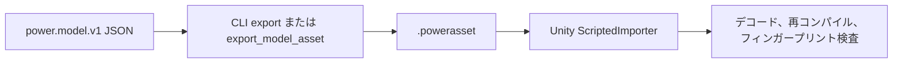

# モデルアセット

[English](ASSET_FORMAT.md) · [简体中文](ASSET_FORMAT.zh-CN.md) · [Français](ASSET_FORMAT.fr.md) · [Русский](ASSET_FORMAT.ru.md) · **日本語** · [한국어](ASSET_FORMAT.ko.md) · [Deutsch](ASSET_FORMAT.de.md) · [Español](ASSET_FORMAT.es.md) · [Italiano](ASSET_FORMAT.it.md) · [Português](ASSET_FORMAT.pt-BR.md)

`power.model.v1` の JSON は、作成時の入力です。`.powerasset` ファイルは、他のランタイム向けにモデルと実験データを運びます。`Power.Assets` は JSON ライブラリ、Unity、サードパーティパッケージに依存せず、コアとともに .NET 10 と .NET Standard 2.1 向けにコンパイルされます。

CLI の `export` コマンドと MCP の `export_model_asset` ツールは、同じエンコーダーを使います。Unity の `ScriptedImporter` はファイルを `PowerModelAsset` としてインポートし、データバイトだけを直列化します。実行時にバイトはデコードされ、モデルは再コンパイルされます。任意のコードや、保存された LU 分解はロードされません。既定のアセットは `tools/Build.cs` が生成し、JSON から再ビルドできます。

## 現行バージョン 28

`recirculating-liquid-cylinder` と `recirculating-needle-cylinder` は有限燃料、実噴射、蒸発、任意のニードル動特性を保持します。v28 は接続/熱割合を保存し v1-v27 を読みます。各戻りは既存上限内で 8 状態を追加します。

| Identifier | Value |
|---|---|
| kind | 41 (`liquid_rail_return`) |
| fingerprint_tag | 32 |
| count_table_int32 | 40 |
| count_table_bytes | 160 |
| header_bytes | 238 + UTF-8 name length |
| liquid_return_record_bytes | 24 |

[LIQUID_FUEL_RETURN.ja.md](LIQUID_FUEL_RETURN.ja.md)

## 保持するバージョン 27

v27 はタンクと補給選択を保存し v1-v26 を読みます。各タンクは既存上限内で 4 状態を追加します。独立湿潤交換、枯渇後の圧力/軸エネルギー解析解、逆流混合、全台帳、rollback、分岐、割り当てなしステップを検査します。

| Identifier | Value |
|---|---|
| kind | 40 (`liquid_fuel_tank`) |
| fingerprint_tag | 31 |
| tank_state_field | 87 |
| count_table_int32 | 39 |
| count_table_bytes | 156 |
| header_bytes | 234 + UTF-8 name length |
| liquid_feed_record_bytes | 28 |
| liquid_tank_record_bytes | 32 |

[LIQUID_FUEL_TANK.ja.md](LIQUID_FUEL_TANK.ja.md)

## 保持するバージョン 26

エンコーダーは `power.asset.v26` を書き、v1-v26 を読みます。計数は 38 個の int32（152 bytes）、ヘッダーは 230 + UTF-8 名称長 bytes です。種類 39 は `liquid_rail_feed`、指紋タグは 30 です。24 bytes のレコードは索引、噴射器/ポンプ ID、源温度量を保存します。型とレール/ポンプの独占所有権を確認し、再署名した v25 降格は新種類を拒否します。

## 保持するバージョン 25

エンコーダーは `power.asset.v25` を書き、v1-v25 を読みます。計数表は 37 個の int32（148 bytes）、ヘッダーは 226 + UTF-8 名称長 bytes です。種類 38 は `at_controller`、指紋タグは 29 です。各レコードは固定 208 bytes と経路ごとの 12 bytes です。経路数は 5 または 6 で、有界合計を別に宣言します。型、時計、単位、所有権、トポロジーを確認します。digest を再署名した v24 への降格は新しい種類を拒否します。

## 保持するバージョン 24

エンコーダーは `power.asset.v24` を書き出します。バージョン 1 から 24 までは読み取れます。件数テーブルとレコードサイズは v23 のままです。種別 37 は `carrier_gear` です。基本変速比は有限で、符号付き、かつ非ゼロです。8 バイトの歯車拡張は、コンポーネントインデックスと、区別される可動キャリアを保持します。型付き件数は、すべてのキャリア噛み合いを網羅します。ダイジェストを再封した v23 ダウングレードは、新しい種別を拒否します。

キャリア噛み合いは、フィンガープリントタグ 28、補償座標、端点拘束の整合、蓄積反力を伴う有界な相対射影の精細化を追加します。通常のローターレコードは、絶対的な遊星自転と、キャリアの軌道慣性の合計を保持します。正規の v23 縮小 Ravigneaux フィクスチャは、ダイジェストとフィンガープリント、およびアップグレード後の厳密なリプレイを保持します。[RESOLVED_PLANETS.md](RESOLVED_PLANETS.ja.md) を参照してください。

## 保持されるバージョン 23

バージョン 23 は、v22 の件数テーブルとレコードサイズを保持します。種別 36 は `double_pinion_planetary_gear` です。基本の符号付き変速比と、既存の 8 バイト歯車拡張が、区別されるキャリアを保持します。件数と型付き網羅には、新しい種別が含まれます。より古いバージョンはそれを拒否します。ダイジェストを再封した v22 ダウングレードも含みます。

複合モデルは、フィンガープリントタグ 27 を追加します。補償座標の蓄積を含みます。その完全な行は、通常の反力/位相/リプレイ契約に入ります。既存モデルは、先行するフィンガープリントを保ちます。正規の制御付き DCT の v22 フィクスチャは、ダイジェストと、アップグレード後の厳密なリプレイを保持します。[RAVIGNEAUX_TRANSMISSION.md](RAVIGNEAUX_TRANSMISSION.ja.md) を参照してください。

## 保持されるバージョン 22

バージョン 22 の件数テーブルは、35 個の int32 値（140 バイト）です。ヘッダーサイズは `218 + UTF-8 name length` です。DCT コントローラー件数は、v21 の駆動件数のあとに続きます。ドライバーレコードのあと、各 DCT レコードは 104 バイトです。コンポーネントインデックス int32、車両と奇数/偶数クラッチの ID uint32、8 つのセレクター ID uint32、サンプル/解放/係合/タイムアウトの値 uint64、そして同期許容差と方向速度制限の 2 つの量です。

種別 35 は `dct_controller` です。フィールド 73-79 は、要求段/実際の段、奇数/偶数の選択、変速位相、同期誤差、制御故障です。既存の ID は変わりません。コントローラーモデルは、フィンガープリントタグ 26 を追加します。安定した経路、タイミング、許容差を含みます。初期の解放指令、単独所有、完全なトポロジー、整数要求、有界な状態数、タイミングの整合は、コンパイル時に検査されます。偽造された v21 ダウングレードは、コントローラーのレコード/種別を拒否します。正規の v21 DCT グラフは、ダイジェストとフィンガープリント、および同一ランタイムでのアップグレード後リプレイを保持します。[DCT_CONTROL.md](DCT_CONTROL.ja.md) を参照してください。

## 保持されるバージョン 21

バージョン 21 の v20 件数テーブルと、`214 + UTF-8 name length` のヘッダーは変わりません。各ニードルドライバーレコードは 40 バイトです。v20 のフィールドに、任意のクロージャホライズン uint64 を加えたものです。より古いドライバーレコードは 32 バイトで、予測を無効にしてデコードされます。

予測モデルは、フィンガープリントタグ 25 とホライズンのナノ秒を追加します。無効なモデルは、以前のフィンガープリントと状態ハッシュを保持します。フィールド 69-72 は、予測燃料質量、予測ティック、ドライバー切断状態、保留中の閉じティックです。既存の ID は固定のままです。ホライズン/整合/予算とクロックの規則は、物理/制御のコンパイルに属します。有効な予測を剥がした偽造ダウングレードは、フィンガープリント検証に失敗します。正規の v20 アセットは、ダイジェストと、同一ランタイムでのアップグレード後リプレイを保持します。[CLOSURE_PREDICTION.md](CLOSURE_PREDICTION.ja.md) を参照してください。

## 保持されるバージョン 20

バージョン 20 の 34 個の int32 件数は 136 バイトを占めます。ヘッダーは `214 + UTF-8 name length` バイトです。液体インジェクター件数のあとの 4 つの件数は、ソレノイド、行程ストッパ、任意のインジェクターニードル、サンプリングされるニードルドライバーを表します。液体テーブルのあと:

| テーブル | バイト | データ |
|---|---:|---|
| ソレノイド | 28 | コンポーネントインデックス int32。参照位置とインダクタンス勾配の量 |
| 行程ストッパ | 40 | コンポーネントインデックス int32。最小/最大位置と剛性の量 |
| ニードル | 32 | インジェクターのコンポーネントインデックス int32。ニードルノード ID uint32。閉じ/全開の量 |
| ドライバー | 32 | コンポーネントインデックス int32。インジェクター/ソレノイド ID uint32。周期 uint64。駆動電圧の量 |

ソレノイドの R/L/初期電流、電圧入力、熱シンクは、基本レコードを使います。種別 32-34 は `solenoid`、`travel_stop`、`needle_driver` です。`HenryPerMeter` は単位列挙へ追加されます（`h_m`）。フィールド 68 は `copper_heat` です。既存の ID は値を保持します。磁気/ストッパのモデルはフィンガープリントタグ 22 を、物理的なニードル開度はタグ 23 を、ドライバー定義はタグ 24 を追加します。パラメーター、安定した参照、サンプリング周期はフィンガープリントに入ります。

型付きの有界レコード、単位、区別される所有者、完全な網羅、物理コンパイルは、引き続き必須です。偽造された v19 ダウングレードは、アクチュエーション種別を拒否します。ニードル拡張を剥がすと、コンパイル済みフィンガープリントが変わります。正規の v19 液体フィクスチャは、ダイジェストとフィンガープリント、および同一ランタイムでのアップグレード後リプレイを保持します。[NEEDLE_ACTUATION.md](NEEDLE_ACTUATION.ja.md) を参照してください。

## 保持されるバージョン 19

バージョン 19 の 30 個の int32 件数は 120 バイトを占めます。ヘッダーは `198 + UTF-8 name length` バイトです。液体インジェクター件数は、v18 のフィルム件数のあとに続きます。フィルム相テーブルのあと、各液体レコードは 120 バイトを占めます。コンポーネントテーブルのインデックス int32、対象フィルム ID uint32、クランク ID uint32、次いでサイクル/開始/持続の角度、最大ドーズ、初期源質量、供給温度、密度、初期絶対圧力、圧力コンプライアンスの 9 つの量です。各量は double に int32 単位を加えたものです。ノズル面積/係数は、既存の 36 バイトリフィス拡張を使います。

種別 31 は `liquid_fuel_injector` です。`KilogramPerCubicMeter` は単位列挙へ追加され、JSON 名は `kg_m3` です。既存の領域/単位/出力 ID は固定のままです。液体モデルはフィンガープリントタグ 21 を追加します。安定したフィルム/クランク ID、タイミング、源の物性を含みます。有界で型付きの完全な網羅、ダイジェスト、単位、物理的な所有は必須です。偽造された v18 ダウングレードは、液体インジェクターを拒否します。正規の v18 フィルムフィクスチャは、ダイジェストとフィンガープリント、および同一ランタイムでのアップグレード後リプレイを保持します。[LIQUID_FUEL_INJECTION.md](LIQUID_FUEL_INJECTION.ja.md) を参照してください。

## 保持されるバージョン 18

バージョン 18 の 29 個の int32 件数は 116 バイトを占めます。ヘッダーは `194 + UTF-8 name length` バイトです。フィルム件数は、v17 の燃料インジェクター件数のあとに続きます。インジェクターレコードのあと、各フィルムレコードは 64 バイトを占めます。コンポーネントテーブルのインデックス int32、次いで初期質量、初期温度、液体比熱、飽和温度、潜熱内部エネルギーの 5 つの量です（double に int32 単位）。コンダクタンスと、受け側/壁の ID は、基本コンポーネントレコードに残ります。

種別 30 は `fuel_film` です。フィールド 66-67 は、kg 単位の累積蒸発燃料質量と、J 単位のフィルム壁熱です。既存の ID は固定のままです。フィルムモデルはフィンガープリントタグ 20 を追加します。初期相エネルギー、液体質量、相定数を含みます。型付きの完全な網羅、有界な件数/長さ、ダイジェスト、単位、物理コンパイルは必須です。偽造された v17 ダウングレードは、フィルムを拒否します。正規の v17 計量気筒フィクスチャは、ダイジェストとフィンガープリント、および同一ランタイムでのアップグレード後リプレイを保持します。[FUEL_FILM.md](FUEL_FILM.ja.md) を参照してください。

## 保持されるバージョン 17

バージョン 17 の 28 個の int32 件数は 112 バイトを占めます。ヘッダーは `190 + UTF-8 name length` バイトです。インジェクター件数は、v16 のガスピストン件数のあとに続きます。ガスピストン形状のあと、各インジェクターレコードは 56 バイトを占めます。コンポーネントテーブルのインデックス int32、タイミングクランク ID uint32、次いでサイクル/開始/持続の角度と最大ドーズの 4 つの量です。そのノズル面積/係数も、既存の 36 バイトガスオリフィスレコードを使います。基本入力の量は、開度割合ではなく、サイクルあたりの kg を運びます。

種別 29 は `gas_fuel_injector` です。フィールド 63-65 は、要求サイクルドーズ、供給サイクルドーズ、kg 単位の累積供給燃料です。既存の ID は固定のままです。これらのモデルはフィンガープリントタグ 19 を追加し、クランク ID、窓、ドーズ制限を保持します。型付きの完全な網羅、有界な件数/長さ、ダイジェスト、単位、互換な有限ポートは必須です。偽造された v16 ダウングレードは、インジェクターを拒否します。正規の v16 ガスアキュムレーターアセットは、ダイジェストとフィンガープリント、および同一ランタイムでのアップグレード後リプレイを保持します。[FUEL_METERING.md](FUEL_METERING.ja.md) を参照してください。

## 保持されるバージョン 16

バージョン 16 の 27 個の int32 件数は 108 バイトを占めます。ヘッダーは `186 + UTF-8 name length` バイトです。線形ガスピストン件数は、v15 のスプール件数のあとに続きます。スプール形状のあと、各ガスピストンレコードは 56 バイトを占めます。コンポーネントテーブルのインデックス int32、圧縮方向 int32（+1 または -1）、面積、参照容積、参照位置、絶対参照圧力の 4 つの量です。各量は double に int32 単位を加えたものです。ガスノードは既存の組成レコードを使い、固定貯蔵を省きます。

種別 28 は `gas_piston` です。既存の領域/単位/出力 ID は変わりません。これらのモデルはフィンガープリントタグ 18 を追加します。形状/参照値と向きを含みます。型付きの完全な網羅、有界な件数/長さ、ダイジェスト、物理コンパイルは引き続き必須です。偽造された v15 ダウングレードは、ガスピストンを拒否します。正規の v15 スプールフィクスチャは、ダイジェスト、フィンガープリント、物理参照、および同一ランタイムでのアップグレード後リプレイを保持します。[GAS_PISTON.md](GAS_PISTON.ja.md) を参照してください。

## 保持されるバージョン 15

バージョン 15 の 26 個の int32 件数は 104 バイトを占めます。ヘッダーは `182 + UTF-8 name length` バイトです。1 つのスプールバルブ件数が、v14 のピストン/接触件数のあとに続きます。それらの拡張テーブルのあと、各スプールレコードは 32 バイトを占めます。コンポーネントテーブルのインデックス int32、参照されるピストンコンポーネント ID uint32、閉じ位置の量、全開位置の量です。各量は double 値に int32 単位を加えたものです。流量パラメーターとリザーバー圧力は、既存の 40 バイト油圧絞りレコードに残ります。

種別 27 は `hydraulic_spool_valve` です。既存の ID、単位、出力フィールドは値を保持します。スプールモデルはフィンガープリントタグ 17 と、両方のランド位置/ピストン ID を追加します。型付きの完全な網羅、有界な件数、長さ、ダイジェスト、単位、行程の所有が検査されます。v14 への偽造ダウングレードは、スプール種別を拒否します。正規の v14 ピストンアセットは、ダイジェスト、フィンガープリント、および同一ランタイムでのアップグレード後リプレイを保持します。[HYDRAULIC_SPOOL.md](HYDRAULIC_SPOOL.ja.md) を参照してください。

## 保持されるバージョン 14

バージョン 14 の件数テーブルは、25 個の int32 値（100 バイト）を含みます。v13 の電池件数とデューティー制御件数のあとの 2 つの件数は、油圧ピストンと、接触で駆動されるクラッチを表します。ヘッダーは `178 + UTF-8 name length` バイトです。デューティーコントローラーテーブルのあと:

| 拡張 | バイト | フィールド |
|---|---:|---|
| 油圧ピストン | 104 | コンポーネントテーブルのインデックス int32、背面ノード ID uint32。前面/背面の面積、背面圧力、最小/最大位置、ストッパ剛性、接触位置/剛性の 8 つの量 |
| ピストンクラッチ | 40 | コンポーネントテーブルのインデックス int32、ピストンコンポーネント ID uint32、有効半径の量、静止/滑り係数の 2 つの double、摩擦面数 uint32 |

並進の質量/速度/位置と、線形ばね/力のパラメーターは、既存の基本レコードを使います。領域 6 は並進です。種別 23-26 は、線形ばね、油圧ピストン、ピストンクラッチ、力源です。単位 47-49 は m/s、N/m、N*s/m です。フィールド 60-62 は変位、線速度、力です。累積ばね減衰熱は、既存のフィールド 34 を使います。ピストン/接触モデルはフィンガープリントタグ 16 を追加します。行程、パッド、背面境界、参照ピストン、摩擦形状を含みます。

有界な件数、型付きインデックス、区別され完全な拡張、正確な長さ、ダイジェスト、1 MiB 制限は、モデルを使う前に検査されます。より古いバージョンは、拡張レコードを除いてダイジェストを再計算しても、新しい領域/種別を拒否します。コンパイラは、SI 単位、型付きポート、増加する行程、パッドすきま、摩擦の順序を検査します。正規の v13 フィクスチャは、元のダイジェストと、同一ランタイムでのアップグレード後リプレイを保持します。[ピストン契約](HYDRAULIC_PISTON.ja.md) を参照してください。

## 保持されるバージョン 13

バージョン 13 は、v12 テーブルへ 2 つの int32 件数を追加します。電池とデューティーコントローラーです。ヘッダーは `170 + UTF-8 name length` バイトです。既存の電圧コントローラーレコードのあと:

| 拡張 | バイト | フィールド |
|---|---:|---|
| 電池 | 68 | ノードテーブルのインデックス int32、熱ノード ID uint32。空/満の OCV、直列抵抗、分極抵抗と静電容量の 5 つの量 |
| デューティーコントローラー | 80 | コンポーネントテーブルのインデックス int32、対象チャンネル uint64、サンプル周期 uint64。比例/積分ゲイン、デューティー境界、初期積分の 5 つの量 |

電池容量、SOC、分極の初期電圧は、既存のノードフィールドを使います。電池モーターと抵抗負荷は、ポート、RL パラメーター、抵抗、開度/デューティーを基本コンポーネントレコードに保持します。領域 5 は電池です。種別 20–22 は、電池モーター、抵抗負荷、圧力デューティーコントローラーです。単位 42–46 は C、F、Ah、割合/Pa、割合/(Pa·s) です。フィールド 53–59 は SOC、電荷、端子/分極電圧、電池電流、積分デューティー、指令デューティーです。以前の識別子は固定のままです。

有界な型付きテーブル、正確な網羅/長さ、ダイジェスト、1 MiB 制限は残ります。古いバージョンは、拡張テーブルを除いたあとでも、電池領域と新しい種別を拒否します。コンパイルは、電荷の境界、次元、型付き源、OCV の順序、制御の所有を検査します。電池モデルはフィンガープリントタグ 14 を、デューティー制御はタグ 15 を追加します。以前のモデルはフィンガープリントを保持します。正規の v12 と、それより古いフィクスチャは、元のダイジェストと同一ランタイムのリプレイを検証します。[電池契約](HYDRAULIC_PUMP.ja.md#finite-battery-supply-and-duty-regulation) を参照してください。

## 保持されるバージョン 12

バージョン 12 は、圧力コントローラーレコードのための 21 番目の int32 件数を追加します。ヘッダーは `162 + UTF-8 name length` バイトです。ポンプとリリーフのテーブルのあと、各コントローラー拡張は 80 バイトを占めます。

| データ | 符号化 |
|---|---|
| コンポーネントテーブルのインデックス | int32。区別され、種別 19（`pressure_controller`）を参照する |
| 所有する対象電圧チャンネル | uint64 |
| ナノ秒単位のサンプル周期 | uint64 |
| 比例ゲイン、積分ゲイン、最小/最大電圧、初期積分 | 5 つの量。それぞれ double 値に int32 単位 |

センサーノード、設定値チャンネル、初期圧力目標は、基本コンポーネントレコードに残ります。入力と KPI 検査は、コントローラーテーブルに従います。正確な長さ、有界な件数、型付きインデックス、完全な拡張網羅、ダイジェスト、1 MiB 制限が検査されます。v11 への偽造ダウングレードは、レコードを除いたあとでもコントローラー種別を拒否します。コンパイルは、単位、センサー領域、対象の所有、境界、ティックに揃った周期を検査します。単位 40/41 は V/Pa と V/(Pa·s) です。フィールド 49–52 は、サンプリング圧力、圧力誤差、積分電圧、保持された指令です。既存の識別子は値を保持します。

制御されたモデルはフィンガープリントタグ 13 を追加します。サンプリング周期、対象チャンネル、初期積分を含みます。コントローラー履歴は、直列化されず、リプレイを通じて再構成されます。制御されないモデルは、フィンガープリントと軌跡を保持します。正規の v11 フィクスチャと、それ以前のすべてのフィクスチャは変わりません。[圧力調整の契約](HYDRAULIC_PUMP.ja.md#sampled-pressure-regulation) を参照してください。

## 保持されるバージョン 11

バージョン 11 は、18 個の v10 件数へ、ポンプとリリーフの int32 件数を追加します。既存の油圧絞りとアクチュエーターのテーブルのあと、32 バイトのポンプレコード（コンポーネントインデックス、入口ノード ID、押しのけ量、リザーバー圧力の量）、次いで 16 バイトのリリーフレコード（コンポーネントインデックスとクラッキング圧力の量）が来ます。リリーフは、コンダクタンスと境界圧力のための既存の 40 バイト絞りレコードも持ちます。入力と検査は、これらの新しいテーブルに従います。ヘッダーは `158 + UTF-8 name length` バイトです。

型付きで区別されるインデックス、種別ごとの完全なレコード、正確な長さ、SHA-256、有界な件数が検査されます。より古い形式は種別 17/18（ポンプ/リリーフ）を拒否します。単位 39 は m³/rad です。フィールド 48 は符号付き油圧仕事です。ポンプ仕事は、コンポーネント上のフィールド 44 を再利用します。オブジェクト 0 は外部の油圧仕事を保持します。ポンプ/リリーフのモデルはフィンガープリントタグ 12 を追加します。どちらも持たないモデルはフィンガープリントを保持します。正規の v10 油圧フィクスチャは、元のダイジェストとリプレイを検査します。[ポンプ契約](HYDRAULIC_PUMP.ja.md) を参照してください。

## 保持されるバージョン 10

バージョン 10 は、16 個の v9 件数のあとへ、2 つの int32 件数を追加します。油圧絞りと油圧クラッチです。油圧ノードの領域 4 は、既存の 44 バイトノードレコードを使います。貯蔵はコンプライアンス、初期値はゲージ圧、位置はゼロ/`None` です。より古い形式は、コンポーネント拡張がなくても油圧ノードを拒否します。

可変長のコンバーターテーブルがすべて終わったあと、次の固定サイズレコードが来ます。

| 拡張 | バイト | フィールド |
|---|---:|---|
| 油圧絞り | 40 | コンポーネントインデックス int32。係数、遷移圧力、リザーバー圧力の 3 つの量 |
| 油圧クラッチ | 64 | コンポーネントインデックス int32、圧力ノード ID uint32。ピストン面積、予圧、半径の量。静止/滑り係数の double。摩擦面数 uint32 |

各種別には、範囲内で区別される拡張がちょうど 1 つ必要です。共通の回転/油圧ポート、変速比、バルブ入力、熱シンクは、基本コンポーネントレコードに残ります。リザーバー圧力は絞り拡張の中で明示的に運ばれ、内部エッジではゼロ/`None` を含みます。予定入力と検査は、両方の油圧テーブルに従います。件数、正確な長さ、SHA-256、1 MiB 制限は、コンパイルが次元、トポロジー、物理範囲を検証する前に検査されます。

種別 14–16 は、線形絞り、乱流絞り、圧力クラッチを識別します。単位 34–38 は、コンプライアンス、線形/乱流係数、体積流量、力を追加します。フィールド 41–47 は、体積流量、リザーバー在庫、在庫残差、油圧仕事、クランプ力、静止/滑り容量を追加します。既存の熱/圧力フィールドは再利用されます。油圧ノードを持つモデルはフィンガープリントタグ 11 を追加します。油圧を持たないモデルは以前のフィンガープリントを保持します。ソルバー履歴はリプレイを通じて再構成されます。本物の v9 コンバーターフィクスチャは、元のダイジェスト、フィンガープリント、アップグレード後の軌跡を検査します。[油圧契約](HYDRAULIC_NETWORK.ja.md) を参照してください。

## 保持されるバージョン 9

バージョン 9 は、14 個の v8 件数のあとへ、2 つの int32 件数を追加しました。コンバーターコンポーネントと、マップ点の合計です。コンバーターは最大 8 つ、4 つのマップそれぞれで最大 32 点までサポートされます。歯車テーブルのあと、各コンバーターレコードは 20 バイトのヘッダーを持ちます。コンポーネントテーブルのインデックスと、4 つの int32 点数です。点は直後に続きます。順序は、ポンプ正、ポンプ負、タービン正、タービン負です。各点は 28 バイトを占めます。速度比（double）、トルク比（double）、容量係数（double + int32 単位）。次のコンバーターヘッダーは、それらの点のあとに続きます。予定入力と検査は、すべてのコンバーターレコードのあとに続きます。ノード、基本コンポーネント、先行する拡張はサイズを保持します。

正確なサイズ、SHA-256、1 MiB 境界、すべての集約/マップごとの件数、区別される型付きインデックス、消費された点の合計が検査されます。コンパイルは続いて、トポロジー、単位、連続な参照部材の境界、節点間の受動性を検証します。欠落、重複、不正な形式、誤った種別、ダウングレードされたコンバーターレコードは拒否されます。

種別 13 はコンバーターを、単位 33 はその容量係数を識別します。フィールド 38–40 は、流体熱、速度比、参照部材コードを追加します。B/C でのトルクと熱流のフィールドは再利用されます。C のトルクは静止ステーターの反力で、第 3 のローターポートはありません。コンバーターモデルはフィンガープリントタグ 10 と、正規化されたマップ値のすべてを追加します。ソルバー因子と、平均/累積の履歴はリプレイで再構成されます。正規の v1–v8 フィクスチャは、保持されたフィンガープリントと再生を検証します。[コンバーター契約](CONVERTER_NETWORK.ja.md) を参照してください。

## 保持されるバージョン 8

バージョン 8 は、理想歯車トポロジーのための 14 番目の int32 件数を追加しました。クラッチ拡張テーブルのあと、各 8 バイトレコードは、コンポーネントテーブルのインデックス（int32）とキャリアノード ID（uint32）を含みます。区別されるレコードがちょうど 1 つ、各 `IdealGear` または `PlanetaryGear` コンポーネントを参照する必要があります。キャリア ID は、理想ペアではゼロ、遊星では区別される回転ノードです。A/B ノード ID と変速比は、変わらない 156 バイトの基本レコードに残ります。ノードは 44 バイトのままで、先行する拡張サイズは変わりません。

件数は順に、ノード、コンポーネント、予定入力、検査、密閉気筒、ガスノード、オリフィス、可動気筒、バルブ、混合物、リザーバー割合、バーナー、クラッチ、歯車です。正確なペイロード長、SHA-256、1 MiB 境界は、コンパイルの前に検査されます。入力と KPI 検査は、すべての拡張テーブルのあとに続きます。

種別 ID 11/12 は、理想/遊星歯車を識別します。フィールド 35/36/37 は、B でのトルク、C でのトルク、位相誤差を追加します。歯車速度残差はフィールド 32 を再利用します。より古い識別子は値を保持します。歯車を持つモデルはフィンガープリントタグ 9 を追加し、キャリア端点を含みます。歯車を持たないフィンガープリントは変わりません。初期の相対位相は、ローター角度から導かれます。平均反力の履歴と拘束因子はリプレイで再構成され、ソルバー状態として直列化されません。

無効なポート/変速比、従属な拘束、両立しない初期速度、無関係な物理パラメーター、欠落/重複/誤った種別の拡張、偽造ダウングレードは拒否されます。本物の v7 燃焼クラッチフィクスチャは、ダイジェスト、モデルフィンガープリント、アップグレード後リプレイを保ちます。v1–v6 フィクスチャは残ります。[連成歯車](GEAR_NETWORK.ja.md) と [フィクスチャの来歴](../tests/Power.Tests/Fixtures/README.md) を参照してください。

## 保持されるバージョン 7

バージョン 7 は、クラッチ拡張のための 13 番目の int32 件数を追加しました。燃焼テーブルのあと、各 28 バイトレコードは、コンポーネントテーブルのインデックスと 2 つの量を含みます。Nm 単位の静止および滑りトルク容量です。ちょうど 1 つのレコードが各 `Clutch` コンポーネントを参照し、インデックスは区別され範囲内です。接地/ローターの端点、変速比、係合入力、熱の行き先は、変わらない 156 バイトの基本コンポーネントレコードに残ります。

コンパイルは、単位、`static >= sliding >= 0`、変速比、トポロジー、係合を検証します。欠落/重複/誤った種別の拡張、無効な容量、偽造ダウングレードの試み、フィンガープリントの変化は拒否されます。ノードレコードは 44 バイトのままで、古い拡張レコードはすべてサイズを保持します。件数、正確なサイズ、ダイジェスト、1 MiB 境界は、コンパイルの前に検査されます。予定入力と検査は、すべての拡張テーブルのあとに続きます。

クラッチ種別 10、フィールド 32–34（滑り速度、モード、摩擦熱）、単位 32（`StateCode`）は、より古い識別子を振り直さずに追加されます。モデルがフィンガープリントタグ 8 を含むのは、クラッチがあるときだけです。ソルバー因子、位相履歴、平均出力、熱台帳はリプレイで再構成され、直列化されません。正規の v6 燃焼フィクスチャは、変わらない以前のフィンガープリントと、アップグレード後の再生を検証します。[連成クラッチ](CLUTCH_NETWORK.ja.md) と [フィクスチャの来歴](../tests/Power.Tests/Fixtures/README.md) を参照してください。

## 保持されるバージョン 6

バージョン 6 は、9 個の v5 件数のあとへ、予混合ガス組成、リザーバー割合、燃焼パラメーターのための 3 つの int32 件数を追加します。したがってヘッダーは 12 個の件数を持ちます。タイミングテーブルのあと、これらの拡張テーブルがその順序で続きます。

| 拡張 | サイズ | 符号化 |
|---|---|---|
| 予混合ガス | 40 バイト | ガスノードテーブルのインデックス（int32）、LHV（量）、理論空燃比（double）、初期の燃料割合と新鮮空気割合（2 つの double） |
| リザーバー割合 | 20 バイト | コンポーネントテーブルのインデックス（int32）、燃料割合と新鮮空気割合（2 つの double） |
| 燃焼 | 56 バイト | コンポーネントテーブルのインデックス（int32）、サイクル/開始/持続の角度（3 つの量）、形状指数と燃焼係数（2 つの double） |

各テーブルは、適切な種別の、区別され範囲内のインデックスを要求します。`PremixedCombustion` コンポーネントごとに、燃焼レコードがちょうど 1 つ必要です。任意の混合物レコードは、接続されたガスノードに対して検証されます。予混合のリザーバー境界は、明示的な割合レコードを要求します。件数と正確な長さは、記述子配列の割り当て前に検査され、続いてトポロジー、単位、割合の和、プロファイル拘束が検査されます。任意の組成を除くと意味論が変わり、コンパイルかモデルフィンガープリントが失敗します。

基本コンポーネントレコードは変わりません。クランク/ガス ID と燃焼倍率の入力は、そこに残ります。新しい種別、フィールド、単位の識別子は追加されます。古い識別子は値を保ちます。ソルバー状態、成分履歴、不可逆なフロンティア、累積台帳は直列化されません。リプレイが、モデルと予定入力からそれらを再構成します。正規の v5 フィクスチャは、以前のタイミング付きモデルのフィンガープリントと、アップグレード後リプレイを保ちます。[予混合燃焼](PREMIXED_COMBUSTION.ja.md) を参照してください。

## 保持されるバージョン 5

バージョン 5 は、v4 件数のあとへ 9 番目の int32 件数を追加します。任意のクランクバルブタイミング拡張です。可動気筒レコードのあと、各 44 バイトのタイミングレコードは次を含みます。

| データ | 符号化 |
|---|---|
| コンポーネントテーブルのインデックス | int32。一意で、ガスオリフィスを参照する |
| クランクノード ID | uint32 の安定 ID。回転ノードを参照する |
| サイクル角、開弁角、持続角 | 3 つの量（それぞれ double + int32 単位） |

タイミングは各オリフィスで任意です。件数、正確な長さ、レコード種別、一意性は、コンパイルが単位、サイクル、位相、持続を検証する前に検査されます。タイミングレコードを除くとモデル意味論が変わり、保存されたフィンガープリント検査が失敗します。タイミング付きモデルはフィンガープリントタグ 6 を追加します。タイミングなしのモデルは以前のフィンガープリントを保ちます。正規の v4 フィクスチャは、再エンコードしたあとも可動気筒のリプレイが変わらないことを検証します。入力、検査、SHA-256 トレーラは、すべての拡張テーブルのあとに続きます。[タイミング](VALVE_TIMING.ja.md) を参照してください。

## 保持されるバージョン 4

バージョン 4 は、7 個の v3 件数のあとへ 8 番目の int32 件数を追加します。可動気筒の拡張です。v3 のガスノード拡張とオリフィス拡張のあと、各可動気筒レコードは次を含みます。

| データ | 符号化 |
|---|---|
| コンポーネントテーブルのインデックス | int32。一意、範囲内、ガス気筒を参照する |
| ボア、ストローク、コンロッド長、位相 | 4 つの量（それぞれ double + int32 単位） |
| 圧縮比 | double |
| 背圧 | 1 つの量 |

各レコードは 72 バイトです。ガス気筒ごとにレコードがちょうど 1 つ必要です。そのガスノードは、初期温度、圧力、組成を既存フィールドに蓄えます。貯蔵の量はゼロ/`None` です。容積は形状が供給するためです。初期容積やガス状態を、リーダーが黙って補うことはありません。古いバージョンは新しいコンポーネントを拒否します。気筒の所有、トポロジー、次元は、フィンガープリントが受理される前にコンパイルが検査します。ソース/ダイジェスト/サイズ/スケジュールの境界は変わりません。

## 保持されるバージョン 3 と、それ以前のリーダー

バージョン 3 は、固定容積のガスサポートを導入しました。基本のノード/コンポーネントテーブルと、v2 の気筒拡張を保持します。件数ヘッダーは 7 つの int32 値を、順に含みます。ノード、コンポーネント、予定入力、検査、気筒、ガスノード、ガスオリフィスです。基本テーブルと気筒拡張のあと、次のレコードが来ます。

| 拡張 | サイズ | 符号化 |
|---|---|---|
| ガス組成 | 24 バイト | ノードテーブルのインデックス（int32）、比気体定数（量）、gamma（double） |
| ガスオリフィス | 36 バイト | コンポーネントテーブルのインデックス（int32）、面積（量）、流量係数（double）、リザーバー圧力（量） |

量は、double に続く int32 の単位識別子です。基本ノードテーブルは、容積、初期温度、初期圧力を保持します。基本コンポーネントテーブルは、開度、チャンネル、端点、壁面コンダクタンス、リザーバー温度（既存の `AmbientTemperature` フィールド）を保持します。ガス壁リンクに拡張は不要です。レコードが参照するのは、ソートされたテーブルインデックスであり、オブジェクト ID ではありません。

各ガスノード、オリフィス、気筒は、自分の型の拡張をちょうど 1 つ要求します。未知のバージョン、無効な件数、誤った長さ、重複/欠落/型不一致の拡張、悪いチェックサム、モデルフィンガープリントの不一致は拒否されます。件数と正確な長さは、記述子配列の割り当て前に検査されます。1 MiB 制限は、末尾の SHA-256 ダイジェストを含むファイル全体に適用されます。予定された開度は、アセットの作成/エクスポートの前に [0, 1] で検証されます。

古い v1/v2 リーダーは、元のモデル集合のために保持されます。ガス領域/コンポーネントは v3 を要求します。[Fixtures](../tests/Power.Tests/Fixtures/README.md) にある正規の v1 と気筒 v2 のフィクスチャは、デコードとアップグレード後リプレイを実行します。この形式改訂によって、ソルバー意味論とモデルフィンガープリントは変わりません。

## 保持されるバージョン 2 と、バージョン 1 の互換性

バージョン 2 は基本のノード/コンポーネントテーブルを保ち、元の 4 つの件数のあとへ 5 番目の int32 件数を追加します。気筒拡張の数です。基本コンポーネントテーブルのあと、各拡張は 116 バイトを占めます。

| データ | 符号化 |
|---|---|
| コンポーネントテーブルのインデックス | int32。一意、範囲内、密閉気筒を参照する |
| ボア、ストローク、コンロッド長、位相 | 4 つの量。それぞれ double 値 + int32 単位 |
| 圧縮比 | double |
| 初期圧力、初期温度、比気体定数 | 3 つの量 |
| Gamma | double |
| 背圧 | 1 つの量 |

入力、検査、SHA-256 トレーラは拡張のあとに続きます。デコーダーは、記述子配列を割り当てる前に、有界な件数と正確な長さを検証します。重複または不一致の拡張は拒否します。コンパイルは、各密閉気筒にパラメーターレコードがちょうど 1 つあることを要求します。拡張された単位とフィールドの列挙は、既存識別子を変えずに値を追加します。

バージョン 1 には、拡張件数も拡張レコードもありません。既存の線形コンポーネントだけを使うモデルは、ソルバーバージョン 2 とフィンガープリントを保持するので、既存の v1 アセットはデコードしてリプレイできます。密閉気筒を持つモデルはソルバーバージョン 3 を使います。不変の [v1 フィクスチャ](../tests/Power.Tests/Fixtures/README.md) は、変更前の本物のエクスポートに対する互換性を検査します。

## 保持されるバージョン 1 のレイアウト

すべての整数と、すべての IEEE 754 binary64 値はリトルエンディアンです。ファイルは最大 1 MiB です。文字列は厳密な UTF-8 です。

| 順序 | データ |
|---|---|
| 識別 | 8 バイトの ASCII `POWERAST`、次いで int32 形式バージョン `1` |
| モデルと時間 | uint64 のモデルフィンガープリント、ティックのナノ秒、実験の持続、サンプル間隔 |
| 来歴 | uint16 の名前バイト数、名前、ソース JSON の 32 バイト SHA-256 |
| 件数 | 4 つの int32 値: ノード、コンポーネント、入力変更、KPI |
| 記述子 | ノードあたり 44 バイト、コンポーネントあたり 156 バイト。オブジェクト ID でソート |
| 入力 | 変更あたり 24 バイト: uint64 時刻、uint64 チャンネル、double 値 |
| KPI | 各 33 バイト: uint32 オブジェクト、int32 フィールド、境界フラグ 1 バイト、double 境界 3 つ |
| 整合性 | 先行する全バイトの SHA-256、32 バイト |

ノードとコンポーネントのフィールド順は、`src/Power.Assets/AssetCodec.cs` のバージョン 1 コーデックに従います。件数、正確なファイル長、ダイジェストは、記述子配列が割り当てられる前に検査されます。次に単位、トポロジー、時間、イベント、KPI が検証され、フィンガープリントは現在のソルバーがコンパイルするモデルと比較されます。不一致なら、新しいエクスポートが必要です。

名前は最大 128 UTF-16 符号単位で、制御文字を含みません。モデルはノード 32、コンポーネント 64、状態 128 までに制限されます。実験は最大 1 時間、1,000 万ティック、入力時刻 10,000、入力変更 65,536、KPI 256 です。整数の商 `duration / sample_every` は 10,000 を超えてはならず、1 MiB のファイル制限も適用されます。イベントは `[0, duration)` にあり、絶対時刻で順序付けられ、ティックに揃い、同一時刻にチャンネルを繰り返しません。

末尾のダイジェストは破損を検出します。来歴の認証ではありません。エクスポート結果の `asset_sha256` は、末尾フィールドを含むファイル全体のダイジェストです。`source_sha256` は作成ドキュメントを識別します。モデルフィンガープリントは、コンパイル済み意味論を識別します。ステップ変更のあと再エクスポートすると、元のソースダイジェストを保ったまま、モデルフィンガープリントが変わり得ます。合成パラメーターは `unverified` のままです。

`AssetPlayback` は時刻ゼロで初期イベントを適用し、各 `Advance` の中でコアのアトミックなイベントバッチを使います。失敗とキャンセルは、時刻、状態、イベントカーソルを保ちます。1 回の呼び出しは最大 100 万ティック進めます。より長い実行は呼び出し側が分割します。CLI レポートの境界、アセット再生、ライブの MCP エクスポートは、互いに照合済みです。Unity Editor、Mono、IL2CPP の実行エビデンスは、まだ未了です。
