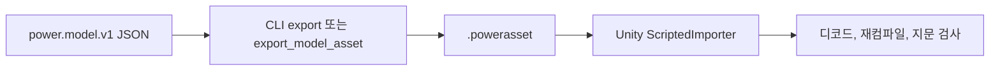

# 모델 자산

[English](ASSET_FORMAT.md) · [简体中文](ASSET_FORMAT.zh-CN.md) · [Français](ASSET_FORMAT.fr.md) · [Русский](ASSET_FORMAT.ru.md) · [日本語](ASSET_FORMAT.ja.md) · **한국어** · [Deutsch](ASSET_FORMAT.de.md) · [Español](ASSET_FORMAT.es.md) · [Italiano](ASSET_FORMAT.it.md) · [Português](ASSET_FORMAT.pt-BR.md)

`power.model.v1` JSON이 작성 입력입니다. `.powerasset` 파일은 다른 런타임을 위해 모델과 실험 데이터를 담습니다. `Power.Assets`는 JSON 라이브러리, Unity, 제3자 패키지에 의존하지 않으며, 코어와 함께 .NET 10과 .NET Standard 2.1용으로 컴파일됩니다.

CLI `export` 명령과 MCP `export_model_asset` 도구는 같은 인코더를 사용합니다. Unity `ScriptedImporter`는 파일을 `PowerModelAsset`으로 가져오고 데이터 바이트만 직렬화합니다. 런타임에 바이트가 디코드되고, 모델이 다시 컴파일되며, 임의 코드나 저장된 LU 분해는 로드되지 않습니다. 기본 자산은 `tools/Build.cs`가 만들며 JSON에서 다시 빌드할 수 있습니다.

## 현재 버전 28

`recirculating-liquid-cylinder`와 `recirculating-needle-cylinder`는 유한 연료, 실제 분사, 증발과 선택적 니들 동역학을 보존합니다. v28은 연결/열 비율을 저장하고 v1-v27을 읽습니다. 각 반환은 기존 상한 내 8개 상태를 추가합니다.

| Identifier | Value |
|---|---|
| kind | 41 (`liquid_rail_return`) |
| fingerprint_tag | 32 |
| count_table_int32 | 40 |
| count_table_bytes | 160 |
| header_bytes | 238 + UTF-8 name length |
| liquid_return_record_bytes | 24 |

[LIQUID_FUEL_RETURN.ko.md](LIQUID_FUEL_RETURN.ko.md)

## 유지된 버전 27

v27은 탱크와 공급 선택을 저장하고 v1-v26을 읽습니다. 각 탱크는 기존 상한 안에서 4개 상태를 추가합니다. 독립 습윤 교환, 고갈 압력/축 에너지 해석, 반환 혼합, 전체 원장, rollback, 분기와 무할당 스텝을 검사합니다.

| Identifier | Value |
|---|---|
| kind | 40 (`liquid_fuel_tank`) |
| fingerprint_tag | 31 |
| tank_state_field | 87 |
| count_table_int32 | 39 |
| count_table_bytes | 156 |
| header_bytes | 234 + UTF-8 name length |
| liquid_feed_record_bytes | 28 |
| liquid_tank_record_bytes | 32 |

[LIQUID_FUEL_TANK.ko.md](LIQUID_FUEL_TANK.ko.md)

## 유지된 버전 26

인코더는 `power.asset.v26`를 쓰고 v1-v26을 읽습니다. 38개의 int32 계수(152 bytes)가 있고 헤더는 230 + UTF-8 이름 길이 bytes입니다. 종류 39는 `liquid_rail_feed`, 지문 태그는 30입니다. 24 bytes 레코드는 색인, 인젝터/펌프 ID와 원천 온도량을 저장합니다. 형식과 레일/펌프 독점 소유권을 확인하며 재서명 v25 다운그레이드는 새 종류를 거부합니다.

## 유지된 버전 25

인코더는 `power.asset.v25`를 쓰고 v1-v25를 읽습니다. 계수 표에는 37개의 int32 값(148 bytes)이 있고 헤더는 226 + UTF-8 이름 길이 bytes입니다. 종류 38은 `at_controller`이고 지문 태그는 29입니다. 각 레코드는 고정 208 bytes와 경로마다 12 bytes를 가집니다. 경로 수는 5 또는 6이며 제한된 합계를 별도로 선언합니다. 형식, 클록, 단위, 소유권과 토폴로지를 확인합니다. digest를 다시 서명한 v24 다운그레이드는 새 종류를 거부합니다.

## 유지된 버전 24

인코더는 `power.asset.v24`를 씁니다. 버전 1부터 24까지 계속 읽을 수 있습니다. 개수 표와 레코드 크기는 v23의 것을 유지합니다. 종류 37은 `carrier_gear`입니다. 기본 변속비는 유한하고, 부호가 있으며, 0이 아닙니다. 8바이트 기어 확장은 컴포넌트 인덱스와 구분되는 움직이는 캐리어를 유지합니다. 타입이 있는 개수는 모든 캐리어 물림을 덮습니다. 다이제스트를 다시 봉인한 v23 다운그레이드는 새 종류를 거부합니다.

캐리어 물림은 지문 태그 28, 보정 좌표, 끝점 제약 일관성, 누적 반력을 가진 유계 상대 사영 세분화를 더합니다. 보통 로터 레코드는 절대 유성 자전과 총 캐리어 궤도 관성을 유지합니다. 진본 v23 축소 Ravigneaux 픽스처는 다이제스트/지문과 정확한 업그레이드 리플레이를 유지합니다. [RESOLVED_PLANETS.ko.md](RESOLVED_PLANETS.ko.md)를 참고하세요.

## 유지되는 버전 23

버전 23은 v22 개수 표와 레코드 크기를 유지합니다. 종류 36은 `double_pinion_planetary_gear`입니다. 기본 부호 변속비와 기존 8바이트 기어 확장은 구분되는 캐리어를 유지합니다. 개수와 타입이 있는 커버리지는 새 종류를 포함합니다. 이전 버전은 그것을 거부하며, 다이제스트를 다시 봉인한 v22 다운그레이드도 포함됩니다.

복합 모델은 보정 좌표 누적을 포함해 지문 태그 27을 더합니다. 그 완전한 행은 보통 반력/위상/리플레이 계약에 들어갑니다. 기존 모델은 앞선 지문을 유지합니다. 진본 제어 DCT v22 픽스처는 다이제스트와 정확한 업그레이드 리플레이를 유지합니다. [RAVIGNEAUX_TRANSMISSION.ko.md](RAVIGNEAUX_TRANSMISSION.ko.md)를 참고하세요.

## 유지되는 버전 22

버전 22의 개수 표는 int32 값 35개(140바이트)입니다. 헤더 크기는 `218 + UTF-8 name length`입니다. DCT 제어기 개수는 v21 구동 개수 뒤를 따릅니다. 드라이버 레코드 뒤의 각 DCT 레코드는 104바이트입니다. 컴포넌트 인덱스 int32, 차량·홀수/짝수 클러치 ID uint32, 셀렉터 ID 여덟 개 uint32, 샘플/해제/체결/시간 초과 값 uint64, 그리고 동기화 허용 오차와 방향 속도 한계를 위한 수량 두 개입니다.

종류 35는 `dct_controller`입니다. 필드 73-79는 요청/실제 기어, 홀수/짝수 선택, 변속 위상, 동기화 오차, 제어 결함입니다. 기존 ID는 변하지 않습니다. 제어기 모델은 안정 경로, 타이밍, 허용 오차와 함께 지문 태그 26을 더합니다. 초기 해제 명령, 단독 소유권, 완전한 토폴로지, 정수 요청, 유계 상태 개수, 타이밍 정렬은 컴파일 때 검사됩니다. 위조된 v21 다운그레이드는 제어기 레코드/종류를 거부합니다. 진본 v21 DCT 그래프는 다이제스트/지문과 같은 런타임의 업그레이드된 리플레이를 유지합니다. [DCT_CONTROL.ko.md](DCT_CONTROL.ko.md)를 참고하세요.

## 유지되는 버전 21

버전 21의 v20 개수 표와 `214 + UTF-8 name length` 헤더는 변하지 않습니다. 각 니들 드라이버 레코드는 40바이트입니다. v20 필드에 선택적 폐쇄 지평 uint64가 더해집니다. 이전 드라이버 레코드는 32바이트이며 예측이 꺼진 상태로 디코드됩니다.

예측 모델은 지문 태그 25와 지평 나노초를 더합니다. 예측이 꺼진 모델은 이전 지문과 상태 해시를 유지합니다. 필드 69-72는 예측 연료 질량, 예측 틱, 드라이버 차단 상태, 대기 중인 닫힘 틱입니다. 기존 ID는 고정으로 남습니다. 지평/정렬/예산과 시계 규칙은 물리/제어 컴파일에 속합니다. 켜진 예측을 벗겨 낸 위조 다운그레이드는 지문 검증에 실패합니다. 진본 v20 자산은 다이제스트와 같은 런타임의 업그레이드된 리플레이를 유지합니다. [CLOSURE_PREDICTION.ko.md](CLOSURE_PREDICTION.ko.md)를 참고하세요.

## 유지되는 버전 20

버전 20의 int32 개수 34개는 136바이트를 차지합니다. 헤더는 `214 + UTF-8 name length` 바이트입니다. 액체 인젝터 개수 뒤의 개수 네 개는 솔레노이드, 이동 정지, 선택적 인젝터 니들, 샘플링 니들 드라이버를 설명합니다. 액체 표 뒤:

| 표 | 바이트 | 데이터 |
|---|---:|---|
| 솔레노이드 | 28 | 컴포넌트 인덱스 int32, 기준 위치와 인덕턴스 기울기 수량 |
| 이동 정지 | 40 | 컴포넌트 인덱스 int32, 최소/최대 위치와 강성 수량 |
| 니들 | 32 | 인젝터 컴포넌트 인덱스 int32, 니들 노드 ID uint32, 닫힘/완전 개방 수량 |
| 드라이버 | 32 | 컴포넌트 인덱스 int32, 인젝터/솔레노이드 ID uint32, 주기 uint64, 구동 전압 수량 |

솔레노이드 R/L/초기 전류, 전압 입력, 열 싱크는 기본 레코드를 사용합니다. 종류 32-34는 `solenoid`, `travel_stop`, `needle_driver`입니다. `HenryPerMeter`는 단위 열거에 추가됩니다(`h_m`). 필드 68은 `copper_heat`입니다. 기존 ID는 값을 유지합니다. 자기/정지 모델은 지문 태그 22를, 물리적 니들 개방은 태그 23을, 드라이버 정의는 태그 24를 더합니다. 매개변수, 안정 참조, 샘플링 주기가 지문에 들어갑니다.

타입이 있는 유계 레코드, 단위, 구분되는 소유자, 완전한 커버리지, 물리 컴파일은 계속 필요합니다. 위조된 v19 다운그레이드는 구동 종류를 거부합니다. 니들 확장을 벗기면 컴파일된 지문이 바뀝니다. 진본 v19 액체 픽스처는 다이제스트/지문과 같은 런타임의 업그레이드된 리플레이를 유지합니다. [NEEDLE_ACTUATION.ko.md](NEEDLE_ACTUATION.ko.md)를 참고하세요.

## 유지되는 버전 19

버전 19의 int32 개수 30개는 120바이트를 차지합니다. 헤더는 `198 + UTF-8 name length` 바이트입니다. 액체 인젝터 개수는 v18 필름 개수 뒤를 따릅니다. 필름 상 표 뒤의 각 액체 레코드는 120바이트를 차지합니다. 컴포넌트 표 인덱스 int32, 대상 필름 ID uint32, 크랭크 ID uint32, 그다음 사이클/시작/지속 각도, 최대 도즈, 초기 공급 질량, 공급 온도, 밀도, 초기 절대 압력, 압력 컴플라이언스를 위한 수량 아홉 개입니다. 각 수량은 double과 int32 단위입니다. 노즐 면적/계수는 기존 36바이트 오리피스 확장을 사용합니다.

종류 31은 `liquid_fuel_injector`입니다. `KilogramPerCubicMeter`는 단위 열거에 추가되며 JSON 이름은 `kg_m3`입니다. 기존 영역/단위/출력 ID는 고정으로 남습니다. 액체 모델은 안정 필름/크랭크 ID, 타이밍, 공급 물성을 포함해 지문 태그 21을 더합니다. 유계이고 타입이 있는 완전한 커버리지, 다이제스트, 단위, 물리 소유권이 필요합니다. 위조된 v18 다운그레이드는 액체 인젝터를 거부합니다. 진본 v18 필름 픽스처는 다이제스트/지문과 같은 런타임의 업그레이드된 리플레이를 유지합니다. [LIQUID_FUEL_INJECTION.ko.md](LIQUID_FUEL_INJECTION.ko.md)를 참고하세요.

## 유지되는 버전 18

버전 18의 int32 개수 29개는 116바이트를 차지합니다. 헤더는 `194 + UTF-8 name length` 바이트입니다. 필름 개수는 v17 연료 인젝터 개수 뒤를 따릅니다. 인젝터 레코드 뒤의 각 필름 레코드는 64바이트를 차지합니다. 컴포넌트 표 인덱스 int32, 그다음 초기 질량, 초기 온도, 액체 비열, 포화 온도, 잠 내부 에너지를 다섯 수량으로 둡니다(double과 int32 단위). 컨덕턴스와 수신기/벽 ID는 기본 컴포넌트 레코드에 남습니다.

종류 30은 `fuel_film`입니다. 필드 66-67은 kg 단위의 누적 증발 연료 질량과 J 단위의 필름 벽 열입니다. 기존 ID는 고정으로 남습니다. 필름 모델은 초기 상 에너지, 액체 질량, 상 상수를 포함해 지문 태그 20을 더합니다. 타입이 있는 완전한 커버리지, 유계 개수/길이, 다이제스트, 단위, 물리 컴파일이 필요합니다. 위조된 v17 다운그레이드는 필름을 거부합니다. 진본 v17 계량 실린더 픽스처는 다이제스트/지문과 같은 런타임의 업그레이드된 리플레이를 유지합니다. [FUEL_FILM.ko.md](FUEL_FILM.ko.md)를 참고하세요.

## 유지되는 버전 17

버전 17의 int32 개수 28개는 112바이트를 차지합니다. 헤더는 `190 + UTF-8 name length` 바이트입니다. 인젝터 개수는 v16 가스 피스톤 개수 뒤를 따릅니다. 가스 피스톤 기하 뒤의 각 인젝터 레코드는 56바이트를 차지합니다. 컴포넌트 표 인덱스 int32, 타이밍 크랭크 ID uint32, 그다음 사이클/시작/지속 각도와 최대 도즈를 네 수량으로 둡니다. 노즐 면적/계수도 기존 36바이트 가스 오리피스 레코드를 사용합니다. 기본 입력 수량은 개방 분율이 아니라 사이클당 kg을 담습니다.

종류 29는 `gas_fuel_injector`입니다. 필드 63-65는 요청 사이클 도즈, 공급 사이클 도즈, kg 단위의 누적 공급 연료입니다. 기존 ID는 고정으로 남습니다. 이 모델은 크랭크 ID, 창, 도즈 한계를 유지하며 지문 태그 19를 더합니다. 타입이 있는 완전한 커버리지, 유계 개수/길이, 다이제스트, 단위, 양립하는 유한 포트가 필요합니다. 위조된 v16 다운그레이드는 인젝터를 거부합니다. 진본 v16 가스 어큐뮬레이터 자산은 다이제스트/지문과 같은 런타임의 업그레이드된 리플레이를 유지합니다. [FUEL_METERING.ko.md](FUEL_METERING.ko.md)를 참고하세요.

## 유지되는 버전 16

버전 16의 int32 개수 27개는 108바이트를 차지합니다. 헤더는 `186 + UTF-8 name length` 바이트입니다. 선형 가스 피스톤 개수는 v15 스풀 개수 뒤를 따릅니다. 스풀 기하 뒤의 각 가스 피스톤 레코드는 56바이트를 차지합니다. 컴포넌트 표 인덱스 int32, 압축 방향 int32(+1 또는 -1), 그리고 면적, 기준 체적, 기준 위치, 절대 기준 압력을 위한 수량 네 개입니다. 각 수량은 double과 int32 단위입니다. 가스 노드는 기존 조성 레코드를 사용하고 고정 저장을 생략합니다.

종류 28은 `gas_piston`입니다. 기존 영역/단위/출력 ID는 바뀌지 않습니다. 이 모델은 기하/기준 값과 방향을 포함해 지문 태그 18을 더합니다. 타입이 있는 완전한 커버리지, 유계 개수/길이, 다이제스트, 물리 컴파일은 계속 필요합니다. 위조된 v15 다운그레이드는 가스 피스톤을 거부합니다. 진본 v15 스풀 픽스처는 다이제스트, 지문, 물리 참조, 같은 런타임의 업그레이드된 리플레이를 유지합니다. [GAS_PISTON.ko.md](GAS_PISTON.ko.md)를 참고하세요.

## 유지되는 버전 15

버전 15의 int32 개수 26개는 104바이트를 차지합니다. 헤더는 `182 + UTF-8 name length` 바이트입니다. 스풀 밸브 개수 하나는 v14 피스톤/접촉 개수 뒤를 따릅니다. 그 확장 표 뒤의 각 스풀 레코드는 32바이트를 차지합니다. 컴포넌트 표 인덱스 int32, 참조된 피스톤 컴포넌트 ID uint32, 닫힘 위치 수량, 완전 개방 위치 수량입니다. 각 수량은 double 값과 int32 단위입니다. 유량 매개변수와 저장소 압력은 기존 40바이트 유압 유동 제한 레코드에 남습니다.

종류 27은 `hydraulic_spool_valve`입니다. 기존 ID, 단위, 출력 필드는 값을 유지합니다. 스풀 모델은 지문 태그 17과 두 랜드 위치/피스톤 ID를 더합니다. 타입이 있는 완전한 커버리지, 유계 개수, 길이, 다이제스트, 단위, 행정 소유권이 검사됩니다. v14로의 위조 다운그레이드는 스풀 종류를 거부합니다. 진본 v14 피스톤 자산은 다이제스트, 지문, 같은 런타임의 업그레이드된 리플레이를 유지합니다. [HYDRAULIC_SPOOL.ko.md](HYDRAULIC_SPOOL.ko.md)를 참고하세요.

## 유지되는 버전 14

버전 14의 개수 표는 int32 값 25개(100바이트)를 담습니다. v13 배터리와 듀티 제어 개수 뒤의 개수 두 개는 유압 피스톤과 접촉 구동 클러치를 설명합니다. 헤더는 `178 + UTF-8 name length` 바이트입니다. 듀티 제어기 표 뒤:

| 확장 | 바이트 | 필드 |
|---|---:|---|
| 유압 피스톤 | 104 | 컴포넌트 표 인덱스 int32, 후면 노드 ID uint32, 전면/후면 면적, 배압, 최소/최대 위치, 정지 강성, 접촉 위치/강성을 여덟 수량으로 |
| 피스톤 클러치 | 40 | 컴포넌트 표 인덱스 int32, 피스톤 컴포넌트 ID uint32, 유효 반경 수량, 정지/슬립 계수를 두 double로, 마찰면 uint32 |

병진 질량/속도/위치와 선형 스프링/힘 매개변수는 기존 기본 레코드를 사용합니다. 영역 6은 병진입니다. 종류 23-26은 선형 스프링, 유압 피스톤, 피스톤 클러치, 힘 공급원입니다. 단위 47-49는 m/s, N/m, N*s/m입니다. 필드 60-62는 변위, 선형 속도, 힘입니다. 누적 스프링 감쇠 열은 기존 필드 34를 사용합니다. 피스톤/접촉 모델은 행정, 패드, 후면 경계, 참조된 피스톤, 마찰 기하를 포함해 지문 태그 16을 더합니다.

유계 개수, 타입이 있는 인덱스, 구분되는 완전한 확장, 정확한 길이, 다이제스트, 1 MiB 한계는 모델 사용 전에 검사됩니다. 이전 버전은 확장 레코드를 제거하고 다이제스트를 다시 계산해도 새 영역/종류를 거부합니다. 컴파일러는 SI 단위, 타입이 있는 포트, 증가하는 행정, 패드 간극, 마찰 순서를 검사합니다. 진본 v13 픽스처는 원래 다이제스트와 같은 런타임의 업그레이드된 리플레이를 유지합니다. [피스톤 계약](HYDRAULIC_PISTON.ko.md)을 참고하세요.

## 유지되는 버전 13

버전 13은 v12 표에 int32 개수 두 개를 추가합니다. 배터리와 듀티 제어기입니다. 헤더는 `170 + UTF-8 name length` 바이트입니다. 기존 전압 제어기 레코드 뒤:

| 확장 | 바이트 | 필드 |
|---|---:|---|
| 배터리 | 68 | 노드 표 인덱스 int32, 열 노드 ID uint32, 빈/가득 OCV, 직렬 저항, 분극 저항과 커패시턴스를 다섯 수량으로 |
| 듀티 제어기 | 80 | 컴포넌트 표 인덱스 int32, 대상 채널 uint64, 샘플 주기 uint64, 비례/적분 게인, 듀티 한계, 초기 적분을 다섯 수량으로 |

배터리 용량, SOC, 분극 초기 전압은 기존 노드 필드를 사용합니다. 배터리 모터와 저항 부하는 포트, RL 매개변수, 저항, 개방/듀티를 기본 컴포넌트 레코드에 유지합니다. 영역 5는 배터리입니다. 종류 20–22는 배터리 모터, 저항 부하, 압력 듀티 제어기입니다. 단위 42–46은 C, F, Ah, fraction/Pa, fraction/(Pa·s)입니다. 필드 53–59는 SOC, 충전량, 단자/분극 전압, 배터리 전류, 적분 듀티, 명령 듀티입니다. 이전 식별자는 고정으로 남습니다.

유계이고 타입이 있는 표, 정확한 커버리지/길이, 다이제스트, 1 MiB 한계는 유지됩니다. 옛 버전은 확장 표를 제거한 뒤에도 배터리 영역과 새 종류를 거부합니다. 컴파일은 충전량 한계, 차원, 타입이 있는 공급원, OCV 순서, 제어 소유권을 검사합니다. 배터리 모델은 지문 태그 14를, 듀티 제어는 태그 15를 더합니다. 이전 모델은 지문을 유지합니다. 진본 v12와 그 이전 픽스처는 원래 다이제스트와 같은 런타임 리플레이를 검증합니다. [배터리 계약](HYDRAULIC_PUMP.ko.md#finite-battery-supply-and-duty-regulation)을 참고하세요.

## 유지되는 버전 12

버전 12는 압력 제어기 레코드를 위한 스물한 번째 int32 개수를 추가합니다. 헤더는 `162 + UTF-8 name length` 바이트입니다. 펌프와 릴리프 표 뒤의 각 제어기 확장은 80바이트를 차지합니다.

| 데이터 | 인코딩 |
|---|---|
| 컴포넌트 표 인덱스 | int32, 구분되며 종류 19(`pressure_controller`)를 참조 |
| 소유한 대상 전압 채널 | uint64 |
| 나노초 단위 샘플 주기 | uint64 |
| 비례 게인, 적분 게인, 최소/최대 전압, 초기 적분 | 수량 다섯 개, 각각 double 값과 int32 단위 |

센서 노드, 설정값 채널, 초기 압력 목표는 기본 컴포넌트 레코드에 남습니다. 입력과 KPI 검사는 제어기 표를 따릅니다. 정확한 길이, 유계 개수, 타입이 있는 인덱스, 완전한 확장 커버리지, 다이제스트, 1 MiB 한계가 검사됩니다. v11로의 위조 다운그레이드는 레코드를 제거한 뒤에도 제어기 종류를 거부합니다. 컴파일은 단위, 센서 영역, 대상 소유권, 한계, 틱에 정렬된 주기를 검사합니다. 단위 40/41은 V/Pa와 V/(Pa·s)입니다. 필드 49–52는 샘플링된 압력, 압력 오차, 적분 전압, 유지 명령입니다. 기존 식별자는 값을 유지합니다.

제어되는 모델은 샘플링 주기, 대상 채널, 초기 적분을 포함해 지문 태그 13을 더합니다. 제어기 이력은 직렬화되지 않고 리플레이를 통해 재구성됩니다. 제어되지 않는 모델은 지문과 궤적을 유지합니다. 진본 v11 픽스처와 이전 픽스처는 모두 변하지 않습니다. [압력 조절 계약](HYDRAULIC_PUMP.ko.md#sampled-pressure-regulation)을 참고하세요.

## 유지되는 버전 11

버전 11은 v10 개수 열여덟 개에 펌프와 릴리프 int32 개수를 추가합니다. 기존 유압 유동 제한과 액추에이터 표 뒤에 32바이트 펌프 레코드(컴포넌트 인덱스, 입구 노드 ID, 배제 체적 수량, 저장소 압력 수량)가 오고, 그다음 16바이트 릴리프 레코드(컴포넌트 인덱스와 크래킹 압력 수량)가 옵니다. 릴리프는 컨덕턴스와 경계 압력을 위한 기존 40바이트 유동 제한 레코드도 갖습니다. 입력과 검사는 이 새 표를 따릅니다. 헤더는 `158 + UTF-8 name length` 바이트입니다.

타입이 있고 구분되는 인덱스, 종류별 완전한 레코드, 정확한 길이, SHA-256, 유계 개수가 검사됩니다. 이전 형식은 종류 17/18(펌프/릴리프)을 거부합니다. 단위 39는 m³/rad입니다. 필드 48은 부호 있는 유압 동력입니다. 펌프 일은 컴포넌트의 필드 44를 재사용하고, 객체 0은 외부 유압 일을 유지합니다. 펌프/릴리프 모델은 지문 태그 12를 더합니다. 둘 다 없는 모델은 지문을 유지합니다. 진본 v10 유압 픽스처는 원래 다이제스트와 리플레이를 검사합니다. [펌프 계약](HYDRAULIC_PUMP.ko.md)을 참고하세요.

## 유지되는 버전 10

버전 10은 v9 개수 열여섯 개 뒤에 int32 개수 두 개를 추가합니다. 유압 유동 제한과 유압 클러치입니다. 유압 노드 영역 4는 기존 44바이트 노드 레코드를 사용합니다. 저장은 컴플라이언스이고, 초기 값은 게이지 압력이며, 위치는 0/None입니다. 이전 형식은 컴포넌트 확장이 없어도 유압 노드를 거부합니다.

완전한 가변 길이 컨버터 표 뒤에 이 고정 크기 레코드가 옵니다.

| 확장 | 바이트 | 필드 |
|---|---:|---|
| 유압 유동 제한 | 40 | 컴포넌트 인덱스 int32, 계수, 전이 압력, 저장소 압력을 세 수량으로 |
| 유압 클러치 | 64 | 컴포넌트 인덱스 int32, 압력 노드 ID uint32, 피스톤 면적, 예압, 반경을 수량으로, 정지/슬립 계수를 double로, 마찰면 수 uint32 |

각 종류에는 범위 안의 구분되는 확장이 정확히 하나 필요합니다. 공통 회전/유압 포트, 변속비, 밸브 입력, 열 싱크는 기본 컴포넌트 레코드에 남습니다. 저장소 압력은 내부 모서리의 0/None을 포함해 유동 제한 확장에 명시적으로 담깁니다. 예약 입력과 검사는 두 유압 표를 모두 따릅니다. 개수, 정확한 길이, SHA-256, 1 MiB 한계는 컴파일이 차원, 토폴로지, 물리 범위를 검증하기 전에 검사됩니다.

종류 14–16은 선형 유동 제한, 난류 유동 제한, 압력 클러치를 식별합니다. 단위 34–38은 컴플라이언스, 선형/난류 계수, 체적 유량, 힘을 더합니다. 필드 41–47은 체적 유량, 저장소 재고, 재고 잔차, 유압 일, 압착력, 정지/슬립 용량을 더합니다. 기존 열/압력 필드는 재사용됩니다. 유압 노드가 있는 모델은 지문 태그 11을 더합니다. 유압이 없는 모델은 이전 지문을 유지합니다. 솔버 이력은 리플레이를 통해 재구성됩니다. 진짜 v9 컨버터 픽스처는 원래 다이제스트, 지문, 업그레이드된 궤적을 검사합니다. [유압 계약](HYDRAULIC_NETWORK.ko.md)을 참고하세요.

## 유지되는 버전 9

버전 9는 v8 개수 열네 개 뒤에 int32 개수 두 개를 추가했습니다. 컨버터 컴포넌트와 총 맵 점입니다. 컨버터는 최대 여덟 개, 네 맵 각각 최대 32점이 지원됩니다. 기어 표 뒤의 각 컨버터 레코드는 20바이트 헤더를 갖습니다. 컴포넌트 표 인덱스와 int32 점 개수 네 개입니다. 점은 그 바로 뒤를 펌프 양, 펌프 음, 터빈 양, 터빈 음 순서로 따릅니다. 각 점은 28바이트를 차지합니다. 속도비(double), 토크비(double), 용량 계수(double + int32 단위)입니다. 다음 컨버터 헤더는 그 점들 뒤를 따릅니다. 예약 입력과 검사는 모든 컨버터 레코드를 따릅니다. 노드, 기본 컴포넌트, 이전 확장은 크기를 유지합니다.

정확한 크기, SHA-256, 1 MiB 한계, 모든 합계/맵별 개수, 구분되는 타입이 있는 인덱스, 소비된 총 점 개수가 검사됩니다. 그다음 컴파일이 토폴로지, 단위, 연속 기준 부재 경계, 매듭 사이의 수동성을 검증합니다. 빠지거나, 중복되거나, 잘못되었거나, 종류가 틀리거나, 다운그레이드된 컨버터 레코드는 거부됩니다.

종류 13은 컨버터를, 단위 33은 그 용량 계수를 식별하고, 필드 38–40은 유체 열, 속도비, 기준 부재 코드를 더합니다. B/C 토크와 열 흐름 필드는 재사용됩니다. C 토크는 세 번째 로터 포트가 없는 정지 스테이터 반력입니다. 컨버터 모델은 지문 태그 10과 모든 정규화된 맵 값을 더합니다. 솔버 인자와 평균/누적 이력은 리플레이로 재구성됩니다. 진본 v1–v8 픽스처는 유지된 지문과 재생을 검증합니다. [컨버터 계약](CONVERTER_NETWORK.ko.md)을 참고하세요.

## 유지되는 버전 8

버전 8은 이상 기어 토폴로지를 위한 열네 번째 int32 개수를 추가했습니다. 클러치 확장 표 뒤의 각 8바이트 레코드는 컴포넌트 표 인덱스(int32)와 캐리어 노드 ID(uint32)를 담습니다. 구분되는 레코드가 정확히 하나 `IdealGear` 또는 `PlanetaryGear` 컴포넌트 각각을 참조해야 합니다. 캐리어 ID는 이상 쌍에서는 0이고, 유성에서는 구분되는 회전 노드입니다. A/B 노드 ID와 변속비는 변하지 않은 156바이트 기본 레코드에 남습니다. 노드는 44바이트로 남고 이전 확장 크기는 변하지 않습니다.

개수는 순서대로 노드, 컴포넌트, 예약 입력, 검사, 밀폐 실린더, 가스 노드, 오리피스, 가동 실린더, 밸브, 혼합물, 저장소 분율, 버너, 클러치, 기어입니다. 정확한 페이로드 길이, SHA-256, 1 MiB 한계는 컴파일 전에 검사됩니다. 입력과 KPI 검사는 모든 확장 표를 따릅니다.

종류 ID 11/12는 이상/유성 기어를 식별합니다. 필드 35/36/37은 B의 토크, C의 토크, 위상 오차를 더합니다. 기어 속도 잔차는 필드 32를 재사용합니다. 이전 식별자는 값을 유지합니다. 기어가 있는 모델은 캐리어 끝점을 포함해 지문 태그 9를 더합니다. 기어 없는 지문은 변하지 않습니다. 초기 상대 위상은 로터 각도에서 유도됩니다. 평균 반력 이력과 제약 인자는 솔버 상태로 직렬화되지 않고 리플레이로 재구성됩니다.

잘못된 포트/변속비, 종속 제약, 양립하지 않는 초기 속도, 무관한 물리 매개변수, 빠지거나 중복되거나 종류가 틀린 확장, 위조 다운그레이드는 거부됩니다. 진짜 v7 점화 클러치 픽스처는 다이제스트, 모델 지문, 업그레이드된 리플레이를 보존합니다. v1–v6 픽스처는 남습니다. [결합 기어](GEAR_NETWORK.ko.md)와 [픽스처 출처](../tests/Power.Tests/Fixtures/README.md)를 참고하세요.

## 유지되는 버전 7

버전 7은 클러치 확장을 위한 열세 번째 int32 개수를 추가했습니다. 연소 표 뒤의 각 28바이트 레코드는 컴포넌트 표 인덱스와 수량 두 개를 담습니다. Nm 단위의 정지 및 슬립 토크 용량입니다. 레코드가 정확히 하나 각 `Clutch` 컴포넌트를 참조해야 하며, 인덱스는 구분되고 범위 안이어야 합니다. 지면/로터 끝점, 변속비, 체결 입력, 열 목적지는 변하지 않은 156바이트 기본 컴포넌트 레코드에 남습니다.

컴파일은 단위, `static >= sliding >= 0`, 변속비, 토폴로지, 체결을 검증합니다. 빠지거나 중복되거나 종류가 틀린 확장, 잘못된 용량, 위조 다운그레이드 시도, 지문 변경은 거부됩니다. 노드 레코드는 44바이트로 남고, 모든 옛 확장 레코드는 크기를 유지합니다. 개수, 정확한 크기, 다이제스트, 1 MiB 한계는 컴파일 전에 검사됩니다. 예약 입력과 검사는 모든 확장 표를 따릅니다.

클러치 종류 10, 필드 32–34(슬립 속도, 모드, 마찰 열), 단위 32(`StateCode`)는 이전 식별자를 다시 번호 매기지 않고 추가됩니다. 모델은 클러치가 있을 때만 지문 태그 8을 포함합니다. 솔버 인자, 위상 이력, 평균 출력, 열 장부는 리플레이로 재구성됩니다. 직렬화되지 않습니다. 진본 v6 점화 픽스처는 변하지 않은 이전 지문과 업그레이드된 재생을 검증합니다. [결합 클러치](CLUTCH_NETWORK.ko.md)와 [픽스처 출처](../tests/Power.Tests/Fixtures/README.md)를 참고하세요.

## 유지되는 버전 6

버전 6은 v5 개수 아홉 개 뒤에 int32 개수 세 개를 더합니다. 예혼합 가스 조성, 저장소 분율, 연소 매개변수입니다. 따라서 헤더에는 개수가 열두 개 있습니다. 타이밍 표 뒤에 이 확장 표가 그 순서로 옵니다.

| 확장 | 크기 | 인코딩 |
|---|---|---|
| 예혼합 가스 | 40바이트 | 가스 노드 표 인덱스(int32), LHV(수량), 이론 공기/연료 비(double), 초기 연료와 신선 공기 분율(double 두 개) |
| 저장소 분율 | 20바이트 | 컴포넌트 표 인덱스(int32), 연료와 신선 공기 분율(double 두 개) |
| 연소 | 56바이트 | 컴포넌트 표 인덱스(int32), 사이클/시작/지속 각도(수량 세 개), 형상 지수와 연소 계수(double 두 개) |

각 표에는 적절한 종류의, 구분되고 범위 안인 인덱스가 필요합니다. `PremixedCombustion` 컴포넌트마다 연소 레코드가 정확히 하나 필요합니다. 선택적 혼합물 레코드는 연결된 가스 노드에 대해 검증됩니다. 예혼합 저장소 경계에는 명시적 분율 레코드가 필요합니다. 개수와 정확한 길이는 설명자 배열 할당 전에 검사되고, 이어서 토폴로지, 단위, 분율 합, 프로파일 제약이 검사됩니다. 선택적 조성을 제거하면 의미론이 바뀌어 컴파일이나 모델 지문에 실패합니다.

기본 컴포넌트 레코드는 변하지 않습니다. 크랭크/가스 ID와 연소 승수 입력은 거기에 남습니다. 새 종류, 필드, 단위 식별자는 추가됩니다. 옛 식별자는 값을 유지합니다. 솔버 상태, 성분 이력, 비가역 프런티어, 누적 장부는 직렬화되지 않습니다. 리플레이가 모델과 예약 입력에서 그것들을 재구성합니다. 진본 v5 픽스처는 이전 타이밍 모델 지문과 업그레이드된 리플레이를 보존합니다. [예혼합 연소](PREMIXED_COMBUSTION.ko.md)를 참고하세요.

## 유지되는 버전 5

버전 5는 v4 개수 뒤에 아홉 번째 int32 개수를 더합니다. 선택적 크랭크 밸브 타이밍 확장입니다. 가동 실린더 레코드 뒤의 각 44바이트 타이밍 레코드는 다음을 담습니다.

| 데이터 | 인코딩 |
|---|---|
| 컴포넌트 표 인덱스 | int32, 고유하며 가스 오리피스를 참조 |
| 크랭크 노드 ID | uint32 안정 ID, 회전 노드를 참조 |
| 사이클 각도, 개방 각도, 지속 각도 | 수량 세 개(각각 double + int32 단위) |

타이밍은 각 오리피스에서 선택적입니다. 개수, 정확한 길이, 레코드 타입, 고유성은 컴파일이 단위, 사이클, 위상, 지속 시간을 검증하기 전에 검사됩니다. 타이밍 레코드를 제거하면 모델 의미론이 바뀌어 저장된 지문 검사에 실패합니다. 타이밍 모델은 지문 태그 6을 더합니다. 타이밍이 없는 모델은 이전 지문을 유지합니다. 진본 v4 픽스처는 다시 인코딩한 뒤에도 변하지 않은 가동 실린더 리플레이를 검증합니다. 입력, 검사, SHA-256 트레일러는 모든 확장 표를 따릅니다. [타이밍](VALVE_TIMING.ko.md)을 참고하세요.

## 유지되는 버전 4

버전 4는 v3 개수 일곱 개 뒤에 여덟 번째 int32 개수를 더합니다. 가동 실린더 확장입니다. v3 가스 노드와 오리피스 확장 뒤의 각 가동 실린더 레코드는 다음을 담습니다.

| 데이터 | 인코딩 |
|---|---|
| 컴포넌트 표 인덱스 | int32. 고유하고, 범위 안이며, 가스 실린더를 참조 |
| 보어, 행정, 커넥팅 로드 길이, 위상 | 수량 네 개(각각 double + int32 단위) |
| 압축비 | double |
| 배압 | 수량 하나 |

각 레코드는 72바이트입니다. 가스 실린더마다 레코드가 정확히 하나 필요합니다. 그 가스 노드는 초기 온도, 압력, 조성을 기존 필드에 저장합니다. 기하가 체적을 제공하므로 저장 수량은 0/None입니다. 판독기가 초기 체적이나 가스 상태를 조용히 제공하지는 않습니다. 옛 버전은 새 컴포넌트를 거부합니다. 실린더 소유권, 토폴로지, 차원은 지문이 수용되기 전에 컴파일이 검사합니다. 소스/다이제스트/크기/일정 한계는 변하지 않습니다.

## 유지되는 버전 3과 그 이전 판독기

버전 3은 고정 체적 가스 지원을 도입했습니다. 기본 노드/컴포넌트 표와 v2 실린더 확장을 유지합니다. 개수 헤더는 int32 값 일곱 개를 순서대로 담습니다. 노드, 컴포넌트, 예약 입력, 검사, 실린더, 가스 노드, 가스 오리피스입니다. 기본 표와 실린더 확장 뒤에 이 레코드가 옵니다.

| 확장 | 크기 | 인코딩 |
|---|---|---|
| 가스 조성 | 24바이트 | 노드 표 인덱스(int32), 비기체 상수(수량), gamma(double) |
| 가스 오리피스 | 36바이트 | 컴포넌트 표 인덱스(int32), 면적(수량), 유출 계수(double), 저장소 압력(수량) |

수량은 double 뒤에 int32 단위 식별자가 옵니다. 기본 노드 표는 체적, 초기 온도, 초기 압력을 유지합니다. 기본 컴포넌트 표는 개방, 채널, 끝점, 벽 컨덕턴스, 저장소 온도(기존 `AmbientTemperature` 필드)를 유지합니다. 가스 벽 링크에는 확장이 필요하지 않습니다. 레코드는 객체 ID가 아니라 정렬된 표 인덱스를 참조합니다.

각 가스 노드, 오리피스, 실린더에는 자기 타입의 확장이 정확히 하나 필요합니다. 알 수 없는 버전, 잘못된 개수, 틀린 길이, 중복/누락/타입 불일치 확장, 나쁜 체크섬, 모델 지문 불일치는 거부됩니다. 개수와 정확한 길이는 설명자 배열 할당 전에 검사됩니다. 1 MiB 한계는 최종 SHA-256 다이제스트를 포함해 파일 전체에 적용됩니다. 예약 개방은 자산 생성/내보내기 전에 [0, 1]에서 검증됩니다.

옛 v1/v2 판독기는 원래 모델 집합을 위해 유지됩니다. 가스 영역/컴포넌트에는 v3가 필요합니다. [픽스처](../tests/Power.Tests/Fixtures/README.md)의 진본 v1과 실린더 v2 픽스처는 디코딩과 업그레이드된 리플레이를 실행합니다. 솔버 의미론과 모델 지문은 이 형식 개정으로 바뀌지 않습니다.

## 유지되는 버전 2와 버전 1 호환

버전 2는 기본 노드/컴포넌트 표를 보존하고, 원래 개수 네 개 뒤에 다섯 번째 int32 개수를 더합니다. 실린더 확장의 개수입니다. 기본 컴포넌트 표 뒤의 각 확장은 116바이트를 차지합니다.

| 데이터 | 인코딩 |
|---|---|
| 컴포넌트 표 인덱스 | int32, 고유하고, 범위 안이며, 밀폐 실린더를 참조 |
| 보어, 행정, 커넥팅 로드 길이, 위상 | 수량 네 개, 각각 double 값 + int32 단위 |
| 압축비 | double |
| 초기 압력, 초기 온도, 비기체 상수 | 수량 세 개 |
| Gamma | double |
| 배압 | 수량 하나 |

입력, 검사, SHA-256 트레일러는 확장 뒤를 따릅니다. 디코더는 설명자 배열을 할당하기 전에 유계 개수와 정확한 길이를 검증합니다. 중복되거나 일치하지 않는 확장을 거부합니다. 컴파일은 각 밀폐 실린더에 매개변수 레코드가 정확히 하나 있기를 요구합니다. 확장된 단위와 필드 열거는 기존 식별자를 바꾸지 않고 값을 추가합니다.

버전 1에는 확장 개수나 확장 레코드가 없습니다. 기존 선형 컴포넌트만 사용하는 모델은 솔버 버전 2와 그 지문을 유지하므로, 기존 v1 자산을 디코드하고 리플레이할 수 있습니다. 밀폐 실린더가 있는 모델은 솔버 버전 3을 사용합니다. 불변 [v1 픽스처](../tests/Power.Tests/Fixtures/README.md)는 실제 변경 전 내보내기에 대한 호환을 검사합니다.

## 유지되는 버전 1 배치

모든 정수와 모든 IEEE 754 binary64 값은 리틀 엔디언입니다. 파일은 최대 1 MiB입니다. 문자열은 엄격한 UTF-8입니다.

| 순서 | 데이터 |
|---|---|
| 식별 | ASCII 8바이트 `POWERAST`, 그다음 int32 형식 버전 `1` |
| 모델과 시간 | uint64 모델 지문, 틱 나노초, 실험 지속 시간, 샘플 간격 |
| 출처 | uint16 이름 바이트 수, 이름, 소스 JSON의 32바이트 SHA-256 |
| 개수 | int32 값 네 개: 노드, 컴포넌트, 입력 변경, KPI |
| 설명자 | 노드당 44바이트, 컴포넌트당 156바이트, 객체 ID로 정렬 |
| 입력 | 변경당 24바이트: uint64 시각, uint64 채널, double 값 |
| KPI | 각 33바이트: uint32 객체, int32 필드, 경계 플래그 바이트 하나, double 경계 세 개 |
| 무결성 | 앞선 모든 바이트의 SHA-256, 32바이트 |

노드와 컴포넌트 필드 순서는 `src/Power.Assets/AssetCodec.cs`의 버전 1 코덱을 따릅니다. 개수, 정확한 파일 길이, 다이제스트는 설명자 배열이 할당되기 전에 검사됩니다. 그다음 단위, 토폴로지, 시간, 이벤트, KPI가 검증되고, 지문은 현재 솔버가 컴파일하는 모델과 비교됩니다. 불일치하면 새 내보내기가 필요합니다.

이름은 최대 128 UTF-16 코드 단위이며 제어 문자를 포함하지 않습니다. 모델은 노드 32개, 컴포넌트 64개, 상태 128개로 제한됩니다. 실험은 최대 한 시간, 틱 천만 개, 입력 시각 10,000개, 입력 변경 65,536개, KPI 256개입니다. 정수 몫 `duration / sample_every`는 10,000을 넘으면 안 되며, 1 MiB 파일 한계는 여전히 적용됩니다. 이벤트는 `[0, duration)`에 있고, 절대 시각으로 정렬되며, 틱에 맞고, 한 시각에 채널을 반복하지 않습니다.

뒤의 다이제스트는 손상을 감지합니다. 출처 인증은 아닙니다. 내보내기 결과의 `asset_sha256`은 그 뒤 필드를 포함한 파일 전체의 다이제스트입니다. `source_sha256`은 작성 문서를 식별합니다. 모델 지문은 컴파일된 의미론을 식별합니다. 스텝을 바꾼 뒤 다시 내보내면 원래 소스 다이제스트를 유지하면서도 모델 지문은 바뀔 수 있습니다. 합성 매개변수는 `unverified`로 남습니다.

`AssetPlayback`은 시각 0에 초기 이벤트를 적용하고, 각 `Advance` 안에서 코어의 원자적 이벤트 배치를 사용합니다. 실패와 취소는 시각, 상태, 이벤트 커서를 유지합니다. 호출 한 번은 최대 백만 틱을 진행합니다. 더 긴 실행은 호출자가 나눕니다. CLI 보고서 경계, 자산 재생, 라이브 MCP 내보내기는 서로 대조되었습니다. Unity 편집기, Mono, IL2CPP 실행 증거는 아직 남아 있습니다.
