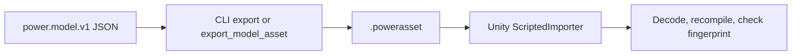

# Model assets

**English** · [简体中文](ASSET_FORMAT.zh-CN.md) · [Français](ASSET_FORMAT.fr.md) · [Русский](ASSET_FORMAT.ru.md) · [日本語](ASSET_FORMAT.ja.md) · [한국어](ASSET_FORMAT.ko.md) · [Deutsch](ASSET_FORMAT.de.md) · [Español](ASSET_FORMAT.es.md) · [Italiano](ASSET_FORMAT.it.md) · [Português](ASSET_FORMAT.pt-BR.md)

`power.model.v1` JSON is the authoring input. A `.powerasset` file carries the model and experiment data for other runtimes. `Power.Assets` does not depend on a JSON library, Unity or a third-party package, and it compiles with the core for .NET 10 and .NET Standard 2.1.

The CLI `export` command and the MCP `export_model_asset` tool use the same encoder. The Unity `ScriptedImporter` imports the file as a `PowerModelAsset` and serializes only the data bytes. At runtime the bytes are decoded, the model is compiled again, and no arbitrary code or stored LU factorization is loaded. The default assets are produced by `tools/Build.cs` and can be rebuilt from JSON.

## Current version 28

`recirculating-liquid-cylinder` and `recirculating-needle-cylinder` retain finite fuel, actual injection, evaporation and optional needle dynamics. Asset v28 retains return links and heat fraction and reads v1-v27. Each return adds 8 states within the unchanged model bounds.

| Identifier | Value |
|---|---|
| kind | 41 (`liquid_rail_return`) |
| fingerprint_tag | 32 |
| count_table_int32 | 40 |
| count_table_bytes | 160 |
| header_bytes | 238 + UTF-8 name length |
| liquid_return_record_bytes | 24 |

[LIQUID_FUEL_RETURN.md](LIQUID_FUEL_RETURN.md)

## Retained version 27

Asset v27 retains tank data and feed selection and reads v1-v26. Each tank adds 4 reported states within the unchanged bounds. Independent wet exchange, analytic exhausted pressure/shaft energy, reverse mixing, complete ledgers, rollback, forks and allocation-free stepping are checked.

| Identifier | Value |
|---|---|
| kind | 40 (`liquid_fuel_tank`) |
| fingerprint_tag | 31 |
| tank_state_field | 87 |
| count_table_int32 | 39 |
| count_table_bytes | 156 |
| header_bytes | 234 + UTF-8 name length |
| liquid_feed_record_bytes | 28 |
| liquid_tank_record_bytes | 32 |

[LIQUID_FUEL_TANK.md](LIQUID_FUEL_TANK.md)

## Retained version 26

The encoder writes `power.asset.v26` and reads v1-v26. There are 38 int32 counts (152 bytes); header size is 230 + UTF-8 name length bytes. Kind 39 is `liquid_rail_feed`, fingerprint tag 30. A 24-byte record stores component index, injector/pump IDs and supply-temperature quantity. Typed coverage and exclusive rail/pump ownership are validated; a re-signed v25 downgrade rejects the new kind.

## Retained version 25

The encoder writes `power.asset.v25` and reads v1-v25. The count table contains 37 int32 values (148 bytes); the header is 226 + UTF-8 name length bytes. Kind 38 is `at_controller`, with fingerprint tag 29. Each record has 208 fixed bytes plus 12 bytes per route. Route count is 5 or 6; the bounded total is declared separately. Typed coverage, clocks, units, ownership and topology are checked. A re-signed v24 downgrade rejects the new kind.

## Retained version 24

The encoder writes `power.asset.v24`; versions 1 through 24 remain readable.
The count table and record sizes remain those of v23. Kind 37 is `carrier_gear`:
its base ratio is finite, signed and nonzero; its 8-byte gear extension retains
component index and the distinct moving carrier. Typed counts cover every
carrier mesh. A digest-resealed v23 downgrade rejects the new kind.

Carrier meshes add fingerprint tag 28, compensated coordinates, endpoint
constraint consistency and bounded relative projection refinement with
accumulated reactions. Plain rotor records
retain absolute planet spin and total carrier orbital inertia. An authentic
v23 reduced Ravigneaux fixture retains its digest/fingerprint and exact upgraded
replay. See [RESOLVED_PLANETS.md](RESOLVED_PLANETS.md).

## Retained version 23

Version 23 retains the v22 count table and record sizes. Kind 36 is
`double_pinion_planetary_gear`: the base signed ratio and existing 8-byte gear
extension retain the distinct carrier. Counts and typed coverage include the new
kind. Older versions reject it, including a digest-resealed v22 downgrade.

Compound models add fingerprint tag 27, including compensated coordinate
accumulation. Their complete row enters the ordinary
reaction/phase/replay contract; existing models keep preceding fingerprints.
An authentic controlled-DCT v22 fixture retains its digest and exact upgraded
replay. See [RAVIGNEAUX_TRANSMISSION.md](RAVIGNEAUX_TRANSMISSION.md).

## Retained version 22

Version 22's
count table has 35 int32 values (140 bytes); header size is
`218 + UTF-8 name length`. The DCT controller count follows the v21 actuation
counts. After driver records, each DCT record is 104 bytes: component index int32;
vehicle, odd/even clutch IDs uint32; eight selector IDs uint32; sample/release/
engagement/timeout values uint64; and two quantities for synchronization tolerance
and direction speed limit.

Kind 35 is `dct_controller`. Fields 73-79 are requested/actual gear, odd/even
selection, shift phase, synchronization error and control fault. Existing IDs
are unchanged. Controller models add fingerprint tag 26 with stable routes,
timing and tolerances. Initial released commands, sole ownership, full topology,
integral request, bounded state count and timing alignment are checked at compile.
Forged v21 downgrades reject controller records/kinds. An authentic v21 DCT graph
retains its digest/fingerprint and same-runtime upgraded replay. See
[DCT_CONTROL.md](DCT_CONTROL.md).

## Retained version 21

Version 21's
v20 count table and `214 + UTF-8 name length` header remain unchanged. Each needle
driver record is 40 bytes: the v20 fields plus optional closure horizon uint64.
Older driver records are 32 bytes and decode with prediction disabled.

Prediction models add fingerprint tag 25 and horizon nanoseconds; disabled models
retain prior fingerprints and state hashes. Fields 69-72 are predicted fuel mass,
prediction ticks, driver cutoff state and pending closing ticks. Existing IDs
remain fixed. Horizon/alignment/budget and clock rules belong to physical/control
compilation. Forged downgrades that strip enabled prediction fail fingerprint
validation. Authentic v20 assets retain their digests and same-runtime upgraded
replay. See [CLOSURE_PREDICTION.md](CLOSURE_PREDICTION.md).

## Retained version 20

Version 20's
34 int32 counts occupy 136 bytes; the header is `214 + UTF-8 name length` bytes.
Four counts after the liquid-injector count describe solenoids, travel stops,
optional injector needles and sampled needle drivers. After the liquid table:

| Table | Bytes | Data |
|---|---:|---|
| Solenoid | 28 | Component index int32; reference-position and inductance-gradient quantities |
| Travel stop | 40 | Component index int32; minimum/maximum position and stiffness quantities |
| Needle | 32 | Injector component index int32; needle-node ID uint32; closed/full-open quantities |
| Driver | 32 | Component index int32; injector/solenoid IDs uint32; period uint64; drive-voltage quantity |

Solenoid R/L/initial current, voltage input and thermal sink use base records.
Kinds 32-34 are `solenoid`, `travel_stop` and `needle_driver`; `HenryPerMeter` is
appended to the unit enum (`h_m`), and field 68 is `copper_heat`. Existing IDs retain
their values. Magnetic/stop models add fingerprint tag 22, physical needle opening
adds tag 23, and driver definitions add tag 24. Parameters, stable references and
sampling periods enter the fingerprint.

Typed bounded records, units, distinct owners, complete coverage and physical
compilation remain required. Forged v19 downgrades reject actuation kinds; stripping
a needle extension changes the compiled fingerprint. An authentic v19 liquid
fixture retains its digest/fingerprint and same-runtime upgraded replay. See
[NEEDLE_ACTUATION.md](NEEDLE_ACTUATION.md).

## Retained version 19

Version 19's
30 int32 counts occupy 120 bytes; the header is `198 + UTF-8 name length` bytes.
The liquid-injector count follows the v18 film count. After the film phase table,
each liquid record occupies 120 bytes: component-table index int32, target film ID
uint32, crank ID uint32, then nine quantities for cycle/start/duration angles,
maximum dose, initial source mass, supply temperature, density, initial absolute
pressure and pressure compliance. Each quantity is double plus int32 unit. Nozzle
area/coefficient use the existing 36-byte orifice extension.

Kind 31 is `liquid_fuel_injector`; `KilogramPerCubicMeter` is appended to the unit
enum, with JSON name `kg_m3`. Existing domain/unit/output IDs remain fixed. Liquid
models add fingerprint tag 21, including stable film/crank IDs, timing and source
properties. Bounded typed complete coverage, digest, units and physical ownership
are required; forged v18 downgrades reject liquid injectors. An authentic v18 film
fixture retains digest/fingerprint and same-runtime upgraded replay. See
[LIQUID_FUEL_INJECTION.md](LIQUID_FUEL_INJECTION.md).

## Retained version 18

Version 18's
29 int32 counts occupy 116 bytes; the header is `194 + UTF-8 name length` bytes.
A film count follows the v17 fuel-injector count. After the injector records,
each film record occupies 64 bytes: component-table index int32, then initial
mass, initial temperature, liquid specific heat, saturation temperature and latent
internal energy as five quantities (double plus int32 unit). Conductance and the
receiver/wall IDs remain in the base component record.

Kind 30 is `fuel_film`; fields 66-67 are cumulative evaporated fuel mass in kg and
film wall heat in J. Existing IDs remain fixed. Film models add fingerprint tag 20,
including initial phase energy, liquid mass and the phase constants. Typed complete
coverage, bounded counts/length, digest, units and physical compilation are required.
Forged v17 downgrades reject films. The authentic v17 metered-cylinder fixture retains
its digest/fingerprint and same-runtime upgraded replay. See [FUEL_FILM.md](FUEL_FILM.md).

## Retained version 17

Version 17's
28 int32 counts occupy 112 bytes; the header is `190 + UTF-8 name length` bytes.
An injector count follows the v16 gas-piston count. After gas-piston geometry,
each injector record occupies 56 bytes: component-table index int32, timing crank
ID uint32, then cycle/start/duration angles and maximum dose as four quantities.
Its nozzle area/coefficient also use the existing 36-byte gas-orifice record.
The base input quantity carries kg per cycle, rather than an opening fraction.

Kind 29 is `gas_fuel_injector`. Fields 63-65 are requested cycle dose, delivered
cycle dose and cumulative delivered fuel in kg. Existing IDs remain fixed. These
models add fingerprint tag 19, retaining crank ID, window and dose limit. Typed
complete coverage, bounded counts/length, digest, units and compatible finite
ports are required. Forged v16 downgrades reject injectors. Authentic v16 gas
accumulator assets retain digest/fingerprint and same-runtime upgraded replay.
See [FUEL_METERING.md](FUEL_METERING.md).

## Retained version 16

Version 16's
27 int32 counts occupy 108 bytes; the header is `186 + UTF-8 name length` bytes.
The linear-gas-piston count follows the v15 spool count. After spool geometry,
each gas-piston record occupies 56 bytes: component-table index int32, compression
direction int32 (+1 or -1), and four quantities for area, reference volume,
reference position and absolute reference pressure. Each quantity is double plus
int32 unit. The gas node uses the existing composition record and omits fixed storage.

Kind 28 is `gas_piston`. No existing domain/unit/output IDs change. These models add
fingerprint tag 18, including geometry/reference values and orientation. Typed
complete coverage, bounded counts/length, digest and physical compilation remain
required; forged v15 downgrades reject gas pistons. The authentic v15 spool fixture
retains its digest, fingerprint, physical references and same-runtime upgraded
replay. See [GAS_PISTON.md](GAS_PISTON.md).

## Retained version 15

Version 15's
26 int32 counts occupy 104 bytes; the header is `182 + UTF-8 name length` bytes.
One spool-valve count follows the v14 piston/contact counts. After those extension
tables, each spool record occupies 32 bytes: component-table index int32, referenced
piston-component ID uint32, closed-position quantity and full-open-position quantity.
Each quantity is a double value plus int32 unit. Flow parameters and reservoir
pressure remain in the existing 40-byte hydraulic restriction record.

Kind 27 is `hydraulic_spool_valve`; existing IDs, units and output fields retain
their values. Spool models add fingerprint tag 17 and both land positions/piston ID.
Typed complete coverage, bounded counts, length, digest, units and stroke ownership
are checked. Forged downgrades to v14 reject spool kinds. Authentic v14 piston assets
retain their digests, fingerprints and same-runtime upgraded replay. See
[HYDRAULIC_SPOOL.md](HYDRAULIC_SPOOL.md).

## Retained version 14

Version 14's
count table contains 25 int32 values (100 bytes). Two counts after the v13 battery
and duty-control counts describe hydraulic pistons and contact-actuated clutches.
The header is `178 + UTF-8 name length` bytes. After the duty-controller table:

| Extension | Bytes | Fields |
|---|---:|---|
| Hydraulic piston | 104 | Component-table index int32, back-node ID uint32; front/back areas, back pressure, minimum/maximum position, stop stiffness, contact position/stiffness as eight quantities |
| Piston clutch | 40 | Component-table index int32, piston-component ID uint32, effective-radius quantity, static/sliding coefficients as two doubles, friction-surfaces uint32 |

Translational mass/velocity/position and linear spring/force parameters use the
existing base records. Domain 6 is translational. Kinds 23-26 are linear spring,
hydraulic piston, piston clutch and force source. Units 47-49 are m/s, N/m and N*s/m;
fields 60-62 are displacement, linear speed and force. Cumulative spring damping
heat uses existing field 34. Piston/contact models add fingerprint tag 16, with
stroke, pad, back boundary, referenced piston and friction geometry included.

Bounded counts, typed indices, distinct complete extensions, exact length, digest
and the 1 MiB limit are checked before model use. Older versions reject the new
domain/kinds even when extension records are removed and the digest is recomputed.
The compiler checks SI units, typed ports, increasing stroke, pad clearance and
friction ordering. The authentic v13 fixture retains its original digest and
same-runtime upgraded replay. See [the piston contract](HYDRAULIC_PISTON.md).

## Retained version 13

Version 13
appends two int32 counts to the v12 table: batteries and duty controllers. Its header
is `170 + UTF-8 name length` bytes. After the existing voltage-controller records:

| Extension | Bytes | Fields |
|---|---:|---|
| Battery | 68 | Node-table index int32, heat-node ID uint32; empty/full OCV, series resistance, polarization resistance and capacitance as five quantities |
| Duty controller | 80 | Component-table index int32, target channel uint64, sample period uint64; proportional/integral gains, duty bounds and initial integral as five quantities |

Battery capacity, SOC and polarization initial voltage use the existing node fields.
Battery motors and resistive loads retain their ports, RL parameters, resistance and
opening/duty in base component records. Domain 5 is battery; kinds 20–22 are battery
motor, resistive load and pressure duty controller. Units 42–46 are C, F, Ah,
fraction/Pa and fraction/(Pa·s); fields 53–59 are SOC, charge, terminal/polarization
voltage, battery current, integral duty and command duty. Previous identifiers remain fixed.

Bounded typed tables, exact coverage/length, digest and 1 MiB limits remain. Old versions
reject battery domains and new kinds even after their extension tables are removed.
Compilation checks charge bounds, dimensions, typed sources, OCV ordering and control
ownership. Battery models add fingerprint tag 14; duty control adds tag 15. Prior models
retain their fingerprints. Authentic v12 and older fixtures verify original digests
and same-runtime replay. See [the battery contract](HYDRAULIC_PUMP.md#finite-battery-supply-and-duty-regulation).

## Retained version 12

Version 12
appends a twenty-first int32 count for pressure-controller records. Its header is
`162 + UTF-8 name length` bytes. After the pump and relief tables, each controller
extension occupies 80 bytes:

| Data | Encoding |
|---|---|
| Component table index | int32, distinct and referencing kind 19 (`pressure_controller`) |
| Owned target voltage channel | uint64 |
| Sample period in nanoseconds | uint64 |
| Proportional gain, integral gain, minimum/maximum voltage, initial integral | Five quantities, each double value plus int32 unit |

Sensor node, setpoint channel and initial pressure target remain in the base component
record. Inputs and KPI checks follow the controller table. Exact length, bounded counts,
typed indices, complete extension coverage, digest and the 1 MiB limit are checked.
Forged downgrades to v11 reject controller kinds even after their records are removed.
Compilation checks units, sensor domain, target ownership, bounds and tick-aligned
periods. Units 40/41 are V/Pa and V/(Pa·s); fields 49–52 are sampled pressure, pressure
error, integral voltage and held command. Existing identifiers retain their values.

Controlled models add fingerprint tag 13, including sampling period, target channel
and initial integral. Controller histories are reconstructed through replay rather
than serialized. Uncontrolled models retain their fingerprints and trajectories. The
authentic v11 fixture and all previous fixtures remain unchanged. See
[the pressure regulation contract](HYDRAULIC_PUMP.md#sampled-pressure-regulation).

## Retained version 11

Version 11
appends pump and relief int32 counts to the eighteen v10 counts. After the existing
hydraulic restriction and actuator tables come 32-byte pump records (component index,
inlet-node ID, displacement quantity, reservoir-pressure quantity), then 16-byte relief
records (component index and cracking-pressure quantity). A relief also has the existing
40-byte restriction record for conductance and boundary pressure. Inputs and checks
follow these new tables. The header is `158 + UTF-8 name length` bytes.

Typed distinct indices, complete per-kind records, exact length, SHA-256 and bounded
counts are checked. Older formats reject kinds 17/18 (pump/relief). Unit 39 is m³/rad;
field 48 is signed hydraulic power. Pump work reuses field 44 on the component, while
object zero retains external hydraulic work. Pump/relief models add fingerprint tag 12;
models without either retain their fingerprints. An authentic v10 hydraulic fixture
checks its original digest and replay. See [the pump contract](HYDRAULIC_PUMP.md).

## Retained version 10

Version 10
appends two int32 counts after the sixteen v9 counts: hydraulic restrictions and hydraulic
clutches. Hydraulic node domain 4 uses the existing 44-byte node record: storage is
compliance, initial value is gauge pressure, and position is zero/None. Older formats
reject hydraulic nodes even when no component extension is present.

After the complete variable-length converter table come these fixed-size records:

| Extension | Bytes | Fields |
|---|---:|---|
| Hydraulic restriction | 40 | Component index int32; coefficient, transition pressure and reservoir pressure as three quantities |
| Hydraulic clutch | 64 | Component index int32, pressure-node ID uint32; piston area, preload force and radius as quantities; static/sliding coefficients as doubles; friction-surface count uint32 |

Each kind needs exactly one distinct, in-range extension. Common rotational/hydraulic
ports, ratio, valve input and heat sink remain in the base component record. Reservoir
pressure is carried explicitly in the restriction extension, including zero/None for
internal edges. Scheduled inputs and checks follow both hydraulic tables. Counts, exact
length, SHA-256 and the 1 MiB limit are checked before compilation validates dimensions,
topology and physical ranges.

Kinds 14–16 identify linear restriction, turbulent restriction and pressure clutch.
Units 34–38 add compliance, linear/turbulent coefficients, volume flow and force.
Fields 41–47 add volume flow, reservoir inventory, inventory residual, hydraulic work,
clamp force and static/sliding capacity. Existing heat/pressure fields are reused. Models
with hydraulic nodes add fingerprint tag 11; hydraulic-free models retain previous
fingerprints. Solver histories are reconstructed through replay. A genuine v9 converter
fixture checks its original digest, fingerprint and upgraded trajectory. See
[the hydraulic contract](HYDRAULIC_NETWORK.md).

## Retained version 9

Version 9 appended two int32 counts after the fourteen v8 counts: converter components and total
map points. At most eight converters and 32 points in each of four maps are supported.
After the gear table, each converter record has a 20-byte header: component-table index
and four int32 point counts. Its points immediately follow, in pump-positive,
pump-negative, turbine-positive, turbine-negative order. Each point occupies 28 bytes:
speed ratio (double), torque ratio (double), capacity coefficient (double + int32 unit).
The next converter header follows those points. Scheduled inputs and checks follow all
converter records. Nodes, base components and prior extensions retain their sizes.

Exact size, SHA-256, the 1 MiB bound, all aggregate/per-map counts, distinct typed indices
and the total consumed point count are checked. Compilation then validates topology,
units, continuous reference-member boundaries and passivity between knots. Missing,
duplicate, malformed, wrong-kind and downgraded converter records are rejected.

Kind 13 identifies a converter, unit 33 its capacity coefficient, and fields 38–40 add
fluid heat, speed ratio and reference-member code. Torque-at-B/C and heat-flow fields
are reused; the C torque is the stationary-stator reaction with no third rotor port.
Converter models add fingerprint tag 10 and all normalized map values. Solver factors
and mean/cumulative histories are reconstructed by replay. Authentic v1–v8 fixtures
verify retained fingerprints and playback. See [the converter contract](CONVERTER_NETWORK.md).

## Retained version 8

Version 8 appended a fourteenth int32 count for ideal gear topology. After the clutch extension
table, each 8-byte record contains the component-table index (int32) and carrier node
ID (uint32). Exactly one distinct record must refer to each `IdealGear` or
`PlanetaryGear` component. Carrier ID is zero for an ideal pair and a distinct
rotational node for a planetary. A/B node IDs and ratio remain in the unchanged
156-byte base record. Nodes remain 44 bytes and prior extension sizes are unchanged.

Counts are, in order: nodes, components, scheduled inputs, checks, sealed cylinders,
gas nodes, orifices, moving cylinders, valves, mixtures, reservoir fractions, burners,
clutches and gears. Exact payload length, SHA-256 and the 1 MiB bound are checked before
compilation. Inputs and KPI checks follow all extension tables.

Kind IDs 11/12 identify ideal/planetary gears. Fields 35/36/37 add torque at B, torque
at C and phase error; gear speed residual reuses field 32. Older identifiers retain
their values. Models with gears add fingerprint tag 9, including the carrier endpoint;
gear-free fingerprints are unchanged. Initial relative phase is derived from the rotor
angles. Mean reaction history and constraint factors are reconstructed by replay,
not serialized as solver state.

Invalid ports/ratios, dependent constraints, incompatible initial speeds, unrelated
physical parameters, missing/duplicate/wrong-kind extensions and forged downgrades are
rejected. A genuine v7 fired-clutch fixture preserves its digest, model fingerprint and
upgraded replay; v1–v6 fixtures remain. See [coupled gears](GEAR_NETWORK.md) and
[fixture provenance](../tests/Power.Tests/Fixtures/README.md).

## Retained version 7

Version 7 appended a thirteenth int32 count for clutch extensions. After the combustion table,
each 28-byte record contains a component-table index and two quantities: static and
sliding torque capacity in Nm. Exactly one record must refer to each `Clutch` component,
with distinct, in-range indices. Ground/rotor endpoints, ratio, engagement input and
heat destination stay in the unchanged 156-byte base component record.

Compilation validates units, `static >= sliding >= 0`, ratio, topology and engagement.
Missing/duplicate/wrong-kind extensions, invalid capacities, forged downgrade attempts
and fingerprint changes are rejected. Node records remain 44 bytes, and all old
extension records retain their sizes. Counts, exact size, digest and the 1 MiB bound
are checked before compilation. Scheduled inputs and checks follow all extension tables.

Clutch kind 10, fields 32–34 (slip speed, mode, friction heat) and unit 32 (`StateCode`)
are appended without renumbering older identifiers. The model includes fingerprint
tag 8 only when clutches exist. Solver factors, phase history, mean outputs and heat
ledgers are reconstructed by replay; they are not serialized. An authentic v6 fired
fixture verifies unchanged earlier fingerprint and upgraded playback. See
[coupled clutches](CLUTCH_NETWORK.md) and [fixture provenance](../tests/Power.Tests/Fixtures/README.md).

## Retained version 6

Version 6
adds three int32 counts after the nine v5 counts, for premixed gas composition,
reservoir fractions and combustion parameters. The header therefore has twelve counts.
After the timing table, these extension tables follow in that order:

| Extension | Size | Encoding |
|---|---|---|
| Premixed gas | 40 bytes | Gas-node table index (int32), LHV (quantity), stoichiometric air/fuel ratio (double), initial fuel and fresh-air fractions (two doubles) |
| Reservoir fractions | 20 bytes | Component table index (int32), fuel and fresh-air fractions (two doubles) |
| Combustion | 56 bytes | Component table index (int32), cycle/start/duration angles (three quantities), shape exponent and burn coefficient (two doubles) |

Each table requires distinct, in-range indices of the appropriate kind. Exactly one
burn record is required per `PremixedCombustion` component. Optional mixture records
are validated against connected gas nodes; premixed reservoir boundaries require
explicit fraction records. Counts and exact length are checked before descriptor-array
allocation, followed by topology, units, fraction sums and profile constraints. Removing
optional composition changes semantics and fails compilation or the model fingerprint.

The base component record is unchanged: crank/gas IDs and burn-multiplier input remain
there. New kind, field and unit identifiers are appended; old identifiers keep their
values. Solver state, constituent histories, irreversible frontiers and cumulative
ledgers are not serialized; replay reconstructs them from the model and scheduled inputs.
The authentic v5 fixture preserves the earlier timed-model fingerprint and upgraded
replay. See [premixed combustion](PREMIXED_COMBUSTION.md).

## Retained version 5

Version 5
adds a ninth int32 count after the v4 counts: optional crank-valve timing extensions.
After the moving-cylinder records, each 44-byte timing record contains:

| Data | Encoding |
|---|---|
| Component table index | int32, unique and referring to a gas orifice |
| Crank node ID | uint32 stable ID, referring to a rotational node |
| Cycle angle, opening angle, duration angle | Three quantities (double + int32 unit each) |

Timing is optional on each orifice. Counts, exact length, record type and uniqueness
are checked before compilation validates units, cycle, phase and duration. Removing a
timing record changes model semantics and fails the stored fingerprint check. Timed
models add fingerprint tag 6; untimed models keep their prior fingerprints. An authentic
v4 fixture verifies unchanged moving-cylinder replay after re-encoding. Inputs, checks
and the SHA-256 trailer follow all extension tables. See [timing](VALVE_TIMING.md).

## Retained version 4

Version 4
adds an eighth int32 count after the seven v3 counts: moving-cylinder extensions.
After the v3 gas-node and orifice extensions, each moving-cylinder record contains:

| Data | Encoding |
|---|---|
| Component table index | int32; unique, in bounds and referring to a gas cylinder |
| Bore, stroke, rod length and phase | Four quantities (double + int32 unit each) |
| Compression ratio | double |
| Back pressure | One quantity |

Each record is 72 bytes. Exactly one record is required per gas cylinder. Its gas node
stores initial temperature, pressure and composition in the existing fields; its storage
quantity is zero/None because geometry supplies the volume. No initial volume or gas
state is silently supplied by the reader. Old versions reject the new component.
Cylinder ownership, topology and dimensions are checked by compilation before the
fingerprint is accepted. The source/digest/size/schedule bounds are unchanged.

## Retained version 3 and earlier readers

Version 3 introduced fixed-volume gas support. It retains the base node/component tables and the v2 cylinder extensions. The
count header contains seven int32 values, in order: nodes, components, scheduled inputs,
checks, cylinders, gas nodes and gas orifices. After the base tables and cylinder
extensions come these records:

| Extension | Size | Encoding |
|---|---|---|
| Gas composition | 24 bytes | Node-table index (int32), specific gas constant (quantity), gamma (double) |
| Gas orifice | 36 bytes | Component-table index (int32), area (quantity), discharge coefficient (double), reservoir pressure (quantity) |

A quantity is a double followed by an int32 unit identifier. The base node table retains
volume, initial temperature and initial pressure. The base component table retains
opening, channel, endpoints, wall conductance and reservoir temperature (the existing
`AmbientTemperature` field). Gas wall links need no extension. Records refer to sorted
table indices, not object IDs.

Each gas node, orifice and cylinder requires exactly one extension of its own type.
Unknown versions, invalid counts, wrong lengths, duplicate/missing/type-mismatched
extensions, bad checksums and model fingerprint mismatches are rejected. Counts and
exact length are checked before descriptor-array allocation. The 1 MiB limit applies
to the whole file, including its final SHA-256 digest. Scheduled openings are validated
in [0, 1] before asset creation/export.

Old v1/v2 readers are retained for their original model sets; gas domains/components
require v3. Authentic v1 and cylinder v2 fixtures in [Fixtures](../tests/Power.Tests/Fixtures/README.md)
exercise decoding and upgraded replay. Solver semantics and model fingerprints are
unchanged by this format revision.

## Retained version 2 and version 1 compatibility

Version 2 preserves the base node/component tables and adds a fifth int32 count after the original four counts: the number of cylinder extensions. After the base component table, each extension occupies 116 bytes:

| Data | Encoding |
|---|---|
| Component table index | int32, unique, within bounds, referring to a sealed cylinder |
| Bore, stroke, rod length, phase | Four quantities, each double value + int32 unit |
| Compression ratio | double |
| Initial pressure, initial temperature, specific gas constant | Three quantities |
| Gamma | double |
| Back pressure | One quantity |

Inputs, checks and the SHA-256 trailer follow the extensions. The decoder validates bounded counts and exact length before allocating descriptor arrays; it rejects duplicate or mismatched extensions. Compilation requires exactly one parameter record for each sealed cylinder. The extended unit and field enums append values without changing existing identifiers.

Version 1 has no extension count or extension records. Models using only existing linear components retain solver version 2 and their fingerprints, so existing v1 assets can be decoded and replayed. Models with sealed cylinders use solver version 3. The immutable [v1 fixture](../tests/Power.Tests/Fixtures/README.md) checks compatibility against a real pre-change export.

## Retained version 1 layout

Every integer and every IEEE 754 binary64 value is little-endian. A file is at most 1 MiB. Strings are strict UTF-8.

| Order | Data |
|---|---|
| Identity | 8 ASCII bytes `POWERAST`, then int32 format version `1` |
| Model and time | uint64 model fingerprint, tick nanoseconds, experiment duration, sample interval |
| Provenance | uint16 name-byte count, the name, 32-byte SHA-256 of the source JSON |
| Counts | Four int32 values: nodes, components, input changes, KPIs |
| Descriptors | 44 bytes per node and 156 bytes per component, sorted by object ID |
| Inputs | 24 bytes per change: uint64 time, uint64 channel, double value |
| KPIs | 33 bytes each: uint32 object, int32 field, one boundary-flag byte, three double bounds |
| Integrity | SHA-256 of every preceding byte, 32 bytes |

Node and component field order follows the version 1 codec in `src/Power.Assets/AssetCodec.cs`. Counts, the exact file length and the digest are checked before descriptor arrays are allocated. Units, topology, time, events and KPIs are validated next, and the fingerprint is compared with the model the current solver compiles. A mismatch needs a new export.

A name is at most 128 UTF-16 code units and contains no control characters. A model is limited to 32 nodes, 64 components and 128 states. An experiment is at most one hour, ten million ticks, 10,000 input times, 65,536 input changes and 256 KPIs. The integer quotient `duration / sample_every` must not exceed 10,000, and the 1 MiB file limit still applies. Events lie in `[0, duration)`, are ordered by absolute time, are tick-aligned, and do not repeat a channel at one time.

The trailing digest detects damage. It is not provenance authentication. `asset_sha256` in an export result is the digest of the whole file, including that trailing field. `source_sha256` identifies the authoring document. The model fingerprint identifies the compiled semantics. Exporting again after a step change can keep the original source digest and still change the model fingerprint. Synthetic parameters stay `unverified`.

`AssetPlayback` applies the initial events at time zero and uses the core's atomic event batch inside each `Advance`. Failure and cancellation keep time, state and the event cursor. One call advances at most one million ticks. The caller splits longer runs. CLI report boundaries, asset playback and a live MCP export have been checked against each other. Unity Editor, Mono and IL2CPP execution evidence is still outstanding.
