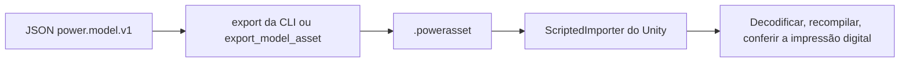

# Assets de modelo

[English](ASSET_FORMAT.md) · [简体中文](ASSET_FORMAT.zh-CN.md) · [Français](ASSET_FORMAT.fr.md) · [Русский](ASSET_FORMAT.ru.md) · [日本語](ASSET_FORMAT.ja.md) · [한국어](ASSET_FORMAT.ko.md) · [Deutsch](ASSET_FORMAT.de.md) · [Español](ASSET_FORMAT.es.md) · [Italiano](ASSET_FORMAT.it.md) · **Português**

O JSON `power.model.v1` é a entrada de autoria. Um arquivo `.powerasset` carrega os dados de modelo e de experimento para outros runtimes. `Power.Assets` não depende de uma biblioteca JSON, do Unity nem de um pacote de terceiros, e compila com o núcleo para .NET 10 e .NET Standard 2.1.

O comando `export` da CLI e a ferramenta MCP `export_model_asset` usam o mesmo codificador. O `ScriptedImporter` do Unity importa o arquivo como um `PowerModelAsset` e serializa só os bytes de dados. Em runtime os bytes são decodificados, o modelo é compilado de novo e nenhuma fatoração LU armazenada nem código arbitrário é carregado. Os assets padrão são produzidos por `tools/Build.cs` e podem ser reconstruídos a partir do JSON.

## Versão atual 27

v27 preserva tanque e seleção e lê v1-v26. Cada tanque acrescenta 4 estados dentro dos limites mantidos. Troca úmida independente, pressão/energia do eixo esgotadas analíticas, mistura de retorno, balanços completos, rollback, ramos e passos sem alocação são verificados.

| Identifier | Value |
|---|---|
| kind | 40 (`liquid_fuel_tank`) |
| fingerprint_tag | 31 |
| tank_state_field | 87 |
| count_table_int32 | 39 |
| count_table_bytes | 156 |
| header_bytes | 234 + UTF-8 name length |
| liquid_feed_record_bytes | 28 |
| liquid_tank_record_bytes | 32 |

[LIQUID_FUEL_TANK.pt-BR.md](LIQUID_FUEL_TANK.pt-BR.md)

## Versão 26 preservada

O codificador escreve `power.asset.v26` e lê v1-v26. Há 38 contagens int32 (152 bytes); o cabeçalho ocupa 230 + comprimento do nome UTF-8 bytes. O tipo 39 é `liquid_rail_feed`, etiqueta de impressão 30. Um registro de 24 bytes guarda índice, IDs injetor/bomba e temperatura fonte. Tipos e propriedade exclusiva são verificados; um downgrade v25 reassinado rejeita o novo tipo.

## Versão 25 preservada

O codificador escreve `power.asset.v25` e lê v1-v25. A tabela contém 37 valores int32 (148 bytes); o cabeçalho ocupa 226 + comprimento do nome UTF-8 bytes. O tipo 38 é `at_controller`, com etiqueta de impressão 29. Cada registro tem 208 bytes fixos mais 12 bytes por rota. As rotas são 5 ou 6; o total limitado é declarado separadamente. Tipos, relógios, unidades, propriedade e topologia são verificados. Um downgrade v24 com digest reassinado rejeita o novo tipo.

## Versão 24 preservada

O codificador escreve `power.asset.v24`; as versões 1 a 24 continuam legíveis. A tabela de contagens e os tamanhos de registro continuam os da v23. O tipo 37 é `carrier_gear`: sua relação de base é finita, com sinal e não nula; sua extensão de engrenagem de 8 bytes conserva o índice do componente e o porta-planetas móvel distinto. Contagens tipadas cobrem cada engrenamento do porta-planetas. Um rebaixamento v23 com digest recalculado rejeita o tipo novo.

Engrenamentos do porta-planetas acrescentam a etiqueta 28 de impressão digital, coordenadas compensadas, consistência da restrição nas extremidades e refinamento limitado de projeção relativa com reações acumuladas. Registros simples de rotor conservam o giro absoluto dos planetas e a inércia orbital total do porta-planetas. Uma fixture autêntica v23 de Ravigneaux reduzido conserva seu digest/impressão digital e o replay exato atualizado. Veja [RESOLVED_PLANETS.pt-BR.md](RESOLVED_PLANETS.pt-BR.md).

## Versão 23 retida

A versão 23 conserva a tabela de contagens e os tamanhos de registro da v22. O tipo 36 é `double_pinion_planetary_gear`: a relação de base com sinal e a extensão existente de engrenagem de 8 bytes conservam o porta-planetas distinto. Contagens e cobertura tipada incluem o tipo novo. Versões mais antigas o rejeitam, inclusive um rebaixamento v22 com digest recalculado.

Modelos compostos acrescentam a etiqueta 27 de impressão digital, inclusive acumulação compensada de coordenadas. Sua linha completa entra no contrato ordinário de reação/fase/replay; modelos existentes conservam as impressões digitais anteriores. Uma fixture autêntica v22 de DCT controlada conserva seu digest e o replay exato atualizado. Veja [RAVIGNEAUX_TRANSMISSION.pt-BR.md](RAVIGNEAUX_TRANSMISSION.pt-BR.md).

## Versão 22 retida

A tabela de contagens da versão 22 tem 35 valores int32 (140 bytes); o tamanho do cabeçalho é `218 + UTF-8 name length`. A contagem do controlador DCT segue as contagens de acionamento da v21. Depois dos registros de driver, cada registro DCT tem 104 bytes: índice do componente int32; IDs uint32 do veículo e das embreagens ímpar/par; oito IDs de seletor uint32; valores uint64 de amostra/liberação/engate/tempo esgotado; e duas quantidades para a tolerância de sincronização e o limite de velocidade de direção.

O tipo 35 é `dct_controller`. Os campos 73-79 são marcha solicitada/real, seleção ímpar/par, fase da troca, erro de sincronização e falha de controle. Os IDs existentes não mudam. Modelos com controlador acrescentam a etiqueta 26 de impressão digital, com rotas, temporização e tolerâncias estáveis. Comandos iniciais liberados, posse exclusiva, topologia completa, solicitação inteira, contagem limitada de estado e alinhamento de temporização são conferidos na compilação. Rebaixamentos v21 forjados rejeitam registros/tipos de controlador. Um grafo DCT autêntico v21 conserva seu digest/impressão digital e o replay atualizado no mesmo runtime. Veja [DCT_CONTROL.pt-BR.md](DCT_CONTROL.pt-BR.md).

## Versão 21 retida

A tabela de contagens v20 da versão 21 e o cabeçalho `214 + UTF-8 name length` permanecem inalterados. Cada registro de driver de agulha tem 40 bytes: os campos da v20 mais o horizonte opcional de fechamento uint64. Registros de driver mais antigos têm 32 bytes e decodificam com a predição desabilitada.

Modelos de predição acrescentam a etiqueta 25 de impressão digital e o horizonte em nanossegundos; modelos desabilitados conservam as impressões digitais e os hashes de estado anteriores. Os campos 69-72 são massa de combustível prevista, ticks de predição, estado de corte do driver e ticks de fechamento pendentes. Os IDs existentes permanecem fixos. Regras de horizonte/alinhamento/orçamento e de relógio pertencem à compilação física/de controle. Rebaixamentos forjados que removem a predição habilitada falham a validação da impressão digital. Assets autênticos v20 conservam seus digests e o replay atualizado no mesmo runtime. Veja [CLOSURE_PREDICTION.pt-BR.md](CLOSURE_PREDICTION.pt-BR.md).

## Versão 20 retida

As 34 contagens int32 da versão 20 ocupam 136 bytes; o cabeçalho tem `214 + UTF-8 name length` bytes. Quatro contagens depois da contagem de injetor líquido descrevem solenoides, batentes de curso, agulhas opcionais de injetor e drivers amostrados de agulha. Depois da tabela líquida:

| Tabela | Bytes | Dados |
|---|---:|---|
| Solenoide | 28 | Índice do componente int32; quantidades de posição de referência e de gradiente de indutância |
| Batente de curso | 40 | Índice do componente int32; quantidades de posição mínima/máxima e de rigidez |
| Agulha | 32 | Índice do componente injetor int32; ID do nó da agulha uint32; quantidades de fechado/totalmente aberto |
| Driver | 32 | Índice do componente int32; IDs do injetor/solenoide uint32; período uint64; quantidade de tensão de acionamento |

R/L/corrente inicial do solenoide, entrada de tensão e sumidouro térmico usam registros de base. Os tipos 32-34 são `solenoid`, `travel_stop` e `needle_driver`; `HenryPerMeter` é acrescentado à enumeração de unidades (`h_m`), e o campo 68 é `copper_heat`. Os IDs existentes conservam seus valores. Modelos magnéticos/de batente acrescentam a etiqueta 22 de impressão digital, a abertura física da agulha acrescenta a etiqueta 23, e definições de driver acrescentam a etiqueta 24. Parâmetros, referências estáveis e períodos de amostragem entram na impressão digital.

Registros tipados limitados, unidades, donos distintos, cobertura completa e compilação física continuam exigidos. Rebaixamentos v19 forjados rejeitam tipos de acionamento; remover uma extensão de agulha muda a impressão digital compilada. Uma fixture líquida autêntica v19 conserva seu digest/impressão digital e o replay atualizado no mesmo runtime. Veja [NEEDLE_ACTUATION.pt-BR.md](NEEDLE_ACTUATION.pt-BR.md).

## Versão 19 retida

As 30 contagens int32 da versão 19 ocupam 120 bytes; o cabeçalho tem `198 + UTF-8 name length` bytes. A contagem de injetor líquido segue a contagem de filme da v18. Depois da tabela de fase do filme, cada registro líquido ocupa 120 bytes: índice da tabela de componentes int32, ID do filme alvo uint32, ID do virabrequim uint32, e então nove quantidades para ângulos de ciclo/início/duração, dose máxima, massa inicial da fonte, temperatura de suprimento, densidade, pressão absoluta inicial e flexibilidade de pressão. Cada quantidade é double mais unidade int32. Área/coeficiente do bico usam a extensão existente de orifício de 36 bytes.

O tipo 31 é `liquid_fuel_injector`; `KilogramPerCubicMeter` é acrescentado à enumeração de unidades, com nome JSON `kg_m3`. Os IDs existentes de domínio/unidade/saída permanecem fixos. Modelos líquidos acrescentam a etiqueta 21 de impressão digital, inclusive IDs estáveis de filme/virabrequim, temporização e propriedades da fonte. Cobertura completa tipada e limitada, digest, unidades e posse física são exigidos; rebaixamentos v18 forjados rejeitam injetores líquidos. Uma fixture de filme autêntica v18 conserva digest/impressão digital e o replay atualizado no mesmo runtime. Veja [LIQUID_FUEL_INJECTION.pt-BR.md](LIQUID_FUEL_INJECTION.pt-BR.md).

## Versão 18 retida

As 29 contagens int32 da versão 18 ocupam 116 bytes; o cabeçalho tem `194 + UTF-8 name length` bytes. Uma contagem de filme segue a contagem de injetor de combustível da v17. Depois dos registros de injetor, cada registro de filme ocupa 64 bytes: índice da tabela de componentes int32, e então massa inicial, temperatura inicial, calor específico do líquido, temperatura de saturação e energia interna latente como cinco quantidades (double mais unidade int32). Condutância e os IDs de receptor/parede permanecem no registro de base do componente.

O tipo 30 é `fuel_film`; os campos 66-67 são a massa acumulada de combustível evaporado em kg e o calor de parede do filme em J. Os IDs existentes permanecem fixos. Modelos de filme acrescentam a etiqueta 20 de impressão digital, inclusive energia inicial de fase, massa líquida e as constantes de fase. Cobertura completa tipada, contagens/comprimento limitados, digest, unidades e compilação física são exigidos. Rebaixamentos v17 forjados rejeitam filmes. A fixture autêntica v17 de cilindro medido conserva seu digest/impressão digital e o replay atualizado no mesmo runtime. Veja [FUEL_FILM.pt-BR.md](FUEL_FILM.pt-BR.md).

## Versão 17 retida

As 28 contagens int32 da versão 17 ocupam 112 bytes; o cabeçalho tem `190 + UTF-8 name length` bytes. Uma contagem de injetor segue a contagem de pistão de gás da v16. Depois da geometria do pistão de gás, cada registro de injetor ocupa 56 bytes: índice da tabela de componentes int32, ID uint32 do virabrequim de temporização, e então ângulos de ciclo/início/duração e dose máxima como quatro quantidades. Sua área/coeficiente de bico também usam o registro existente de orifício de gás de 36 bytes. A quantidade de entrada de base carrega kg por ciclo, em vez de uma fração de abertura.

O tipo 29 é `gas_fuel_injector`. Os campos 63-65 são a dose solicitada do ciclo, a dose entregue do ciclo e o combustível acumulado entregue em kg. Os IDs existentes permanecem fixos. Esses modelos acrescentam a etiqueta 19 de impressão digital, conservando o ID do virabrequim, a janela e o limite de dose. Cobertura completa tipada, contagens/comprimento limitados, digest, unidades e portas finitas compatíveis são exigidos. Rebaixamentos v16 forjados rejeitam injetores. Assets autênticos v16 de acumulador de gás conservam digest/impressão digital e o replay atualizado no mesmo runtime. Veja [FUEL_METERING.pt-BR.md](FUEL_METERING.pt-BR.md).

## Versão 16 retida

As 27 contagens int32 da versão 16 ocupam 108 bytes; o cabeçalho tem `186 + UTF-8 name length` bytes. A contagem de pistão linear de gás segue a contagem de carretel da v15. Depois da geometria do carretel, cada registro de pistão de gás ocupa 56 bytes: índice da tabela de componentes int32, direção de compressão int32 (+1 ou -1) e quatro quantidades para área, volume de referência, posição de referência e pressão absoluta de referência. Cada quantidade é double mais unidade int32. O nó de gás usa o registro existente de composição e omite armazenamento fixo.

O tipo 28 é `gas_piston`. Nenhum ID existente de domínio/unidade/saída muda. Esses modelos acrescentam a etiqueta 18 de impressão digital, inclusive valores de geometria/referência e orientação. Cobertura completa tipada, contagens/comprimento limitados, digest e compilação física continuam exigidos; rebaixamentos v15 forjados rejeitam pistões de gás. A fixture autêntica v15 de carretel conserva seu digest, impressão digital, referências físicas e replay atualizado no mesmo runtime. Veja [GAS_PISTON.pt-BR.md](GAS_PISTON.pt-BR.md).

## Versão 15 retida

As 26 contagens int32 da versão 15 ocupam 104 bytes; o cabeçalho tem `182 + UTF-8 name length` bytes. Uma contagem de válvula de carretel segue as contagens de pistão/contato da v14. Depois dessas tabelas de extensão, cada registro de carretel ocupa 32 bytes: índice da tabela de componentes int32, ID uint32 do componente de pistão referenciado, quantidade da posição fechada e quantidade da posição totalmente aberta. Cada quantidade é um valor double mais unidade int32. Parâmetros de escoamento e pressão de reservatório permanecem no registro existente de restrição hidráulica de 40 bytes.

O tipo 27 é `hydraulic_spool_valve`; IDs, unidades e campos de saída existentes conservam seus valores. Modelos de carretel acrescentam a etiqueta 17 de impressão digital e as duas posições de ressalto/ID do pistão. Cobertura completa tipada, contagens limitadas, comprimento, digest, unidades e posse do curso são conferidos. Rebaixamentos forjados para v14 rejeitam tipos de carretel. Assets autênticos v14 de pistão conservam seus digests, impressões digitais e o replay atualizado no mesmo runtime. Veja [HYDRAULIC_SPOOL.pt-BR.md](HYDRAULIC_SPOOL.pt-BR.md).

## Versão 14 retida

A tabela de contagens da versão 14 contém 25 valores int32 (100 bytes). Duas contagens depois das contagens de bateria e de controle de duty da v13 descrevem pistões hidráulicos e embreagens acionadas por contato. O cabeçalho tem `178 + UTF-8 name length` bytes. Depois da tabela de controlador de duty:

| Extensão | Bytes | Campos |
|---|---:|---|
| Pistão hidráulico | 104 | Índice da tabela de componentes int32, ID do nó traseiro uint32; áreas dianteira/traseira, pressão traseira, posição mínima/máxima, rigidez do batente, posição/rigidez de contato como oito quantidades |
| Embreagem de pistão | 40 | Índice da tabela de componentes int32, ID do componente de pistão uint32, quantidade de raio efetivo, coeficientes estático/deslizante como dois doubles, superfícies de atrito uint32 |

Massa/velocidade/posição translacionais e parâmetros de mola/força lineares usam os registros de base existentes. O domínio 6 é translacional. Os tipos 23-26 são mola linear, pistão hidráulico, embreagem de pistão e fonte de força. As unidades 47-49 são m/s, N/m e N*s/m; os campos 60-62 são deslocamento, velocidade linear e força. O calor acumulado de amortecimento da mola usa o campo 34 existente. Modelos de pistão/contato acrescentam a etiqueta 16 de impressão digital, com curso, pastilha, fronteira traseira, pistão referenciado e geometria de atrito incluídos.

Contagens limitadas, índices tipados, extensões completas distintas, comprimento exato, digest e o limite de 1 MiB são conferidos antes do uso do modelo. Versões mais antigas rejeitam o domínio/tipos novos mesmo quando os registros de extensão são removidos e o digest é recalculado. O compilador confere unidades SI, portas tipadas, curso crescente, folga da pastilha e ordenação do atrito. A fixture autêntica v13 conserva seu digest original e o replay atualizado no mesmo runtime. Veja [o contrato do pistão](HYDRAULIC_PISTON.pt-BR.md).

## Versão 13 retida

A versão 13 acrescenta duas contagens int32 à tabela da v12: baterias e controladores de duty. Seu cabeçalho tem `170 + UTF-8 name length` bytes. Depois dos registros existentes de controlador de tensão:

| Extensão | Bytes | Campos |
|---|---:|---|
| Bateria | 68 | Índice da tabela de nós int32, ID do nó de calor uint32; OCV vazio/cheio, resistência em série, resistência e capacitância de polarização como cinco quantidades |
| Controlador de duty | 80 | Índice da tabela de componentes int32, canal alvo uint64, período de amostra uint64; ganhos proporcional/integral, limites de duty e integral inicial como cinco quantidades |

Capacidade da bateria, SOC e tensão inicial de polarização usam os campos existentes do nó. Motores de bateria e cargas resistivas conservam suas portas, parâmetros RL, resistência e abertura/duty nos registros de base do componente. O domínio 5 é bateria; os tipos 20–22 são motor de bateria, carga resistiva e controlador de duty de pressão. As unidades 42–46 são C, F, Ah, fração/Pa e fração/(Pa·s); os campos 53–59 são SOC, carga, tensão de terminal/polarização, corrente da bateria, duty integral e duty de comando. Os identificadores anteriores permanecem fixos.

Tabelas tipadas limitadas, cobertura/comprimento exatos, digest e limites de 1 MiB permanecem. Versões antigas rejeitam domínios de bateria e tipos novos mesmo depois que suas tabelas de extensão são removidas. A compilação confere limites de carga, dimensões, fontes tipadas, ordenação da OCV e posse do controle. Modelos de bateria acrescentam a etiqueta 14 de impressão digital; o controle de duty acrescenta a etiqueta 15. Modelos anteriores conservam suas impressões digitais. Fixtures autênticas v12 e mais antigas verificam os digests originais e o replay no mesmo runtime. Veja [o contrato da bateria](HYDRAULIC_PUMP.pt-BR.md#finite-battery-supply-and-duty-regulation).

## Versão 12 retida

A versão 12 acrescenta uma vigésima primeira contagem int32 para registros de controlador de pressão. Seu cabeçalho tem `162 + UTF-8 name length` bytes. Depois das tabelas de bomba e de alívio, cada extensão de controlador ocupa 80 bytes:

| Dados | Codificação |
|---|---|
| Índice da tabela de componentes | int32, distinto e referenciando o tipo 19 (`pressure_controller`) |
| Canal de tensão alvo de que é dono | uint64 |
| Período de amostra em nanossegundos | uint64 |
| Ganho proporcional, ganho integral, tensão mínima/máxima, integral inicial | Cinco quantidades, cada uma valor double mais unidade int32 |

Nó sensor, canal de ponto de ajuste e alvo inicial de pressão permanecem no registro de base do componente. Entradas e verificações de KPI seguem a tabela de controladores. Comprimento exato, contagens limitadas, índices tipados, cobertura completa de extensão, digest e o limite de 1 MiB são conferidos. Rebaixamentos forjados para v11 rejeitam tipos de controlador mesmo depois que seus registros são removidos. A compilação confere unidades, domínio do sensor, posse do alvo, limites e períodos alinhados ao tick. As unidades 40/41 são V/Pa e V/(Pa·s); os campos 49–52 são pressão amostrada, erro de pressão, tensão integral e comando retido. Os identificadores existentes conservam seus valores.

Modelos controlados acrescentam a etiqueta 13 de impressão digital, inclusive período de amostragem, canal alvo e integral inicial. Históricos de controlador são reconstruídos pelo replay, em vez de serializados. Modelos sem controle conservam suas impressões digitais e trajetórias. A fixture autêntica v11 e todas as fixtures anteriores permanecem inalteradas. Veja [o contrato de regulação de pressão](HYDRAULIC_PUMP.pt-BR.md#sampled-pressure-regulation).

## Versão 11 retida

A versão 11 acrescenta contagens int32 de bomba e de alívio às dezoito contagens da v10. Depois das tabelas existentes de restrição hidráulica e de atuador vêm registros de bomba de 32 bytes (índice do componente, ID do nó de entrada, quantidade de cilindrada, quantidade de pressão do reservatório) e então registros de alívio de 16 bytes (índice do componente e quantidade de pressão de início de abertura). Um alívio também tem o registro existente de restrição de 40 bytes para condutância e pressão de fronteira. Entradas e verificações seguem essas tabelas novas. O cabeçalho tem `158 + UTF-8 name length` bytes.

Índices distintos tipados, registros completos por tipo, comprimento exato, SHA-256 e contagens limitadas são conferidos. Formatos mais antigos rejeitam os tipos 17/18 (bomba/alívio). A unidade 39 é m³/rad; o campo 48 é potência hidráulica com sinal. O trabalho da bomba reutiliza o campo 44 no componente, enquanto o objeto zero conserva o trabalho hidráulico externo. Modelos de bomba/alívio acrescentam a etiqueta 12 de impressão digital; modelos sem nenhum dos dois conservam suas impressões digitais. Uma fixture hidráulica autêntica v10 confere seu digest original e o replay. Veja [o contrato da bomba](HYDRAULIC_PUMP.pt-BR.md).

## Versão 10 retida

A versão 10 acrescenta duas contagens int32 depois das dezesseis contagens da v9: restrições hidráulicas e embreagens hidráulicas. O domínio 4 de nó hidráulico usa o registro existente de nó de 44 bytes: o armazenamento é a flexibilidade, o valor inicial é a pressão manométrica e a posição é zero/None. Formatos mais antigos rejeitam nós hidráulicos mesmo quando nenhuma extensão de componente está presente.

Depois da tabela completa de conversor, de comprimento variável, vêm estes registros de tamanho fixo:

| Extensão | Bytes | Campos |
|---|---:|---|
| Restrição hidráulica | 40 | Índice do componente int32; coeficiente, pressão de transição e pressão de reservatório como três quantidades |
| Embreagem hidráulica | 64 | Índice do componente int32, ID do nó de pressão uint32; área do pistão, força de pré-carga e raio como quantidades; coeficientes estático/deslizante como doubles; contagem de superfícies de atrito uint32 |

Cada tipo precisa de exatamente uma extensão distinta e dentro do intervalo. Portas rotacionais/hidráulicas comuns, relação, entrada de válvula e sumidouro de calor permanecem no registro de base do componente. A pressão de reservatório é carregada explicitamente na extensão de restrição, inclusive zero/None para arestas internas. Entradas agendadas e verificações seguem as duas tabelas hidráulicas. Contagens, comprimento exato, SHA-256 e o limite de 1 MiB são conferidos antes que a compilação valide dimensões, topologia e intervalos físicos.

Os tipos 14–16 identificam restrição linear, restrição turbulenta e embreagem de pressão. As unidades 34–38 acrescentam flexibilidade, coeficientes linear/turbulento, vazão volumétrica e força. Os campos 41–47 acrescentam vazão volumétrica, inventário do reservatório, resíduo de inventário, trabalho hidráulico, força de aperto e capacidade estática/deslizante. Os campos existentes de calor/pressão são reutilizados. Modelos com nós hidráulicos acrescentam a etiqueta 11 de impressão digital; modelos sem hidráulica conservam as impressões digitais anteriores. Históricos do solver são reconstruídos pelo replay. Uma fixture genuína v9 de conversor confere seu digest original, a impressão digital e a trajetória atualizada. Veja [o contrato hidráulico](HYDRAULIC_NETWORK.pt-BR.md).

## Versão 9 retida

A versão 9 acrescentou duas contagens int32 depois das quatorze contagens da v8: componentes de conversor e total de pontos de mapa. São suportados no máximo oito conversores e 32 pontos em cada um dos quatro mapas. Depois da tabela de engrenagens, cada registro de conversor tem um cabeçalho de 20 bytes: índice da tabela de componentes e quatro contagens int32 de pontos. Seus pontos seguem imediatamente, na ordem bomba-positiva, bomba-negativa, turbina-positiva, turbina-negativa. Cada ponto ocupa 28 bytes: razão de velocidades (double), razão de torques (double), coeficiente de capacidade (double + unidade int32). O cabeçalho do conversor seguinte segue esses pontos. Entradas agendadas e verificações seguem todos os registros de conversor. Nós, componentes de base e extensões anteriores conservam seus tamanhos.

Tamanho exato, SHA-256, o limite de 1 MiB, todas as contagens agregadas/por mapa, índices distintos tipados e a contagem total de pontos consumidos são conferidos. A compilação então valida topologia, unidades, fronteiras contínuas do membro de referência e passividade entre os nós de interpolação. Registros de conversor ausentes, duplicados, malformados, de tipo errado e rebaixados são rejeitados.

O tipo 13 identifica um conversor, a unidade 33 o seu coeficiente de capacidade, e os campos 38–40 acrescentam calor do fluido, razão de velocidades e código do membro de referência. Os campos de torque em B/C e de fluxo de calor são reutilizados; o torque em C é a reação do estator estacionário, sem uma terceira porta de rotor. Modelos de conversor acrescentam a etiqueta 10 de impressão digital e todos os valores normalizados de mapa. Fatores do solver e históricos médios/acumulados são reconstruídos pelo replay. Fixtures autênticas v1–v8 verificam impressões digitais retidas e reprodução. Veja [o contrato do conversor](CONVERTER_NETWORK.pt-BR.md).

## Versão 8 retida

A versão 8 acrescentou uma décima quarta contagem int32 para a topologia de engrenagem ideal. Depois da tabela de extensão de embreagem, cada registro de 8 bytes contém o índice da tabela de componentes (int32) e o ID do nó porta-planetas (uint32). Exatamente um registro distinto precisa se referir a cada componente `IdealGear` ou `PlanetaryGear`. O ID do porta-planetas é zero para um par ideal e um nó rotacional distinto para uma planetária. IDs dos nós A/B e a relação permanecem no registro de base inalterado de 156 bytes. Os nós continuam com 44 bytes e os tamanhos das extensões anteriores não mudam.

As contagens são, em ordem: nós, componentes, entradas agendadas, verificações, cilindros fechados, nós de gás, orifícios, cilindros móveis, válvulas, misturas, frações de reservatório, queimadores, embreagens e engrenagens. Comprimento exato da carga, SHA-256 e o limite de 1 MiB são conferidos antes da compilação. Entradas e verificações de KPI seguem todas as tabelas de extensão.

Os IDs de tipo 11/12 identificam engrenagens ideal/planetária. Os campos 35/36/37 acrescentam torque em B, torque em C e erro de fase; o resíduo de velocidade da engrenagem reutiliza o campo 32. Identificadores mais antigos conservam seus valores. Modelos com engrenagens acrescentam a etiqueta 9 de impressão digital, inclusive a extremidade do porta-planetas; impressões digitais sem engrenagem não mudam. A fase relativa inicial é derivada dos ângulos dos rotores. O histórico de reação média e os fatores de restrição são reconstruídos pelo replay, não serializados como estado do solver.

Portas/relações inválidas, restrições dependentes, velocidades iniciais incompatíveis, parâmetros físicos sem relação, extensões ausentes/duplicadas/de tipo errado e rebaixamentos forjados são rejeitados. Uma fixture genuína v7 de embreagem em combustão preserva seu digest, a impressão digital do modelo e o replay atualizado; as fixtures v1–v6 permanecem. Veja [engrenagens acopladas](GEAR_NETWORK.pt-BR.md) e a [procedência das fixtures](../tests/Power.Tests/Fixtures/README.md).

## Versão 7 retida

A versão 7 acrescentou uma décima terceira contagem int32 para extensões de embreagem. Depois da tabela de combustão, cada registro de 28 bytes contém um índice da tabela de componentes e duas quantidades: capacidade de torque estática e de deslizamento em Nm. Exatamente um registro precisa se referir a cada componente `Clutch`, com índices distintos e dentro do intervalo. Extremidades de solo/rotor, relação, entrada de engate e destino do calor permanecem no registro de base inalterado de 156 bytes do componente.

A compilação valida unidades, `static >= sliding >= 0`, relação, topologia e engate. Extensões ausentes/duplicadas/de tipo errado, capacidades inválidas, tentativas de rebaixamento forjado e mudanças de impressão digital são rejeitadas. Os registros de nó continuam com 44 bytes, e todos os registros antigos de extensão conservam seus tamanhos. Contagens, tamanho exato, digest e o limite de 1 MiB são conferidos antes da compilação. Entradas agendadas e verificações seguem todas as tabelas de extensão.

O tipo 10 de embreagem, os campos 32–34 (velocidade de deslizamento, modo, calor de atrito) e a unidade 32 (`StateCode`) são acrescentados sem renumerar identificadores mais antigos. O modelo inclui a etiqueta 8 de impressão digital só quando existem embreagens. Fatores do solver, histórico de fase, saídas médias e balanços de calor são reconstruídos pelo replay; eles não são serializados. Uma fixture autêntica v6 em combustão verifica a impressão digital anterior inalterada e a reprodução atualizada. Veja [embreagens acopladas](CLUTCH_NETWORK.pt-BR.md) e a [procedência das fixtures](../tests/Power.Tests/Fixtures/README.md).

## Versão 6 retida

A versão 6 acrescenta três contagens int32 depois das nove contagens da v5, para composição de gás premisturado, frações de reservatório e parâmetros de combustão. O cabeçalho portanto tem doze contagens. Depois da tabela de temporização, estas tabelas de extensão seguem nessa ordem:

| Extensão | Tamanho | Codificação |
|---|---|---|
| Gás premisturado | 40 bytes | Índice da tabela de nós de gás (int32), LHV (quantidade), razão estequiométrica ar/combustível (double), frações iniciais de combustível e de ar fresco (dois doubles) |
| Frações de reservatório | 20 bytes | Índice da tabela de componentes (int32), frações de combustível e de ar fresco (dois doubles) |
| Combustão | 56 bytes | Índice da tabela de componentes (int32), ângulos de ciclo/início/duração (três quantidades), expoente de forma e coeficiente de queima (dois doubles) |

Cada tabela exige índices distintos, dentro do intervalo e do tipo apropriado. Exatamente um registro de queima é exigido por componente `PremixedCombustion`. Registros opcionais de mistura são validados contra os nós de gás conectados; fronteiras de reservatório premisturado exigem registros explícitos de fração. Contagens e comprimento exato são conferidos antes da alocação dos arrays de descritores, seguidos de topologia, unidades, somas de fração e restrições de perfil. Remover a composição opcional muda a semântica e falha a compilação ou a impressão digital do modelo.

O registro de base do componente não muda: IDs de virabrequim/gás e a entrada de multiplicador de queima permanecem ali. Identificadores novos de tipo, campo e unidade são acrescentados; identificadores antigos conservam seus valores. Estado do solver, históricos de constituintes, fronteiras irreversíveis e balanços acumulados não são serializados; o replay os reconstrói a partir do modelo e das entradas agendadas. A fixture autêntica v5 preserva a impressão digital anterior do modelo cronometrado e o replay atualizado. Veja [combustão premisturada](PREMIXED_COMBUSTION.pt-BR.md).

## Versão 5 retida

A versão 5 acrescenta uma nona contagem int32 depois das contagens da v4: extensões opcionais de temporização de válvula do virabrequim. Depois dos registros de cilindro móvel, cada registro de temporização de 44 bytes contém:

| Dados | Codificação |
|---|---|
| Índice da tabela de componentes | int32, único e referente a um orifício de gás |
| ID do nó do virabrequim | ID estável uint32, referente a um nó rotacional |
| Ângulo de ciclo, ângulo de abertura, ângulo de duração | Três quantidades (double + unidade int32 cada) |

A temporização é opcional em cada orifício. Contagens, comprimento exato, tipo de registro e unicidade são conferidos antes que a compilação valide unidades, ciclo, fase e duração. Remover um registro de temporização muda a semântica do modelo e falha a verificação da impressão digital armazenada. Modelos cronometrados acrescentam a etiqueta 6 de impressão digital; modelos sem temporização conservam as impressões digitais anteriores. Uma fixture autêntica v4 verifica o replay inalterado do cilindro móvel depois da recodificação. Entradas, verificações e o trailer SHA-256 seguem todas as tabelas de extensão. Veja [temporização](VALVE_TIMING.pt-BR.md).

## Versão 4 retida

A versão 4 acrescenta uma oitava contagem int32 depois das sete contagens da v3: extensões de cilindro móvel. Depois das extensões v3 de nó de gás e de orifício, cada registro de cilindro móvel contém:

| Dados | Codificação |
|---|---|
| Índice da tabela de componentes | int32; único, dentro dos limites e referente a um cilindro de gás |
| Diâmetro, curso, comprimento da biela e fase | Quatro quantidades (double + unidade int32 cada) |
| Taxa de compressão | double |
| Contrapressão | Uma quantidade |

Cada registro tem 72 bytes. Exatamente um registro é exigido por cilindro de gás. Seu nó de gás guarda temperatura inicial, pressão e composição nos campos existentes; sua quantidade de armazenamento é zero/None porque a geometria fornece o volume. Nenhum volume inicial nem estado de gás é fornecido em silêncio pelo leitor. Versões antigas rejeitam o componente novo. Posse do cilindro, topologia e dimensões são conferidas pela compilação antes que a impressão digital seja aceita. Os limites de fonte/digest/tamanho/agenda não mudam.

## Versão 3 retida e leitores anteriores

A versão 3 introduziu suporte a gás de volume fixo. Ela conserva as tabelas de base de nó/componente e as extensões de cilindro da v2. O cabeçalho de contagens contém sete valores int32, em ordem: nós, componentes, entradas agendadas, verificações, cilindros, nós de gás e orifícios de gás. Depois das tabelas de base e das extensões de cilindro vêm estes registros:

| Extensão | Tamanho | Codificação |
|---|---|---|
| Composição do gás | 24 bytes | Índice da tabela de nós (int32), constante específica do gás (quantidade), gamma (double) |
| Orifício de gás | 36 bytes | Índice da tabela de componentes (int32), área (quantidade), coeficiente de descarga (double), pressão do reservatório (quantidade) |

Uma quantidade é um double seguido de um identificador int32 de unidade. A tabela de base de nós conserva volume, temperatura inicial e pressão inicial. A tabela de base de componentes conserva abertura, canal, extremidades, condutância de parede e temperatura do reservatório (o campo existente `AmbientTemperature`). Elos de parede de gás não precisam de extensão. Os registros se referem a índices ordenados de tabela, não a IDs de objeto.

Cada nó de gás, orifício e cilindro exige exatamente uma extensão do próprio tipo. Versões desconhecidas, contagens inválidas, comprimentos errados, extensões duplicadas/ausentes/de tipo incompatível, somas de verificação inválidas e divergências de impressão digital do modelo são rejeitados. Contagens e comprimento exato são conferidos antes da alocação dos arrays de descritores. O limite de 1 MiB se aplica ao arquivo inteiro, inclusive o seu digest SHA-256 final. Aberturas agendadas são validadas em [0, 1] antes da criação/exportação do asset.

Leitores antigos v1/v2 são conservados para os seus conjuntos originais de modelo; domínios/componentes de gás exigem v3. Fixtures autênticas v1 e de cilindro v2 em [Fixtures](../tests/Power.Tests/Fixtures/README.md) exercitam a decodificação e o replay atualizado. A semântica do solver e as impressões digitais do modelo não são alteradas por esta revisão de formato.

## Versão 2 retida e compatibilidade da versão 1

A versão 2 preserva as tabelas de base de nó/componente e acrescenta uma quinta contagem int32 depois das quatro contagens originais: o número de extensões de cilindro. Depois da tabela de base de componentes, cada extensão ocupa 116 bytes:

| Dados | Codificação |
|---|---|
| Índice da tabela de componentes | int32, único, dentro dos limites, referente a um cilindro fechado |
| Diâmetro, curso, comprimento da biela, fase | Quatro quantidades, cada uma valor double + unidade int32 |
| Taxa de compressão | double |
| Pressão inicial, temperatura inicial, constante específica do gás | Três quantidades |
| Gamma | double |
| Contrapressão | Uma quantidade |

Entradas, verificações e o trailer SHA-256 seguem as extensões. O decodificador valida contagens limitadas e comprimento exato antes de alocar arrays de descritores; ele rejeita extensões duplicadas ou incompatíveis. A compilação exige exatamente um registro de parâmetros para cada cilindro fechado. As enumerações estendidas de unidade e de campo acrescentam valores sem mudar os identificadores existentes.

A versão 1 não tem contagem de extensão nem registros de extensão. Modelos que usam só componentes lineares existentes conservam a versão 2 do solver e suas impressões digitais, então assets v1 existentes podem ser decodificados e reproduzidos. Modelos com cilindros fechados usam a versão 3 do solver. A [fixture v1](../tests/Power.Tests/Fixtures/README.md) imutável confere a compatibilidade contra uma exportação real anterior à mudança.

## Layout retido da versão 1

Todo inteiro e todo valor IEEE 754 binary64 é little-endian. Um arquivo tem no máximo 1 MiB. Strings são UTF-8 estrito.

| Ordem | Dados |
|---|---|
| Identidade | 8 bytes ASCII `POWERAST`, depois a versão de formato int32 `1` |
| Modelo e tempo | impressão digital do modelo uint64, nanossegundos do tick, duração do experimento, intervalo de amostra |
| Procedência | contagem uint16 de bytes do nome, o nome, SHA-256 de 32 bytes do JSON de origem |
| Contagens | Quatro valores int32: nós, componentes, mudanças de entrada, KPIs |
| Descritores | 44 bytes por nó e 156 bytes por componente, ordenados pelo ID do objeto |
| Entradas | 24 bytes por mudança: tempo uint64, canal uint64, valor double |
| KPIs | 33 bytes cada: objeto uint32, campo int32, um byte de sinalizador de fronteira, três limites double |
| Integridade | SHA-256 de cada byte precedente, 32 bytes |

A ordem dos campos de nó e de componente segue o codec da versão 1 em `src/Power.Assets/AssetCodec.cs`. Contagens, o comprimento exato do arquivo e o digest são conferidos antes que os arrays de descritores sejam alocados. Unidades, topologia, tempo, eventos e KPIs são validados em seguida, e a impressão digital é comparada com o modelo que o solver atual compila. Uma divergência exige uma exportação nova.

Um nome tem no máximo 128 unidades de código UTF-16 e não contém caracteres de controle. Um modelo é limitado a 32 nós, 64 componentes e 128 estados. Um experimento tem no máximo uma hora, dez milhões de ticks, 10,000 instantes de entrada, 65,536 mudanças de entrada e 256 KPIs. O quociente inteiro `duration / sample_every` não pode exceder 10,000, e o limite de arquivo de 1 MiB ainda se aplica. Os eventos estão em `[0, duration)`, são ordenados por tempo absoluto, estão alinhados ao tick e não repetem um canal num mesmo instante.

O digest final detecta dano. Ele não é autenticação de procedência. `asset_sha256` num resultado de exportação é o digest do arquivo inteiro, inclusive esse campo final. `source_sha256` identifica o documento de autoria. A impressão digital do modelo identifica a semântica compilada. Exportar de novo depois de uma mudança de passo pode conservar o digest original da fonte e ainda assim mudar a impressão digital do modelo. Parâmetros sintéticos continuam `unverified`.

`AssetPlayback` aplica os eventos iniciais no tempo zero e usa o lote atômico de eventos do núcleo dentro de cada `Advance`. Falha e cancelamento conservam tempo, estado e o cursor de eventos. Uma chamada avança no máximo um milhão de ticks. O chamador divide execuções mais longas. Fronteiras de relatório da CLI, reprodução de asset e uma exportação MCP ao vivo foram conferidas umas contra as outras. A evidência de execução de Unity Editor, Mono e IL2CPP ainda está pendente.
