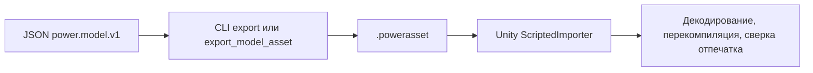

# Модельные активы

[English](ASSET_FORMAT.md) · [简体中文](ASSET_FORMAT.zh-CN.md) · [Français](ASSET_FORMAT.fr.md) · **Русский** · [日本語](ASSET_FORMAT.ja.md) · [한국어](ASSET_FORMAT.ko.md) · [Deutsch](ASSET_FORMAT.de.md) · [Español](ASSET_FORMAT.es.md) · [Italiano](ASSET_FORMAT.it.md) · [Português](ASSET_FORMAT.pt-BR.md)

JSON `power.model.v1` — авторский вход. Файл `.powerasset` несёт данные модели и эксперимента для других сред выполнения. `Power.Assets` не зависит от библиотеки JSON, Unity или стороннего пакета и компилируется с ядром для .NET 10 и .NET Standard 2.1.

Команда CLI `export` и инструмент MCP `export_model_asset` используют один и тот же кодировщик. `ScriptedImporter` Unity импортирует файл как `PowerModelAsset` и сериализует только байты данных. Во время выполнения байты декодируются, модель компилируется снова, и произвольный код или сохранённое LU-разложение не загружаются. Активы по умолчанию производит `tools/Build.cs`, и их можно заново собрать из JSON.

## Текущая версия 27

v27 сохраняет бак и выбор подачи и читает v1-v26. Каждый бак добавляет 4 состояния в прежних границах. Независимый мокрый обмен, аналитические давление/энергия вала после опустошения, обратное смешение, полные балансы, rollback, ветви и шаги без выделений проверены.

| Identifier | Value |
|---|---|
| kind | 40 (`liquid_fuel_tank`) |
| fingerprint_tag | 31 |
| tank_state_field | 87 |
| count_table_int32 | 39 |
| count_table_bytes | 156 |
| header_bytes | 234 + UTF-8 name length |
| liquid_feed_record_bytes | 28 |
| liquid_tank_record_bytes | 32 |

[LIQUID_FUEL_TANK.ru.md](LIQUID_FUEL_TANK.ru.md)

## Сохранённая версия 26

Кодировщик пишет `power.asset.v26` и читает v1-v26. Содержатся 38 счётчиков int32 (152 bytes); заголовок занимает 230 + длина имени UTF-8 bytes. Тип 39 — `liquid_rail_feed`, тег отпечатка 30. Запись 24 bytes хранит индекс, ID инжектора/насоса и температуру источника. Проверяются типы и исключительное владение; переподписанное понижение v25 отклоняет новый тип.

## Сохранённая версия 25

Кодировщик пишет `power.asset.v25` и читает v1-v25. Таблица содержит 37 значений int32 (148 bytes); заголовок занимает 226 + длина имени UTF-8 bytes. Тип 38 — `at_controller`, тег отпечатка 29. Запись содержит 208 фиксированных bytes и 12 bytes на маршрут. Число маршрутов — 5 или 6; ограниченная сумма объявляется отдельно. Проверяются типы, часы, единицы, владение и топология. Понижение до v24 с обновлённым digest отклоняет новый тип.

## Сохранённая версия 24

Кодировщик пишет `power.asset.v24`; версии с 1 по 24 остаются читаемыми. Таблица счётчиков и размеры записей остаются теми же, что у v23. Вид 37 — `carrier_gear`: его базовое отношение конечно, со знаком и не равно нулю; его 8-байтовое расширение шестерни сохраняет индекс компонента и отдельное подвижное водило. Типизированные счётчики покрывают каждое зацепление водила. Понижение v23 с пересчитанным дайджестом отклоняет новый вид.

Зацепления водила добавляют тег отпечатка 28, компенсированные координаты, согласованность ограничений конечных точек и ограниченное уточнение относительной проекции с накопленными реакциями. Обычные записи роторов сохраняют абсолютное вращение сателлитов и полную орбитальную инерцию водила. Подлинная фикстура редуцированного Ravigneaux v23 сохраняет свой дайджест и отпечаток и точный повтор после обновления. См. [RESOLVED_PLANETS.ru.md](RESOLVED_PLANETS.ru.md).

## Сохранённая версия 23

Версия 23 сохраняет таблицу счётчиков и размеры записей v22. Вид 36 — `double_pinion_planetary_gear`: базовое отношение со знаком и существующее 8-байтовое расширение шестерни сохраняют отдельное водило. Счётчики и типизированное покрытие включают новый вид. Более старые версии отклоняют его, в том числе понижение v22 с пересчитанным дайджестом.

Составные модели добавляют тег отпечатка 27, включая компенсированное накопление координат. Их полная строка входит в обычный контракт реакции, фазы и повтора; существующие модели сохраняют предшествующие отпечатки. Подлинная фикстура управляемого DCT v22 сохраняет свой дайджест и точный повтор после обновления. См. [RAVIGNEAUX_TRANSMISSION.ru.md](RAVIGNEAUX_TRANSMISSION.ru.md).

## Сохранённая версия 22

Таблица счётчиков версии 22 содержит 35 значений int32 (140 байт); размер заголовка — `218 + UTF-8 name length`. Счётчик регулятора DCT следует за счётчиками привода v21. После записей драйвера каждая запись DCT занимает 104 байта: индекс компонента int32; ID автомобиля и нечётного и чётного сцеплений uint32; восемь ID селекторов uint32; значения выборки, отпускания, замыкания и таймаута uint64; и две величины для допуска синхронизации и предела скорости направления.

Вид 35 — `dct_controller`. Поля 73-79 — запрошенная и фактическая передача, выбор нечётного и чётного, фаза переключения, ошибка синхронизации и неисправность управления. Существующие ID не изменились. Модели с регулятором добавляют тег отпечатка 26 с устойчивыми маршрутами, фазами и допусками. При компиляции проверяются начальные отпущенные команды, единственное владение, полная топология, целочисленный запрос, ограниченный счётчик состояния и выравнивание по времени. Поддельные понижения v21 отклоняют записи и виды регулятора. Подлинный граф DCT v21 сохраняет свой дайджест и отпечаток и повтор после обновления в той же среде выполнения. См. [DCT_CONTROL.ru.md](DCT_CONTROL.ru.md).

## Сохранённая версия 21

Таблица счётчиков v20 версии 21 и заголовок `214 + UTF-8 name length` остаются неизменными. Каждая запись драйвера иглы занимает 40 байт: поля v20 плюс необязательный горизонт закрытия uint64. Более старые записи драйвера занимают 32 байта и декодируются с отключённым предсказанием.

Модели с предсказанием добавляют тег отпечатка 25 и горизонт в наносекундах; отключённые модели сохраняют прежние отпечатки и хеши состояния. Поля 69-72 — предсказанная масса топлива, тики предсказания, состояние отсечки драйвера и ожидающие тики закрытия. Существующие ID остаются фиксированными. Правила горизонта, выравнивания, бюджета и часов принадлежат компиляции физики и управления. Поддельные понижения, которые снимают включённое предсказание, не проходят проверку отпечатка. Подлинные активы v20 сохраняют свои дайджесты и повтор после обновления в той же среде выполнения. См. [CLOSURE_PREDICTION.ru.md](CLOSURE_PREDICTION.ru.md).

## Сохранённая версия 20

34 счётчика int32 версии 20 занимают 136 байт; заголовок — `214 + UTF-8 name length` байт. Четыре счётчика после счётчика жидкостной форсунки описывают соленоиды, упоры хода, необязательные иглы форсунок и дискретные драйверы иглы. После жидкостной таблицы:

| Таблица | Байты | Данные |
|---|---:|---|
| Соленоид | 28 | Индекс компонента int32; величины опорного положения и градиента индуктивности |
| Упор хода | 40 | Индекс компонента int32; величины минимального и максимального положения и жёсткости |
| Игла | 32 | Индекс компонента форсунки int32; ID узла иглы uint32; величины закрытого и полностью открытого положения |
| Драйвер | 32 | Индекс компонента int32; ID форсунки и соленоида uint32; период uint64; величина напряжения привода |

R/L и начальный ток соленоида, вход напряжения и тепловой сток используют базовые записи. Виды 32-34 — `solenoid`, `travel_stop` и `needle_driver`; `HenryPerMeter` добавлен в перечисление единиц (`h_m`), а поле 68 — `copper_heat`. Существующие ID сохраняют свои значения. Магнитные модели и модели упоров добавляют тег отпечатка 22, физическое открытие иглы добавляет тег 23, а определения драйвера — тег 24. Параметры, устойчивые ссылки и периоды дискретизации входят в отпечаток.

Типизированные ограниченные записи, единицы, различные владельцы, полное покрытие и физическая компиляция остаются обязательными. Поддельные понижения v19 отклоняют виды привода; снятие расширения иглы меняет скомпилированный отпечаток. Подлинная жидкостная фикстура v19 сохраняет свой дайджест и отпечаток и повтор после обновления в той же среде выполнения. См. [NEEDLE_ACTUATION.ru.md](NEEDLE_ACTUATION.ru.md).

## Сохранённая версия 19

30 счётчиков int32 версии 19 занимают 120 байт; заголовок — `198 + UTF-8 name length` байт. Счётчик жидкостной форсунки следует за счётчиком плёнки v18. После таблицы фаз плёнки каждая жидкостная запись занимает 120 байт: индекс таблицы компонентов int32, ID целевой плёнки uint32, ID коленвала uint32, затем девять величин для углов цикла, начала и длительности, максимальной дозы, начальной массы источника, температуры подачи, плотности, начального абсолютного давления и податливости по давлению. Каждая величина — double плюс единица int32. Площадь и коэффициент сопла используют существующее 36-байтовое расширение отверстия.

Вид 31 — `liquid_fuel_injector`; `KilogramPerCubicMeter` добавлен в перечисление единиц, с именем JSON `kg_m3`. Существующие ID области, единицы и выхода остаются фиксированными. Жидкостные модели добавляют тег отпечатка 21, включая устойчивые ID плёнки и коленвала, фазы и свойства источника. Ограниченное типизированное полное покрытие, дайджест, единицы и физическое владение обязательны; поддельные понижения v18 отклоняют жидкостные форсунки. Подлинная фикстура плёнки v18 сохраняет дайджест и отпечаток и повтор после обновления в той же среде выполнения. См. [LIQUID_FUEL_INJECTION.ru.md](LIQUID_FUEL_INJECTION.ru.md).

## Сохранённая версия 18

29 счётчиков int32 версии 18 занимают 116 байт; заголовок — `194 + UTF-8 name length` байт. Счётчик плёнки следует за счётчиком топливной форсунки v17. После записей форсунки каждая запись плёнки занимает 64 байта: индекс таблицы компонентов int32, затем начальная масса, начальная температура, удельная теплоёмкость жидкости, температура насыщения и скрытая внутренняя энергия как пять величин (double плюс единица int32). Проводимость и ID приёмника и стенки остаются в базовой записи компонента.

Вид 30 — `fuel_film`; поля 66-67 — накопленная масса испарённого топлива в kg и теплота стенки плёнки в J. Существующие ID остаются фиксированными. Модели плёнки добавляют тег отпечатка 20, включая начальную энергию фазы, массу жидкости и фазовые постоянные. Типизированное полное покрытие, ограниченные счётчики и длина, дайджест, единицы и физическая компиляция обязательны. Поддельные понижения v17 отклоняют плёнки. Подлинная фикстура дозированного цилиндра v17 сохраняет свой дайджест и отпечаток и повтор после обновления в той же среде выполнения. См. [FUEL_FILM.ru.md](FUEL_FILM.ru.md).

## Сохранённая версия 17

28 счётчиков int32 версии 17 занимают 112 байт; заголовок — `190 + UTF-8 name length` байт. Счётчик форсунки следует за счётчиком газового поршня v16. После геометрии газового поршня каждая запись форсунки занимает 56 байт: индекс таблицы компонентов int32, ID коленвала фаз uint32, затем углы цикла, начала и длительности и максимальная доза как четыре величины. Площадь и коэффициент её сопла также используют существующую 36-байтовую запись газового отверстия. Базовая входная величина несёт kg за цикл, а не долю открытия.

Вид 29 — `gas_fuel_injector`. Поля 63-65 — запрошенная доза цикла, отданная доза цикла и накопленное отданное топливо в kg. Существующие ID остаются фиксированными. Эти модели добавляют тег отпечатка 19, сохраняя ID коленвала, окно и предел дозы. Типизированное полное покрытие, ограниченные счётчики и длина, дайджест, единицы и совместимые конечные порты обязательны. Поддельные понижения v16 отклоняют форсунки. Подлинные активы газового аккумулятора v16 сохраняют дайджест и отпечаток и повтор после обновления в той же среде выполнения. См. [FUEL_METERING.ru.md](FUEL_METERING.ru.md).

## Сохранённая версия 16

27 счётчиков int32 версии 16 занимают 108 байт; заголовок — `186 + UTF-8 name length` байт. Счётчик линейного газового поршня следует за счётчиком золотника v15. После геометрии золотника каждая запись газового поршня занимает 56 байт: индекс таблицы компонентов int32, направление сжатия int32 (+1 или -1) и четыре величины для площади, опорного объёма, опорного положения и абсолютного опорного давления. Каждая величина — double плюс единица int32. Газовый узел использует существующую запись состава и опускает фиксированный накопитель.

Вид 28 — `gas_piston`. Существующие ID области, единицы и выхода не меняются. Эти модели добавляют тег отпечатка 18, включая геометрию, опорные значения и ориентацию. Типизированное полное покрытие, ограниченные счётчики и длина, дайджест и физическая компиляция остаются обязательными; поддельные понижения v15 отклоняют газовые поршни. Подлинная фикстура золотника v15 сохраняет свой дайджест, отпечаток, физические ссылки и повтор после обновления в той же среде выполнения. См. [GAS_PISTON.ru.md](GAS_PISTON.ru.md).

## Сохранённая версия 15

26 счётчиков int32 версии 15 занимают 104 байта; заголовок — `182 + UTF-8 name length` байт. Один счётчик золотникового клапана следует за счётчиками поршня и контакта v14. После этих таблиц расширений каждая запись золотника занимает 32 байта: индекс таблицы компонентов int32, ID компонента поршня, на который ссылаются, uint32, величина закрытого положения и величина полностью открытого положения. Каждая величина — значение double плюс единица int32. Параметры потока и давление резервуара остаются в существующей 40-байтовой записи гидравлического сужения.

Вид 27 — `hydraulic_spool_valve`; существующие ID, единицы и поля выхода сохраняют свои значения. Модели золотника добавляют тег отпечатка 17 и оба положения пояска и ID поршня. Проверяются типизированное полное покрытие, ограниченные счётчики, длина, дайджест, единицы и владение ходом. Поддельные понижения до v14 отклоняют виды золотника. Подлинные активы поршня v14 сохраняют свои дайджесты, отпечатки и повтор после обновления в той же среде выполнения. См. [HYDRAULIC_SPOOL.ru.md](HYDRAULIC_SPOOL.ru.md).

## Сохранённая версия 14

Таблица счётчиков версии 14 содержит 25 значений int32 (100 байт). Два счётчика после счётчиков батареи и управления скважностью v13 описывают гидравлические поршни и сцепления с контактным приводом. Заголовок — `178 + UTF-8 name length` байт. После таблицы регулятора скважности:

| Расширение | Байты | Поля |
|---|---:|---|
| Гидравлический поршень | 104 | Индекс таблицы компонентов int32, ID заднего узла uint32; передняя и задняя площади, заднее давление, минимальное и максимальное положение, жёсткость упора, положение и жёсткость контакта как восемь величин |
| Сцепление поршня | 40 | Индекс таблицы компонентов int32, ID компонента поршня uint32, величина эффективного радиуса, статический и скользящий коэффициенты как два double, число поверхностей трения uint32 |

Поступательные масса, скорость и положение и параметры линейной пружины и силы используют существующие базовые записи. Область 6 — поступательная. Виды 23-26 — линейная пружина, гидравлический поршень, сцепление поршня и источник силы. Единицы 47-49 — m/s, N/m и N*s/m; поля 60-62 — перемещение, линейная скорость и сила. Накопленная теплота демпфирования пружины использует существующее поле 34. Модели поршня и контакта добавляют тег отпечатка 16; ход, накладка, задняя граница, поршень, на который ссылаются, и геометрия трения включены.

Ограниченные счётчики, типизированные индексы, различные полные расширения, точная длина, дайджест и предел 1 MiB проверяются до использования модели. Более старые версии отклоняют новую область и виды, даже когда записи расширений удалены и дайджест пересчитан. Компилятор проверяет единицы СИ, типизированные порты, возрастающий ход, зазор накладки и порядок трения. Подлинная фикстура v13 сохраняет свой исходный дайджест и повтор после обновления в той же среде выполнения. См. [контракт поршня](HYDRAULIC_PISTON.ru.md).

## Сохранённая версия 13

Версия 13 добавляет два счётчика int32 к таблице v12: батареи и регуляторы скважности. Её заголовок — `170 + UTF-8 name length` байт. После существующих записей регулятора напряжения:

| Расширение | Байты | Поля |
|---|---:|---|
| Батарея | 68 | Индекс таблицы узлов int32, ID теплового узла uint32; OCV пустой и полной, последовательное сопротивление, сопротивление и ёмкость поляризации как пять величин |
| Регулятор скважности | 80 | Индекс таблицы компонентов int32, целевой канал uint64, период дискретизации uint64; пропорциональный и интегральный коэффициенты, границы скважности и начальный интеграл как пять величин |

Ёмкость батареи, SOC и начальное напряжение поляризации используют существующие поля узла. Двигатели батареи и резистивные нагрузки сохраняют свои порты, параметры RL, сопротивление и открытие или скважность в базовых записях компонентов. Область 5 — батарея; виды 20–22 — двигатель батареи, резистивная нагрузка и регулятор скважности по давлению. Единицы 42–46 — C, F, Ah, fraction/Pa и fraction/(Pa·s); поля 53–59 — SOC, заряд, напряжение клемм и поляризации, ток батареи, интегральная скважность и командная скважность. Прежние идентификаторы остаются фиксированными.

Ограниченные типизированные таблицы, точные покрытие и длина, дайджест и пределы 1 MiB остаются. Старые версии отклоняют области батареи и новые виды, даже после удаления их таблиц расширений. Компиляция проверяет границы заряда, размерности, типизированные источники, порядок OCV и владение управлением. Модели батареи добавляют тег отпечатка 14; управление скважностью добавляет тег 15. Прежние модели сохраняют свои отпечатки. Подлинные фикстуры v12 и более старые проверяют исходные дайджесты и повтор в той же среде выполнения. См. [контракт батареи](HYDRAULIC_PUMP.ru.md#finite-battery-supply-and-duty-regulation).

## Сохранённая версия 12

Версия 12 добавляет двадцать первый счётчик int32 для записей регулятора давления. Её заголовок — `162 + UTF-8 name length` байт. После таблиц насоса и предохранительного клапана каждое расширение регулятора занимает 80 байт:

| Данные | Кодирование |
|---|---|
| Индекс таблицы компонентов | int32, различный и ссылающийся на вид 19 (`pressure_controller`) |
| Принадлежащий целевой канал напряжения | uint64 |
| Период дискретизации в наносекундах | uint64 |
| Пропорциональный коэффициент, интегральный коэффициент, минимальное и максимальное напряжение, начальный интеграл | Пять величин, каждая — значение double плюс единица int32 |

Узел датчика, канал уставки и начальная цель давления остаются в базовой записи компонента. Входы и проверки KPI следуют за таблицей регулятора. Проверяются точная длина, ограниченные счётчики, типизированные индексы, полное покрытие расширений, дайджест и предел 1 MiB. Поддельные понижения до v11 отклоняют виды регулятора, даже после удаления их записей. Компиляция проверяет единицы, область датчика, владение целью, границы и периоды, выровненные по тику. Единицы 40/41 — V/Pa и V/(Pa·s); поля 49–52 — выбранное давление, ошибка давления, интегральное напряжение и удерживаемая команда. Существующие идентификаторы сохраняют свои значения.

Управляемые модели добавляют тег отпечатка 13, включая период дискретизации, целевой канал и начальный интеграл. Истории регулятора восстанавливаются повтором, а не сериализуются. Неуправляемые модели сохраняют свои отпечатки и траектории. Подлинная фикстура v11 и все предыдущие фикстуры остаются неизменными. См. [контракт регулирования давления](HYDRAULIC_PUMP.ru.md#sampled-pressure-regulation).

## Сохранённая версия 11

Версия 11 добавляет счётчики int32 насоса и предохранительного клапана к восемнадцати счётчикам v10. После существующих таблиц гидравлического сужения и привода идут 32-байтовые записи насоса (индекс компонента, ID узла входа, величина рабочего объёма, величина давления резервуара), затем 16-байтовые записи предохранительного клапана (индекс компонента и величина давления открытия). У предохранительного клапана также есть существующая 40-байтовая запись сужения для проводимости и граничного давления. Входы и проверки следуют за этими новыми таблицами. Заголовок — `158 + UTF-8 name length` байт.

Проверяются типизированные различные индексы, полные записи по виду, точная длина, SHA-256 и ограниченные счётчики. Более старые форматы отклоняют виды 17/18 (насос и предохранительный клапан). Единица 39 — m³/rad; поле 48 — знаковая гидравлическая мощность. Работа насоса повторно использует поле 44 на компоненте, а нулевой объект сохраняет внешнюю гидравлическую работу. Модели насоса и предохранительного клапана добавляют тег отпечатка 12; модели без того и другого сохраняют свои отпечатки. Подлинная гидравлическая фикстура v10 проверяет свой исходный дайджест и повтор. См. [контракт насоса](HYDRAULIC_PUMP.ru.md).

## Сохранённая версия 10

Версия 10 добавляет два счётчика int32 после шестнадцати счётчиков v9: гидравлические сужения и гидравлические сцепления. Гидравлическая область узла 4 использует существующую 44-байтовую запись узла: накопитель — податливость, начальное значение — избыточное давление, положение — ноль/None. Более старые форматы отклоняют гидравлические узлы, даже когда расширения компонента нет.

После полной таблицы гидротрансформатора переменной длины идут эти записи фиксированного размера:

| Расширение | Байты | Поля |
|---|---:|---|
| Гидравлическое сужение | 40 | Индекс компонента int32; коэффициент, давление перехода и давление резервуара как три величины |
| Гидравлическое сцепление | 64 | Индекс компонента int32, ID узла давления uint32; площадь поршня, сила предварительного натяга и радиус как величины; статический и скользящий коэффициенты как double; число поверхностей трения uint32 |

Каждому виду нужно ровно одно различное расширение в допустимом диапазоне. Общие вращательные и гидравлические порты, отношение, вход клапана и тепловой сток остаются в базовой записи компонента. Давление резервуара явно несётся в расширении сужения, включая ноль/None для внутренних рёбер. Запланированные входы и проверки следуют за обеими гидравлическими таблицами. Счётчики, точная длина, SHA-256 и предел 1 MiB проверяются до того, как компиляция проверяет размерности, топологию и физические диапазоны.

Виды 14–16 обозначают линейное сужение, турбулентное сужение и сцепление давления. Единицы 34–38 добавляют податливость, линейный и турбулентный коэффициенты, объёмный расход и силу. Поля 41–47 добавляют объёмный расход, запас резервуара, остаток запаса, гидравлическую работу, силу прижима и статическую и скользящую ёмкость. Существующие поля теплоты и давления используются повторно. Модели с гидравлическими узлами добавляют тег отпечатка 11; модели без гидравлики сохраняют прежние отпечатки. Истории решателя восстанавливаются повтором. Подлинная фикстура гидротрансформатора v9 проверяет свой исходный дайджест, отпечаток и обновлённую траекторию. См. [гидравлический контракт](HYDRAULIC_NETWORK.ru.md).

## Сохранённая версия 9

Версия 9 добавила два счётчика int32 после четырнадцати счётчиков v8: компоненты гидротрансформатора и общее число точек карт. Поддерживаются не более восьми гидротрансформаторов и 32 точки в каждой из четырёх карт. После таблицы шестерён у каждой записи гидротрансформатора 20-байтовый заголовок: индекс таблицы компонентов и четыре счётчика точек int32. Её точки следуют сразу, в порядке насос-положительный, насос-отрицательный, турбина-положительный, турбина-отрицательный. Каждая точка занимает 28 байт: отношение скоростей (double), отношение моментов (double), коэффициент ёмкости (double + единица int32). Заголовок следующего гидротрансформатора следует за этими точками. Запланированные входы и проверки следуют за всеми записями гидротрансформатора. Узлы, базовые компоненты и прежние расширения сохраняют свои размеры.

Проверяются точный размер, SHA-256, граница 1 MiB, все совокупные счётчики и счётчики на карту, различные типизированные индексы и полное потреблённое число точек. Затем компиляция проверяет топологию, единицы, непрерывные границы опорного элемента и пассивность между узлами интерполяции. Отсутствующие, повторяющиеся, искажённые, неверного вида и пониженные записи гидротрансформатора отклоняются.

Вид 13 обозначает гидротрансформатор, единица 33 — его коэффициент ёмкости, а поля 38–40 добавляют теплоту жидкости, отношение скоростей и код опорного элемента. Поля момента на B/C и теплового потока используются повторно; момент C — реакция неподвижного статора без третьего порта ротора. Модели гидротрансформатора добавляют тег отпечатка 10 и все нормированные значения карт. Коэффициенты решателя и средние и накопленные истории восстанавливаются повтором. Подлинные фикстуры v1–v8 проверяют сохранённые отпечатки и воспроизведение. См. [контракт гидротрансформатора](CONVERTER_NETWORK.ru.md).

## Сохранённая версия 8

Версия 8 добавила четырнадцатый счётчик int32 для топологии идеальных шестерён. После таблицы расширения сцепления каждая 8-байтовая запись содержит индекс таблицы компонентов (int32) и ID узла водила (uint32). Ровно одна различная запись должна ссылаться на каждый компонент `IdealGear` или `PlanetaryGear`. ID водила равен нулю для идеальной пары и отдельному вращательному узлу для планетарного ряда. ID узлов A/B и отношение остаются в неизменной базовой записи 156 байт. Узлы остаются 44 байта, размеры прежних расширений не изменились.

Счётчики по порядку: узлы, компоненты, запланированные входы, проверки, закрытые цилиндры, газовые узлы, отверстия, подвижные цилиндры, клапаны, смеси, доли резервуара, горелки, сцепления и шестерни. Точная длина полезной нагрузки, SHA-256 и граница 1 MiB проверяются до компиляции. Входы и проверки KPI следуют за всеми таблицами расширений.

ID видов 11/12 обозначают идеальные и планетарные шестерни. Поля 35/36/37 добавляют момент на B, момент на C и ошибку фазы; остаток скорости шестерни повторно использует поле 32. Более старые идентификаторы сохраняют свои значения. Модели с шестернями добавляют тег отпечатка 9, включая конечную точку водила; отпечатки без шестерён не изменились. Начальная относительная фаза выводится из углов роторов. История средних реакций и коэффициенты ограничений восстанавливаются повтором, а не сериализуются как состояние решателя.

Неверные порты и отношения, зависимые ограничения, несовместимые начальные скорости, не относящиеся к делу физические параметры, отсутствующие, повторяющиеся и неверного вида расширения и поддельные понижения отклоняются. Подлинная фикстура сцепления со сгоранием v7 сохраняет свой дайджест, отпечаток модели и повтор после обновления; фикстуры v1–v6 остаются. См. [связанные шестерни](GEAR_NETWORK.ru.md) и [происхождение фикстур](../tests/Power.Tests/Fixtures/README.md).

## Сохранённая версия 7

Версия 7 добавила тринадцатый счётчик int32 для расширений сцепления. После таблицы сгорания каждая 28-байтовая запись содержит индекс таблицы компонентов и две величины: статическую и скользящую ёмкость момента в Nm. Ровно одна запись должна ссылаться на каждый компонент `Clutch`, с различными индексами в допустимом диапазоне. Конечные точки стойки и ротора, отношение, вход замыкания и назначение теплоты остаются в неизменной базовой записи компонента 156 байт.

Компиляция проверяет единицы, `static >= sliding >= 0`, отношение, топологию и замыкание. Отсутствующие, повторяющиеся и неверного вида расширения, неверные ёмкости, попытки поддельного понижения и изменения отпечатка отклоняются. Записи узлов остаются 44 байта, и все старые записи расширений сохраняют свои размеры. Счётчики, точный размер, дайджест и граница 1 MiB проверяются до компиляции. Запланированные входы и проверки следуют за всеми таблицами расширений.

Вид сцепления 10, поля 32–34 (скорость скольжения, режим, теплота трения) и единица 32 (`StateCode`) добавлены без перенумерации старых идентификаторов. Модель включает тег отпечатка 8, только когда сцепления есть. Коэффициенты решателя, история фазы, средние выходы и журналы учёта теплоты восстанавливаются повтором; они не сериализуются. Подлинная фикстура со сгоранием v6 проверяет неизменный прежний отпечаток и воспроизведение после обновления. См. [связанные сцепления](CLUTCH_NETWORK.ru.md) и [происхождение фикстур](../tests/Power.Tests/Fixtures/README.md).

## Сохранённая версия 6

Версия 6 добавляет три счётчика int32 после девяти счётчиков v5: для предварительно смешанного состава газа, долей резервуара и параметров сгорания. Поэтому в заголовке двенадцать счётчиков. После таблицы фаз эти таблицы расширений следуют в таком порядке:

| Расширение | Размер | Кодирование |
|---|---|---|
| Предварительно смешанный газ | 40 байт | Индекс таблицы газовых узлов (int32), LHV (величина), стехиометрическое отношение воздуха и топлива (double), начальные доли топлива и свежего воздуха (два double) |
| Доли резервуара | 20 байт | Индекс таблицы компонентов (int32), доли топлива и свежего воздуха (два double) |
| Сгорание | 56 байт | Индекс таблицы компонентов (int32), углы цикла, начала и длительности (три величины), показатель формы и коэффициент выгорания (два double) |

Каждая таблица требует различных индексов подходящего вида в допустимом диапазоне. Ровно одна запись выгорания обязательна на компонент `PremixedCombustion`. Необязательные записи смеси проверяются относительно соединённых газовых узлов; предварительно смешанные границы резервуара требуют явных записей долей. Счётчики и точная длина проверяются до выделения массивов дескрипторов, затем топология, единицы, суммы долей и ограничения профиля. Удаление необязательного состава меняет семантику и не проходит компиляцию или отпечаток модели.

Базовая запись компонента не изменилась: ID коленвала и газа и вход множителя выгорания остаются там. Новые идентификаторы вида, поля и единицы добавлены; старые идентификаторы сохраняют свои значения. Состояние решателя, истории составляющих, необратимые границы и накопленные журналы учёта не сериализуются; повтор восстанавливает их из модели и запланированных входов. Подлинная фикстура v5 сохраняет прежний отпечаток модели с фазами и повтор после обновления. См. [предварительно смешанное сгорание](PREMIXED_COMBUSTION.ru.md).

## Сохранённая версия 5

Версия 5 добавляет девятый счётчик int32 после счётчиков v4: необязательные расширения фаз клапана по коленвалу. После записей подвижного цилиндра каждая 44-байтовая запись фаз содержит:

| Данные | Кодирование |
|---|---|
| Индекс таблицы компонентов | int32, уникальный и ссылающийся на газовое отверстие |
| ID узла коленвала | устойчивый ID uint32, ссылающийся на вращательный узел |
| Угол цикла, угол открытия, угол длительности | Три величины (double + единица int32 каждая) |

Фазы необязательны на каждом отверстии. Счётчики, точная длина, тип записи и уникальность проверяются до того, как компиляция проверяет единицы, цикл, фазу и длительность. Удаление записи фаз меняет семантику модели и не проходит проверку сохранённого отпечатка. Модели с фазами добавляют тег отпечатка 6; модели без фаз сохраняют прежние отпечатки. Подлинная фикстура v4 проверяет неизменный повтор подвижного цилиндра после перекодирования. Входы, проверки и завершающее поле SHA-256 следуют за всеми таблицами расширений. См. [фазы](VALVE_TIMING.ru.md).

## Сохранённая версия 4

Версия 4 добавляет восьмой счётчик int32 после семи счётчиков v3: расширения подвижного цилиндра. После расширений газового узла и отверстия v3 каждая запись подвижного цилиндра содержит:

| Данные | Кодирование |
|---|---|
| Индекс таблицы компонентов | int32; уникальный, в границах и ссылающийся на газовый цилиндр |
| Диаметр, ход, длина шатуна и фаза | Четыре величины (double + единица int32 каждая) |
| Степень сжатия | double |
| Противодавление | Одна величина |

Каждая запись — 72 байта. Ровно одна запись обязательна на газовый цилиндр. Его газовый узел хранит начальные температуру, давление и состав в существующих полях; его величина накопителя — ноль/None, потому что объём задаёт геометрия. Читатель молча не подставляет начальный объём или состояние газа. Старые версии отклоняют новый компонент. Владение цилиндром, топология и размерности проверяются компиляцией до принятия отпечатка. Границы источника, дайджеста, размера и расписания не изменились.

## Сохранённая версия 3 и более ранние читатели

Версия 3 ввела поддержку газа постоянного объёма. Она сохраняет базовые таблицы узлов и компонентов и расширения цилиндра v2. Заголовок счётчиков содержит семь значений int32, по порядку: узлы, компоненты, запланированные входы, проверки, цилиндры, газовые узлы и газовые отверстия. После базовых таблиц и расширений цилиндра идут эти записи:

| Расширение | Размер | Кодирование |
|---|---|---|
| Состав газа | 24 байта | Индекс таблицы узлов (int32), удельная газовая постоянная (величина), gamma (double) |
| Газовое отверстие | 36 байт | Индекс таблицы компонентов (int32), площадь (величина), коэффициент расхода (double), давление резервуара (величина) |

Величина — это double, за которым следует идентификатор единицы int32. Базовая таблица узлов сохраняет объём, начальную температуру и начальное давление. Базовая таблица компонентов сохраняет открытие, канал, конечные точки, проводимость стенки и температуру резервуара (существующее поле `AmbientTemperature`). Связям стенки газа расширение не нужно. Записи ссылаются на отсортированные индексы таблиц, а не на ID объектов.

Каждый газовый узел, отверстие и цилиндр требуют ровно одного расширения своего типа. Неизвестные версии, неверные счётчики, неверные длины, повторяющиеся, отсутствующие и несовпадающие по типу расширения, плохие контрольные суммы и несовпадения отпечатка модели отклоняются. Счётчики и точная длина проверяются до выделения массивов дескрипторов. Предел 1 MiB применяется ко всему файлу, включая его конечный дайджест SHA-256. Запланированные открытия проверяются в [0, 1] до создания и экспорта актива.

Старые читатели v1/v2 сохранены для своих исходных наборов моделей; области и компоненты газа требуют v3. Подлинные фикстуры v1 и цилиндра v2 в [фикстурах](../tests/Power.Tests/Fixtures/README.md) отрабатывают декодирование и повтор после обновления. Семантика решателя и отпечатки моделей этой ревизией формата не изменены.

## Сохранённая версия 2 и совместимость версии 1

Версия 2 сохраняет базовые таблицы узлов и компонентов и добавляет пятый счётчик int32 после исходных четырёх: число расширений цилиндра. После базовой таблицы компонентов каждое расширение занимает 116 байт:

| Данные | Кодирование |
|---|---|
| Индекс таблицы компонентов | int32, уникальный, в границах, ссылающийся на закрытый цилиндр |
| Диаметр, ход, длина шатуна, фаза | Четыре величины, каждая — значение double + единица int32 |
| Степень сжатия | double |
| Начальное давление, начальная температура, удельная газовая постоянная | Три величины |
| Gamma | double |
| Противодавление | Одна величина |

Входы, проверки и завершающее поле SHA-256 следуют за расширениями. Декодер проверяет ограниченные счётчики и точную длину до выделения массивов дескрипторов; повторяющиеся или несовпадающие расширения он отклоняет. Компиляция требует ровно одной записи параметров на каждый закрытый цилиндр. Расширенные перечисления единиц и полей добавляют значения, не меняя существующие идентификаторы.

У версии 1 нет счётчика расширений и записей расширений. Модели, использующие только существующие линейные компоненты, сохраняют версию решателя 2 и свои отпечатки, поэтому существующие активы v1 можно декодировать и повторить. Модели с закрытыми цилиндрами используют версию решателя 3. Неизменяемая [фикстура v1](../tests/Power.Tests/Fixtures/README.md) проверяет совместимость с реальным экспортом до изменения.

## Сохранённая раскладка версии 1

Каждое целое и каждое значение IEEE 754 binary64 — little-endian. Файл не больше 1 MiB. Строки — строгий UTF-8.

| Порядок | Данные |
|---|---|
| Тождественность | 8 байт ASCII `POWERAST`, затем версия формата int32 `1` |
| Модель и время | отпечаток модели uint64, наносекунды тика, длительность эксперимента, интервал выборки |
| Происхождение | счётчик байт имени uint16, имя, SHA-256 исходного JSON на 32 байта |
| Счётчики | Четыре значения int32: узлы, компоненты, изменения входов, KPI |
| Дескрипторы | 44 байта на узел и 156 байт на компонент, отсортированные по ID объекта |
| Входы | 24 байта на изменение: время uint64, канал uint64, значение double |
| KPI | 33 байта каждый: объект uint32, поле int32, один байт флага границы, три границы double |
| Целостность | SHA-256 каждого предшествующего байта, 32 байта |

Порядок полей узла и компонента следует кодеку версии 1 в `src/Power.Assets/AssetCodec.cs`. Счётчики, точная длина файла и дайджест проверяются до выделения массивов дескрипторов. Затем проверяются единицы, топология, время, события и KPI, и отпечаток сравнивается с моделью, которую компилирует текущий решатель. Несовпадение требует нового экспорта.

Имя — не более 128 кодовых единиц UTF-16 и не содержит управляющих символов. Модель ограничена 32 узлами, 64 компонентами и 128 состояниями. Эксперимент — не более одного часа, десяти миллионов тиков, 10,000 моментов входа, 65,536 изменений входа и 256 KPI. Целое частное `duration / sample_every` не должно превышать 10,000, и предел файла 1 MiB всё ещё действует. События лежат в `[0, duration)`, упорядочены по абсолютному времени, выровнены по тику и не повторяют канал в один момент.

Завершающий дайджест обнаруживает повреждение. Это не удостоверение происхождения. `asset_sha256` в результате экспорта — дайджест всего файла, включая это завершающее поле. `source_sha256` идентифицирует авторский документ. Отпечаток модели идентифицирует скомпилированную семантику. Повторный экспорт после изменения шага может сохранить исходный дайджест источника и всё же изменить отпечаток модели. Синтетические параметры остаются `unverified`.

`AssetPlayback` применяет начальные события в нулевой момент и использует атомарный пакет событий ядра внутри каждого `Advance`. Отказ и отмена сохраняют время, состояние и курсор событий. Один вызов продвигает не более одного миллиона тиков. Вызывающая сторона разбивает более длинные прогоны. Границы отчётов CLI, воспроизведение актива и живой экспорт MCP сверены друг с другом. Свидетельства исполнения Unity Editor, Mono и IL2CPP всё ещё не получены.
