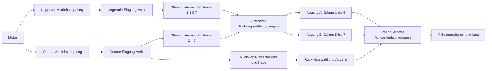

# Siebengang-Doppelkupplungs-Forschungspfad

[English](DUAL_CLUTCH_TRANSMISSION.md) · [简体中文](DUAL_CLUTCH_TRANSMISSION.zh-CN.md) · [Français](DUAL_CLUTCH_TRANSMISSION.fr.md) · [Русский](DUAL_CLUTCH_TRANSMISSION.ru.md) · [日本語](DUAL_CLUTCH_TRANSMISSION.ja.md) · [한국어](DUAL_CLUTCH_TRANSMISSION.ko.md) · **Deutsch** · [Español](DUAL_CLUTCH_TRANSMISSION.es.md) · [Italiano](DUAL_CLUTCH_TRANSMISSION.it.md) · [Português](DUAL_CLUTCH_TRANSMISSION.pt-BR.md)

`DualClutchTransmissionAssembly` senkt sieben Vorwärtspfade und den Rückwärtsgang in gewöhnliche Rotoren, dauerhafte ideale Zahnräder und geregelte Kupplungen ab. Zwei Eingangswellen tragen die ungeraden und die geraden Gänge; der Rückwärtsgang nutzt den geraden Pfad und ein ausdrückliches Zwischenrad. Drei Abgangszweige haben unabhängige Achsantriebe auf denselben Fahrzeugrotor. Nicht gewählte Naben und vorausgewählte inaktive Wellen behalten ihre mitdrehende Trägheit.

Die breite Zuordnung ungerade/gerade/rückwärts und die Architektur mit mehreren Abgängen stützen die [Beschreibung des Siebengang-DSG von Volkswagen](https://www.volkswagen-newsroom.com/en/the-new-polo-international-driving-presentation-3102/the-new-polo-engines-and-transmissions-3118) und ihre [getriebebautechnische Präsentation](https://uploads.vw-mms.de/system/production/files/vwn/003/768/file/e451eac3067123ff305d27a85f3e7eb73dd1ee6f/DSG_the_intelligent_automatic_gearbox_from_Volkswagen_2008_en.pdf?1530367024=). Die hier angegebenen tatsächlichen Zahn- und Zuganordnungen, Trägheiten, Untersetzungen und Kapazitäten sind Forschungseingaben. Das ist kein kalibriertes DQ200 und kein gemessenes Fahrzeugverhalten. Die vollständige Forschungsgrenze EA211/DQ200 bleibt in `assets/samples`.

## Topologie und Vorzeichen



Jede Vorwärtsverzahnung hat `omega_input = -r_gear * omega_hub`. Eine gewählte Nabe verriegelt mit ihrer Abgangswelle. Jeder Abgang hat `omega_output = -r_final * omega_vehicle`. Die beiden Rückwärtsverzahnungen wechseln die Richtung zweimal vor ihrem Abgang und Achsantrieb:

```text
Forward effective reduction = r_gear r_final
Reverse effective reduction = -r_reverse r_reverse_final
omega_engine = effective_reduction omega_vehicle when its drive path is locked
```

Die Vorwärtsgänge 1-4 nutzen Abgang A, 5-7 Abgang B, und der Rückwärtsgang seinen eigenen Abgang. Diese erklärte Gruppierung und das unabhängige Rückwärts-Zwischenrad sind eine Forschungstopologie, keine Aussage über jede OEM-Wellen- und Zahnanordnung. Alle drei Abgänge drehen mit dem Fahrzeug, auch wenn ihre Wählkupplungen inaktiv sind.

Die Baugruppe fügt vierzehn innere Rotoren, zwölf dauerhafte Zahnradbindungen und zehn Kupplungen hinzu. Motor, Fahrzeug und optionale Wärmesenke werden als äußere Anschlüsse vorgegeben. Es gibt keinen Ersatz einer skalaren Zahnradübersetzung zur Laufzeit. Verzahnungsnachgiebigkeit, Spiel, Schmierungs- und Verlustkennfelder und detaillierte Differenzialgeometrie bleiben getrennte Arbeit.

## Parameter und stabile Zuordnungen

Sieben positive Vorwärtsverzahnungsuntersetzungen müssen abnehmende wirksame Vorwärtsuntersetzungen ergeben. Rückwärts und drei Achsantriebsuntersetzungen sind positive vorgegebene Werte. `DualClutchParameters` verlangt ausdrückliche SI-Größen für Trägheit und Kapazität:

- Trägheiten von ungeradem und geradem Eingang, Abgang A/B/Rückwärts, Nabe und Rückwärts-Zwischenrad in kg m2.
- Haft- und Gleitkapazitäten von Antriebskupplung und Wählkupplung in Nm; Haft ist mindestens Gleiten.
- Positive Achsantriebsuntersetzungen für jeden Abgangszweig.

`DualClutchPorts` bindet Motor, Fahrzeug und Wärme sowie jede innere Welle, Antriebskupplung, Achsantriebsbindung, die erste Rückwärtsverzahnung und den Antriebsbefehl. Acht `DualClutchGearIds` binden Vorwärts 1-7 plus Rückwärtsnabe, Verzahnung, Wählkupplung und Eingabekanal. Globale IDs und Stellkanäle müssen verschieden und von null verschieden sein. Parameter und Übersetzungsarrays werden in unveränderliche Baugruppendaten kopiert; Graphlisten stellen unveränderliche Datensätze bereit.

`CreateGraph` liefert innere Knoten und gewöhnliche Komponenten zur Komposition. Es initialisiert Wellen- und Nabendrehzahlen konsistent mit der vorgegebenen Fahrzeuggeschwindigkeit und den anfänglichen Auswahlen ungerade/gerade. Der Compiler prüft weiterhin das vollständige Modell, äußere Anschlüsse, Kapazitäten, globale IDs und den begrenzten Rang von Zustand und Bindung.

`SelectPath(gear, odd_path)` erzeugt eine atomare Menge von Wählbefehlen für diesen Pfad und gibt die anderen Wählbefehle frei. Den unbelasteten Pfad für die Vorauswahl nutzen und das Drehmoment der Antriebskupplung getrennt regeln. Dieser Helfer erfasst keine Drehzahl, steuert kein Schaltstellglied und bildet keine TCU-Verriegelungen ab.

## Synchronisation und Vorauswahl

Wählkupplungen sind erhaltende Reibkupplungen endlicher Kapazität. Ihr Schlupf und ihre Aufnahme erzeugen ausdrückliche Synchronisationswärme, geführt zur erklärten Wärmesenke oder zur extern abgeführten Wärme. Sie sind kein detailliertes Modell von Klauenverzahnung oder Sperring. Ein vorausgewählter Pfad ist über seine Nabe und seinen Abgang bereits mit dem Fahrzeug gekoppelt, daher wirken die Trägheiten seines Eingangs und seiner freien Naben auf die Beschleunigung, obwohl seine Antriebskupplung gelöst ist. Das Wechseln einer unbelasteten Wählkupplung überträgt trotzdem Impuls und Arbeit zwischen dieser Welle und dem Fahrzeug.

Unabhängige Referenzen reduzieren jeden Eingangspfad auf seine Wellenträgheit plus die rückgespiegelten Trägheiten freier Naben und des Zwischenrads. Die wirksame Fahrzeugträgheit enthält alle Abgangswellen und jeden vorausgewählten inaktiven Eingang. Konstantes Motor- und Lastdrehmoment ergibt dann in jedem gewählten Vorwärts- und Rückwärtspfad eine exakte Beschleunigung mit einem Freiheitsgrad. Eine getrennte Zweikoordinaten-Projektion berechnet Aufnahmedrehzahlen der Vorauswahl und verlorene kinetische Energie unabhängig vom Graphlöser.

Ungültige Wahlzeitpläne können zwei Pfade binden oder das Getriebe bremsen. Die physikalischen Kerngleichungen reparieren diese Befehle nicht stillschweigend. Volle Erfassung, Stellgrenzen, Drehmomentabstimmung, Regelung von Klaue und Synchronisierung und Fehlerbehandlung bleiben erforderliche Arbeit von ECU/TCU.

## Korrelierte Verriegelungslösung

Der volle Pfad mit sechs und sieben Gängen legte bei einer Übergabe ein begrenztes Versagen der skalaren Bindungsprojektion offen. Von Zahnrädern rückgespiegelte Verriegelungsantworten können stark korreliert sein. Die bestehende Projektion bleibt der primäre Löser; nachdem ihr Iterationsbudget erschöpft ist, können unabhängige lineare Verriegelungen eine normierte Schur-Lösung in vorallokierten Puffern nutzen. Verletzungen der Haftkapazität lösen Verriegelungen über dieselbe begrenzte Logik der aktiven Menge. Residuen, Kapazitäten, passive Wärme und die Annahme des ganzen Batches bleiben geprüft.

Dieser Rückfall gilt für den linearen mechanischen Pfad, ohne gekoppelte nichtlineare Kräfte von Zylinder und Hydraulik. Singuläre und redundante Fälle sowie nichtlineare Pfade behalten ihr bestehendes begrenztes Verhalten. Er erhöht keine Iterationsbudgets und macht aus fehlgeschlagenen Bindungen keine erfolgreichen Schritte. Bestehende Bahnen und Fixtures bleiben Regressionsnachweis, und die zuvor fehlschlagende volle Übergabe ist direkt abgedeckt.

## Gemeinsame Experimente und Nachweis

`dual-clutch-transmission` übt Anfahren, inaktive Vorauswahl, alle sieben Vorwärtsübersetzungen, Hoch- und Rückschaltübergaben und synchronisierte Wärme unter Drehmoment- und Lasteingaben. `fired-dual-clutch` ergänzt den bestehenden offenen Zylinder mit Vormischverbrennung und die Übergabe 1-auf-2-auf-3 und behält den vollen Graph aus sieben Vorwärtsgängen und Rückwärtsgang. Das gezündete Modell passt in das aktuelle Zustandsbudget von 64; es kombiniert noch nicht alle detaillierten Erweiterungen von Versorgung und Ansteuerung oder vollständiges Fahrzeug- und Reglerverhalten.

JSON, CLI, MCP, portable Assets und vorbereitete Studio-Ansichten nutzen dieselben gewöhnlichen Definitionen. Es ist keine neue Komponentenart, Einheit oder kein neues Asset-Format nötig. Ausdrückliche Zahnradreaktionen, Kupplungsmodi, Schlupf und Wärme, Rotordrehzahlen und die globalen Konten für Energie, Quelle und Kraftstoff bleiben auffindbar. Vollständiges Replay, unabhängige Referenzen, Verfeinerung, Abzweigungen, Abbruch, spätes Rollback und Zuweisungsgrenzen sind in [VALIDATION.de.md](VALIDATION.de.md) festgehalten.

Alle Parameter bleiben `unverified`. Vorgeschriebene Zeitpläne sind kein vollständiges TCU; vorgeschriebene Verbrennung ist kein vollständiger Motor. Detaillierte Physik von Trockenkupplung, Synchronisierung und Stellglied, gemessene Kennfelder, Antriebsstranggrenzen von DQ200/AT8, tatsächliches Unity und die Abnahme kalibrierter Fahrzeuge bleiben unfertig.
