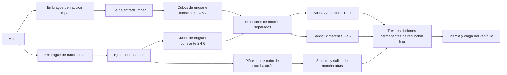

# Camino de potencia de investigación de doble embrague de siete marchas

[English](DUAL_CLUTCH_TRANSMISSION.md) · [简体中文](DUAL_CLUTCH_TRANSMISSION.zh-CN.md) · [Français](DUAL_CLUTCH_TRANSMISSION.fr.md) · [Русский](DUAL_CLUTCH_TRANSMISSION.ru.md) · [日本語](DUAL_CLUTCH_TRANSMISSION.ja.md) · [한국어](DUAL_CLUTCH_TRANSMISSION.ko.md) · [Deutsch](DUAL_CLUTCH_TRANSMISSION.de.md) · **Español** · [Italiano](DUAL_CLUTCH_TRANSMISSION.it.md) · [Português](DUAL_CLUTCH_TRANSMISSION.pt-BR.md)

`DualClutchTransmissionAssembly` reduce siete caminos adelante y la marcha atrás a rotores ordinarios, engranajes ideales permanentes y embragues controlados. Dos ejes de entrada llevan las marchas impares y pares; la marcha atrás usa el camino par y un piñón loco explícito. Tres ramas de salida tienen reducciones finales independientes hacia el mismo rotor del vehículo. Los cubos no seleccionados y los ejes inactivos preseleccionados conservan su inercia en giro.

La asignación amplia impar/par/marcha atrás y la arquitectura de varias salidas están respaldadas por la [descripción DSG de siete marchas de Volkswagen](https://www.volkswagen-newsroom.com/en/the-new-polo-international-driving-presentation-3102/the-new-polo-engines-and-transmissions-3118) y su [presentación de ingeniería de la transmisión](https://uploads.vw-mms.de/system/production/files/vwn/003/768/file/e451eac3067123ff305d27a85f3e7eb73dd1ee6f/DSG_the_intelligent_automatic_gearbox_from_Volkswagen_2008_en.pdf?1530367024=). La disposición real de dientes y de tren, las inercias, las reducciones y las capacidades aportadas aquí son entradas de investigación. Esto no es un DQ200 calibrado ni un comportamiento medido del vehículo. El límite completo de investigación EA211/DQ200 permanece en `assets/samples`.

## Topología y signos



Cada engrane adelante tiene `omega_input = -r_gear * omega_hub`. Un cubo seleccionado se bloquea con su eje de salida. Cada salida tiene `omega_output = -r_final * omega_vehicle`. Los dos engranes de marcha atrás cambian el sentido dos veces antes de su salida y reducción final:

```text
Forward effective reduction = r_gear r_final
Reverse effective reduction = -r_reverse r_reverse_final
omega_engine = effective_reduction omega_vehicle when its drive path is locked
```

Las marchas adelante 1-4 usan la salida A, las 5-7 la salida B, y la marcha atrás su propia salida. Esta agrupación declarada y el piñón loco independiente de marcha atrás son una topología de investigación, no una afirmación sobre cada disposición OEM de ejes y dientes. Las tres salidas giran con el vehículo incluso cuando sus selectores están inactivos.

El conjunto añade catorce rotores internos, doce restricciones permanentes de engranaje y diez embragues. El motor, el vehículo y el sumidero térmico opcional se aportan como puertos externos. No hay sustitución en tiempo de ejecución de una relación de engranaje escalar. La flexibilidad de engrane, el juego, los mapas de lubricación y de pérdidas, y la geometría detallada del diferencial siguen siendo trabajo aparte.

## Parámetros y enlaces estables

Siete reducciones positivas de engrane adelante deben producir reducciones efectivas adelante decrecientes. La marcha atrás y las tres reducciones finales son valores positivos aportados. `DualClutchParameters` exige cantidades explícitas de inercia y de capacidad en el SI:

- Inercias del eje de entrada impar/par, de las salidas A/B/marcha atrás, del cubo y del piñón loco de marcha atrás, en kg m2.
- Capacidades estática y deslizante del embrague de tracción y del selector, en Nm; la estática es al menos la deslizante.
- Reducciones finales positivas para cada rama de salida.

`DualClutchPorts` enlaza motor, vehículo, calor y cada eje interno, embrague de tracción, restricción final, primer engrane de marcha atrás y comando de tracción. Ocho `DualClutchGearIds` enlazan las marchas adelante 1-7 más el cubo, el engrane, el selector y el canal de entrada de la marcha atrás. Los ID globales y los canales de actuador deben ser distintos y distintos de cero. Los parámetros y los arrays de relaciones se copian a datos inmutables del conjunto; las listas del grafo exponen registros inmutables.

`CreateGraph` devuelve nodos internos y componentes ordinarios para la composición. Inicializa las velocidades de ejes y cubos de forma coherente con la velocidad aportada del vehículo y las selecciones iniciales impar/par. El compilador sigue comprobando el modelo completo, los puertos externos, las capacidades, los ID globales y el rango acotado de estado y de restricciones.

`SelectPath(gear, odd_path)` produce un conjunto atómico de comandos de selector para ese camino y libera los demás comandos de selector. Usa el camino descargado para la preselección y controla el par del embrague de tracción por separado. Este ayudante no detecta la velocidad, no controla un actuador de cambio ni implementa enclavamientos de TCU.

## Sincronización y preselección

Los selectores son embragues de fricción de capacidad finita que conservan la energía. Su deslizamiento y su captura producen calor explícito de sincronización, encaminado al sumidero térmico declarado o al calor rechazado externo. No son un modelo detallado de diente de garra ni de anillo de bloqueo. Un camino preseleccionado ya está acoplado al vehículo a través de su cubo y su salida, así que las inercias de su entrada y de sus cubos libres afectan a la aceleración aunque su embrague de tracción esté desacoplado. Cambiar un selector descargado sigue transfiriendo impulso y trabajo entre ese eje y el vehículo.

Las referencias independientes reducen cada camino de entrada a la inercia de su eje más las inercias reflejadas de cubos libres y del piñón loco. La inercia efectiva del vehículo incluye todos los ejes de salida y cualquier entrada inactiva preseleccionada. Un par constante de motor y de carga da entonces una aceleración exacta de un grado de libertad en cada camino adelante o de marcha atrás seleccionado. Una proyección aparte de dos coordenadas calcula las velocidades de captura de la preselección y la energía cinética perdida, con independencia del solver de grafo.

Los programas de selección inválidos pueden unir dos caminos o frenar la transmisión. Las ecuaciones físicas de Core no reparan esos comandos en silencio. La detección completa, los límites del actuador, la coordinación de par, el control de garras y del sincronizador, y el tratamiento de fallos siguen siendo trabajo exigido de ECU/TCU.

## Resolución de bloqueos correlacionados

El camino completo de seis y siete marchas expuso un fallo acotado de proyección escalar de restricciones en una entrega. Las respuestas de bloqueo reflejadas por los engranajes pueden estar fuertemente correlacionadas. La proyección existente sigue siendo el solver principal; cuando se agota su presupuesto de iteraciones, los bloqueos lineales independientes pueden usar una resolución de Schur normalizada en búferes preasignados. Las violaciones de capacidad estática liberan los bloqueos por la misma lógica acotada de conjunto activo. Los residuos, las capacidades, el calor pasivo y la aceptación del lote completo siguen comprobándose.

Este recurso se aplica al camino mecánico lineal, sin fuerzas no lineales acopladas de cilindro o hidráulicas. Los casos singulares o redundantes y los caminos no lineales conservan su comportamiento acotado existente. No aumenta los presupuestos de iteración ni convierte restricciones fallidas en pasos correctos. Las trayectorias y los fixtures existentes siguen siendo evidencia de regresión, y la entrega completa que antes fallaba queda cubierta de forma directa.

## Experimentos compartidos y evidencia

`dual-clutch-transmission` ejercita el arranque, la preselección inactiva, las siete relaciones adelante, las entregas de subida y de bajada, y el calor sincronizado bajo entradas de par y de carga. `fired-dual-clutch` añade el cilindro abierto y el quemado premmezclado existentes, y la entrega de 1 a 2 a 3, manteniendo el grafo completo de siete marchas adelante y marcha atrás. El modelo encendido cabe en el presupuesto actual de 64 estados; todavía no combina todos los incrementos detallados de alimentación y de actuación, ni el comportamiento completo del vehículo y del controlador.

JSON, la CLI, el MCP, los assets portátiles y las vistas de Studio preparadas usan las mismas definiciones ordinarias. No hace falta un tipo de componente, una unidad ni un formato de asset nuevos. Siguen siendo descubribles las reacciones explícitas de engranaje, los modos, deslizamientos y calor de los embragues, las velocidades de los rotores y los libros globales de energía, de fuentes y de combustible. La repetición completa, las referencias independientes, el refinamiento, las bifurcaciones, la cancelación, la reversión tardía y los límites de asignación están registrados en [VALIDATION.es.md](VALIDATION.es.md).

Todos los parámetros siguen siendo `unverified`. Los programas prescritos no son una TCU completa; el quemado prescrito no es un motor completo. La física detallada del embrague en seco y del sincronizador, y de los actuadores, los mapas medidos, los límites de grupo motopropulsor DQ200/AT8, Unity real y la aceptación de un vehículo calibrado siguen sin terminar.
