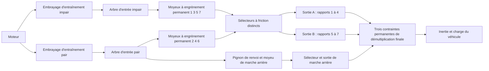

# Chemin de puissance de recherche à double embrayage sept rapports

[English](DUAL_CLUTCH_TRANSMISSION.md) · [简体中文](DUAL_CLUTCH_TRANSMISSION.zh-CN.md) · **Français** · [Русский](DUAL_CLUTCH_TRANSMISSION.ru.md) · [日本語](DUAL_CLUTCH_TRANSMISSION.ja.md) · [한국어](DUAL_CLUTCH_TRANSMISSION.ko.md) · [Deutsch](DUAL_CLUTCH_TRANSMISSION.de.md) · [Español](DUAL_CLUTCH_TRANSMISSION.es.md) · [Italiano](DUAL_CLUTCH_TRANSMISSION.it.md) · [Português](DUAL_CLUTCH_TRANSMISSION.pt-BR.md)

`DualClutchTransmissionAssembly` abaisse sept chemins avant et la marche arrière en rotors ordinaires, en engrenages idéaux permanents et en embrayages commandés. Deux arbres d'entrée portent les rapports impairs et pairs ; la marche arrière utilise le chemin pair et un pignon de renvoi explicite. Trois branches de sortie ont des réductions finales indépendantes vers le même rotor véhicule. Les moyeux non sélectionnés et les arbres inactifs présélectionnés conservent leur inertie en rotation.

La répartition large impair/pair/marche arrière et l'architecture à plusieurs sorties sont étayées par la [description DSG sept rapports de Volkswagen](https://www.volkswagen-newsroom.com/en/the-new-polo-international-driving-presentation-3102/the-new-polo-engines-and-transmissions-3118) et sa [présentation d'ingénierie de transmission](https://uploads.vw-mms.de/system/production/files/vwn/003/768/file/e451eac3067123ff305d27a85f3e7eb73dd1ee6f/DSG_the_intelligent_automatic_gearbox_from_Volkswagen_2008_en.pdf?1530367024=). La disposition réelle des dents et du train, les inerties, les réductions et les capacités fournies ici sont des entrées de recherche. Ce n'est pas un DQ200 calibré ni un comportement véhicule mesuré. La frontière de recherche complète EA211/DQ200 reste dans `assets/samples`.

## Topologie et signes



Chaque engrènement avant a `omega_input = -r_gear * omega_hub`. Un moyeu sélectionné se verrouille sur son arbre de sortie. Chaque sortie a `omega_output = -r_final * omega_vehicle`. Les deux engrènements de marche arrière changent le sens deux fois avant sa sortie et sa démultiplication finale :

```text
Forward effective reduction = r_gear r_final
Reverse effective reduction = -r_reverse r_reverse_final
omega_engine = effective_reduction omega_vehicle when its drive path is locked
```

Les rapports avant 1 à 4 utilisent la sortie A, 5 à 7 la sortie B, et la marche arrière sa propre sortie. Ce regroupement déclaré et ce renvoi de marche arrière indépendant sont une topologie de recherche, pas une affirmation sur chaque disposition d'arbres et de dents OEM. Les trois sorties tournent avec le véhicule même lorsque leurs sélecteurs sont inactifs.

L'assemblage ajoute quatorze rotors internes, douze contraintes d'engrenage permanentes et dix embrayages. Le moteur, le véhicule et un puits thermique optionnel sont fournis comme ports externes. Il n'y a pas de remplacement à l'exécution d'un rapport d'engrenage scalaire. La compliance d'engrènement, le jeu, les cartes de lubrification et de pertes, et la géométrie détaillée du différentiel restent un travail séparé.

## Paramètres et liaisons stables

Sept réductions d'engrènement avant positives doivent produire des réductions avant effectives décroissantes. La marche arrière et les trois réductions finales sont des valeurs positives fournies. `DualClutchParameters` exige des quantités SI explicites d'inertie et de capacité :

- Inerties d'entrée impair/pair, de sortie A/B/marche arrière, de moyeu et de renvoi de marche arrière, en kg m2.
- Capacités statique et glissante des embrayages d'entraînement et des sélecteurs, en Nm ; la statique est au moins égale à la glissante.
- Réductions positives de la démultiplication finale pour chaque branche de sortie.

`DualClutchPorts` lie le moteur, le véhicule, la chaleur et chaque arbre interne, embrayage d'entraînement, contrainte de démultiplication finale, premier engrènement de marche arrière et commande d'entraînement. Huit `DualClutchGearIds` lient les rapports avant 1 à 7 plus le moyeu, l'engrènement, le sélecteur et le canal d'entrée de marche arrière. Les ID globaux et les canaux d'actionneur doivent être distincts et non nuls. Les paramètres et les tableaux de rapports sont copiés dans des données d'assemblage immuables ; les listes du graphe exposent des enregistrements immuables.

`CreateGraph` renvoie les nœuds internes et les composants ordinaires pour la composition. Il initialise les vitesses d'arbres et de moyeux de façon cohérente avec la vitesse véhicule fournie et les sélections initiales impair/pair. Le compilateur vérifie encore le modèle complet, les ports externes, les capacités, les ID globaux et le rang borné d'état et de contraintes.

`SelectPath(gear, odd_path)` produit un ensemble atomique de commandes de sélecteur pour ce chemin, en relâchant les autres commandes de sélecteur. Utilisez le chemin non chargé pour la présélection et commandez le couple des embrayages d'entraînement séparément. Cet auxiliaire ne détecte pas la vitesse, ne commande pas un actionneur de passage et n'implémente pas les interverrouillages d'une TCU.

## Synchronisation et présélection

Les sélecteurs sont des embrayages à friction de capacité finie et conservatifs. Leur glissement et leur capture produisent une chaleur de synchronisation explicite, routée vers le puits thermique déclaré ou la chaleur rejetée externe. Ils ne sont pas un modèle détaillé de dent de crabot ou de bague de synchronisation. Un chemin présélectionné est déjà couplé au véhicule par son moyeu et sa sortie, donc les inerties de son entrée et de ses moyeux libres affectent l'accélération même si son embrayage d'entraînement est débrayé. Changer un sélecteur non chargé transfère encore une impulsion et un travail entre cet arbre et le véhicule.

Des références indépendantes réduisent chaque chemin d'entrée à l'inertie de son arbre plus les inerties ramenées des moyeux libres et du pignon de renvoi. L'inertie effective du véhicule inclut tous les arbres de sortie et toute entrée inactive présélectionnée. Un couple moteur et de charge constant donne alors une accélération exacte à un degré de liberté dans chaque chemin avant ou arrière sélectionné. Une projection séparée à deux coordonnées calcule les vitesses de capture de présélection et l'énergie cinétique perdue, indépendamment du solveur de graphe.

Des séquences de sélection invalides peuvent lier deux chemins ou freiner la transmission. Les équations physiques du cœur ne réparent pas silencieusement ces commandes. La détection complète, les limites d'actionneur, la coordination de couple, le contrôle crabot/synchroniseur et le traitement des défauts restent un travail ECU/TCU requis.

## Résolution de verrouillages corrélés

Le chemin complet à six et sept rapports a exposé un échec borné de projection scalaire de contrainte à une passation. Les réponses de verrouillage ramenées par les engrenages peuvent être fortement corrélées. La projection existante reste le solveur principal ; une fois son budget d'itérations épuisé, des verrouillages linéaires indépendants peuvent utiliser une résolution de Schur normalisée dans des tampons préalloués. Les violations de capacité statique relâchent les verrouillages par la même logique d'ensemble actif bornée. Les résidus, les capacités, la chaleur passive et l'acceptation du lot entier restent contrôlés.

Ce repli s'applique au chemin mécanique linéaire, sans efforts non linéaires de cylindre ou d'hydraulique couplés. Les cas singuliers ou redondants et les chemins non linéaires conservent leur comportement borné existant. Cela n'augmente pas les budgets d'itération et ne transforme pas des contraintes échouées en pas réussis. Les trajectoires et scénarios existants restent des preuves de régression, et la passation complète qui échouait auparavant est couverte directement.

## Expériences partagées et preuves

`dual-clutch-transmission` exerce le départ, la présélection inactive, les sept rapports avant, les passations montée/descente et la chaleur de synchronisation sous des entrées de couple et de charge. `fired-dual-clutch` ajoute la combustion prémélangée à cylindre ouvert existante et la passation 1 vers 2 vers 3, tout en conservant le graphe complet à sept rapports avant et marche arrière. Le modèle allumé tient dans le budget courant de 64 états ; il ne combine pas encore tous les incréments détaillés d'alimentation et d'actionnement, ni le comportement complet véhicule/contrôleur.

JSON, la CLI, le MCP, les assets portables et les vues Studio préparées utilisent les mêmes définitions ordinaires. Aucun nouveau type de composant, aucune nouvelle unité ni aucun nouveau format d'asset n'est nécessaire. Les réactions d'engrenage explicites, les modes, glissements et chaleurs d'embrayage, les vitesses de rotor et les registres globaux d'énergie, de source et de carburant restent découvrables. Le rejeu complet, les références indépendantes, le raffinement, les forks, l'annulation, le rollback tardif et les bornes d'allocation sont consignés dans [VALIDATION.fr.md](VALIDATION.fr.md).

Tous les paramètres restent `unverified`. Des séquences prescrites ne sont pas une TCU complète ; une combustion prescrite n'est pas un moteur complet. La physique détaillée d'embrayage sec, de synchroniseur et d'actionneur, les cartes mesurées, les frontières de groupes motopropulseurs DQ200/AT8, Unity réel et l'acceptation de véhicule calibré restent inachevés.
