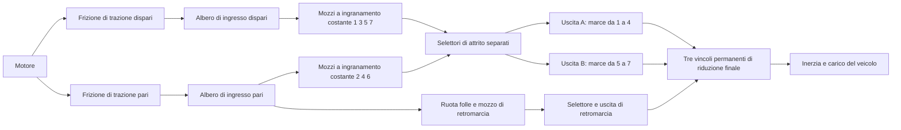

# Percorso di potenza di ricerca a doppia frizione a sette marce

[English](DUAL_CLUTCH_TRANSMISSION.md) · [简体中文](DUAL_CLUTCH_TRANSMISSION.zh-CN.md) · [Français](DUAL_CLUTCH_TRANSMISSION.fr.md) · [Русский](DUAL_CLUTCH_TRANSMISSION.ru.md) · [日本語](DUAL_CLUTCH_TRANSMISSION.ja.md) · [한국어](DUAL_CLUTCH_TRANSMISSION.ko.md) · [Deutsch](DUAL_CLUTCH_TRANSMISSION.de.md) · [Español](DUAL_CLUTCH_TRANSMISSION.es.md) · **Italiano** · [Português](DUAL_CLUTCH_TRANSMISSION.pt-BR.md)

`DualClutchTransmissionAssembly` abbassa sette percorsi in avanti e la retromarcia in rotori ordinari, ingranaggi ideali permanenti e frizioni comandate. Due alberi di ingresso portano le marce dispari e pari; la retromarcia usa il percorso pari e una ruota folle esplicita. Tre rami di uscita hanno riduzioni finali indipendenti verso lo stesso rotore del veicolo. I mozzi non selezionati e gli alberi inattivi preselezionati conservano la loro inerzia in rotazione.

La ripartizione ampia dispari/pari/retromarcia e l'architettura a più uscite sono sostenute dalla [descrizione DSG a sette marce di Volkswagen](https://www.volkswagen-newsroom.com/en/the-new-polo-international-driving-presentation-3102/the-new-polo-engines-and-transmissions-3118) e dalla sua [presentazione di ingegneria della trasmissione](https://uploads.vw-mms.de/system/production/files/vwn/003/768/file/e451eac3067123ff305d27a85f3e7eb73dd1ee6f/DSG_the_intelligent_automatic_gearbox_from_Volkswagen_2008_en.pdf?1530367024=). La disposizione reale di denti e treno, le inerzie, le riduzioni e le capacità fornite qui sono ingressi di ricerca. Questo non è un DQ200 calibrato né un comportamento di veicolo misurato. Il confine di ricerca completo EA211/DQ200 resta in `assets/samples`.

## Topologia e segni



Ogni ingranamento in avanti ha `omega_input = -r_gear * omega_hub`. Un mozzo selezionato si blocca sul suo albero di uscita. Ogni uscita ha `omega_output = -r_final * omega_vehicle`. I due ingranamenti di retromarcia cambiano direzione due volte prima della sua uscita e della riduzione finale:

```text
Forward effective reduction = r_gear r_final
Reverse effective reduction = -r_reverse r_reverse_final
omega_engine = effective_reduction omega_vehicle when its drive path is locked
```

Le marce avanti 1-4 usano l'uscita A, le 5-7 l'uscita B, e la retromarcia la propria uscita. Questo raggruppamento dichiarato e la ruota folle di retromarcia indipendente sono una topologia di ricerca, non un'affermazione su ogni disposizione OEM di alberi e denti. Tutte e tre le uscite ruotano con il veicolo anche quando i loro selettori sono inattivi.

L'assemblaggio aggiunge quattordici rotori interni, dodici vincoli di ingranaggio permanenti e dieci frizioni. Motore, veicolo e pozzo termico facoltativo sono forniti come porte esterne. Non c'è sostituzione a runtime di un rapporto di marcia scalare. Cedevolezza di ingranamento, gioco, mappe di lubrificazione e perdite e geometria dettagliata del differenziale restano lavoro separato.

## Parametri e legami stabili

Sette riduzioni positive di ingranamento in avanti devono produrre riduzioni effettive in avanti decrescenti. La retromarcia e le tre riduzioni finali sono valori positivi forniti. `DualClutchParameters` richiede quantità SI esplicite di inerzia e di capacità:

- Inerzie di ingresso dispari/pari, uscita A/B/retromarcia, mozzo e ruota folle di retromarcia, in kg m2.
- Capacità statiche e striscianti delle frizioni di trazione e dei selettori, in Nm; la statica è almeno pari alla strisciante.
- Riduzioni finali positive per ogni ramo di uscita.

`DualClutchPorts` lega motore, veicolo, calore e ogni albero interno, frizione di trazione, vincolo finale, primo ingranamento di retromarcia e comando di trazione. Otto `DualClutchGearIds` legano le marce avanti 1-7 più mozzo, ingranamento, selettore e canale di input della retromarcia. Gli ID globali e i canali degli attuatori devono essere distinti e non nulli. Parametri e array di rapporti sono copiati in dati di assemblaggio immutabili; le liste del grafo espongono record immutabili.

`CreateGraph` restituisce nodi interni e componenti ordinari per la composizione. Inizializza le velocità di alberi e mozzi in modo coerente con la velocità del veicolo fornita e le selezioni iniziali dispari/pari. Il compilatore controlla ancora il modello completo, le porte esterne, le capacità, gli ID globali e il rango limitato di stato e vincoli.

`SelectPath(gear, odd_path)` produce un insieme atomico di comandi dei selettori per quel percorso, rilasciando gli altri comandi dei selettori. Usa il percorso scarico per la preselezione e comanda a parte la coppia della frizione di trazione. Questo ausilio non sente la velocità, non comanda un attuatore di cambio e non implementa gli interblocchi della TCU.

## Sincronizzazione e preselezione

I selettori sono frizioni di attrito a capacità finita che conservano l'energia. Il loro slittamento e la loro cattura producono calore di sincronizzazione esplicito, instradato verso il pozzo termico dichiarato o il calore esterno rigettato. Non sono un modello dettagliato a denti di innesto o ad anello sincronizzatore. Un percorso preselezionato è già accoppiato al veicolo attraverso il suo mozzo e la sua uscita, quindi le inerzie del suo ingresso e dei mozzi liberi influiscono sull'accelerazione anche con la frizione di trazione disinnestata. Cambiare un selettore scarico trasferisce comunque impulso e lavoro fra quell'albero e il veicolo.

I riferimenti indipendenti riducono ogni percorso di ingresso alla sua inerzia d'albero più le inerzie riflesse dei mozzi liberi e della ruota folle. L'inerzia effettiva del veicolo include tutti gli alberi di uscita e ogni ingresso inattivo preselezionato. Coppia costante di motore e carico dà allora un'accelerazione esatta a un grado di libertà in ogni percorso avanti o di retromarcia selezionato. Una proiezione separata a due coordinate calcola le velocità di cattura della preselezione e l'energia cinetica perduta, in modo indipendente dal solver del grafo.

Programmazioni di selezione non valide possono legare due percorsi o frenare la trasmissione. Le equazioni fisiche di Core non riparano in silenzio quei comandi. Sensori completi, limiti degli attuatori, coordinamento di coppia, controllo di denti e sincronizzatore e gestione dei guasti restano lavoro necessario di ECU/TCU.

## Risoluzione dei blocchi correlati

Il percorso completo sei/sette ha esposto un fallimento limitato della proiezione scalare dei vincoli a un passaggio. Le risposte di blocco riflesse dagli ingranaggi possono essere fortemente correlate. La proiezione esistente resta il solver primario; esaurito il suo budget di iterazioni, i blocchi lineari indipendenti possono usare una risoluzione di Schur normalizzata in buffer preallocati. Le violazioni della capacità statica rilasciano i blocchi attraverso la stessa logica limitata di insieme attivo. Residui, capacità, calore passivo e accettazione dell'intero batch restano controllati.

Questo ripiego si applica al percorso meccanico lineare, senza forze non lineari accoppiate di cilindro o idraulica. I casi singolari o ridondanti e i percorsi non lineari conservano il loro comportamento limitato esistente. Non aumenta i budget di iterazione e non trasforma vincoli falliti in passi riusciti. Le traiettorie e i fixture esistenti restano evidenza di regressione, e il passaggio completo che prima falliva è coperto in modo diretto.

## Esperimenti condivisi ed evidenze

`dual-clutch-transmission` esercita la partenza, la preselezione inattiva, tutti e sette i rapporti in avanti, i passaggi su e giù e il calore di sincronizzazione sotto input di coppia e di carico. `fired-dual-clutch` aggiunge il cilindro aperto e la combustione premiscelata esistenti e il passaggio 1-2-3, mantenendo il grafo completo a sette marce avanti e retromarcia. Il modello acceso entra nel budget attuale di 64 stati; non combina ancora tutti gli incrementi dettagliati di alimentazione e azionamento, né il comportamento completo di veicolo e controllore.

JSON, CLI, MCP, asset portabili e viste Studio preparate usano le stesse definizioni ordinarie. Non serve un nuovo tipo di componente, una nuova unità o un nuovo formato di asset. Reazioni esplicite degli ingranaggi, modalità, slittamenti e calore delle frizioni, velocità dei rotori e registri globali di energia, sorgente e carburante restano individuabili. Replay completo, riferimenti indipendenti, affinamento, fork, annullamento, rollback tardivo e limiti di allocazione sono registrati in [VALIDATION.md](VALIDATION.it.md).

Tutti i parametri restano `unverified`. Le programmazioni prescritte non sono una TCU completa; la combustione prescritta non è un motore completo. Fisica dettagliata della frizione a secco, del sincronizzatore e degli attuatori, mappe misurate, confini dei gruppi motopropulsori DQ200/AT8, Unity reale e accettazione del veicolo calibrato restano incompiuti.
