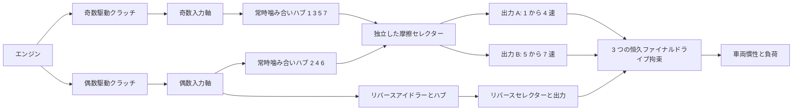

# 7 速デュアルクラッチの研究用動力経路

[English](DUAL_CLUTCH_TRANSMISSION.md) · [简体中文](DUAL_CLUTCH_TRANSMISSION.zh-CN.md) · [Français](DUAL_CLUTCH_TRANSMISSION.fr.md) · [Русский](DUAL_CLUTCH_TRANSMISSION.ru.md) · **日本語** · [한국어](DUAL_CLUTCH_TRANSMISSION.ko.md) · [Deutsch](DUAL_CLUTCH_TRANSMISSION.de.md) · [Español](DUAL_CLUTCH_TRANSMISSION.es.md) · [Italiano](DUAL_CLUTCH_TRANSMISSION.it.md) · [Português](DUAL_CLUTCH_TRANSMISSION.pt-BR.md)

`DualClutchTransmissionAssembly` は、7 つの前進経路とリバースを、通常のローター、恒久の理想歯車、制御されたクラッチへ落とします。2 本の入力軸が奇数段と偶数段を担います。リバースは偶数経路と明示的なアイドラーを使います。3 つの出力分岐は、同じ車両ローターへの独立した最終減速を持ちます。選ばれていないハブと、プリセレクトされた非アクティブな軸は、回転慣性を保ちます。

広い奇数/偶数/リバースの割り当てと多出力の構成は、[Volkswagen の 7 速 DSG の説明](https://www.volkswagen-newsroom.com/en/the-new-polo-international-driving-presentation-3102/the-new-polo-engines-and-transmissions-3118) と、その[トランスミッション工学の発表資料](https://uploads.vw-mms.de/system/production/files/vwn/003/768/file/e451eac3067123ff305d27a85f3e7eb73dd1ee6f/DSG_the_intelligent_automatic_gearbox_from_Volkswagen_2008_en.pdf?1530367024=) に支えられています。ここで与える実際の歯/トレインの配置、慣性、減速、容量は研究入力です。これはキャリブレーション済みの DQ200 でも、実測の車両挙動でもありません。完全な EA211/DQ200 の研究境界は `assets/samples` に残っています。

## トポロジーと符号



各前進の噛み合いは `omega_input = -r_gear * omega_hub` です。選ばれたハブは、その出力軸へロックします。各出力は `omega_output = -r_final * omega_vehicle` です。2 つのリバース噛み合いは、その出力/ファイナルドライブの前に向きを 2 回変えます。

```text
Forward effective reduction = r_gear r_final
Reverse effective reduction = -r_reverse r_reverse_final
omega_engine = effective_reduction omega_vehicle when its drive path is locked
```

前進 1–4 速は出力 A、5–7 速は出力 B、リバースは専用の出力を使います。この宣言されたグループ分けと独立したリバースアイドラーは研究トポロジーであり、あらゆる OEM の軸/歯の配置についての主張ではありません。3 つの出力はすべて、セレクターが非アクティブでも車両とともに回転します。

アセンブリは、内部ローター 14、恒久歯車拘束 12、クラッチ 10 を加えます。エンジン、車両、任意の熱シンクは外部ポートとして与えられます。スカラーの歯車比を実行時に置き換えることはありません。噛み合いコンプライアンス、バックラッシュ、潤滑/損失マップ、詳細なデファレンシャル幾何は、別の作業のままです。

## パラメーターと安定した束縛

7 つの正の前進噛み合い減速は、減少する有効前進減速を生まなければなりません。リバースと 3 つのファイナルドライブ減速は、与えられた正の値です。`DualClutchParameters` は明示的な SI の慣性と容量を要求します。

- 奇数/偶数入力、出力 A/B/リバース、ハブ、リバースアイドラーの慣性。単位は kg m2。
- 駆動クラッチとセレクターの静止/滑り容量。単位は Nm。静止は滑り以上。
- 各出力分岐の正のファイナルドライブ減速。

`DualClutchPorts` は、エンジン/車両/熱と、すべての内部軸、駆動クラッチ、ファイナル拘束、最初のリバース噛み合い、駆動指令を束縛します。8 つの `DualClutchGearIds` は、前進 1–7 とリバースのハブ、噛み合い、セレクター、入力チャンネルを束縛します。大域 ID とアクチュエーターチャンネルは別々で、非零でなければなりません。パラメーターと比の配列は不変のアセンブリデータへコピーされます。グラフのリストは不変レコードを公開します。

`CreateGraph` は、合成のための内部ノードと通常のコンポーネントを返します。軸/ハブの速度を、与えられた車両速度と初期の奇数/偶数の選択と整合するよう初期化します。コンパイラは引き続き、完全なモデル、外部ポート、容量、大域 ID、有界な状態/拘束の階数を検査します。

`SelectPath(gear, odd_path)` は、その経路に対するセレクター指令の原子的な集合を作り、他のセレクター指令を解放します。プリセレクトには無負荷の経路を使い、駆動クラッチのトルクは別に制御してください。この補助は速度を感知せず、変速アクチュエーターを制御せず、TCU のインターロックも実装しません。

## 同期とプリセレクト

セレクターは、有限容量の保存的な摩擦クラッチです。その滑りと捕捉は明示的な同期熱を生み、宣言された熱シンクまたは外部の排出熱へ送られます。詳細なドグ歯やボークリングのモデルではありません。プリセレクトされた経路は、ハブ/出力を通じてすでに車両と結合しているので、駆動クラッチが解放されていても、その入力と自由ハブの慣性が加速度に影響します。無負荷のセレクターを変えても、その軸と車両の間で力積/仕事が移ります。

独立した参照は、各入力経路を、その軸慣性に換算された自由ハブ/アイドラー慣性を加えたものへ縮約します。車両の有効慣性は、すべての出力軸と、プリセレクトされた非アクティブな入力を含みます。一定のエンジン/負荷トルクは、選ばれたすべての前進/リバース経路で、厳密な 1 自由度の加速度を与えます。別の 2 座標射影が、グラフソルバーとは独立に、プリセレクト捕捉の速度と失われた運動エネルギーを計算します。

不正な選択スケジュールは、2 つの経路を束縛したり、トランスミッションをブレーキしたりできます。Core の物理方程式は、それらの指令を黙って修復しません。完全なセンシング、アクチュエーター限界、トルク協調、ドグ/シンクロナイザー制御、故障処理は、必要な ECU/TCU の作業のままです。

## 相関のあるロック求解

完全な 6/7 経路は、引き継ぎにおいて、有界なスカラー拘束射影の失敗を露わにしました。歯車で換算されたロック応答は、強く相関し得ます。既存の射影が主ソルバーのままです。その反復予算を使い切ったあと、独立した線形ロックは、事前割り当てバッファ上の正規化された Schur 求解を使えます。静止容量の違反は、同じ有界なアクティブセットの論理を通じてロックを解放します。残差、容量、受動熱、バッチ全体の受理は検査されたままです。

このフォールバックは線形の機械経路に適用され、連成した気筒/油圧の非線形力は含みません。特異/冗長な場合と非線形経路は、既存の有界な挙動を保ちます。反復予算を増やしたり、失敗した拘束を成功したステップへ変えたりはしません。既存の軌跡/フィクスチャは回帰エビデンスのままで、以前失敗していた完全な引き継ぎは直接扱われます。

## 共有実験とエビデンス

`dual-clutch-transmission` は、発進、非アクティブなプリセレクト、7 つの前進比すべて、昇/降の引き継ぎ、トルク/負荷入力のもとでの同期熱を行使します。`fired-dual-clutch` は、既存の開放気筒/予混合燃焼と 1 から 2 から 3 への引き継ぎを加えつつ、完全な 7 前進/リバースのグラフを保ちます。燃焼モデルは現在の 64 状態の予算に収まります。詳細な供給/駆動の増分をすべて組み合わせたり、完全な車両/制御器の挙動をまだ組み合わせたりはしません。

JSON、CLI、MCP、移植可能アセット、用意された Studio 表示は、同じ通常の定義を使います。新しいコンポーネント種別、単位、アセット形式は不要です。明示的な歯車反力、クラッチのモード/滑り/熱、ローター速度、大域のエネルギー/源/燃料の台帳は発見可能なままです。完全なリプレイ、独立した参照、細分化、分岐、キャンセル、遅発のロールバック、割り当ての限界は [VALIDATION.ja.md](VALIDATION.ja.md) に記録されています。

パラメーターはすべて `unverified` のままです。規定されたスケジュールは完全な TCU ではありません。規定燃焼は完全なエンジンではありません。詳細なドライクラッチ/シンクロナイザーとアクチュエーターの物理、実測マップ、DQ200/AT8 のパワートレイン境界、実際の Unity、キャリブレーション済み車両の受理は未完了です。
