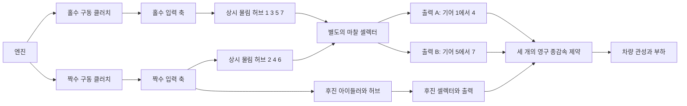

# 7단 듀얼 클러치 연구 동력 경로

[English](DUAL_CLUTCH_TRANSMISSION.md) · [简体中文](DUAL_CLUTCH_TRANSMISSION.zh-CN.md) · [Français](DUAL_CLUTCH_TRANSMISSION.fr.md) · [Русский](DUAL_CLUTCH_TRANSMISSION.ru.md) · [日本語](DUAL_CLUTCH_TRANSMISSION.ja.md) · **한국어** · [Deutsch](DUAL_CLUTCH_TRANSMISSION.de.md) · [Español](DUAL_CLUTCH_TRANSMISSION.es.md) · [Italiano](DUAL_CLUTCH_TRANSMISSION.it.md) · [Português](DUAL_CLUTCH_TRANSMISSION.pt-BR.md)

`DualClutchTransmissionAssembly`는 일곱 개의 전진 경로와 후진을 보통의 로터, 영구 이상 기어, 제어되는 클러치로 내립니다. 입력 축 두 개가 홀수 기어와 짝수 기어를 나르고, 후진은 짝수 경로와 명시적 아이들러를 씁니다. 출력 분기 세 개는 같은 차량 로터로 가는 독립 종감속을 갖습니다. 선택되지 않은 허브와 사전 선택된 비활성 축은 회전 관성을 유지합니다.

넓은 홀수/짝수/후진 배치와 다중 출력 구조는 [Volkswagen의 7단 DSG 설명](https://www.volkswagen-newsroom.com/en/the-new-polo-international-driving-presentation-3102/the-new-polo-engines-and-transmissions-3118)과 그 [변속기 엔지니어링 발표 자료](https://uploads.vw-mms.de/system/production/files/vwn/003/768/file/e451eac3067123ff305d27a85f3e7eb73dd1ee6f/DSG_the_intelligent_automatic_gearbox_from_Volkswagen_2008_en.pdf?1530367024=)가 뒷받침합니다. 여기에 공급된 실제 잇수/트레인 배치, 관성, 감속비, 용량은 연구 입력입니다. 이것은 교정된 DQ200도, 측정된 차량 거동도 아닙니다. 완전한 EA211/DQ200 연구 경계는 `assets/samples`에 남아 있습니다.

## 토폴로지와 부호



각 전진 물림은 `omega_input = -r_gear * omega_hub`입니다. 선택된 허브는 자신의 출력 축에 잠깁니다. 각 출력은 `omega_output = -r_final * omega_vehicle`입니다. 후진 물림 두 개는 출력/종감속 전에 방향을 두 번 바꿉니다.

```text
Forward effective reduction = r_gear r_final
Reverse effective reduction = -r_reverse r_reverse_final
omega_engine = effective_reduction omega_vehicle when its drive path is locked
```

전진 기어 1-4는 출력 A, 5-7은 출력 B, 후진은 자신의 출력을 씁니다. 이 선언된 묶음과 독립 후진 아이들러는 연구 토폴로지입니다. 모든 OEM 축/이 배치에 대한 주장이 아닙니다. 셀렉터가 비활성이어도 출력 세 개는 차량과 함께 회전합니다.

어셈블리는 내부 로터 열네 개, 영구 기어 제약 열두 개, 클러치 열 개를 더합니다. 엔진, 차량, 선택적 열 싱크는 외부 포트로 공급됩니다. 스칼라 기어 비를 실행 중에 바꾸지는 않습니다. 물림 컴플라이언스, 백래시, 윤활/손실 맵, 상세한 차동 형상은 별도 작업으로 남아 있습니다.

## 매개변수와 안정 바인딩

일곱 개의 양의 전진 물림 감속은 감소하는 유효 전진 감속을 만들어야 합니다. 후진과 세 종감속 감속비는 공급된 양수입니다. `DualClutchParameters`는 명시적 SI 관성량과 용량량을 요구합니다.

- 홀수/짝수 입력, 출력 A/B/후진, 허브, 후진 아이들러 관성. 단위는 kg m2입니다.
- 구동 클러치와 셀렉터의 정지/슬립 용량. 단위는 Nm이고, 정지는 슬립 이상입니다.
- 각 출력 분기의 양의 종감속 감속비.

`DualClutchPorts`는 엔진/차량/열과 모든 내부 축, 구동 클러치, 종감속 제약, 첫 후진 물림, 구동 명령을 묶습니다. 여덟 개의 `DualClutchGearIds`가 전진 1-7과 후진의 허브, 물림, 셀렉터, 입력 채널을 묶습니다. 전역 ID와 액추에이터 채널은 서로 다르고 0이 아니어야 합니다. 매개변수와 비 배열은 불변 어셈블리 데이터로 복사됩니다. 그래프 목록은 불변 레코드를 노출합니다.

`CreateGraph`는 합성을 위해 내부 노드와 보통 컴포넌트를 반환합니다. 공급된 차량 속도와 초기 홀수/짝수 선택에 맞게 축/허브 속도를 초기화합니다. 컴파일러는 여전히 완전한 모델, 외부 포트, 용량, 전역 ID, 유계 상태/제약 랭크를 검사합니다.

`SelectPath(gear, odd_path)`는 그 경로에 대한 셀렉터 명령의 원자적 집합을 만들고, 다른 셀렉터 명령은 해제합니다. 사전 선택에는 무부하 경로를 쓰고, 구동 클러치 토크는 따로 제어하세요. 이 도우미는 속도를 감지하지 않고, 변속 액추에이터를 제어하지 않으며, TCU 인터록을 구현하지도 않습니다.

## 동기화와 사전 선택

셀렉터는 유한 용량의 보존적 마찰 클러치입니다. 그 슬립과 포획은 명시적 동기화 열을 만들며, 선언된 열 싱크나 외부로 거부된 열로 갑니다. 상세한 도그 치나 보크 링 모델은 아닙니다. 사전 선택된 경로는 이미 허브/출력을 통해 차량에 결합되어 있으므로, 구동 클러치가 해제되어 있어도 그 입력 관성과 자유 허브 관성이 가속도에 영향을 줍니다. 무부하 셀렉터를 바꾸어도 그 축과 차량 사이에 임펄스/일이 전달됩니다.

독립 기준은 각 입력 경로를 축 관성에 반사된 자유 허브/아이들러 관성을 더한 값으로 줄입니다. 차량 유효 관성에는 모든 출력 축과, 사전 선택된 비활성 입력이 포함됩니다. 그러면 일정한 엔진/부하 토크는 선택된 모든 전진/후진 경로에서 정확한 1자유도 가속도를 줍니다. 별도의 2좌표 사영이 그래프 솔버와 독립적으로 사전 선택 포획 속도와 손실 운동 에너지를 계산합니다.

유효하지 않은 선택 스케줄은 경로 두 개를 묶거나 변속기를 제동할 수 있습니다. Core 물리 방정식은 그 명령을 조용히 고치지 않습니다. 완전한 감지, 액추에이터 한계, 토크 협조, 도그/싱크로나이저 제어, 결함 처리는 필요한 ECU/TCU 작업으로 남아 있습니다.

## 상관된 잠금 풀이

완전한 6/7 경로는 인계에서 유계 스칼라 제약 사영 실패를 드러냈습니다. 기어로 반사된 잠금 응답은 강하게 상관될 수 있습니다. 기존 사영이 주 솔버로 남습니다. 그 반복 예산이 소진된 뒤, 독립된 선형 잠금은 미리 할당된 버퍼에서 정규화된 슈어 풀이를 쓸 수 있습니다. 정지 용량 위반은 같은 유계 활성 집합 논리로 잠금을 풉니다. 잔차, 용량, 수동 열, 배치 전체의 수용은 계속 검사됩니다.

이 폴백은 결합된 실린더/유압 비선형 힘이 없는 선형 기계 경로에 적용됩니다. 특이/중복 경우와 비선형 경로는 기존의 유계 동작을 유지합니다. 반복 예산을 늘리거나, 실패한 제약을 성공한 단계로 바꾸지는 않습니다. 기존 궤적/픽스처는 회귀 증거로 남고, 이전에 실패하던 완전한 인계는 직접 다뤄집니다.

## 공유 실험과 증거

`dual-clutch-transmission`은 출발, 비활성 사전 선택, 일곱 전진 비 전부, 상/하단 인계, 토크/부하 입력 아래의 동기화 열을 다룹니다. `fired-dual-clutch`는 기존의 개방 실린더/예혼합 연소와 1에서 2, 2에서 3으로의 인계를 더하면서, 완전한 7단 전진/후진 그래프를 유지합니다. 점화 모델은 현재 64 상태 예산에 맞습니다. 아직 상세한 공급/구동 증분을 모두 결합하거나 완전한 차량/제어기 거동을 갖추지는 않습니다.

JSON, CLI, MCP, 이식 가능한 자산, 준비된 Studio 보기는 같은 보통 정의를 씁니다. 새로운 컴포넌트 종류, 단위, 자산 형식은 필요하지 않습니다. 명시적 기어 반력, 클러치 모드/슬립/열, 로터 속도, 전역 에너지/소스/연료 장부는 계속 탐색할 수 있습니다. 전체 리플레이, 독립 기준, 세밀화, 분기, 취소, 늦은 롤백, 할당 한계는 [VALIDATION.ko.md](VALIDATION.ko.md)에 기록되어 있습니다.

모든 매개변수는 `unverified`로 남습니다. 예정된 스케줄은 완전한 TCU가 아니고, 예정된 연소는 완전한 엔진이 아닙니다. 상세한 드라이 클러치/싱크로나이저와 액추에이터 물리, 측정 맵, DQ200/AT8 파워트레인 경계, 실제 Unity, 그리고 교정된 차량으로의 수용은 아직 끝나지 않았습니다.
