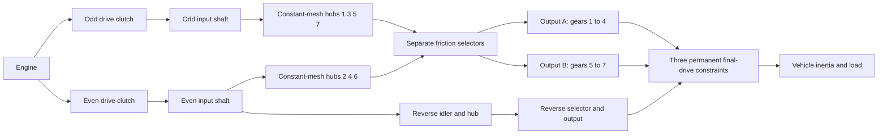

# Seven-speed dual-clutch research power path

`DualClutchTransmissionAssembly` lowers seven forward paths and reverse into
ordinary rotors, permanent ideal gears and controlled clutches. Two input shafts
carry odd and even gears; reverse uses the even path and an explicit idler.
Three output branches have independent final reductions to the same vehicle rotor.
Unselected hubs and preselected inactive shafts retain their spinning inertia.

The broad odd/even/reverse allocation and multi-output architecture are supported
by [Volkswagen's seven-speed DSG description](https://www.volkswagen-newsroom.com/en/the-new-polo-international-driving-presentation-3102/the-new-polo-engines-and-transmissions-3118)
and its [transmission engineering presentation](https://uploads.vw-mms.de/system/production/files/vwn/003/768/file/e451eac3067123ff305d27a85f3e7eb73dd1ee6f/DSG_the_intelligent_automatic_gearbox_from_Volkswagen_2008_en.pdf?1530367024=).
The actual tooth/train arrangement, inertias, reductions and capacities supplied
here are research inputs. This isn't calibrated DQ200 or measured vehicle behavior.
The complete EA211/DQ200 research boundary remains in `assets/samples`.

## Topology and signs



Each forward mesh has `omega_input = -r_gear * omega_hub`. A selected hub locks
to its output shaft. Each output has `omega_output = -r_final * omega_vehicle`.
The two reverse meshes change direction twice before its output/final drive:

```text
Forward effective reduction = r_gear r_final
Reverse effective reduction = -r_reverse r_reverse_final
omega_engine = effective_reduction omega_vehicle when its drive path is locked
```

Forward gears 1-4 use output A, 5-7 output B, and reverse its own output. This
declared grouping and independent reverse idler are a research topology, not a
claim about every OEM shaft/tooth arrangement. All three outputs rotate with
the vehicle even when their selectors are inactive.

The assembly adds fourteen internal rotors, twelve permanent gear constraints
and ten clutches. Engine, vehicle and optional thermal sink are supplied as
external ports. There is no runtime replacement of a scalar gear ratio. Mesh
compliance, backlash, lubrication/loss maps and detailed differential geometry
remain separate work.

## Parameters and stable bindings

Seven positive forward mesh reductions must produce decreasing effective forward
reductions. Reverse and three final-drive reductions are positive supplied values.
`DualClutchParameters` requires explicit SI inertia and capacity quantities:

- Odd/even input, output A/B/reverse, hub and reverse-idler inertias in kg m2.
- Drive-clutch and selector static/sliding capacities in Nm; static is at least sliding.
- Positive final-drive reductions for each output branch.

`DualClutchPorts` binds engine/vehicle/heat and every internal shaft, drive clutch,
final constraint, first reverse mesh and drive command. Eight `DualClutchGearIds`
bind forward 1-7 plus reverse hub, mesh, selector and input channel. Global IDs and
actuator channels must be distinct and nonzero. Parameters and ratio arrays are
copied into immutable assembly data; graph lists expose immutable records.

`CreateGraph` returns internal nodes and ordinary components for composition.
It initializes shaft/hub speeds consistently with supplied vehicle speed and
initial odd/even selections. The compiler still checks the complete model,
external ports, capacities, global IDs and bounded state/constraint rank.

`SelectPath(gear, odd_path)` produces an atomic set of selector commands for that
path, releasing the other selector commands. Use the unloaded path for preselection
and control drive-clutch torque separately. This helper doesn't sense speed,
control a shift actuator or implement TCU interlocks.

## Synchronization and preselection

Selectors are finite-capacity conserving friction clutches. Their slip and capture
produce explicit synchronization heat, routed to the declared thermal sink or
external rejected heat. They aren't a detailed dog tooth or baulk-ring model.
A preselected path is already coupled to the vehicle through its hub/output,
so its input and free-hub inertias affect acceleration despite its drive clutch
being disengaged. Changing an unloaded selector still transfers impulse/work
between that shaft and the vehicle.

Independent references reduce each input path to its shaft inertia plus the
reflected free-hub/idler inertias. Vehicle effective inertia includes all output
shafts and any preselected inactive input. Constant engine/load torque then gives
an exact one-degree-of-freedom acceleration in every selected forward/reverse
path. A separate two-coordinate projection computes preselection capture speeds
and lost kinetic energy independently of the graph solver.

Invalid selection schedules can bind two paths or brake the transmission. Core
physical equations don't silently repair those commands. Full sensing, actuator
limits, torque coordination, dog/synchronizer control and fault handling remain
required ECU/TCU work.

## Correlated lock solve

The full six/seven path exposed a bounded scalar constraint-projection failure
at a handoff. Gear-reflected lock responses can be strongly correlated. Existing
projection remains the primary solver; after its iteration budget is exhausted,
independent linear locks can use a normalized Schur solve in preallocated buffers.
Static-capacity violations release locks through the same bounded active-set logic.
Residuals, capacities, passive heat and whole-batch acceptance remain checked.

This fallback applies to the linear mechanical path, without coupled cylinder/
hydraulic nonlinear forces. Singular/redundant cases and nonlinear paths retain
their existing bounded behavior. It doesn't increase iteration budgets or turn
failed constraints into successful steps. Existing trajectories/fixtures remain
regression evidence, and the previously failing full handoff is covered directly.

## Shared experiments and evidence

`dual-clutch-transmission` exercises launch, inactive preselection, all seven
forward ratios, up/down handoffs and synchronized heat under torque/load inputs.
`fired-dual-clutch` adds the existing open-cylinder/premixed burn and 1-to-2-to-3
handoff while keeping the full seven-forward/reverse graph. The fired model fits
the current 64-state budget; it doesn't yet combine all detailed supply/actuation
increments or complete vehicle/controller behavior.

JSON, CLI, MCP, portable assets and prepared Studio views use the same ordinary
definitions. No new component kind, unit or asset format is needed. Explicit gear
reactions, clutch modes/slips/heat, rotor speeds and global energy/source/fuel
ledgers remain discoverable. Full replay, independent references, refinement,
forks, cancellation, late rollback and allocation bounds are recorded in
[VALIDATION.md](VALIDATION.md).

All parameters remain `unverified`. Prescribed schedules aren't complete TCU;
prescribed burn isn't a complete engine. Detailed dry-clutch/synchronizer and
actuator physics, measured maps, DQ200/AT8 powertrain boundaries, actual Unity
and calibrated vehicle acceptance remain unfinished.
