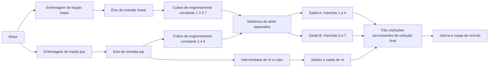

# Caminho de potência de pesquisa da embreagem dupla de sete marchas

[English](DUAL_CLUTCH_TRANSMISSION.md) · [简体中文](DUAL_CLUTCH_TRANSMISSION.zh-CN.md) · [Français](DUAL_CLUTCH_TRANSMISSION.fr.md) · [Русский](DUAL_CLUTCH_TRANSMISSION.ru.md) · [日本語](DUAL_CLUTCH_TRANSMISSION.ja.md) · [한국어](DUAL_CLUTCH_TRANSMISSION.ko.md) · [Deutsch](DUAL_CLUTCH_TRANSMISSION.de.md) · [Español](DUAL_CLUTCH_TRANSMISSION.es.md) · [Italiano](DUAL_CLUTCH_TRANSMISSION.it.md) · **Português**

`DualClutchTransmissionAssembly` reduz sete caminhos à frente e a ré a rotores ordinários, engrenagens ideais permanentes e embreagens controladas. Dois eixos de entrada carregam as marchas ímpares e pares; a ré usa o caminho par e uma intermediária explícita. Três ramos de saída têm reduções finais independentes até o mesmo rotor do veículo. Cubos não selecionados e eixos inativos pré-selecionados conservam a inércia em rotação.

A alocação ampla ímpar/par/ré e a arquitetura de várias saídas têm apoio na [descrição DSG de sete marchas da Volkswagen](https://www.volkswagen-newsroom.com/en/the-new-polo-international-driving-presentation-3102/the-new-polo-engines-and-transmissions-3118) e na [apresentação de engenharia da transmissão](https://uploads.vw-mms.de/system/production/files/vwn/003/768/file/e451eac3067123ff305d27a85f3e7eb73dd1ee6f/DSG_the_intelligent_automatic_gearbox_from_Volkswagen_2008_en.pdf?1530367024=). O arranjo real de dentes/trem, as inércias, as reduções e as capacidades fornecidas aqui são entradas de pesquisa. Isto não é um DQ200 calibrado nem comportamento medido de veículo. O limite completo de pesquisa EA211/DQ200 permanece em `assets/samples`.

## Topologia e sinais



Cada engrenamento à frente tem `omega_input = -r_gear * omega_hub`. Um cubo selecionado trava no eixo de saída. Cada saída tem `omega_output = -r_final * omega_vehicle`. Os dois engrenamentos de ré mudam o sentido duas vezes antes da saída e da redução final:

```text
Forward effective reduction = r_gear r_final
Reverse effective reduction = -r_reverse r_reverse_final
omega_engine = effective_reduction omega_vehicle when its drive path is locked
```

As marchas à frente 1-4 usam a saída A, as 5-7 a saída B, e a ré a própria saída. Esse agrupamento declarado e a intermediária de ré independente são uma topologia de pesquisa, não uma afirmação sobre cada arranjo OEM de eixos e dentes. As três saídas giram com o veículo mesmo quando os seletores estão inativos.

O conjunto acrescenta quatorze rotores internos, doze restrições permanentes de engrenagem e dez embreagens. Motor, veículo e sumidouro térmico opcional são fornecidos como portas externas. Não há substituição em tempo de execução de uma relação escalar de engrenagem. Flexibilidade de engrenamento, folga de engrenamento, mapas de lubrificação/perdas e geometria detalhada do diferencial continuam trabalho separado.

## Parâmetros e ligações estáveis

Sete reduções positivas de engrenamento à frente precisam produzir reduções efetivas à frente decrescentes. A ré e as três reduções finais são valores positivos fornecidos. `DualClutchParameters` exige quantidades explícitas de inércia e de capacidade no SI:

- Inércias de entrada ímpar/par, saída A/B/ré, cubo e intermediária de ré, em kg m2.
- Capacidades estática/de deslizamento das embreagens de tração e dos seletores, em Nm; a estática é pelo menos a de deslizamento.
- Reduções finais positivas para cada ramo de saída.

`DualClutchPorts` liga motor/veículo/calor e cada eixo interno, embreagem de tração, restrição final, primeiro engrenamento de ré e comando de tração. Oito `DualClutchGearIds` ligam as marchas 1-7 à frente mais cubo, engrenamento, seletor e canal de entrada da ré. IDs globais e canais de atuador precisam ser distintos e diferentes de zero. Parâmetros e arranjos de relação são copiados para dados imutáveis do conjunto; as listas do grafo expõem registros imutáveis.

`CreateGraph` devolve nós internos e componentes ordinários para composição. Inicializa as velocidades de eixo/cubo de forma consistente com a velocidade fornecida do veículo e as seleções iniciais ímpar/par. O compilador ainda confere o modelo completo, as portas externas, as capacidades, os IDs globais e o posto limitado de estado/restrição.

`SelectPath(gear, odd_path)` produz um conjunto atômico de comandos de seletor para esse caminho, liberando os outros comandos de seletor. Use o caminho descarregado para a pré-seleção e controle o torque da embreagem de tração separadamente. Esse auxiliar não sente velocidade, não controla um atuador de troca nem implementa intertravamentos de TCU.

## Sincronização e pré-seleção

Os seletores são embreagens de atrito de capacidade finita e conservativas. O deslizamento e a captura produzem calor explícito de sincronização, encaminhado ao sumidouro térmico declarado ou ao calor rejeitado externo. Não são um modelo detalhado de dente de engate nem de anel de bloqueio. Um caminho pré-selecionado já está acoplado ao veículo pelo cubo/saída, então as inércias de entrada e de cubo livre afetam a aceleração mesmo com a embreagem de tração desengatada. Mudar um seletor descarregado ainda transfere impulso/trabalho entre esse eixo e o veículo.

Referências independentes reduzem cada caminho de entrada à inércia do eixo mais as inércias refletidas de cubo livre/intermediária. A inércia efetiva do veículo inclui todos os eixos de saída e qualquer entrada inativa pré-selecionada. Torque constante de motor/carga dá então uma aceleração exata de um grau de liberdade em cada caminho selecionado à frente/ré. Uma projeção separada de duas coordenadas calcula velocidades de captura da pré-seleção e energia cinética perdida, independentemente do solver de grafo.

Cronogramas de seleção inválidos podem ligar dois caminhos ou frear a transmissão. As equações físicas do Core não reparam esses comandos em silêncio. Sensoriamento completo, limites de atuador, coordenação de torque, controle de garra/sincronizador e tratamento de falhas continuam trabalho obrigatório de ECU/TCU.

## Solução de travamento correlacionado

O caminho completo de seis/sete marchas expôs uma falha limitada de projeção escalar de restrição numa entrega. Respostas de travamento refletidas pela engrenagem podem ser fortemente correlacionadas. A projeção existente continua sendo o solver primário; depois de esgotado o orçamento de iterações, travamentos lineares independentes podem usar uma solução de Schur normalizada em buffers pré-alocados. Violações de capacidade estática liberam os travamentos pela mesma lógica limitada de conjunto ativo. Resíduos, capacidades, calor passivo e aceitação do lote inteiro continuam conferidos.

Esse recurso de reserva vale para o caminho mecânico linear, sem forças não lineares acopladas de cilindro/hidráulica. Casos singulares/redundantes e caminhos não lineares conservam o comportamento limitado existente. Ele não aumenta orçamentos de iteração nem transforma restrições falhas em passos bem-sucedidos. Trajetórias e fixtures existentes continuam evidência de regressão, e a entrega completa que falhava antes é coberta diretamente.

## Experimentos compartilhados e evidência

`dual-clutch-transmission` exercita largada, pré-seleção inativa, as sete relações à frente, entregas subindo/descendo e calor de sincronização sob entradas de torque/carga. `fired-dual-clutch` acrescenta a queima premisturada de cilindro aberto existente e a entrega 1-para-2-para-3, mantendo o grafo completo de sete marchas à frente/ré. O modelo em combustão cabe no orçamento atual de 64 estados; ainda não combina todos os incrementos detalhados de alimentação/acionamento nem o comportamento completo de veículo/controlador.

JSON, CLI, MCP, assets portáteis e vistas de Studio preparadas usam as mesmas definições ordinárias. Não é preciso um novo tipo de componente, unidade nem formato de asset. Reações explícitas de engrenagem, modos/deslizamentos/calor de embreagem, velocidades de rotor e livros globais de energia/fonte/combustível continuam descobríveis. Replay completo, referências independentes, refinamento, ramificações, cancelamento, rollback tardio e limites de alocação estão registrados em [VALIDATION.pt-BR.md](VALIDATION.pt-BR.md).

Todos os parâmetros permanecem `unverified`. Cronogramas prescritos não são uma TCU completa; queima prescrita não é um motor completo. Física detalhada de embreagem a seco/sincronizador e de atuador, mapas medidos, limites de powertrain DQ200/AT8, Unity real e aceitação de veículo calibrado continuam inacabados.
