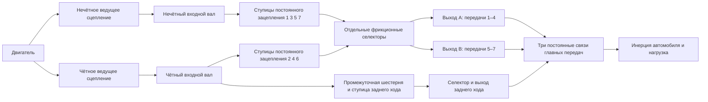

# Исследовательская силовая цепь семиступенчатой трансмиссии с двумя сцеплениями

[English](DUAL_CLUTCH_TRANSMISSION.md) · [简体中文](DUAL_CLUTCH_TRANSMISSION.zh-CN.md) · [Français](DUAL_CLUTCH_TRANSMISSION.fr.md) · **Русский** · [日本語](DUAL_CLUTCH_TRANSMISSION.ja.md) · [한국어](DUAL_CLUTCH_TRANSMISSION.ko.md) · [Deutsch](DUAL_CLUTCH_TRANSMISSION.de.md) · [Español](DUAL_CLUTCH_TRANSMISSION.es.md) · [Italiano](DUAL_CLUTCH_TRANSMISSION.it.md) · [Português](DUAL_CLUTCH_TRANSMISSION.pt-BR.md)

`DualClutchTransmissionAssembly` разворачивает семь передних путей и задний ход в обычные роторы, постоянные идеальные шестерни и управляемые сцепления. Два входных вала несут нечётные и чётные передачи; задний ход использует чётный путь и явную промежуточную шестерню. Три выходные ветви имеют независимые главные понижения к одному и тому же ротору автомобиля. Невыбранные ступицы и предварительно выбранные неактивные валы сохраняют свою вращающуюся инерцию.

Широкое распределение нечётных, чётных передач и заднего хода и многовыходная архитектура поддержаны [описанием семиступенчатой DSG Volkswagen](https://www.volkswagen-newsroom.com/en/the-new-polo-international-driving-presentation-3102/the-new-polo-engines-and-transmissions-3118) и его [инженерной презентацией трансмиссии](https://uploads.vw-mms.de/system/production/files/vwn/003/768/file/e451eac3067123ff305d27a85f3e7eb73dd1ee6f/DSG_the_intelligent_automatic_gearbox_from_Volkswagen_2008_en.pdf?1530367024=). Фактическое расположение зубьев и цепи, инерции, понижения и ёмкости, заданные здесь, — исследовательские входы. Это не калиброванная DQ200 и не измеренное поведение автомобиля. Полная исследовательская граница EA211/DQ200 остаётся в `assets/samples`.

## Топология и знаки



У каждого переднего зацепления `omega_input = -r_gear * omega_hub`. Выбранная ступица блокируется со своим выходным валом. У каждого выхода `omega_output = -r_final * omega_vehicle`. Два зацепления заднего хода дважды меняют направление до его выхода и главной передачи:

```text
Forward effective reduction = r_gear r_final
Reverse effective reduction = -r_reverse r_reverse_final
omega_engine = effective_reduction omega_vehicle when its drive path is locked
```

Передние передачи 1–4 используют выход A, 5–7 — выход B, а задний ход — свой выход. Это объявленное группирование и независимая промежуточная шестерня заднего хода — исследовательская топология, а не утверждение о каждом расположении валов и зубьев OEM. Все три выхода вращаются вместе с автомобилем, даже когда их селекторы неактивны.

Сборка добавляет четырнадцать внутренних роторов, двенадцать постоянных зубчатых связей и десять сцеплений. Двигатель, автомобиль и необязательный тепловой сток задаются как внешние порты. Замены скалярного передаточного отношения во время выполнения нет. Податливость зацепления, боковой зазор, карты смазки и потерь и подробная геометрия дифференциала остаются отдельной работой.

## Параметры и устойчивые привязки

Семь положительных понижений переднего зацепления должны давать убывающие эффективные передние понижения. Задний ход и три понижения главных передач — положительные заданные значения. `DualClutchParameters` требует явных величин инерции и ёмкости в СИ:

- Инерции нечётного и чётного входа, выходов A, B и заднего хода, ступицы и промежуточной шестерни заднего хода в kg m2.
- Статические и скользящие ёмкости ведущих сцеплений и селекторов в Nm; статическая не меньше скользящей.
- Положительные понижения главных передач для каждой выходной ветви.

`DualClutchPorts` связывает двигатель, автомобиль, теплоту и каждый внутренний вал, ведущее сцепление, связь главной передачи, первое зацепление заднего хода и команду привода. Восемь `DualClutchGearIds` связывают передние 1–7 плюс ступицу, зацепление, селектор и входной канал заднего хода. Глобальные ID и каналы исполнительных механизмов должны быть различны и ненулевые. Параметры и массивы отношений копируются в неизменяемые данные сборки; списки графа предоставляют неизменяемые записи.

`CreateGraph` возвращает внутренние узлы и обычные компоненты для композиции. Он инициализирует скорости валов и ступиц согласованно с заданной скоростью автомобиля и начальным выбором нечётного и чётного путей. Компилятор по-прежнему проверяет полную модель, внешние порты, ёмкости, глобальные ID и ограниченный ранг состояния и связей.

`SelectPath(gear, odd_path)` создаёт атомарный набор команд селекторов для этого пути, отпуская остальные команды селекторов. Используйте разгруженный путь для предвыбора и управляйте моментом ведущего сцепления отдельно. Этот помощник не измеряет скорость, не управляет исполнительным механизмом переключения и не реализует взаимоблокировки TCU.

## Синхронизация и предвыбор

Селекторы — сохраняющие фрикционные сцепления конечной ёмкости. Их проскальзывание и захват дают явную теплоту синхронизации, направляемую в объявленный тепловой сток или во внешнюю отведённую теплоту. Это не подробная модель зубьев кулачковой муфты или блокирующего кольца. Предварительно выбранный путь уже связан с автомобилем через свою ступицу и выход, поэтому инерции его входа и свободных ступиц влияют на ускорение, хотя его ведущее сцепление разомкнуто. Смена разгруженного селектора всё равно передаёт импульс и работу между этим валом и автомобилем.

Независимые эталоны сводят каждый входной путь к инерции его вала плюс приведённые инерции свободных ступиц и промежуточной шестерни. Эффективная инерция автомобиля включает все выходные валы и любой предварительно выбранный неактивный вход. Постоянные моменты двигателя и нагрузки тогда дают точное ускорение с одной степенью свободы на каждом выбранном переднем пути и пути заднего хода. Отдельная проекция двух координат независимо от решателя графа вычисляет скорости захвата предвыбора и потерянную кинетическую энергию.

Недопустимые расписания выбора могут связать два пути или затормозить трансмиссию. Физические уравнения Core не чинят эти команды молча. Полное измерение, пределы исполнительных механизмов, согласование момента, управление кулачковой муфтой и синхронизатором и обработка неисправностей остаются необходимой работой ECU/TCU.

## Решение коррелированных блокировок

Полный путь из шести и семи передач обнаружил ограниченный отказ скалярной проекции связей при передаче тяги. Отклики блокировки, приведённые через шестерни, могут быть сильно коррелированы. Существующая проекция остаётся основным решателем; после исчерпания её бюджета итераций независимые линейные блокировки могут использовать нормированное решение Шура в заранее выделенных буферах. Нарушения статической ёмкости отпускают блокировки через ту же ограниченную логику активного множества. Остатки, ёмкости, пассивная теплота и принятие всего пакета по-прежнему проверяются.

Этот запасной путь применяется к линейной механической цепи, без связанных нелинейных сил цилиндра и гидравлики. Сингулярные и избыточные случаи и нелинейные пути сохраняют своё существующее ограниченное поведение. Он не увеличивает бюджеты итераций и не превращает неудачные связи в успешные шаги. Существующие траектории и фикстуры остаются регрессионными свидетельствами, и ранее неудачная полная передача тяги покрыта напрямую.

## Общие эксперименты и свидетельства

`dual-clutch-transmission` проверяет трогание, неактивный предвыбор, все семь передних отношений, передачи тяги вверх и вниз и теплоту синхронизации при входах момента и нагрузки. `fired-dual-clutch` добавляет существующие открытый цилиндр и предварительно смешанное сгорание и передачу 1-на-2-на-3, сохраняя полный граф семи передних передач и заднего хода. Модель со сгоранием умещается в текущий бюджет 64 состояний; она ещё не сочетает все подробные приращения питания и привода или полное поведение автомобиля и контроллера.

JSON, CLI, MCP, переносимые активы и подготовленные виды Studio используют те же обычные определения. Новый вид компонента, единица или формат актива не нужны. Явные реакции шестерён, режимы, проскальзывания и теплота сцеплений, скорости роторов и глобальные журналы энергии, источников и топлива остаются обнаруживаемыми. Полный повтор, независимые эталоны, уточнение, ветки, отмена, поздний откат и границы выделений записаны в [VALIDATION.ru.md](VALIDATION.ru.md).

Все параметры остаются `unverified`. Предписанные расписания — не полный TCU; предписанное сгорание — не полный двигатель. Подробная физика сухого сцепления и синхронизатора и привода, измеренные карты, границы силовых агрегатов DQ200/AT8, фактический Unity и приёмка калиброванного автомобиля остаются незавершёнными.
