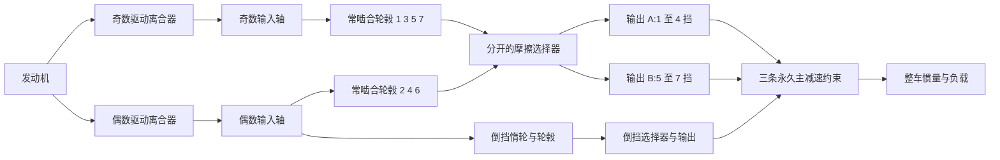

# 七速双离合研究动力路径

[English](DUAL_CLUTCH_TRANSMISSION.md) · **简体中文** · [Français](DUAL_CLUTCH_TRANSMISSION.fr.md) · [Русский](DUAL_CLUTCH_TRANSMISSION.ru.md) · [日本語](DUAL_CLUTCH_TRANSMISSION.ja.md) · [한국어](DUAL_CLUTCH_TRANSMISSION.ko.md) · [Deutsch](DUAL_CLUTCH_TRANSMISSION.de.md) · [Español](DUAL_CLUTCH_TRANSMISSION.es.md) · [Italiano](DUAL_CLUTCH_TRANSMISSION.it.md) · [Português](DUAL_CLUTCH_TRANSMISSION.pt-BR.md)

`DualClutchTransmissionAssembly` 把七条前进路径和倒挡降成普通转子、永久理想齿轮和受控离合器。两根输入轴分别承载奇数挡与偶数挡;倒挡使用偶数路径和显式惰轮。三个输出分支以独立的主减速接到同一个整车转子。未选中的轮毂和已预选但未驱动的轴保留其旋转惯量。

宽泛的奇/偶/倒挡分配和多输出架构有 [大众的七速 DSG 说明](https://www.volkswagen-newsroom.com/en/the-new-polo-international-driving-presentation-3102/the-new-polo-engines-and-transmissions-3118)及其[变速器工程演示](https://uploads.vw-mms.de/system/production/files/vwn/003/768/file/e451eac3067123ff305d27a85f3e7eb73dd1ee6f/DSG_the_intelligent_automatic_gearbox_from_Volkswagen_2008_en.pdf?1530367024=)支持。这里给出的实际齿数/轮系布置、惯量、减速比和容量是研究输入。这不是标定的 DQ200,也不是实测车辆行为。完整的 EA211/DQ200 研究边界仍在 `assets/samples`。

## 拓扑与符号



每个前进啮合有 `omega_input = -r_gear * omega_hub`。被选中的轮毂锁到其输出轴。每个输出有 `omega_output = -r_final * omega_vehicle`。两级倒挡啮合在其输出/主减速之前改变方向两次:

```text
Forward effective reduction = r_gear r_final
Reverse effective reduction = -r_reverse r_reverse_final
omega_engine = effective_reduction omega_vehicle when its drive path is locked
```

前进挡 1–4 使用输出 A,5–7 使用输出 B,倒挡使用自己的输出。这一声明的分组和独立倒挡惰轮是研究拓扑,不是对每一种 OEM 轴/齿布置的声称。即使选择器未作用,三个输出也随整车一起转动。

该装配增加十四个内部转子、十二条永久齿轮约束和十个离合器。发动机、整车和可选热汇作为外部端口提供。没有在运行时替换标量齿轮速比。啮合柔性、齿隙、润滑/损失图谱和详细的差速器几何仍是分开的工作。

## 参数与稳定绑定

七个正的前进啮合减速比必须产生递减的有效前进减速比。倒挡和三个主减速比是给出的正值。`DualClutchParameters` 要求显式的 SI 惯量与容量:

- 奇/偶输入、输出 A/B/倒挡、轮毂和倒挡惰轮惯量,单位 kg m2。
- 驱动离合器和选择器的静态/滑摩容量,单位 Nm;静态至少等于滑摩。
- 每个输出分支的正主减速比。

`DualClutchPorts` 绑定发动机/整车/热,以及每根内部轴、驱动离合器、主减速约束、第一级倒挡啮合和驱动指令。八个 `DualClutchGearIds` 绑定前进 1–7 以及倒挡的轮毂、啮合、选择器和输入通道。全局 ID 与执行器通道必须互异且非零。参数和速比数组被复制进不可变装配数据;图列表暴露不可变记录。

`CreateGraph` 返回供组合使用的内部节点和普通组件。它按所给整车速度和初始奇/偶选择,一致地初始化轴/轮毂速度。编译器仍然检查完整模型、外部端口、容量、全局 ID 以及有界的状态/约束秩。

`SelectPath(gear, odd_path)` 为该路径产生一组原子的选择器指令,并释放其他选择器指令。预选使用未加载路径,并分开控制驱动离合器扭矩。这个辅助函数不感知速度,不控制换挡执行器,也不实现 TCU 互锁。

## 同步与预选

选择器是有限容量的守恒摩擦离合器。它们的滑差和捕获产生显式同步热,送到声明的热汇或外部排热。它们不是详细的接合齿或锁环模型。已预选的路径已经通过其轮毂/输出与整车耦合,因此即使其驱动离合器分离,其输入和自由轮毂惯量仍影响加速度。改变未加载的选择器仍会在该轴与整车之间传递冲量/功。

独立参考把每条输入路径降成其轴惯量加上折算的自由轮毂/惰轮惯量。整车有效惯量包含全部输出轴和任何已预选的未驱动输入。恒定的发动机/负载扭矩于是在每条被选中的前进/倒挡路径上给出精确的单自由度加速度。分开的两坐标投影独立于图求解器计算预选捕获速度和损失动能。

无效的选择时序可能同时接合两条路径,或把变速器制动住。Core 物理方程不会悄悄修复这些指令。完整的传感、执行器限制、扭矩协调、接合齿/同步器控制以及故障处理仍是必需的 ECU/TCU 工作。

## 相关锁止求解

完整的六/七路径在一次交接中暴露了有界标量约束投影的失败。经齿轮折算的锁止响应可能强相关。现有投影仍是主求解器;其迭代预算耗尽后,独立的线性锁止可以在预分配缓冲区中使用归一化 Schur 求解。静态容量越界通过同一套有界活动集逻辑释放锁止。残差、容量、被动热量和整批接受仍然受检查。

这一回退适用于线性机械路径,不含耦合的气缸/液压非线性力。奇异/冗余情形与非线性路径保留原有的有界行为。它不提高迭代预算,也不把失败的约束变成成功的步进。现有轨迹/夹具仍是回归证据,先前失败的完整交接被直接覆盖。

## 共享实验与证据

`dual-clutch-transmission` 在扭矩/负载输入下检验起步、未驱动预选、全部七个前进速比、升/降挡交接和同步热。`fired-dual-clutch` 加入现有的开放气缸/预混燃烧和 1 到 2 到 3 的交接,同时保留完整的七前进/倒挡图。点火模型适合当前的 64 状态预算;它还没有组合全部详细的供给/驱动增量,也没有完整的车辆/控制器行为。

JSON、CLI、MCP、可移植资产和已准备的 Studio 视图使用同一套普通定义。不需要新的组件种类、单位或资产格式。显式齿轮反作用、离合器模式/滑差/热、转子速度以及全局能量/源/燃油账本仍然可发现。完整回放、独立参考、细化、分支、取消、延迟回滚和分配界限记录在 [VALIDATION.md](VALIDATION.zh-CN.md)。

全部参数仍为 `unverified`。给定时序不是完整 TCU;给定燃烧不是完整发动机。详细的干式离合器/同步器和执行器物理、实测图谱、DQ200/AT8 动力总成边界、实际 Unity 以及标定车辆验收仍未完成。
