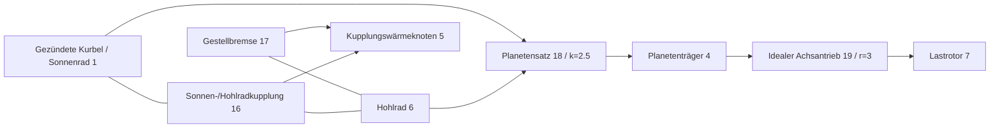

# Gekoppelte ideale Zahnräder und Planetenbindungen

[English](GEAR_NETWORK.md) · [简体中文](GEAR_NETWORK.zh-CN.md) · [Français](GEAR_NETWORK.fr.md) · [Русский](GEAR_NETWORK.ru.md) · [日本語](GEAR_NETWORK.ja.md) · [한국어](GEAR_NETWORK.ko.md) · **Deutsch** · [Español](GEAR_NETWORK.es.md) · [Italiano](GEAR_NETWORK.it.md) · [Português](GEAR_NETWORK.pt-BR.md)

`ideal_gear` und `planetary_gear` sind dauerhafte verlustfreie Bindungen in derselben Core-Lösung wie Wellen, RL-Motoren, Zylinder und geregelte Kupplungen. JSON, CLI/MCP und das portable Asset v10 tragen dieselben Definitionen. Die unabhängigen [Konstantlastreferenzen](IDEAL_GEARS.de.md) bleiben Prüforakel. Alle aktuellen Forschungsparameter sind `unverified`.

## Topologie und Vorzeichen

`ComponentDefinition.IdealGear(id, a, b, ratio)` verbindet verschiedene Drehknoten und verlangt eine endliche, von null verschiedene, vorzeichenbehaftete Übersetzung. `ComponentDefinition.PlanetaryGear(id, sun, ring, carrier, ringToSunTeethRatio)` verlangt drei verschiedene Drehknoten und ein endliches Zähneverhältnis Hohlrad/Sonnenrad größer als eins. JSON nutzt `node_a`, `node_b`, `node_c` für Sonnenrad, Hohlrad und Planetenträger; `node_c` gilt nur für den Planetensatz. Jeder angebundene Rotor behält seine ausdrückliche positive Trägheit. Das Gestell wird nicht aus einem fehlenden Zahnradanschluss abgeleitet; eine ausdrückliche Gestellbremse verwenden, wenn ein Planetenglied festgehalten werden muss.

```text
Ideal pair: omega_A - r omega_B = 0
Reactions on rotors: [lambda, -r lambda]

Planetary: omega_S + k omega_R - (1+k) omega_C = 0
Reactions on rotors: [lambda, k lambda, -(1+k) lambda]
```

Diese Beziehungen geben die kombinierte Reaktionsleistung null. Verzahnungsträgheit, Nachgiebigkeit, Spiel, Verluste und Wärme fehlen. Elastische Wellen, angebundene Trägheiten und Kupplungen ausdrücklich hinzufügen. Das Zähneverhältnis begründet keine Zahngeometrie, Festigkeit, Schmierung oder Kalibrierung. Vorzeichen und physikalische Referenzquellen stehen in [IDEAL_GEARS.de.md](IDEAL_GEARS.de.md).

Beispielkomponenten:

```json
{"id":18,"kind":"planetary_gear","node_a":1,"node_b":6,"node_c":4,"parameters":{"ratio":2.5}}
{"id":19,"kind":"ideal_gear","node_a":4,"node_b":7,"parameters":{"ratio":3}}
```

Zahnräder haben keinen Stelleingang. Kupplungen wählen einen Leistungspfad, indem sie andere Freiheitsgrade binden oder freigeben; eine Zahnradübersetzung zur Laufzeit zu ändern, ist keine Eingabeoperation.

## Anfangsbedingungen und Bindungsrang

Anfangsdrehzahlen müssen alle dauerhaften Beziehungen innerhalb der relativen binary64-Rundung erfüllen. Zeilen werden durch ihren größten Koeffizienten geteilt; die Anfangsschranke ist `64 epsilon` mal die Summe der Beträge der normierten Drehzahlterme, ohne absolutes Totband bei niedriger Drehzahl. Ein unverträglicher Anfangszustand liefert eine Diagnose `Connection` an `initial_speed`. Es gibt keinen endlichen Synchronisationsimpuls und keine verworfene anfängliche kinetische Energie.

Anfängliche Rotorwinkel definieren die relative Phase des Zahnrads. Ihre Versätze müssen nicht null sein; die Bindung erhält diese Anfangsphase. `constraint_error` meldet die Abweichung davon. Das Modell leitet keinen Zahnindex ab und wendet keine Lagekorrektur auf Nutzerdaten an.

Dauerhafte Bindungen müssen unabhängig sein. Doppelte oder abhängige Zahnradschleifen werden bei der Kompilierung mit `Solver / gear.constraints` zurückgewiesen; abhängige Zeilen entfernen oder den Leistungspfad korrigieren. Eine Schleife vollen Ranges kann jeden Rotor in Ruhe binden. Eine Kupplung, deren Schlupf bereits vollständig durch dauerhafte Zahnräder gebunden ist, wird mit `Solver / clutch.coupling` zurückgewiesen, weil ihre unabhängige Reaktion undefiniert ist. Redundante *Kupplungs*schleifen behalten das getrennte begrenzte Verhalten der aktiven Menge, dokumentiert in [CLUTCH_NETWORK.de.md](CLUTCH_NETWORK.de.md).

## Gekoppelte Integration

Sei `D = I - h A/2` die bestehende elektromechanische Mittelpunktmatrix und `C` die normierten Bindungszeilen, die auf Rotorgeschwindigkeiten wirken. Für den ungebundenen Mittelpunkt `y` die gebundene Antwort ohne Strafsteifigkeit bilden:

```text
R = D^-1 (h/2 M^-1 C^T)
G = C R
G lambda = -C y
x_mid = y + R lambda
x_next = 2 x_mid - x_old
```

`M^-1` wendet die Trägheiten der angebundenen Rotoren an; die Antwort enthält die bestehende Kopplung von Welle, Winkel und Motor durch `D`. Zylindermomentantworten und Kupplungsmomentantworten nutzen dieselbe Projektion. Die nichtlineare Iteration der Druckarbeit und die begrenzten Kupplungsreaktionen entwickeln sich daher innerhalb der dauerhaften Bindungen. Reaktionsbeiträge aus der freien Lösung, den finalen Zylinderkräften und den finalen Kupplungskräften werden konsistent aufsummiert, um das mittlere Drehmoment jedes Zahnrads zu erhalten.

Die Faktorisierung des vollen Ticks und die Antworten sind unveränderliche kompilierte Daten. Wenn eine Kupplungsaufnahme oder -umkehr einen Tick unterteilt, besitzt diese Simulation die Faktoren des variablen Intervalls, die Projektionsantworten und die Multiplikatorpuffer. Kein veränderlicher Lösungsarbeitsbereich wird über Simulationen geteilt. Kompilierung und Konstruktion weisen begrenzte dichte Felder zu; erfolgreiches Schreiten und Schnappschüsse in Aufruferpuffern weisen keinen verwalteten Speicher zu, einschließlich innerer Intervalle der Kupplungsaufnahme.

Zahnradreaktionen verrichten keine physikalische Wärme und keine Quellenarbeit. Kupplungsverluste gehen weiter in den angegebenen Wärmeknoten oder die externe Bilanz. Gesamtenergie, Gas- und chemische Bestände und die Druckarbeit des Motors behalten ihre bestehende Rechnung. Die ideale Bindung fügt keine neue Konvergenzordnung des Zeitschritts hinzu: das lineare Mittelpunktsystem ist zweiter Ordnung; die thermischen und hybriden Grenzen der bestehenden Löser gelten weiter.

## Beobachtbarer Vertrag und Transaktionsvertrag

| Feld | Einheit | Bedeutung |
|---|---|---|
| `slip_speed` | rad/s | Aktuelles unnormiertes Paar- oder Willis-Drehzahlresiduum |
| `constraint_error` | rad | Aktuelle unnormierte Winkelbeziehung minus ihrem Anfangswert |
| `torque` | Nm | Mittlere Reaktion des letzten vollständigen Ticks auf A/Sonnenrad |
| `torque_at_b` | Nm | Mittlere Reaktion des letzten vollständigen Ticks auf B/Hohlrad |
| `torque_at_c` | Nm | Mittlere Reaktion des letzten vollständigen Ticks auf den Planetenträger; nur Planetensatz |

Anfängliche mittlere Reaktionen sind null, bevor ein Intervall gelöst wurde. Eingabeänderungen an der Grenze schreiben die Ausgaben des vorangehenden Ticks nicht um. Bei inneren Kupplungsereignissen summieren die Mittelwerte akzeptierte Reaktionsimpulse über alle Intervalle und teilen durch die Dauer des ganzzahligen äußeren Ticks. Der Reaktionsverlauf wird mit allem anderen Zustand kopiert, gehasht und zurückgerollt.

Die äußere Zeit bleibt begrenzte ganzzahlige Nanosekunden. Fehlgeschlagene oder abgebrochene Multi-Tick-Aufrufe schreiben weder eine teilweise Reaktionsausgabe noch akzeptierte innere Wärme, Gas, Phase, Eingabe oder Kontoverlauf fest. Abzweigungen besitzen unabhängigen Zustand und variable Faktoren. Zahnradmodelle ergänzen den Fingerabdruck-Tag 9; Modelle ohne Zahnräder behalten frühere Fingerabdrücke und Replay-Hashes. Die konservative Rechnung der Zustandskapazität enthält je idealer Bindung einen Eintrag des mittleren Reaktionsverlaufs.

## Numerische Schranken und Behebung

Die Bindungsfaktorisierung nutzt die bestehende skalierte LU-Pivotschwelle von `64 epsilon`. Die Kupplungsbeweglichkeit nach der dauerhaften Projektion muss `64 epsilon` mal ihre freie Beweglichkeit übersteigen. Schlecht konditionierte Maßstäbe von Trägheit und Übersetzung können daher selbst endliche Daten zurückweisen. An einem akzeptierten Zustand darf jedes normierte Drehzahlresiduum höchstens `2e-12 + 512 epsilon * sum(abs(speed terms))` sein; der normierte Phasenfehler darf höchstens `2e-10 + 1024 epsilon * (abs(initial phase) + sum(abs(angle terms)))` sein. Rohe Ausgaben und der Reaktionsverlauf müssen endlich bleiben. Das sind Lösertoleranzen, keine Kalibrierung und keine allgemeinen Garantien des relativen Fehlers. Für hybride Genauigkeit bei großen Ticks wird kein Anspruch erhoben.

Ein Laufzeitfehler lässt den Batch unverändert. Topologie und Rang sowie Maßstäbe von Trägheit und Übersetzung prüfen. Den Tick verkleinern und die Sitzung neu anlegen, wenn Grenzen der Auflösung von Druckarbeit, Ventil, Verbrennung oder Kupplungsereignis erreicht sind. Kürzere Ticks heilen abhängige dauerhafte Bindungen nicht. Grenzen nichtlinearer Iterationen, Bindungsiterationen und innerer Ereignisse bleiben in den Fähigkeiten auffindbar.

## Gezündetes Planetengetriebe-Laboratorium

Das neue [Laboratorium](../assets/labs/fired-planetary.power.json) verbindet einen synthetischen gezündeten Zylinder mit dem Sonnenrad. Eine Hohlradbremse wählt die Untersetzung; eine Sonnen-/Hohlradkupplung wählt den Direktantrieb. Der Planetenträger treibt eine getrennte träge Last über einen Achsantrieb mit Übersetzung drei.



Die anfängliche Bremse hält das Hohlrad und ergibt das Verhältnis Kurbel/Last 10.5. Bei 200.05 ms löst die Bremse, und die Sonnen-/Hohlradkupplung rückt ein; nach der Aufnahme ist das Verhältnis Kurbel/Last drei. Bei 450.05 ms löst die Kupplung, und die Hohlradbremse rückt wieder ein. Die Last ändert sich bei 600.05 ms, und das Experiment endet bei 800 ms. Diese Zeitpläne auf exakten Ticks liefern eine Hoch- und eine Rückschaltung; sie bilden kein TCU und kein hydraulisches Stellglied ab.

Alle **84 Grenzen** stimmen zwischen anderen Batches, portabler Wiedergabe und dem tatsächlichen MCP-Server überein. Der Endbericht verzeichnet etwa **-56.83 J** Netto-Quellenarbeit von außen, **254.52 J** Wärme der Sonnen-/Hohlradkupplung und **156.32 J** Bremswärme. Der Wärmeknoten erreicht **302.0542 K**; Kurbel- und Lastdrehzahl liegen bei etwa **76.81549** und **7.315761 rad/s**, bei gehaltenem Hohlrad. Das endgültige Energiereziduum liegt bei etwa **2.51e-10 J**. Der Fingerabdruck ist `6703f00c995e6b62`; der finale Zustands-Hash ist `b328de221532fbae`. Das sind synthetische numerische Ergebnisse, keine gemessene Getriebeleistung.

`get_example_model` mit `name: "fired-planetary"` anfordern oder ausführen:

```sh
dotnet src/Power.Cli/bin/Release/net10.0/Power.Cli.dll assets/labs/fired-planetary.power.json --output artifacts/reports/fired-planetary.json
```

Der Build exportiert `FiredPlanetary.powerasset`. Studio zeigt schematische Dreitor-Verbindungen von Planetensatz und Achsantrieb, neben Ansichten von Rotor und Kupplungsphase. Prüfungen für Import, Schalt-Replay, Zurücksetzen und Aufräumen sind vorbereitet; die tatsächliche Ausführung in Editor, Play und IL2CPP bleibt ausstehend.

## Nachweis und verbleibender Umfang

Prüfungen vergleichen Graphbewegung, Weg und jede Reaktion mit den unabhängigen exakten Paar- und Planetenreferenzen. Ein mehrstufiger Zug prüft rückgespiegelte Trägheit und die Ordnung stabiler IDs; Motor-/Wärmemodelle und Modelle reagierender Zylinder entsprechen Modellen äquivalenter Trägheit. Ein gebundener Schwinger zeigt Konvergenz zweiter Ordnung und erhaltene Energie. Die Planetenkupplungsschaltung entspricht der analytischen Aufnahmezeit, der finalen Direktantriebsdrehzahl und der Reibungswärme und kehrt dann zur Untersetzung zurück. Abbruch, Überlast nach einem akzeptierten Schaltpräfix, Batchbildung, Abzweigungen und zuweisungsfreie Aufnahme erhalten den Transaktionsvertrag.

Prüfungen von Asset v10 decken die Dreitor-Topologie, fehlerhafte, fehlende und doppelte Datensätze, ungültige Anschlüsse und gefälschte Herabstufungen ab. Eine echte v7-Fixture der gezündeten Kupplung erhält Fingerabdruck und hochgestuftes Replay; ältere Fixtures bleiben unterstützt. Strenge JSON- und Agentenprüfungen decken Fehler von Rang und Anfangsdrehzahl, die Atomarität von Revision und Eingabe und die Unterscheidung zwischen erfolgreicher Ausführung und bestandenen KPIs ab. Siehe [Validierung](VALIDATION.de.md) und [Asset-Format](ASSET_FORMAT.de.md).

Das ist ein gekoppelter idealer Getriebe-Leistungspfad. Der [tabellierte Wandler](CONVERTER_NETWORK.de.md) erweitert ihn nun um Fluidübertragung und eine getrennte Überbrückung. Vollständige DCT-/AT-Topologie, hydraulische Pumpen- und Kolbendynamik, Drehmomentabstimmung von ECU/TCU, Kraftstoffdosierung und Zündung des Motors, detaillierte Saug- und Auslasswege, Verluste, Fehlerverhalten, gemessene Fahrzeugkalibrierung und tatsächliche Unity-Player-Nachweise bleiben Teil des vollständigen Ziels von Power!.
